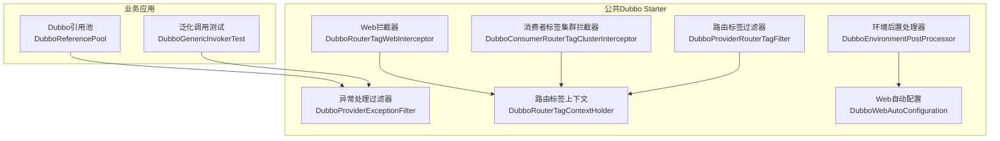
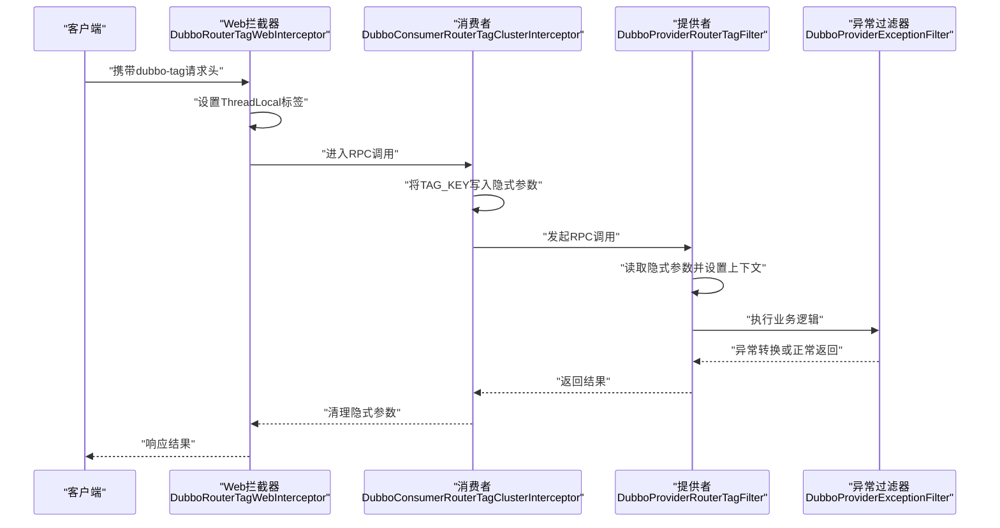
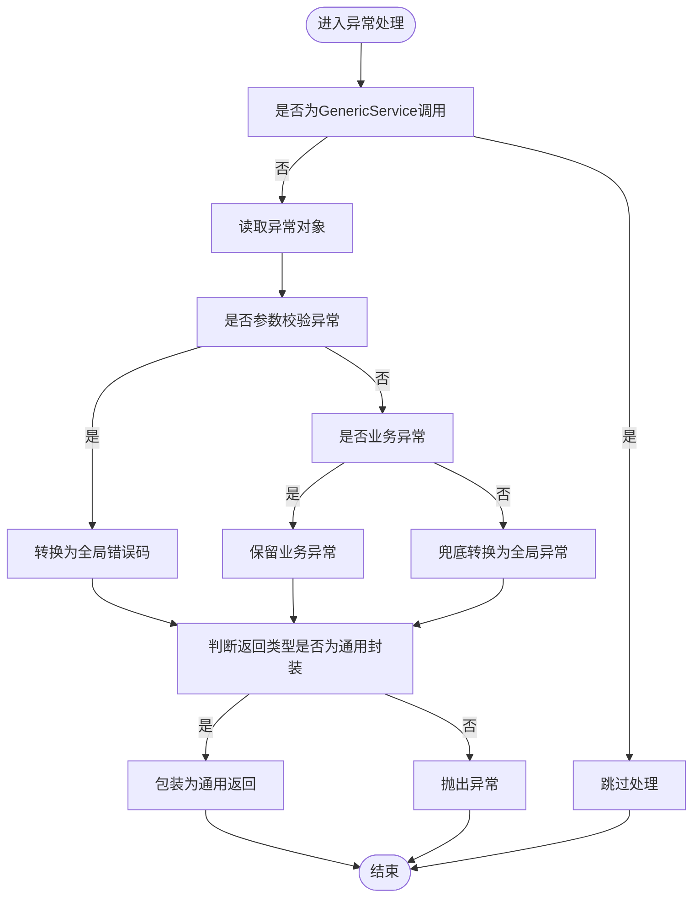
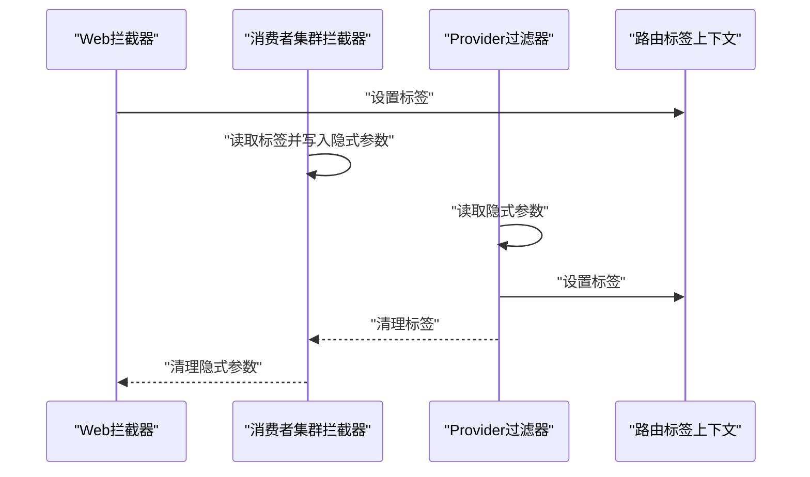
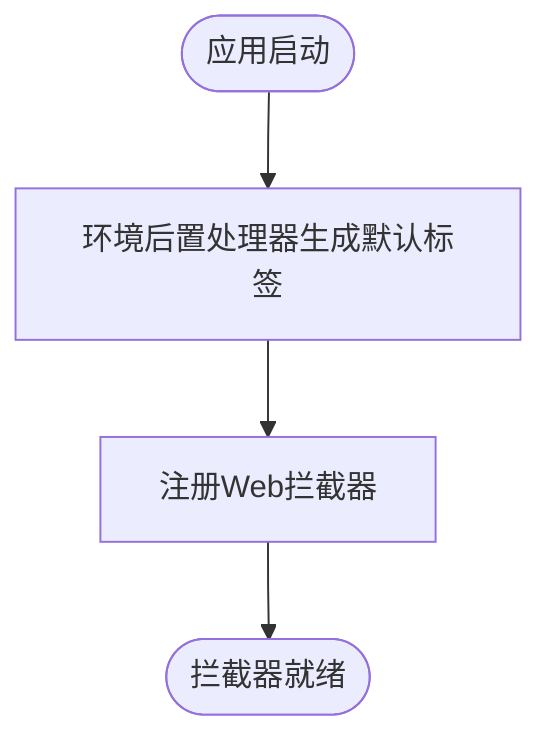
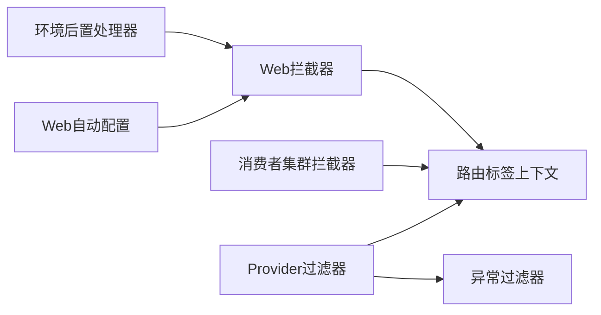

# 熔断与容错

<cite>
**本文引用的文件**
- [DubboProviderExceptionFilter.java](file://common/mall-spring-boot-starter-dubbo/src/main/java/cn/iocoder/mall/dubbo/core/filter/DubboProviderExceptionFilter.java)
- [DubboProviderRouterTagFilter.java](file://common/mall-spring-boot-starter-dubbo/src/main/java/cn/iocoder/mall/dubbo/core/filter/DubboProviderRouterTagFilter.java)
- [DubboConsumerRouterTagClusterInterceptor.java](file://common/mall-spring-boot-starter-dubbo/src/main/java/cn/iocoder/mall/dubbo/core/cluster/interceptor/DubboConsumerRouterTagClusterInterceptor.java)
- [DubboRouterTagContextHolder.java](file://common/mall-spring-boot-starter-dubbo/src/main/java/cn/iocoder/mall/dubbo/core/router/DubboRouterTagContextHolder.java)
- [DubboRouterTagWebInterceptor.java](file://common/mall-spring-boot-starter-dubbo/src/main/java/cn/iocoder/mall/dubbo/core/web/DubboRouterTagWebInterceptor.java)
- [DubboEnvironmentPostProcessor.java](file://common/mall-spring-boot-starter-dubbo/src/main/java/cn/iocoder/mall/dubbo/config/DubboEnvironmentPostProcessor.java)
- [DubboWebAutoConfiguration.java](file://common/mall-spring-boot-starter-dubbo/src/main/java/cn/iocoder/mall/dubbo/config/DubboWebAutoConfiguration.java)
- [DubboReferencePool.java](file://pay-service-project/pay-service-app/src/main/java/cn/iocoder/mall/payservice/common/dubbo/DubboReferencePool.java)
- [DubboGenericInvokerTest.java](file://pay-service-project/pay-service-integration-test/src/test/java/cn/iocoder/mall/payservice/common/dubbo/DubboGenericInvokerTest.java)
</cite>

## 目录
1. [简介](#简介)
2. [项目结构](#项目结构)
3. [核心组件](#核心组件)
4. [架构总览](#架构总览)
5. [详细组件分析](#详细组件分析)
6. [依赖分析](#依赖分析)
7. [性能考虑](#性能考虑)
8. [故障排查指南](#故障排查指南)
9. [结论](#结论)
10. [附录](#附录)

## 简介
本文件聚焦Onemall中基于Dubbo的熔断与容错机制，系统性梳理异常处理过滤器、路由标签（Tag）与集群拦截器的协作方式，解释服务降级策略（超时降级、异常降级、限流降级）与流量控制（并发控制、QPS限制、资源隔离），并给出熔断器配置与故障恢复建议，帮助开发者构建高可用的微服务系统。

## 项目结构
围绕Dubbo的熔断与容错能力，Onemall在公共模块中提供了异常处理、路由标签、Web拦截器与环境配置等基础设施，并在具体业务应用中通过引用池与测试验证其效果。

图表来源
- [DubboProviderExceptionFilter.java:1-115](file://common/mall-spring-boot-starter-dubbo/src/main/java/cn/iocoder/mall/dubbo/core/filter/DubboProviderExceptionFilter.java#L1-L115)
- [DubboProviderRouterTagFilter.java:1-46](file://common/mall-spring-boot-starter-dubbo/src/main/java/cn/iocoder/mall/dubbo/core/filter/DubboProviderRouterTagFilter.java#L1-L46)
- [DubboConsumerRouterTagClusterInterceptor.java:1-38](file://common/mall-spring-boot-starter-dubbo/src/main/java/cn/iocoder/mall/dubbo/core/cluster/interceptor/DubboConsumerRouterTagClusterInterceptor.java#L1-L38)
- [DubboRouterTagContextHolder.java:1-28](file://common/mall-spring-boot-starter-dubbo/src/main/java/cn/iocoder/mall/dubbo/core/router/DubboRouterTagContextHolder.java#L1-L28)
- [DubboRouterTagWebInterceptor.java:1-46](file://common/mall-spring-boot-starter-dubbo/src/main/java/cn/iocoder/mall/dubbo/core/web/DubboRouterTagWebInterceptor.java#L1-L46)
- [DubboEnvironmentPostProcessor.java:1-67](file://common/mall-spring-boot-starter-dubbo/src/main/java/cn/iocoder/mall/dubbo/config/DubboEnvironmentPostProcessor.java#L1-L67)
- [DubboWebAutoConfiguration.java:1-32](file://common/mall-spring-boot-starter-dubbo/src/main/java/cn/iocoder/mall/dubbo/config/DubboWebAutoConfiguration.java#L1-L32)
- [DubboReferencePool.java](file://pay-service-project/pay-service-app/src/main/java/cn/iocoder/mall/payservice/common/dubbo/DubboReferencePool.java)
- [DubboGenericInvokerTest.java](file://pay-service-project/pay-service-integration-test/src/test/java/cn/iocoder/mall/payservice/common/dubbo/DubboGenericInvokerTest.java)

章节来源
- [DubboProviderExceptionFilter.java:1-115](file://common/mall-spring-boot-starter-dubbo/src/main/java/cn/iocoder/mall/dubbo/core/filter/DubboProviderExceptionFilter.java#L1-L115)
- [DubboProviderRouterTagFilter.java:1-46](file://common/mall-spring-boot-starter-dubbo/src/main/java/cn/iocoder/mall/dubbo/core/filter/DubboProviderRouterTagFilter.java#L1-L46)
- [DubboConsumerRouterTagClusterInterceptor.java:1-38](file://common/mall-spring-boot-starter-dubbo/src/main/java/cn/iocoder/mall/dubbo/core/cluster/interceptor/DubboConsumerRouterTagClusterInterceptor.java#L1-L38)
- [DubboRouterTagContextHolder.java:1-28](file://common/mall-spring-boot-starter-dubbo/src/main/java/cn/iocoder/mall/dubbo/core/router/DubboRouterTagContextHolder.java#L1-L28)
- [DubboRouterTagWebInterceptor.java:1-46](file://common/mall-spring-boot-starter-dubbo/src/main/java/cn/iocoder/mall/dubbo/core/web/DubboRouterTagWebInterceptor.java#L1-L46)
- [DubboEnvironmentPostProcessor.java:1-67](file://common/mall-spring-boot-starter-dubbo/src/main/java/cn/iocoder/mall/dubbo/config/DubboEnvironmentPostProcessor.java#L1-L67)
- [DubboWebAutoConfiguration.java:1-32](file://common/mall-spring-boot-starter-dubbo/src/main/java/cn/iocoder/mall/dubbo/config/DubboWebAutoConfiguration.java#L1-L32)
- [DubboReferencePool.java](file://pay-service-project/pay-service-app/src/main/java/cn/iocoder/mall/payservice/common/dubbo/DubboReferencePool.java)
- [DubboGenericInvokerTest.java](file://pay-service-project/pay-service-integration-test/src/test/java/cn/iocoder/mall/payservice/common/dubbo/DubboGenericInvokerTest.java)

## 核心组件
- 异常处理过滤器：统一捕获并转换Provider端异常，确保返回类型与序列化安全，减少下游反序列化风险。
- 路由标签过滤器与集群拦截器：通过隐式参数传递Tag，结合Dubbo内置TagRouter实现本地优先调用与跨服务链路透传。
- 路由标签上下文：线程本地存储当前请求的Tag，贯穿Web拦截器、集群拦截器与Provider过滤器。
- 环境后置处理器与Web自动配置：为本地开发生成默认Tag，注册Web拦截器以启用Header驱动的标签路由。
- 业务引用池与测试：在应用侧通过引用池管理Dubbo引用，配合测试验证泛化调用与异常处理行为。

章节来源
- [DubboProviderExceptionFilter.java:21-66](file://common/mall-spring-boot-starter-dubbo/src/main/java/cn/iocoder/mall/dubbo/core/filter/DubboProviderExceptionFilter.java#L21-L66)
- [DubboProviderRouterTagFilter.java:23-43](file://common/mall-spring-boot-starter-dubbo/src/main/java/cn/iocoder/mall/dubbo/core/filter/DubboProviderRouterTagFilter.java#L23-L43)
- [DubboConsumerRouterTagClusterInterceptor.java:19-35](file://common/mall-spring-boot-starter-dubbo/src/main/java/cn/iocoder/mall/dubbo/core/cluster/interceptor/DubboConsumerRouterTagClusterInterceptor.java#L19-L35)
- [DubboRouterTagContextHolder.java:11-25](file://common/mall-spring-boot-starter-dubbo/src/main/java/cn/iocoder/mall/dubbo/core/router/DubboRouterTagContextHolder.java#L11-L25)
- [DubboRouterTagWebInterceptor.java:20-43](file://common/mall-spring-boot-starter-dubbo/src/main/java/cn/iocoder/mall/dubbo/core/web/DubboRouterTagWebInterceptor.java#L20-L43)
- [DubboEnvironmentPostProcessor.java:21-44](file://common/mall-spring-boot-starter-dubbo/src/main/java/cn/iocoder/mall/dubbo/config/DubboEnvironmentPostProcessor.java#L21-L44)
- [DubboWebAutoConfiguration.java:12-29](file://common/mall-spring-boot-starter-dubbo/src/main/java/cn/iocoder/mall/dubbo/config/DubboWebAutoConfiguration.java#L12-L29)
- [DubboReferencePool.java](file://pay-service-project/pay-service-app/src/main/java/cn/iocoder/mall/payservice/common/dubbo/DubboReferencePool.java)
- [DubboGenericInvokerTest.java](file://pay-service-project/pay-service-integration-test/src/test/java/cn/iocoder/mall/payservice/common/dubbo/DubboGenericInvokerTest.java)

## 架构总览
下图展示一次典型请求在Onemall中的熔断与容错流转：Web层通过拦截器设置Tag，消费者在发起RPC前将Tag写入隐式参数，Provider端读取并设置上下文，随后执行业务逻辑并在必要时进行异常转换与降级处理。

图表来源
- [DubboRouterTagWebInterceptor.java:26-43](file://common/mall-spring-boot-starter-dubbo/src/main/java/cn/iocoder/mall/dubbo/core/web/DubboRouterTagWebInterceptor.java#L26-L43)
- [DubboConsumerRouterTagClusterInterceptor.java:22-35](file://common/mall-spring-boot-starter-dubbo/src/main/java/cn/iocoder/mall/dubbo/core/cluster/interceptor/DubboConsumerRouterTagClusterInterceptor.java#L22-L35)
- [DubboProviderRouterTagFilter.java:26-43](file://common/mall-spring-boot-starter-dubbo/src/main/java/cn/iocoder/mall/dubbo/core/filter/DubboProviderRouterTagFilter.java#L26-L43)
- [DubboProviderExceptionFilter.java:26-61](file://common/mall-spring-boot-starter-dubbo/src/main/java/cn/iocoder/mall/dubbo/core/filter/DubboProviderExceptionFilter.java#L26-L61)

## 详细组件分析

### 异常处理过滤器（DubboProviderExceptionFilter）
职责与流程
- 在Provider端对调用结果进行后处理，识别并转换异常类型。
- 将参数校验类异常转换为全局错误码，业务异常保持原样或包装为通用返回类型。
- 对非业务异常进行兜底转换，避免反序列化问题影响下游。
- 若方法返回类型为通用结果封装类型，则将异常转换为统一返回对象。

关键点
- 仅对非泛化调用场景生效，避免对GenericService造成误判。
- 对返回类型进行严格判断，确保兼容性。
- 记录异常日志，便于定位根因。

图表来源
- [DubboProviderExceptionFilter.java:31-61](file://common/mall-spring-boot-starter-dubbo/src/main/java/cn/iocoder/mall/dubbo/core/filter/DubboProviderExceptionFilter.java#L31-L61)
- [DubboProviderExceptionFilter.java:88-107](file://common/mall-spring-boot-starter-dubbo/src/main/java/cn/iocoder/mall/dubbo/core/filter/DubboProviderExceptionFilter.java#L88-L107)

章节来源
- [DubboProviderExceptionFilter.java:21-115](file://common/mall-spring-boot-starter-dubbo/src/main/java/cn/iocoder/mall/dubbo/core/filter/DubboProviderExceptionFilter.java#L21-L115)

### 路由标签过滤器与集群拦截器（DubboProviderRouterTagFilter、DubboConsumerRouterTagClusterInterceptor）
职责与流程
- Web层拦截器从请求头读取标签并写入线程上下文。
- 消费者在调用前将标签写入Dubbo隐式参数，供Provider读取。
- Provider端读取隐式参数，设置上下文，以便后续链路复用标签。
- 调用完成后清理上下文，避免泄漏。

图表来源
- [DubboRouterTagWebInterceptor.java:26-43](file://common/mall-spring-boot-starter-dubbo/src/main/java/cn/iocoder/mall/dubbo/core/web/DubboRouterTagWebInterceptor.java#L26-L43)
- [DubboConsumerRouterTagClusterInterceptor.java:22-35](file://common/mall-spring-boot-starter-dubbo/src/main/java/cn/iocoder/mall/dubbo/core/cluster/interceptor/DubboConsumerRouterTagClusterInterceptor.java#L22-L35)
- [DubboProviderRouterTagFilter.java:26-43](file://common/mall-spring-boot-starter-dubbo/src/main/java/cn/iocoder/mall/dubbo/core/filter/DubboProviderRouterTagFilter.java#L26-L43)
- [DubboRouterTagContextHolder.java:11-25](file://common/mall-spring-boot-starter-dubbo/src/main/java/cn/iocoder/mall/dubbo/core/router/DubboRouterTagContextHolder.java#L11-L25)

章节来源
- [DubboProviderRouterTagFilter.java:23-43](file://common/mall-spring-boot-starter-dubbo/src/main/java/cn/iocoder/mall/dubbo/core/filter/DubboProviderRouterTagFilter.java#L23-L43)
- [DubboConsumerRouterTagClusterInterceptor.java:19-35](file://common/mall-spring-boot-starter-dubbo/src/main/java/cn/iocoder/mall/dubbo/core/cluster/interceptor/DubboConsumerRouterTagClusterInterceptor.java#L19-L35)
- [DubboRouterTagContextHolder.java:11-25](file://common/mall-spring-boot-starter-dubbo/src/main/java/cn/iocoder/mall/dubbo/core/router/DubboRouterTagContextHolder.java#L11-L25)
- [DubboRouterTagWebInterceptor.java:20-43](file://common/mall-spring-boot-starter-dubbo/src/main/java/cn/iocoder/mall/dubbo/core/web/DubboRouterTagWebInterceptor.java#L20-L43)

### 环境后置处理器与Web自动配置（DubboEnvironmentPostProcessor、DubboWebAutoConfiguration）
职责与流程
- 环境后置处理器在启动时生成默认的路由标签值，用于本地开发环境。
- Web自动配置在Web环境中注册拦截器，使请求头中的标签生效。

图表来源
- [DubboEnvironmentPostProcessor.java:33-44](file://common/mall-spring-boot-starter-dubbo/src/main/java/cn/iocoder/mall/dubbo/config/DubboEnvironmentPostProcessor.java#L33-L44)
- [DubboWebAutoConfiguration.java:20-29](file://common/mall-spring-boot-starter-dubbo/src/main/java/cn/iocoder/mall/dubbo/config/DubboWebAutoConfiguration.java#L20-L29)

章节来源
- [DubboEnvironmentPostProcessor.java:21-67](file://common/mall-spring-boot-starter-dubbo/src/main/java/cn/iocoder/mall/dubbo/config/DubboEnvironmentPostProcessor.java#L21-L67)
- [DubboWebAutoConfiguration.java:12-32](file://common/mall-spring-boot-starter-dubbo/src/main/java/cn/iocoder/mall/dubbo/config/DubboWebAutoConfiguration.java#L12-L32)

### 业务侧引用池与测试（DubboReferencePool、DubboGenericInvokerTest）
职责与流程
- 应用侧通过引用池管理Dubbo引用，便于集中配置与生命周期管理。
- 测试用例验证泛化调用与异常处理链路，确保异常过滤器按预期工作。

章节来源
- [DubboReferencePool.java](file://pay-service-project/pay-service-app/src/main/java/cn/iocoder/mall/payservice/common/dubbo/DubboReferencePool.java)
- [DubboGenericInvokerTest.java](file://pay-service-project/pay-service-integration-test/src/test/java/cn/iocoder/mall/payservice/common/dubbo/DubboGenericInvokerTest.java)

## 依赖分析
- Web拦截器依赖路由标签上下文，负责初始化与清理。
- 消费者集群拦截器依赖Dubbo隐式参数机制，负责在调用前后设置与清理标签。
- Provider过滤器依赖Dubbo隐式参数与上下文，负责读取与清理标签。
- 异常过滤器独立运行于Provider端，与上述组件解耦，仅在结果阶段参与。
- 环境后置处理器与Web自动配置共同保障本地开发体验。

图表来源
- [DubboRouterTagWebInterceptor.java:20-43](file://common/mall-spring-boot-starter-dubbo/src/main/java/cn/iocoder/mall/dubbo/core/web/DubboRouterTagWebInterceptor.java#L20-L43)
- [DubboConsumerRouterTagClusterInterceptor.java:19-35](file://common/mall-spring-boot-starter-dubbo/src/main/java/cn/iocoder/mall/dubbo/core/cluster/interceptor/DubboConsumerRouterTagClusterInterceptor.java#L19-L35)
- [DubboProviderRouterTagFilter.java:23-43](file://common/mall-spring-boot-starter-dubbo/src/main/java/cn/iocoder/mall/dubbo/core/filter/DubboProviderRouterTagFilter.java#L23-L43)
- [DubboProviderExceptionFilter.java:21-66](file://common/mall-spring-boot-starter-dubbo/src/main/java/cn/iocoder/mall/dubbo/core/filter/DubboProviderExceptionFilter.java#L21-L66)
- [DubboEnvironmentPostProcessor.java:21-44](file://common/mall-spring-boot-starter-dubbo/src/main/java/cn/iocoder/mall/dubbo/config/DubboEnvironmentPostProcessor.java#L21-L44)
- [DubboWebAutoConfiguration.java:12-29](file://common/mall-spring-boot-starter-dubbo/src/main/java/cn/iocoder/mall/dubbo/config/DubboWebAutoConfiguration.java#L12-L29)

## 性能考虑
- 异常处理过滤器仅在出现异常时介入，正常路径开销极低。
- 路由标签通过隐式参数传递，避免额外网络往返，但需注意参数大小与序列化成本。
- 集群拦截器在调用前后各做一次上下文设置与清理，属于轻量操作。
- 建议在高并发场景下结合QPS限制与资源隔离策略，避免热点服务被压垮。

## 故障排查指南
常见问题与定位思路
- 异常未按预期转换：确认Provider端返回类型是否为通用封装类型，以及异常是否为业务异常。
- 标签未生效：检查请求头是否包含正确的标签键名，Web拦截器是否成功设置上下文，消费者是否正确写入隐式参数。
- 本地开发标签冲突：通过环境后置处理器生成唯一标签，避免多机冲突。
- 泛化调用异常：结合测试用例验证异常链路，确保异常过滤器覆盖泛化场景。

章节来源
- [DubboProviderExceptionFilter.java:31-61](file://common/mall-spring-boot-starter-dubbo/src/main/java/cn/iocoder/mall/dubbo/core/filter/DubboProviderExceptionFilter.java#L31-L61)
- [DubboRouterTagWebInterceptor.java:26-43](file://common/mall-spring-boot-starter-dubbo/src/main/java/cn/iocoder/mall/dubbo/core/web/DubboRouterTagWebInterceptor.java#L26-L43)
- [DubboConsumerRouterTagClusterInterceptor.java:22-35](file://common/mall-spring-boot-starter-dubbo/src/main/java/cn/iocoder/mall/dubbo/core/cluster/interceptor/DubboConsumerRouterTagClusterInterceptor.java#L22-L35)
- [DubboGenericInvokerTest.java](file://pay-service-project/pay-service-integration-test/src/test/java/cn/iocoder/mall/payservice/common/dubbo/DubboGenericInvokerTest.java)

## 结论
Onemall通过异常处理过滤器、路由标签体系与Web自动配置，构建了完善的Dubbo熔断与容错基础能力。异常过滤器确保错误信息可序列化与统一返回，路由标签实现本地优先与跨服务链路透传，环境与自动配置提升本地开发效率。结合QPS限制、资源隔离与合理的降级策略，可进一步增强系统的稳定性与可用性。

## 附录
- 服务降级策略建议
  - 超时降级：对长尾请求设置合理超时阈值，超时即降级为缓存或默认值。
  - 异常降级：对高频异常进行熔断，达到阈值后快速失败并返回降级结果。
  - 限流降级：在入口处进行QPS与并发数限制，超过阈值触发限流与排队策略。
- 流量控制机制建议
  - 并发控制：限制每个接口的并发请求数，防止资源耗尽。
  - QPS限制：基于令牌桶或漏桶算法控制请求速率。
  - 资源隔离：通过线程池与信号量隔离关键资源，避免级联故障。
- 熔断器配置与故障恢复
  - 配置：设置熔断时间窗口、最小请求数、错误率阈值与半开探测频率。
  - 恢复：在健康窗口内逐步放行试探流量，观察指标稳定后再完全恢复。