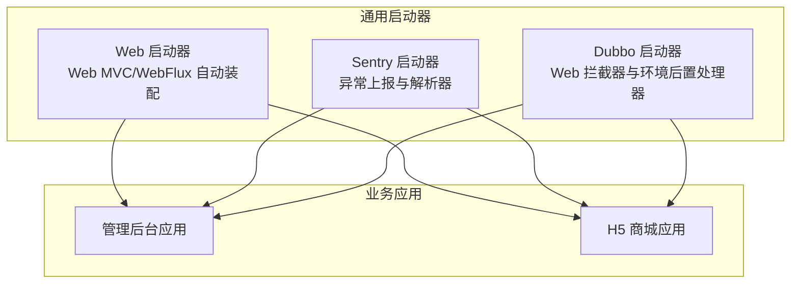
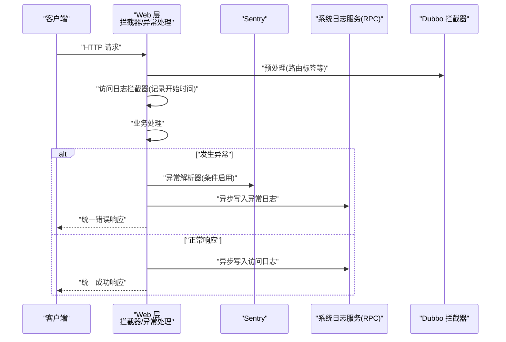
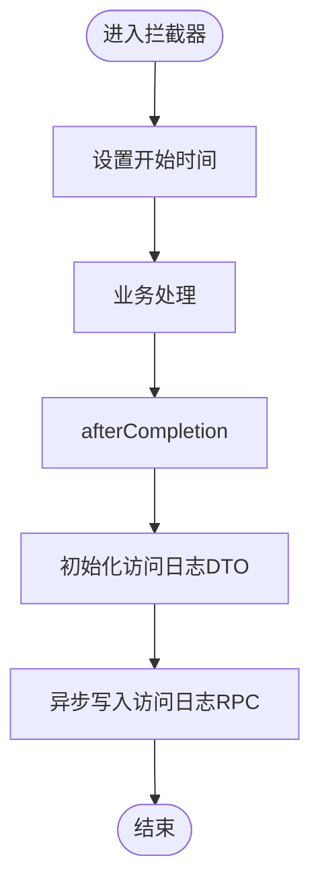
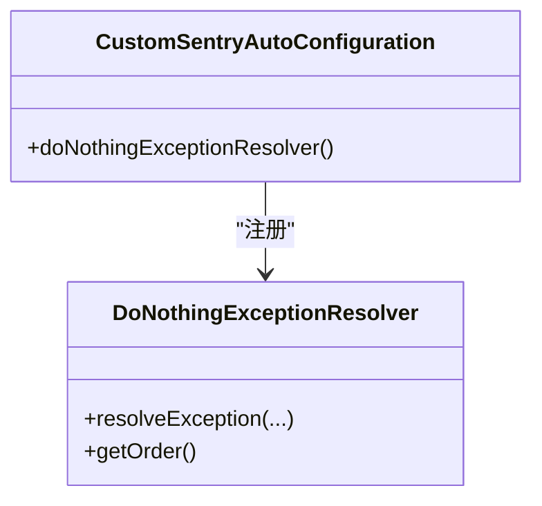
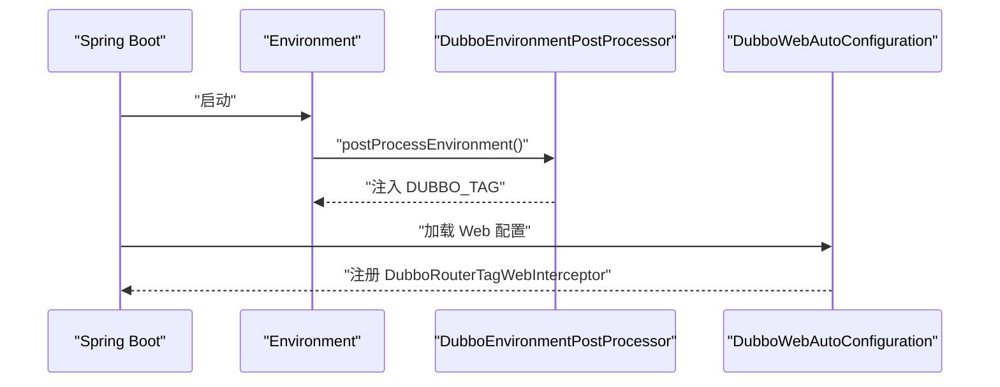
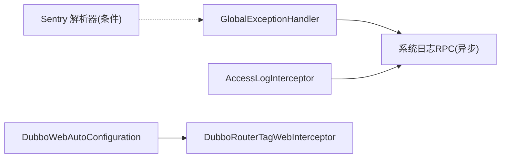

# 监控与追踪

<cite>
**本文引用的文件**
- [CustomSentryAutoConfiguration.java](file://common/mall-spring-boot-starter-sentry/src/main/java/cn/iocoder/mall/sentry/config/CustomSentryAutoConfiguration.java)
- [DoNothingExceptionResolver.java](file://common/mall-spring-boot-starter-sentry/src/main/java/cn/iocoder/mall/sentry/resolver/DoNothingExceptionResolver.java)
- [CommonWebAutoConfiguration.java](file://common/mall-spring-boot-starter-web/src/main/java/cn/iocoder/mall/web/config/CommonWebAutoConfiguration.java)
- [GlobalExceptionHandler.java](file://common/mall-spring-boot-starter-web/src/main/java/cn/iocoder/mall/web/core/handler/GlobalExceptionHandler.java)
- [AccessLogInterceptor.java](file://common/mall-spring-boot-starter-web/src/main/java/cn/iocoder/mall/web/core/interceptor/AccessLogInterceptor.java)
- [CorsFilter.java](file://common/mall-spring-boot-starter-web/src/main/java/cn/iocoder/mall/web/core/servlet/CorsFilter.java)
- [DubboWebAutoConfiguration.java](file://common/mall-spring-boot-starter-dubbo/src/main/java/cn/iocoder/mall/dubbo/config/DubboWebAutoConfiguration.java)
- [DubboEnvironmentPostProcessor.java](file://common/mall-spring-boot-starter-dubbo/src/main/java/cn/iocoder/mall/dubbo/config/DubboEnvironmentPostProcessor.java)
- [spring.factories（Sentry）](file://common/mall-spring-boot-starter-sentry/src/main/resources/META-INF/spring.factories)
- [spring.factories（Web）](file://common/mall-spring-boot-starter-web/src/main/resources/META-INF/spring.factories)
- [spring.factories（Dubbo）](file://common/mall-spring-boot-starter-dubbo/src/main/resources/META-INF/spring.factories)
</cite>

## 目录
1. [简介](#简介)
2. [项目结构](#项目结构)
3. [核心组件](#核心组件)
4. [架构总览](#架构总览)
5. [详细组件分析](#详细组件分析)
6. [依赖分析](#依赖分析)
7. [性能考量](#性能考量)
8. [故障排查指南](#故障排查指南)
9. [结论](#结论)
10. [附录](#附录)

## 简介
本文件面向 Onemall 的监控与追踪体系，聚焦以下目标：
- 应用监控：指标收集、健康检查、性能监控
- 链路追踪：请求跟踪、调用链分析、问题定位
- 异常监控与错误处理：Sentry 集成、异常捕获、错误报告
- 监控仪表板：配置与使用建议，帮助运维实时掌握系统运行状态

通过对通用模块的自动装配与拦截器、异常处理、Dubbo 环境配置等关键代码进行逐层解析，形成从架构到落地实践的完整文档。

## 项目结构
Onemall 采用多模块分层设计，监控与追踪能力主要由以下通用 Starter 提供：
- web 启动器：统一 Web 层配置、全局异常处理、访问日志拦截、跨域过滤
- sentry 启动器：Sentry 自动配置与异常解析器覆盖
- dubbo 启动器：Dubbo Web 自动装配、环境变量后置处理器

图示来源
- [spring.factories（Web）](file://common/mall-spring-boot-starter-web/src/main/resources/META-INF/spring.factories)
- [spring.factories（Sentry）](file://common/mall-spring-boot-starter-sentry/src/main/resources/META-INF/spring.factories)
- [spring.factories（Dubbo）](file://common/mall-spring-boot-starter-dubbo/src/main/resources/META-INF/spring.factories)

章节来源
- [spring.factories（Web）](file://common/mall-spring-boot-starter-web/src/main/resources/META-INF/spring.factories)
- [spring.factories（Sentry）](file://common/mall-spring-boot-starter-sentry/src/main/resources/META-INF/spring.factories)
- [spring.factories（Dubbo）](file://common/mall-spring-boot-starter-dubbo/src/main/resources/META-INF/spring.factories)

## 核心组件
- 全局异常处理与访问日志
  - 全局异常处理器负责将各类异常统一转为标准返回，并异步落库系统异常日志
  - 访问日志拦截器记录请求维度的关键指标并异步入库
- Sentry 集成
  - 自动配置类按条件启用 Sentry 并覆盖默认异常解析器，避免重复上报
- Dubbo 相关
  - Web 自动装配注册拦截器，环境后置处理器生成 DUBBO_TAG 以支持标签路由

章节来源
- [CommonWebAutoConfiguration.java](file://common/mall-spring-boot-starter-web/src/main/java/cn/iocoder/mall/web/config/CommonWebAutoConfiguration.java)
- [GlobalExceptionHandler.java](file://common/mall-spring-boot-starter-web/src/main/java/cn/iocoder/mall/web/core/handler/GlobalExceptionHandler.java)
- [AccessLogInterceptor.java](file://common/mall-spring-boot-starter-web/src/main/java/cn/iocoder/mall/web/core/interceptor/AccessLogInterceptor.java)
- [CustomSentryAutoConfiguration.java](file://common/mall-spring-boot-starter-sentry/src/main/java/cn/iocoder/mall/sentry/config/CustomSentryAutoConfiguration.java)
- [DoNothingExceptionResolver.java](file://common/mall-spring-boot-starter-sentry/src/main/java/cn/iocoder/mall/sentry/resolver/DoNothingExceptionResolver.java)
- [DubboWebAutoConfiguration.java](file://common/mall-spring-boot-starter-dubbo/src/main/java/cn/iocoder/mall/dubbo/config/DubboWebAutoConfiguration.java)
- [DubboEnvironmentPostProcessor.java](file://common/mall-spring-boot-starter-dubbo/src/main/java/cn/iocoder/mall/dubbo/config/DubboEnvironmentPostProcessor.java)

## 架构总览
下图展示监控与追踪在请求生命周期中的关键节点与组件交互：

图示来源
- [AccessLogInterceptor.java](file://common/mall-spring-boot-starter-web/src/main/java/cn/iocoder/mall/web/core/interceptor/AccessLogInterceptor.java)
- [GlobalExceptionHandler.java](file://common/mall-spring-boot-starter-web/src/main/java/cn/iocoder/mall/web/core/handler/GlobalExceptionHandler.java)
- [CustomSentryAutoConfiguration.java](file://common/mall-spring-boot-starter-sentry/src/main/java/cn/iocoder/mall/sentry/config/CustomSentryAutoConfiguration.java)
- [DoNothingExceptionResolver.java](file://common/mall-spring-boot-starter-sentry/src/main/java/cn/iocoder/mall/sentry/resolver/DoNothingExceptionResolver.java)
- [DubboWebAutoConfiguration.java](file://common/mall-spring-boot-starter-dubbo/src/main/java/cn/iocoder/mall/dubbo/config/DubboWebAutoConfiguration.java)

## 详细组件分析

### Web 层：全局异常处理与访问日志
- 全局异常处理
  - 统一捕获参数缺失、类型不匹配、参数校验失败、资源不存在、方法不允许、业务异常、全局异常、Dubbo 参数校验异常以及兜底异常
  - 对系统内部错误进行异步落库，包含堆栈、根因、调用方信息、TraceId 等
- 访问日志拦截
  - 记录请求开始时间、响应码/消息、TraceId、应用名、URI、查询串、方法、UA、IP、耗时等
  - 异步写入系统访问日志 RPC

图示来源
- [AccessLogInterceptor.java](file://common/mall-spring-boot-starter-web/src/main/java/cn/iocoder/mall/web/core/interceptor/AccessLogInterceptor.java)

章节来源
- [CommonWebAutoConfiguration.java](file://common/mall-spring-boot-starter-web/src/main/java/cn/iocoder/mall/web/config/CommonWebAutoConfiguration.java)
- [GlobalExceptionHandler.java](file://common/mall-spring-boot-starter-web/src/main/java/cn/iocoder/mall/web/core/handler/GlobalExceptionHandler.java)
- [AccessLogInterceptor.java](file://common/mall-spring-boot-starter-web/src/main/java/cn/iocoder/mall/web/core/interceptor/AccessLogInterceptor.java)

### Sentry 集成：异常捕获与上报
- 自动配置
  - 条件启用：仅当存在 HandlerExceptionResolver/Sentry、Web 应用、且 sentry.enabled=true 时生效
  - 覆盖默认异常解析器：当未检测到 SentryAutoConfiguration 时，注入 DoNothingExceptionResolver，避免与日志 appender 重复上报
- 异常解析器
  - DoNothingExceptionResolver 返回 null，交由其他解析器继续处理，确保统一错误响应与日志落库

图示来源
- [CustomSentryAutoConfiguration.java](file://common/mall-spring-boot-starter-sentry/src/main/java/cn/iocoder/mall/sentry/config/CustomSentryAutoConfiguration.java)
- [DoNothingExceptionResolver.java](file://common/mall-spring-boot-starter-sentry/src/main/java/cn/iocoder/mall/sentry/resolver/DoNothingExceptionResolver.java)

章节来源
- [CustomSentryAutoConfiguration.java](file://common/mall-spring-boot-starter-sentry/src/main/java/cn/iocoder/mall/sentry/config/CustomSentryAutoConfiguration.java)
- [DoNothingExceptionResolver.java](file://common/mall-spring-boot-starter-sentry/src/main/java/cn/iocoder/mall/sentry/resolver/DoNothingExceptionResolver.java)

### Dubbo 相关：Web 拦截与环境配置
- Web 自动装配
  - 注册 DubboRouterTagWebInterceptor，优先级较低，确保在认证等前置逻辑之后执行
- 环境后置处理器
  - 生成 DUBBO_TAG 属性，默认取主机名，否则生成随机值，便于本地开发环境下的标签路由

图示来源
- [DubboEnvironmentPostProcessor.java](file://common/mall-spring-boot-starter-dubbo/src/main/java/cn/iocoder/mall/dubbo/config/DubboEnvironmentPostProcessor.java)
- [DubboWebAutoConfiguration.java](file://common/mall-spring-boot-starter-dubbo/src/main/java/cn/iocoder/mall/dubbo/config/DubboWebAutoConfiguration.java)

章节来源
- [DubboWebAutoConfiguration.java](file://common/mall-spring-boot-starter-dubbo/src/main/java/cn/iocoder/mall/dubbo/config/DubboWebAutoConfiguration.java)
- [DubboEnvironmentPostProcessor.java](file://common/mall-spring-boot-starter-dubbo/src/main/java/cn/iocoder/mall/dubbo/config/DubboEnvironmentPostProcessor.java)

### 跨域与消息转换
- 跨域过滤器
  - 设置允许来源、方法、头、预检有效期；对 OPTIONS 方法直接返回
- 消息转换器
  - 使用 Fastjson，禁用循环引用检测，键值序列化策略适配前端

章节来源
- [CorsFilter.java](file://common/mall-spring-boot-starter-web/src/main/java/cn/iocoder/mall/web/core/servlet/CorsFilter.java)
- [CommonWebAutoConfiguration.java](file://common/mall-spring-boot-starter-web/src/main/java/cn/iocoder/mall/web/config/CommonWebAutoConfiguration.java)

## 依赖分析
- 组件耦合
  - Web 层异常处理与访问日志均依赖系统日志 RPC（异步写入），降低同步阻塞风险
  - Sentry 与 Web 层解耦，通过条件装配与解析器覆盖实现互补
  - Dubbo 相关组件与 Web 层通过拦截器配合，不影响业务处理主干
- 外部依赖
  - 系统日志 RPC：用于异常/访问日志持久化
  - Sentry：可选的错误上报通道
  - Dubbo：服务治理与标签路由

图示来源
- [GlobalExceptionHandler.java](file://common/mall-spring-boot-starter-web/src/main/java/cn/iocoder/mall/web/core/handler/GlobalExceptionHandler.java)
- [AccessLogInterceptor.java](file://common/mall-spring-boot-starter-web/src/main/java/cn/iocoder/mall/web/core/interceptor/AccessLogInterceptor.java)
- [CustomSentryAutoConfiguration.java](file://common/mall-spring-boot-starter-sentry/src/main/java/cn/iocoder/mall/sentry/config/CustomSentryAutoConfiguration.java)
- [DubboWebAutoConfiguration.java](file://common/mall-spring-boot-starter-dubbo/src/main/java/cn/iocoder/mall/dubbo/config/DubboWebAutoConfiguration.java)

## 性能考量
- 异步落库
  - 访问日志与异常日志均采用异步写入，避免阻塞主线程
- 资源释放与异常兜底
  - 拦截器与异常处理器内均对落库异常进行日志记录与吞吐，防止单点故障扩散
- 跨域与消息转换
  - 跨域过滤器对 OPTIONS 预检快速放行，减少握手开销
  - Fastjson 配置减少序列化成本，避免循环引用带来的额外处理

## 故障排查指南
- 异常未上报或重复上报
  - 检查 sentry.enabled 是否开启；确认是否同时启用了日志 appender 与 Sentry
  - 若出现重复上报，确认 DoNothingExceptionResolver 是否被注册
- 异常日志未入库
  - 检查系统日志 RPC 可用性与网络连通性
  - 查看异步写入线程池与队列状态
- 访问日志缺失
  - 确认拦截器已注册且未被覆盖
  - 检查应用是否正确生成 TraceId
- Dubbo 标签路由无效
  - 检查 DUBBO_TAG 是否注入成功
  - 确认拦截器顺序与业务前置逻辑冲突

章节来源
- [CustomSentryAutoConfiguration.java](file://common/mall-spring-boot-starter-sentry/src/main/java/cn/iocoder/mall/sentry/config/CustomSentryAutoConfiguration.java)
- [DoNothingExceptionResolver.java](file://common/mall-spring-boot-starter-sentry/src/main/java/cn/iocoder/mall/sentry/resolver/DoNothingExceptionResolver.java)
- [GlobalExceptionHandler.java](file://common/mall-spring-boot-starter-web/src/main/java/cn/iocoder/mall/web/core/handler/GlobalExceptionHandler.java)
- [AccessLogInterceptor.java](file://common/mall-spring-boot-starter-web/src/main/java/cn/iocoder/mall/web/core/interceptor/AccessLogInterceptor.java)
- [DubboEnvironmentPostProcessor.java](file://common/mall-spring-boot-starter-dubbo/src/main/java/cn/iocoder/mall/dubbo/config/DubboEnvironmentPostProcessor.java)

## 结论
Onemall 的监控与追踪体系以“统一异常处理 + 访问日志 + Sentry 可选上报 + Dubbo 标签路由”为核心，通过异步落库与条件装配实现低侵入、高可用的可观测性。结合系统日志 RPC，可满足异常定位、性能分析与问题溯源的需求。

## 附录
- 配置建议
  - 开启 sentry.enabled=true 以启用 Sentry 上报（可选）
  - 确保系统日志 RPC 可用，保障异常与访问日志持久化
  - 本地开发时可通过 DUBBO_TAG 控制标签路由，便于灰度与隔离测试
- 仪表板建议
  - 基于访问日志与异常日志构建基础看板（请求量、错误率、P95/P99 响应时间、异常 TopN）
  - 结合 Sentry 的错误趋势与用户影响面进行告警联动