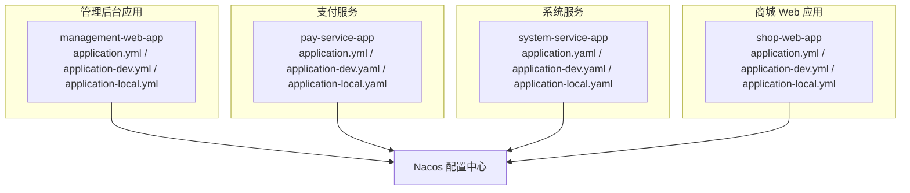
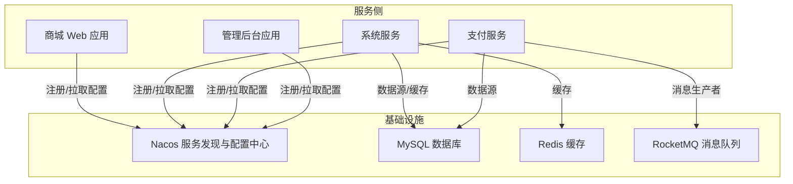
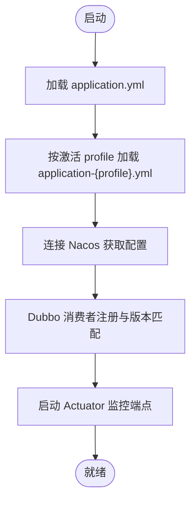
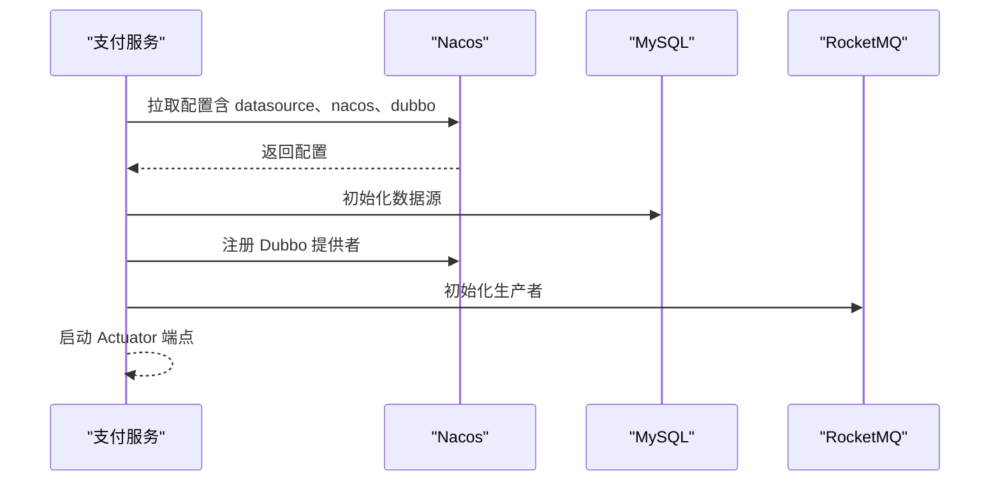
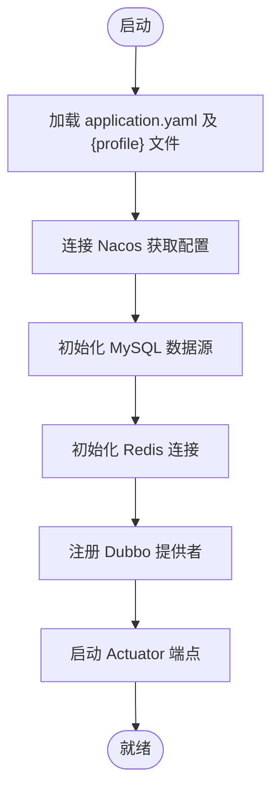
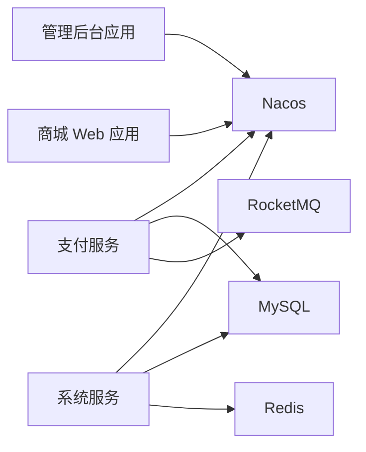

# 配置管理

<cite>
**本文引用的文件**
- [application.yml](file://management-web-app/src/main/resources/application.yml)
- [application-dev.yml](file://management-web-app/src/main/resources/application-dev.yml)
- [application-local.yml](file://management-web-app/src/main/resources/application-local.yml)
- [application.yml](file://pay-service-project/pay-service-app/src/main/resources/application.yml)
- [application-dev.yaml](file://pay-service-project/pay-service-app/src/main/resources/application-dev.yaml)
- [application-local.yaml](file://pay-service-project/pay-service-app/src/main/resources/application-local.yaml)
- [application.yaml](file://system-service-project/system-service-app/src/main/resources/application.yaml)
- [application-dev.yaml](file://system-service-project/system-service-app/src/main/resources/application-dev.yaml)
- [application-local.yaml](file://system-service-project/system-service-app/src/main/resources/application-local.yaml)
- [application.yml](file://shop-web-app/src/main/resources/application.yml)
- [application-dev.yml](file://shop-web-app/src/main/resources/application-dev.yml)
- [application-local.yml](file://shop-web-app/src/main/resources/application-local.yml)
</cite>

## 目录
1. [简介](#简介)
2. [项目结构](#项目结构)
3. [核心组件](#核心组件)
4. [架构总览](#架构总览)
5. [详细组件分析](#详细组件分析)
6. [依赖分析](#依赖分析)
7. [性能考虑](#性能考虑)
8. [故障排除指南](#故障排除指南)
9. [结论](#结论)
10. [附录](#附录)

## 简介
本文件系统化梳理 Onemall 的配置管理体系，重点覆盖以下方面：
- 配置中心接入：基于 Nacos 的服务发现与配置中心集成方式
- 配置热更新：通过 Spring Cloud Alibaba Nacos 实现的配置动态刷新机制
- 配置版本管理：以命名空间（namespace）区分不同环境，结合服务版本号进行治理
- 多环境策略：开发（local）、测试（dev）环境的差异化配置
- 安全性管理：敏感信息的隔离与最小暴露原则
- 最佳实践与故障排除：运维视角的配置管理建议与常见问题定位

## 项目结构
Onemall 采用多模块微服务架构，每个服务均包含独立的 Spring Boot 配置文件，遵循 profile 分层策略：
- 应用主配置：application.yml（定义通用属性）
- 环境配置：application-{profile}.yml（覆盖或扩展主配置）
- 典型服务示例：
  - 管理后台 Web 应用：management-web-app
  - 支付服务：pay-service-app
  - 系统服务：system-service-app
  - 商城 Web 应用：shop-web-app

图表来源
- [application.yml:1-83](file://management-web-app/src/main/resources/application.yml#L1-L83)
- [application-dev.yml:1-19](file://management-web-app/src/main/resources/application-dev.yml#L1-L19)
- [application-local.yml:1-16](file://management-web-app/src/main/resources/application-local.yml#L1-L16)
- [application.yml:1-65](file://pay-service-project/pay-service-app/src/main/resources/application.yml#L1-L65)
- [application-dev.yaml:1-32](file://pay-service-project/pay-service-app/src/main/resources/application-dev.yaml#L1-L32)
- [application-local.yaml:1-41](file://pay-service-project/pay-service-app/src/main/resources/application-local.yaml#L1-L41)
- [application.yaml:1-79](file://system-service-project/system-service-app/src/main/resources/application.yaml#L1-L79)
- [application-dev.yaml:1-29](file://system-service-project/system-service-app/src/main/resources/application-dev.yaml#L1-L29)
- [application-local.yaml:1-32](file://system-service-project/system-service-app/src/main/resources/application-local.yaml#L1-L32)
- [application.yml:1-83](file://shop-web-app/src/main/resources/application.yml#L1-L83)
- [application-dev.yml:1-19](file://shop-web-app/src/main/resources/application-dev.yml#L1-L19)
- [application-local.yml:1-16](file://shop-web-app/src/main/resources/application-local.yml#L1-L16)

章节来源
- [application.yml:1-83](file://management-web-app/src/main/resources/application.yml#L1-L83)
- [application.yml:1-65](file://pay-service-project/pay-service-app/src/main/resources/application.yml#L1-L65)
- [application.yaml:1-79](file://system-service-project/system-service-app/src/main/resources/application.yaml#L1-L79)
- [application.yml:1-83](file://shop-web-app/src/main/resources/application.yml#L1-L83)

## 核心组件
- 配置中心接入
  - 通过 Spring Cloud Alibaba Nacos 实现服务注册与配置中心能力
  - 在各服务的 application-{profile}.yaml 中声明 discovery.server-addr 与 namespace
- 配置热更新
  - 使用 @RefreshScope 或 Nacos 配置监听机制实现配置变更的动态生效
  - 通过 Actuator 暴露端点，结合 Nacos 控制台进行配置发布与回滚
- 配置版本管理
  - 以 namespace 区分环境（如 dev），并以服务版本号（如 1.0.0）进行治理
- 多环境策略
  - local：本地开发，可关闭部分组件（如 XXL-Job）
  - dev：测试环境，连接统一的 Nacos、数据库与缓存
- 安全性管理
  - 敏感信息（数据库密码、访问令牌）置于环境变量或密文存储中
  - 严格限制 Actuator 端点暴露范围与访问权限

章节来源
- [application-dev.yml:1-19](file://management-web-app/src/main/resources/application-dev.yml#L1-L19)
- [application-local.yml:1-16](file://management-web-app/src/main/resources/application-local.yml#L1-L16)
- [application-dev.yaml:1-32](file://pay-service-project/pay-service-app/src/main/resources/application-dev.yaml#L1-L32)
- [application-local.yaml:1-41](file://pay-service-project/pay-service-app/src/main/resources/application-local.yaml#L1-L41)
- [application-dev.yaml:1-29](file://system-service-project/system-service-app/src/main/resources/application-dev.yaml#L1-L29)
- [application-local.yaml:1-32](file://system-service-project/system-service-app/src/main/resources/application-local.yaml#L1-L32)

## 架构总览
下图展示 Onemall 各服务与 Nacos 的配置与注册关系，以及关键配置项在不同环境中的差异。

图表来源
- [application.yml:1-83](file://management-web-app/src/main/resources/application.yml#L1-L83)
- [application-dev.yml:1-19](file://management-web-app/src/main/resources/application-dev.yml#L1-L19)
- [application-local.yml:1-16](file://management-web-app/src/main/resources/application-local.yml#L1-L16)
- [application.yml:1-65](file://pay-service-project/pay-service-app/src/main/resources/application.yml#L1-L65)
- [application-dev.yaml:1-32](file://pay-service-project/pay-service-app/src/main/resources/application-dev.yaml#L1-L32)
- [application-local.yaml:1-41](file://pay-service-project/pay-service-app/src/main/resources/application-local.yaml#L1-L41)
- [application.yaml:1-79](file://system-service-project/system-service-app/src/main/resources/application.yaml#L1-L79)
- [application-dev.yaml:1-29](file://system-service-project/system-service-app/src/main/resources/application-dev.yaml#L1-L29)
- [application-local.yaml:1-32](file://system-service-project/system-service-app/src/main/resources/application-local.yaml#L1-L32)
- [application.yml:1-83](file://shop-web-app/src/main/resources/application.yml#L1-L83)
- [application-dev.yml:1-19](file://shop-web-app/src/main/resources/application-dev.yml#L1-L19)
- [application-local.yml:1-16](file://shop-web-app/src/main/resources/application-local.yml#L1-L16)

## 详细组件分析

### 管理后台应用（management-web-app）
- 配置中心接入
  - 通过 application-dev.yml 与 application-local.yml 指定 Nacos discovery.server-addr 与 namespace
  - 在 application.yml 中设置 Dubbo 消费者版本号与 Actuator 独立端口
- 热更新与监控
  - Actuator 暴露全部端点，便于运维观测与触发刷新
- 多环境策略
  - local：演示模式开关 demo
  - dev：连接统一 Nacos 与命名空间

图表来源
- [application.yml:1-83](file://management-web-app/src/main/resources/application.yml#L1-L83)
- [application-dev.yml:1-19](file://management-web-app/src/main/resources/application-dev.yml#L1-L19)
- [application-local.yml:1-16](file://management-web-app/src/main/resources/application-local.yml#L1-L16)

章节来源
- [application.yml:1-83](file://management-web-app/src/main/resources/application.yml#L1-L83)
- [application-dev.yml:1-19](file://management-web-app/src/main/resources/application-dev.yml#L1-L19)
- [application-local.yml:1-16](file://management-web-app/src/main/resources/application-local.yml#L1-L16)

### 支付服务（pay-service-app）
- 配置中心接入
  - application-dev.yaml 与 application-local.yaml 明确 datasource.url、username、password
  - 通过 Nacos discovery 与 registry 地址完成服务注册与发现
- 热更新与监控
  - application.yml 暴露 Actuator 端点；RPC 服务复用 Actuator 端口
- 多环境策略
  - local：可关闭 XXL-Job，开启本地 SQL 输出日志
  - dev：连接统一 Nacos、数据库与 RocketMQ

图表来源
- [application.yml:1-65](file://pay-service-project/pay-service-app/src/main/resources/application.yml#L1-L65)
- [application-dev.yaml:1-32](file://pay-service-project/pay-service-app/src/main/resources/application-dev.yaml#L1-L32)
- [application-local.yaml:1-41](file://pay-service-project/pay-service-app/src/main/resources/application-local.yaml#L1-L41)

章节来源
- [application.yml:1-65](file://pay-service-project/pay-service-app/src/main/resources/application.yml#L1-L65)
- [application-dev.yaml:1-32](file://pay-service-project/pay-service-app/src/main/resources/application-dev.yaml#L1-L32)
- [application-local.yaml:1-41](file://pay-service-project/pay-service-app/src/main/resources/application-local.yaml#L1-L41)

### 系统服务（system-service-app）
- 配置中心接入
  - application-dev.yaml 与 application-local.yaml 配置 datasource 与 redis
  - 通过 Nacos discovery 与 registry 地址完成服务注册与发现
- 热更新与监控
  - application.yaml 暴露 Actuator 端点；RPC 服务复用 Actuator 端口
- 多环境策略
  - local：可设置 DUBBO_TAG 进行路由分组
  - dev：连接统一 Nacos、数据库与 Redis

图表来源
- [application.yaml:1-79](file://system-service-project/system-service-app/src/main/resources/application.yaml#L1-L79)
- [application-dev.yaml:1-29](file://system-service-project/system-service-app/src/main/resources/application-dev.yaml#L1-L29)
- [application-local.yaml:1-32](file://system-service-project/system-service-app/src/main/resources/application-local.yaml#L1-L32)

章节来源
- [application.yaml:1-79](file://system-service-project/system-service-app/src/main/resources/application.yaml#L1-L79)
- [application-dev.yaml:1-29](file://system-service-project/system-service-app/src/main/resources/application-dev.yaml#L1-L29)
- [application-local.yaml:1-32](file://system-service-project/system-service-app/src/main/resources/application-local.yaml#L1-L32)

### 商城 Web 应用（shop-web-app）
- 配置中心接入
  - application-dev.yml 与 application-local.yml 指定 Nacos discovery.server-addr 与 namespace
  - 在 application.yml 中设置 Dubbo 消费者版本号与 Actuator 独立端口
- 热更新与监控
  - Actuator 暴露全部端点，便于运维观测与触发刷新
- 多环境策略
  - local：演示模式开关 demo
  - dev：连接统一 Nacos 与命名空间

章节来源
- [application.yml:1-83](file://shop-web-app/src/main/resources/application.yml#L1-L83)
- [application-dev.yml:1-19](file://shop-web-app/src/main/resources/application-dev.yml#L1-L19)
- [application-local.yml:1-16](file://shop-web-app/src/main/resources/application-local.yml#L1-L16)

## 依赖分析
- 组件耦合
  - 所有服务均依赖 Nacos 进行服务注册与配置拉取，耦合度高但集中管理
  - 数据源、缓存、消息队列等外部依赖在各服务独立配置，降低跨服务耦合
- 直接与间接依赖
  - 直接依赖：Nacos、MySQL、Redis、RocketMQ
  - 间接依赖：Dubbo 版本号、Actuator 端点暴露策略
- 循环依赖
  - 无直接循环依赖；服务间通过 RPC 调用解耦
- 外部依赖与集成点
  - Nacos：服务发现与配置中心
  - MySQL/Redis/RocketMQ：数据与消息基础设施
  - Actuator：健康检查与配置刷新触发

图表来源
- [application.yml:1-83](file://management-web-app/src/main/resources/application.yml#L1-L83)
- [application.yml:1-65](file://pay-service-project/pay-service-app/src/main/resources/application.yml#L1-L65)
- [application.yaml:1-79](file://system-service-project/system-service-app/src/main/resources/application.yaml#L1-L79)
- [application.yml:1-83](file://shop-web-app/src/main/resources/application.yml#L1-L83)

章节来源
- [application.yml:1-83](file://management-web-app/src/main/resources/application.yml#L1-L83)
- [application.yml:1-65](file://pay-service-project/pay-service-app/src/main/resources/application.yml#L1-L65)
- [application.yaml:1-79](file://system-service-project/system-service-app/src/main/resources/application.yaml#L1-L79)
- [application.yml:1-83](file://shop-web-app/src/main/resources/application.yml#L1-L83)

## 性能考虑
- 配置拉取频率
  - 合理设置 Nacos 客户端长轮询间隔，避免频繁拉取造成网络压力
- Actuator 端点暴露
  - 生产环境建议仅暴露必要端点，减少攻击面与资源消耗
- 数据源与缓存
  - 连接池参数需根据 QPS 调优；Redis 与 MQ 的批量写入策略提升吞吐
- 版本治理
  - 通过服务版本号与命名空间实现灰度与回滚，降低变更风险

## 故障排除指南
- 无法连接 Nacos
  - 检查 discovery.server-addr 与 namespace 是否正确
  - 确认网络连通性与防火墙策略
- 服务注册失败
  - 核对 registry 地址格式与命名空间
  - 检查服务版本号是否一致
- 数据源连接异常
  - 核对 application-{profile}.yaml 中的 datasource.url、username、password
  - 确认数据库实例状态与账号权限
- Actuator 端点不可访问
  - 检查 management.server.port 与 endpoints.web.exposure 配置
  - 确认端口未被占用且未被安全策略阻断
- 配置未生效
  - 触发配置刷新（如使用 @RefreshScope 或 Nacos 控制台发布）
  - 核对命名空间与配置分组是否一致

章节来源
- [application-dev.yml:1-19](file://management-web-app/src/main/resources/application-dev.yml#L1-L19)
- [application-local.yml:1-16](file://management-web-app/src/main/resources/application-local.yml#L1-L16)
- [application-dev.yaml:1-32](file://pay-service-project/pay-service-app/src/main/resources/application-dev.yaml#L1-L32)
- [application-local.yaml:1-41](file://pay-service-project/pay-service-app/src/main/resources/application-local.yaml#L1-L41)
- [application-dev.yaml:1-29](file://system-service-project/system-service-app/src/main/resources/application-dev.yaml#L1-L29)
- [application-local.yaml:1-32](file://system-service-project/system-service-app/src/main/resources/application-local.yaml#L1-L32)
- [application-dev.yml:1-19](file://shop-web-app/src/main/resources/application-dev.yml#L1-L19)
- [application-local.yml:1-16](file://shop-web-app/src/main/resources/application-local.yml#L1-L16)

## 结论
Onemall 的配置管理体系以 Nacos 为核心，结合 Spring Cloud Alibaba 的生态能力，实现了多环境、多服务的集中化配置管理与动态刷新。通过命名空间与服务版本号进行环境与版本治理，配合 Actuator 的可观测性，能够满足开发、测试与生产的差异化需求。建议在生产环境中进一步强化安全策略与变更审计，确保配置的可控与可追溯。

## 附录
- 最佳实践清单
  - 使用命名空间隔离环境，避免配置交叉污染
  - 将敏感信息放入密文存储或环境变量，不在仓库中明文保存
  - 对关键配置启用变更审计与回滚预案
  - 合理设置 Actuator 端点暴露范围，仅在受控网络内开放
  - 对数据库、缓存、消息队列等外部依赖进行连接池与超时参数优化
- 常见问题速查
  - Nacos 连接失败：核对 server-addr 与 namespace
  - 数据源连接失败：核对 JDBC URL、用户名与密码
  - 配置不生效：确认命名空间、分组与配置键一致，并触发刷新