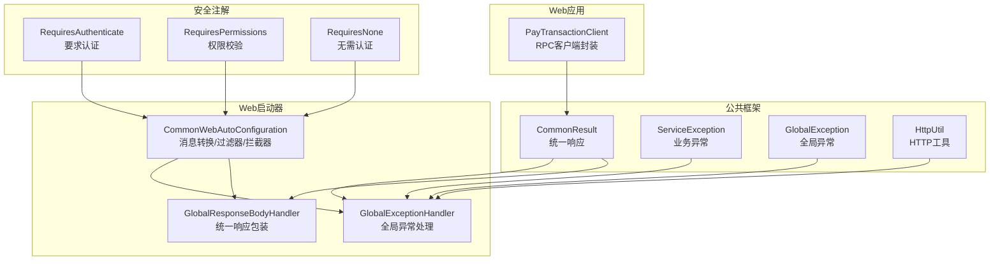
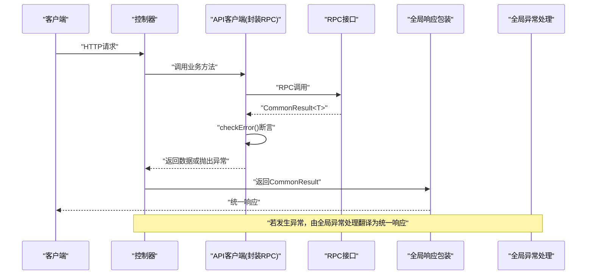
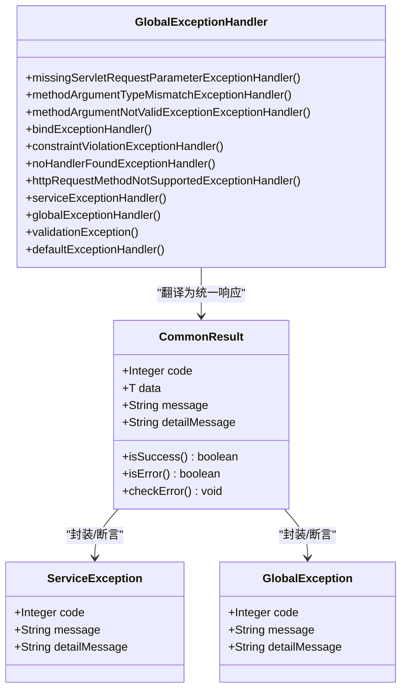
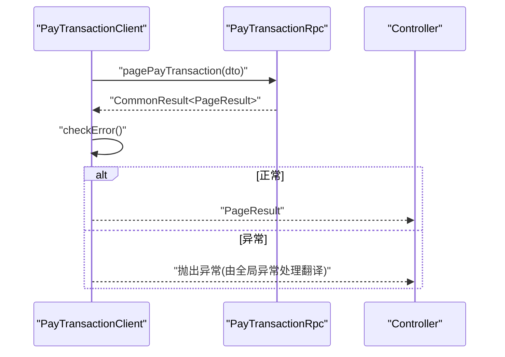
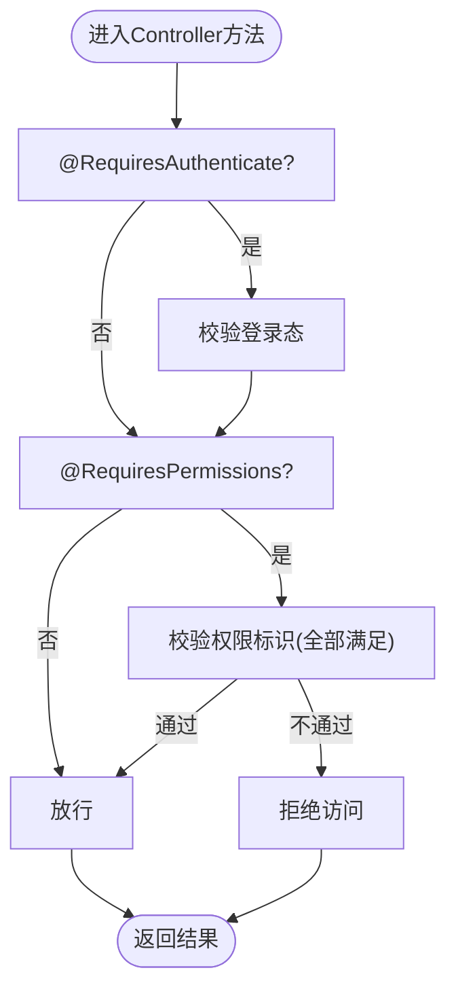
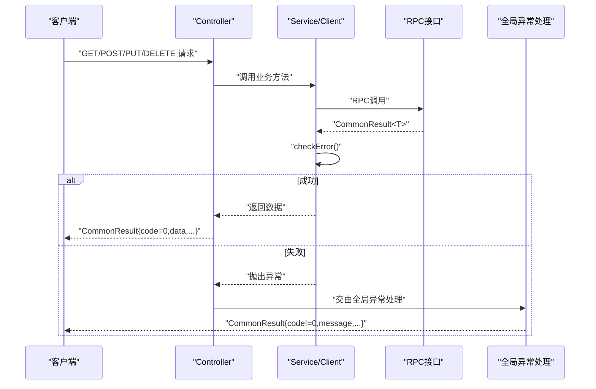
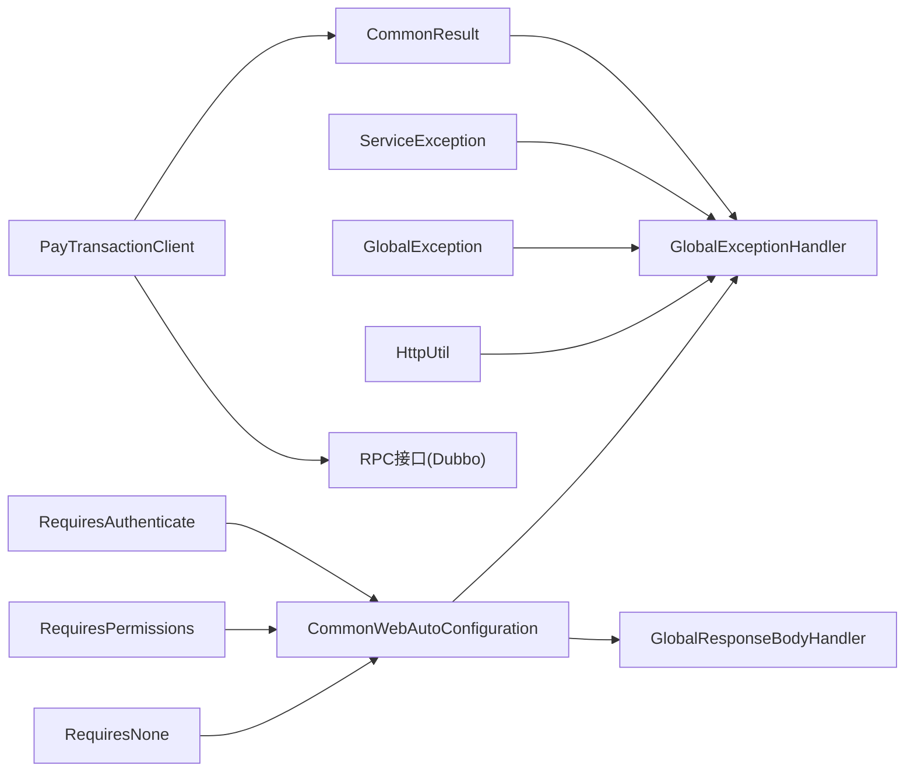

# RESTful API调用

<cite>
**本文档引用的文件**
- [CommonResult.java](file://common/common-framework/src/main/java/cn/iocoder/common/framework/vo/CommonResult.java)
- [ServiceException.java](file://common/common-framework/src/main/java/cn/iocoder/common/framework/exception/ServiceException.java)
- [GlobalException.java](file://common/common-framework/src/main/java/cn/iocoder/common/framework/exception/GlobalException.java)
- [HttpUtil.java](file://common/common-framework/src/main/java/cn/iocoder/common/framework/util/HttpUtil.java)
- [CommonWebAutoConfiguration.java](file://common/mall-spring-boot-starter-web/src/main/java/cn/iocoder/mall/web/config/CommonWebAutoConfiguration.java)
- [GlobalResponseBodyHandler.java](file://common/mall-spring-boot-starter-web/src/main/java/cn/iocoder/mall/web/core/handler/GlobalResponseBodyHandler.java)
- [GlobalExceptionHandler.java](file://common/mall-spring-boot-starter-web/src/main/java/cn/iocoder/mall/web/core/handler/GlobalExceptionHandler.java)
- [RequiresAuthenticate.java](file://common/mall-security-annotations/src/main/java/cn/iocoder/security/annotations/RequiresAuthenticate.java)
- [RequiresPermissions.java](file://common/mall-security-annotations/src/main/java/cn/iocoder/security/annotations/RequiresPermissions.java)
- [RequiresNone.java](file://common/mall-security-annotations/src/main/java/cn/iocoder/security/annotations/RequiresNone.java)
- [PayTransactionClient.java](file://management-web-app/src/main/java/cn/iocoder/mall/managementweb/client/pay/transaction/PayTransactionClient.java)
</cite>

## 目录
1. [引言](#引言)
2. [项目结构](#项目结构)
3. [核心组件](#核心组件)
4. [架构总览](#架构总览)
5. [详细组件分析](#详细组件分析)
6. [依赖分析](#依赖分析)
7. [性能考量](#性能考量)
8. [故障排查指南](#故障排查指南)
9. [结论](#结论)
10. [附录](#附录)

## 引言
本文件面向Onemall项目的RESTful API调用机制，系统性阐述基于HTTP的RESTful设计与实现要点，重点覆盖以下方面：
- 统一响应格式与异常处理：以CommonResult为核心，贯穿Controller、RPC层与前端交互。
- 客户端封装模式：通过Dubbo RPC客户端聚合RPC调用，统一错误检查与返回。
- 认证与授权：通过注解驱动的鉴权机制，结合全局拦截器与异常处理，保障接口安全。
- HTTP方法与参数传递：GET/POST/PUT/DELETE的典型使用场景与参数传递方式。
- 高级主题：版本管理、限流策略、安全防护等。

## 项目结构
Onemall采用多模块分层架构，围绕“公共能力”“Web应用”“领域服务”展开。与RESTful API调用密切相关的模块与文件如下：
- 公共框架：统一响应、异常体系、HTTP工具
- Web启动器：全局消息转换、全局响应包装、全局异常处理
- 安全注解：认证与授权注解
- Web应用：API客户端封装RPC调用
- 领域服务：RPC接口与实现（如支付交易RPC）

**图表来源**
- [CommonResult.java:17-155](file://common/common-framework/src/main/java/cn/iocoder/common/framework/vo/CommonResult.java#L17-L155)
- [ServiceException.java:9-72](file://common/common-framework/src/main/java/cn/iocoder/common/framework/exception/ServiceException.java#L9-L72)
- [GlobalException.java:9-72](file://common/common-framework/src/main/java/cn/iocoder/common/framework/exception/GlobalException.java#L9-L72)
- [HttpUtil.java:13-320](file://common/common-framework/src/main/java/cn/iocoder/common/framework/util/HttpUtil.java#L13-L320)
- [CommonWebAutoConfiguration.java:28-97](file://common/mall-spring-boot-starter-web/src/main/java/cn/iocoder/mall/web/config/CommonWebAutoConfiguration.java#L28-L97)
- [GlobalResponseBodyHandler.java:23-46](file://common/mall-spring-boot-starter-web/src/main/java/cn/iocoder/mall/web/core/handler/GlobalResponseBodyHandler.java#L23-L46)
- [GlobalExceptionHandler.java:42-253](file://common/mall-spring-boot-starter-web/src/main/java/cn/iocoder/mall/web/core/handler/GlobalExceptionHandler.java#L42-L253)
- [RequiresAuthenticate.java:14-19](file://common/mall-security-annotations/src/main/java/cn/iocoder/security/annotations/RequiresAuthenticate.java#L14-L19)
- [RequiresPermissions.java:12-25](file://common/mall-security-annotations/src/main/java/cn/iocoder/security/annotations/RequiresPermissions.java#L12-L25)
- [RequiresNone.java:8-13](file://common/mall-security-annotations/src/main/java/cn/iocoder/security/annotations/RequiresNone.java#L8-L13)
- [PayTransactionClient.java:11-24](file://management-web-app/src/main/java/cn/iocoder/mall/managementweb/client/pay/transaction/PayTransactionClient.java#L11-L24)

**章节来源**
- [CommonResult.java:17-155](file://common/common-framework/src/main/java/cn/iocoder/common/framework/vo/CommonResult.java#L17-L155)
- [CommonWebAutoConfiguration.java:28-97](file://common/mall-spring-boot-starter-web/src/main/java/cn/iocoder/mall/web/config/CommonWebAutoConfiguration.java#L28-L97)

## 核心组件
- 统一响应格式：CommonResult提供统一的响应结构，包含状态码、数据体、消息与内部明细；同时提供success/error静态工厂方法与checkError断言方法，便于在调用链路中快速判断与抛出异常。
- 异常体系：ServiceException用于业务异常，GlobalException用于全局异常，二者均可被全局异常处理器翻译为统一响应。
- HTTP工具：HttpUtil提供Authorization头解析、IP/User-Agent获取、查询串拼装等能力，支撑安全与日志记录。
- 全局Web配置：CommonWebAutoConfiguration注册Fastjson消息转换器、CORS过滤器与访问日志拦截器，确保统一的序列化与跨域策略。
- 全局响应包装：GlobalResponseBodyHandler仅对返回类型为CommonResult的方法进行包装记录，避免改变Controller原始返回结构。
- 全局异常处理：GlobalExceptionHandler将各类异常（参数缺失、类型不匹配、业务异常、全局异常、系统异常等）统一翻译为CommonResult，同时异步记录异常日志。

**章节来源**
- [CommonResult.java:17-155](file://common/common-framework/src/main/java/cn/iocoder/common/framework/vo/CommonResult.java#L17-L155)
- [ServiceException.java:9-72](file://common/common-framework/src/main/java/cn/iocoder/common/framework/exception/ServiceException.java#L9-L72)
- [GlobalException.java:9-72](file://common/common-framework/src/main/java/cn/iocoder/common/framework/exception/GlobalException.java#L9-L72)
- [HttpUtil.java:13-320](file://common/common-framework/src/main/java/cn/iocoder/common/framework/util/HttpUtil.java#L13-L320)
- [CommonWebAutoConfiguration.java:28-97](file://common/mall-spring-boot-starter-web/src/main/java/cn/iocoder/mall/web/config/CommonWebAutoConfiguration.java#L28-L97)
- [GlobalResponseBodyHandler.java:23-46](file://common/mall-spring-boot-starter-web/src/main/java/cn/iocoder/mall/web/core/handler/GlobalResponseBodyHandler.java#L23-L46)
- [GlobalExceptionHandler.java:42-253](file://common/mall-spring-boot-starter-web/src/main/java/cn/iocoder/mall/web/core/handler/GlobalExceptionHandler.java#L42-L253)

## 架构总览
Onemall的RESTful API调用链路遵循“Controller -> Service/Client -> RPC -> ServiceImpl”的分层设计，配合统一响应与异常处理，形成闭环。

**图表来源**
- [PayTransactionClient.java:17-21](file://management-web-app/src/main/java/cn/iocoder/mall/managementweb/client/pay/transaction/PayTransactionClient.java#L17-L21)
- [GlobalResponseBodyHandler.java:26-43](file://common/mall-spring-boot-starter-web/src/main/java/cn/iocoder/mall/web/core/handler/GlobalResponseBodyHandler.java#L26-L43)
- [GlobalExceptionHandler.java:151-174](file://common/mall-spring-boot-starter-web/src/main/java/cn/iocoder/mall/web/core/handler/GlobalExceptionHandler.java#L151-L174)

## 详细组件分析

### 统一响应与异常处理
- CommonResult：提供成功与失败两种构造方式，支持isSuccess/isError判断，以及checkError断言方法，便于在调用链中快速失败。
- ServiceException/GlobalException：分别承载业务异常与全局异常，统一由GlobalExceptionHandler翻译为CommonResult，保证前后端一致的错误语义。
- 全局异常处理：覆盖参数缺失、类型不匹配、参数校验失败、路由不存在、方法不支持、业务异常、全局异常与兜底异常，统一输出统一响应并异步记录异常日志。

**图表来源**
- [CommonResult.java:17-155](file://common/common-framework/src/main/java/cn/iocoder/common/framework/vo/CommonResult.java#L17-L155)
- [ServiceException.java:9-72](file://common/common-framework/src/main/java/cn/iocoder/common/framework/exception/ServiceException.java#L9-L72)
- [GlobalException.java:9-72](file://common/common-framework/src/main/java/cn/iocoder/common/framework/exception/GlobalException.java#L9-L72)
- [GlobalExceptionHandler.java:66-198](file://common/mall-spring-boot-starter-web/src/main/java/cn/iocoder/mall/web/core/handler/GlobalExceptionHandler.java#L66-L198)

**章节来源**
- [CommonResult.java:49-152](file://common/common-framework/src/main/java/cn/iocoder/common/framework/vo/CommonResult.java#L49-L152)
- [ServiceException.java:34-71](file://common/common-framework/src/main/java/cn/iocoder/common/framework/exception/ServiceException.java#L34-L71)
- [GlobalException.java:34-71](file://common/common-framework/src/main/java/cn/iocoder/common/framework/exception/GlobalException.java#L34-L71)
- [GlobalExceptionHandler.java:66-198](file://common/mall-spring-boot-starter-web/src/main/java/cn/iocoder/mall/web/core/handler/GlobalExceptionHandler.java#L66-L198)

### 客户端封装模式与RPC调用
- PayTransactionClient：通过DubboReference注入RPC接口，封装RPC调用，统一使用CommonResult包裹返回，并在调用后执行checkError断言，确保异常在客户端即刻暴露。
- 版本管理：@DubboReference通过占位符${dubbo.consumer.PayTransactionRpc.version}指定消费者版本，便于灰度与兼容。

**图表来源**
- [PayTransactionClient.java:14-21](file://management-web-app/src/main/java/cn/iocoder/mall/managementweb/client/pay/transaction/PayTransactionClient.java#L14-L21)

**章节来源**
- [PayTransactionClient.java:11-24](file://management-web-app/src/main/java/cn/iocoder/mall/managementweb/client/pay/transaction/PayTransactionClient.java#L11-L24)

### 认证与授权机制
- RequiresAuthenticate：标注在Controller方法上，要求用户已登录（适用于管理员与普通用户）。
- RequiresPermissions：标注在Controller方法上，进行权限标识校验，需满足全部权限标识。
- RequiresNone：标注在Controller方法上，声明无需登录。
- 全局Web配置：CommonWebAutoConfiguration注册拦截器与过滤器，结合注解实现统一鉴权与跨域策略。

**图表来源**
- [RequiresAuthenticate.java:14-19](file://common/mall-security-annotations/src/main/java/cn/iocoder/security/annotations/RequiresAuthenticate.java#L14-L19)
- [RequiresPermissions.java:12-25](file://common/mall-security-annotations/src/main/java/cn/iocoder/security/annotations/RequiresPermissions.java#L12-L25)
- [RequiresNone.java:8-13](file://common/mall-security-annotations/src/main/java/cn/iocoder/security/annotations/RequiresNone.java#L8-L13)
- [CommonWebAutoConfiguration.java:57-65](file://common/mall-spring-boot-starter-web/src/main/java/cn/iocoder/mall/web/config/CommonWebAutoConfiguration.java#L57-L65)

**章节来源**
- [RequiresAuthenticate.java:14-19](file://common/mall-security-annotations/src/main/java/cn/iocoder/security/annotations/RequiresAuthenticate.java#L14-L19)
- [RequiresPermissions.java:12-25](file://common/mall-security-annotations/src/main/java/cn/iocoder/security/annotations/RequiresPermissions.java#L12-L25)
- [RequiresNone.java:8-13](file://common/mall-security-annotations/src/main/java/cn/iocoder/security/annotations/RequiresNone.java#L8-L13)
- [CommonWebAutoConfiguration.java:57-65](file://common/mall-spring-boot-starter-web/src/main/java/cn/iocoder/mall/web/config/CommonWebAutoConfiguration.java#L57-L65)

### HTTP方法与参数传递
- GET：用于查询类接口，参数通过查询串传递，建议使用分页参数与筛选条件。
- POST：用于创建类接口，参数通过请求体传递，建议使用对象DTO封装。
- PUT：用于更新类接口，参数通过请求体传递，建议使用部分字段更新。
- DELETE：用于删除类接口，参数通过路径变量或查询串传递，建议配合幂等与确认机制。
- 参数校验：通过Spring Validation与JSR-303注解进行参数校验，异常由全局异常处理翻译为统一响应。

**章节来源**
- [GlobalExceptionHandler.java:88-118](file://common/mall-spring-boot-starter-web/src/main/java/cn/iocoder/mall/web/core/handler/GlobalExceptionHandler.java#L88-L118)

### API调用示例（流程）
以下示例展示一次典型的API调用从请求到响应的完整流程，涵盖请求构建、响应解析与错误处理。

- 请求构建
  - GET：拼装查询串参数，发送至对应Controller。
  - POST/PUT：构造请求体DTO，发送至对应Controller。
- 响应解析
  - Controller返回CommonResult<T>，由GlobalResponseBodyHandler记录并返回给客户端。
- 错误处理
  - 若RPC返回错误或业务异常，客户端执行checkError断言，抛出异常交由GlobalExceptionHandler统一翻译。

**图表来源**
- [PayTransactionClient.java:17-21](file://management-web-app/src/main/java/cn/iocoder/mall/managementweb/client/pay/transaction/PayTransactionClient.java#L17-L21)
- [GlobalExceptionHandler.java:151-174](file://common/mall-spring-boot-starter-web/src/main/java/cn/iocoder/mall/web/core/handler/GlobalExceptionHandler.java#L151-L174)

## 依赖分析
- 组件内聚与耦合
  - CommonResult与异常体系紧密耦合，共同构成统一响应与异常翻译的基础。
  - 全局异常处理依赖异常体系与HTTP工具，负责将异常映射为统一响应并记录日志。
  - 客户端封装RPC调用，依赖统一响应与异常体系，确保调用链一致性。
  - 安全注解与Web配置协作，实现认证与授权的统一控制。
- 外部依赖
  - Dubbo：通过@DubboReference进行RPC消费，版本号通过占位符管理。
  - Spring Web：通过@RestControllerAdvice与ResponseBodyAdvice实现全局处理。
  - Fastjson：通过消息转换器统一序列化。

**图表来源**
- [CommonResult.java:17-155](file://common/common-framework/src/main/java/cn/iocoder/common/framework/vo/CommonResult.java#L17-L155)
- [GlobalExceptionHandler.java:42-253](file://common/mall-spring-boot-starter-web/src/main/java/cn/iocoder/mall/web/core/handler/GlobalExceptionHandler.java#L42-L253)
- [PayTransactionClient.java:11-24](file://management-web-app/src/main/java/cn/iocoder/mall/managementweb/client/pay/transaction/PayTransactionClient.java#L11-L24)
- [CommonWebAutoConfiguration.java:28-97](file://common/mall-spring-boot-starter-web/src/main/java/cn/iocoder/mall/web/config/CommonWebAutoConfiguration.java#L28-L97)
- [RequiresAuthenticate.java:14-19](file://common/mall-security-annotations/src/main/java/cn/iocoder/security/annotations/RequiresAuthenticate.java#L14-L19)
- [RequiresPermissions.java:12-25](file://common/mall-security-annotations/src/main/java/cn/iocoder/security/annotations/RequiresPermissions.java#L12-L25)
- [RequiresNone.java:8-13](file://common/mall-security-annotations/src/main/java/cn/iocoder/security/annotations/RequiresNone.java#L8-L13)

**章节来源**
- [CommonResult.java:17-155](file://common/common-framework/src/main/java/cn/iocoder/common/framework/vo/CommonResult.java#L17-L155)
- [GlobalExceptionHandler.java:42-253](file://common/mall-spring-boot-starter-web/src/main/java/cn/iocoder/mall/web/core/handler/GlobalExceptionHandler.java#L42-L253)
- [PayTransactionClient.java:11-24](file://management-web-app/src/main/java/cn/iocoder/mall/managementweb/client/pay/transaction/PayTransactionClient.java#L11-L24)
- [CommonWebAutoConfiguration.java:28-97](file://common/mall-spring-boot-starter-web/src/main/java/cn/iocoder/mall/web/config/CommonWebAutoConfiguration.java#L28-L97)

## 性能考量
- 序列化性能：通过Fastjson消息转换器统一序列化，减少序列化开销与兼容性问题。
- 异步日志：异常日志写入采用异步方式，降低对主请求路径的影响。
- 缓存与降级：可在客户端或网关层引入缓存与熔断降级策略，提升整体可用性与稳定性。
- 并发与限流：建议在网关或服务入口处实施限流与并发控制，防止突发流量冲击。

## 故障排查指南
- 参数类错误
  - 缺失参数：返回统一响应并包含缺失参数名。
  - 类型不匹配：返回统一响应并包含类型错误信息。
  - 参数校验失败：返回统一响应并包含第一条校验错误。
- 路由与方法错误
  - 地址不存在：返回统一响应并包含请求URL。
  - 方法不支持：返回统一响应并包含方法错误信息。
- 业务异常与全局异常
  - 业务异常：由ServiceException翻译为统一响应。
  - 全局异常：由GlobalException翻译为统一响应，并在特定错误码下记录异常日志。
- 客户端断言
  - 客户端在收到RPC返回后执行checkError断言，若失败将抛出异常，便于快速定位问题。

**章节来源**
- [GlobalExceptionHandler.java:66-198](file://common/mall-spring-boot-starter-web/src/main/java/cn/iocoder/mall/web/core/handler/GlobalExceptionHandler.java#L66-L198)
- [PayTransactionClient.java:17-21](file://management-web-app/src/main/java/cn/iocoder/mall/managementweb/client/pay/transaction/PayTransactionClient.java#L17-L21)

## 结论
Onemall的RESTful API调用机制以CommonResult为核心，结合Dubbo RPC与全局异常处理，实现了统一响应、清晰的错误语义与一致的调用体验。通过注解驱动的认证与授权、统一的消息转换与跨域策略，以及完善的异常处理与日志记录，整体架构具备良好的扩展性与可维护性。建议在生产环境中进一步完善限流、缓存与安全防护策略，以应对高并发与复杂业务场景。

## 附录
- 版本管理
  - 通过@DubboReference的version占位符实现消费者版本管理，便于灰度发布与兼容升级。
- 安全防护
  - 建议在网关层增加WAF、参数校验、防重放与敏感信息脱敏等措施。
- 监控与可观测性
  - 建议接入指标采集与追踪系统，结合异常日志与访问日志，实现端到端监控。