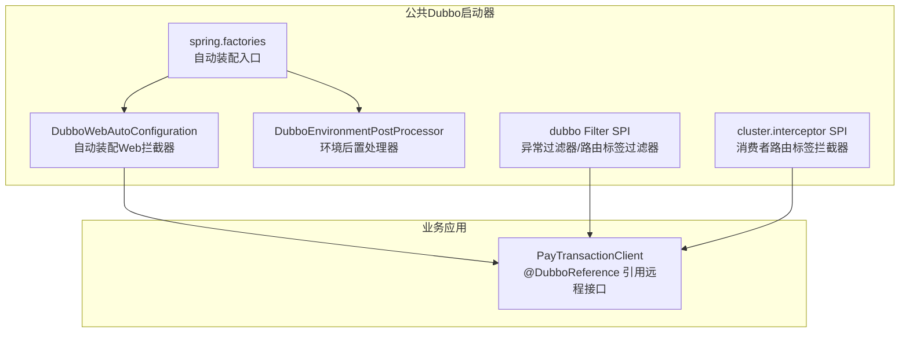
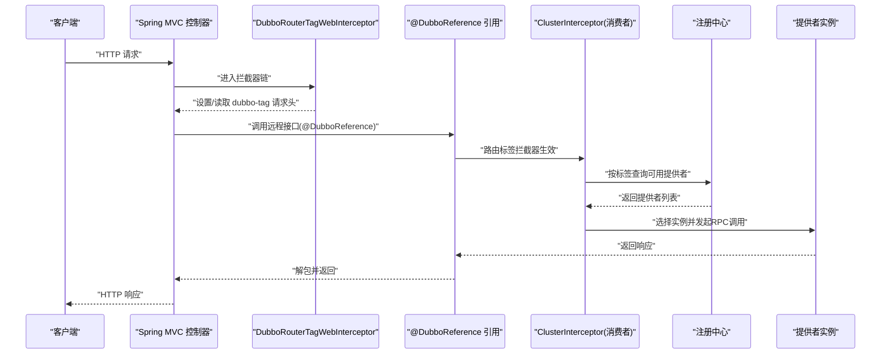
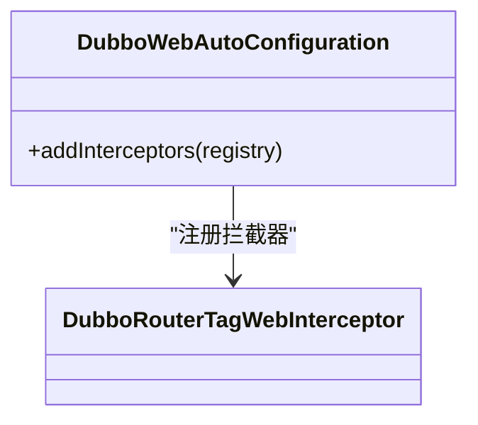
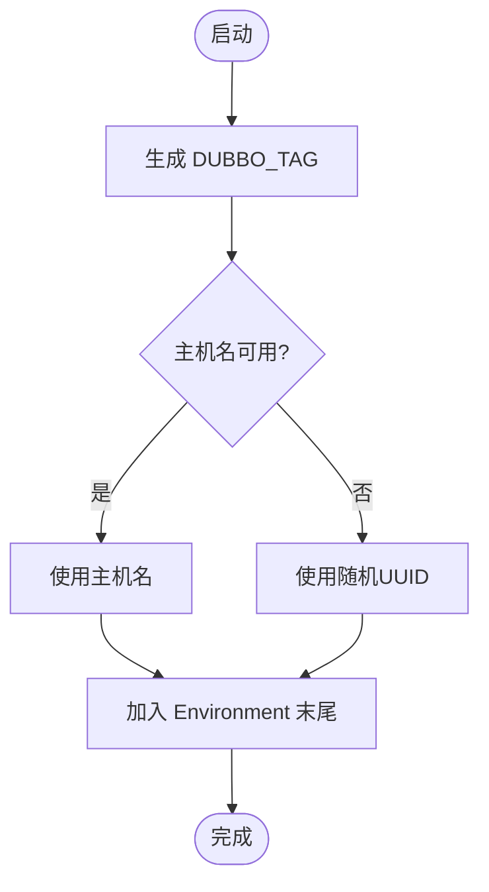
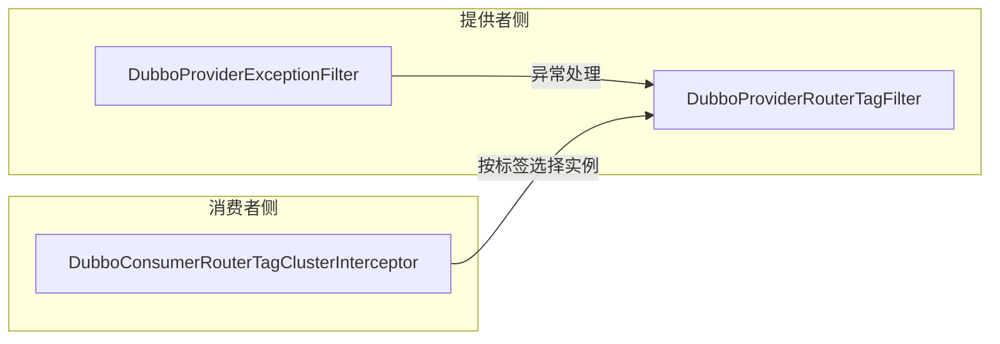
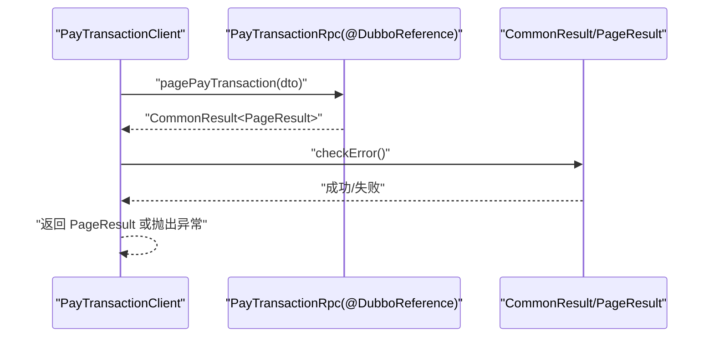
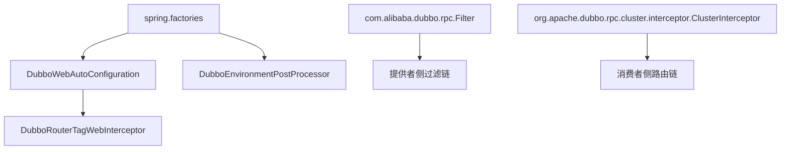

# RPC远程调用

<cite>
**本文引用的文件**   
- [DubboWebAutoConfiguration.java](file://common/mall-spring-boot-starter-dubbo/src/main/java/cn/iocoder/mall/dubbo/config/DubboWebAutoConfiguration.java)
- [DubboEnvironmentPostProcessor.java](file://common/mall-spring-boot-starter-dubbo/src/main/java/cn/iocoder/mall/dubbo/config/DubboEnvironmentPostProcessor.java)
- [spring.factories](file://common/mall-spring-boot-starter-dubbo/src/main/resources/META-INF/spring.factories)
- [com.alibaba.dubbo.rpc.Filter](file://common/mall-spring-boot-starter-dubbo/src/main/resources/META-INF/dubbo/com.alibaba.dubbo.rpc.Filter)
- [org.apache.dubbo.rpc.cluster.interceptor.ClusterInterceptor](file://common/mall-spring-boot-starter-dubbo/src/main/resources/META-INF/dubbo/org.apache.dubbo.rpc.cluster.interceptor.ClusterInterceptor)
- [PayTransactionClient.java](file://management-web-app/src/main/java/cn/iocoder/mall/managementweb/client/pay/transaction/PayTransactionClient.java)
</cite>

## 目录
1. [引言](#引言)
2. [项目结构](#项目结构)
3. [核心组件](#核心组件)
4. [架构总览](#架构总览)
5. [详细组件分析](#详细组件分析)
6. [依赖分析](#依赖分析)
7. [性能考虑](#性能考虑)
8. [故障排查指南](#故障排查指南)
9. [结论](#结论)
10. [附录](#附录)

## 引言
本文件系统性梳理 Onemall 基于 Dubbo 的 RPC 远程调用机制，覆盖服务暴露与引用、自动装配原理（DubboWebAutoConfiguration）、请求生命周期（从服务注册到调用执行）、负载均衡与路由策略、超时与重试配置、以及实际调用示例与最佳实践。文档以仓库中现有实现为依据，避免臆测，确保可追溯性与可操作性。

## 项目结构
围绕 Dubbo 的核心扩展位于公共模块 common/mall-spring-boot-starter-dubbo，包含自动装配、环境后置处理器、以及 Dubbo SPI 扩展清单。业务侧通过 DubboReference 在消费端发起远程调用，典型示例见 management-web-app 的 PayTransactionClient。

**图示来源**
- [DubboWebAutoConfiguration.java:1-32](file://common/mall-spring-boot-starter-dubbo/src/main/java/cn/iocoder/mall/dubbo/config/DubboWebAutoConfiguration.java#L1-L32)
- [DubboEnvironmentPostProcessor.java:1-67](file://common/mall-spring-boot-starter-dubbo/src/main/java/cn/iocoder/mall/dubbo/config/DubboEnvironmentPostProcessor.java#L1-L67)
- [spring.factories:1-6](file://common/mall-spring-boot-starter-dubbo/src/main/resources/META-INF/spring.factories#L1-L6)
- [com.alibaba.dubbo.rpc.Filter:1-3](file://common/mall-spring-boot-starter-dubbo/src/main/resources/META-INF/dubbo/com.alibaba.dubbo.rpc.Filter#L1-L3)
- [org.apache.dubbo.rpc.cluster.interceptor.ClusterInterceptor:1-2](file://common/mall-spring-boot-starter-dubbo/src/main/resources/META-INF/dubbo/org.apache.dubbo.rpc.cluster.interceptor.ClusterInterceptor#L1-L2)

**章节来源**
- [DubboWebAutoConfiguration.java:1-32](file://common/mall-spring-boot-starter-dubbo/src/main/java/cn/iocoder/mall/dubbo/config/DubboWebAutoConfiguration.java#L1-L32)
- [DubboEnvironmentPostProcessor.java:1-67](file://common/mall-spring-boot-starter-dubbo/src/main/java/cn/iocoder/mall/dubbo/config/DubboEnvironmentPostProcessor.java#L1-L67)
- [spring.factories:1-6](file://common/mall-spring-boot-starter-dubbo/src/main/resources/META-INF/spring.factories#L1-L6)
- [com.alibaba.dubbo.rpc.Filter:1-3](file://common/mall-spring-boot-starter-dubbo/src/main/resources/META-INF/dubbo/com.alibaba.dubbo.rpc.Filter#L1-L3)
- [org.apache.dubbo.rpc.cluster.interceptor.ClusterInterceptor:1-2](file://common/mall-spring-boot-starter-dubbo/src/main/resources/META-INF/dubbo/org.apache.dubbo.rpc.cluster.interceptor.ClusterInterceptor#L1-L2)

## 核心组件
- 自动装配与Web集成
  - DubboWebAutoConfiguration：在Web环境下注册 DubboRouterTagWebInterceptor，确保在较前顺序处理请求头中的 dubbo-tag，从而支持基于标签的路由。
  - DubboEnvironmentPostProcessor：在应用启动早期向 Environment 注入 DUBBO_TAG 属性，默认取自主机名，若不可用则回退为随机 UUID，便于本地开发环境下的 provider tag 生成。
- Dubbo SPI 扩展
  - Filter SPI：注册 DubboProviderExceptionFilter（异常过滤）与 DubboProviderRouterTagFilter（提供者路由标签过滤），用于在提供方侧统一处理异常与路由标签。
  - ClusterInterceptor SPI：注册 DubboConsumerRouterTagClusterInterceptor（消费者路由标签拦截器），用于在消费侧按标签选择提供者实例。
- 业务调用示例
  - PayTransactionClient：通过 @DubboReference 引用 PayTransactionRpc 接口，封装分页查询并校验返回结果，体现“引用—调用—解包”的典型流程。

**章节来源**
- [DubboWebAutoConfiguration.java:1-32](file://common/mall-spring-boot-starter-dubbo/src/main/java/cn/iocoder/mall/dubbo/config/DubboWebAutoConfiguration.java#L1-L32)
- [DubboEnvironmentPostProcessor.java:1-67](file://common/mall-spring-boot-starter-dubbo/src/main/java/cn/iocoder/mall/dubbo/config/DubboEnvironmentPostProcessor.java#L1-L67)
- [com.alibaba.dubbo.rpc.Filter:1-3](file://common/mall-spring-boot-starter-dubbo/src/main/resources/META-INF/dubbo/com.alibaba.dubbo.rpc.Filter#L1-L3)
- [org.apache.dubbo.rpc.cluster.interceptor.ClusterInterceptor:1-2](file://common/mall-spring-boot-starter-dubbo/src/main/resources/META-INF/dubbo/org.apache.dubbo.rpc.cluster.interceptor.ClusterInterceptor#L1-L2)
- [PayTransactionClient.java:1-24](file://management-web-app/src/main/java/cn/iocoder/mall/managementweb/client/pay/transaction/PayTransactionClient.java#L1-L24)

## 架构总览
下图展示从请求进入 Web 层到 Dubbo 消费者调用提供者的整体链路，以及自动装配与SPI扩展如何参与其中。

**图示来源**
- [DubboWebAutoConfiguration.java:1-32](file://common/mall-spring-boot-starter-dubbo/src/main/java/cn/iocoder/mall/dubbo/config/DubboWebAutoConfiguration.java#L1-L32)
- [org.apache.dubbo.rpc.cluster.interceptor.ClusterInterceptor:1-2](file://common/mall-spring-boot-starter-dubbo/src/main/resources/META-INF/dubbo/org.apache.dubbo.rpc.cluster.interceptor.ClusterInterceptor#L1-L2)
- [PayTransactionClient.java:1-24](file://management-web-app/src/main/java/cn/iocoder/mall/managementweb/client/pay/transaction/PayTransactionClient.java#L1-L24)

## 详细组件分析

### 自动装配与Web集成（DubboWebAutoConfiguration）
- 作用
  - 在Servlet Web环境中注册 DubboRouterTagWebInterceptor，优先级设置为较低顺序，确保在认证等拦截器之前处理 dubbo-tag 请求头，支撑基于标签的路由。
- 关键点
  - 使用条件注解仅在Servlet Web应用生效。
  - 捕获 NoSuchBeanDefinitionException，避免在某些容器或场景下缺失拦截器导致失败。
- 影响范围
  - 为后续 @DubboReference 的标签路由提供前置条件。

**图示来源**
- [DubboWebAutoConfiguration.java:1-32](file://common/mall-spring-boot-starter-dubbo/src/main/java/cn/iocoder/mall/dubbo/config/DubboWebAutoConfiguration.java#L1-L32)

**章节来源**
- [DubboWebAutoConfiguration.java:1-32](file://common/mall-spring-boot-starter-dubbo/src/main/java/cn/iocoder/mall/dubbo/config/DubboWebAutoConfiguration.java#L1-L32)

### 环境后置处理器（DubboEnvironmentPostProcessor）
- 作用
  - 在应用启动早期向 Environment 注入 DUBBO_TAG 属性，用于本地开发环境下的 provider tag 生成，避免硬编码或遗漏。
- 逻辑要点
  - 优先使用主机名作为标签；若不可用则回退为随机 UUID。
  - 将属性添加到 Environment 的末尾，保证可被后续配置覆盖。
- 实际价值
  - 使多实例本地调试时能区分不同提供者，便于按标签路由与问题定位。

**图示来源**
- [DubboEnvironmentPostProcessor.java:1-67](file://common/mall-spring-boot-starter-dubbo/src/main/java/cn/iocoder/mall/dubbo/config/DubboEnvironmentPostProcessor.java#L1-L67)

**章节来源**
- [DubboEnvironmentPostProcessor.java:1-67](file://common/mall-spring-boot-starter-dubbo/src/main/java/cn/iocoder/mall/dubbo/config/DubboEnvironmentPostProcessor.java#L1-L67)

### Dubbo SPI 扩展
- Filter SPI
  - dubboExceptionFilter：提供异常过滤能力，统一处理异常信息。
  - dubboProviderRouterTagFilter：提供者侧路由标签过滤器，配合请求头中的 dubbo-tag 实现标签路由。
- ClusterInterceptor SPI
  - dubboConsumerRouterTagClusterInterceptor：消费者侧路由标签拦截器，在选择提供者时按标签筛选。

**图示来源**
- [com.alibaba.dubbo.rpc.Filter:1-3](file://common/mall-spring-boot-starter-dubbo/src/main/resources/META-INF/dubbo/com.alibaba.dubbo.rpc.Filter#L1-L3)
- [org.apache.dubbo.rpc.cluster.interceptor.ClusterInterceptor:1-2](file://common/mall-spring-boot-starter-dubbo/src/main/resources/META-INF/dubbo/org.apache.dubbo.rpc.cluster.interceptor.ClusterInterceptor#L1-L2)

**章节来源**
- [com.alibaba.dubbo.rpc.Filter:1-3](file://common/mall-spring-boot-starter-dubbo/src/main/resources/META-INF/dubbo/com.alibaba.dubbo.rpc.Filter#L1-L3)
- [org.apache.dubbo.rpc.cluster.interceptor.ClusterInterceptor:1-2](file://common/mall-spring-boot-starter-dubbo/src/main/resources/META-INF/dubbo/org.apache.dubbo.rpc.cluster.interceptor.ClusterInterceptor#L1-L2)

### 业务调用示例（PayTransactionClient）
- 接口引用
  - 通过 @DubboReference 引用 PayTransactionRpc 接口，并指定版本占位符，便于运行时替换。
- 调用流程
  - 封装分页请求参数，调用远程接口，对返回的通用结果进行错误检查后再提取数据。
- 最佳实践
  - 统一校验返回结果，避免空指针与异常传播。
  - 参数与返回值遵循 DTO 规范，保持跨进程契约稳定。

**图示来源**
- [PayTransactionClient.java:1-24](file://management-web-app/src/main/java/cn/iocoder/mall/managementweb/client/pay/transaction/PayTransactionClient.java#L1-L24)

**章节来源**
- [PayTransactionClient.java:1-24](file://management-web-app/src/main/java/cn/iocoder/mall/managementweb/client/pay/transaction/PayTransactionClient.java#L1-L24)

## 依赖分析
- 自动装配入口
  - spring.factories 指定 DubboWebAutoConfiguration 与 DubboEnvironmentPostProcessor 作为自动装配类，确保在应用启动时被加载。
- Web拦截器依赖
  - DubboWebAutoConfiguration 依赖 DubboRouterTagWebInterceptor，若容器中缺少该拦截器 Bean，将记录警告日志但不会中断启动。
- SPI 扩展依赖
  - 提供者与消费者侧的 Filter 与 ClusterInterceptor 通过 META-INF 配置注册，形成完整的调用链路。

**图示来源**
- [spring.factories:1-6](file://common/mall-spring-boot-starter-dubbo/src/main/resources/META-INF/spring.factories#L1-L6)
- [com.alibaba.dubbo.rpc.Filter:1-3](file://common/mall-spring-boot-starter-dubbo/src/main/resources/META-INF/dubbo/com.alibaba.dubbo.rpc.Filter#L1-L3)
- [org.apache.dubbo.rpc.cluster.interceptor.ClusterInterceptor:1-2](file://common/mall-spring-boot-starter-dubbo/src/main/resources/META-INF/dubbo/org.apache.dubbo.rpc.cluster.interceptor.ClusterInterceptor#L1-L2)

**章节来源**
- [spring.factories:1-6](file://common/mall-spring-boot-starter-dubbo/src/main/resources/META-INF/spring.factories#L1-L6)
- [com.alibaba.dubbo.rpc.Filter:1-3](file://common/mall-spring-boot-starter-dubbo/src/main/resources/META-INF/dubbo/com.alibaba.dubbo.rpc.Filter#L1-L3)
- [org.apache.dubbo.rpc.cluster.interceptor.ClusterInterceptor:1-2](file://common/mall-spring-boot-starter-dubbo/src/main/resources/META-INF/dubbo/org.apache.dubbo.rpc.cluster.interceptor.ClusterInterceptor#L1-L2)

## 性能考虑
- 负载均衡与路由
  - 基于 dubbo-tag 的标签路由可在多实例部署时实现就近或按环境隔离，减少跨机房/跨区域调用开销。
- 超时与重试
  - 建议在消费端为不同接口设置差异化超时与重试策略，避免慢调用拖垮整体吞吐。
- 过滤器链
  - 异常过滤器有助于快速失败与降级，减少无效重试与资源浪费。
- 版本化接口
  - 通过 @DubboReference 的 version 占位符实现灰度与兼容，降低升级风险。

## 故障排查指南
- 启动阶段
  - 若出现无法获取 DubboRouterTagWebInterceptor 的警告，请确认拦截器 Bean 是否正确注册，或检查 Web 环境条件是否满足。
- 调用阶段
  - 若路由不生效，检查请求头中是否存在 dubbo-tag，以及提供者侧是否配置了对应标签。
  - 若异常未被统一处理，确认提供者侧 Filter SPI 是否正确加载。
- 日志与监控
  - 结合异常过滤器输出与注册中心日志，定位网络抖动、超时与实例不可用等问题。

**章节来源**
- [DubboWebAutoConfiguration.java:1-32](file://common/mall-spring-boot-starter-dubbo/src/main/java/cn/iocoder/mall/dubbo/config/DubboWebAutoConfiguration.java#L1-L32)
- [com.alibaba.dubbo.rpc.Filter:1-3](file://common/mall-spring-boot-starter-dubbo/src/main/resources/META-INF/dubbo/com.alibaba.dubbo.rpc.Filter#L1-L3)

## 结论
Onemall 的 Dubbo RPC 体系通过自动装配与环境后置处理器实现了开箱即用的 Web 集成与标签路由能力；借助 SPI 扩展完善了异常处理与路由拦截；业务侧以 @DubboReference 为核心完成远程接口引用与调用。建议在生产环境中结合版本化、超时与重试策略，配合标签路由与监控告警，持续优化调用稳定性与性能。

## 附录
- 关键配置项（基于现有实现的可配置点）
  - dubbo.consumer.PayTransactionRpc.version：通过占位符控制消费端接口版本，便于灰度与兼容。
  - DUBBO_TAG：由 DubboEnvironmentPostProcessor 注入，用于本地开发环境的提供者标签。
- 最佳实践
  - 明确划分接口版本，避免跨进程契约混乱。
  - 对关键接口设置合理的超时与重试策略。
  - 使用标签路由实现多环境/多机房隔离与就近访问。
  - 统一异常处理与返回结构，简化调用方适配成本。