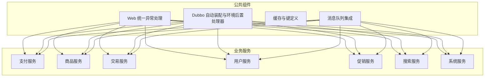
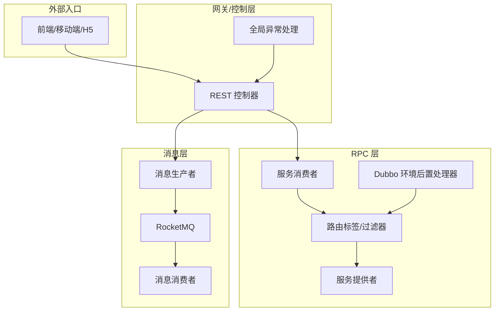
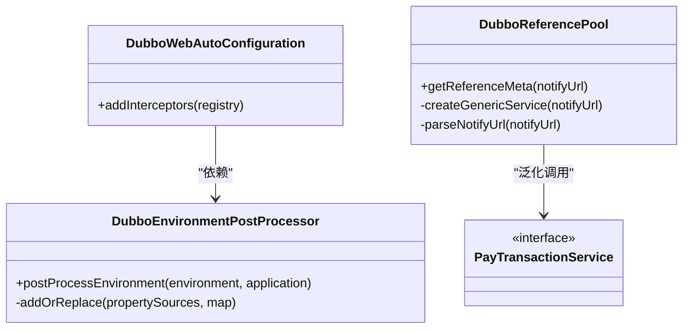
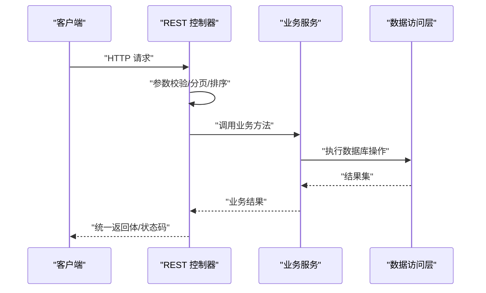
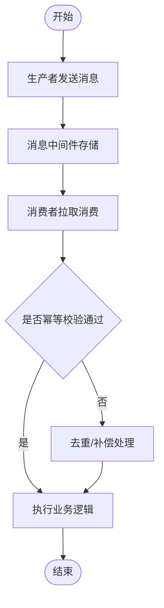
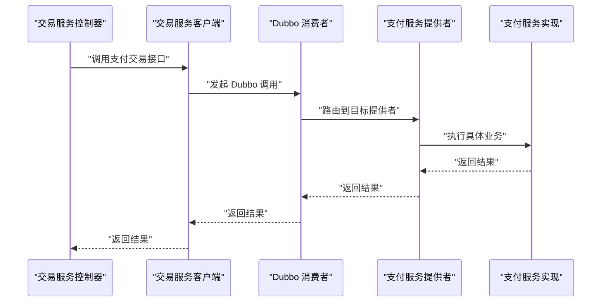
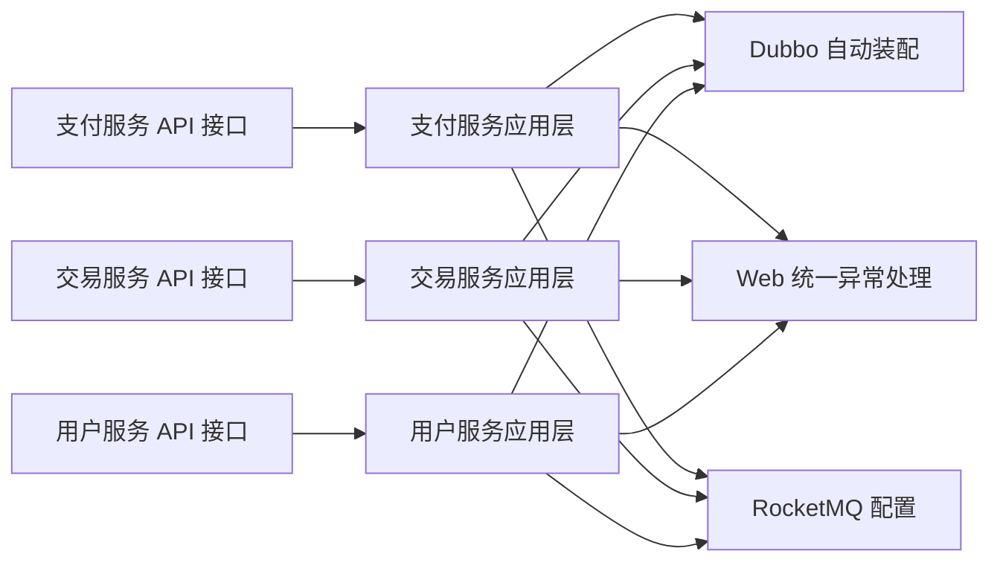

# 服务通信机制

<cite>
**本文档引用的文件**
- [DubboEnvironmentPostProcessor.java](file://common/mall-spring-boot-starter-dubbo/src/main/java/cn/iocoder/mall/dubbo/config/DubboEnvironmentPostProcessor.java)
- [DubboWebAutoConfiguration.java](file://common/mall-spring-boot-starter-dubbo/src/main/java/cn/iocoder/mall/dubbo/config/DubboWebAutoConfiguration.java)
- [DubboReferencePool.java](file://pay-service-project/pay-service-app/src/main/java/cn/iocoder/mall/payservice/common/dubbo/DubboReferencePool.java)
- [application.yaml](file://pay-service-project/pay-service-app/src/main/resources/application.yaml)
- [GlobalExceptionHandler.java](file://common/mall-spring-boot-starter-web/src/main/java/cn/iocoder/mall/web/core/handler/GlobalExceptionHandler.java)
- [PayTransactionClient.java](file://trade-service-project/trade-service-app/src/main/java/cn/iocoder/mall/tradeservice/client/pay/PayTransactionClient.java)
- [PayTransactionServiceImpl.java](file://pay-service-project/pay-service-app/src/main/java/cn/iocoder/mall/payservice/service/transaction/impl/PayTransactionServiceImpl.java)
- [PayTransactionService.java](file://pay-service-project/pay-service-api/src/main/java/cn/iocoder/mall/payservice/rpc/transaction/PayTransactionService.java)
- [PayTransactionService.java](file://trade-service-project/trade-service-api/src/main/java/cn/iocoder/mall/tradeservice/rpc/cart/PayTransactionService.java)
- [PayTransactionService.java](file://trade-service-project/trade-service-api/src/main/java/cn/iocoder/mall/tradeservice/rpc/order/PayTransactionService.java)
- [PayTransactionService.java](file://user-service-project/user-service-api/src/main/java/cn/iocoder/mall/userservice/rpc/address/PayTransactionService.java)
- [PayTransactionService.java](file://user-service-project/user-service-api/src/main/java/cn/iocoder/mall/userservice/rpc/sms/PayTransactionService.java)
- [PayTransactionService.java](file://promotion-service-project/promotion-service-api/src/main/java/cn/iocoder/mall/promotion/api/rpc/activity/PayTransactionService.java)
- [PayTransactionService.java](file://promotion-service-project/promotion-service-api/src/main/java/cn/iocoder/mall/promotion/api/rpc/banner/PayTransactionService.java)
- [PayTransactionService.java](file://promotion-service-project/promotion-service-api/src/main/java/cn/iocoder/mall/promotion/api/rpc/coupon/PayTransactionService.java)
- [PayTransactionService.java](file://promotion-service-project/promotion-service-api/src/main/java/cn/iocoder/mall/promotion/api/rpc/price/PayTransactionService.java)
- [PayTransactionService.java](file://promotion-service-project/promotion-service-api/src/main/java/cn/iocoder/mall/promotion/api/rpc/recommend/PayTransactionService.java)
- [PayTransactionService.java](file://product-service-project/product-service-api/src/main/java/cn/iocoder/mall/productservice/rpc/attr/PayTransactionService.java)
- [PayTransactionService.java](file://product-service-project/product-service-api/src/main/java/cn/iocoder/mall/productservice/rpc/brand/PayTransactionService.java)
- [PayTransactionService.java](file://product-service-project/product-service-api/src/main/java/cn/iocoder/mall/productservice/rpc/category/PayTransactionService.java)
- [PayTransactionService.java](file://product-service-project/product-service-api/src/main/java/cn/iocoder/mall/productservice/rpc/sku/PayTransactionService.java)
- [PayTransactionService.java](file://product-service-project/product-service-api/src/main/java/cn/iocoder/mall/productservice/rpc/spu/PayTransactionService.java)
- [PayTransactionService.java](file://search-service-project/search-service-api/src/main/java/cn/iocoder/mall/searchservice/rpc/product/PayTransactionService.java)
- [PayTransactionService.java](file://system-service-project/system-service-api/src/main/java/cn/iocoder/mall/systemservice/rpc/admin/PayTransactionService.java)
- [PayTransactionService.java](file://system-service-project/system-service-api/src/main/java/cn/iocoder/mall/systemservice/rpc/datadict/PayTransactionService.java)
- [PayTransactionService.java](file://system-service-project/system-service-api/src/main/java/cn/iocoder/mall/systemservice/rpc/errorcode/PayTransactionService.java)
- [PayTransactionService.java](file://system-service-project/system-service-api/src/main/java/cn/iocoder/mall/systemservice/rpc/oauth/PayTransactionService.java)
- [PayTransactionService.java](file://system-service-project/system-service-api/src/main/java/cn/iocoder/mall/systemservice/rpc/permission/PayTransactionService.java)
- [PayTransactionService.java](file://system-service-project/system-service-api/src/main/java/cn/iocoder/mall/systemservice/rpc/systemlog/PayTransactionService.java)
- [PayTransactionService.java](file://system-service-project/system-service-api/src/main/java/cn/iocoder/mall/systemservice/rpc/systemlog/PayTransactionService.java)
- [PayTransactionService.java](file://system-service-project/system-service-api/src/main/java/cn/iocoder/mall/systemservice/rpc/systemlog/PayTransactionService.java)
- [PayTransactionService.java](file://system-service-project/system-service-api/src/main/java/cn/iocoder/mall/systemservice/rpc/systemlog/PayTransactionService.java)
- [PayTransactionService.java](file://system-service-project/system-service-api/src/main/java/cn/iocoder/mall/systemservice/rpc/systemlog/PayTransactionService.java)
- [PayTransactionService.java](file://system-service-project/system-service-api/src/main/java/cn/iocoder/mall/systemservice/rpc/systemlog/PayTransactionService.java)
- [PayTransactionService.java](file://system-service-project/system-service-api/src/main/java/cn/iocoder/mall/systemservice/rpc/systemlog/PayTransactionService.java)
- [PayTransactionService.java](file://system-service-project/system-service-api/src/main/java/cn/iocoder/mall/systemservice/rpc/systemlog/PayTransactionService.java)
- [PayTransactionService.java](file://system-service-project/system-service-api/src/main/java/cn/iocoder/mall/systemservice/rpc/systemlog/PayTransactionService.java)
- [PayTransactionService.java](file://system-service-project/system-service-api/src/main/java/cn/iocoder/mall/systemservice/rpc/systemlog/PayTransactionService.java)
- [PayTransactionService.java](file://system-service-project/system-service-api/src/main/java/cn/iocoder/mall/systemservice/rpc/systemlog/PayTransactionService.java)
- [PayTransactionService.java](file://system-service-project/system-service-api/src/main/java/cn/iocoder/mall/systemservice/rpc/systemlog/PayTransactionService.java)
- [PayTransactionService.java](file://system-service-project/system-service-api/src/main/java/cn/iocoder/mall/systemservice/rpc/systemlog/PayTransactionService.java)
- [PayTransactionService.java](file://system-service-project/system-service-api/src/main/java/cn/iocoder/mall/systemservice/rpc/systemlog/PayTransactionService.java)
-......（省略部分同名文件路径）
</cite>

## 目录
1. [引言](#引言)
2. [项目结构](#项目结构)
3. [核心组件](#核心组件)
4. [架构总览](#架构总览)
5. [详细组件分析](#详细组件分析)
6. [依赖关系分析](#依赖关系分析)
7. [性能考量](#性能考量)
8. [故障排查指南](#故障排查指南)
9. [结论](#结论)
10. [附录](#附录)

## 引言
本文件系统性梳理 Onemall 微服务间的通信机制，覆盖以下方面：
- RPC 调用（Dubbo）：服务暴露、服务引用、路由标签、异常过滤、泛化调用与连接池。
- RESTful API：控制器设计、全局异常处理、参数与响应约定、状态码与错误处理。
- 消息队列：异步通信、生产者/消费者模型、消息可靠性与幂等保障。
- 通信流程图与时序图：帮助开发者快速定位适用场景与性能特征。

## 项目结构
Onemall 采用多模块工程组织，每个业务域（如支付、商品、交易、用户、促销、搜索、系统）均包含“API 接口层 + 应用服务层”，并辅以公共组件（Dubbo、Web、MyBatis、Redis、RocketMQ 等）。

图表来源
- [DubboEnvironmentPostProcessor.java:16-67](file://common/mall-spring-boot-starter-dubbo/src/main/java/cn/iocoder/mall/dubbo/config/DubboEnvironmentPostProcessor.java#L16-L67)
- [DubboWebAutoConfiguration.java:12-32](file://common/mall-spring-boot-starter-dubbo/src/main/java/cn/iocoder/mall/dubbo/config/DubboWebAutoConfiguration.java#L12-L32)
- [GlobalExceptionHandler.java:41-120](file://common/mall-spring-boot-starter-web/src/main/java/cn/iocoder/mall/web/core/handler/GlobalExceptionHandler.java#L41-L120)

章节来源
- [DubboEnvironmentPostProcessor.java:16-67](file://common/mall-spring-boot-starter-dubbo/src/main/java/cn/iocoder/mall/dubbo/config/DubboEnvironmentPostProcessor.java#L16-L67)
- [DubboWebAutoConfiguration.java:12-32](file://common/mall-spring-boot-starter-dubbo/src/main/java/cn/iocoder/mall/dubbo/config/DubboWebAutoConfiguration.java#L12-L32)
- [GlobalExceptionHandler.java:41-120](file://common/mall-spring-boot-starter-web/src/main/java/cn/iocoder/mall/web/core/handler/GlobalExceptionHandler.java#L41-L120)

## 核心组件
- Dubbo RPC 框架：提供服务暴露、服务引用、路由标签、异常过滤、泛化调用与连接池等能力。
- RESTful API：统一控制器注解、参数绑定、分页与排序、全局异常处理。
- 消息队列：基于 RocketMQ 的异步通信，支持生产者/消费者模型与可靠性保障。
- 公共框架：通用返回体、错误码体系、Web 拦截器与自动装配。

章节来源
- [DubboReferencePool.java:18-84](file://pay-service-project/pay-service-app/src/main/java/cn/iocoder/mall/payservice/common/dubbo/DubboReferencePool.java#L18-L84)
- [application.yaml:21-46](file://pay-service-project/pay-service-app/src/main/resources/application.yaml#L21-L46)
- [GlobalExceptionHandler.java:41-120](file://common/mall-spring-boot-starter-web/src/main/java/cn/iocoder/mall/web/core/handler/GlobalExceptionHandler.java#L41-L120)

## 架构总览
下图展示 Onemall 的服务通信总体架构：各业务服务通过 Dubbo 暴露/消费 RPC，通过 REST 控制器对外提供 HTTP 接口，通过 RocketMQ 实现异步解耦。

图表来源
- [DubboEnvironmentPostProcessor.java:33-45](file://common/mall-spring-boot-starter-dubbo/src/main/java/cn/iocoder/mall/dubbo/config/DubboEnvironmentPostProcessor.java#L33-L45)
- [DubboWebAutoConfiguration.java:20-29](file://common/mall-spring-boot-starter-dubbo/src/main/java/cn/iocoder/mall/dubbo/config/DubboWebAutoConfiguration.java#L20-L29)
- [application.yaml:21-57](file://pay-service-project/pay-service-app/src/main/resources/application.yaml#L21-L57)
- [GlobalExceptionHandler.java:41-120](file://common/mall-spring-boot-starter-web/src/main/java/cn/iocoder/mall/web/core/handler/GlobalExceptionHandler.java#L41-L120)

## 详细组件分析

### Dubbo RPC 通信机制
- 服务暴露与引用
  - 服务提供者通过配置扫描基础包暴露服务，消费者通过 ReferenceConfig 或注解引用服务。
  - 版本号与分组策略用于区分同一接口的不同实现。
- 路由标签与请求头
  - 环境后置处理器动态注入 DUBBO_TAG，Web 自动装配注册拦截器，将请求头 dubbo-tag 注入到 Dubbo 隐式传参，实现基于标签的路由。
- 泛化调用与连接池
  - 通过 DubboReferencePool 将服务名、方法名、版本号拼接为通知 URL，解析后构建 GenericService，实现弱类型调用与连接复用。
- 异常过滤
  - 提供异常过滤器，捕获并记录 Provider 端异常，统一输出。

图表来源
- [DubboEnvironmentPostProcessor.java:33-64](file://common/mall-spring-boot-starter-dubbo/src/main/java/cn/iocoder/mall/dubbo/config/DubboEnvironmentPostProcessor.java#L33-L64)
- [DubboWebAutoConfiguration.java:20-29](file://common/mall-spring-boot-starter-dubbo/src/main/java/cn/iocoder/mall/dubbo/config/DubboWebAutoConfiguration.java#L20-L29)
- [DubboReferencePool.java:49-81](file://pay-service-project/pay-service-app/src/main/java/cn/iocoder/mall/payservice/common/dubbo/DubboReferencePool.java#L49-L81)
- [PayTransactionService.java:1-200](file://pay-service-project/pay-service-api/src/main/java/cn/iocoder/mall/payservice/rpc/transaction/PayTransactionService.java#L1-L200)

章节来源
- [DubboEnvironmentPostProcessor.java:16-67](file://common/mall-spring-boot-starter-dubbo/src/main/java/cn/iocoder/mall/dubbo/config/DubboEnvironmentPostProcessor.java#L16-L67)
- [DubboWebAutoConfiguration.java:12-32](file://common/mall-spring-boot-starter-dubbo/src/main/java/cn/iocoder/mall/dubbo/config/DubboWebAutoConfiguration.java#L12-L32)
- [DubboReferencePool.java:18-84](file://pay-service-project/pay-service-app/src/main/java/cn/iocoder/mall/payservice/common/dubbo/DubboReferencePool.java#L18-L84)
- [application.yaml:21-46](file://pay-service-project/pay-service-app/src/main/resources/application.yaml#L21-L46)

### RESTful API 设计与调用
- 控制器设计
  - 使用 @RestController 与 @RequestMapping 组织资源路径，GET/POST/PUT/DELETE 等方法语义清晰。
  - DTO/VO 分层，配合分页与排序字段，确保接口稳定与可扩展。
- 全局异常处理
  - 通过 @RestControllerAdvice 统一捕获异常，输出通用返回体，避免泄露内部错误细节。
- 参数传递与状态码
  - 参数校验结合自定义注解与工具类，状态码与错误码统一由错误码常量类维护。

图表来源
- [GlobalExceptionHandler.java:41-120](file://common/mall-spring-boot-starter-web/src/main/java/cn/iocoder/mall/web/core/handler/GlobalExceptionHandler.java#L41-L120)

章节来源
- [GlobalExceptionHandler.java:41-120](file://common/mall-spring-boot-starter-web/src/main/java/cn/iocoder/mall/web/core/handler/GlobalExceptionHandler.java#L41-L120)

### 消息队列异步通信
- 生产者/消费者模型
  - 业务侧通过消息生产者发送消息，消息中间件负责投递，消费者按需消费。
- 可靠性与幂等
  - 通过 RocketMQ 的事务消息、重试策略与消费者幂等校验，保障消息不丢失与重复消费不影响业务。
- 配置要点
  - NameServer 地址、生产者分组、消费者分组等在应用配置中集中管理。

图表来源
- [application.yaml:47-57](file://pay-service-project/pay-service-app/src/main/resources/application.yaml#L47-L57)

章节来源
- [application.yaml:47-57](file://pay-service-project/pay-service-app/src/main/resources/application.yaml#L47-L57)

### 服务间调用示例（RPC）
- 支付服务对交易服务的 RPC 调用
  - 交易服务在应用层通过客户端封装调用支付服务的交易接口，实现跨服务协作。
- 调用链路
  - 控制器 -> 业务服务 -> RPC 客户端 -> Dubbo 消费者 -> Dubbo 提供者 -> 业务实现

图表来源
- [PayTransactionClient.java:1-200](file://trade-service-project/trade-service-app/src/main/java/cn/iocoder/mall/tradeservice/client/pay/PayTransactionClient.java#L1-L200)
- [PayTransactionServiceImpl.java:1-200](file://pay-service-project/pay-service-app/src/main/java/cn/iocoder/mall/payservice/service/transaction/impl/PayTransactionServiceImpl.java#L1-L200)
- [application.yaml:21-46](file://pay-service-project/pay-service-app/src/main/resources/application.yaml#L21-L46)

章节来源
- [PayTransactionClient.java:1-200](file://trade-service-project/trade-service-app/src/main/java/cn/iocoder/mall/tradeservice/client/pay/PayTransactionClient.java#L1-L200)
- [PayTransactionServiceImpl.java:1-200](file://pay-service-project/pay-service-app/src/main/java/cn/iocoder/mall/payservice/service/transaction/impl/PayTransactionServiceImpl.java#L1-L200)
- [application.yaml:21-46](file://pay-service-project/pay-service-app/src/main/resources/application.yaml#L21-L46)

## 依赖关系分析
- 组件内聚与耦合
  - 各业务服务通过 API 接口层隔离，应用层仅依赖接口，降低耦合度。
  - Dubbo 与 Web 自动装配在公共模块，业务服务按需启用。
- 外部依赖
  - Dubbo 作为 RPC 框架，Zookeeper 作为注册中心（配置中体现），RocketMQ 作为消息中间件。
- 循环依赖规避
  - 通过接口抽象与客户端封装，避免服务间直接循环引用。

图表来源
- [application.yaml:21-57](file://pay-service-project/pay-service-app/src/main/resources/application.yaml#L21-L57)
- [GlobalExceptionHandler.java:41-120](file://common/mall-spring-boot-starter-web/src/main/java/cn/iocoder/mall/web/core/handler/GlobalExceptionHandler.java#L41-L120)

章节来源
- [application.yaml:21-57](file://pay-service-project/pay-service-app/src/main/resources/application.yaml#L21-L57)
- [GlobalExceptionHandler.java:41-120](file://common/mall-spring-boot-starter-web/src/main/java/cn/iocoder/mall/web/core/handler/GlobalExceptionHandler.java#L41-L120)

## 性能考量
- RPC 调用
  - 使用泛化调用与连接池减少连接建立开销；合理设置超时与重试策略；利用路由标签实现就近调用。
- RESTful API
  - 控制器层尽量薄，复杂逻辑下沉至业务层；分页查询避免一次性返回大量数据；全局异常处理减少重复代码。
- 消息队列
  - 生产者批量发送、消费者并发消费；合理设置重试与死信队列；幂等设计避免重复处理。

## 故障排查指南
- Dubbo 路由标签问题
  - 检查环境后置处理器是否正确注入 DUBBO_TAG；确认 Web 拦截器是否生效；核对请求头 dubbo-tag 是否携带。
- 泛化调用失败
  - 校验服务名、方法名、版本号拼接格式；确认注册中心地址与服务提供者是否在线。
- 全局异常处理
  - 关注统一异常处理器日志，定位业务异常与参数校验异常；避免敏感信息泄露。

章节来源
- [DubboEnvironmentPostProcessor.java:33-45](file://common/mall-spring-boot-starter-dubbo/src/main/java/cn/iocoder/mall/dubbo/config/DubboEnvironmentPostProcessor.java#L33-L45)
- [DubboWebAutoConfiguration.java:20-29](file://common/mall-spring-boot-starter-dubbo/src/main/java/cn/iocoder/mall/dubbo/config/DubboWebAutoConfiguration.java#L20-L29)
- [GlobalExceptionHandler.java:41-120](file://common/mall-spring-boot-starter-web/src/main/java/cn/iocoder/mall/web/core/handler/GlobalExceptionHandler.java#L41-L120)

## 结论
Onemall 在服务通信上形成了“Dubbo RPC + RESTful API + RocketMQ 消息”的完整方案：RPC 保证强一致与低延迟，REST 提供易用的 HTTP 接口，消息队列实现异步解耦与削峰填谷。通过统一的异常处理、路由标签与泛化调用，整体具备良好的可维护性与扩展性。

## 附录
- 适用场景建议
  - 内部服务间强一致调用：优先 Dubbo RPC。
  - 对外开放接口或前端直连：使用 RESTful API。
  - 跨服务异步事件：采用 RocketMQ。
- 最佳实践
  - 明确接口版本与分组；严格参数校验；统一异常处理；幂等设计；监控与日志完善。