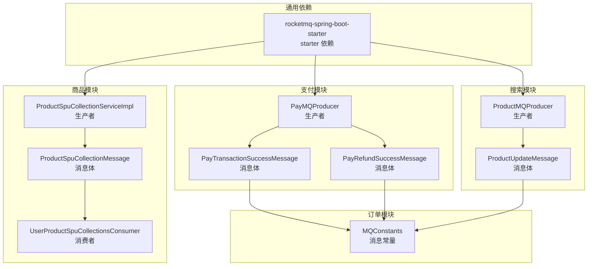
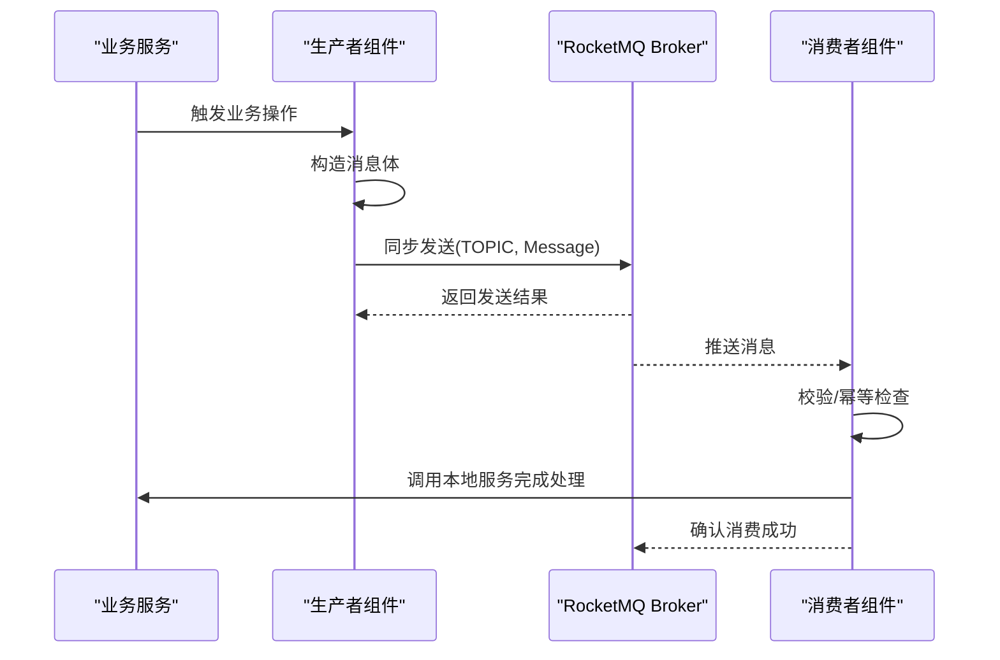
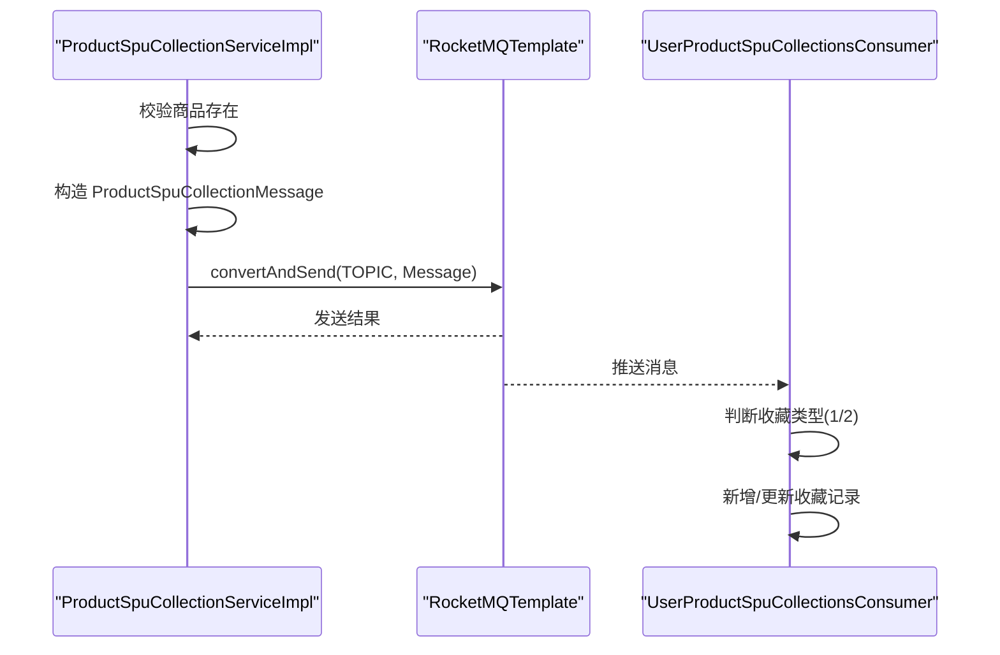
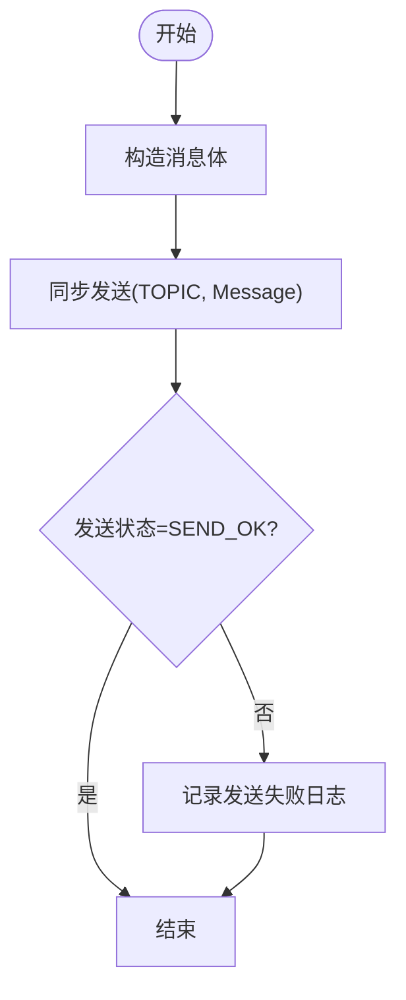
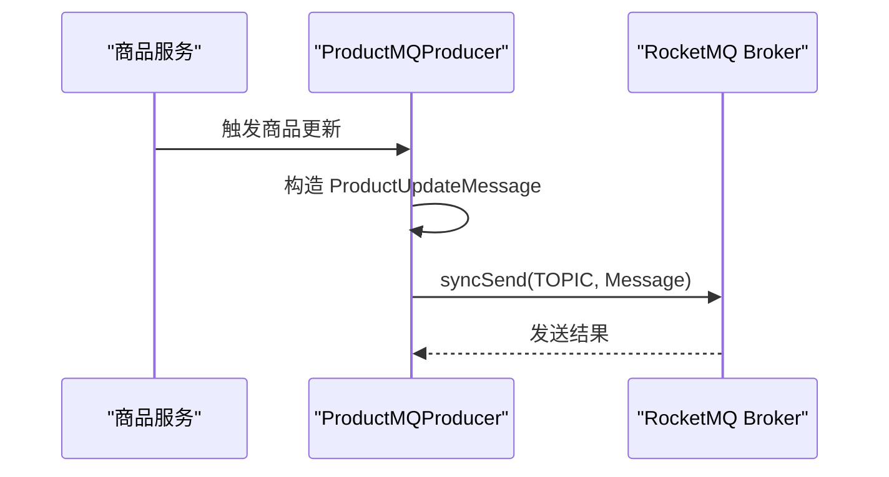
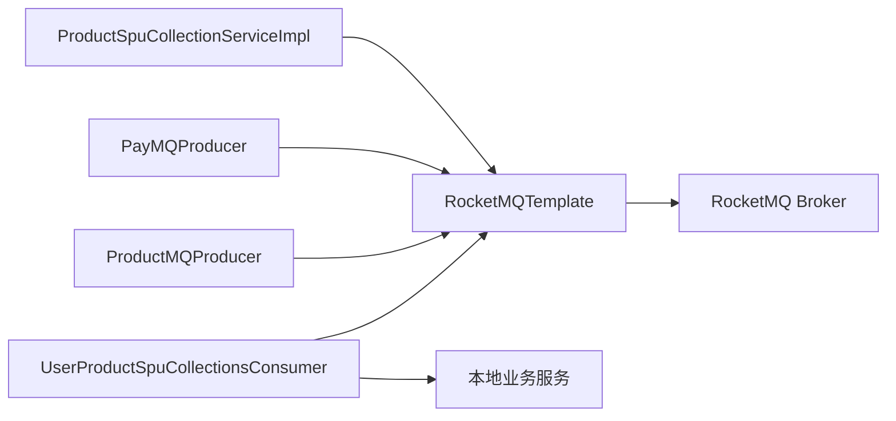

# 消息队列通信

<cite>
**本文引用的文件**
- [common/mall-spring-boot-starter-rocketmq/pom.xml](file://common/mall-spring-boot-starter-rocketmq/pom.xml)
- [moved/product/product-service-impl/src/main/java/cn/iocoder/mall/product/message/UserProductSpuCollectionsConsumer.java](file://moved/product/product-service-impl/src/main/java/cn/iocoder/mall/product/message/UserProductSpuCollectionsConsumer.java)
- [moved/product/product-service-impl/src/main/java/cn/iocoder/mall/product/service/ProductSpuCollectionServiceImpl.java](file://moved/product/product-service-impl/src/main/java/cn/iocoder/mall/product/service/ProductSpuCollectionServiceImpl.java)
- [moved/product/product-service-api/src/main/java/cn/iocoder/mall/product/api/message/ProductSpuCollectionMessage.java](file://moved/product/product-service-api/src/main/java/cn/iocoder/mall/product/api/message/ProductSpuCollectionMessage.java)
- [pay-service-project/pay-service-app/src/main/java/cn/iocoder/mall/payservice/mq/producer/PayMQProducer.java](file://pay-service-project/pay-service-app/src/main/java/cn/iocoder/mall/payservice/mq/producer/PayMQProducer.java)
- [pay-service-project/pay-service-app/src/main/java/cn/iocoder/mall/payservice/mq/producer/message/PayTransactionSuccessMessage.java](file://pay-service-project/pay-service-app/src/main/java/cn/iocoder/mall/payservice/mq/producer/message/PayTransactionSuccessMessage.java)
- [pay-service-project/pay-service-app/src/main/java/cn/iocoder/mall/payservice/mq/producer/message/PayRefundSuccessMessage.java](file://pay-service-project/pay-service-app/src/main/java/cn/iocoder/mall/payservice/mq/producer/message/PayRefundSuccessMessage.java)
- [product-service-project/product-service-app/src/main/java/cn/iocoder/mall/productservice/mq/producer/ProductMQProducer.java](file://product-service-project/product-service-app/src/main/java/cn/iocoder/mall/productservice/mq/producer/ProductMQProducer.java)
- [product-service-project/product-service-app/src/main/java/cn/iocoder/mall/productservice/mq/producer/message/ProductUpdateMessage.java](file://product-service-project/product-service-app/src/main/java/cn/iocoder/mall/productservice/mq/producer/message/ProductUpdateMessage.java)
- [moved/order/order-biz-api/src/main/java/cn/iocoder/mall/order/biz/enums/order/MQConstants.java](file://moved/order/order-biz-api/src/main/java/cn/iocoder/mall/order/biz/enums/order/MQConstants.java)
- [moved/order/order-service-api02/src/main/java/cn/iocoder/mall/order/api/constant/MQConstants.java](file://moved/order/order-service-api02/src/main/java/cn/iocoder/mall/order/api/constant/MQConstants.java)
</cite>

## 目录
1. [引言](#引言)
2. [项目结构](#项目结构)
3. [核心组件](#核心组件)
4. [架构总览](#架构总览)
5. [详细组件分析](#详细组件分析)
6. [依赖关系分析](#依赖关系分析)
7. [性能考量](#性能考量)
8. [故障排查指南](#故障排查指南)
9. [结论](#结论)
10. [附录](#附录)

## 引言
本文件围绕 Onemall 的消息队列通信机制展开，重点基于 RocketMQ 的实现，系统性说明消息生产者与消费者的配置与使用方式；阐述异步通信带来的解耦、削峰填谷与提升系统可用性等优势；梳理消息可靠投递（确认、重试、死信）、幂等性保障策略，并给出可落地的消息格式设计、异常处理与监控告警建议。文中所有技术细节均以仓库中实际代码为依据。

## 项目结构
Onemall 采用多模块微服务架构，消息队列能力通过统一的 starter 提供依赖支撑，各业务模块按需引入并实现生产与消费逻辑。

- 统一依赖层：common/mall-spring-boot-starter-rocketmq 提供 RocketMQ Spring Boot Starter 依赖，便于各模块快速接入。
- 业务模块：
  - 商品模块：生产“商品收藏/取消”消息，消费者订阅并执行本地业务。
  - 支付模块：生产“支付交易成功/退款成功”消息，供其他模块消费。
  - 搜索模块：生产“商品更新”消息，触发索引重建等任务。
  - 订单模块：定义消息常量，用于跨模块约定。

图表来源
- [common/mall-spring-boot-starter-rocketmq/pom.xml:14-20](file://common/mall-spring-boot-starter-rocketmq/pom.xml#L14-L20)
- [moved/product/product-service-impl/src/main/java/cn/iocoder/mall/product/service/ProductSpuCollectionServiceImpl.java:31-63](file://moved/product/product-service-impl/src/main/java/cn/iocoder/mall/product/service/ProductSpuCollectionServiceImpl.java#L31-L63)
- [moved/product/product-service-impl/src/main/java/cn/iocoder/mall/product/message/UserProductSpuCollectionsConsumer.java:30-32](file://moved/product/product-service-impl/src/main/java/cn/iocoder/mall/product/message/UserProductSpuCollectionsConsumer.java#L30-L32)
- [moved/product/product-service-api/src/main/java/cn/iocoder/mall/product/api/message/ProductSpuCollectionMessage.java:14-56](file://moved/product/product-service-api/src/main/java/cn/iocoder/mall/product/api/message/ProductSpuCollectionMessage.java#L14-L56)
- [pay-service-project/pay-service-app/src/main/java/cn/iocoder/mall/payservice/mq/producer/PayMQProducer.java:17-18](file://pay-service-project/pay-service-app/src/main/java/cn/iocoder/mall/payservice/mq/producer/PayMQProducer.java#L17-L18)
- [pay-service-project/pay-service-app/src/main/java/cn/iocoder/mall/payservice/mq/producer/message/PayTransactionSuccessMessage.java:13-26](file://pay-service-project/pay-service-app/src/main/java/cn/iocoder/mall/payservice/mq/producer/message/PayTransactionSuccessMessage.java#L13-L26)
- [pay-service-project/pay-service-app/src/main/java/cn/iocoder/mall/payservice/mq/producer/message/PayRefundSuccessMessage.java:13-30](file://pay-service-project/pay-service-app/src/main/java/cn/iocoder/mall/payservice/mq/producer/message/PayRefundSuccessMessage.java#L13-L30)
- [product-service-project/product-service-app/src/main/java/cn/iocoder/mall/productservice/mq/producer/ProductMQProducer.java:15-16](file://product-service-project/product-service-app/src/main/java/cn/iocoder/mall/productservice/mq/producer/ProductMQProducer.java#L15-L16)
- [product-service-project/product-service-app/src/main/java/cn/iocoder/mall/productservice/mq/producer/message/ProductUpdateMessage.java:11-20](file://product-service-project/product-service-app/src/main/java/cn/iocoder/mall/productservice/mq/producer/message/ProductUpdateMessage.java#L11-L20)
- [moved/order/order-biz-api/src/main/java/cn/iocoder/mall/order/biz/enums/order/MQConstants.java:9-15](file://moved/order/order-biz-api/src/main/java/cn/iocoder/mall/order/biz/enums/order/MQConstants.java#L9-L15)
- [moved/order/order-service-api02/src/main/java/cn/iocoder/mall/order/api/constant/MQConstants.java:9-15](file://moved/order/order-service-api02/src/main/java/cn/iocoder/mall/order/api/constant/MQConstants.java#L9-L15)

章节来源
- [common/mall-spring-boot-starter-rocketmq/pom.xml:14-20](file://common/mall-spring-boot-starter-rocketmq/pom.xml#L14-L20)

## 核心组件
- RocketMQ Starter 依赖：通过统一的 starter 管理 RocketMQ 版本与自动装配，降低模块间差异。
- 生产者组件：
  - 商品收藏生产者：在业务方法中构造消息并调用 RocketMQTemplate 同步发送。
  - 支付生产者：封装同步发送逻辑，记录发送状态与异常日志。
  - 商品更新生产者：面向搜索/缓存等下游系统的数据变更通知。
- 消费者组件：
  - 商品收藏消费者：监听收藏/取消收藏事件，调用用户中心与本地服务完成落库或更新。
- 消息体：
  - 商品收藏消息：包含商品基础信息与收藏类型。
  - 支付交易/退款消息：携带交易单、退款单与应用订单编号等关键字段。
  - 商品更新消息：最小化承载商品主键，便于下游按需拉取最新数据。

章节来源
- [moved/product/product-service-impl/src/main/java/cn/iocoder/mall/product/service/ProductSpuCollectionServiceImpl.java:31-63](file://moved/product/product-service-impl/src/main/java/cn/iocoder/mall/product/service/ProductSpuCollectionServiceImpl.java#L31-L63)
- [moved/product/product-service-impl/src/main/java/cn/iocoder/mall/product/message/UserProductSpuCollectionsConsumer.java:30-32](file://moved/product/product-service-impl/src/main/java/cn/iocoder/mall/product/message/UserProductSpuCollectionsConsumer.java#L30-L32)
- [moved/product/product-service-api/src/main/java/cn/iocoder/mall/product/api/message/ProductSpuCollectionMessage.java:14-56](file://moved/product/product-service-api/src/main/java/cn/iocoder/mall/product/api/message/ProductSpuCollectionMessage.java#L14-L56)
- [pay-service-project/pay-service-app/src/main/java/cn/iocoder/mall/payservice/mq/producer/PayMQProducer.java:17-40](file://pay-service-project/pay-service-app/src/main/java/cn/iocoder/mall/payservice/mq/producer/PayMQProducer.java#L17-L40)
- [pay-service-project/pay-service-app/src/main/java/cn/iocoder/mall/payservice/mq/producer/message/PayTransactionSuccessMessage.java:13-26](file://pay-service-project/pay-service-app/src/main/java/cn/iocoder/mall/payservice/mq/producer/message/PayTransactionSuccessMessage.java#L13-L26)
- [pay-service-project/pay-service-app/src/main/java/cn/iocoder/mall/payservice/mq/producer/message/PayRefundSuccessMessage.java:13-30](file://pay-service-project/pay-service-app/src/main/java/cn/iocoder/mall/payservice/mq/producer/message/PayRefundSuccessMessage.java#L13-L30)
- [product-service-project/product-service-app/src/main/java/cn/iocoder/mall/productservice/mq/producer/ProductMQProducer.java:15-28](file://product-service-project/product-service-app/src/main/java/cn/iocoder/mall/productservice/mq/producer/ProductMQProducer.java#L15-L28)
- [product-service-project/product-service-app/src/main/java/cn/iocoder/mall/productservice/mq/producer/message/ProductUpdateMessage.java:11-20](file://product-service-project/product-service-app/src/main/java/cn/iocoder/mall/productservice/mq/producer/message/ProductUpdateMessage.java#L11-L20)

## 架构总览
下图展示 RocketMQ 在 Onemall 中的典型交互路径：生产者将业务事件转换为消息并发送到 Broker，消费者从 Broker 拉取并处理消息，最终完成业务闭环。

图表来源
- [moved/product/product-service-impl/src/main/java/cn/iocoder/mall/product/service/ProductSpuCollectionServiceImpl.java:51-62](file://moved/product/product-service-impl/src/main/java/cn/iocoder/mall/product/service/ProductSpuCollectionServiceImpl.java#L51-L62)
- [moved/product/product-service-impl/src/main/java/cn/iocoder/mall/product/message/UserProductSpuCollectionsConsumer.java:40-55](file://moved/product/product-service-impl/src/main/java/cn/iocoder/mall/product/message/UserProductSpuCollectionsConsumer.java#L40-L55)
- [pay-service-project/pay-service-app/src/main/java/cn/iocoder/mall/payservice/mq/producer/PayMQProducer.java:20-29](file://pay-service-project/pay-service-app/src/main/java/cn/iocoder/mall/payservice/mq/producer/PayMQProducer.java#L20-L29)

## 详细组件分析

### 商品收藏消息（生产者-消费者）
- 生产者职责：校验商品存在性后，构造商品收藏/取消收藏消息并通过 RocketMQTemplate 同步发送。
- 消费者职责：根据消息中的收藏类型执行新增或删除逻辑；同时通过远程服务查询用户昵称以完善本地记录。
- 幂等性：消费者对已存在的收藏记录进行状态判断，避免重复插入或错误更新。

图表来源
- [moved/product/product-service-impl/src/main/java/cn/iocoder/mall/product/service/ProductSpuCollectionServiceImpl.java:34-63](file://moved/product/product-service-impl/src/main/java/cn/iocoder/mall/product/service/ProductSpuCollectionServiceImpl.java#L34-L63)
- [moved/product/product-service-impl/src/main/java/cn/iocoder/mall/product/message/UserProductSpuCollectionsConsumer.java:40-55](file://moved/product/product-service-impl/src/main/java/cn/iocoder/mall/product/message/UserProductSpuCollectionsConsumer.java#L40-L55)
- [moved/product/product-service-api/src/main/java/cn/iocoder/mall/product/api/message/ProductSpuCollectionMessage.java:14-56](file://moved/product/product-service-api/src/main/java/cn/iocoder/mall/product/api/message/ProductSpuCollectionMessage.java#L14-L56)

章节来源
- [moved/product/product-service-impl/src/main/java/cn/iocoder/mall/product/service/ProductSpuCollectionServiceImpl.java:31-63](file://moved/product/product-service-impl/src/main/java/cn/iocoder/mall/product/service/ProductSpuCollectionServiceImpl.java#L31-L63)
- [moved/product/product-service-impl/src/main/java/cn/iocoder/mall/product/message/UserProductSpuCollectionsConsumer.java:30-126](file://moved/product/product-service-impl/src/main/java/cn/iocoder/mall/product/message/UserProductSpuCollectionsConsumer.java#L30-L126)
- [moved/product/product-service-api/src/main/java/cn/iocoder/mall/product/api/message/ProductSpuCollectionMessage.java:14-56](file://moved/product/product-service-api/src/main/java/cn/iocoder/mall/product/api/message/ProductSpuCollectionMessage.java#L14-L56)

### 支付消息（生产者）
- 支付生产者封装了两类消息的同步发送：交易成功与退款成功。
- 发送流程：构造消息体，调用 RocketMQTemplate 同步发送，捕获异常并记录日志，检查发送状态以判定是否成功。

图表来源
- [pay-service-project/pay-service-app/src/main/java/cn/iocoder/mall/payservice/mq/producer/PayMQProducer.java:20-40](file://pay-service-project/pay-service-app/src/main/java/cn/iocoder/mall/payservice/mq/producer/PayMQProducer.java#L20-L40)
- [pay-service-project/pay-service-app/src/main/java/cn/iocoder/mall/payservice/mq/producer/message/PayTransactionSuccessMessage.java:13-26](file://pay-service-project/pay-service-app/src/main/java/cn/iocoder/mall/payservice/mq/producer/message/PayTransactionSuccessMessage.java#L13-L26)
- [pay-service-project/pay-service-app/src/main/java/cn/iocoder/mall/payservice/mq/producer/message/PayRefundSuccessMessage.java:13-30](file://pay-service-project/pay-service-app/src/main/java/cn/iocoder/mall/payservice/mq/producer/message/PayRefundSuccessMessage.java#L13-L30)

章节来源
- [pay-service-project/pay-service-app/src/main/java/cn/iocoder/mall/payservice/mq/producer/PayMQProducer.java:17-40](file://pay-service-project/pay-service-app/src/main/java/cn/iocoder/mall/payservice/mq/producer/PayMQProducer.java#L17-L40)
- [pay-service-project/pay-service-app/src/main/java/cn/iocoder/mall/payservice/mq/producer/message/PayTransactionSuccessMessage.java:13-26](file://pay-service-project/pay-service-app/src/main/java/cn/iocoder/mall/payservice/mq/producer/message/PayTransactionSuccessMessage.java#L13-L26)
- [pay-service-project/pay-service-app/src/main/java/cn/iocoder/mall/payservice/mq/producer/message/PayRefundSuccessMessage.java:13-30](file://pay-service-project/pay-service-app/src/main/java/cn/iocoder/mall/payservice/mq/producer/message/PayRefundSuccessMessage.java#L13-L30)

### 商品更新消息（生产者）
- 商品更新生产者负责在商品数据变更后，向下游广播“商品更新”事件，便于搜索/缓存等模块按需刷新。

图表来源
- [product-service-project/product-service-app/src/main/java/cn/iocoder/mall/productservice/mq/producer/ProductMQProducer.java:18-28](file://product-service-project/product-service-app/src/main/java/cn/iocoder/mall/productservice/mq/producer/ProductMQProducer.java#L18-L28)
- [product-service-project/product-service-app/src/main/java/cn/iocoder/mall/productservice/mq/producer/message/ProductUpdateMessage.java:11-20](file://product-service-project/product-service-app/src/main/java/cn/iocoder/mall/productservice/mq/producer/message/ProductUpdateMessage.java#L11-L20)

章节来源
- [product-service-project/product-service-app/src/main/java/cn/iocoder/mall/productservice/mq/producer/ProductMQProducer.java:15-31](file://product-service-project/product-service-app/src/main/java/cn/iocoder/mall/productservice/mq/producer/ProductMQProducer.java#L15-L31)
- [product-service-project/product-service-app/src/main/java/cn/iocoder/mall/productservice/mq/producer/message/ProductUpdateMessage.java:11-21](file://product-service-project/product-service-app/src/main/java/cn/iocoder/mall/productservice/mq/producer/message/ProductUpdateMessage.java#L11-L21)

### 订单消息常量（跨模块契约）
- 订单模块定义了消息常量，作为跨模块的契约，确保生产者与消费者对主题名称达成一致。

章节来源
- [moved/order/order-biz-api/src/main/java/cn/iocoder/mall/order/biz/enums/order/MQConstants.java:9-15](file://moved/order/order-biz-api/src/main/java/cn/iocoder/mall/order/biz/enums/order/MQConstants.java#L9-L15)
- [moved/order/order-service-api02/src/main/java/cn/iocoder/mall/order/api/constant/MQConstants.java:9-15](file://moved/order/order-service-api02/src/main/java/cn/iocoder/mall/order/api/constant/MQConstants.java#L9-L15)

## 依赖关系分析
- 组件耦合：
  - 生产者仅依赖 RocketMQTemplate 与消息体定义，不直接依赖消费者实现，保持低耦合。
  - 消费者通过注解声明监听 Topic 与 Consumer Group，实现松耦合订阅。
- 外部依赖：
  - 通过统一的 starter 引入 RocketMQ Spring Boot Starter，保证版本与自动装配的一致性。
- 潜在风险：
  - 当前消费者未显式开启重试与死信队列配置，若出现异常，需结合 RocketMQ 集群策略与业务补偿机制共同保障可靠性。

图表来源
- [moved/product/product-service-impl/src/main/java/cn/iocoder/mall/product/service/ProductSpuCollectionServiceImpl.java:31-32](file://moved/product/product-service-impl/src/main/java/cn/iocoder/mall/product/service/ProductSpuCollectionServiceImpl.java#L31-L32)
- [pay-service-project/pay-service-app/src/main/java/cn/iocoder/mall/payservice/mq/producer/PayMQProducer.java:17-18](file://pay-service-project/pay-service-app/src/main/java/cn/iocoder/mall/payservice/mq/producer/PayMQProducer.java#L17-L18)
- [product-service-project/product-service-app/src/main/java/cn/iocoder/mall/productservice/mq/producer/ProductMQProducer.java:15-16](file://product-service-project/product-service-app/src/main/java/cn/iocoder/mall/productservice/mq/producer/ProductMQProducer.java#L15-L16)
- [moved/product/product-service-impl/src/main/java/cn/iocoder/mall/product/message/UserProductSpuCollectionsConsumer.java:30-32](file://moved/product/product-service-impl/src/main/java/cn/iocoder/mall/product/message/UserProductSpuCollectionsConsumer.java#L30-L32)

章节来源
- [common/mall-spring-boot-starter-rocketmq/pom.xml:14-20](file://common/mall-spring-boot-starter-rocketmq/pom.xml#L14-L20)

## 性能考量
- 同步发送与阻塞：当前生产者普遍使用同步发送，适合强一致与可观测性要求高的场景；在高并发下可能带来线程阻塞，建议评估批量发送与异步发送策略。
- 消息大小控制：消息体应尽量精简，避免携带冗余字段；如需复杂数据，建议仅携带主键由下游拉取。
- 分区与并发：合理设置 Topic 分区数与消费者并发度，避免热点分区与消费堆积。
- 监控指标：建议采集发送成功率、延迟、堆积量、消费速率与异常率等关键指标，结合告警阈值进行预警。

## 故障排查指南
- 发送失败排查
  - 检查发送返回状态与异常日志，定位网络、Broker 可用性与权限问题。
  - 关注消息体序列化与 Topic 配置是否正确。
- 消费异常排查
  - 消费者内部异常需确保被日志记录与告警；对于可恢复异常建议重试，不可恢复异常建议进入死信处理。
  - 核对消费者组与 Topic 是否匹配，确认集群路由与订阅关系正常。
- 幂等性验证
  - 对于重复消费，消费者侧应具备幂等判断逻辑（如已存在则跳过），避免重复写入。
  - 建议引入外部幂等表或唯一键约束，防止业务状态不一致。
- 监控与告警
  - 建议对接监控平台，对发送失败、消费延迟、堆积量、异常率等建立阈值告警。

章节来源
- [pay-service-project/pay-service-app/src/main/java/cn/iocoder/mall/payservice/mq/producer/PayMQProducer.java:20-40](file://pay-service-project/pay-service-app/src/main/java/cn/iocoder/mall/payservice/mq/producer/PayMQProducer.java#L20-L40)
- [moved/product/product-service-impl/src/main/java/cn/iocoder/mall/product/message/UserProductSpuCollectionsConsumer.java:40-55](file://moved/product/product-service-impl/src/main/java/cn/iocoder/mall/product/message/UserProductSpuCollectionsConsumer.java#L40-L55)

## 结论
Onemall 基于 RocketMQ 的消息队列通信实现了生产与消费的清晰分离：生产者专注于事件产生与可靠投递，消费者专注业务处理与幂等保障。通过统一的 starter 与模块化的消息体设计，系统在解耦、削峰与可用性方面取得良好效果。建议在现有基础上进一步完善重试与死信、监控告警与性能优化，以满足更高吞吐与更严苛的可靠性要求。

## 附录
- 消息格式设计建议
  - 最小化消息体：仅包含主键与必要上下文，避免大对象传输。
  - 明确 Topic 与消息体命名规范，便于跨模块协作。
  - 为每个消息体定义清晰的字段含义与默认值策略。
- 异步通信优势与适用场景
  - 解耦：生产者与消费者无需感知彼此实现细节。
  - 削峰填谷：在流量高峰时平滑处理请求。
  - 提升可用性：单点故障不影响整体链路，具备弹性恢复能力。
- 可靠投递与幂等性
  - 可靠投递：利用同步发送与发送状态校验，结合重试与死信队列策略。
  - 幂等性：消费者侧增加幂等判断与去重机制，必要时引入外部幂等表。