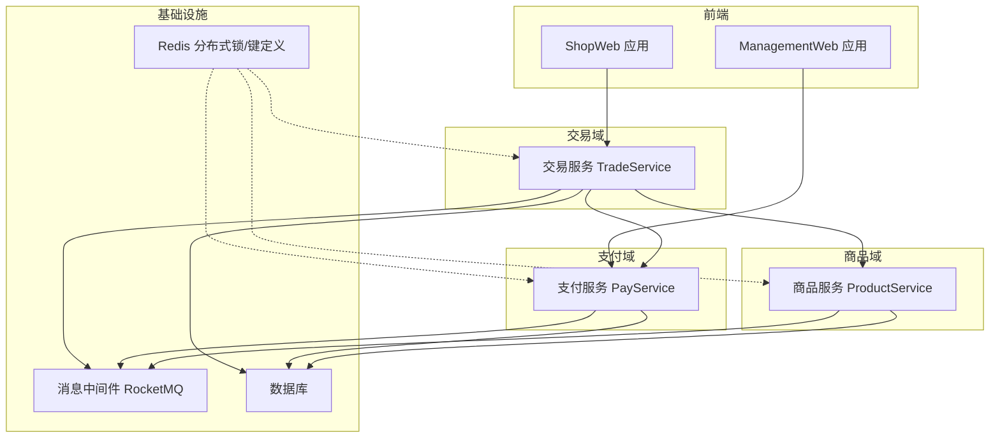
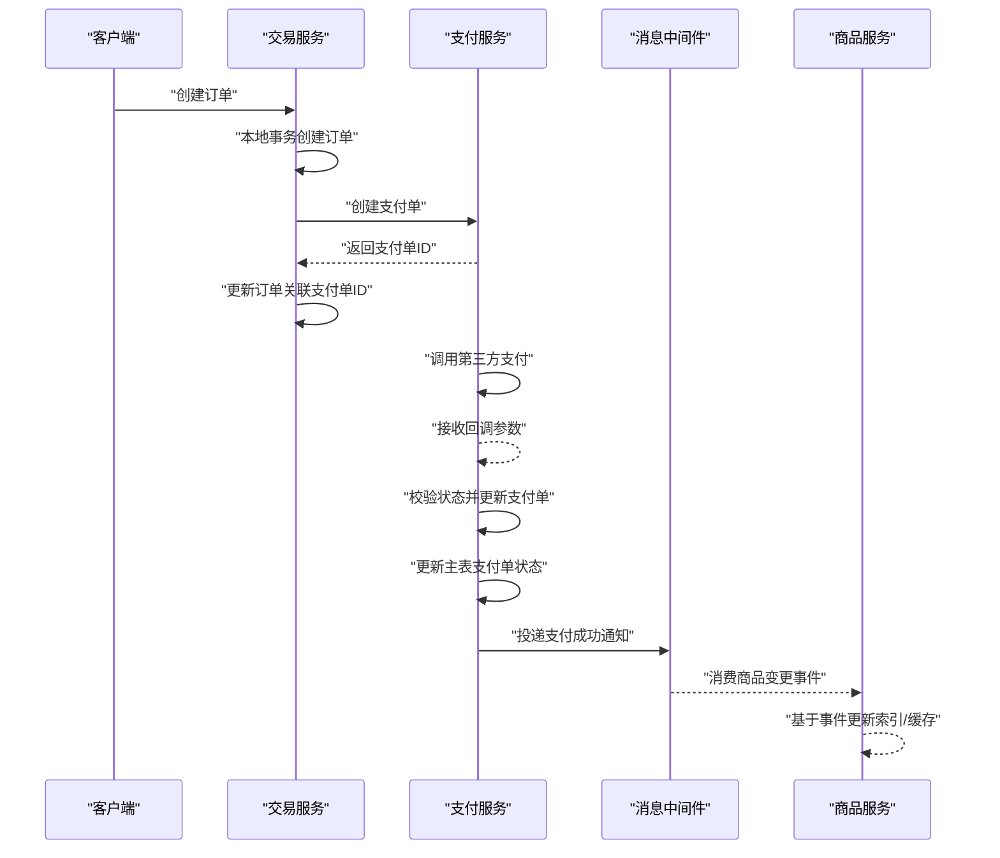
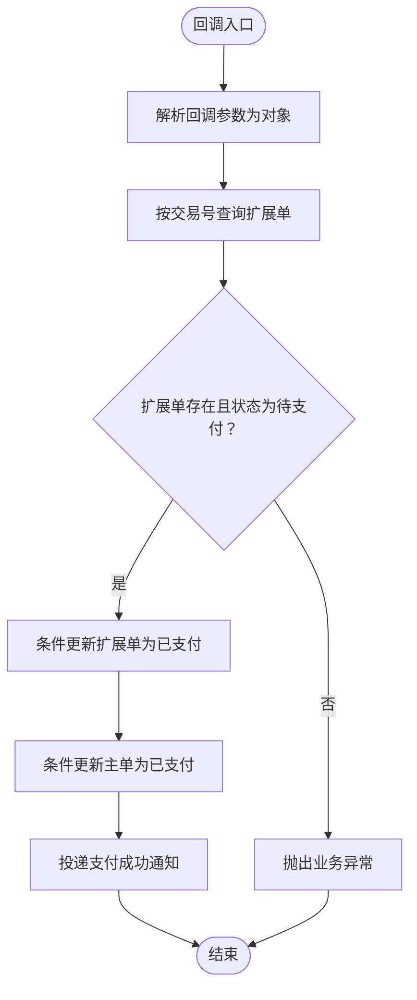
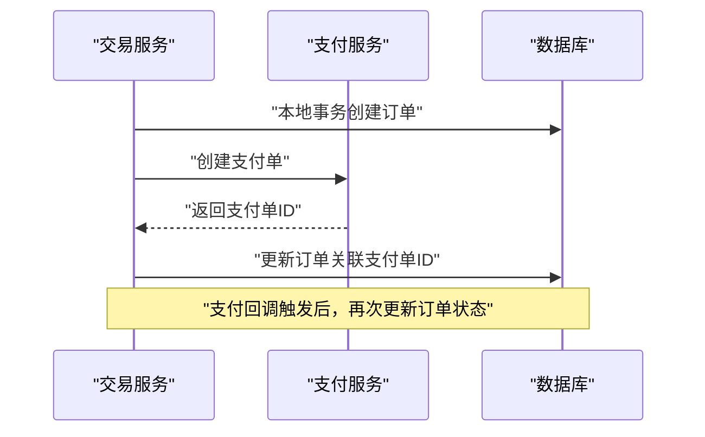
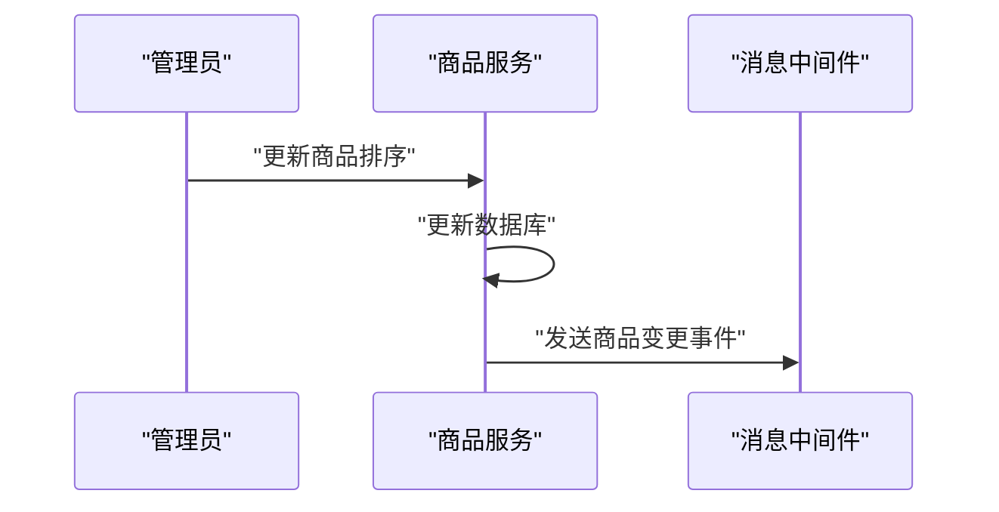
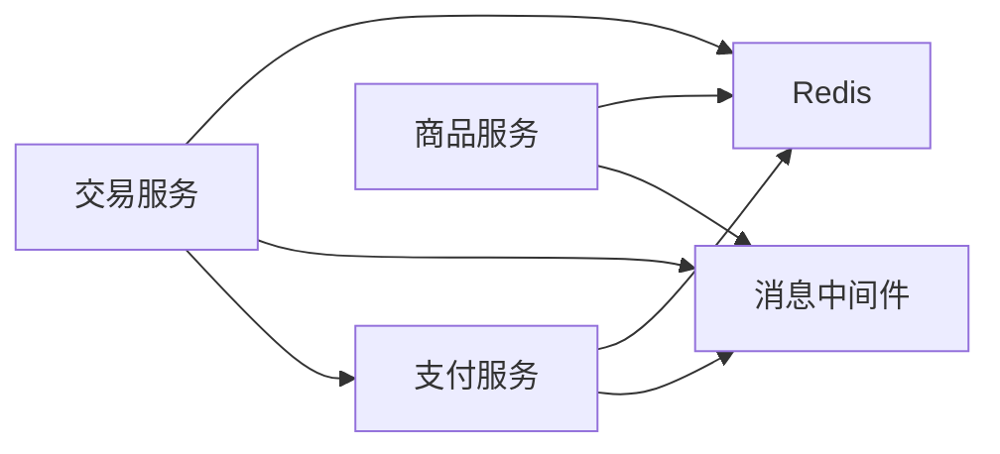

# 数据一致性设计

<cite>
**本文引用的文件**
- [CommonResult.java](file://common/common-framework/src/main/java/cn/iocoder/common/framework/vo/CommonResult.java)
- [GlobalException.java](file://common/common-framework/src/main/java/cn/iocoder/common/framework/exception/GlobalException.java)
- [RedisKeyDefine.java](file://common/mall-spring-boot-starter-redis/src/main/java/cn/iocoder/mall/redis/core/RedisKeyDefine.java)
- [PayTransactionServiceImpl.java](file://pay-service-project/pay-service-app/src/main/java/cn/iocoder/mall/payservice/service/transaction/impl/PayTransactionServiceImpl.java)
- [TradeOrderServiceImpl.java](file://trade-service-project/trade-service-app/src/main/java/cn/iocoder/mall/tradeservice/service/order/impl/TradeOrderServiceImpl.java)
- [ProductSpuServiceImpl.java](file://moved/product/product-service-impl/src/main/java/cn/iocoder/mall/product/service/ProductSpuServiceImpl.java)
- [pom.xml（RocketMQ Starter）](file://common/mall-spring-boot-starter-rocketmq/pom.xml)
</cite>

## 目录
1. [引言](#引言)
2. [项目结构](#项目结构)
3. [核心组件](#核心组件)
4. [架构总览](#架构总览)
5. [详细组件分析](#详细组件分析)
6. [依赖关系分析](#依赖关系分析)
7. [性能考量](#性能考量)
8. [故障排查指南](#故障排查指南)
9. [结论](#结论)
10. [附录](#附录)

## 引言
本技术文档围绕 Onemall 在分布式环境下的数据一致性设计展开，聚焦于强一致与最终一致的权衡策略、分布式事务的技术选型（TCC、Saga、最大努力通知）、补偿机制（事务回滚、幂等性、状态机）、跨服务数据同步（事件驱动、CQRS、事件溯源）以及一致性监控与治理（分布式锁、事务协调器、一致性检查）。通过对现有模块的源码级分析，提炼出可落地的最佳实践与实施建议，帮助开发者构建可靠的分布式数据一致性保障体系。

## 项目结构
Onemall 采用多模块微服务架构，围绕“交易-支付-商品-营销-用户-系统”六大领域划分服务，通过 RPC（Dubbo）与消息中间件（RocketMQ）实现服务间通信。数据一致性相关的关键点体现在：
- 统一的响应与异常模型：统一返回体与异常封装，便于上层事务编排与补偿处理。
- 支付与交易链路：交易服务创建订单后联动支付服务创建支付单，支付回调更新支付状态并触发后续通知。
- 商品服务：通过消息发布商品变更事件，支撑下游系统的最终一致性消费。
- 基础设施：Redis 提供分布式锁与键空间定义能力；RocketMQ 提供事件驱动与解耦。

图示来源
- [TradeOrderServiceImpl.java:74-108](file://trade-service-project/trade-service-app/src/main/java/cn/iocoder/mall/tradeservice/service/order/impl/TradeOrderServiceImpl.java#L74-L108)
- [PayTransactionServiceImpl.java:52-104](file://pay-service-project/pay-service-app/src/main/java/cn/iocoder/mall/payservice/service/transaction/impl/PayTransactionServiceImpl.java#L52-L104)
- [ProductSpuServiceImpl.java:61-63](file://moved/product/product-service-impl/src/main/java/cn/iocoder/mall/product/service/ProductSpuServiceImpl.java#L61-L63)
- [pom.xml（RocketMQ Starter）:14-20](file://common/mall-spring-boot-starter-rocketmq/pom.xml#L14-L20)

章节来源
- [TradeOrderServiceImpl.java:74-108](file://trade-service-project/trade-service-app/src/main/java/cn/iocoder/mall/tradeservice/service/order/impl/TradeOrderServiceImpl.java#L74-L108)
- [PayTransactionServiceImpl.java:52-104](file://pay-service-project/pay-service-app/src/main/java/cn/iocoder/mall/payservice/service/transaction/impl/PayTransactionServiceImpl.java#L52-L104)
- [ProductSpuServiceImpl.java:61-63](file://moved/product/product-service-impl/src/main/java/cn/iocoder/mall/product/service/ProductSpuServiceImpl.java#L61-L63)
- [pom.xml（RocketMQ Starter）:14-20](file://common/mall-spring-boot-starter-rocketmq/pom.xml#L14-L20)

## 核心组件
- 统一返回与异常模型
  - 统一返回体用于跨服务交互与补偿编排，异常模型区分全局异常与业务异常，便于上层做幂等与重试策略。
- 支付交易单服务
  - 负责创建支付单、提交支付、查询状态、回调处理与通知任务插入，体现“最大努力通知”的典型流程。
- 交易订单服务
  - 创建订单并联动创建支付单，演示跨服务的事务协调思路；注释中预留 Seata 分布式事务标记，体现对强一致的探索。
- 商品服务
  - 更新排序后发送商品变更消息，支撑事件驱动的最终一致性。
- 分布式锁与键定义
  - RedisKeyDefine 提供键模板、类型与过期时间定义，为分布式锁与缓存一致性提供基础。

章节来源
- [CommonResult.java:127-154](file://common/common-framework/src/main/java/cn/iocoder/common/framework/vo/CommonResult.java#L127-L154)
- [GlobalException.java:9-72](file://common/common-framework/src/main/java/cn/iocoder/common/framework/exception/GlobalException.java#L9-L72)
- [PayTransactionServiceImpl.java:52-168](file://pay-service-project/pay-service-app/src/main/java/cn/iocoder/mall/payservice/service/transaction/impl/PayTransactionServiceImpl.java#L52-L168)
- [TradeOrderServiceImpl.java:74-108](file://trade-service-project/trade-service-app/src/main/java/cn/iocoder/mall/tradeservice/service/order/impl/TradeOrderServiceImpl.java#L74-L108)
- [ProductSpuServiceImpl.java:61-63](file://moved/product/product-service-impl/src/main/java/cn/iocoder/mall/product/service/ProductSpuServiceImpl.java#L61-L63)
- [RedisKeyDefine.java:8-72](file://common/mall-spring-boot-starter-redis/src/main/java/cn/iocoder/mall/redis/core/RedisKeyDefine.java#L8-L72)

## 架构总览
下图展示了交易-支付-商品三域在数据一致性上的交互路径，强调“最大努力通知”与事件驱动的最终一致性策略。

图示来源
- [TradeOrderServiceImpl.java:168-184](file://trade-service-project/trade-service-app/src/main/java/cn/iocoder/mall/tradeservice/service/order/impl/TradeOrderServiceImpl.java#L168-L184)
- [PayTransactionServiceImpl.java:114-168](file://pay-service-project/pay-service-app/src/main/java/cn/iocoder/mall/payservice/service/transaction/impl/PayTransactionServiceImpl.java#L114-L168)
- [ProductSpuServiceImpl.java:61-63](file://moved/product/product-service-impl/src/main/java/cn/iocoder/mall/product/service/ProductSpuServiceImpl.java#L61-L63)

## 详细组件分析

### 支付交易单服务（PayTransactionServiceImpl）
- 关键职责
  - 创建支付单与扩展单，提交支付请求，查询状态，处理回调并更新状态，最后投递通知任务。
- 数据一致性策略
  - 使用本地事务更新扩展单与主单，结合状态字段的条件更新（CAS）保证并发安全。
  - 回调处理采用幂等校验（按交易号查询扩展单），避免重复回调导致的状态不一致。
- 补偿机制
  - 回调处理中对状态进行严格校验，若状态非“待支付”，抛出业务异常，由上层统一处理或重试。
  - 通知任务插入确保后续流程（如库存扣减、发货）以事件驱动方式推进，降低耦合。
- 幂等性与状态机
  - 通过状态枚举与条件更新形成简单状态机，确保状态流转有序可控。
  - 交易号作为幂等键，防止重复处理。

图示来源
- [PayTransactionServiceImpl.java:114-168](file://pay-service-project/pay-service-app/src/main/java/cn/iocoder/mall/payservice/service/transaction/impl/PayTransactionServiceImpl.java#L114-L168)

章节来源
- [PayTransactionServiceImpl.java:52-168](file://pay-service-project/pay-service-app/src/main/java/cn/iocoder/mall/payservice/service/transaction/impl/PayTransactionServiceImpl.java#L52-L168)

### 交易订单服务（TradeOrderServiceImpl）
- 关键职责
  - 创建订单（本地事务），联动创建支付单，随后在支付回调中更新订单状态。
- 分布式事务探索
  - 方法上预留分布式事务注解标记，表明团队对强一致场景（如库存扣减）的探索意愿。
- 事务编排
  - 先本地事务落库，再调用支付服务创建支付单，最后由支付回调驱动状态更新，形成“最大努力通知”的最终一致链路。

图示来源
- [TradeOrderServiceImpl.java:74-108](file://trade-service-project/trade-service-app/src/main/java/cn/iocoder/mall/tradeservice/service/order/impl/TradeOrderServiceImpl.java#L74-L108)
- [TradeOrderServiceImpl.java:168-184](file://trade-service-project/trade-service-app/src/main/java/cn/iocoder/mall/tradeservice/service/order/impl/TradeOrderServiceImpl.java#L168-L184)

章节来源
- [TradeOrderServiceImpl.java:74-108](file://trade-service-project/trade-service-app/src/main/java/cn/iocoder/mall/tradeservice/service/order/impl/TradeOrderServiceImpl.java#L74-L108)
- [TradeOrderServiceImpl.java:244-277](file://trade-service-project/trade-service-app/src/main/java/cn/iocoder/mall/tradeservice/service/order/impl/TradeOrderServiceImpl.java#L244-L277)

### 商品服务（ProductSpuServiceImpl）
- 关键职责
  - 更新排序后发送商品变更消息，支撑下游系统的最终一致性消费。
- 事件驱动
  - 通过消息通道发布商品更新事件，下游可订阅并异步处理，实现跨服务数据同步。

图示来源
- [ProductSpuServiceImpl.java:61-63](file://moved/product/product-service-impl/src/main/java/cn/iocoder/mall/product/service/ProductSpuServiceImpl.java#L61-L63)

章节来源
- [ProductSpuServiceImpl.java:61-63](file://moved/product/product-service-impl/src/main/java/cn/iocoder/mall/product/service/ProductSpuServiceImpl.java#L61-L63)

### 统一返回与异常模型（CommonResult/GlobalException）
- 统一返回体
  - 提供 success/error 工厂方法与错误检查逻辑，便于上层统一处理异常与重试。
- 异常模型
  - 区分全局异常与业务异常，配合错误码常量，支撑幂等与补偿策略。

章节来源
- [CommonResult.java:127-154](file://common/common-framework/src/main/java/cn/iocoder/common/framework/vo/CommonResult.java#L127-L154)
- [GlobalException.java:9-72](file://common/common-framework/src/main/java/cn/iocoder/common/framework/exception/GlobalException.java#L9-L72)

### 分布式锁与键定义（RedisKeyDefine）
- 键定义
  - 提供键模板、类型与过期时间定义，支持多种 Redis 数据结构。
- 分布式锁
  - 可基于该定义实现分布式锁，保障跨实例的互斥访问，避免竞态条件引发的数据不一致。

章节来源
- [RedisKeyDefine.java:8-72](file://common/mall-spring-boot-starter-redis/src/main/java/cn/iocoder/mall/redis/core/RedisKeyDefine.java#L8-L72)

## 依赖关系分析
- 服务间依赖
  - 交易服务依赖支付服务创建支付单；商品服务通过消息中间件与交易/支付服务解耦。
- 中间件依赖
  - RocketMQ 作为事件总线，承载跨服务事件与通知，支撑最终一致性。
- 基础设施依赖
  - Redis 提供分布式锁与键空间定义，为一致性与缓存一致性提供基础。

图示来源
- [TradeOrderServiceImpl.java:168-184](file://trade-service-project/trade-service-app/src/main/java/cn/iocoder/mall/tradeservice/service/order/impl/TradeOrderServiceImpl.java#L168-L184)
- [PayTransactionServiceImpl.java:165-165](file://pay-service-project/pay-service-app/src/main/java/cn/iocoder/mall/payservice/service/transaction/impl/PayTransactionServiceImpl.java#L165-L165)
- [ProductSpuServiceImpl.java:61-63](file://moved/product/product-service-impl/src/main/java/cn/iocoder/mall/product/service/ProductSpuServiceImpl.java#L61-L63)
- [pom.xml（RocketMQ Starter）:14-20](file://common/mall-spring-boot-starter-rocketmq/pom.xml#L14-L20)

章节来源
- [TradeOrderServiceImpl.java:168-184](file://trade-service-project/trade-service-app/src/main/java/cn/iocoder/mall/tradeservice/service/order/impl/TradeOrderServiceImpl.java#L168-L184)
- [PayTransactionServiceImpl.java:165-165](file://pay-service-project/pay-service-app/src/main/java/cn/iocoder/mall/payservice/service/transaction/impl/PayTransactionServiceImpl.java#L165-L165)
- [ProductSpuServiceImpl.java:61-63](file://moved/product/product-service-impl/src/main/java/cn/iocoder/mall/product/service/ProductSpuServiceImpl.java#L61-L63)
- [pom.xml（RocketMQ Starter）:14-20](file://common/mall-spring-boot-starter-rocketmq/pom.xml#L14-L20)

## 性能考量
- 事务边界最小化
  - 优先使用本地事务完成核心写入，将跨服务操作转为事件驱动，降低长事务带来的锁竞争与延迟。
- 幂等与重试
  - 回调与消息消费均需具备幂等性，结合唯一键（交易号、消息ID）实现去重，避免重复处理造成性能浪费。
- 缓存与数据库一致性
  - 使用 Redis 键定义规范管理缓存键与过期策略，结合事件驱动刷新缓存，减少热点读放大。
- 异步化与削峰
  - 通过消息中间件异步化非关键路径（如通知、索引重建），提升整体吞吐与稳定性。

## 故障排查指南
- 支付回调异常
  - 现象：回调后状态未更新或重复回调。
  - 排查要点：确认回调参数解析是否成功、扩展单是否存在且状态为“待支付”、条件更新是否命中。
  - 参考路径：[回调处理与条件更新:114-168](file://pay-service-project/pay-service-app/src/main/java/cn/iocoder/mall/payservice/service/transaction/impl/PayTransactionServiceImpl.java#L114-L168)
- 订单状态不一致
  - 现象：订单显示“待支付”，但支付已完成。
  - 排查要点：检查支付回调是否成功、通知任务是否投递、交易服务是否正确更新订单状态。
  - 参考路径：[订单状态更新:244-277](file://trade-service-project/trade-service-app/src/main/java/cn/iocoder/mall/tradeservice/service/order/impl/TradeOrderServiceImpl.java#L244-L277)
- 消息积压与丢失
  - 现象：商品变更事件未被消费。
  - 排查要点：检查消息中间件配置、消费者组与分区、ACK 机制与重试策略。
  - 参考路径：[消息投递:165-165](file://pay-service-project/pay-service-app/src/main/java/cn/iocoder/mall/payservice/service/transaction/impl/PayTransactionServiceImpl.java#L165-L165)，[商品事件发布:61-63](file://moved/product/product-service-impl/src/main/java/cn/iocoder/mall/product/service/ProductSpuServiceImpl.java#L61-L63)
- 分布式锁冲突
  - 现象：高并发下资源争用导致写入失败。
  - 排查要点：确认锁键命名规范、过期时间与续期策略、异常释放锁的兜底处理。
  - 参考路径：[Redis 键定义:8-72](file://common/mall-spring-boot-starter-redis/src/main/java/cn/iocoder/mall/redis/core/RedisKeyDefine.java#L8-L72)

章节来源
- [PayTransactionServiceImpl.java:114-168](file://pay-service-project/pay-service-app/src/main/java/cn/iocoder/mall/payservice/service/transaction/impl/PayTransactionServiceImpl.java#L114-L168)
- [TradeOrderServiceImpl.java:244-277](file://trade-service-project/trade-service-app/src/main/java/cn/iocoder/mall/tradeservice/service/order/impl/TradeOrderServiceImpl.java#L244-L277)
- [ProductSpuServiceImpl.java:61-63](file://moved/product/product-service-impl/src/main/java/cn/iocoder/mall/product/service/ProductSpuServiceImpl.java#L61-L63)
- [RedisKeyDefine.java:8-72](file://common/mall-spring-boot-starter-redis/src/main/java/cn/iocoder/mall/redis/core/RedisKeyDefine.java#L8-L72)

## 结论
Onemall 的数据一致性设计以“最大努力通知”与事件驱动为核心，辅以统一的异常与返回模型、Redis 分布式锁与键定义、以及消息中间件的异步化能力，实现了跨服务的最终一致性。对于强一致需求（如库存扣减），可在现有基础上引入分布式事务（如 Seata）或 TCC/Saga 模式进行演进。通过幂等性、状态机与补偿机制，系统在复杂分布式环境下仍能保持稳健与可维护性。

## 附录
- 技术选型建议
  - 强一致：优先评估 Seata AT/TCC；对跨库事务复杂度高的场景可考虑 Saga。
  - 最终一致：继续强化事件驱动与消息可靠性，完善幂等与重试策略。
- 最佳实践清单
  - 所有跨服务写操作均应具备幂等键与去重逻辑。
  - 使用状态机与条件更新，确保状态流转可追踪、可回滚。
  - 将长事务拆分为本地事务+事件，降低锁持有时间。
  - 建立一致性检查工具与告警机制，定期巡检关键链路。