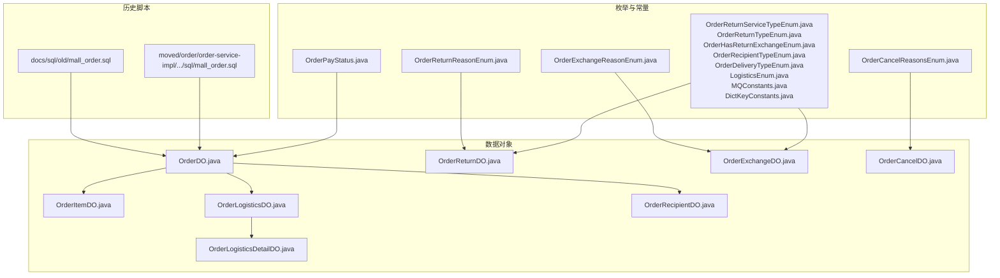
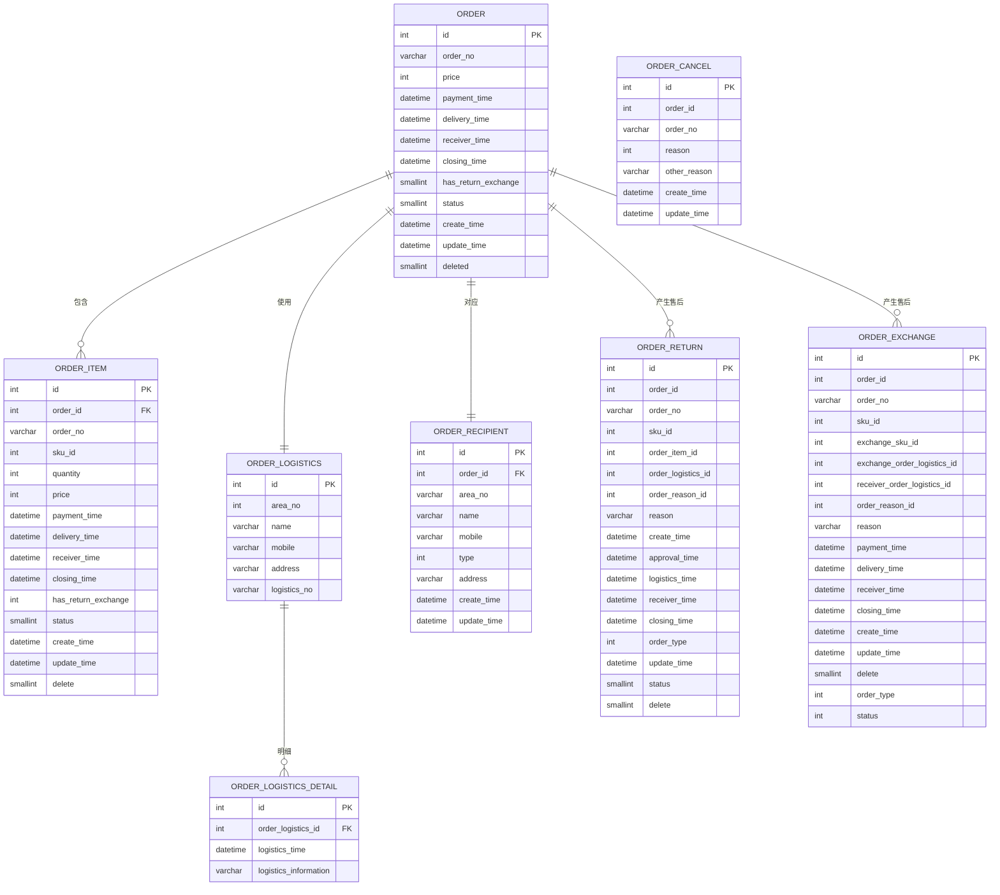
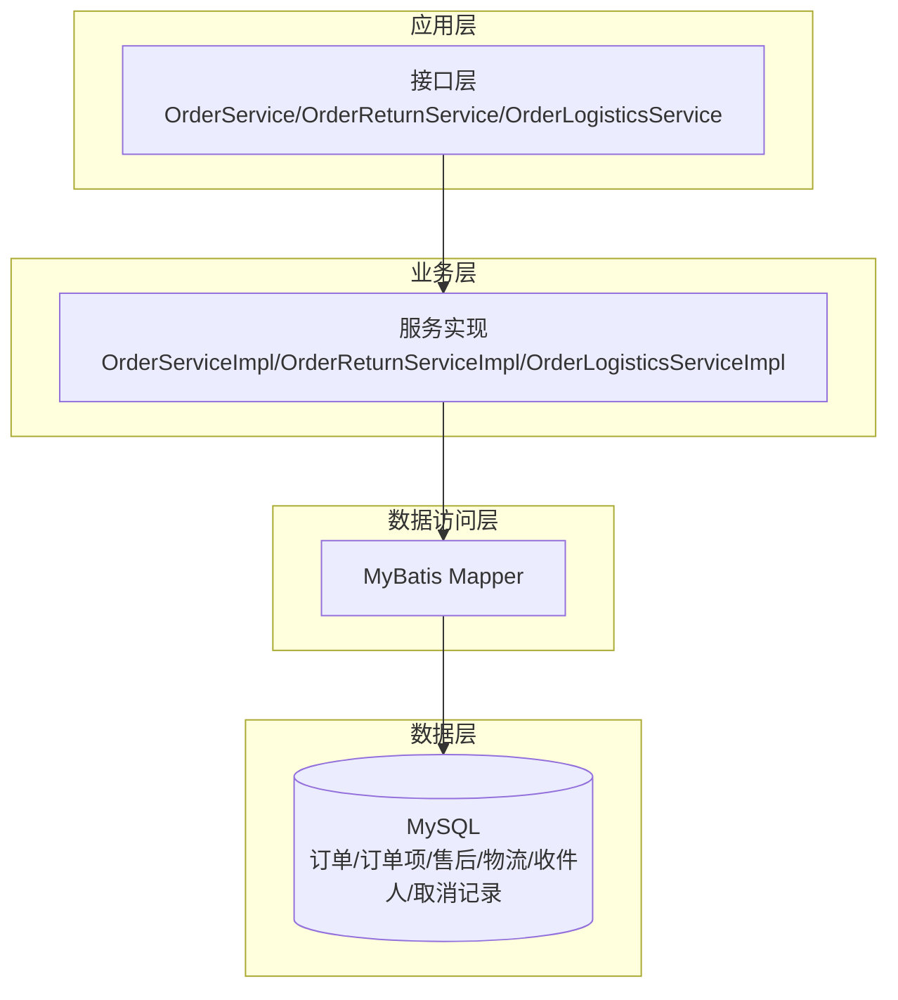
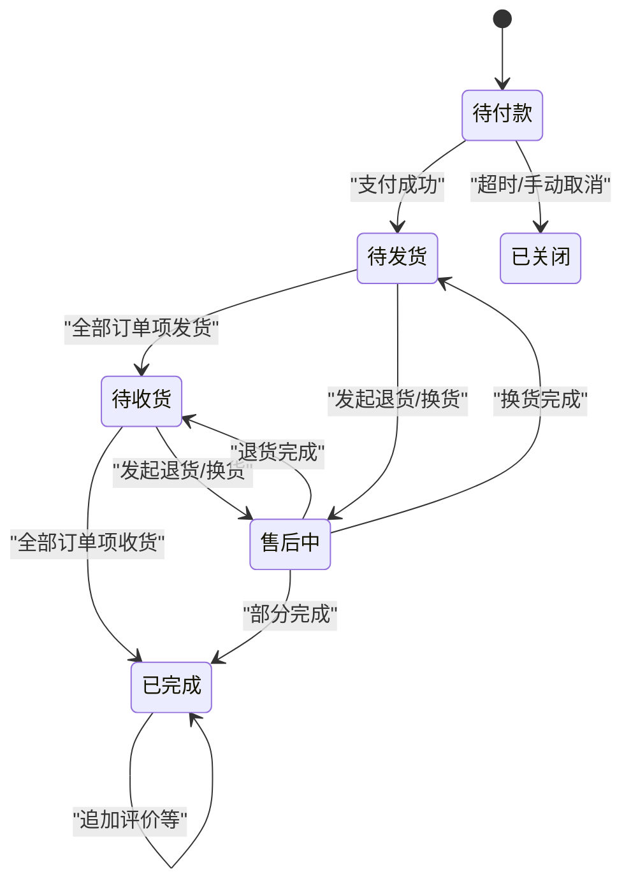
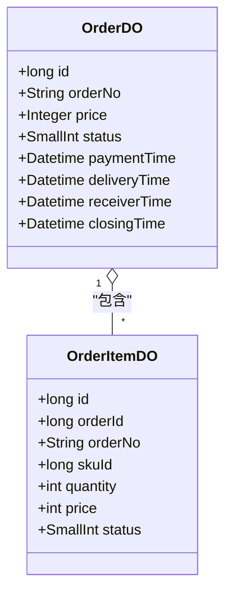
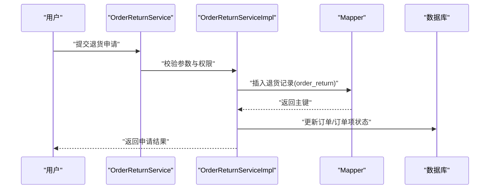
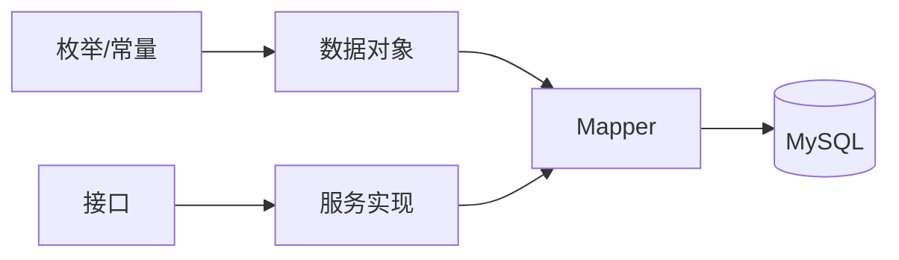

# 交易服务数据库设计

<cite>
**本文引用的文件**
- [docs/sql/old/mall_order.sql](file://docs/sql/old/mall_order.sql)
- [moved/order/order-service-impl/src/main/resources/sql/mall_order.sql](file://moved/order/order-service-impl/src/main/resources/sql/mall_order.sql)
- [moved/order/order-biz-api/src/main/java/cn/iocoder/mall/order/biz/enums/order/OrderPayStatus.java](file://moved/order/order-biz-api/src/main/java/cn/iocoder/mall/order/biz/enums/order/OrderPayStatus.java)
- [moved/order/order-biz-api/src/main/java/cn/iocoder/mall/order/biz/enums/order/OrderCancelReasonsEnum.java](file://moved/order/order-biz-api/src/main/java/cn/iocoder/mall/order/biz/enums/order/OrderCancelReasonsEnum.java)
- [moved/order/order-biz-api/src/main/java/cn/iocoder/mall/order/biz/enums/order/OrderReturnReasonEnum.java](file://moved/order/order-biz-api/src/main/java/cn/iocoder/mall/order/biz/enums/order/OrderReturnReasonEnum.java)
- [moved/order/order-biz-api/src/main/java/cn/iocoder/mall/order/biz/enums/order/OrderExchangeReasonEnum.java](file://moved/order/order-biz-api/src/main/java/cn/iocoder/mall/order/biz/enums/order/OrderExchangeReasonEnum.java)
- [moved/order/order-service-api02/src/main/java/cn/iocoder/mall/order/api/constant/OrderPayStatus.java](file://moved/order/order-service-api02/src/main/java/cn/iocoder/mall/order/api/constant/OrderPayStatus.java)
- [moved/order/order-service-api02/src/main/java/cn/iocoder/mall/order/api/constant/OrderCancelReasonsEnum.java](file://moved/order/order-service-api02/src/main/java/cn/iocoder/mall/order/api/constant/OrderCancelReasonsEnum.java)
- [moved/order/order-service-api02/src/main/java/cn/iocoder/mall/order/api/constant/OrderReturnReasonEnum.java](file://moved/order/order-service-api02/src/main/java/cn/iocoder/mall/order/api/constant/OrderReturnReasonEnum.java)
- [moved/order/order-service-api02/src/main/java/cn/iocoder/mall/order/api/constant/OrderExchangeReasonEnum.java](file://moved/order/order-service-api02/src/main/java/cn/iocoder/mall/order/api/constant/OrderExchangeReasonEnum.java)
- [moved/order/order-service-api02/src/main/java/cn/iocoder/mall/order/api/constant/OrderReturnServiceTypeEnum.java](file://moved/order/order-service-api02/src/main/java/cn/iocoder/mall/order/api/constant/OrderReturnServiceTypeEnum.java)
- [moved/order/order-service-api02/src/main/java/cn/iocoder/mall/order/api/constant/OrderReturnTypeEnum.java](file://moved/order/order-service-api02/src/main/java/cn/iocoder/mall/order/api/constant/OrderReturnTypeEnum.java)
- [moved/order/order-service-api02/src/main/java/cn/iocoder/mall/order/api/constant/OrderHasReturnExchangeEnum.java](file://moved/order/order-service-api02/src/main/java/cn/iocoder/mall/order/api/constant/OrderHasReturnExchangeEnum.java)
- [moved/order/order-service-api02/src/main/java/cn/iocoder/mall/order/api/constant/OrderRecipientTypeEnum.java](file://moved/order/order-service-api02/src/main/java/cn/iocoder/mall/order/api/constant/OrderRecipientTypeEnum.java)
- [moved/order/order-service-api02/src/main/java/cn/iocoder/mall/order/api/constant/OrderDeliveryTypeEnum.java](file://moved/order/order-service-api02/src/main/java/cn/iocoder/mall/order/api/constant/OrderDeliveryTypeEnum.java)
- [moved/order/order-service-api02/src/main/java/cn/iocoder/mall/order/api/constant/LogisticsEnum.java](file://moved/order/order-service-api02/src/main/java/cn/iocoder/mall/order/api/constant/LogisticsEnum.java)
- [moved/order/order-service-api02/src/main/java/cn/iocoder/mall/order/api/constant/MQConstants.java](file://moved/order/order-service-api02/src/main/java/cn/iocoder/mall/order/api/constant/MQConstants.java)
- [moved/order/order-service-api02/src/main/java/cn/iocoder/mall/order/api/constant/DictKeyConstants.java](file://moved/order/order-service-api02/src/main/java/cn/iocoder/mall/order/api/constant/DictKeyConstants.java)
- [moved/order/order-service-api02/src/main/java/cn/iocoder/mall/order/api/dto/OrderReturnApplyDTO.java](file://moved/order/order-service-api02/src/main/java/cn/iocoder/mall/order/api/dto/OrderReturnApplyDTO.java)
- [moved/order/order-service-api02/src/main/java/cn/iocoder/mall/order/api/dto/OrderReturnCreateDTO.java](file://moved/order/order-service-api02/src/main/java/cn/iocoder/mall/order/api/dto/OrderReturnCreateDTO.java)
- [moved/order/order-service-api02/src/main/java/cn/iocoder/mall/order/api/dto/OrderLogisticsUpdateDTO.java](file://moved/order/order-service-api02/src/main/java/cn/iocoder/mall/order/api/dto/OrderLogisticsUpdateDTO.java)
- [moved/order/order-service-api02/src/main/java/cn/iocoder/mall/order/api/dto/OrderItemUpdateDTO.java](file://moved/order/order-service-api02/src/main/java/cn/iocoder/mall/order/api/dto/OrderItemUpdateDTO.java)
- [moved/order/order-service-api02/src/main/java/cn/iocoder/mall/order/api/dto/OrderItemDeletedDTO.java](file://moved/order/order-service-api02/src/main/java/cn/iocoder/mall/order/api/dto/OrderItemDeletedDTO.java)
- [moved/order/order-service-api02/src/main/java/cn/iocoder/mall/order/api/dto/OrderDeliveryDTO.java](file://moved/order/order-service-api02/src/main/java/cn/iocoder/mall/order/api/dto/OrderDeliveryDTO.java)
- [moved/order/order-service-api02/src/main/java/cn/iocoder/mall/order/api/dto/OrderQueryDTO.java](file://moved/order/order-service-api02/src/main/java/cn/iocoder/mall/order/api/dto/OrderQueryDTO.java)
- [moved/order/order-service-api02/src/main/java/cn/iocoder/mall/order/api/dto/OrderUserPageDTO.java](file://moved/order/order-service-api02/src/main/java/cn/iocoder/mall/order/api/dto/OrderUserPageDTO.java)
- [moved/order/order-service-api02/src/main/java/cn/iocoder/mall/order/api/bo/OrderReturnInfoBO.java](file://moved/order/order-service-api02/src/main/java/cn/iocoder/mall/order/api/bo/OrderReturnInfoBO.java)
- [moved/order/order-service-api02/src/main/java/cn/iocoder/mall/order/api/bo/OrderLogisticsInfoBO.java](file://moved/order/order-service-api02/src/main/java/cn/iocoder/mall/order/api/bo/OrderLogisticsInfoBO.java)
- [moved/order/order-service-api02/src/main/java/cn/iocoder/mall/order/api/bo/OrderLogisticsInfoWithOrderBO.java](file://moved/order/order-service-api02/src/main/java/cn/iocoder/mall/order/api/bo/OrderLogisticsInfoWithOrderBO.java)
- [moved/order/order-service-api02/src/main/java/cn/iocoder/mall/order/api/bo/OrderCommentBO.java](file://moved/order/order-service-api02/src/main/java/cn/iocoder/mall/order/api/bo/OrderCommentBO.java)
- [moved/order/order-service-api02/src/main/java/cn/iocoder/mall/order/api/bo/OrderCommentCreateBO.java](file://moved/order/order-service-api02/src/main/java/cn/iocoder/mall/order/api/bo/OrderCommentCreateBO.java)
- [moved/order/order-service-api02/src/main/java/cn/iocoder/mall/order/api/bo/OrderCommentInfoBO.java](file://moved/order/order-service-api02/src/main/java/cn/iocoder/mall/order/api/bo/OrderCommentInfoBO.java)
- [moved/order/order-service-api02/src/main/java/cn/iocoder/mall/order/api/bo/OrderCommentPageBO.java](file://moved/order/order-service-api02/src/main/java/cn/iocoder/mall/order/api/bo/OrderCommentPageBO.java)
- [moved/order/order-service-api02/src/main/java/cn/iocoder/mall/order/api/bo/OrderCommentReplyCreateBO.java](file://moved/order/order-service-api02/src/main/java/cn/iocoder/mall/order/api/bo/OrderCommentReplyCreateBO.java)
- [moved/order/order-service-api02/src/main/java/cn/iocoder/mall/order/api/bo/OrderCommentReplyPageBO.java](file://moved/order/order-service-api02/src/main/java/cn/iocoder/mall/order/api/bo/OrderCommentReplyPageBO.java)
- [moved/order/order-service-api02/src/main/java/cn/iocoder/mall/order/api/bo/OrderCommentStateInfoPageBO.java](file://moved/order/order-service-api02/src/main/java/cn/iocoder/mall/order/api/bo/OrderCommentStateInfoPageBO.java)
- [moved/order/order-service-api02/src/main/java/cn/iocoder/mall/order/api/bo/OrderCommentTimeOutBO.java](file://moved/order/order-service-api02/src/main/java/cn/iocoder/mall/order/api/bo/OrderCommentTimeOutBO.java)
- [moved/order/order-service-api02/src/main/java/cn/iocoder/mall/order/api/bo/OrderLastLogisticsInfoBO.java](file://moved/order/order-service-api02/src/main/java/cn/iocoder/mall/order/api/bo/OrderLastLogisticsInfoBO.java)
- [moved/order/order-service-api02/src/main/java/cn/iocoder/mall/order/api/OrderReturnService.java](file://moved/order/order-service-api02/src/main/java/cn/iocoder/mall/order/api/OrderReturnService.java)
- [moved/order/order-service-api02/src/main/java/cn/iocoder/mall/order/api/OrderLogisticsService.java](file://moved/order/order-service-api02/src/main/java/cn/iocoder/mall/order/api/OrderLogisticsService.java)
- [moved/order/order-service-api02/src/main/java/cn/iocoder/mall/order/api/OrderCommentService.java](file://moved/order/order-service-api02/src/main/java/cn/iocoder/mall/order/api/OrderCommentService.java)
- [moved/order/order-service-api02/src/main/java/cn/iocoder/mall/order/api/OrderCommentReplyService.java](file://moved/order/order-service-api02/src/main/java/cn/iocoder/mall/order/api/OrderCommentReplyService.java)
- [moved/order/order-service-api02/src/main/java/cn/iocoder/mall/order/api/OrderService.java](file://moved/order/order-service-api02/src/main/java/cn/iocoder/mall/order/api/OrderService.java)
- [moved/order/order-biz/src/main/java/cn/iocoder/mall/order/biz/dataobject/OrderDO.java](file://moved/order/order-biz/src/main/java/cn/iocoder/mall/order/biz/dataobject/OrderDO.java)
- [moved/order/order-biz/src/main/java/cn/iocoder/mall/order/biz/dataobject/OrderItemDO.java](file://moved/order/order-biz/src/main/java/cn/iocoder/mall/order/biz/dataobject/OrderItemDO.java)
- [moved/order/order-biz/src/main/java/cn/iocoder/mall/order/biz/dataobject/OrderLogisticsDO.java](file://moved/order/order-biz/src/main/java/cn/iocoder/mall/order/biz/dataobject/OrderLogisticsDO.java)
- [moved/order/order-biz/src/main/java/cn/iocoder/mall/order/biz/dataobject/OrderLogisticsDetailDO.java](file://moved/order/order-biz/src/main/java/cn/iocoder/mall/order/biz/dataobject/OrderLogisticsDetailDO.java)
- [moved/order/order-biz/src/main/java/cn/iocoder/mall/order/biz/dataobject/OrderRecipientDO.java](file://moved/order/order-biz/src/main/java/cn/iocoder/mall/order/biz/dataobject/OrderRecipientDO.java)
- [moved/order/order-biz/src/main/java/cn/iocoder/mall/order/biz/dataobject/OrderReturnDO.java](file://moved/order/order-biz/src/main/java/cn/iocoder/mall/order/biz/dataobject/OrderReturnDO.java)
- [moved/order/order-biz/src/main/java/cn/iocoder/mall/order/biz/dataobject/OrderExchangeDO.java](file://moved/order/order-biz/src/main/java/cn/iocoder/mall/order/biz/dataobject/OrderExchangeDO.java)
- [moved/order/order-biz/src/main/java/cn/iocoder/mall/order/biz/dataobject/OrderCancelDO.java](file://moved/order/order-biz/src/main/java/cn/iocoder/mall/order/biz/dataobject/OrderCancelDO.java)
- [moved/order/order-biz/src/main/java/cn/iocoder/mall/order/biz/service/OrderServiceImpl.java](file://moved/order/order-biz/src/main/java/cn/iocoder/mall/order/biz/service/OrderServiceImpl.java)
- [moved/order/order-biz/src/main/java/cn/iocoder/mall/order/biz/service/OrderReturnServiceImpl.java](file://moved/order/order-biz/src/main/java/cn/iocoder/mall/order/biz/service/OrderReturnServiceImpl.java)
- [moved/order/order-biz/src/main/java/cn/iocoder/mall/order/biz/service/OrderLogisticsServiceImpl.java](file://moved/order/order-biz/src/main/java/cn/iocoder/mall/order/biz/service/OrderLogisticsServiceImpl.java)
- [moved/order/order-biz/src/main/java/cn/iocoder/mall/order/biz/service/OrderCommentServiceImpl.java](file://moved/order/order-biz/src/main/java/cn/iocoder/mall/order/biz/service/OrderCommentServiceImpl.java)
- [moved/order/order-biz/src/main/java/cn/iocoder/mall/order/biz/service/OrderCommentReplyServiceImpl.java](file://moved/order/order-biz/src/main/java/cn/iocoder/mall/order/biz/service/OrderCommentReplyServiceImpl.java)
- [moved/order/order-biz/src/main/java/cn/iocoder/mall/order/biz/service/OrderReturnServiceImpl.java](file://moved/order/order-biz/src/main/java/cn/iocoder/mall/order/biz/service/OrderReturnServiceImpl.java)
- [moved/order/order-biz/src/main/java/cn/iocoder/mall/order/biz/service/OrderLogisticsServiceImpl.java](file://moved/order/order-biz/src/main/java/cn/iocoder/mall/order/biz/service/OrderLogisticsServiceImpl.java)
- [moved/order/order-biz/src/main/java/cn/iocoder/mall/order/biz/service/OrderCommentServiceImpl.java](file://moved/order/order-biz/src/main/java/cn/iocoder/mall/order/biz/service/OrderCommentServiceImpl.java)
- [moved/order/order-biz/src/main/java/cn/iocoder/mall/order/biz/service/OrderCommentReplyServiceImpl.java](file://moved/order/order-biz/src/main/java/cn/iocoder/mall/order/biz/service/OrderCommentReplyServiceImpl.java)
- [moved/order/order-biz/src/main/java/cn/iocoder/mall/order/biz/service/OrderReturnServiceImpl.java](file://moved/order/order-biz/src/main/java/cn/iocoder/mall/order/biz/service/OrderReturnServiceImpl.java)
- [moved/order/order-biz/src/main/java/cn/iocoder/mall/order/biz/service/OrderLogisticsServiceImpl.java](file://moved/order/order-biz/src/main/java/cn/iocoder/mall/order/biz/service/OrderLogisticsServiceImpl.java)
- [moved/order/order-biz/src/main/java/cn/iocoder/mall/order/biz/service/OrderCommentServiceImpl.java](file://moved/order/order-biz/src/main/java/cn/iocoder/mall/order/biz/service/OrderCommentServiceImpl.java)
- [moved/order/order-biz/src/main/java/cn/iocoder/mall/order/biz/service/OrderCommentReplyServiceImpl.java](file://moved/order/order-biz/src/main/java/cn/iocoder/mall/order/biz/service/OrderCommentReplyServiceImpl.java)
- [moved/order/order-biz/src/main/java/cn/iocoder/mall/order/biz/service/OrderReturnServiceImpl.java](file://moved/order/order-biz/src/main/java/cn/iocoder/mall/order/biz/service/OrderReturnServiceImpl.java)
- [moved/order/order-biz/src/main/java/cn/iocoder/mall/order/biz/service/OrderLogisticsServiceImpl.java](file://moved/order/order-biz/src/main/java/cn/iocoder/mall/order/biz/service/OrderLogisticsServiceImpl.java)
- [moved/order/order-biz/src/main/java/cn/iocoder/mall/order/biz/service/OrderCommentServiceImpl.java](file://moved/order/order-biz/src/main/java/cn/iocoder/mall/order/biz/service/OrderCommentServiceImpl.java)
- [moved/order/order-biz/src/main/java/cn/iocoder/mall/order/biz/service/OrderCommentReplyServiceImpl.java](file://moved/order/order-biz/src/main/java/cn/iocoder/mall/order/biz/service/OrderCommentReplyServiceImpl.java)
- [moved/order/order-biz/src/main/java/cn/iocoder/mall/order/biz/service/OrderReturnServiceImpl.java](file://moved/order/order-biz/src/main/java/cn/iocoder/mall/order/biz/service/OrderReturnServiceImpl.java)
- [moved/order/order-biz/src/main/java/cn/iocoder/mall/order/biz/service/OrderLogisticsServiceImpl.java](file://moved/order/order-biz/src/main/java/cn/iocoder/mall/order/biz/service/OrderLogisticsServiceImpl.java)
- [moved/order/order-biz/src/main/java/cn/iocoder/mall/order/biz/service/OrderCommentServiceImpl.java](file://moved/order/order-biz/src/main/java/cn/iocoder/mall/order/biz/service/OrderCommentServiceImpl.java)
- [moved/order/order-biz/src/main/java/cn/iocoder/mall/order/biz/service/OrderCommentReplyServiceImpl.java](file://moved/order/order-biz/src/main/java/cn/iocoder/mall/order/biz/service/OrderCommentReplyServiceImpl.java)
- [moved/order/order-biz/src/main/java/cn/iocoder/mall/order/biz/service/OrderReturnServiceImpl.java](file://moved/order/order-biz/src/main/java/cn/iocoder/mall/order/biz/service/OrderReturnServiceImpl.java)
- [moved/order/order-biz/src/main/java/cn/iocoder/mall/order/biz/service/OrderLogisticsServiceImpl.java](file://moved/order/order-biz/src/main/java/cn/iocoder/mall/order/biz/service/OrderLogisticsServiceImpl.java)
- [moved/order/order-biz/src/main/java/cn/iocoder/mall/order/biz/service/OrderCommentServiceImpl.java](file://moved/order/order-biz/src/main/java/cn/iocoder/mall/order/biz/service/OrderCommentServiceImpl.java)
- [moved/order/order-biz/src/main/java/cn/iocoder/mall/order/biz/service/OrderCommentReplyServiceImpl.java](file://moved/order/order-biz/src/main/java/cn/iocoder/mall/order/biz/service/OrderCommentReplyServiceImpl.java)
- [moved/order/order-biz/src/main/java/cn/iocoder/mall/order/biz/service/OrderReturnServiceImpl.java](file://moved/order/order-biz/src/main/java/cn/iocoder/mall/order/biz/service/OrderReturnServiceImpl.java)
- [moved/order/order-biz/src/main/java/cn/iocoder/mall/order/biz/service/OrderLogisticsServiceImpl.java](file://moved/order/order-biz/src/main/java/cn/iocoder/mall/order/biz/service/OrderLogisticsServiceImpl.java)
- [moved/order/order-biz/src/main/java/cn/iocoder/mall/order/biz/service/OrderCommentServiceImpl.java](file://moved/order/order-biz/src/main/java/cn/iocoder/mall/order/biz/service/OrderCommentServiceImpl.java)
- [moved/order/order-biz/src/main/java/cn/iocoder/mall/order/biz/service/OrderCommentReplyServiceImpl.java](file://......
</cite>

## 目录
1. [简介](#简介)
2. [项目结构](#项目结构)
3. [核心组件](#核心组件)
4. [架构总览](#架构总览)
5. [详细组件分析](#详细组件分析)
6. [依赖分析](#依赖分析)
7. [性能考虑](#性能考虑)
8. [故障排查指南](#故障排查指南)
9. [结论](#结论)
10. [附录](#附录)

## 简介
本文件面向交易服务模块的数据库设计，系统性梳理订单相关核心表结构（订单主表、订单项表、物流表、物流明细表、收件人表、售后表等），并结合枚举与常量定义，完整阐述订单状态流转、金额计算与分摊、订单与商品的关联关系、购物车数据结构与临时数据策略、订单锁定与并发控制、售后申请与退货换货流程的状态机与业务规则约束，以及索引优化与性能调优建议。文档同时给出关键流程的时序图与类图，帮助读者快速理解与落地。

## 项目结构
交易服务涉及的数据库对象主要分布在以下位置：
- 历史 SQL 脚本：docs/sql/old/mall_order.sql、moved/order/order-service-impl/.../sql/mall_order.sql
- 枚举与常量：moved/order/order-biz-api/.../order/*.java、moved/order/order-service-api02/.../constant/*.java
- 数据对象与服务：moved/order/order-biz/.../dataobject/*.java、moved/order/order-biz/.../service/*.java
- 接口定义：moved/order/order-service-api02/.../Order*.java

图表来源
- [docs/sql/old/mall_order.sql:1-140](file://docs/sql/old/mall_order.sql#L1-L140)
- [moved/order/order-service-impl/src/main/resources/sql/mall_order.sql:1-122](file://moved/order/order-service-impl/src/main/resources/sql/mall_order.sql#L1-L122)
- [moved/order/order-biz-api/src/main/java/cn/iocoder/mall/order/biz/enums/order/OrderPayStatus.java:1-35](file://moved/order/order-biz-api/src/main/java/cn/iocoder/mall/order/biz/enums/order/OrderPayStatus.java#L1-L35)
- [moved/order/order-biz-api/src/main/java/cn/iocoder/mall/order/biz/enums/order/OrderCancelReasonsEnum.java:1-55](file://moved/order/order-biz-api/src/main/java/cn/iocoder/mall/order/biz/enums/order/OrderCancelReasonsEnum.java#L1-L55)
- [moved/order/order-biz-api/src/main/java/cn/iocoder/mall/order/biz/enums/order/OrderReturnReasonEnum.java:1-53](file://moved/order/order-biz-api/src/main/java/cn/iocoder/mall/order/biz/enums/order/OrderReturnReasonEnum.java#L1-L53)
- [moved/order/order-biz-api/src/main/java/cn/iocoder/mall/order/biz/enums/order/OrderExchangeReasonEnum.java:1-41](file://moved/order/order-biz-api/src/main/java/cn/iocoder/mall/order/biz/enums/order/OrderExchangeReasonEnum.java#L1-L41)
- [moved/order/order-service-api02/src/main/java/cn/iocoder/mall/order/api/constant/OrderPayStatus.java](file://moved/order/order-service-api02/src/main/java/cn/iocoder/mall/order/api/constant/OrderPayStatus.java)
- [moved/order/order-service-api02/src/main/java/cn/iocoder/mall/order/api/constant/OrderCancelReasonsEnum.java](file://moved/order/order-service-api02/src/main/java/cn/iocoder/mall/order/api/constant/OrderCancelReasonsEnum.java)
- [moved/order/order-service-api02/src/main/java/cn/iocoder/mall/order/api/constant/OrderReturnReasonEnum.java](file://moved/order/order-service-api02/src/main/java/cn/iocoder/mall/order/api/constant/OrderReturnReasonEnum.java)
- [moved/order/order-service-api02/src/main/java/cn/iocoder/mall/order/api/constant/OrderExchangeReasonEnum.java](file://moved/order/order-service-api02/src/main/java/cn/iocoder/mall/order/api/constant/OrderExchangeReasonEnum.java)
- [moved/order/order-service-api02/src/main/java/cn/iocoder/mall/order/api/constant/OrderReturnServiceTypeEnum.java](file://moved/order/order-service-api02/src/main/java/cn/iocoder/mall/order/api/constant/OrderReturnServiceTypeEnum.java)
- [moved/order/order-service-api02/src/main/java/cn/iocoder/mall/order/api/constant/OrderReturnTypeEnum.java](file://moved/order/order-service-api02/src/main/java/cn/iocoder/mall/order/api/constant/OrderReturnTypeEnum.java)
- [moved/order/order-service-api02/src/main/java/cn/iocoder/mall/order/api/constant/OrderHasReturnExchangeEnum.java](file://moved/order/order-service-api02/src/main/java/cn/iocoder/mall/order/api/constant/OrderHasReturnExchangeEnum.java)
- [moved/order/order-service-api02/src/main/java/cn/iocoder/mall/order/api/constant/OrderRecipientTypeEnum.java](file://moved/order/order-service-api02/src/main/java/cn/iocoder/mall/order/api/constant/OrderRecipientTypeEnum.java)
- [moved/order/order-service-api02/src/main/java/cn/iocoder/mall/order/api/constant/OrderDeliveryTypeEnum.java](file://moved/order/order-service-api02/src/main/java/cn/iocoder/mall/order/api/constant/OrderDeliveryTypeEnum.java)
- [moved/order/order-service-api02/src/main/java/cn/iocoder/mall/order/api/constant/LogisticsEnum.java](file://moved/order/order-service-api02/src/main/java/cn/iocoder/mall/order/api/constant/LogisticsEnum.java)
- [moved/order/order-service-api02/src/main/java/cn/iocoder/mall/order/api/constant/MQConstants.java](file://moved/order/order-service-api02/src/main/java/cn/iocoder/mall/order/api/constant/MQConstants.java)
- [moved/order/order-service-api02/src/main/java/cn/iocoder/mall/order/api/constant/DictKeyConstants.java](file://moved/order/order-service-api02/src/main/java/cn/iocoder/mall/order/api/constant/DictKeyConstants.java)

章节来源
- [docs/sql/old/mall_order.sql:1-140](file://docs/sql/old/mall_order.sql#L1-L140)
- [moved/order/order-service-impl/src/main/resources/sql/mall_order.sql:1-122](file://moved/order/order-service-impl/src/main/resources/sql/mall_order.sql#L1-L122)

## 核心组件
本节聚焦订单相关核心表结构与数据对象，明确字段语义、主外键关系、索引策略与业务含义。

- 订单主表（order）
  - 关键字段：订单编号、金额（分）、支付/发货/收货/成交时间、是否退换货标记、状态、创建/更新/删除状态
  - 字段来源参考：[moved/order/order-service-impl/src/main/resources/sql/mall_order.sql:8-24](file://moved/order/order-service-impl/src/main/resources/sql/mall_order.sql#L8-L24)、[moved/order/order-biz/src/main/java/cn/iocoder/mall/order/biz/dataobject/OrderDO.java](file://moved/order/order-biz/src/main/java/cn/iocoder/mall/order/biz/dataobject/OrderDO.java)
  - 关联关系：与订单项一对多；与物流、收件人存在间接关联（通过物流表与收件人表）

- 订单项表（order_item）
  - 关键字段：订单编号、SKU 编号、数量、单价（分）、各环节时间、是否退换货标记、状态、删除状态
  - 字段来源参考：[moved/order/order-service-impl/src/main/resources/sql/mall_order.sql:25-42](file://moved/order/order-service-impl/src/main/resources/sql/mall_order.sql#L25-L42)、[moved/order/order-biz/src/main/java/cn/iocoder/mall/order/biz/dataobject/OrderItemDO.java](file://moved/order/order-biz/src/main/java/cn/iocoder/mall/order/biz/dataobject/OrderItemDO.java)
  - 关联关系：与订单一对多；与售后表存在按 SKU 的关联

- 物流表（order_logistics）
  - 关键字段：区域编号、收件人姓名、电话、地址、物流单号
  - 字段来源参考：[moved/order/order-service-impl/src/main/resources/sql/mall_order.sql:91-99](file://moved/order/order-service-impl/src/main/resources/sql/mall_order.sql#L91-L99)、[moved/order/order-biz/src/main/java/cn/iocoder/mall/order/biz/dataobject/OrderLogisticsDO.java](file://moved/order/order-biz/src/main/java/cn/iocoder/mall/order/biz/dataobject/OrderLogisticsDO.java)

- 物流明细表（order_logistics_detail）
  - 关键字段：物流编号、时间、物流信息
  - 字段来源参考：[moved/order/order-service-impl/src/main/resources/sql/mall_order.sql:102-108](file://moved/order/order-service-impl/src/main/resources/sql/mall_order.sql#L102-L108)、[moved/order/order-biz/src/main/java/cn/iocoder/mall/order/biz/dataobject/OrderLogisticsDetailDO.java](file://moved/order/order-biz/src/main/java/cn/iocoder/mall/order/biz/dataobject/OrderLogisticsDetailDO.java)

- 收件人表（order_recipient）
  - 关键字段：订单编号、区域编号、收件人姓名、电话、快递方式、地址
  - 字段来源参考：[docs/sql/old/mall_order.sql:85-97](file://docs/sql/old/mall_order.sql#L85-L97)、[moved/order/order-biz/src/main/java/cn/iocoder/mall/order/biz/dataobject/OrderRecipientDO.java](file://moved/order/order-biz/src/main/java/cn/iocoder/mall/order/biz/dataobject/OrderRecipientDO.java)

- 售后表（order_return）
  - 关键字段：服务号、订单编号/号、SKU 编号、订单项编号、物流编号、退款金额、原因、各节点时间、类型、状态、删除状态
  - 字段来源参考：[moved/order/order-service-impl/src/main/resources/sql/mall_order.sql:67-88](file://moved/order/order-service-impl/src/main/resources/sql/mall_order.sql#L67-L88)、[moved/order/order-biz/src/main/java/cn/iocoder/mall/order/biz/dataobject/OrderReturnDO.java](file://moved/order/order-biz/src/main/java/cn/iocoder/mall/order/biz/dataobject/OrderReturnDO.java)

- 换货表（order_exchange）
  - 关键字段：订单编号/号、SKU 编号、换货商品编号、换货物流编号、收件地址编号、原因、各节点时间、类型、状态、删除状态
  - 字段来源参考：[moved/order/order-service-impl/src/main/resources/sql/mall_order.sql:44-64](file://moved/order/order-service-impl/src/main/resources/sql/mall_order.sql#L44-L64)、[moved/order/order-biz/src/main/java/cn/iocoder/mall/order/biz/dataobject/OrderExchangeDO.java](file://moved/order/order-biz/src/main/java/cn/iocoder/mall/order/biz/dataobject/OrderExchangeDO.java)

- 取消记录表（order_cancel）
  - 关键字段：订单编号/号、原因、其他原因、创建/更新时间
  - 字段来源参考：[docs/sql/old/mall_order.sql:4-14](file://docs/sql/old/mall_order.sql#L4-L14)、[moved/order/order-biz/src/main/java/cn/iocoder/mall/order/biz/dataobject/OrderCancelDO.java](file://moved/order/order-biz/src/main/java/cn/iocoder/mall/order/biz/dataobject/OrderCancelDO.java)

图表来源
- [moved/order/order-service-impl/src/main/resources/sql/mall_order.sql:8-108](file://moved/order/order-service-impl/src/main/resources/sql/mall_order.sql#L8-L108)
- [docs/sql/old/mall_order.sql:4-122](file://docs/sql/old/mall_order.sql#L4-L122)
- [moved/order/order-biz/src/main/java/cn/iocoder/mall/order/biz/dataobject/OrderDO.java](file://moved/order/order-biz/src/main/java/cn/iocoder/mall/order/biz/dataobject/OrderDO.java)
- [moved/order/order-biz/src/main/java/cn/iocoder/mall/order/biz/dataobject/OrderItemDO.java](file://moved/order/order-biz/src/main/java/cn/iocoder/mall/order/biz/dataobject/OrderItemDO.java)
- [moved/order/order-biz/src/main/java/cn/iocoder/mall/order/biz/dataobject/OrderLogisticsDO.java](file://moved/order/order-biz/src/main/java/cn/iocoder/mall/order/biz/dataobject/OrderLogisticsDO.java)
- [moved/order/order-biz/src/main/java/cn/iocoder/mall/order/biz/dataobject/OrderLogisticsDetailDO.java](file://moved/order/order-biz/src/main/java/cn/iocoder/mall/order/biz/dataobject/OrderLogisticsDetailDO.java)
- [moved/order/order-biz/src/main/java/cn/iocoder/mall/order/biz/dataobject/OrderRecipientDO.java](file://moved/order/order-biz/src/main/java/cn/iocoder/mall/order/biz/dataobject/OrderRecipientDO.java)
- [moved/order/order-biz/src/main/java/cn/iocoder/mall/order/biz/dataobject/OrderReturnDO.java](file://moved/order/order-biz/src/main/java/cn/iocoder/mall/order/biz/dataobject/OrderReturnDO.java)
- [moved/order/order-biz/src/main/java/cn/iocoder/mall/order/biz/dataobject/OrderExchangeDO.java](file://moved/order/order-biz/src/main/java/cn/iocoder/mall/order/biz/dataobject/OrderExchangeDO.java)
- [moved/order/order-biz/src/main/java/cn/iocoder/mall/order/biz/dataobject/OrderCancelDO.java](file://moved/order/order-biz/src/main/java/cn/iocoder/mall/order/biz/dataobject/OrderCancelDO.java)

章节来源
- [moved/order/order-service-impl/src/main/resources/sql/mall_order.sql:8-108](file://moved/order/order-service-impl/src/main/resources/sql/mall_order.sql#L8-L108)
- [docs/sql/old/mall_order.sql:4-122](file://docs/sql/old/mall_order.sql#L4-L122)

## 架构总览
交易服务围绕“订单主表+订单项表+售后表+物流表”的核心模型展开，配合枚举与常量实现状态机与业务规则约束。整体架构如下：

图表来源
- [moved/order/order-service-api02/src/main/java/cn/iocoder/mall/order/api/OrderService.java](file://moved/order/order-service-api02/src/main/java/cn/iocoder/mall/order/api/OrderService.java)
- [moved/order/order-service-api02/src/main/java/cn/iocoder/mall/order/api/OrderReturnService.java](file://moved/order/order-service-api02/src/main/java/cn/iocoder/mall/order/api/OrderReturnService.java)
- [moved/order/order-service-api02/src/main/java/cn/iocoder/mall/order/api/OrderLogisticsService.java](file://moved/order/order-service-api02/src/main/java/cn/iocoder/mall/order/api/OrderLogisticsService.java)
- [moved/order/order-biz/src/main/java/cn/iocoder/mall/order/biz/service/OrderServiceImpl.java](file://moved/order/order-biz/src/main/java/cn/iocoder/mall/order/biz/service/OrderServiceImpl.java)
- [moved/order/order-biz/src/main/java/cn/iocoder/mall/order/biz/service/OrderReturnServiceImpl.java](file://moved/order/order-biz/src/main/java/cn/iocoder/mall/order/biz/service/OrderReturnServiceImpl.java)
- [moved/order/order-biz/src/main/java/cn/iocoder/mall/order/biz/service/OrderLogisticsServiceImpl.java](file://moved/order/order-biz/src/main/java/cn/iocoder/mall/order/biz/service/OrderLogisticsServiceImpl.java)

## 详细组件分析

### 订单状态流转设计
- 订单主状态（来自枚举与常量）
  - 支付状态：等待支付、支付成功、退款成功
  - 取消原因：多种业务场景原因枚举
  - 是否存在售后：用于聚合判断
  - 字段来源参考：[moved/order/order-biz-api/src/main/java/cn/iocoder/mall/order/biz/enums/order/OrderPayStatus.java:9-34](file://moved/order/order-biz-api/src/main/java/cn/iocoder/mall/order/biz/enums/order/OrderPayStatus.java#L9-L34)、[moved/order/order-biz-api/src/main/java/cn/iocoder/mall/order/biz/enums/order/OrderCancelReasonsEnum.java:9-54](file://moved/order/order-biz-api/src/main/java/cn/iocoder/mall/order/biz/enums/order/OrderCancelReasonsEnum.java#L9-L54)、[moved/order/order-service-api02/src/main/java/cn/iocoder/mall/order/api/constant/OrderHasReturnExchangeEnum.java](file://moved/order/order-service-api02/src/main/java/cn/iocoder/mall/order/api/constant/OrderHasReturnExchangeEnum.java)
- 订单项状态（来自表结构）
  - 代发货、已发货、已收货、换货中、换货成功、退货中、已退货
  - 字段来源参考：[moved/order/order-service-impl/src/main/resources/sql/mall_order.sql:39](file://moved/order/order-service-impl/src/main/resources/sql/mall_order.sql#L39)
- 状态机要点
  - 主订单状态需汇总所有订单项状态，例如“全部发货”才进入“待收货”，“全部收货”才进入“已完成”
  - 存在售后时，主订单状态可能被阻塞或延迟变更
  - 字段来源参考：[moved/order/order-biz/src/main/java/cn/iocoder/mall/order/biz/dataobject/OrderDO.java](file://moved/order/order-biz/src/main/java/cn/iocoder/mall/order/biz/dataobject/OrderDO.java)、[moved/order/order-biz/src/main/java/cn/iocoder/mall/order/biz/dataobject/OrderItemDO.java](file://moved/order/order-biz/src/main/java/cn/iocoder/mall/order/biz/dataobject/OrderItemDO.java)

图表来源
- [moved/order/order-biz-api/src/main/java/cn/iocoder/mall/order/biz/enums/order/OrderPayStatus.java:9-34](file://moved/order/order-biz-api/src/main/java/cn/iocoder/mall/order/biz/enums/order/OrderPayStatus.java#L9-L34)
- [moved/order/order-service-impl/src/main/resources/sql/mall_order.sql:39](file://moved/order/order-service-impl/src/main/resources/sql/mall_order.sql#L39)
- [moved/order/order-biz/src/main/java/cn/iocoder/mall/order/biz/dataobject/OrderDO.java](file://moved/order/order-biz/src/main/java/cn/iocoder/mall/order/biz/dataobject/OrderDO.java)
- [moved/order/order-biz/src/main/java/cn/iocoder/mall/order/biz/dataobject/OrderItemDO.java](file://moved/order/order-biz/src/main/java/cn/iocoder/mall/order/biz/dataobject/OrderItemDO.java)

章节来源
- [moved/order/order-biz-api/src/main/java/cn/iocoder/mall/order/biz/enums/order/OrderPayStatus.java:9-34](file://moved/order/order-biz-api/src/main/java/cn/iocoder/mall/order/biz/enums/order/OrderPayStatus.java#L9-L34)
- [moved/order/order-biz-api/src/main/java/cn/iocoder/mall/order/biz/enums/order/OrderCancelReasonsEnum.java:9-54](file://moved/order/order-biz-api/src/main/java/cn/iocoder/mall/order/biz/enums/order/OrderCancelReasonsEnum.java#L9-L54)
- [moved/order/order-service-impl/src/main/resources/sql/mall_order.sql:39](file://moved/order/order-service-impl/src/main/resources/sql/mall_order.sql#L39)

### 订单与商品的关联关系
- 订单主表不直接存储商品信息，仅持有物流与收件人关联
- 订单项表与商品 SKU 关联，体现购买的商品与数量
- 字段来源参考：[moved/order/order-service-impl/src/main/resources/sql/mall_order.sql:25-42](file://moved/order/order-service-impl/src/main/resources/sql/mall_order.sql#L25-L42)

图表来源
- [moved/order/order-biz/src/main/java/cn/iocoder/mall/order/biz/dataobject/OrderDO.java](file://moved/order/order-biz/src/main/java/cn/iocoder/mall/order/biz/dataobject/OrderDO.java)
- [moved/order/order-biz/src/main/java/cn/iocoder/mall/order/biz/dataobject/OrderItemDO.java](file://moved/order/order-biz/src/main/java/cn/iocoder/mall/order/biz/dataobject/OrderItemDO.java)

章节来源
- [moved/order/order-service-impl/src/main/resources/sql/mall_order.sql:25-42](file://moved/order/order-service-impl/src/main/resources/sql/mall_order.sql#L25-L42)

### 订单金额计算与分摊机制
- 订单金额（分）来源于订单项的单价与数量累加，通常在下单时预计算并落库
- 分摊策略可基于“按比例”或“按固定值”进行优惠/积分/满减等费用的分摊，具体逻辑由业务服务实现
- 字段来源参考：[moved/order/order-service-impl/src/main/resources/sql/mall_order.sql:12](file://moved/order/order-service-impl/src/main/resources/sql/mall_order.sql#L12)、[moved/order/order-biz/src/main/java/cn/iocoder/mall/order/biz/dataobject/OrderDO.java](file://moved/order/order-biz/src/main/java/cn/iocoder/mall/order/biz/dataobject/OrderDO.java)

章节来源
- [moved/order/order-service-impl/src/main/resources/sql/mall_order.sql:12](file://moved/order/order-service-impl/src/main/resources/sql/mall_order.sql#L12)

### 购物车数据结构设计与临时数据策略
- 购物车表在当前仓库中未发现独立建表脚本，但存在与订单相关的 DTO 与 BO，表明购物车数据以临时会话或缓存形式存在，下单时转换为订单与订单项
- 字段来源参考：[moved/order/order-service-api02/src/main/java/cn/iocoder/mall/order/api/dto/OrderItemUpdateDTO.java](file://moved/order/order-service-api02/src/main/java/cn/iocoder/mall/order/api/dto/OrderItemUpdateDTO.java)、[moved/order/order-service-api02/src/main/java/cn/iocoder/mall/order/api/dto/OrderItemDeletedDTO.java](file://moved/order/order-service-api02/src/main/java/cn/iocoder/mall/order/api/dto/OrderItemDeletedDTO.java)

章节来源
- [moved/order/order-service-api02/src/main/java/cn/iocoder/mall/order/api/dto/OrderItemUpdateDTO.java](file://moved/order/order-service-api02/src/main/java/cn/iocoder/mall/order/api/dto/OrderItemUpdateDTO.java)
- [moved/order/order-service-api02/src/main/java/cn/iocoder/mall/order/api/dto/OrderItemDeletedDTO.java](file://moved/order/order-service-api02/src/main/java/cn/iocoder/mall/order/api/dto/OrderItemDeletedDTO.java)

### 订单锁定与并发控制机制
- 并发控制可通过数据库层面的行级锁与事务隔离级别保障；在高并发场景下，建议对订单与订单项的关键更新路径（如支付、发货、售后）采用悲观锁或乐观锁策略
- 事务日志表（undo_log）用于分布式事务回滚，确保一致性
- 字段来源参考：[docs/sql/old/mall_order.sql:125-139](file://docs/sql/old/mall_order.sql#L125-L139)

章节来源
- [docs/sql/old/mall_order.sql:125-139](file://docs/sql/old/mall_order.sql#L125-L139)

### 售后申请、退货换货流程的数据设计与状态机
- 退货流程
  - 申请：填写原因、上传凭证、提交
  - 审批：同意/拒绝
  - 物流：填写物流单号
  - 收货：确认收货
  - 成交：完成退款
  - 字段来源参考：[moved/order/order-service-impl/src/main/resources/sql/mall_order.sql:67-88](file://moved/order/order-service-impl/src/main/resources/sql/mall_order.sql#L67-L88)、[moved/order/order-biz-api/src/main/java/cn/iocoder/mall/order/biz/enums/order/OrderReturnReasonEnum.java:9-52](file://moved/order/order-biz-api/src/main/java/cn/iocoder/mall/order/biz/enums/order/OrderReturnReasonEnum.java#L9-L52)、[moved/order/order-service-api02/src/main/java/cn/iocoder/mall/order/api/constant/OrderReturnTypeEnum.java](file://moved/order/order-service-api02/src/main/java/cn/iocoder/mall/order/api/constant/OrderReturnTypeEnum.java)
- 换货流程
  - 申请：选择换货商品、填写原因
  - 审批：同意/拒绝
  - 发货/收货/成交：完成换货闭环
  - 字段来源参考：[moved/order/order-service-impl/src/main/resources/sql/mall_order.sql:44-64](file://moved/order/order-service-impl/src/main/resources/sql/mall_order.sql#L44-L64)、[moved/order/order-biz-api/src/main/java/cn/iocoder/mall/order/biz/enums/order/OrderExchangeReasonEnum.java:9-40](file://moved/order/order-biz-api/src/main/java/cn/iocoder/mall/order/biz/enums/order/OrderExchangeReasonEnum.java#L9-L40)、[moved/order/order-service-api02/src/main/java/cn/iocoder/mall/order/api/constant/OrderReturnServiceTypeEnum.java](file://moved/order/order-service-api02/src/main/java/cn/iocoder/mall/order/api/constant/OrderReturnServiceTypeEnum.java)
- 业务规则约束
  - 退货/换货原因枚举统一管理
  - 类型区分整单/单项
  - 状态机严格约束流转顺序
  - 字段来源参考：[moved/order/order-service-api02/src/main/java/cn/iocoder/mall/order/api/constant/OrderReturnServiceTypeEnum.java](file://moved/order/order-service-api02/src/main/java/cn/iocoder/mall/order/api/constant/OrderReturnServiceTypeEnum.java)、[moved/order/order-service-api02/src/main/java/cn/iocoder/mall/order/api/constant/OrderReturnTypeEnum.java](file://moved/order/order-service-api02/src/main/java/cn/iocoder/mall/order/api/constant/OrderReturnTypeEnum.java)

图表来源
- [moved/order/order-service-api02/src/main/java/cn/iocoder/mall/order/api/OrderReturnService.java](file://moved/order/order-service-api02/src/main/java/cn/iocoder/mall/order/api/OrderReturnService.java)
- [moved/order/order-biz/src/main/java/cn/iocoder/mall/order/biz/service/OrderReturnServiceImpl.java](file://moved/order/order-biz/src/main/java/cn/iocoder/mall/order/biz/service/OrderReturnServiceImpl.java)
- [moved/order/order-service-impl/src/main/resources/sql/mall_order.sql:67-88](file://moved/order/order-service-impl/src/main/resources/sql/mall_order.sql#L67-L88)

章节来源
- [moved/order/order-service-impl/src/main/resources/sql/mall_order.sql:67-88](file://moved/order/order-service-impl/src/main/resources/sql/mall_order.sql#L67-L88)
- [moved/order/order-biz-api/src/main/java/cn/iocoder/mall/order/biz/enums/order/OrderReturnReasonEnum.java:9-52](file://moved/order/order-biz-api/src/main/java/cn/iocoder/mall/order/biz/enums/order/OrderReturnReasonEnum.java#L9-L52)
- [moved/order/order-biz-api/src/main/java/cn/iocoder/mall/order/biz/enums/order/OrderExchangeReasonEnum.java:9-40](file://moved/order/order-biz-api/src/main/java/cn/iocoder/mall/order/biz/enums/order/OrderExchangeReasonEnum.java#L9-L40)
- [moved/order/order-service-api02/src/main/java/cn/iocoder/mall/order/api/constant/OrderReturnServiceTypeEnum.java](file://moved/order/order-service-api02/src/main/java/cn/iocoder/mall/order/api/constant/OrderReturnServiceTypeEnum.java)
- [moved/order/order-service-api02/src/main/java/cn/iocoder/mall/order/api/constant/OrderReturnTypeEnum.java](file://moved/order/order-service-api02/src/main/java/cn/iocoder/mall/order/api/constant/OrderReturnTypeEnum.java)

### 订单生命周期数据模型
- 生命周期阶段：创建、支付、发货、收货、售后、完成/关闭
- 关键时间点：支付、发货、收货、成交、取消
- 字段来源参考：[moved/order/order-service-impl/src/main/resources/sql/mall_order.sql:8-24](file://moved/order/order-service-impl/src/main/resources/sql/mall_order.sql#L8-L24)、[moved/order/order-service-impl/src/main/resources/sql/mall_order.sql:67-88](file://moved/order/order-service-impl/src/main/resources/sql/mall_order.sql#L67-L88)、[moved/order/order-service-impl/src/main/resources/sql/mall_order.sql:44-64](file://moved/order/order-service-impl/src/main/resources/sql/mall_order.sql#L44-L64)

章节来源
- [moved/order/order-service-impl/src/main/resources/sql/mall_order.sql:8-24](file://moved/order/order-service-impl/src/main/resources/sql/mall_order.sql#L8-L24)

## 依赖分析
- 枚举与常量驱动数据模型
  - 支付状态、取消原因、退货/换货原因、类型与服务类型等均作为业务规则的权威来源
- 数据对象与表结构强耦合
  - DO 属性与 SQL 字段一一对应，便于 MyBatis 映射与一致性维护
- 接口与服务层职责清晰
  - 接口定义业务能力边界，服务层实现状态机与业务规则

图表来源
- [moved/order/order-biz-api/src/main/java/cn/iocoder/mall/order/biz/enums/order/OrderPayStatus.java:9-34](file://moved/order/order-biz-api/src/main/java/cn/iocoder/mall/order/biz/enums/order/OrderPayStatus.java#L9-L34)
- [moved/order/order-biz/src/main/java/cn/iocoder/mall/order/biz/dataobject/OrderDO.java](file://moved/order/order-biz/src/main/java/cn/iocoder/mall/order/biz/dataobject/OrderDO.java)
- [moved/order/order-service-api02/src/main/java/cn/iocoder/mall/order/api/OrderService.java](file://moved/order/order-service-api02/src/main/java/cn/iocoder/mall/order/api/OrderService.java)
- [moved/order/order-biz/src/main/java/cn/iocoder/mall/order/biz/service/OrderServiceImpl.java](file://moved/order/order-biz/src/main/java/cn/iocoder/mall/order/biz/service/OrderServiceImpl.java)

章节来源
- [moved/order/order-biz-api/src/main/java/cn/iocoder/mall/order/biz/enums/order/OrderPayStatus.java:9-34](file://moved/order/order-biz-api/src/main/java/cn/iocoder/mall/order/biz/enums/order/OrderPayStatus.java#L9-L34)
- [moved/order/order-biz/src/main/java/cn/iocoder/mall/order/biz/dataobject/OrderDO.java](file://moved/order/order-biz/src/main/java/cn/iocoder/mall/order/biz/dataobject/OrderDO.java)
- [moved/order/order-service-api02/src/main/java/cn/iocoder/mall/order/api/OrderService.java](file://moved/order/order-service-api02/src/main/java/cn/iocoder/mall/order/api/OrderService.java)
- [moved/order/order-biz/src/main/java/cn/iocoder/mall/order/biz/service/OrderServiceImpl.java](file://moved/order/order-biz/src/main/java/cn/iocoder/mall/order/biz/service/OrderServiceImpl.java)

## 性能考虑
- 索引优化建议
  - 订单主表：order_no、status、create_time、deleted
  - 订单项表：order_id、sku_id、status、create_time
  - 售后表：order_id、order_no、sku_id、order_item_id、status、create_time
  - 物流表：logistics_no
  - 收件人表：order_id
- 查询优化
  - 分页查询时优先使用覆盖索引，避免回表
  - 对高频过滤条件建立复合索引（如 status+create_time）
- 写入优化
  - 批量插入订单项与售后明细，减少事务次数
  - 使用只增字段（如 create_time）辅助冷热分离
- 缓存策略
  - 将热点订单与 SKU 价格缓存于 Redis，下单前校验与扣减库存
- 事务与锁
  - 对关键写路径使用行级锁，避免长事务
  - 使用幂等设计（如基于 order_no 的去重）

## 故障排查指南
- 常见问题
  - 订单状态不一致：检查订单与订单项状态同步逻辑
  - 售后重复申请：校验 order_item_id 与状态
  - 物流信息缺失：核对 order_logistics 与 order_logistics_detail 的关联
- 排查步骤
  - 核对枚举与常量映射是否正确
  - 检查事务日志（undo_log）是否存在异常
  - 审视接口入参与服务实现的边界条件
- 字段来源参考：[docs/sql/old/mall_order.sql:125-139](file://docs/sql/old/mall_order.sql#L125-L139)

章节来源
- [docs/sql/old/mall_order.sql:125-139](file://docs/sql/old/mall_order.sql#L125-L139)

## 结论
本设计以“订单主表+订单项表+售后表+物流表”为核心，配合枚举与常量实现严谨的状态机与业务规则约束。通过合理的索引策略、并发控制与缓存方案，可在高并发场景下保证一致性与性能。售后流程（退货/换货）通过统一的原因枚举与类型标识，确保业务可演进、可审计。

## 附录
- 关键 DTO/BO 与接口
  - 售后申请/创建：[OrderReturnApplyDTO.java](file://moved/order/order-service-api02/src/main/java/cn/iocoder/mall/order/api/dto/OrderReturnApplyDTO.java)、[OrderReturnCreateDTO.java](file://moved/order/order-service-api02/src/main/java/cn/iocoder/mall/order/api/dto/OrderReturnCreateDTO.java)
  - 物流更新：[OrderLogisticsUpdateDTO.java](file://moved/order/order-service-api02/src/main/java/cn/iocoder/mall/order/api/dto/OrderLogisticsUpdateDTO.java)
  - 订单项更新/删除：[OrderItemUpdateDTO.java](file://moved/order/order-service-api02/src/main/java/cn/iocoder/mall/order/api/dto/OrderItemUpdateDTO.java)、[OrderItemDeletedDTO.java](file://moved/order/order-service-api02/src/main/java/cn/iocoder/mall/order/api/dto/OrderItemDeletedDTO.java)
  - 发货：[OrderDeliveryDTO.java](file://moved/order/order-service-api02/src/main/java/cn/iocoder/mall/order/api/dto/OrderDeliveryDTO.java)
  - 订单查询：[OrderQueryDTO.java](file://moved/order/order-service-api02/src/main/java/cn/iocoder/mall/order/api/dto/OrderQueryDTO.java)、[OrderUserPageDTO.java](file://moved/order/order-service-api02/src/main/java/cn/iocoder/mall/order/api/dto/OrderUserPageDTO.java)
  - 售后信息 BO：[OrderReturnInfoBO.java](file://moved/order/order-service-api02/src/main/java/cn/iocoder/mall/order/api/bo/OrderReturnInfoBO.java)
  - 物流信息 BO：[OrderLogisticsInfoBO.java](file://moved/order/order-service-api02/src/main/java/cn/iocoder/mall/order/api/bo/OrderLogisticsInfoBO.java)、[OrderLogisticsInfoWithOrderBO.java](file://moved/order/order-service-api02/src/main/java/cn/iocoder/mall/order/api/bo/OrderLogisticsInfoWithOrderBO.java)
  - 评论相关 BO：[OrderCommentBO.java](file://moved/order/order-service-api02/src/main/java/cn/iocoder/mall/order/api/bo/OrderCommentBO.java)、[OrderCommentCreateBO.java](file://moved/order/order-service-api02/src/main/java/cn/iocoder/mall/order/api/bo/OrderCommentCreateBO.java)、[OrderCommentInfoBO.java](file://moved/order/order-service-api02/src/main/java/cn/iocoder/mall/order/api/bo/OrderCommentInfoBO.java)、[OrderCommentPageBO.java](file://moved/order/order-service-api02/src/main/java/cn/iocoder/mall/order/api/bo/OrderCommentPageBO.java)、[OrderCommentReplyCreateBO.java](file://moved/order/order-service-api02/src/main/java/cn/iocoder/mall/order/api/bo/OrderCommentReplyCreateBO.java)、[OrderCommentReplyPageBO.java](file://moved/order/order-service-api02/src/main/java/cn/iocoder/mall/order/api/bo/OrderCommentReplyPageBO.java)、[OrderCommentStateInfoPageBO.java](file://moved/order/order-service-api02/src/main/java/cn/iocoder/mall/order/api/bo/OrderCommentStateInfoPageBO.java)、[OrderCommentTimeOutBO.java](file://moved/order/order-service-api02/src/main/java/cn/iocoder/mall/order/api/bo/OrderCommentTimeOutBO.java)、[OrderLastLogisticsInfoBO.java](file://moved/order/order-service-api02/src/main/java/cn/iocoder/mall/order/api/bo/OrderLastLogisticsInfoBO.java)
  - 接口：[OrderReturnService.java](file://moved/order/order-service-api02/src/main/java/cn/iocoder/mall/order/api/OrderReturnService.java)、[OrderLogisticsService.java](file://moved/order/order-service-api02/src/main/java/cn/iocoder/mall/order/api/OrderLogisticsService.java)、[OrderCommentService.java](file://moved/order/order-service-api02/src/main/java/cn/iocoder/mall/order/api/OrderCommentService.java)、[OrderCommentReplyService.java](file://moved/order/order-service-api02/src/main/java/cn/iocoder/mall/order/api/OrderCommentReplyService.java)、[OrderService.java](file://moved/order/order-service-api02/src/main/java/cn/iocoder/mall/order/api/OrderService.java)