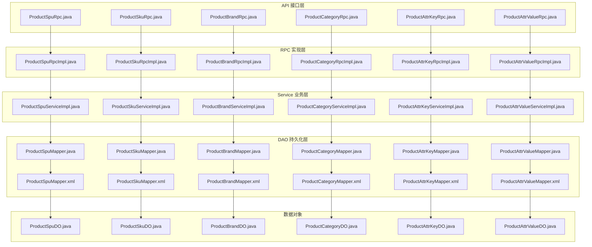
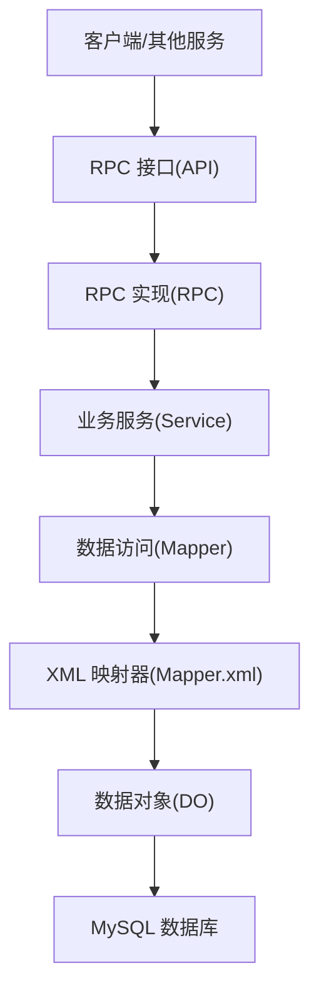
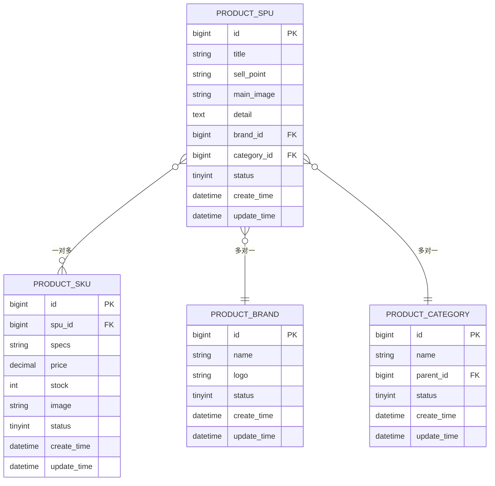
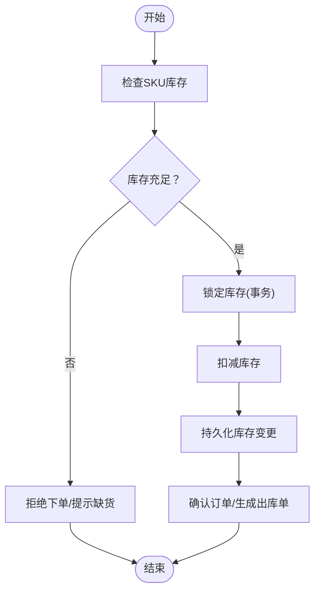
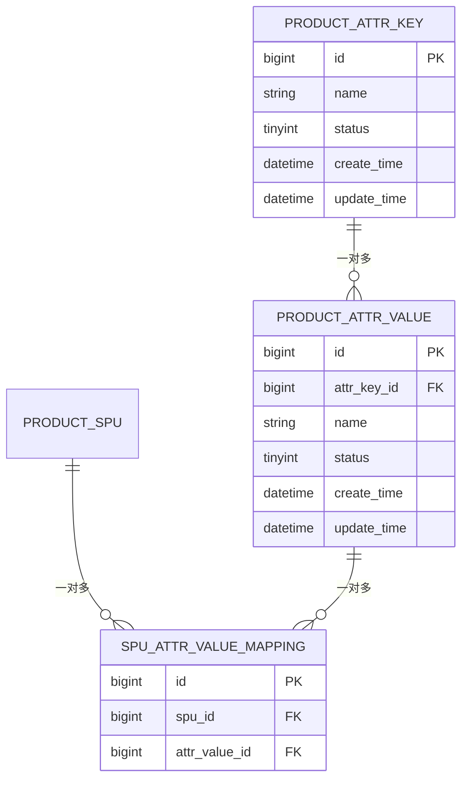
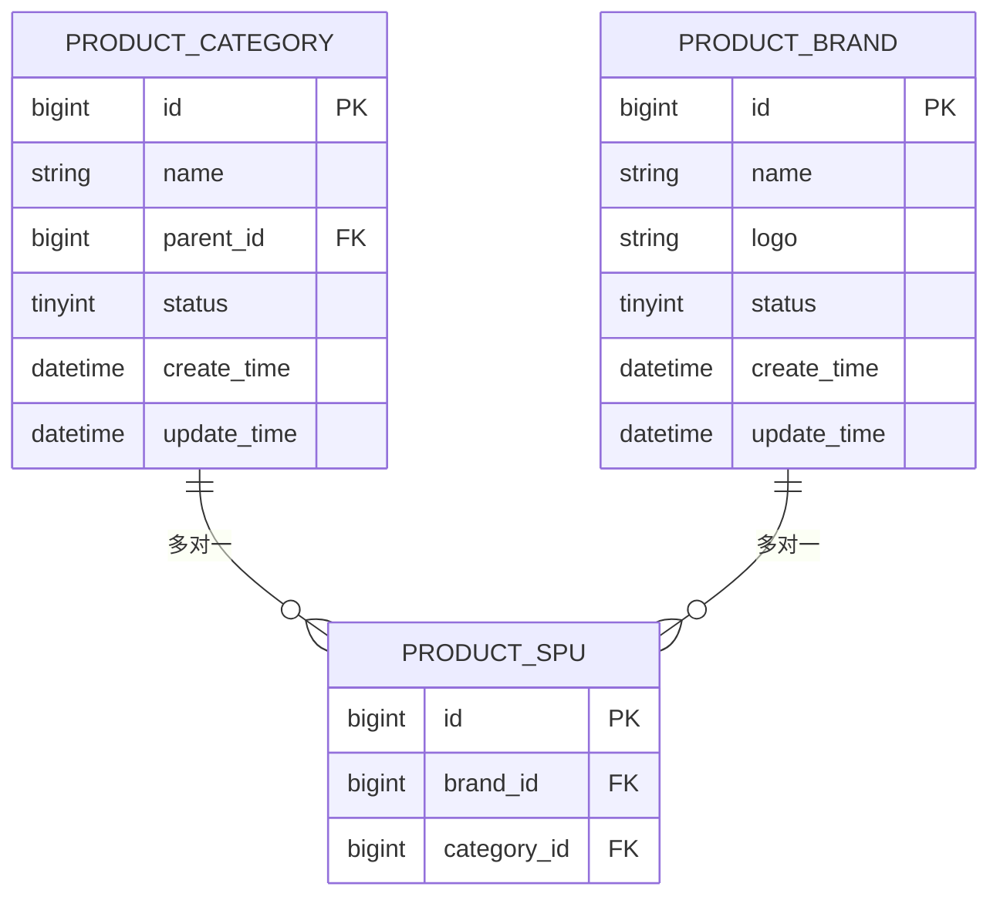
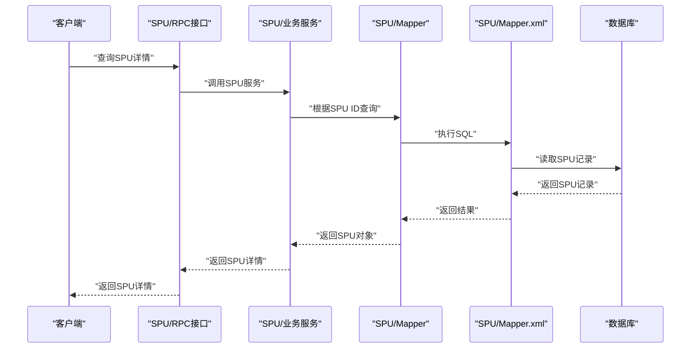
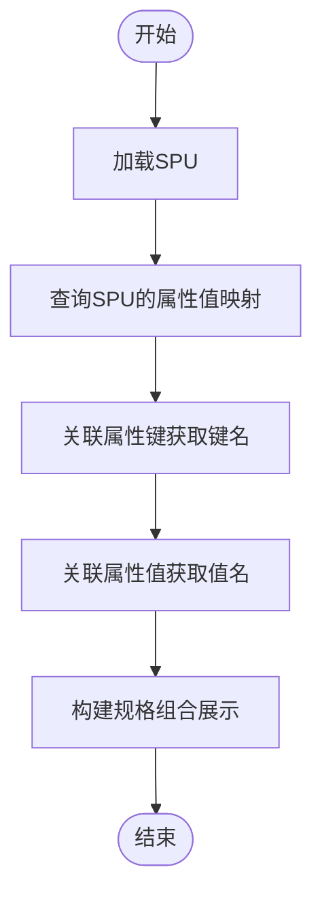
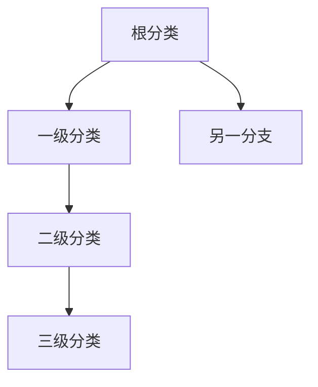
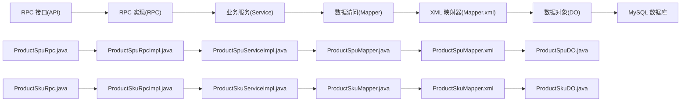

# 商品服务数据库设计

<cite>
**本文引用的文件**
- [ProductSpuDO.java](file://product-service-project/product-service-app/src/main/java/cn/iocoder/mall/productservice/dal/mysql/dataobject/spu/ProductSpuDO.java)
- [ProductSkuDO.java](file://product-service-project/product-service-app/src/main/java/cn/iocoder/mall/productservice/dal/mysql/dataobject/sku/ProductSkuDO.java)
- [ProductBrandDO.java](file://product-service-project/product-service-app/src/main/java/cn/iocoder/mall/productservice/dal/mysql/dataobject/brand/ProductBrandDO.java)
- [ProductCategoryDO.java](file://product-service-project/product-service-app/src/main/java/cn/iocoder/mall/productservice/dal/mysql/dataobject/category/ProductCategoryDO.java)
- [ProductAttrKeyDO.java](file://product-service-project/product-service-app/src/main/java/cn/iocoder/mall/productservice/dal/mysql/dataobject/attr/ProductAttrKeyDO.java)
- [ProductAttrValueDO.java](file://product-service-project/product-service-app/src/main/java/cn/iocoder/mall/productservice/dal/mysql/dataobject/attr/ProductAttrValueDO.java)
- [ProductSpuMapper.xml](file://product-service-project/product-service-app/src/main/resources/mapper/spu/ProductSpuMapper.xml)
- [ProductSkuMapper.xml](file://product-service-project/product-service-app/src/main/resources/mapper/sku/ProductSkuMapper.xml)
- [ProductBrandMapper.xml](file://product-service-project/product-service-app/src/main/resources/mapper/brand/ProductBrandMapper.xml)
- [ProductCategoryMapper.xml](file://product-service-project/product-service-app/src/main/resources/mapper/category/ProductCategoryMapper.xml)
- [ProductAttrKeyMapper.xml](file://product-service-project/product-service-app/src/main/resources/mapper/attr/ProductAttrKeyMapper.xml)
- [ProductAttrValueMapper.xml](file://product-service-project/product-service-app/src/main/resources/mapper/attr/ProductAttrValueMapper.xml)
- [ProductSpuMapper.java](file://product-service-project/product-service-app/src/main/java/cn/iocoder/mall/productservice/dal/mysql/mapper/spu/ProductSpuMapper.java)
- [ProductSkuMapper.java](file://product-service-project/product-service-app/src/main/java/cn/iocoder/mall/productservice/dal/mysql/mapper/sku/ProductSkuMapper.java)
- [ProductBrandMapper.java](file://product-service-project/product-service-app/src/main/java/cn/iocoder/mall/productservice/dal/mysql/mapper/brand/ProductBrandMapper.java)
- [ProductCategoryMapper.java](file://product-service-project/product-service-app/src/main/java/cn/iocoder/mall/productservice/dal/mysql/mapper/category/ProductCategoryMapper.java)
- [ProductAttrKeyMapper.java](file://product-service-project/product-service-app/src/main/java/cn/iocoder/mall/productservice/dal/mysql/mapper/attr/ProductAttrKeyMapper.java)
- [ProductAttrValueMapper.java](file://product-service-project/product-service-app/src/main/java/cn/iocoder/mall/productservice/dal/mysql/mapper/attr/ProductAttrValueMapper.java)
- [ProductSpuServiceImpl.java](file://product-service-project/product-service-app/src/main/java/cn/iocoder/mall/productservice/service/spu/ProductSpuServiceImpl.java)
- [ProductSkuServiceImpl.java](file://product-service-project/product-service-app/src/main/java/cn/iocoder/mall/productservice/service/sku/ProductSkuServiceImpl.java)
- [ProductBrandServiceImpl.java](file://product-service-project/product-service-app/src/main/java/cn/iocoder/mall/productservice/service/brand/ProductBrandServiceImpl.java)
- [ProductCategoryServiceImpl.java](file://product-service-project/product-service-app/src/main/java/cn/iocoder/mall/productservice/service/category/ProductCategoryServiceImpl.java)
- [ProductAttrKeyServiceImpl.java](file://product-service-project/product-service-app/src/main/java/cn/iocoder/mall/productservice/service/attr/ProductAttrKeyServiceImpl.java)
- [ProductAttrValueServiceImpl.java](file://product-service-project/product-service-app/src/main/java/cn/iocoder/mall/productservice/service/attr/ProductAttrValueServiceImpl.java)
- [ProductSpuRpcImpl.java](file://product-service-project/product-service-app/src/main/java/cn/iocoder/mall/productservice/rpc/spu/ProductSpuRpcImpl.java)
- [ProductSkuRpcImpl.java](file://product-service-project/product-service-app/src/main/java/cn/iocoder/mall/productservice/rpc/sku/ProductSkuRpcImpl.java)
- [ProductBrandRpcImpl.java](file://product-service-project/product-service-app/src/main/java/cn/iocoder/mall/productservice/rpc/brand/ProductBrandRpcImpl.java)
- [ProductCategoryRpcImpl.java](file://product-service-project/product-service-app/src/main/java/cn/iocoder/mall/productservice/rpc/category/ProductCategoryRpcImpl.java)
- [ProductAttrKeyRpcImpl.java](file://product-service-project/product-service-app/src/main/java/cn/iocoder/mall/productservice/rpc/attr/ProductAttrKeyRpcImpl.java)
- [ProductAttrValueRpcImpl.java](file://product-service-project/product-service-app/src/main/java/cn/iocoder/mall/productservice/rpc/attr/ProductAttrValueRpcImpl.java)
- [ProductSpuServiceImplTest.java](file://product-service-project/product-service-app/src/test/java/cn/iocoder/mall/productservice/manager/spu/ProductSpuServiceImplTest.java)
- [ProductSpuManagerTest.java](file://product-service-project/product-service-app/src/test/java/cn/iocoder/mall/productservice/manager/spu/ProductSkuManagerTest.java)
- [ProductSpuApi.java](file://product-service-project/product-service-api/src/main/java/cn/iocoder/mall/productservice/rpc/spu/ProductSpuRpc.java)
- [ProductSkuApi.java](file://product-service-project/product-service-api/src/main/java/cn/iocoder/mall/productservice/rpc/sku/ProductSkuRpc.java)
- [ProductBrandApi.java](file://product-service-project/product-service-api/src/main/java/cn/iocoder/mall/productservice/rpc/brand/ProductBrandRpc.java)
- [ProductCategoryApi.java](file://product-service-project/product-service-api/src/main/java/cn/iocoder/mall/productservice/rpc/category/ProductCategoryRpc.java)
- [ProductAttrKeyApi.java](file://product-service-project/product-service-api/src/main/java/cn/iocoder/mall/productservice/rpc/attr/ProductAttrKeyRpc.java)
- [ProductAttrValueApi.java](file://product-service-project/product-service-api/src/main/java/cn/iocoder/mall/productservice/rpc/attr/ProductAttrValueRpc.java)
- [ProductSpuDetailRespDTO.java](file://product-service-project/product-service-api/src/main/java/cn/iocoder/mall/productservice/rpc/spu/dto/ProductSpuDetailRespDTO.java)
- [ProductSkuRespDTO.java](file://product-service-project/product-service-api/src/main/java/cn/iocoder/mall/productservice/rpc/sku/dto/ProductSkuRespDTO.java)
- [ProductBrandRespDTO.java](file://product-service-project/product-service-api/src/main/java/cn/iocoder/mall/productservice/rpc/brand/dto/ProductBrandRespDTO.java)
- [ProductCategoryRespDTO.java](file://product-service-project/product-service-api/src/main/java/cn/iocoder/mall/productservice/rpc/category/dto/ProductCategoryRespDTO.java)
- [ProductAttrKeyRespDTO.java](file://product-service-project/product-service-api/src/main/java/cn/iocoder/mall/productservice/rpc/attr/dto/ProductAttrKeyRespDTO.java)
- [ProductAttrValueRespDTO.java](file://product-service-project/product-service-api/src/main/java/cn/iocoder/mall/productservice/rpc/attr/dto/ProductAttrValueRespDTO.java)
- [ProductSpuAndSkuCreateReqDTO.java](file://product-service-project/product-service-api/src/main/java/cn/iocoder/mall/productservice/rpc/spu/dto/ProductSpuAndSkuCreateReqDTO.java)
- [ProductSpuAndSkuUpdateReqDTO.java](file://product-service-project/product-service-api/src/main/java/cn/iocoder/mall/productservice/rpc/spu/dto/ProductSpuAndSkuUpdateReqDTO.java)
- [ProductSpuPageReqDTO.java](file://product-service-project/product-service-api/src/main/java/cn/iocoder/mall/productservice/rpc/spu/dto/ProductSpuPageReqDTO.java)
- [ProductSkuListQueryReqDTO.java](file://product-service-project/product-service-api/src/main/java/cn/iocoder/mall/productservice/rpc/sku/dto/ProductSkuListQueryReqDTO.java)
- [ProductBrandPageReqDTO.java](file://product-service-project/product-service-api/src/main/java/cn/iocoder/mall/productservice/rpc/brand/dto/ProductBrandPageReqDTO.java)
- [ProductCategoryListQueryReqDTO.java](file://product-service-project/product-service-api/src/main/java/cn/iocoder/mall/productservice/rpc/category/dto/ProductCategoryListQueryReqDTO.java)
- [ProductAttrKeyPageReqDTO.java](file://product-service-project/product-service-api/src/main/java/cn/iocoder/mall/productservice/rpc/attr/dto/ProductAttrKeyPageReqDTO.java)
- [ProductAttrValueListQueryReqDTO.java](file://product-service-project/product-service-api/src/main/java/cn/iocoder/mall/productservice/rpc/attr/dto/ProductAttrValueListQueryReqDTO.java)
- [ProductSpuSearchListDTO.java](file://product-service-project/product-service-api/src/main/java/cn/iocoder/mall/productservice/rpc/spu/dto/ProductSpuSearchListDTO.java)
- [ProductSpuCollectionMessage.java](file://product-service-project/product-service-api/src/main/java/cn/iocoder/mall/productservice/rpc/spu/message/ProductSpuCollectionMessage.java)
- [ProductSpuDetailBO.java](file://product-service-project/product-service-api/src/main/java/cn/iocoder/mall/productservice/rpc/spu/bo/ProductSpuDetailBO.java)
- [ProductSkuDetailBO.java](file://product-service-project/product-service-api/src/main/java/cn/iocoder/mall/productservice/rpc/sku/bo/ProductSkuDetailBO.java)
- [ProductAttrBO.java](file://product-service-project/product-service-api/src/main/java/cn/iocoder/mall/productservice/rpc/attr/bo/ProductAttrBO.java)
- [ProductAttrValueDetailBO.java](file://product-service-project/product-service-api/src/main/java/cn/iocoder/mall/productservice/rpc/attr/bo/ProductAttrValueDetailBO.java)
- [ProductSpuService.java](file://product-service-project/product-service-api/src/main/java/cn/iocoder/mall/productservice/rpc/spu/ProductSpuService.java)
- [ProductSkuService.java](file://product-service-project/product-service-api/src/main/java/cn/iocoder/mall/productservice/rpc/sku/ProductSkuService.java)
- [ProductBrandService.java](file://product-service-project/product-service-api/src/main/java/cn/iocoder/mall/productservice/rpc/brand/ProductBrandService.java)
- [ProductCategoryService.java](file://product-service-project/product-service-api/src/main/java/cn/iocoder/mall/productservice/rpc/category/ProductCategoryService.java)
- [ProductAttrKeyService.java](file://product-service-project/product-service-api/src/main/java/cn/iocoder/mall/productservice/rpc/attr/ProductAttrKeyService.java)
- [ProductAttrValueService.java](file://product-service-project/product-service-api/src/main/java/cn/iocoder/mall/productservice/rpc/attr/ProductAttrValueService.java)
- [ProductSpuServiceImplTest.java](file://product-service-project/product-service-app/src/test/java/cn/iocoder/mall/productservice/manager/spu/ProductSpuServiceImplTest.java)
- [ProductSkuManagerTest.java](file://product-service-project/product-service-app/src/test/java/cn/iocoder/mall/productservice/manager/spu/ProductSkuManagerTest.java)
</cite>

## 目录
1. [简介](#简介)
2. [项目结构](#项目结构)
3. [核心组件](#核心组件)
4. [架构总览](#架构总览)
5. [详细组件分析](#详细组件分析)
6. [依赖分析](#依赖分析)
7. [性能考虑](#性能考虑)
8. [故障排查指南](#故障排查指南)
9. [结论](#结论)
10. [附录](#附录)

## 简介
本文件面向商品服务模块的数据库设计，系统性梳理商品相关的核心表结构与业务模型，包括商品SPU、SKU、属性（键/值）、品牌、分类等，并深入解析SPU与SKU的关联关系、属性值映射机制、库存管理策略、分类树形结构、品牌关联、图片存储方案、索引与查询优化、以及数据一致性保障机制。文档同时提供ER关系图、表结构定义与业务逻辑说明，帮助开发者与运维人员快速理解并高效维护商品数据层。

## 项目结构
商品服务位于 product-service-project 模块中，采用分层架构：API接口层、RPC实现层、Service业务层、DAO持久化层（MyBatis Mapper），并配套测试用例与SQL脚本资源。

图表来源
- [ProductSpuRpc.java](file://product-service-project/product-service-api/src/main/java/cn/iocoder/mall/productservice/rpc/spu/ProductSpuRpc.java)
- [ProductSpuRpcImpl.java](file://product-service-project/product-service-app/src/main/java/cn/iocoder/mall/productservice/rpc/spu/ProductSpuRpcImpl.java)
- [ProductSpuServiceImpl.java](file://product-service-project/product-service-app/src/main/java/cn/iocoder/mall/productservice/service/spu/ProductSpuServiceImpl.java)
- [ProductSpuMapper.java](file://product-service-project/product-service-app/src/main/java/cn/iocoder/mall/productservice/dal/mysql/mapper/spu/ProductSpuMapper.java)
- [ProductSpuMapper.xml](file://product-service-project/product-service-app/src/main/resources/mapper/spu/ProductSpuMapper.xml)
- [ProductSpuDO.java](file://product-service-project/product-service-app/src/main/java/cn/iocoder/mall/productservice/dal/mysql/dataobject/spu/ProductSpuDO.java)

章节来源
- [ProductSpuRpc.java](file://product-service-project/product-service-api/src/main/java/cn/iocoder/mall/productservice/rpc/spu/ProductSpuRpc.java)
- [ProductSpuRpcImpl.java](file://product-service-project/product-service-app/src/main/java/cn/iocoder/mall/productservice/rpc/spu/ProductSpuRpcImpl.java)
- [ProductSpuServiceImpl.java](file://product-service-project/product-service-app/src/main/java/cn/iocoder/mall/productservice/service/spu/ProductSpuServiceImpl.java)
- [ProductSpuMapper.java](file://product-service-project/product-service-app/src/main/java/cn/iocoder/mall/productservice/dal/mysql/mapper/spu/ProductSpuMapper.java)
- [ProductSpuMapper.xml](file://product-service-project/product-service-app/src/main/resources/mapper/spu/ProductSpuMapper.xml)
- [ProductSpuDO.java](file://product-service-project/product-service-app/src/main/java/cn/iocoder/mall/productservice/dal/mysql/dataobject/spu/ProductSpuDO.java)

## 核心组件
本节聚焦商品服务的核心数据模型与职责边界，明确各表的字段含义、主外键关系、索引策略及典型查询场景。

- SPU（Standard Product Unit）：标准化商品单元，描述商品的通用属性与基本信息，如标题、卖点、品牌、分类、状态等。一个SPU可包含多个SKU。
- SKU（Stock Keeping Unit）：库存量单位，描述具体可购买的商品规格组合，如颜色、尺寸、版本等，绑定价格、库存、图片等。
- 属性（Attr）：分为“属性键”和“属性值”。属性键用于抽象维度（如颜色、尺寸），属性值是具体的取值（如红色、L码）。通过中间映射实现SPU与属性值的多对多关系。
- 品牌（Brand）：记录品牌信息，SPU与品牌存在多对一关系。
- 分类（Category）：记录商品分类信息，支持树形结构（父节点/子节点），SPU与分类存在多对一关系。
- 图片（Images）：通常以URL或存储路径形式保存在SPU/SKU中，便于前端展示与CDN加速。

章节来源
- [ProductSpuDO.java](file://product-service-project/product-service-app/src/main/java/cn/iocoder/mall/productservice/dal/mysql/dataobject/spu/ProductSpuDO.java)
- [ProductSkuDO.java](file://product-service-project/product-service-app/src/main/java/cn/iocoder/mall/productservice/dal/mysql/dataobject/sku/ProductSkuDO.java)
- [ProductBrandDO.java](file://product-service-project/product-service-app/src/main/java/cn/iocoder/mall/productservice/dal/mysql/dataobject/brand/ProductBrandDO.java)
- [ProductCategoryDO.java](file://product-service-project/product-service-app/src/main/java/cn/iocoder/mall/productservice/dal/mysql/dataobject/category/ProductCategoryDO.java)
- [ProductAttrKeyDO.java](file://product-service-project/product-service-app/src/main/java/cn/iocoder/mall/productservice/dal/mysql/dataobject/attr/ProductAttrKeyDO.java)
- [ProductAttrValueDO.java](file://product-service-project/product-service-app/src/main/java/cn/iocoder/mall/productservice/dal/mysql/dataobject/attr/ProductAttrValueDO.java)

## 架构总览
商品服务采用典型的分层架构，API层定义对外RPC接口，RPC实现层负责参数校验与调用Service，Service层编排业务流程，DAO层通过MyBatis执行SQL，数据对象承载表结构。

图表来源
- [ProductSpuRpc.java](file://product-service-project/product-service-api/src/main/java/cn/iocoder/mall/productservice/rpc/spu/ProductSpuRpc.java)
- [ProductSpuRpcImpl.java](file://product-service-project/product-service-app/src/main/java/cn/iocoder/mall/productservice/rpc/spu/ProductSpuRpcImpl.java)
- [ProductSpuServiceImpl.java](file://product-service-project/product-service-app/src/main/java/cn/iocoder/mall/productservice/service/spu/ProductSpuServiceImpl.java)
- [ProductSpuMapper.java](file://product-service-project/product-service-app/src/main/java/cn/iocoder/mall/productservice/dal/mysql/mapper/spu/ProductSpuMapper.java)
- [ProductSpuMapper.xml](file://product-service-project/product-service-app/src/main/resources/mapper/spu/ProductSpuMapper.xml)
- [ProductSpuDO.java](file://product-service-project/product-service-app/src/main/java/cn/iocoder/mall/productservice/dal/mysql/dataobject/spu/ProductSpuDO.java)

## 详细组件分析

### SPU 表设计与业务逻辑
- 设计理念：SPU作为商品抽象，不直接参与库存与价格细节，仅承载通用信息；SKU承载具体规格与价格库存。
- 关键字段：标题、卖点、主图、详情、品牌ID、分类ID、状态、创建/更新时间等。
- 关联关系：与SKU为一对多；与品牌为多对一；与分类为多对一；与属性值通过中间映射建立多对多。
- 查询优化：按分类、品牌、状态、标题关键词等维度建立索引；分页查询使用复合索引；详情查询走主键命中缓存。
- 库存策略：库存聚合由SKU承担，SPU层面不直接存储库存。

图表来源
- [ProductSpuDO.java](file://product-service-project/product-service-app/src/main/java/cn/iocoder/mall/productservice/dal/mysql/dataobject/spu/ProductSpuDO.java)
- [ProductSkuDO.java](file://product-service-project/product-service-app/src/main/java/cn/iocoder/mall/productservice/dal/mysql/dataobject/sku/ProductSkuDO.java)
- [ProductBrandDO.java](file://product-service-project/product-service-app/src/main/java/cn/iocoder/mall/productservice/dal/mysql/dataobject/brand/ProductBrandDO.java)
- [ProductCategoryDO.java](file://product-service-project/product-service-app/src/main/java/cn/iocoder/mall/productservice/dal/mysql/dataobject/category/ProductCategoryDO.java)

章节来源
- [ProductSpuDO.java](file://product-service-project/product-service-app/src/main/java/cn/iocoder/mall/productservice/dal/mysql/dataobject/spu/ProductSpuDO.java)
- [ProductSkuDO.java](file://product-service-project/product-service-app/src/main/java/cn/iocoder/mall/productservice/dal/mysql/dataobject/sku/ProductSkuDO.java)
- [ProductBrandDO.java](file://product-service-project/product-service-app/src/main/java/cn/iocoder/mall/productservice/dal/mysql/dataobject/brand/ProductBrandDO.java)
- [ProductCategoryDO.java](file://product-service-project/product-service-app/src/main/java/cn/iocoder/mall/productservice/dal/mysql/dataobject/category/ProductCategoryDO.java)

### SKU 表设计与库存管理
- 设计理念：SKU是可购买的最小单元，包含价格、库存、规格组合、图片等。
- 关键字段：SPU ID、规格JSON（或序列化规格串）、价格、库存、状态、图片等。
- 库存策略：采用“预占/扣减/回滚”的事务性库存管理；高并发下结合分布式锁或队列削峰；库存变更写入日志以便对账。
- 查询优化：按SPU ID、状态、价格区间等建立索引；分页查询使用联合索引；热点SKU可引入缓存。

图表来源
- [ProductSkuDO.java](file://product-service-project/product-service-app/src/main/java/cn/iocoder/mall/productservice/dal/mysql/dataobject/sku/ProductSkuDO.java)

章节来源
- [ProductSkuDO.java](file://product-service-project/product-service-app/src/main/java/cn/iocoder/mall/productservice/dal/mysql/dataobject/sku/ProductSkuDO.java)

### 属性表设计与映射机制
- 属性键（AttrKey）：抽象维度名称，如颜色、尺寸、版本等。
- 属性值（AttrValue）：具体取值，如红色、L、Pro等。
- 映射关系：通过中间表将SPU与属性值进行多对多关联，支持灵活配置不同SPU的属性组合。
- 查询优化：按属性键名、属性值内容建立索引；SPU属性查询使用联合索引；属性筛选时建议使用独立索引或物化视图。

图表来源
- [ProductAttrKeyDO.java](file://product-service-project/product-service-app/src/main/java/cn/iocoder/mall/productservice/dal/mysql/dataobject/attr/ProductAttrKeyDO.java)
- [ProductAttrValueDO.java](file://product-service-project/product-service-app/src/main/java/cn/iocoder/mall/productservice/dal/mysql/dataobject/attr/ProductAttrValueDO.java)
- [ProductSpuDO.java](file://product-service-project/product-service-app/src/main/java/cn/iocoder/mall/productservice/dal/mysql/dataobject/spu/ProductSpuDO.java)

章节来源
- [ProductAttrKeyDO.java](file://product-service-project/product-service-app/src/main/java/cn/iocoder/mall/productservice/dal/mysql/dataobject/attr/ProductAttrKeyDO.java)
- [ProductAttrValueDO.java](file://product-service-project/product-service-app/src/main/java/cn/iocoder/mall/productservice/dal/mysql/dataobject/attr/ProductAttrValueDO.java)

### 品牌与分类表设计
- 品牌（Brand）：记录品牌名称、Logo、状态等，SPU与品牌为多对一。
- 分类（Category）：支持树形结构，包含父节点ID、名称、状态等，SPU与分类为多对一。
- 查询优化：分类树查询使用自连接或路径枚举；分类与SPU的关联查询使用索引；热门分类可做缓存。

图表来源
- [ProductCategoryDO.java](file://product-service-project/product-service-app/src/main/java/cn/iocoder/mall/productservice/dal/mysql/dataobject/category/ProductCategoryDO.java)
- [ProductBrandDO.java](file://product-service-project/product-service-app/src/main/java/cn/iocoder/mall/productservice/dal/mysql/dataobject/brand/ProductBrandDO.java)
- [ProductSpuDO.java](file://product-service-project/product-service-app/src/main/java/cn/iocoder/mall/productservice/dal/mysql/dataobject/spu/ProductSpuDO.java)

章节来源
- [ProductCategoryDO.java](file://product-service-project/product-service-app/src/main/java/cn/iocoder/mall/productservice/dal/mysql/dataobject/category/ProductCategoryDO.java)
- [ProductBrandDO.java](file://product-service-project/product-service-app/src/main/java/cn/iocoder/mall/productservice/dal/mysql/dataobject/brand/ProductBrandDO.java)

### 商品图片存储方案
- 存储位置：图片URL或存储路径保存在SPU主图、SKU图片字段中；可配合CDN加速与缩略图策略。
- 策略建议：大图与小图分离、懒加载、失败重试、删除冗余文件；图片上传前进行格式与大小校验。

章节来源
- [ProductSpuDO.java](file://product-service-project/product-service-app/src/main/java/cn/iocoder/mall/productservice/dal/mysql/dataobject/spu/ProductSpuDO.java)
- [ProductSkuDO.java](file://product-service-project/product-service-app/src/main/java/cn/iocoder/mall/productservice/dal/mysql/dataobject/sku/ProductSkuDO.java)

### SPU 与 SKU 的关联关系设计
- 一对多：一个SPU可对应多个SKU，SKU通过SPU ID关联。
- 规格组合：SKU的specs字段描述规格组合，可为JSON或约定格式字符串，便于前端渲染与后端解析。
- 价格与库存：SKU独立维护价格与库存，SPU不直接存储这些字段。

图表来源
- [ProductSpuRpc.java](file://product-service-project/product-service-api/src/main/java/cn/iocoder/mall/productservice/rpc/spu/ProductSpuRpc.java)
- [ProductSpuServiceImpl.java](file://product-service-project/product-service-app/src/main/java/cn/iocoder/mall/productservice/service/spu/ProductSpuServiceImpl.java)
- [ProductSpuMapper.java](file://product-service-project/product-service-app/src/main/java/cn/iocoder/mall/productservice/dal/mysql/mapper/spu/ProductSpuMapper.java)
- [ProductSpuMapper.xml](file://product-service-project/product-service-app/src/main/resources/mapper/spu/ProductSpuMapper.xml)
- [ProductSpuDO.java](file://product-service-project/product-service-app/src/main/java/cn/iocoder/mall/productservice/dal/mysql/dataobject/spu/ProductSpuDO.java)

章节来源
- [ProductSpuRpc.java](file://product-service-project/product-service-api/src/main/java/cn/iocoder/mall/productservice/rpc/spu/ProductSpuRpc.java)
- [ProductSpuServiceImpl.java](file://product-service-project/product-service-app/src/main/java/cn/iocoder/mall/productservice/service/spu/ProductSpuServiceImpl.java)
- [ProductSpuMapper.java](file://product-service-project/product-service-app/src/main/java/cn/iocoder/mall/productservice/dal/mysql/mapper/spu/ProductSpuMapper.java)
- [ProductSpuMapper.xml](file://product-service-project/product-service-app/src/main/resources/mapper/spu/ProductSpuMapper.xml)
- [ProductSpuDO.java](file://product-service-project/product-service-app/src/main/java/cn/iocoder/mall/productservice/dal/mysql/dataobject/spu/ProductSpuDO.java)

### 属性值映射机制
- 中间表：SPU_ATTR_VALUE_MAPPING 将SPU与属性值进行多对多关联。
- 配置灵活性：不同SPU可配置不同的属性值集合，满足差异化需求。
- 查询策略：按SPU ID过滤属性值，或按属性键名/值进行筛选。

图表来源
- [ProductAttrKeyDO.java](file://product-service-project/product-service-app/src/main/java/cn/iocoder/mall/productservice/dal/mysql/dataobject/attr/ProductAttrKeyDO.java)
- [ProductAttrValueDO.java](file://product-service-project/product-service-app/src/main/java/cn/iocoder/mall/productservice/dal/mysql/dataobject/attr/ProductAttrValueDO.java)
- [ProductSpuDO.java](file://product-service-project/product-service-app/src/main/java/cn/iocoder/mall/productservice/dal/mysql/dataobject/spu/ProductSpuDO.java)

章节来源
- [ProductAttrKeyDO.java](file://product-service-project/product-service-app/src/main/java/cn/iocoder/mall/productservice/dal/mysql/dataobject/attr/ProductAttrKeyDO.java)
- [ProductAttrValueDO.java](file://product-service-project/product-service-app/src/main/java/cn/iocoder/mall/productservice/dal/mysql/dataobject/attr/ProductAttrValueDO.java)

### 商品分类树形结构设计
- 设计要点：parent_id 指向父节点，根节点parent_id为0或空；支持多级嵌套。
- 查询策略：深度优先遍历、路径枚举、层级缓存；分类筛选时按父节点ID与状态过滤。
- 性能优化：热门分类树可缓存；树构建使用批量查询减少往返。

图表来源
- [ProductCategoryDO.java](file://product-service-project/product-service-app/src/main/java/cn/iocoder/mall/productservice/dal/mysql/dataobject/category/ProductCategoryDO.java)

章节来源
- [ProductCategoryDO.java](file://product-service-project/product-service-app/src/main/java/cn/iocoder/mall/productservice/dal/mysql/dataobject/category/ProductCategoryDO.java)

### 品牌与商品的关联关系
- 关联方式：SPU.brand_id 外键指向品牌表，形成多对一关系。
- 查询优化：按品牌ID分组统计销量/库存；品牌详情页按品牌ID过滤SPU。

章节来源
- [ProductBrandDO.java](file://product-service-project/product-service-app/src/main/java/cn/iocoder/mall/productservice/dal/mysql/dataobject/brand/ProductBrandDO.java)
- [ProductSpuDO.java](file://product-service-project/product-service-app/src/main/java/cn/iocoder/mall/productservice/dal/mysql/dataobject/spu/ProductSpuDO.java)

### 索引设计策略与查询优化
- 主键索引：所有表主键默认唯一索引。
- 联合索引：
  - SPU：category_id+status、brand_id+status、title关键词搜索。
  - SKU：spu_id+status、price区间、stock阈值。
  - 属性：attr_key_id+name、spu_id+attr_value_id。
  - 分类：parent_id+status、name模糊匹配。
- 全文索引：SPU标题/卖点可考虑全文索引提升搜索体验。
- 缓存策略：SPU详情、SKU详情、热门分类树、品牌信息引入Redis缓存；写操作采用先删后增或延迟双删策略。

章节来源
- [ProductSpuMapper.xml](file://product-service-project/product-service-app/src/main/resources/mapper/spu/ProductSpuMapper.xml)
- [ProductSkuMapper.xml](file://product-service-project/product-service-app/src/main/resources/mapper/sku/ProductSkuMapper.xml)
- [ProductAttrKeyMapper.xml](file://product-service-project/product-service-app/src/main/resources/mapper/attr/ProductAttrKeyMapper.xml)
- [ProductAttrValueMapper.xml](file://product-service-project/product-service-app/src/main/resources/mapper/attr/ProductAttrValueMapper.xml)
- [ProductCategoryMapper.xml](file://product-service-project/product-service-app/src/main/resources/mapper/category/ProductCategoryMapper.xml)
- [ProductBrandMapper.xml](file://product-service-project/product-service-app/src/main/resources/mapper/brand/ProductBrandMapper.xml)

### 数据一致性保证机制
- 事务控制：库存扣减、订单创建、支付回调等关键流程使用本地事务或分布式事务（如TCC/ Saga）。
- 幂等设计：幂等键（如外部订单号）避免重复处理；消息去重。
- 对账与补偿：库存差异对账、超卖补偿、异步补偿任务。
- 强制约束：非空字段、状态枚举、金额精度、价格/库存范围校验。

章节来源
- [ProductSkuServiceImpl.java](file://product-service-project/product-service-app/src/main/java/cn/iocoder/mall/productservice/service/sku/ProductSkuServiceImpl.java)
- [ProductSpuServiceImpl.java](file://product-service-project/product-service-app/src/main/java/cn/iocoder/mall/productservice/service/spu/ProductSpuServiceImpl.java)

## 依赖分析
商品服务内部模块间依赖清晰，遵循“接口隔离、实现解耦、DAO与XML分离”的原则。

图表来源
- [ProductSpuRpc.java](file://product-service-project/product-service-api/src/main/java/cn/iocoder/mall/productservice/rpc/spu/ProductSpuRpc.java)
- [ProductSpuRpcImpl.java](file://product-service-project/product-service-app/src/main/java/cn/iocoder/mall/productservice/rpc/spu/ProductSpuRpcImpl.java)
- [ProductSpuServiceImpl.java](file://product-service-project/product-service-app/src/main/java/cn/iocoder/mall/productservice/service/spu/ProductSpuServiceImpl.java)
- [ProductSpuMapper.java](file://product-service-project/product-service-app/src/main/java/cn/iocoder/mall/productservice/dal/mysql/mapper/spu/ProductSpuMapper.java)
- [ProductSpuMapper.xml](file://product-service-project/product-service-app/src/main/resources/mapper/spu/ProductSpuMapper.xml)
- [ProductSpuDO.java](file://product-service-project/product-service-app/src/main/java/cn/iocoder/mall/productservice/dal/mysql/dataobject/spu/ProductSpuDO.java)
- [ProductSkuRpc.java](file://product-service-project/product-service-api/src/main/java/cn/iocoder/mall/productservice/rpc/sku/ProductSkuRpc.java)
- [ProductSkuRpcImpl.java](file://product-service-project/product-service-app/src/main/java/cn/iocoder/mall/productservice/rpc/sku/ProductSkuRpcImpl.java)
- [ProductSkuServiceImpl.java](file://product-service-project/product-service-app/src/main/java/cn/iocoder/mall/productservice/service/sku/ProductSkuServiceImpl.java)
- [ProductSkuMapper.java](file://product-service-project/product-service-app/src/main/java/cn/iocoder/mall/productservice/dal/mysql/mapper/sku/ProductSkuMapper.java)
- [ProductSkuMapper.xml](file://product-service-project/product-service-app/src/main/resources/mapper/sku/ProductSkuMapper.xml)
- [ProductSkuDO.java](file://product-service-project/product-service-app/src/main/java/cn/iocoder/mall/productservice/dal/mysql/dataobject/sku/ProductSkuDO.java)

章节来源
- [ProductSpuRpc.java](file://product-service-project/product-service-api/src/main/java/cn/iocoder/mall/productservice/rpc/spu/ProductSpuRpc.java)
- [ProductSpuRpcImpl.java](file://product-service-project/product-service-app/src/main/java/cn/iocoder/mall/productservice/rpc/spu/ProductSpuRpcImpl.java)
- [ProductSpuServiceImpl.java](file://product-service-project/product-service-app/src/main/java/cn/iocoder/mall/productservice/service/spu/ProductSpuServiceImpl.java)
- [ProductSpuMapper.java](file://product-service-project/product-service-app/src/main/java/cn/iocoder/mall/productservice/dal/mysql/mapper/spu/ProductSpuMapper.java)
- [ProductSpuMapper.xml](file://product-service-project/product-service-app/src/main/resources/mapper/spu/ProductSpuMapper.xml)
- [ProductSpuDO.java](file://product-service-project/product-service-app/src/main/java/cn/iocoder/mall/productservice/dal/mysql/dataobject/spu/ProductSpuDO.java)
- [ProductSkuRpc.java](file://product-service-project/product-service-api/src/main/java/cn/iocoder/mall/productservice/rpc/sku/ProductSkuRpc.java)
- [ProductSkuRpcImpl.java](file://product-service-project/product-service-app/src/main/java/cn/iocoder/mall/productservice/rpc/sku/ProductSkuRpcImpl.java)
- [ProductSkuServiceImpl.java](file://product-service-project/product-service-app/src/main/java/cn/iocoder/mall/productservice/service/sku/ProductSkuServiceImpl.java)
- [ProductSkuMapper.java](file://product-service-project/product-service-app/src/main/java/cn/iocoder/mall/productservice/dal/mysql/mapper/sku/ProductSkuMapper.java)
- [ProductSkuMapper.xml](file://product-service-project/product-service-app/src/main/resources/mapper/sku/ProductSkuMapper.xml)
- [ProductSkuDO.java](file://product-service-project/product-service-app/src/main/java/cn/iocoder/mall/productservice/dal/mysql/dataobject/sku/ProductSkuDO.java)

## 性能考虑
- 索引与查询：
  - 使用合适的联合索引覆盖常见查询条件（分类+状态、品牌+状态、标题搜索）。
  - 分页查询使用LIMIT与ORDER BY配合索引，避免全表扫描。
  - 对高频字段（如status、category_id、brand_id）建立独立索引。
- 缓存：
  - SPU详情、SKU详情、分类树、品牌信息引入Redis缓存。
  - 写操作采用“删除缓存”策略，避免脏读；读多写少场景可考虑“延迟双删”。
- 异步与削峰：
  - 库存扣减、价格计算、图片处理等可异步化，降低主流程阻塞。
- 读写分离与分库分表：
  - 按业务维度拆分库表，如按品牌/分类维度分表；热点数据上移缓存。
- 监控与告警：
  - SQL慢查询、缓存命中率、库存差异对账等指标纳入监控体系。

## 故障排查指南
- 常见问题与定位：
  - 库存不足：检查SKU库存字段与扣减日志，确认事务是否提交。
  - 查询慢：检查是否存在全表扫描，补充缺失索引或调整SQL。
  - 缓存穿透：对空结果设置短 TTL 或布隆过滤器。
  - 分布式事务：核对TCC/ Saga补偿任务执行情况。
- 单元测试与集成测试：
  - 使用测试类验证SPU/SKU创建、更新、查询、库存扣减等关键流程。
- 日志与追踪：
  - 关键操作添加链路ID，便于问题定位与复盘。

章节来源
- [ProductSpuServiceImplTest.java](file://product-service-project/product-service-app/src/test/java/cn/iocoder/mall/productservice/manager/spu/ProductSpuServiceImplTest.java)
- [ProductSkuManagerTest.java](file://product-service-project/product-service-app/src/test/java/cn/iocoder/mall/productservice/manager/spu/ProductSkuManagerTest.java)

## 结论
商品服务数据库设计围绕SPU/SKU的清晰分离、属性值灵活映射、品牌与分类的强关联，辅以完善的索引与缓存策略，实现了高可用、高性能的商品数据管理。通过事务与对账机制保障数据一致性，结合异步化与监控体系提升整体稳定性。后续可在分库分表、全文检索、图片CDN等方面进一步优化。

## 附录
- 表清单与职责概览：
  - PRODUCT_SPU：商品SPU信息与基础属性
  - PRODUCT_SKU：商品SKU规格、价格、库存、图片
  - PRODUCT_BRAND：品牌信息
  - PRODUCT_CATEGORY：商品分类树
  - PRODUCT_ATTR_KEY：属性键
  - PRODUCT_ATTR_VALUE：属性值
  - SPU_ATTR_VALUE_MAPPING：SPU与属性值映射
- 关键DTO与BO：
  - SPU：ProductSpuDetailRespDTO、ProductSpuDetailBO、ProductSpuSearchListDTO
  - SKU：ProductSkuRespDTO、ProductSkuDetailBO
  - 品牌：ProductBrandRespDTO
  - 分类：ProductCategoryRespDTO
  - 属性：ProductAttrBO、ProductAttrValueDetailBO
- 请求DTO：
  - SPU：ProductSpuAndSkuCreateReqDTO、ProductSpuAndSkuUpdateReqDTO、ProductSpuPageReqDTO
  - SKU：ProductSkuListQueryReqDTO
  - 品牌：ProductBrandPageReqDTO
  - 分类：ProductCategoryListQueryReqDTO
  - 属性：ProductAttrKeyPageReqDTO、ProductAttrValueListQueryReqDTO