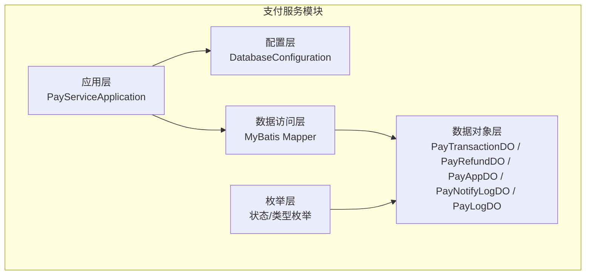
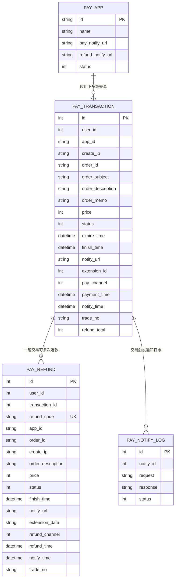
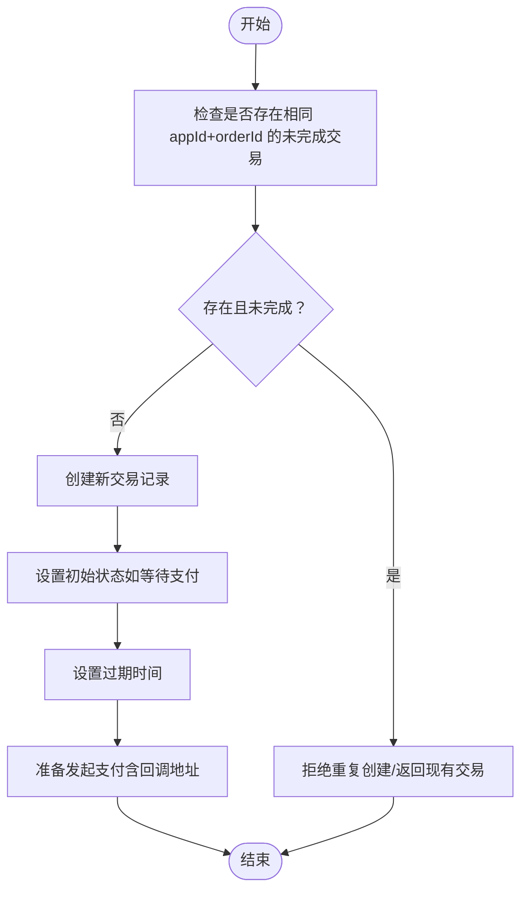
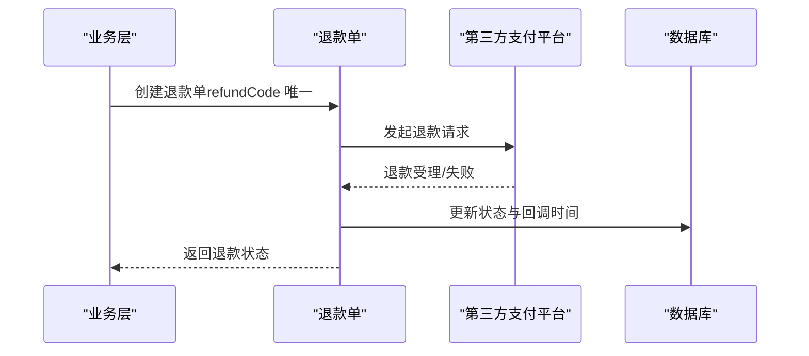
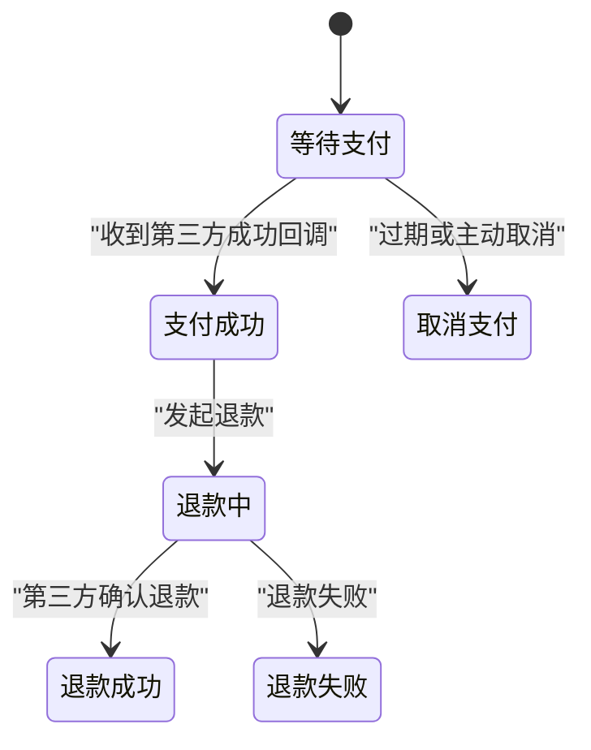
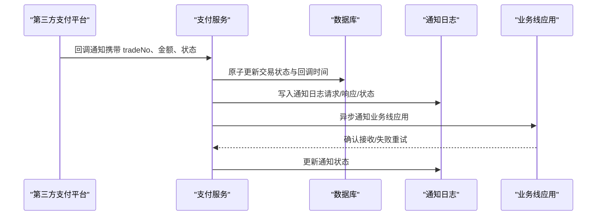
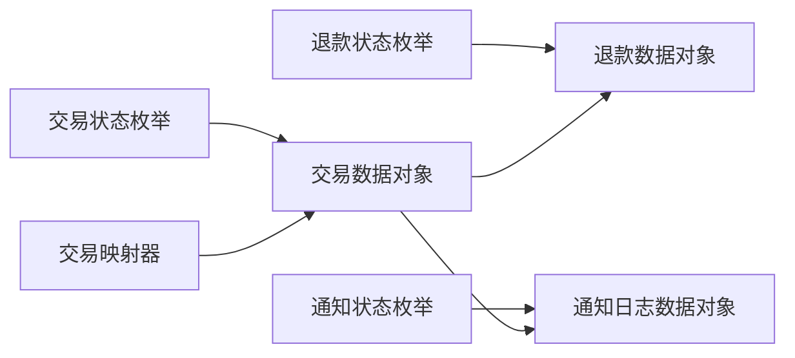

# 支付服务数据库设计

<cite>
**本文引用的文件**
- [PayTransactionDO.java](file://pay-service-project/pay-service-app/src/main/java/cn/iocoder/mall/payservice/dal/mysql/dataobject/transaction/PayTransactionDO.java)
- [PayRefundDO.java](file://pay-service-project/pay-service-app/src/main/java/cn/iocoder/mall/payservice/dal/mysql/dataobject/refund/PayRefundDO.java)
- [PayAppDO.java](file://pay-service-project/pay-service-app/src/main/java/cn/iocoder/mall/payservice/dal/mysql/dataobject/app/PayAppDO.java)
- [PayNotifyLogDO.java](file://pay-service-project/pay-service-app/src/main/java/cn/iocoder/mall/payservice/dal/mysql/dataobject/notify/PayNotifyLogDO.java)
- [PayLogDO.java](file://pay-service-project/pay-service-app/src/main/java/cn/iocoder/mall/payservice/dal/mysql/dataobject/log/PayLogDO.java)
- [PayTransactionStatusEnum.java](file://pay-service-project/pay-service-api/src/main/java/cn/iocoder/mall/payservice/enums/transaction/PayTransactionStatusEnum.java)
- [PayRefundStatus.java](file://pay-service-project/pay-service-api/src/main/java/cn/iocoder/mall/payservice/enums/refund/PayRefundStatus.java)
- [PayNotifyStatusEnum.java](file://pay-service-project/pay-service-api/src/main/java/cn/iocoder/mall/payservice/enums/notify/PayNotifyStatusEnum.java)
- [PayTransactionMapper.xml](file://pay-service-project/pay-service-app/src/main/resources/mapper/PayTransactionMapper.xml)
</cite>

## 目录
1. [简介](#简介)
2. [项目结构](#项目结构)
3. [核心组件](#核心组件)
4. [架构概览](#架构概览)
5. [详细组件分析](#详细组件分析)
6. [依赖分析](#依赖分析)
7. [性能考虑](#性能考虑)
8. [故障排查指南](#故障排查指南)
9. [结论](#结论)
10. [附录](#附录)

## 简介
本文件面向支付服务模块的数据库设计，系统性梳理支付交易、退款、应用、通知与日志等核心表结构，阐释支付状态机、重复支付防护、回调处理流程，并给出第三方支付平台对接、资金流水、对账与风控数据存储的建议方案。目标是帮助开发者与运维人员快速理解并高效维护支付子系统。

## 项目结构
支付服务位于 pay-service-project 中，采用按领域分层的组织方式：
- 数据对象（DO）：位于 dal/mysql/dataobject 下，分别对应交易、退款、应用、通知日志、通用日志等
- 枚举：位于 pay-service-api/enums 下，定义状态与类型
- MyBatis 映射：位于 resources/mapper 下，包含部分原子更新语句
- 应用入口与配置：位于 pay-service-app 下，包含启动类、配置与服务实现

图示来源
- [PayTransactionDO.java:1-104](file://pay-service-project/pay-service-app/src/main/java/cn/iocoder/mall/payservice/dal/mysql/dataobject/transaction/PayTransactionDO.java#L1-L104)
- [PayRefundDO.java:1-109](file://pay-service-project/pay-service-app/src/main/java/cn/iocoder/mall/payservice/dal/mysql/dataobject/refund/PayRefundDO.java#L1-L109)
- [PayAppDO.java:1-44](file://pay-service-project/pay-service-app/src/main/java/cn/iocoder/mall/payservice/dal/mysql/dataobject/app/PayAppDO.java#L1-L44)
- [PayNotifyLogDO.java:1-45](file://pay-service-project/pay-service-app/src/main/java/cn/iocoder/mall/payservice/dal/mysql/dataobject/notify/PayNotifyLogDO.java#L1-L45)
- [PayLogDO.java:1-30](file://pay-service-project/pay-service-app/src/main/java/cn/iocoder/mall/payservice/dal/mysql/dataobject/log/PayLogDO.java#L1-L30)

章节来源
- [PayTransactionDO.java:1-104](file://pay-service-project/pay-service-app/src/main/java/cn/iocoder/mall/payservice/dal/mysql/dataobject/transaction/PayTransactionDO.java#L1-L104)
- [PayRefundDO.java:1-109](file://pay-service-project/pay-service-app/src/main/java/cn/iocoder/mall/payservice/dal/mysql/dataobject/refund/PayRefundDO.java#L1-L109)
- [PayAppDO.java:1-44](file://pay-service-project/pay-service-app/src/main/java/cn/iocoder/mall/payservice/dal/mysql/dataobject/app/PayAppDO.java#L1-L44)
- [PayNotifyLogDO.java:1-45](file://pay-service-project/pay-service-app/src/main/java/cn/iocoder/mall/payservice/dal/mysql/dataobject/notify/PayNotifyLogDO.java#L1-L45)
- [PayLogDO.java:1-30](file://pay-service-project/pay-service-app/src/main/java/cn/iocoder/mall/payservice/dal/mysql/dataobject/log/PayLogDO.java#L1-L30)

## 核心组件
本节聚焦支付相关的核心表结构与职责：
- 支付交易表（pay_transaction）：承载一次支付交易的全量信息，含金额、状态、过期时间、扩展字段、第三方流水号等
- 退款表（pay_refund）：承载退款单据，含退款金额、状态、扩展数据、第三方流水号等
- 支付应用表（pay_app）：承载接入业务的应用配置，如通知地址、状态等
- 支付通知日志表（pay_notify_log）：记录通知下游应用时的请求、响应与状态
- 交易日志（PayLogDO）：用于追踪交易执行过程（当前为轻量结构）

章节来源
- [PayTransactionDO.java:12-103](file://pay-service-project/pay-service-app/src/main/java/cn/iocoder/mall/payservice/dal/mysql/dataobject/transaction/PayTransactionDO.java#L12-L103)
- [PayRefundDO.java:12-108](file://pay-service-project/pay-service-app/src/main/java/cn/iocoder/mall/payservice/dal/mysql/dataobject/refund/PayRefundDO.java#L12-L108)
- [PayAppDO.java:9-43](file://pay-service-project/pay-service-app/src/main/java/cn/iocoder/mall/payservice/dal/mysql/dataobject/app/PayAppDO.java#L9-L43)
- [PayNotifyLogDO.java:10-44](file://pay-service-project/pay-service-app/src/main/java/cn/iocoder/mall/payservice/dal/mysql/dataobject/notify/PayNotifyLogDO.java#L10-L44)
- [PayLogDO.java:6-29](file://pay-service-project/pay-service-app/src/main/java/cn/iocoder/mall/payservice/dal/mysql/dataobject/log/PayLogDO.java#L6-L29)

## 架构概览
支付服务围绕“交易—退款—通知—日志”主线构建，MyBatis 提供基础持久化能力，枚举统一状态值域，应用层负责编排业务流程。

图示来源
- [PayAppDO.java:14-43](file://pay-service-project/pay-service-app/src/main/java/cn/iocoder/mall/payservice/dal/mysql/dataobject/app/PayAppDO.java#L14-L43)
- [PayTransactionDO.java:15-103](file://pay-service-project/pay-service-app/src/main/java/cn/iocoder/mall/payservice/dal/mysql/dataobject/transaction/PayTransactionDO.java#L15-L103)
- [PayRefundDO.java:15-108](file://pay-service-project/pay-service-app/src/main/java/cn/iocoder/mall/payservice/dal/mysql/dataobject/refund/PayRefundDO.java#L15-L108)
- [PayNotifyLogDO.java:15-44](file://pay-service-project/pay-service-app/src/main/java/cn/iocoder/mall/payservice/dal/mysql/dataobject/notify/PayNotifyLogDO.java#L15-L44)

## 详细组件分析

### 支付交易表（pay_transaction）
- 设计要点
  - 主键自增 id；用户与应用维度标识（userId、appId）
  - 订单信息：orderId、orderSubject、orderDescription、orderMemo
  - 金额与状态：price（分）、status（枚举）
  - 过期与完成：expireTime、finishTime
  - 通知与回调：notifyUrl、paymentTime、notifyTime、tradeNo
  - 扩展与渠道：extensionId、payChannel
  - 退款累计：refundTotal（用于原子累加）
- 关键约束与索引
  - 建议对 appId+orderId 组合建立唯一索引，保障同一业务线订单幂等
  - 对 tradeNo 建立唯一索引，防止第三方流水号重复
  - 对 userId、status、expireTime 建立复合索引，支持查询与清理
- 原子更新
  - 使用 MyBatis 的原子更新语句对 refundTotal 增量累加，保证并发安全

图示来源
- [PayTransactionDO.java:31-45](file://pay-service-project/pay-service-app/src/main/java/cn/iocoder/mall/payservice/dal/mysql/dataobject/transaction/PayTransactionDO.java#L31-L45)
- [PayTransactionMapper.xml:5-10](file://pay-service-project/pay-service-app/src/main/resources/mapper/PayTransactionMapper.xml#L5-L10)

章节来源
- [PayTransactionDO.java:12-103](file://pay-service-project/pay-service-app/src/main/java/cn/iocoder/mall/payservice/dal/mysql/dataobject/transaction/PayTransactionDO.java#L12-L103)
- [PayTransactionMapper.xml:1-13](file://pay-service-project/pay-service-app/src/main/resources/mapper/PayTransactionMapper.xml#L1-L13)

### 退款表（pay_refund）
- 设计要点
  - 主键自增 id；关联交易 transactionId
  - 退款唯一标识：refundCode（唯一索引），便于幂等
  - 金额与状态：price（分）、status（枚举）
  - 通知与回调：notifyUrl、extensionData、refundTime、notifyTime、tradeNo
  - 渠道与应用：refundChannel、appId、orderId
- 关键约束与索引
  - refundCode 唯一索引，防止重复退款
  - appId+orderId 组合索引，保障同一业务线订单维度的幂等
  - transactionId 索引，支持按交易聚合查询

图示来源
- [PayRefundDO.java:21-108](file://pay-service-project/pay-service-app/src/main/java/cn/iocoder/mall/payservice/dal/mysql/dataobject/refund/PayRefundDO.java#L21-L108)

章节来源
- [PayRefundDO.java:12-108](file://pay-service-project/pay-service-app/src/main/java/cn/iocoder/mall/payservice/dal/mysql/dataobject/refund/PayRefundDO.java#L12-L108)

### 支付应用表（pay_app）
- 设计要点
  - 主键 id（字符串）：区分不同业务线应用
  - 应用名与状态：name、status
  - 通知地址：pay_notify_url、refund_notify_url
- 作用
  - 作为交易与退款的归属维度，配合 appId 实现业务隔离与配置化

章节来源
- [PayAppDO.java:9-43](file://pay-service-project/pay-service-app/src/main/java/cn/iocoder/mall/payservice/dal/mysql/dataobject/app/PayAppDO.java#L9-L43)

### 支付通知日志表（pay_notify_log）
- 设计要点
  - 主键自增 id；notifyId 关联通知任务
  - 记录请求参数 request、响应 response
  - 状态 status（枚举：等待/成功/失败/请求成功但结果失败/请求失败）
- 作用
  - 追踪通知下游应用的结果，支撑重试与人工干预

章节来源
- [PayNotifyLogDO.java:10-44](file://pay-service-project/pay-service-app/src/main/java/cn/iocoder/mall/payservice/dal/mysql/dataobject/notify/PayNotifyLogDO.java#L10-L44)

### 交易日志（PayLogDO）
- 设计要点
  - 当前为轻量结构，包含 appId 与 orderId
- 建议
  - 可扩展为更细粒度的事件日志，记录状态变迁、关键操作与异常堆栈，便于审计与排障

章节来源
- [PayLogDO.java:6-29](file://pay-service-project/pay-service-app/src/main/java/cn/iocoder/mall/payservice/dal/mysql/dataobject/log/PayLogDO.java#L6-L29)

### 支付状态机设计
- 支付交易状态
  - 等待支付、支付成功、取消支付（如超时）
- 退款状态
  - 处理中、成功、失败
- 通知状态
  - 等待通知、通知成功、通知失败、请求成功但结果失败、请求失败

图示来源
- [PayTransactionStatusEnum.java:8-30](file://pay-service-project/pay-service-api/src/main/java/cn/iocoder/mall/payservice/enums/transaction/PayTransactionStatusEnum.java#L8-L30)
- [PayRefundStatus.java:8-30](file://pay-service-project/pay-service-api/src/main/java/cn/iocoder/mall/payservice/enums/refund/PayRefundStatus.java#L8-L30)
- [PayNotifyStatusEnum.java:8-33](file://pay-service-project/pay-service-api/src/main/java/cn/iocoder/mall/payservice/enums/notify/PayNotifyStatusEnum.java#L8-L33)

章节来源
- [PayTransactionStatusEnum.java:1-31](file://pay-service-project/pay-service-api/src/main/java/cn/iocoder/mall/payservice/enums/transaction/PayTransactionStatusEnum.java#L1-L31)
- [PayRefundStatus.java:1-31](file://pay-service-project/pay-service-api/src/main/java/cn/iocoder/mall/payservice/enums/refund/PayRefundStatus.java#L1-L31)
- [PayNotifyStatusEnum.java:1-34](file://pay-service-project/pay-service-api/src/main/java/cn/iocoder/mall/payservice/enums/notify/PayNotifyStatusEnum.java#L1-L34)

### 重复支付防护机制
- 同一业务线幂等
  - 通过 appId+orderId 唯一索引，避免重复创建同一订单的交易
- 第三方流水幂等
  - 通过 tradeNo 唯一索引，避免重复入账
- 退款幂等
  - 通过 refundCode 唯一索引，避免重复发起同一笔退款
- 并发安全
  - 使用原子更新（如 refundTotal 增量累加）避免竞态条件

章节来源
- [PayTransactionDO.java:41-45](file://pay-service-project/pay-service-app/src/main/java/cn/iocoder/mall/payservice/dal/mysql/dataobject/transaction/PayTransactionDO.java#L41-L45)
- [PayRefundDO.java:37-38](file://pay-service-project/pay-service-app/src/main/java/cn/iocoder/mall/payservice/dal/mysql/dataobject/refund/PayRefundDO.java#L37-L38)
- [PayTransactionMapper.xml:5-10](file://pay-service-project/pay-service-app/src/main/resources/mapper/PayTransactionMapper.xml#L5-L10)

### 支付回调处理流程
- 接收第三方回调
  - 校验签名与参数完整性
  - 根据 tradeNo 查询交易，原子更新状态与回调时间
  - 写入通知日志，触发通知下游应用
- 通知下游应用
  - 重试策略：指数退避 + 最大重试次数
  - 记录请求/响应与最终状态，便于人工干预

图示来源
- [PayTransactionDO.java:84-94](file://pay-service-project/pay-service-app/src/main/java/cn/iocoder/mall/payservice/dal/mysql/dataobject/transaction/PayTransactionDO.java#L84-L94)
- [PayNotifyLogDO.java:28-42](file://pay-service-project/pay-service-app/src/main/java/cn/iocoder/mall/payservice/dal/mysql/dataobject/notify/PayNotifyLogDO.java#L28-L42)

章节来源
- [PayTransactionDO.java:67-94](file://pay-service-project/pay-service-app/src/main/java/cn/iocoder/mall/payservice/dal/mysql/dataobject/transaction/PayTransactionDO.java#L67-L94)
- [PayNotifyLogDO.java:10-44](file://pay-service-project/pay-service-app/src/main/java/cn/iocoder/mall/payservice/dal/mysql/dataobject/notify/PayNotifyLogDO.java#L10-L44)

### 退款申请与处理的数据结构
- 申请阶段
  - 生成唯一 refundCode，写入退款单（状态=处理中）
- 处理阶段
  - 调用第三方退款接口，回填扩展数据与回调时间
  - 更新状态为成功或失败
- 对账阶段
  - 以 tradeNo 与 refundCode 为核对依据，结合通知日志进行差异排查

章节来源
- [PayRefundDO.java:21-108](file://pay-service-project/pay-service-app/src/main/java/cn/iocoder/mall/payservice/dal/mysql/dataobject/refund/PayRefundDO.java#L21-L108)

### 第三方支付平台对接的数据模型
- 通用字段
  - appId、orderId、price（分）、notifyUrl、tradeNo
- 状态与时间
  - status、paymentTime、notifyTime、refundTime
- 扩展与渠道
  - extensionId、payChannel、refundChannel、extensionData
- 建议
  - 将第三方返回的关键字段标准化存储，便于后续对账与审计

章节来源
- [PayTransactionDO.java:75-94](file://pay-service-project/pay-service-app/src/main/java/cn/iocoder/mall/payservice/dal/mysql/dataobject/transaction/PayTransactionDO.java#L75-L94)
- [PayRefundDO.java:84-106](file://pay-service-project/pay-service-app/src/main/java/cn/iocoder/mall/payservice/dal/mysql/dataobject/refund/PayRefundDO.java#L84-L106)

### 支付日志记录策略
- 通知日志
  - 记录每次通知的请求/响应与最终状态，支持重试与人工干预
- 交易日志
  - 建议扩展为事件驱动的日志，记录状态变迁、异常与耗时指标

章节来源
- [PayNotifyLogDO.java:10-44](file://pay-service-project/pay-service-app/src/main/java/cn/iocoder/mall/payservice/dal/mysql/dataobject/notify/PayNotifyLogDO.java#L10-L44)
- [PayLogDO.java:6-29](file://pay-service-project/pay-service-app/src/main/java/cn/iocoder/mall/payservice/dal/mysql/dataobject/log/PayLogDO.java#L6-L29)

### 资金流水设计
- 建议
  - 以交易主键与退款主键为流水凭证，记录方向（收入/支出）、金额、渠道、时间、状态与摘要
  - 与第三方 tradeNo 关联，确保外部可追溯
- 并发控制
  - 使用原子更新与分布式锁，避免重复记账

### 对账数据结构
- 核对维度
  - appId、orderId、tradeNo、refundCode、状态、金额、时间范围
- 差异处理
  - 通过通知日志与交易/退款表比对，定位缺失或重复记录

### 风控数据存储方案
- 建议
  - 采集用户行为、设备指纹、IP 地址、下单频率等特征，落库并定期归档
  - 与交易状态联动，支持实时阻断与事后审计

## 依赖分析
- 枚举依赖
  - 交易、退款、通知均依赖各自枚举，统一状态值域
- 映射依赖
  - PayTransactionMapper 提供原子更新能力，保障并发安全
- 表间依赖
  - 退款表依赖交易表；通知日志可关联交易或退款

图示来源
- [PayTransactionStatusEnum.java:8-30](file://pay-service-project/pay-service-api/src/main/java/cn/iocoder/mall/payservice/enums/transaction/PayTransactionStatusEnum.java#L8-L30)
- [PayRefundStatus.java:8-30](file://pay-service-project/pay-service-api/src/main/java/cn/iocoder/mall/payservice/enums/refund/PayRefundStatus.java#L8-L30)
- [PayNotifyStatusEnum.java:8-33](file://pay-service-project/pay-service-api/src/main/java/cn/iocoder/mall/payservice/enums/notify/PayNotifyStatusEnum.java#L8-L33)
- [PayTransactionMapper.xml:3-10](file://pay-service-project/pay-service-app/src/main/resources/mapper/PayTransactionMapper.xml#L3-L10)
- [PayTransactionDO.java:15-103](file://pay-service-project/pay-service-app/src/main/java/cn/iocoder/mall/payservice/dal/mysql/dataobject/transaction/PayTransactionDO.java#L15-L103)
- [PayRefundDO.java:15-108](file://pay-service-project/pay-service-app/src/main/java/cn/iocoder/mall/payservice/dal/mysql/dataobject/refund/PayRefundDO.java#L15-L108)
- [PayNotifyLogDO.java:15-44](file://pay-service-project/pay-service-app/src/main/java/cn/iocoder/mall/payservice/dal/mysql/dataobject/notify/PayNotifyLogDO.java#L15-L44)

章节来源
- [PayTransactionStatusEnum.java:1-31](file://pay-service-project/pay-service-api/src/main/java/cn/iocoder/mall/payservice/enums/transaction/PayTransactionStatusEnum.java#L1-L31)
- [PayRefundStatus.java:1-31](file://pay-service-project/pay-service-api/src/main/java/cn/iocoder/mall/payservice/enums/refund/PayRefundStatus.java#L1-L31)
- [PayNotifyStatusEnum.java:1-34](file://pay-service-project/pay-service-api/src/main/java/cn/iocoder/mall/payservice/enums/notify/PayNotifyStatusEnum.java#L1-L34)
- [PayTransactionMapper.xml:1-13](file://pay-service-project/pay-service-app/src/main/resources/mapper/PayTransactionMapper.xml#L1-L13)

## 性能考虑
- 索引策略
  - 为 appId+orderId、tradeNo、refundCode 建唯一索引
  - 为 userId、status、expireTime 建复合索引，提升查询与清理效率
- 原子更新
  - 使用 MyBatis 原子更新（如 refundTotal 增量累加）减少锁竞争
- 分表分库
  - 按 appId 或 userId 进行水平拆分，降低热点
- 缓存
  - 对高频读取的交易状态与应用配置进行缓存，结合失效策略
- 异步化
  - 回调与通知异步处理，避免阻塞主流程

## 故障排查指南
- 通知失败
  - 查看通知日志表的请求/响应与最终状态，确认是否达到最大重试次数
- 重复入账
  - 核对 tradeNo 是否重复，检查退款单的 refundCode
- 状态不一致
  - 对照第三方回调时间与本地状态变更时间，排查网络抖动或幂等问题
- 并发冲突
  - 检查原子更新是否生效，确认索引与锁策略

章节来源
- [PayNotifyLogDO.java:28-42](file://pay-service-project/pay-service-app/src/main/java/cn/iocoder/mall/payservice/dal/mysql/dataobject/notify/PayNotifyLogDO.java#L28-L42)
- [PayTransactionMapper.xml:5-10](file://pay-service-project/pay-service-app/src/main/resources/mapper/PayTransactionMapper.xml#L5-L10)

## 结论
本设计以“幂等优先、状态清晰、日志完备”为核心原则，通过统一的状态枚举、原子更新与完善的索引策略，兼顾高并发与可维护性。建议在生产环境中配套缓存、异步化与分表分库策略，并持续完善风控与对账体系，确保支付系统的稳定性与可审计性。

## 附录
- 建议新增表
  - 资金流水表：记录每笔资金变动的凭证、方向、金额、渠道与摘要
  - 对账明细表：记录与第三方对账的差异与处理结果
- 安全设计
  - 回调签名验证、敏感字段脱敏、最小权限访问与审计日志
- 监控与告警
  - 通知失败率、退款成功率、超时交易占比、第三方可用性等指标