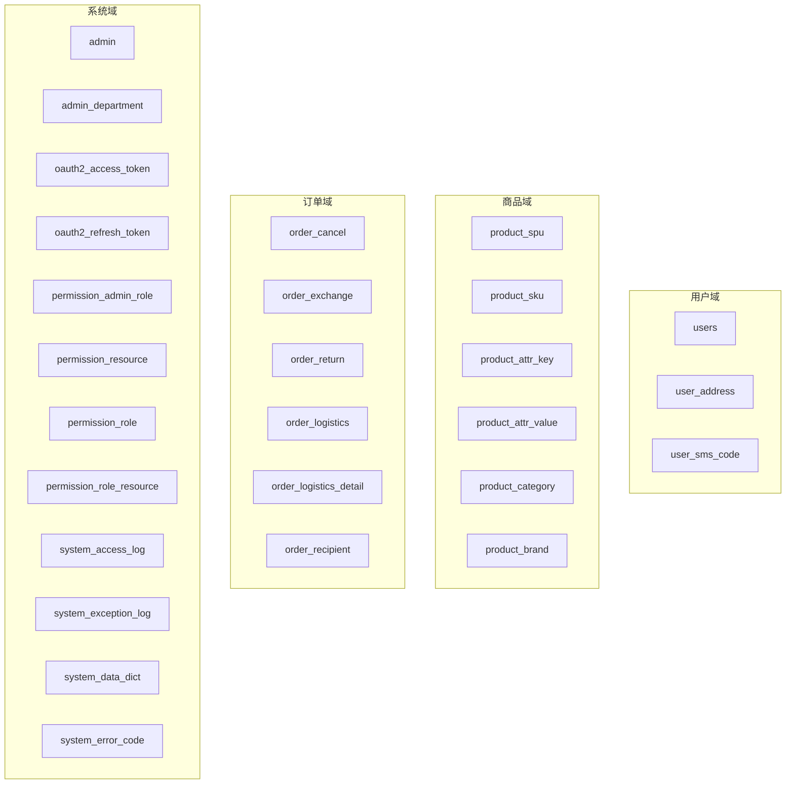
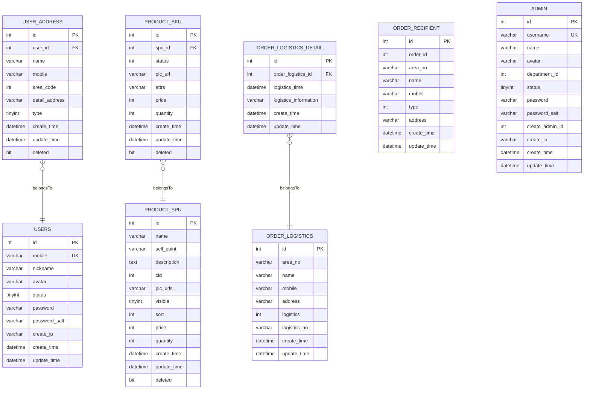
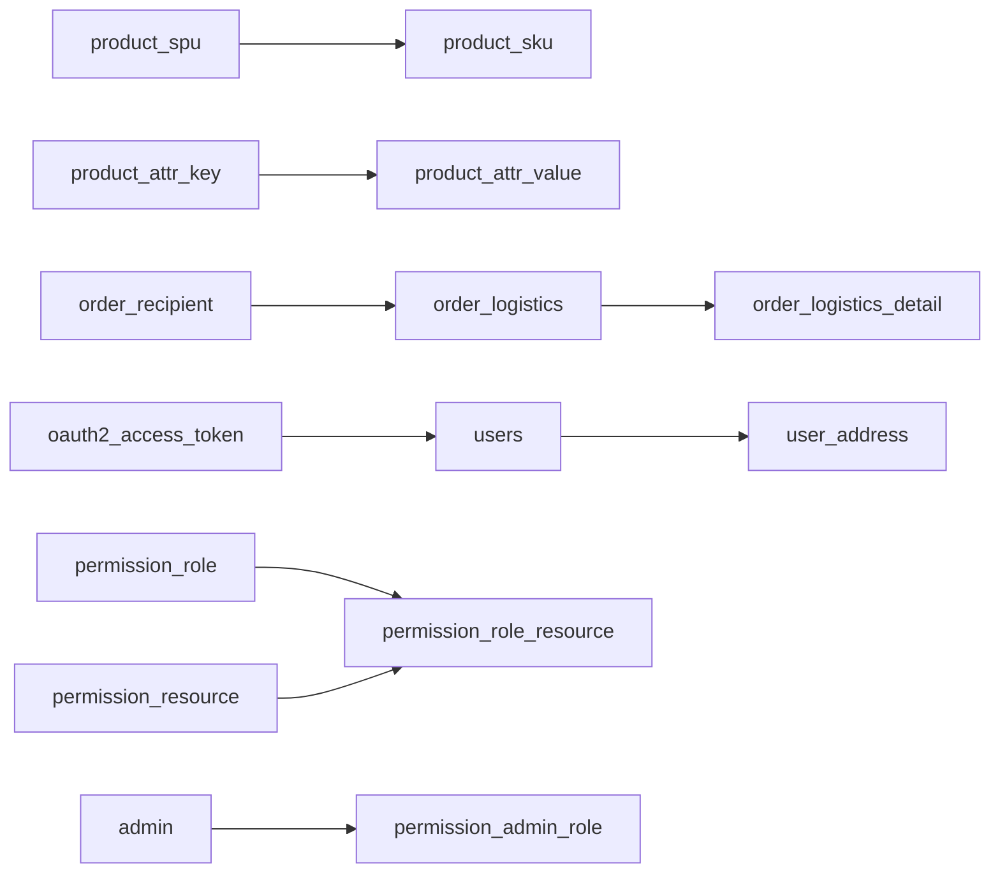

# 数据库设计

<cite>
**本文引用的文件**
- [mall_user_schema.sql](file://user-service-project/user-service-app/src/main/resources/sql/mall_user_schema.sql)
- [mall_user_data.sql](file://user-service-project/user-service-app/src/main/resources/sql/mall_user_data.sql)
- [mall_product_schema.sql](file://product-service-project/product-service-app/src/main/resources/sql/mall_product_schema.sql)
- [mall_product_data.sql](file://product-service-project/product-service-app/src/main/resources/sql/mall_product_data.sql)
- [mall_system_schema.sql](file://system-service-project/system-service-app/src/main/resources/sql/mall_system_schema.sql)
- [mall_system_data.sql](file://system-service-project/system-service-app/src/main/resources/sql/mall_system_data.sql)
- [mall_order.sql](file://docs/sql/old/mall_order.sql)
- [mall_order.sql](file://moved/order/order-service-impl/src/main/resources/sql/mall_order.sql)
- [ProductSpuDO.java](file://product-service-project/product-service-app/src/main/java/cn/iocoder/mall/productservice/dal/mysql/dataobject/spu/ProductSpuDO.java)
- [BaseDO.java](file://common/mall-spring-boot-starter-mybatis/src/main/java/cn/iocoder/mall/mybatis/core/dataobject/BaseDO.java)
- [DeletableDO.java](file://common/mall-spring-boot-starter-mybatis/src/main/java/cn/iocoder/mall/mybatis/core/dataobject/DeletableDO.java)
</cite>

## 目录
1. [简介](#简介)
2. [项目结构](#项目结构)
3. [核心组件](#核心组件)
4. [架构总览](#架构总览)
5. [详细组件分析](#详细组件分析)
6. [依赖分析](#依赖分析)
7. [性能考虑](#性能考虑)
8. [故障排查指南](#故障排查指南)
9. [结论](#结论)
10. [附录](#附录)

## 简介
本文件面向 Onemall 微服务数据库设计，围绕用户、商品、订单、支付、系统等核心域，系统性梳理表结构、字段设计、索引策略、约束与一致性保障，并给出 ER 关系图、分库分表策略建议、查询优化与迁移方案。文档同时结合代码中的通用 DO 基类，说明可复用的建模模式与扩展点。

## 项目结构
- 用户域：users、user_address、user_sms_code
- 商品域：product_spu、product_sku、product_attr_key、product_attr_value、product_category、product_brand
- 订单域：order_*（含取消、换货、退货、物流、收件人等）
- 支付域：交易流水、退款、通知等（在支付服务模块中实现）
- 系统域：admin、admin_department、oauth2_*、permission_*、system_*（访问日志、异常日志、数据字典、错误码）

图表来源
- [mall_user_schema.sql:7-57](file://user-service-project/user-service-app/src/main/resources/sql/mall_user_schema.sql#L7-L57)
- [mall_product_schema.sql:7-103](file://product-service-project/product-service-app/src/main/resources/sql/mall_product_schema.sql#L7-L103)
- [mall_order.sql:5-122](file://docs/sql/old/mall_order.sql#L5-L122)
- [mall_system_schema.sql:8-227](file://system-service-project/system-service-app/src/main/resources/sql/mall_system_schema.sql#L8-L227)

章节来源
- [mall_user_schema.sql:1-58](file://user-service-project/user-service-app/src/main/resources/sql/mall_user_schema.sql#L1-L58)
- [mall_product_schema.sql:1-104](file://product-service-project/product-service-app/src/main/resources/sql/mall_product_schema.sql#L1-L104)
- [mall_order.sql:1-140](file://docs/sql/old/mall_order.sql#L1-L140)
- [mall_system_schema.sql:1-228](file://system-service-project/system-service-app/src/main/resources/sql/mall_system_schema.sql#L1-L228)

## 核心组件
- 用户表 users：唯一手机号、密码盐、注册 IP、状态等；支持软删除的通用基类
- 地址表 user_address：用户与地址的一对多；软删除
- 验证码表 user_sms_code：按手机号索引，记录发送场景与使用状态
- 商品 SPU 表 product_spu：商品主信息、上架状态、排序、价格与库存聚合
- SKU 表 product_sku：规格组合、价格与库存
- 规格键/值表 product_attr_key/value：规格维度与取值
- 分类/品牌表 product_category/brand：树形分类与品牌管理
- 订单相关表：取消、换货、退货、物流、物流明细、收件人
- 系统表：管理员、部门、OAuth2 令牌、权限资源与角色、系统日志、数据字典、错误码

章节来源
- [mall_user_schema.sql:7-57](file://user-service-project/user-service-app/src/main/resources/sql/mall_user_schema.sql#L7-L57)
- [mall_product_schema.sql:7-103](file://product-service-project/product-service-app/src/main/resources/sql/mall_product_schema.sql#L7-L103)
- [mall_order.sql:5-122](file://docs/sql/old/mall_order.sql#L5-L122)
- [mall_system_schema.sql:8-227](file://system-service-project/system-service-app/src/main/resources/sql/mall_system_schema.sql#L8-L227)

## 架构总览
- 采用多服务独立数据库/Schema 的垂直拆分，避免跨服务强外键耦合
- 使用统一的软删除基类与公共字段约定，降低重复与提升一致性
- 订单域与商品域存在强关联（SPU/SKU 与订单项），通过业务 ID 维持弱耦合
- 系统域集中管理认证授权与审计日志，便于跨服务追踪

图表来源
- [mall_user_schema.sql:7-57](file://user-service-project/user-service-app/src/main/resources/sql/mall_user_schema.sql#L7-L57)
- [mall_product_schema.sql:7-103](file://product-service-project/product-service-app/src/main/resources/sql/mall_product_schema.sql#L7-L103)
- [mall_order.sql:46-79](file://docs/sql/old/mall_order.sql#L46-L79)
- [mall_system_schema.sql:8-23](file://system-service-project/system-service-app/src/main/resources/sql/mall_system_schema.sql#L8-L23)

## 详细组件分析

### 用户域（users、user_address、user_sms_code）
- 字段设计要点
  - users：唯一手机号索引，密码与盐分离存储，状态位，IP 与时间戳
  - user_address：用户与地址的外键关联，bit deleted 实现软删除
  - user_sms_code：手机号索引，场景与使用状态，时间戳
- 索引策略
  - users.uk_mobile：唯一索引，用于登录/注册校验
  - user_sms_code.idx_mobile：高频按手机号查询
  - user_address.idx_userId：按用户查询地址
- 约束与一致性
  - 软删除统一由 DeletableDO 提供
  - 建议：手机号唯一性在业务层与数据库层双重保障

章节来源
- [mall_user_schema.sql:7-57](file://user-service-project/user-service-app/src/main/resources/sql/mall_user_schema.sql#L7-L57)

### 商品域（product_spu、product_sku、product_attr_key/value、product_category、product_brand）
- 字段设计要点
  - product_spu：SPU 主信息、上架可见、排序、聚合价格与库存
  - product_sku：SKU 价格与库存、规格属性串
  - 规格键值：维度与取值，支持灵活组合
  - 分类/品牌：树形结构与状态管理
- 索引策略
  - 建议：spu_id 对 sku 建主键/索引；attr_key/value 建唯一/普通索引
  - 分类/品牌：按状态与排序字段建立复合索引
- 约束与一致性
  - 软删除统一由 DeletableDO 提供
  - 建议：SKU 与 SPU 价格/库存保持一致性校验

章节来源
- [mall_product_schema.sql:7-103](file://product-service-project/product-service-app/src/main/resources/sql/mall_product_schema.sql#L7-L103)
- [ProductSpuDO.java:1-83](file://product-service-project/product-service-app/src/main/java/cn/iocoder/mall/productservice/dal/mysql/dataobject/spu/ProductSpuDO.java#L1-L83)

### 订单域（order_cancel、order_exchange、order_return、order_logistics、order_logistics_detail、order_recipient）
- 字段设计要点
  - 物流与收件人：地区编号、姓名、电话、详细地址、物流单号
  - 取消/换货/退货：状态机字段、时间戳、原因与描述
  - 订单号与订单 ID：跨服务弱耦合，避免强外键
- 索引策略
  - 建议：order_id、order_no、物流单号、收件人手机号等常用查询字段建立索引
- 约束与一致性
  - 建议：状态机字段使用枚举或字典值，保证状态流转正确性

章节来源
- [mall_order.sql:5-122](file://docs/sql/old/mall_order.sql#L5-L122)

### 系统域（admin、oauth2_*、permission_*、system_*）
- 字段设计要点
  - admin：用户名唯一、密码盐、部门、状态
  - OAuth2：访问令牌、刷新令牌、过期时间、用户类型
  - 权限：资源、角色、角色-资源关系
  - 日志：访问日志、异常日志、数据字典、错误码
- 索引策略
  - oauth2_access_token.idx_userId、idx_refreshToken
  - system_access_log：按应用名、URI、时间等建立索引
- 约束与一致性
  - 建议：令牌过期与软删除统一处理；日志表按天分区或归档

章节来源
- [mall_system_schema.sql:8-227](file://system-service-project/system-service-app/src/main/resources/sql/mall_system_schema.sql#L8-L227)

### 通用 DO 基类与扩展
- BaseDO：提供统一的创建/更新时间戳
- DeletableDO：提供统一的软删除字段与时间戳
- 建议：所有新增实体继承 DeletableDO，确保一致的生命周期管理

章节来源
- [BaseDO.java](file://common/mall-spring-boot-starter-mybatis/src/main/java/cn/iocoder/mall/mybatis/core/dataobject/BaseDO.java)
- [DeletableDO.java](file://common/mall-spring-boot-starter-mybatis/src/main/java/cn/iocoder/mall/mybatis/core/dataobject/DeletableDO.java)

## 依赖分析
- 内部依赖
  - 商品域：SKU 依赖 SPU；规格键值支撑 SKU 属性组合
  - 订单域：物流与收件人信息与订单主体弱耦合
  - 系统域：权限与日志贯穿各服务
- 外部依赖
  - 支付域：交易与退款表在支付服务中实现，与订单域通过业务单号关联

图表来源
- [mall_product_schema.sql:7-103](file://product-service-project/product-service-app/src/main/resources/sql/mall_product_schema.sql#L7-L103)
- [mall_order.sql:46-97](file://docs/sql/old/mall_order.sql#L46-L97)
- [mall_user_schema.sql:7-57](file://user-service-project/user-service-app/src/main/resources/sql/mall_user_schema.sql#L7-L57)
- [mall_system_schema.sql:8-227](file://system-service-project/system-service-app/src/main/resources/sql/mall_system_schema.sql#L8-L227)

## 性能考虑
- 索引优化
  - 高频查询字段（手机号、用户名、订单号、物流单号、用户 ID）建立合适索引
  - 复合索引：如按状态+时间、分类+状态等
- 查询优化
  - 分页查询使用覆盖索引；避免 SELECT *
  - 大字段（描述、图片地址数组）尽量延迟加载
- 存储与归档
  - 日志类表按天/月分区或归档历史数据
  - 临时/测试数据定期清理
- 事务与锁
  - 库存扣减与下单事务合并，减少长事务
  - 使用乐观锁或版本号控制并发修改

## 故障排查指南
- 常见问题
  - 唯一索引冲突：手机号/用户名重复
  - 软删除误删：确认 deleted 字段与查询过滤
  - 状态机异常：检查状态枚举与业务流程
- 定位手段
  - 结合系统访问日志与异常日志定位请求路径与异常堆栈
  - 使用索引命中情况与慢查询分析工具
- 修复建议
  - 重建必要索引；补充缺失索引
  - 优化 SQL 与分页策略；必要时引入缓存

章节来源
- [mall_system_schema.sql:145-225](file://system-service-project/system-service-app/src/main/resources/sql/mall_system_schema.sql#L145-L225)

## 结论
Onemall 的数据库设计遵循“垂直分域、弱耦合、软删除”的原则，通过统一的 DO 基类实现一致的生命周期管理。商品域以 SPU/SKU 为核心，订单域围绕物流与状态机展开，系统域提供认证授权与可观测性支撑。建议在现有基础上完善索引、优化查询、实施分区与归档策略，并持续沉淀数据字典与错误码体系，以支撑业务长期演进。

## 附录
- 数据迁移方案（建议）
  - 评估现有数据量与结构差异，制定灰度迁移计划
  - 先迁移非核心表，验证索引与查询性能后再迁移核心表
  - 使用双写与对账机制，确保迁移期间数据一致性
- 分库分表策略（建议）
  - 水平分表：以用户 ID、订单号等作为分片键，按月/季度扩容
  - 垂直分表：将大字段（描述、图片数组）拆分至独立表，减少主表 IO
  - 跨分片联查：通过业务 ID 与中间表实现弱关联，避免强外键