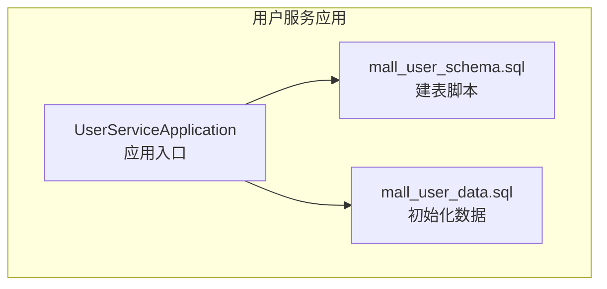
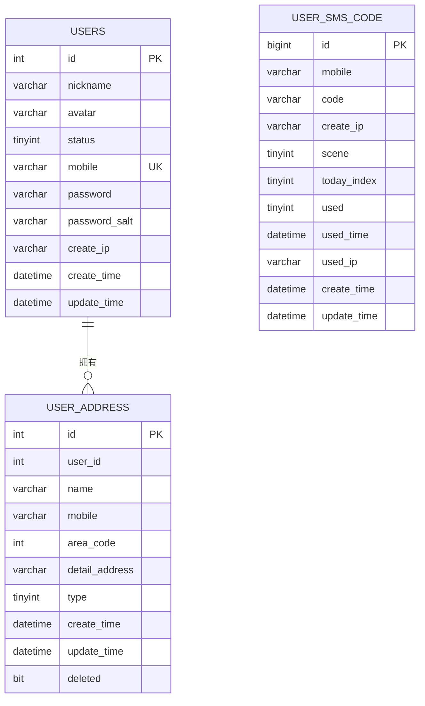
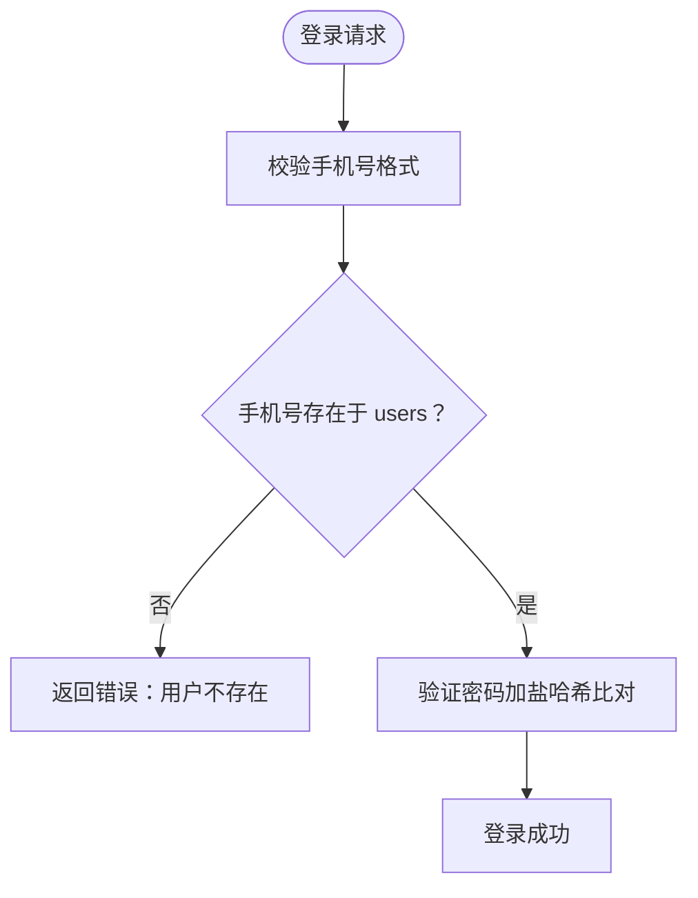
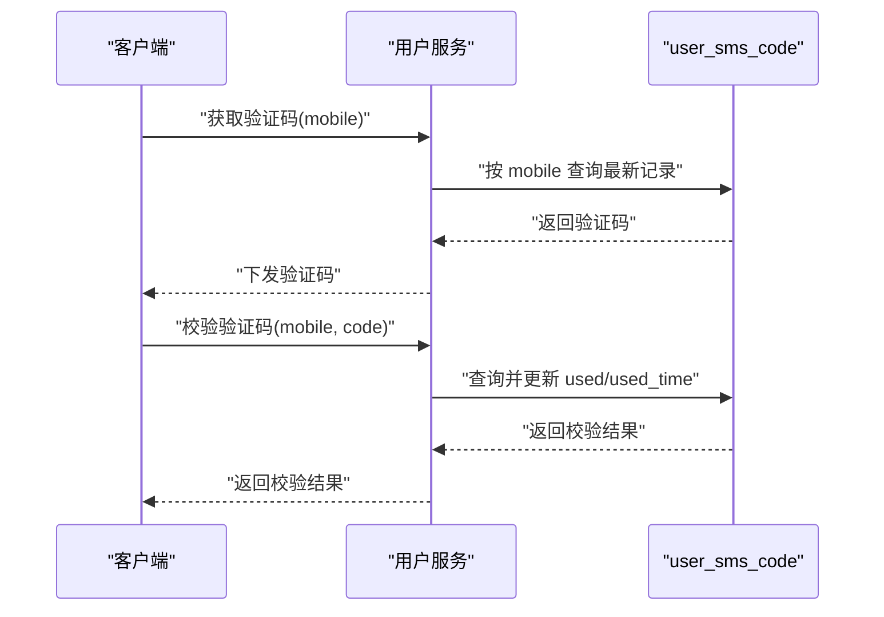
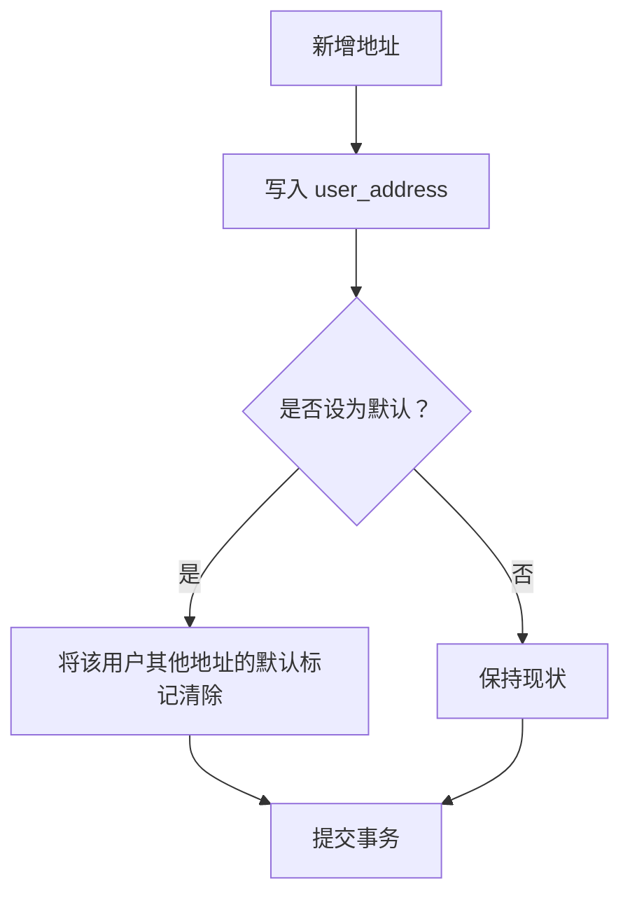
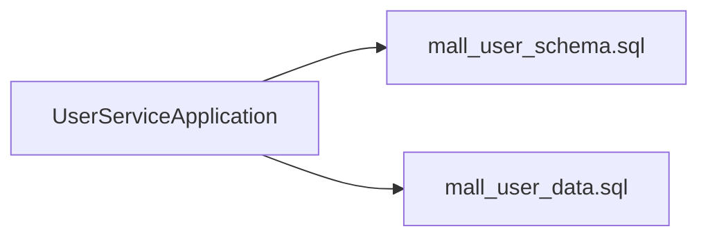

# 用户服务数据库设计

<cite>
**本文引用的文件**
- [mall_user_schema.sql](file://user-service-project/user-service-app/src/main/resources/sql/mall_user_schema.sql)
- [mall_user_data.sql](file://user-service-project/user-service-app/src/main/resources/sql/mall_user_data.sql)
- [UserServiceApplication.java](file://user-service-project/user-service-app/src/main/java/cn/iocoder/mall/userservice/UserServiceApplication.java)
</cite>

## 目录
1. [简介](#简介)
2. [项目结构](#项目结构)
3. [核心组件](#核心组件)
4. [架构总览](#架构总览)
5. [详细组件分析](#详细组件分析)
6. [依赖分析](#依赖分析)
7. [性能考虑](#性能考虑)
8. [故障排查指南](#故障排查指南)
9. [结论](#结论)
10. [附录](#附录)

## 简介
本文件面向用户服务模块的数据库设计，围绕以下核心表展开：用户表(users)、手机验证码表(user_sms_code)、用户地址表(user_address)。内容涵盖字段设计（数据类型、长度、默认值、注释）、主键与索引策略（唯一索引、普通索引）、外键与完整性约束、业务规则落地、查询优化建议，并提供完整的表结构定义、索引策略分析以及数据迁移脚本与初始化数据示例。

## 项目结构
用户服务数据库对象位于用户服务应用模块的资源目录下，通过 SQL 脚本进行建模与初始化。应用入口类用于启动用户服务应用。

**图表来源**
- [UserServiceApplication.java:1-14](file://user-service-project/user-service-app/src/main/java/cn/ihocoder/mall/userservice/UserServiceApplication.java#L1-L14)
- [mall_user_schema.sql:1-58](file://user-service-project/user-service-app/src/main/resources/sql/mall_user_schema.sql#L1-L58)
- [mall_user_data.sql:1-16](file://user-service-project/user-service-app/src/main/resources/sql/mall_user_data.sql#L1-L16)

**章节来源**
- [UserServiceApplication.java:1-14](file://user-service-project/user-service-app/src/main/java/cn/ihocoder/mall/userservice/UserServiceApplication.java#L1-L14)
- [mall_user_schema.sql:1-58](file://user-service-project/user-service-app/src/main/resources/sql/mall_user_schema.sql#L1-L58)
- [mall_user_data.sql:1-16](file://user-service-project/user-service-app/src/main/resources/sql/mall_user_data.sql#L1-L16)

## 核心组件
本节对三大核心表进行逐项解析，包括字段含义、数据类型、长度限制、默认值、注释说明，以及主键、唯一索引、普通索引的设计考量与业务意义。

- users 表（用户）
  - 字段与设计要点
    - id：自增主键，整型，唯一标识用户。
    - nickname：字符串，昵称，utf8mb4_bin 排序规则，允许为空。
    - avatar：字符串，头像地址，utf8mb4_bin 排序规则，允许为空。
    - status：tinyint，用户状态，非空，承载业务状态枚举。
    - mobile：字符串，手机号，固定长度 11，非空，唯一索引 uk_mobile。
    - password：字符串，加密后的密码，非空，配合 salt 使用。
    - password_salt：字符串，密码盐，非空，保障加盐哈希安全。
    - create_ip：字符串，注册 IP，非空。
    - create_time：时间戳，默认当前时间，记录创建时间。
    - update_time：时间戳，默认当前时间并自动更新，记录最后修改时间。
  - 主键与索引
    - 主键：id（自增）。
    - 唯一索引：uk_mobile（mobile），确保手机号唯一性。
    - 普通索引：无显式声明，但可按业务查询需求补充（见“性能考虑”）。
  - 外键与完整性
    - 无外键约束，用户与地址通过 user_id 关联，需在应用层保证一致性。
  - 业务规则
    - 手机号唯一，作为登录与注册的唯一凭证。
    - 密码采用加盐哈希存储，提升安全性。
    - create_ip 与 update_time 支持审计追踪。

- user_sms_code 表（手机验证码）
  - 字段与设计要点
    - id：自增主键，bigint，唯一标识验证码记录。
    - mobile：字符串，手机号，长度 11，非空。
    - code：字符串，验证码，长度 6，非空。
    - create_ip：字符串，创建 IP，非空。
    - scene：tinyint，发送场景，非空，承载业务场景枚举。
    - today_index：tinyint，当日发送序号，非空，用于防刷统计。
    - used：tinyint，是否已使用，非空。
    - used_time：时间戳，使用时间，允许为空。
    - used_ip：字符串，使用 IP，允许为空。
    - create_time：时间戳，默认当前时间，记录创建时间。
    - update_time：时间戳，默认当前时间并自动更新，记录最后更新时间。
  - 主键与索引
    - 主键：id（自增）。
    - 普通索引：idx_mobile（mobile），支持按手机号快速定位最近验证码。
  - 外键与完整性
    - 无外键约束，手机号字段仅作业务关联使用。
  - 业务规则
    - 验证码有效期与使用状态由业务逻辑控制，表内通过 used 字段与 used_time 记录使用情况。
    - today_index 可用于同日发送次数限制。

- user_address 表（用户地址）
  - 字段与设计要点
    - id：自增主键，整型，唯一标识地址。
    - user_id：整型，用户编号，非空，与 users.id 关联（外键未声明，应用层约束）。
    - name：字符串，收件人姓名，长度 10，非空。
    - mobile：字符串，手机号，长度 20，非空。
    - area_code：整型，地区编码，非空。
    - detail_address：字符串，详细地址，长度 250，非空。
    - type：tinyint，地址类型，非空，承载业务类型枚举。
    - create_time：时间戳，默认当前时间，记录创建时间。
    - update_time：时间戳，默认当前时间并自动更新，记录最后更新时间。
    - deleted：bit(1)，删除状态，默认 0（未删除），软删除标记。
  - 主键与索引
    - 主键：id（自增）。
    - 普通索引：idx_userId（user_id），支持按用户查询其所有地址。
  - 外键与完整性
    - 无外键约束，需在应用层保证 user_id 对应的用户存在。
  - 业务规则
    - 软删除：deleted 字段为 0 表示有效，1 表示已删除。
    - 地址类型与地区编码用于订单结算与物流派送。

**章节来源**
- [mall_user_schema.sql:7-20](file://user-service-project/user-service-app/src/main/resources/sql/mall_user_schema.sql#L7-L20)
- [mall_user_schema.sql:25-39](file://user-service-project/user-service-app/src/main/resources/sql/mall_user_schema.sql#L25-L39)
- [mall_user_schema.sql:44-57](file://user-service-project/user-service-app/src/main/resources/sql/mall_user_schema.sql#L44-L57)

## 架构总览
用户服务数据库围绕三张核心表构建，遵循“用户-验证码-地址”的业务分层，通过索引与默认值实现高效查询与审计能力。整体架构如下：

**图表来源**
- [mall_user_schema.sql:7-20](file://user-service-project/user-service-app/src/main/resources/sql/mall_user_schema.sql#L7-L20)
- [mall_user_schema.sql:25-39](file://user-service-project/user-service-app/src/main/resources/sql/mall_user_schema.sql#L25-L39)
- [mall_user_schema.sql:44-57](file://user-service-project/user-service-app/src/main/resources/sql/mall_user_schema.sql#L44-L57)

## 详细组件分析

### users 表（用户）
- 设计要点
  - 唯一索引 uk_mobile 确保手机号全局唯一，避免重复注册。
  - password 与 password_salt 组合实现加盐哈希存储，符合安全最佳实践。
  - create_time 与 update_time 自动维护，便于审计与数据治理。
- 查询优化建议
  - 若存在按昵称或头像检索的需求，可评估添加普通索引；但当前以手机号登录为主，优先保证 uk_mobile 的查询效率。
  - 分页查询时建议以 id 或 uk_mobile 作为排序与过滤条件，避免全表扫描。
- 安全与合规
  - 密码必须使用强哈希算法（如 bcrypt）并妥善保存盐值。
  - create_ip 与 used_ip 可用于风控与审计。

**图表来源**
- [mall_user_schema.sql:11-14](file://user-service-project/user-service-app/src/main/resources/sql/mall_user_schema.sql#L11-L14)

**章节来源**
- [mall_user_schema.sql:7-20](file://user-service-project/user-service-app/src/main/resources/sql/mall_user_schema.sql#L7-L20)

### user_sms_code 表（手机验证码）
- 设计要点
  - idx_mobile 索引支持按手机号快速定位最新验证码，满足“获取/校验验证码”的高频查询。
  - used 与 used_time 记录验证码使用状态，便于幂等与风控。
  - today_index 可用于同日发送上限控制，防止短信刷量。
- 查询优化建议
  - 建议增加复合索引（mobile, create_time），以覆盖“取最新验证码”场景。
  - 验证码过期策略建议在应用层执行，表内保留清理任务或归档策略。
- 安全与合规
  - 验证码有效期与重试次数需在业务层严格控制，避免被暴力破解。

**图表来源**
- [mall_user_schema.sql:25-39](file://user-service-project/user-service-app/src/main/resources/sql/mall_user_schema.sql#L25-L39)

**章节来源**
- [mall_user_schema.sql:25-39](file://user-service-project/user-service-app/src/main/resources/sql/mall_user_schema.sql#L25-L39)

### user_address 表（用户地址）
- 设计要点
  - idx_userId 索引支持按用户查询其全部地址，满足“我的地址”场景。
  - deleted 字段实现软删除，避免物理删除带来的数据不可追溯。
  - type 字段承载地址类型（如默认地址、收货地址等），业务层统一管理。
- 查询优化建议
  - 若存在“默认地址”查询，可在应用层维护一个额外字段或索引，减少扫描成本。
  - 分页加载地址列表时，建议以 id 或 create_time 作为排序键。
- 数据一致性
  - user_id 与 users.id 的关系未在数据库层面声明外键，需在应用层保证用户存在且未删除。

**图表来源**
- [mall_user_schema.sql:44-57](file://user-service-project/user-service-app/src/main/resources/sql/mall_user_schema.sql#L44-L57)

**章节来源**
- [mall_user_schema.sql:44-57](file://user-service-project/user-service-app/src/main/resources/sql/mall_user_schema.sql#L44-L57)

## 依赖分析
- 应用与数据库脚本
  - 应用入口类负责启动用户服务，数据库对象通过 mall_user_schema.sql 初始化。
  - mall_user_data.sql 提供初始用户数据示例，便于本地开发与测试。
- 外部依赖
  - 本模块未直接声明外键，地址与用户的关系通过应用层保证，降低耦合度，但需在业务层加强一致性校验。

**图表来源**
- [UserServiceApplication.java:1-14](file://user-service-project/user-service-app/src/main/java/cn/ihocoder/mall/userservice/UserServiceApplication.java#L1-L14)
- [mall_user_schema.sql:1-58](file://user-service-project/user-service-app/src/main/resources/sql/mall_user_schema.sql#L1-L58)
- [mall_user_data.sql:1-16](file://user-service-project/user-service-app/src/main/resources/sql/mall_user_data.sql#L1-L16)

**章节来源**
- [UserServiceApplication.java:1-14](file://user-service-project/user-service-app/src/main/java/cn/ihocoder/mall/userservice/UserServiceApplication.java#L1-L14)
- [mall_user_schema.sql:1-58](file://user-service-project/user-service-app/src/main/resources/sql/mall_user_schema.sql#L1-L58)
- [mall_user_data.sql:1-16](file://user-service-project/user-service-app/src/main/resources/sql/mall_user_data.sql#L1-L16)

## 性能考虑
- 索引策略
  - users：uk_mobile 已满足手机号登录与去重需求，建议按实际查询场景评估是否添加昵称/头像索引。
  - user_sms_code：idx_mobile 已满足按手机号查询，建议增加（mobile, create_time）复合索引以优化“取最新验证码”。
  - user_address：idx_userId 已满足按用户查询，建议在“默认地址”场景增加应用层字段或索引以减少扫描。
- 查询优化
  - 分页查询优先使用覆盖索引（如 uk_mobile、idx_mobile、idx_userId）。
  - 避免 SELECT *，仅返回必要字段，降低网络与解析开销。
- 存储与字符集
  - 使用 utf8mb4_bin 排序规则保证排序与比较的一致性，适合国际化与多语言场景。
- 审计与追踪
  - create_time 与 update_time 的自动维护便于审计与异常排查。

## 故障排查指南
- 登录失败
  - 检查手机号是否存在且状态正常（uk_mobile 唯一性与 status 状态）。
  - 核对密码加盐哈希是否匹配。
- 验证码无效
  - 核对验证码是否过期、是否已被使用（used/used_time）。
  - 检查发送场景与当日发送次数限制（scene、today_index）。
- 地址查询异常
  - 确认用户是否存在且未被删除。
  - 检查 deleted 字段是否正确过滤软删除记录。
- 索引失效
  - 若出现慢查询，检查是否命中预期索引；必要时重建或调整索引顺序。

## 结论
用户服务数据库以简洁高效的表结构支撑核心业务：手机号唯一登录、验证码安全校验与地址管理。通过合理的索引策略与默认值配置，兼顾了查询性能与审计能力。建议在应用层强化外键约束与一致性校验，同时根据业务增长持续优化索引与查询路径。

## 附录

### 完整表结构定义
- users 表
  - 主键：id
  - 唯一索引：uk_mobile(mobile)
  - 其他字段：nickname、avatar、status、password、password_salt、create_ip、create_time、update_time
- user_sms_code 表
  - 主键：id
  - 普通索引：idx_mobile(mobile)
  - 其他字段：mobile、code、create_ip、scene、today_index、used、used_time、used_ip、create_time、update_time
- user_address 表
  - 主键：id
  - 普通索引：idx_userId(user_id)
  - 其他字段：user_id、name、mobile、area_code、detail_address、type、create_time、update_time、deleted

**章节来源**
- [mall_user_schema.sql:7-20](file://user-service-project/user-service-app/src/main/resources/sql/mall_user_schema.sql#L7-L20)
- [mall_user_schema.sql:25-39](file://user-service-project/user-service-app/src/main/resources/sql/mall_user_schema.sql#L25-L39)
- [mall_user_schema.sql:44-57](file://user-service-project/user-service-app/src/main/resources/sql/mall_user_schema.sql#L44-L57)

### 索引策略分析
- users：uk_mobile(mobile) 已满足手机号登录与去重，建议按查询热点评估扩展索引。
- user_sms_code：idx_mobile(mobile) 已满足按手机号查询，建议增加（mobile, create_time）复合索引。
- user_address：idx_userId(user_id) 已满足按用户查询，建议在“默认地址”场景优化。

**章节来源**
- [mall_user_schema.sql:18-19](file://user-service-project/user-service-app/src/main/resources/sql/mall_user_schema.sql#L18-L19)
- [mall_user_schema.sql:37-38](file://user-service-project/user-service-app/src/main/resources/sql/mall_user_schema.sql#L37-L38)
- [mall_user_schema.sql:56](file://user-service-project/user-service-app/src/main/resources/sql/mall_user_schema.sql#L56)

### 查询优化建议
- 登录：优先使用 uk_mobile(mobile) 进行单点查询。
- 获取验证码：使用 idx_mobile(mobile) 并结合 create_time 排序取最新。
- 地址列表：使用 idx_userId(user_id) 并按 create_time 或 id 分页。

**章节来源**
- [mall_user_schema.sql:18-19](file://user-service-project/user-service-app/src/main/resources/sql/mall_user_schema.sql#L18-L19)
- [mall_user_schema.sql:37-38](file://user-service-project/user-service-app/src/main/resources/sql/mall_user_schema.sql#L37-L38)
- [mall_user_schema.sql:56](file://user-service-project/user-service-app/src/main/resources/sql/mall_user_schema.sql#L56)

### 数据迁移脚本与初始化数据示例
- 建表脚本
  - 路径：user-service-project/user-service-app/src/main/resources/sql/mall_user_schema.sql
  - 内容：包含 users、user_sms_code、user_address 三张表的完整建表语句。
- 初始化数据
  - 路径：user-service-project/user-service-app/src/main/resources/sql/mall_user_data.sql
  - 内容：包含 users 的初始化示例数据，便于本地开发与测试。

**章节来源**
- [mall_user_schema.sql:1-58](file://user-service-project/user-service-app/src/main/resources/sql/mall_user_schema.sql#L1-L58)
- [mall_user_data.sql:1-16](file://user-service-project/user-service-app/src/main/resources/sql/mall_user_data.sql#L1-L16)