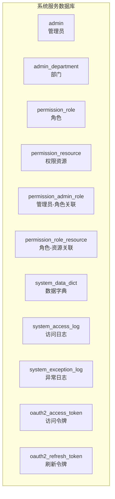
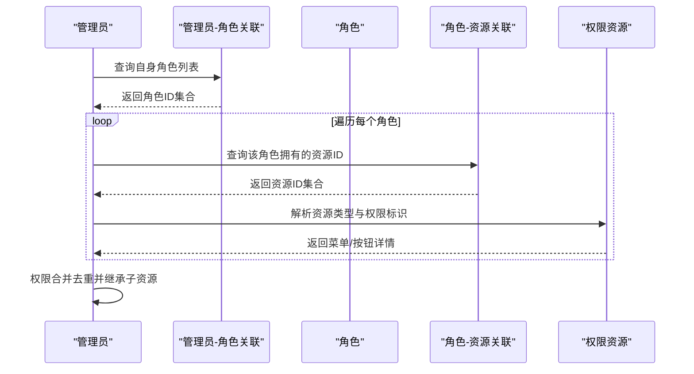
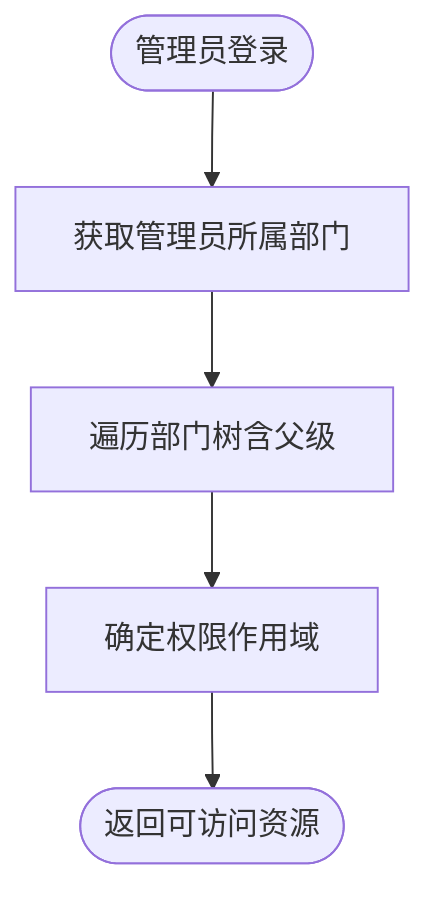
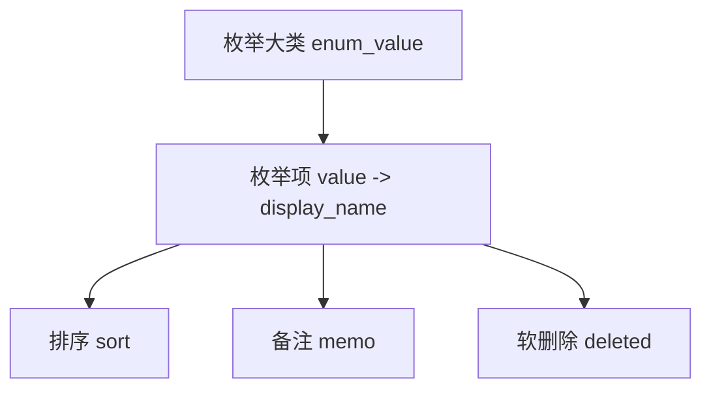
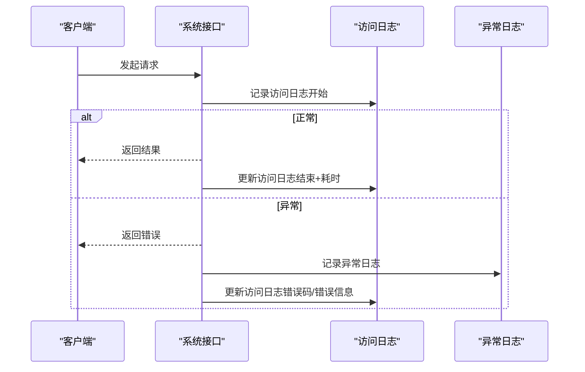
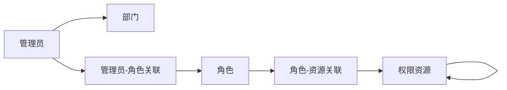

# 系统服务数据库设计

<cite>
**本文引用的文件**
- [mall_system_schema.sql](file://system-service-project/system-service-app/src/main/resources/sql/mall_system_schema.sql)
- [mall_system_data.sql](file://system-service-project/system-service-app/src/main/resources/sql/mall_system_data.sql)
</cite>

## 目录
1. [简介](#简介)
2. [项目结构](#项目结构)
3. [核心组件](#核心组件)
4. [架构总览](#架构总览)
5. [详细组件分析](#详细组件分析)
6. [依赖分析](#依赖分析)
7. [性能考虑](#性能考虑)
8. [故障排查指南](#故障排查指南)
9. [结论](#结论)
10. [附录](#附录)

## 简介
本文件面向系统服务模块的数据库设计，围绕 RBAC 权限模型与系统管理相关的核心表展开，系统性解析以下主题：
- 管理员表、部门表、角色表、权限资源表、数据字典表、操作日志表等的设计理念与字段含义
- RBAC 权限模型的数据结构实现：资源类型（菜单/按钮）、角色与权限的多对多关联、管理员与角色的多对多关联
- 菜单权限与按钮权限的关联关系与继承合并机制
- 数据字典的层级结构设计与枚举值组织
- 操作日志与异常日志的审计数据模型
- 系统配置的数据存储方案与扩展点
- 管理员与部门的组织架构关系
- 安全管理策略与最佳实践

## 项目结构
系统服务模块的数据库脚本位于 system-service-app 的 resources/sql 目录，包含表结构与初始数据两部分：
- 表结构：定义管理员、部门、角色、权限资源、数据字典、系统日志等核心表
- 初始数据：包含管理员、部门、角色、权限资源、数据字典等样例数据

图表来源
- [mall_system_schema.sql:7-228](file://system-service-project/system-service-app/src/main/resources/sql/mall_system_schema.sql#L7-L228)

章节来源
- [mall_system_schema.sql:1-228](file://system-service-project/system-service-app/src/main/resources/sql/mall_system_schema.sql#L1-L228)

## 核心组件
本节从数据模型角度梳理系统服务模块的核心表及其职责与关键字段。

- 管理员表（admin）
  - 关键字段：主键 id、姓名 name、头像 avatar、所属部门 department_id、状态 status、登录账号 username、加密密码 password、密码盐 password_salt、创建者 create_admin_id、创建 IP create_ip、创建/更新时间 create_time/update_time
  - 设计要点：唯一索引 username；部门字段用于组织架构关联；密码采用加盐哈希存储

- 部门表（admin_department）
  - 关键字段：主键 id、部门名称 name、排序 sort、父级部门 pid、创建/更新时间 create_time/update_time、软删除 deleted
  - 设计要点：支持树形结构（pid），通过 sort 实现层级顺序；deleted 字段实现软删除

- 角色表（permission_role）
  - 关键字段：主键 id、角色名 name、角色编码 code、角色类型 type、创建者 create_admin_id、创建/更新时间 create_time/update_time、软删除 deleted
  - 设计要点：type 区分内置/自定义角色；code 唯一标识角色

- 权限资源表（permission_resource）
  - 关键字段：主键 id、菜单名 name、权限标识 permission、资源类型 type（菜单/按钮）、排序 sort、父级资源 pid、前端路由 route、图标 icon、视图 view、创建者 create_admin_id、创建/更新时间 create_time/update_time、软删除 deleted
  - 设计要点：type=1 表示菜单，type=2 表示按钮；permission 作为后端鉴权标识；pid 支持树形结构

- 管理员-角色关联表（permission_admin_role）
  - 关键字段：主键 id、管理员 id admin_id、角色 id role_id、创建/更新时间 create_time/update_time、软删除 deleted
  - 设计要点：多对多关联，支持管理员拥有多个角色

- 角色-资源关联表（permission_role_resource）
  - 关键字段：主键 id、角色 id role_id、资源 id resource_id、创建/更新时间 create_time/update_time、软删除 deleted
  - 设计要点：多对多关联，角色可拥有多个资源（菜单/按钮）

- 数据字典表（system_data_dict）
  - 关键字段：主键 id、大类枚举值 enum_value、小类数值 value、展示名 display_name、排序 sort、备注 memo、创建/更新时间 create_time/update_time、软删除 deleted
  - 设计要点：以 enum_value 为维度的层级字典，value 唯一标识具体项；支持排序与软删除

- 访问日志表（system_access_log）
  - 关键字段：主键 id、用户编号 user_id、用户类型 user_type、链路追踪编号 trace_id、应用名 application_name、URI uri、查询参数 query_string、HTTP 方法 method、User-Agent userAgent、IP ip、请求开始时间 start_time、响应时长 response_time、错误码 errorCode、错误信息 error_message、创建/更新时间 create_time/update_time
  - 设计要点：记录接口访问的全链路审计信息

- 异常日志表（system_exception_log）
  - 关键字段：主键 id、用户编号 user_id、用户类型 user_type、链路追踪编号 trace_id、应用名 application_name、URI uri、查询参数 query_string、HTTP 方法 method、User-Agent userAgent、IP ip、异常发生时间 exception_time、异常类名 exception_name、异常消息 exception_message、根因消息 exception_root_cause_message、堆栈信息 exception_stack_trace、异常发生位置（类/文件/方法/行号）、创建/更新时间 create_time/update_time
  - 设计要点：结构化记录异常上下文，便于定位问题

- OAuth2 令牌表（oauth2_access_token / oauth2_refresh_token）
  - 关键字段：令牌 id、用户编号 user_id、用户类型 user_type、过期时间 expires_time、创建 IP create_ip、创建/更新时间 create_time/update_time、软删除 deleted
  - 设计要点：支持刷新令牌与访问令牌分离，便于安全控制

章节来源
- [mall_system_schema.sql:7-228](file://system-service-project/system-service-app/src/main/resources/sql/mall_system_schema.sql#L7-L228)

## 架构总览
系统服务模块的数据库围绕 RBAC 权限模型构建，形成“管理员—角色—资源”的权限链条，并通过数据字典与日志表支撑配置管理与审计能力。

```mermaid
erDiagram
ADMIN ||--o{ AR : "拥有"
ROLE ||--o{ RR : "拥有"
ADMIN ||--o{ DEPT : "属于"
RES ||--o{ RR : "被授予"
ADMIN {
int id PK
string username UK
int department_id
int status
string password
string password_salt
string avatar
int create_admin_id
string create_ip
datetime create_time
datetime update_time
}
ADMIN_DEPARTMENT {
int id PK
string name
int sort
int pid
datetime create_time
datetime update_time
bit deleted
}
PERMISSION_ROLE {
int id PK
string name
string code
tinyint type
int create_admin_id
datetime create_time
datetime update_time
bit deleted
}
PERMISSION_RESOURCE {
int id PK
string name
string permission
int type
int sort
int pid
string route
string icon
string view
int create_admin_id
datetime create_time
datetime update_time
bit deleted
}
PERMISSION_ADMIN_ROLE {
int id PK
int admin_id
int role_id
datetime create_time
datetime update_time
bit deleted
}
PERMISSION_ROLE_RESOURCE {
int id PK
int role_id
int resource_id
datetime create_time
datetime update_time
bit deleted
}
SYSTEM_DATA_DICT {
int id PK
string enum_value
string value
string display_name
int sort
string memo
datetime create_time
datetime update_time
bit deleted
}
SYSTEM_ACCESS_LOG {
int id PK
int user_id
tinyint user_type
string trace_id
string application_name
string uri
string query_string
string method
string userAgent
string ip
datetime start_time
int response_time
int errorCode
string error_message
datetime create_time
datetime update_time
}
SYSTEM_EXCEPTION_LOG {
int id PK
int user_id
tinyint user_type
string trace_id
string application_name
string uri
string query_string
string method
string userAgent
string ip
datetime exception_time
string exception_name
text exception_message
text exception_root_cause_message
text exception_stack_trace
string exception_class_name
string exception_file_name
string exception_method_name
int exception_line_number
datetime create_time
datetime update_time
}
OAUTH2_ACCESS_TOKEN {
string id PK
int user_id
tinyint user_type
string refresh_token
datetime expires_time
string create_ip
datetime create_time
datetime update_time
bit deleted
}
OAUTH2_REFRESH_TOKEN {
string id PK
int user_id
tinyint user_type
datetime expires_time
string create_ip
datetime create_time
datetime update_time
bit deleted
}
```

图表来源
- [mall_system_schema.sql:7-228](file://system-service-project/system-service-app/src/main/resources/sql/mall_system_schema.sql#L7-L228)

## 详细组件分析

### RBAC 权限模型与数据结构
- 资源类型与权限标识
  - 资源类型 type=1 表示菜单，type=2 表示按钮；permission 字段作为后端鉴权标识，如 system:admin:create、system:role:page 等
  - 菜单与按钮通过 pid 形成父子关系，支持树形导航与按钮级权限控制

- 角色与资源的多对多
  - permission_role_resource 将角色与资源解耦，一个角色可拥有多个资源，一个资源可被多个角色拥有
  - 通过资源树的继承特性，角色可间接获得子节点权限（菜单包含其下所有按钮）

- 管理员与角色的多对多
  - permission_admin_role 允许管理员同时具备多个角色，权限按角色聚合

- 权限继承与合并机制
  - 继承：角色拥有的资源集合天然包含其子资源（菜单包含按钮）
  - 合并：管理员的最终权限为其所属角色权限的并集；若同一资源在不同角色中存在，仍视为一次授权

图表来源
- [mall_system_schema.sql:77-139](file://system-service-project/system-service-app/src/main/resources/sql/mall_system_schema.sql#L77-L139)

章节来源
- [mall_system_schema.sql:77-139](file://system-service-project/system-service-app/src/main/resources/sql/mall_system_schema.sql#L77-L139)

### 管理员与部门的组织架构关系
- 管理员表包含 department_id 字段，指向部门表的主键
- 部门表通过 pid 支持树形结构，sort 控制同级排序
- 管理员可按部门进行统计与筛选，支持组织架构的可视化与权限域划分

图表来源
- [mall_system_schema.sql:8-38](file://system-service-project/system-service-app/src/main/resources/sql/mall_system_schema.sql#L8-L38)

章节来源
- [mall_system_schema.sql:8-38](file://system-service-project/system-service-app/src/main/resources/sql/mall_system_schema.sql#L8-L38)

### 数据字典的层级结构设计
- system_data_dict 以 enum_value 为维度，value 为具体枚举值，display_name 为展示名
- 通过 sort 控制展示顺序，memo 提供业务说明
- 支持软删除，便于历史版本保留与回溯

图表来源
- [mall_system_schema.sql:166-180](file://system-service-project/system-service-app/src/main/resources/sql/mall_system_schema.sql#L166-L180)

章节来源
- [mall_system_schema.sql:166-180](file://system-service-project/system-service-app/src/main/resources/sql/mall_system_schema.sql#L166-L180)
- [mall_system_data.sql:135-210](file://system-service-project/system-service-app/src/main/resources/sql/mall_system_data.sql#L135-L210)

### 操作日志与异常日志的审计模型
- 访问日志（system_access_log）
  - 记录请求 URI、方法、参数、User-Agent、IP、耗时、错误码与错误信息
  - 支持 trace_id 关联链路追踪，便于跨系统串联

- 异常日志（system_exception_log）
  - 结构化记录异常类名、消息、根因、堆栈、发生位置（类/文件/方法/行号）
  - 与访问日志共享 trace_id，便于问题复盘

图表来源
- [mall_system_schema.sql:142-225](file://system-service-project/system-service-app/src/main/resources/sql/mall_system_schema.sql#L142-L225)

章节来源
- [mall_system_schema.sql:142-225](file://system-service-project/system-service-app/src/main/resources/sql/mall_system_schema.sql#L142-L225)

### 系统配置的数据存储方案
- 数据字典表承担系统配置与枚举值的集中存储，支持多枚举维度与排序
- 可通过配置中心或缓存层提升读取性能，写入时同步更新字典表
- 建议对高频读取的字典项建立本地缓存，降低数据库压力

章节来源
- [mall_system_schema.sql:166-180](file://system-service-project/system-service-app/src/main/resources/sql/mall_system_schema.sql#L166-L180)

## 依赖分析
- 外键与约束
  - 管理员表 department_id 指向部门表 id
  - 资源表 pid 指向自身 id（自引用），形成资源树
  - 角色-资源关联与管理员-角色关联分别指向角色与管理员表
- 软删除策略
  - 部门、资源、角色、数据字典均使用 deleted 字段实现软删除，避免物理删除带来的数据不可追溯
- 索引与查询
  - 资源表与角色-资源关联表通过组合索引支持快速查询角色的资源集合
  - 管理员-角色关联表支持快速查询管理员的角色集合

图表来源
- [mall_system_schema.sql:77-139](file://system-service-project/system-service-app/src/main/resources/sql/mall_system_schema.sql#L77-L139)

章节来源
- [mall_system_schema.sql:77-139](file://system-service-project/system-service-app/src/main/resources/sql/mall_system_schema.sql#L77-L139)

## 性能考虑
- 索引优化
  - 在 permission_role_resource(role_id) 与 permission_admin_role(admin_id) 上建立索引，加速权限查询
  - 在 permission_resource(pid) 上建立索引，加速资源树构建
- 分页与过滤
  - 日志表按时间范围分页查询，避免全表扫描
- 缓存策略
  - 将常用数据字典与角色-资源映射缓存至内存，减少数据库访问
- 软删除与归档
  - deleted 字段配合定期归档任务，保持在线表规模可控

## 故障排查指南
- 权限不足
  - 检查管理员是否拥有对应角色，以及角色是否拥有目标资源
  - 确认资源类型（菜单/按钮）与权限标识（permission）匹配
- 资源缺失
  - 核对 permission_resource 中是否存在目标资源，确认 deleted 状态与 pid 关系
- 日志定位
  - 使用 system_access_log 的 trace_id 与 system_exception_log 的异常信息进行关联排查
- 配置异常
  - 检查 system_data_dict 中对应枚举项的 value/display_name 是否正确

章节来源
- [mall_system_schema.sql:142-225](file://system-service-project/system-service-app/src/main/resources/sql/mall_system_schema.sql#L142-L225)
- [mall_system_data.sql:135-210](file://system-service-project/system-service-app/src/main/resources/sql/mall_system_data.sql#L135-L210)

## 结论
本数据库设计以 RBAC 为核心，通过“管理员—角色—资源”三层权限链路与“角色—资源”、“管理员—角色”的多对多关联，实现了灵活且可扩展的权限体系。配合数据字典与日志审计，系统在功能完备性、可维护性与安全性方面均具备良好基础。建议后续在权限计算、缓存与归档等方面持续优化，以满足高并发场景下的性能与稳定性需求。

## 附录
- 示例数据参考
  - 管理员、部门、角色、资源、数据字典等样例数据可参考 mall_system_data.sql 文件
- 版本与兼容性
  - 脚本基于 InnoDB 存储引擎，支持事务与外键约束；如需迁移，请确保目标环境兼容

章节来源
- [mall_system_data.sql:1-218](file://system-service-project/system-service-app/src/main/resources/sql/mall_system_data.sql#L1-L218)