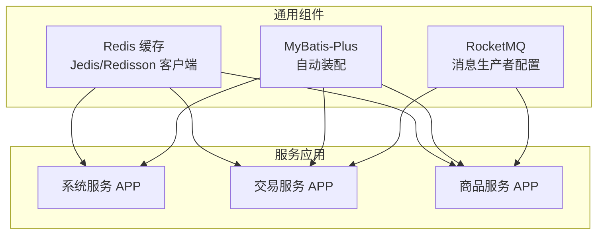
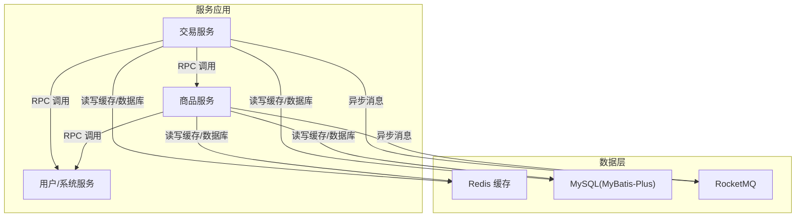
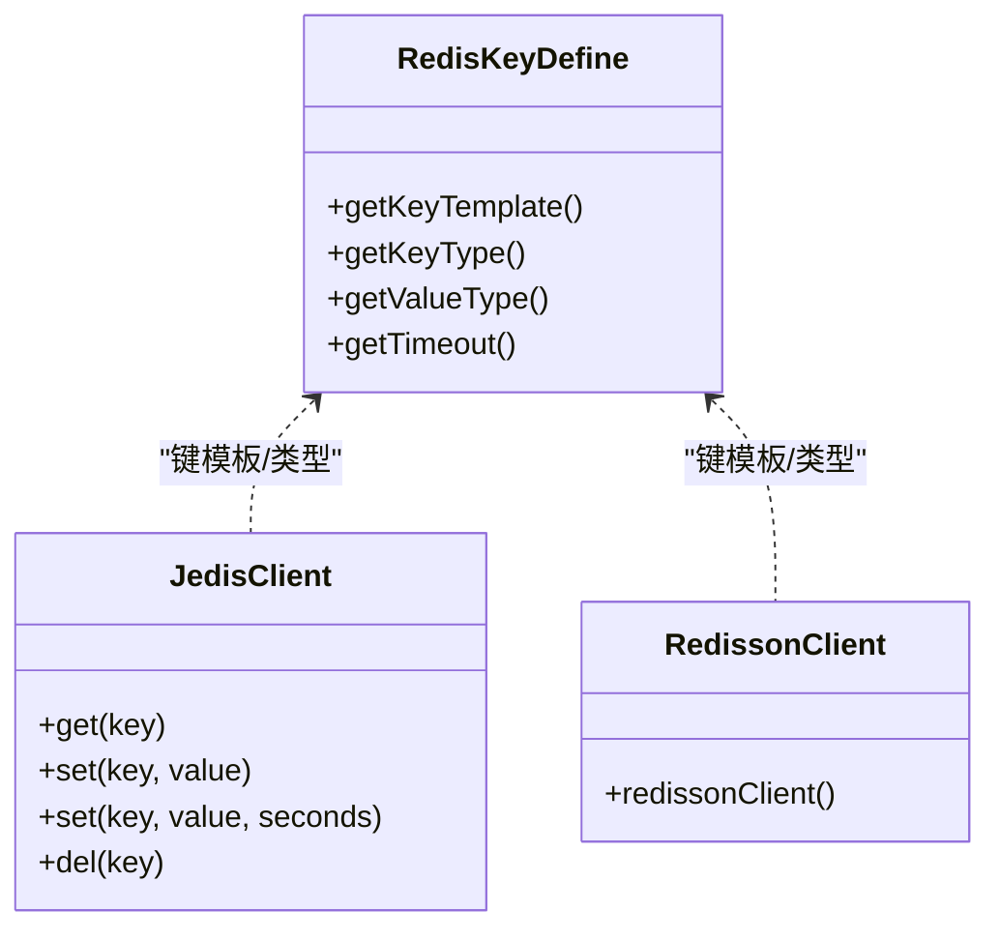
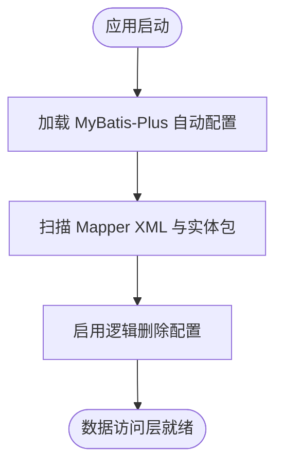
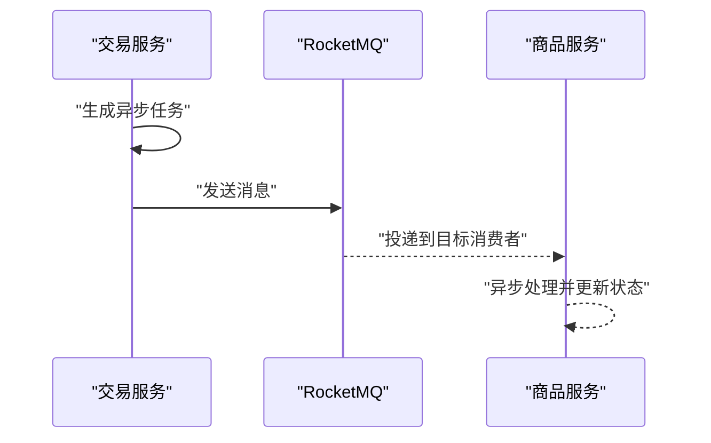
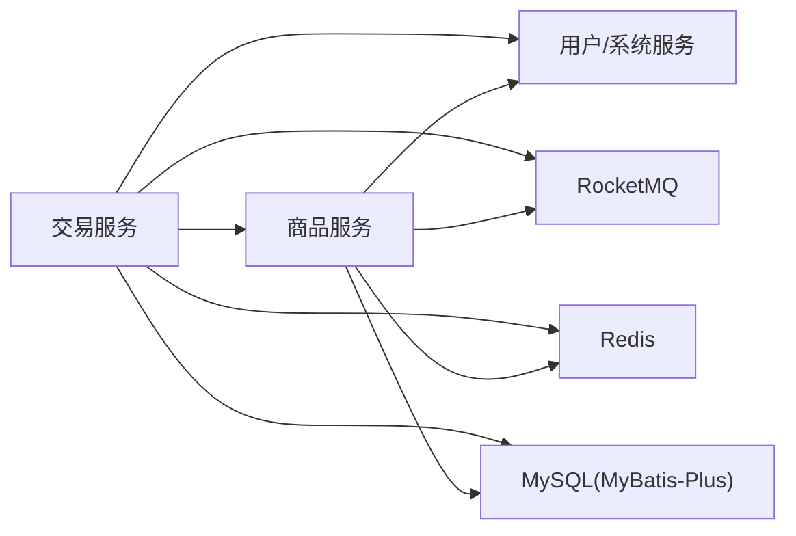

# 数据架构设计

<cite>
**本文引用的文件**
- [RedisKeyDefine.java](file://common/mall-spring-boot-starter-redis/src/main/java/cn/iocoder/mall/redis/core/RedisKeyDefine.java)
- [JedisClient.java](file://common/mall-spring-boot-starter-cache/src/main/java/cn/iocoder/mall/cache/config/JedisClient.java)
- [RedissonClient.java](file://common/mall-spring-boot-starter-cache/src/main/java/cn/iocoder/mall/cache/config/RedissonClient.java)
- [redis.properties](file://common/mall-spring-boot-starter-cache/src/main/resources/redis.properties)
- [MybatisPlusAutoConfiguration.java](file://common/mall-spring-boot-starter-mybatis/src/main/java/cn/iocoder/mall/mybatis/config/MybatisPlusAutoConfiguration.java)
- [application.yaml（系统服务）](file://system-service-project/system-service-app/src/main/resources/application.yaml)
- [application.yaml（交易服务）](file://trade-service-project/trade-service-app/src/main/resources/application.yaml)
- [application.yaml（商品服务）](file://product-service-project/product-service-app/src/main/resources/application.yaml)
</cite>

## 目录
1. [简介](#简介)
2. [项目结构](#项目结构)
3. [核心组件](#核心组件)
4. [架构总览](#架构总览)
5. [详细组件分析](#详细组件分析)
6. [依赖分析](#依赖分析)
7. [性能考虑](#性能考虑)
8. [故障排查指南](#故障排查指南)
9. [结论](#结论)
10. [附录](#附录)

## 简介
本文件面向 Onemall 的数据架构设计，聚焦于分布式数据库与缓存策略、MySQL 设计要点、数据一致性保障以及消息队列在数据同步中的作用。文档以代码仓库中的实际实现为依据，结合配置与基础设施，给出可落地的设计建议与可视化图示，帮助读者快速理解系统在数据层面的组织方式与运行机制。

## 项目结构
Onemall 采用多模块微服务架构，围绕“服务-应用-接口”三层划分：服务接口模块（API）定义领域契约；应用模块（APP）承载业务实现与数据访问；管理端/前端应用负责对外交互。数据侧的关键支撑由通用组件提供：Redis 缓存、MyBatis-Plus ORM、Dubbo RPC 以及 RocketMQ 消息队列。

图表来源
- [JedisClient.java:1-80](file://common/mall-spring-boot-starter-cache/src/main/java/cn/iocoder/mall/cache/config/JedisClient.java#L1-L80)
- [RedissonClient.java:1-52](file://common/mall-spring-boot-starter-cache/src/main/java/cn/iocoder/mall/cache/config/RedissonClient.java#L1-L52)
- [MybatisPlusAutoConfiguration.java:1-24](file://common/mall-spring-boot-starter-mybatis/src/main/java/cn/iocoder/mall/mybatis/config/MybatisPlusAutoConfiguration.java#L1-L24)
- [application.yaml（系统服务）:1-79](file://system-service-project/system-service-app/src/main/resources/application.yaml#L1-L79)
- [application.yaml（交易服务）:1-76](file://trade-service-project/trade-service-app/src/main/resources/application.yaml#L1-L76)
- [application.yaml（商品服务）:1-61](file://product-service-project/product-service-app/src/main/resources/application.yaml#L1-L61)

章节来源
- [application.yaml（系统服务）:1-79](file://system-service-project/system-service-app/src/main/resources/application.yaml#L1-L79)
- [application.yaml（交易服务）:1-76](file://trade-service-project/trade-service-app/src/main/resources/application.yaml#L1-L76)
- [application.yaml（商品服务）:1-61](file://product-service-project/product-service-app/src/main/resources/application.yaml#L1-L61)

## 核心组件
- Redis 缓存：通过 Jedis/Redisson 客户端提供高可用连接与哨兵模式读取，支持多种键类型与过期策略，统一 Key 命名规范。
- MyBatis-Plus：提供自定义 SQL 注入器扩展，启用驼峰映射、逻辑删除、Mapper XML 扫描等，简化数据访问层开发。
- MySQL：服务应用通过 MyBatis-Plus 访问数据库，结合逻辑删除、自动 ID 策略与命名规范，确保数据一致性与可维护性。
- RocketMQ：交易/商品服务配置了 RocketMQ 生产者组，用于异步解耦与削峰填谷。

章节来源
- [RedisKeyDefine.java:1-72](file://common/mall-spring-boot-starter-redis/src/main/java/cn/iocoder/mall/redis/core/RedisKeyDefine.java#L1-L72)
- [JedisClient.java:1-80](file://common/mall-spring-boot-starter-cache/src/main/java/cn/iocoder/mall/cache/config/JedisClient.java#L1-L80)
- [RedissonClient.java:1-52](file://common/mall-spring-boot-starter-cache/src/main/java/cn/iocoder/mall/cache/config/RedissonClient.java#L1-L52)
- [MybatisPlusAutoConfiguration.java:1-24](file://common/mall-spring-boot-starter-mybatis/src/main/java/cn/iocoder/mall/mybatis/config/MybatisPlusAutoConfiguration.java#L1-L24)
- [application.yaml（交易服务）:53-58](file://trade-service-project/trade-service-app/src/main/resources/application.yaml#L53-L58)
- [application.yaml（商品服务）:43-48](file://product-service-project/product-service-app/src/main/resources/application.yaml#L43-L48)

## 架构总览
下图展示了服务应用与数据层的交互关系：服务通过 RPC 调用其他服务，同时通过缓存与数据库进行读写操作；消息队列承担异步任务与事件发布。

图表来源
- [application.yaml（交易服务）:21-58](file://trade-service-project/trade-service-app/src/main/resources/application.yaml#L21-L58)
- [application.yaml（商品服务）:21-48](file://product-service-project/product-service-app/src/main/resources/application.yaml#L21-L48)
- [application.yaml（系统服务）:22-61](file://system-service-project/system-service-app/src/main/resources/application.yaml#L22-L61)

## 详细组件分析

### Redis 缓存架构
- 客户端能力
  - Jedis 客户端：提供字符串 GET/SET/DEL 与带 TTL 的 SET 封装，基于哨兵池获取连接，异常安全处理与资源释放。
  - Redisson 客户端：基于哨兵模式构建，支持从节点读取（SLAVE），配置数据库编号与主从地址列表。
- Key 规范
  - RedisKeyDefine 统一定义 Key 模板、类型（STRING/LIST/HASH/SET/ZSET/STREAM/PUBSUB）、值类型与过期时间，支持“永久不过期”标记。
- 连接池参数
  - redis.properties 提供最大空闲、最小空闲、最大总连接、连接等待时间、驱逐策略等参数，确保连接池稳定性。

图表来源
- [RedisKeyDefine.java:1-72](file://common/mall-spring-boot-starter-redis/src/main/java/cn/iocoder/mall/redis/core/RedisKeyDefine.java#L1-L72)
- [JedisClient.java:1-80](file://common/mall-spring-boot-starter-cache/src/main/java/cn/iocoder/mall/cache/config/JedisClient.java#L1-L80)
- [RedissonClient.java:1-52](file://common/mall-spring-boot-starter-cache/src/main/java/cn/iocoder/mall/cache/config/RedissonClient.java#L1-L52)

章节来源
- [JedisClient.java:1-80](file://common/mall-spring-boot-starter-cache/src/main/java/cn/iocoder/mall/cache/config/JedisClient.java#L1-L80)
- [RedissonClient.java:1-52](file://common/mall-spring-boot-starter-cache/src/main/java/cn/iocoder/mall/cache/config/RedissonClient.java#L1-L52)
- [RedisKeyDefine.java:1-72](file://common/mall-spring-boot-starter-redis/src/main/java/cn/iocoder/mall/redis/core/RedisKeyDefine.java#L1-L72)
- [redis.properties:1-18](file://common/mall-spring-boot-starter-cache/src/main/resources/redis.properties#L1-L18)

### MySQL 数据访问层
- MyBatis-Plus 自动装配
  - 注入自定义 SQL 扩展器，增强通用 CRUD 与批量操作能力。
- 服务应用配置要点
  - 启用下划线转驼峰映射、逻辑删除字段值、Mapper XML 扫描路径与实体包路径。
  - 服务消费者声明对其他服务的 RPC 版本要求，确保跨服务调用一致性。

图表来源
- [MybatisPlusAutoConfiguration.java:1-24](file://common/mall-spring-boot-starter-mybatis/src/main/java/cn/iocoder/mall/mybatis/config/MybatisPlusAutoConfiguration.java#L1-L24)
- [application.yaml（系统服务）:10-21](file://system-service-project/system-service-app/src/main/resources/application.yaml#L10-L21)
- [application.yaml（交易服务）:9-19](file://trade-service-project/trade-service-app/src/main/resources/application.yaml#L9-L19)
- [application.yaml（商品服务）:9-19](file://product-service-project/product-service-app/src/main/resources/application.yaml#L9-L19)

章节来源
- [MybatisPlusAutoConfiguration.java:1-24](file://common/mall-spring-boot-starter-mybatis/src/main/java/cn/iocoder/mall/mybatis/config/MybatisPlusAutoConfiguration.java#L1-L24)
- [application.yaml（系统服务）:10-21](file://system-service-project/system-service-app/src/main/resources/application.yaml#L10-L21)
- [application.yaml（交易服务）:9-19](file://trade-service-project/trade-service-app/src/main/resources/application.yaml#L9-L19)
- [application.yaml（商品服务）:9-19](file://product-service-project/product-service-app/src/main/resources/application.yaml#L9-L19)

### 消息队列（RocketMQ）
- 交易服务与商品服务均配置 RocketMQ NameServer 与生产者组，用于异步处理与削峰填谷。
- 典型场景
  - 订单状态变更通知、库存扣减确认、营销活动异步计算等。

图表来源
- [application.yaml（交易服务）:53-58](file://trade-service-project/trade-service-app/src/main/resources/application.yaml#L53-L58)
- [application.yaml（商品服务）:43-48](file://product-service-project/product-service-app/src/main/resources/application.yaml#L43-L48)

章节来源
- [application.yaml（交易服务）:53-58](file://trade-service-project/trade-service-app/src/main/resources/application.yaml#L53-L58)
- [application.yaml（商品服务）:43-48](file://product-service-project/product-service-app/src/main/resources/application.yaml#L43-L48)

## 依赖分析
- 服务间依赖
  - 交易服务消费商品服务 SKU、用户服务地址与支付服务交易等 RPC 接口。
  - 商品服务与系统服务提供基础数据与字典能力。
- 数据访问依赖
  - 各服务应用均依赖 MyBatis-Plus 与 Redis 缓存客户端，形成统一的数据访问与缓存策略。
- 消息依赖
  - 交易/商品服务通过 RocketMQ 与外部系统或下游服务解耦。

图表来源
- [application.yaml（交易服务）:38-51](file://trade-service-project/trade-service-app/src/main/resources/application.yaml#L38-L51)
- [application.yaml（商品服务）:38-42](file://product-service-project/product-service-app/src/main/resources/application.yaml#L38-L42)
- [application.yaml（系统服务）:35-56](file://system-service-project/system-service-app/src/main/resources/application.yaml#L35-L56)

章节来源
- [application.yaml（交易服务）:38-51](file://trade-service-project/trade-service-app/src/main/resources/application.yaml#L38-L51)
- [application.yaml（商品服务）:38-42](file://product-service-project/product-service-app/src/main/resources/application.yaml#L38-L42)
- [application.yaml（系统服务）:35-56](file://system-service-project/system-service-app/src/main/resources/application.yaml#L35-L56)

## 性能考虑
- Redis
  - 使用哨兵模式提升可用性，从节点读取降低主库压力；合理设置过期时间与键空间，避免内存膨胀。
  - 连接池参数需根据并发与延迟目标调优，确保最大连接与等待时间匹配业务峰值。
- MySQL
  - 启用逻辑删除与驼峰映射减少错误与重复工作；Mapper XML 与实体包路径清晰，便于维护。
  - 建议在热点查询字段建立合适索引，并定期评估慢查询日志。
- RocketMQ
  - 生产者组与消费者组分离，提高吞吐与容错；消息分区与重试策略需结合业务特性配置。

## 故障排查指南
- Redis
  - 若出现连接失败或超时，检查哨兵主从地址与数据库编号配置；确认连接池参数是否合理。
  - Key 过期策略异常时，核对 RedisKeyDefine 中的过期时间设置与业务调用。
- MySQL
  - 若实体映射异常，检查驼峰映射与实体包路径配置；逻辑删除字段值需与全局配置一致。
  - Mapper XML 未生效时，确认扫描路径与文件命名规范。
- RocketMQ
  - 消息积压或丢失：检查 NameServer 地址、生产者组与消费者组配置，评估分区数量与消费速率。

章节来源
- [redis.properties:1-18](file://common/mall-spring-boot-starter-cache/src/main/resources/redis.properties#L1-L18)
- [RedisKeyDefine.java:1-72](file://common/mall-spring-boot-starter-redis/src/main/java/cn/iocoder/mall/redis/core/RedisKeyDefine.java#L1-L72)
- [application.yaml（交易服务）:53-58](file://trade-service-project/trade-service-app/src/main/resources/application.yaml#L53-L58)
- [application.yaml（商品服务）:43-48](file://product-service-project/product-service-app/src/main/resources/application.yaml#L43-L48)
- [application.yaml（系统服务）:10-21](file://system-service-project/system-service-app/src/main/resources/application.yaml#L10-L21)

## 结论
Onemall 的数据架构以“缓存优先、ORM 简化、消息解耦”为核心设计思想：通过 Redis 提升读性能与会话管理能力，借助 MyBatis-Plus 规范数据访问层，利用 RocketMQ 实现异步解耦与削峰填谷。服务间通过 Dubbo RPC 协作，整体具备良好的可扩展性与可维护性。后续可在分库分表、分布式事务与最终一致性策略上进一步细化落地。

## 附录
- 关键配置清单
  - Redis：哨兵主名、节点列表、数据库编号、连接池参数
  - MyBatis-Plus：驼峰映射、逻辑删除值、Mapper XML 扫描路径、实体包路径
  - RocketMQ：NameServer 地址、生产者组
- 建议的后续演进方向
  - 分库分表：按业务域拆分数据库与表，结合路由规则与全局序列号
  - 读写分离：主库写入、从库读取，配合延迟复制与一致性策略
  - 分布式事务：两阶段提交或 Saga 模式，结合消息补偿
  - 最终一致性：基于 RocketMQ 的事件驱动模型，确保跨服务数据一致