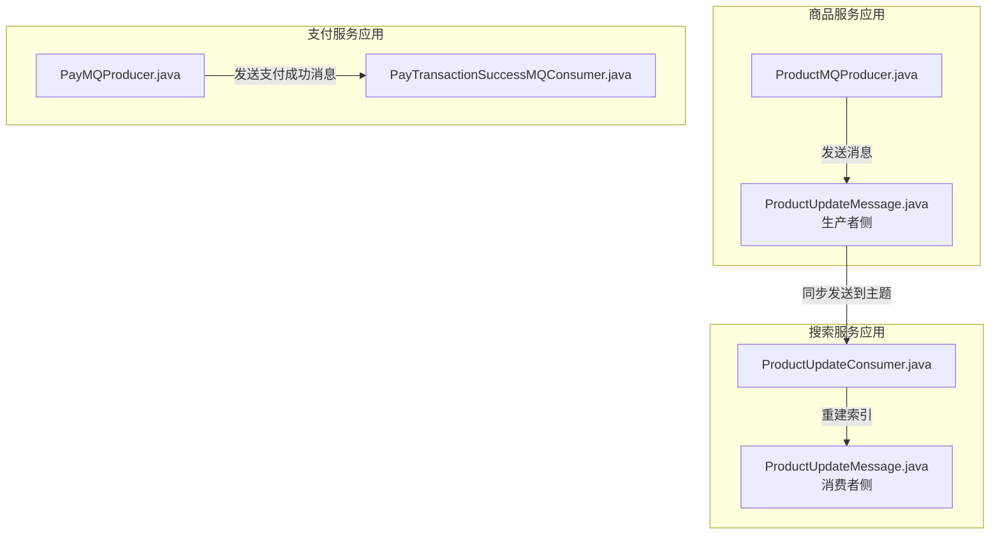
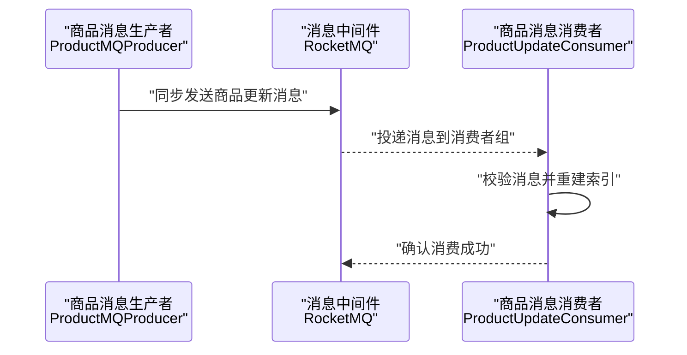
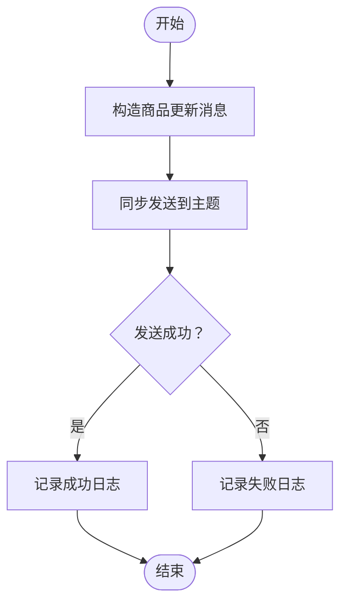
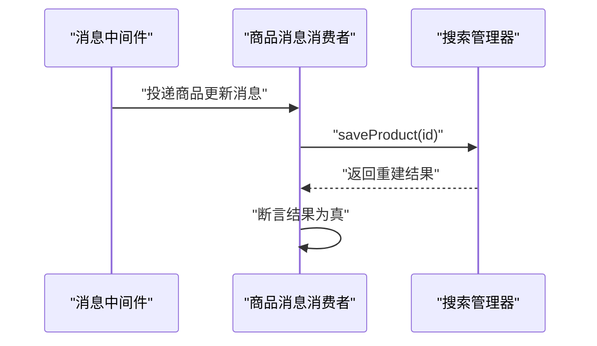
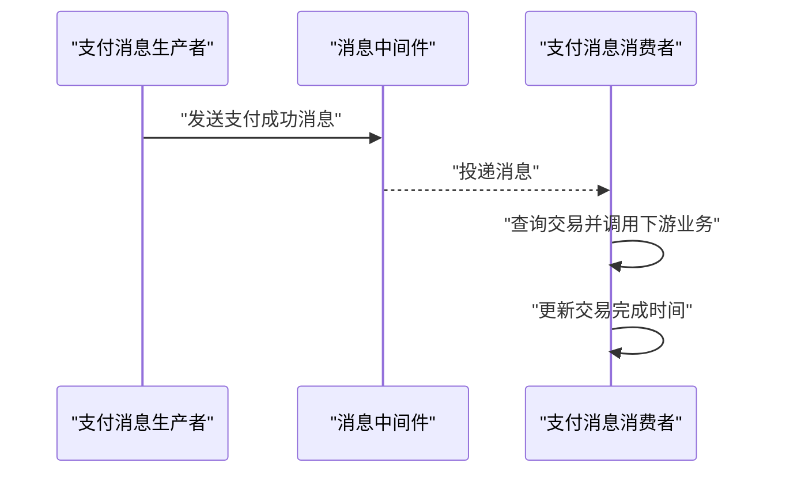
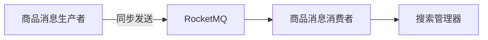

# 商品消息处理场景

<cite>
**本文引用的文件**
- [ProductSpuCollectionMessage.java](file://moved/product/product-service-api/src/main/java/cn/iocoder/mall/product/api/message/ProductSpuCollectionMessage.java)
- [ProductUpdateMessage.java（生产者侧）](file://product-service-project/product-service-app/src/main/java/cn/iocoder/mall/productservice/mq/producer/message/ProductUpdateMessage.java)
- [ProductUpdateMessage.java（消费者侧）](file://search-service-project/search-service-app/src/main/java/cn/iocoder/mall/searchservice/mq/consumer/message/ProductUpdateMessage.java)
- [ProductMQProducer.java](file://product-service-project/product-service-app/src/main/java/cn/iocoder/mall/productservice/mq/producer/ProductMQProducer.java)
- [ProductUpdateConsumer.java](file://search-service-project/search-service-app/src/main/java/cn/iocoder/mall/searchservice/mq/consumer/ProductUpdateConsumer.java)
- [PayTransactionSuccessMQConsumer.java](file://pay-service-project/pay-service-app/src/main/java/cn/iocoder/mall/payservice/mq/consumer/PayTransactionSuccessMQConsumer.java)
- [PayMQProducer.java](file://pay-service-project/pay-service-app/src/main/java/cn/iocoder/mall/payservice/mq/producer/PayMQProducer.java)
</cite>

## 目录
1. [简介](#简介)
2. [项目结构](#项目结构)
3. [核心组件](#核心组件)
4. [架构总览](#架构总览)
5. [详细组件分析](#详细组件分析)
6. [依赖关系分析](#依赖关系分析)
7. [性能考量](#性能考量)
8. [故障排查指南](#故障排查指南)
9. [结论](#结论)
10. [附录](#附录)

## 简介
本文件聚焦于商品服务在消息驱动架构下的处理场景，围绕“商品信息更新”“库存变更”“促销活动”等主题，系统梳理消息的生产者与消费者实现、异步处理机制（如商品数据同步、搜索引擎索引重建、缓存刷新）、幂等性设计、分区与负载均衡策略、性能优化（批量、延迟、合并）以及监控与故障恢复建议。本文以仓库中已存在的消息模型与组件为依据，结合通用实践给出可落地的设计与实施建议。

## 项目结构
本项目采用多模块微服务架构，商品消息处理涉及以下模块：
- 商品服务应用：负责生成商品相关消息（如商品更新）
- 搜索服务应用：作为消费者，接收并处理商品更新消息，重建搜索引擎索引
- 支付服务应用：作为生产者与消费者，负责支付成功后的通知与后续业务联动

图表来源
- [ProductMQProducer.java:1-31](file://product-service-project/product-service-app/src/main/java/cn/iocoder/mall/productservice/mq/producer/ProductMQProducer.java#L1-L31)
- [ProductUpdateMessage.java（生产者侧）:1-21](file://product-service-project/product-service-app/src/main/java/cn/iocoder/mall/productservice/mq/producer/message/ProductUpdateMessage.java#L1-L21)
- [ProductUpdateConsumer.java:1-31](file://search-service-project/search-service-app/src/main/java/cn/iocoder/mall/searchservice/mq/consumer/ProductUpdateConsumer.java#L1-L31)
- [ProductUpdateMessage.java（消费者侧）:1-21](file://search-service-project/search-service-app/src/main/java/cn/iocoder/mall/searchservice/mq/consumer/message/ProductUpdateMessage.java#L1-L21)
- [PayMQProducer.java:1-44](file://pay-service-project/pay-service-app/src/main/java/cn/iocoder/mall/payservice/mq/producer/PayMQProducer.java#L1-L44)
- [PayTransactionSuccessMQConsumer.java:1-54](file://pay-service-project/pay-service-app/src/main/java/cn/iocoder/mall/payservice/mq/consumer/PayTransactionSuccessMQConsumer.java#L1-L54)

章节来源
- [ProductMQProducer.java:1-31](file://product-service-project/product-service-app/src/main/java/cn/iocoder/mall/productservice/mq/producer/ProductMQProducer.java#L1-L31)
- [ProductUpdateConsumer.java:1-31](file://search-service-project/search-service-app/src/main/java/cn/iocoder/mall/searchservice/mq/consumer/ProductUpdateConsumer.java#L1-L31)
- [PayMQProducer.java:1-44](file://pay-service-project/pay-service-app/src/main/java/cn/iocoder/mall/payservice/mq/producer/PayMQProducer.java#L1-L44)
- [PayTransactionSuccessMQConsumer.java:1-54](file://pay-service-project/pay-service-app/src/main/java/cn/iocoder/mall/payservice/mq/consumer/PayTransactionSuccessMQConsumer.java#L1-L54)

## 核心组件
- 商品更新消息模型
  - 生产者侧消息体：包含商品编号，用于触发后续处理链
  - 消费者侧消息体：与生产者一致，确保跨服务传输的契约稳定
- 商品消息生产者
  - 使用 RocketMQTemplate 同步发送消息至指定主题
  - 对发送结果进行校验与日志记录
- 商品消息消费者
  - 监听指定主题与消费者组，接收到消息后重建搜索引擎索引
  - 通过断言保证处理结果的确定性
- 支付成功消息（类比商品场景）
  - 生产者：封装支付成功后的通知消息并发送
  - 消费者：基于消息执行后续业务（如订单状态更新），并在成功后更新交易完成时间

章节来源
- [ProductUpdateMessage.java（生产者侧）:1-21](file://product-service-project/product-service-app/src/main/java/cn/iocoder/mall/productservice/mq/producer/message/ProductUpdateMessage.java#L1-L21)
- [ProductUpdateMessage.java（消费者侧）:1-21](file://search-service-project/search-service-app/src/main/java/cn/iocoder/mall/searchservice/mq/consumer/message/ProductUpdateMessage.java#L1-L21)
- [ProductMQProducer.java:1-31](file://product-service-project/product-service-app/src/main/java/cn/iocoder/mall/productservice/mq/producer/ProductMQProducer.java#L1-L31)
- [ProductUpdateConsumer.java:1-31](file://search-service-project/search-service-app/src/main/java/cn/iocoder/mall/searchservice/mq/consumer/ProductUpdateConsumer.java#L1-L31)
- [PayMQProducer.java:1-44](file://pay-service-project/pay-service-app/src/main/java/cn/iocoder/mall/payservice/mq/producer/PayMQProducer.java#L1-L44)
- [PayTransactionSuccessMQConsumer.java:1-54](file://pay-service-project/pay-service-app/src/main/java/cn/iocoder/mall/payservice/mq/consumer/PayTransactionSuccessMQConsumer.java#L1-L54)

## 架构总览
商品消息处理采用“生产者-主题-消费者”的解耦模式：
- 生产者将商品变更事件发布到 RocketMQ 主题
- 消费者订阅主题并执行对应动作（如重建搜索引擎索引）
- 通过消费者组实现水平扩展与负载均衡
- 通过幂等性设计保障重复消费不会造成副作用

图表来源
- [ProductMQProducer.java:18-28](file://product-service-project/product-service-app/src/main/java/cn/iocoder/mall/productservice/mq/producer/ProductMQProducer.java#L18-L28)
- [ProductUpdateConsumer.java:24-28](file://search-service-project/search-service-app/src/main/java/cn/iocoder/mall/searchservice/mq/consumer/ProductUpdateConsumer.java#L24-L28)

## 详细组件分析

### 商品更新消息模型
- 字段设计
  - 主题常量：统一主题名，便于生产者与消费者约定
  - 商品编号：作为消息载体的核心标识，用于后续处理
- 设计要点
  - 结构简洁，仅承载必要字段，降低序列化与传输成本
  - 与消费者侧模型保持一致，避免跨服务契约不一致

章节来源
- [ProductUpdateMessage.java（生产者侧）:1-21](file://product-service-project/product-service-app/src/main/java/cn/iocoder/mall/productservice/mq/producer/message/ProductUpdateMessage.java#L1-L21)
- [ProductUpdateMessage.java（消费者侧）:1-21](file://search-service-project/search-service-app/src/main/java/cn/iocoder/mall/searchservice/mq/consumer/message/ProductUpdateMessage.java#L1-L21)

### 商品消息生产者
- 职责
  - 接收商品编号，构造消息并同步发送到 RocketMQ
  - 校验发送结果，记录异常与错误日志
- 处理逻辑
  - 同步发送：确保消息落盘后再返回
  - 错误处理：对非成功状态与异常进行日志记录，便于后续重试与定位

图表来源
- [ProductMQProducer.java:18-28](file://product-service-project/product-service-app/src/main/java/cn/iocoder/mall/productservice/mq/producer/ProductMQProducer.java#L18-L28)

章节来源
- [ProductMQProducer.java:1-31](file://product-service-project/product-service-app/src/main/java/cn/iocoder/mall/productservice/mq/producer/ProductMQProducer.java#L1-L31)

### 商品消息消费者
- 职责
  - 订阅商品更新主题，重建搜索引擎索引
  - 通过断言确保处理结果为真，否则抛出异常
- 处理逻辑
  - 接收消息后调用搜索管理器重建索引
  - 断言处理结果，保证索引重建的确定性

图表来源
- [ProductUpdateConsumer.java:24-28](file://search-service-project/search-service-app/src/main/java/cn/iocoder/mall/searchservice/mq/consumer/ProductUpdateConsumer.java#L24-L28)

章节来源
- [ProductUpdateConsumer.java:1-31](file://search-service-project/search-service-app/src/main/java/cn/iocoder/mall/searchservice/mq/consumer/ProductUpdateConsumer.java#L1-L31)

### 支付成功消息（类比场景）
- 生产者
  - 封装支付成功后的通知消息并发送到 RocketMQ
  - 对发送结果进行校验与日志记录
- 消费者
  - 订阅支付成功主题，查询交易并调用下游业务接口
  - 成功后更新交易完成时间，确保状态一致性

图表来源
- [PayMQProducer.java:20-40](file://pay-service-project/pay-service-app/src/main/java/cn/iocoder/mall/payservice/mq/producer/PayMQProducer.java#L20-L40)
- [PayTransactionSuccessMQConsumer.java:28-51](file://pay-service-project/pay-service-app/src/main/java/cn/iocoder/mall/payservice/mq/consumer/PayTransactionSuccessMQConsumer.java#L28-L51)

章节来源
- [PayMQProducer.java:1-44](file://pay-service-project/pay-service-app/src/main/java/cn/iocoder/mall/payservice/mq/producer/PayMQProducer.java#L1-L44)
- [PayTransactionSuccessMQConsumer.java:1-54](file://pay-service-project/pay-service-app/src/main/java/cn/iocoder/mall/payservice/mq/consumer/PayTransactionSuccessMQConsumer.java#L1-L54)

### 商品收藏消息（补充）
- 模型定义
  - 包含 SPU 编号、用户 ID、SPU 名称、图片、卖点、价格、收藏类型等字段
  - 主题常量用于统一路由
- 应用场景
  - 收藏/取消收藏事件可作为商品相关事件的一部分，用于统计、推荐或通知等后续处理

章节来源
- [ProductSpuCollectionMessage.java:1-57](file://moved/product/product-service-api/src/main/java/cn/iocoder/mall/product/api/message/ProductSpuCollectionMessage.java#L1-L57)

## 依赖关系分析
- 组件耦合
  - 生产者与消费者通过主题契约解耦，生产者无需感知消费者实现
  - 消费者通过注解声明订阅关系，简化配置
- 外部依赖
  - RocketMQTemplate 提供同步发送能力
  - 搜索管理器负责索引重建
- 潜在风险
  - 同步发送阻塞线程，需关注发送队列积压
  - 消费端处理失败需具备重试与死信处理策略

图表来源
- [ProductMQProducer.java:18-28](file://product-service-project/product-service-app/src/main/java/cn/iocoder/mall/productservice/mq/producer/ProductMQProducer.java#L18-L28)
- [ProductUpdateConsumer.java:24-28](file://search-service-project/search-service-app/src/main/java/cn/iocoder/mall/searchservice/mq/consumer/ProductUpdateConsumer.java#L24-L28)

章节来源
- [ProductMQProducer.java:1-31](file://product-service-project/product-service-app/src/main/java/cn/iocoder/mall/productservice/mq/producer/ProductMQProducer.java#L1-L31)
- [ProductUpdateConsumer.java:1-31](file://search-service-project/search-service-app/src/main/java/cn/iocoder/mall/searchservice/mq/consumer/ProductUpdateConsumer.java#L1-L31)

## 性能考量
- 批量更新
  - 将多个商品更新事件合并为批量消息，减少网络往返与处理开销
  - 在消费者端按批次处理，提升吞吐
- 延迟消息
  - 对非紧急的索引重建或缓存刷新，使用延迟消息降低峰值压力
- 消息合并
  - 对同一商品的多次更新，合并为一次最终状态，避免重复重建
- 并发与限流
  - 控制消费者并发度，避免搜索或数据库抖动
  - 对发送端进行速率限制，防止 MQ 积压

## 故障排查指南
- 发送失败
  - 检查发送结果状态与异常日志，定位网络或 MQ 配置问题
  - 关注发送超时与队列积压指标
- 消费失败
  - 查看断言与业务异常日志，确认索引重建是否成功
  - 核对消费者组配置与实例数量，避免重复消费或漏消费
- 幂等性验证
  - 对相同消息 ID 的处理进行去重，避免重复索引重建
  - 引入唯一键或版本号，确保重复消息被忽略
- 监控与告警
  - 关注发送失败率、消费延迟、处理耗时、重试次数等指标
  - 设置阈值告警，及时发现异常

## 结论
本项目已具备商品消息处理的基础能力：生产者同步发送、消费者订阅处理、主题契约明确。建议在此基础上进一步完善幂等性、分区与负载均衡、批量与延迟策略，并建立完善的监控与故障恢复机制，以满足高并发与高可靠性的业务需求。

## 附录
- 分区与负载均衡建议
  - 按商品 ID 进行哈希分片，确保同商品消息固定落入同一队列，便于顺序处理与幂等控制
  - 通过消费者组实现多实例水平扩展，提升整体吞吐
- 幂等性设计
  - 基于消息 ID 或业务主键去重，结合本地状态或外部存储记录已处理记录
  - 对于索引重建，可引入版本号或时间戳，避免旧版本覆盖新版本
- 性能优化清单
  - 批量发送与批量处理
  - 延迟消息与消息合并
  - 并发度与限流策略
  - 监控指标与告警阈值