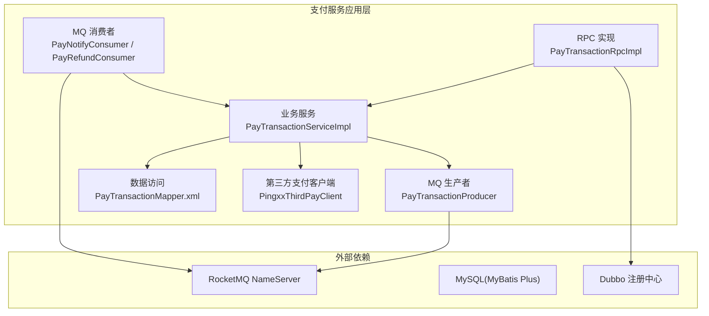
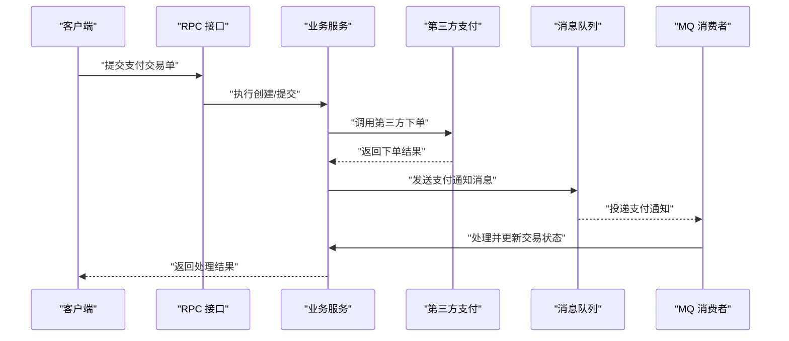
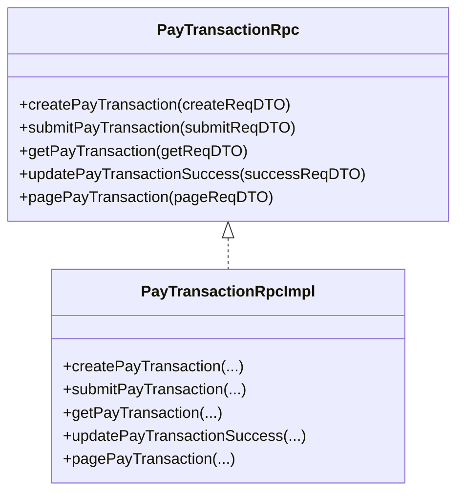
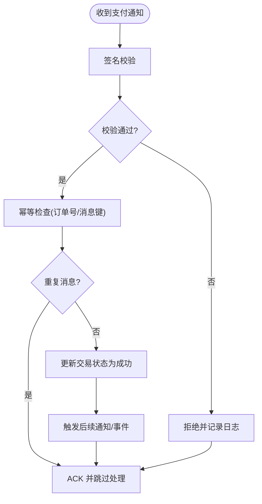
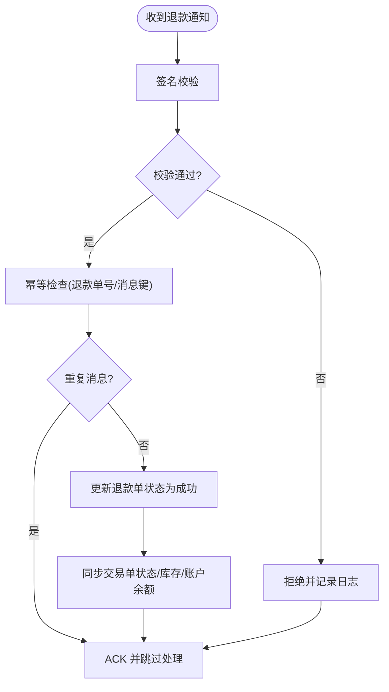
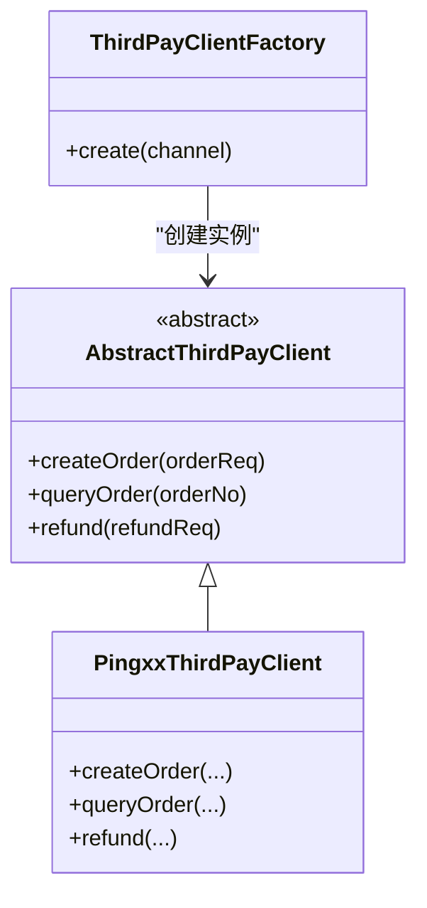
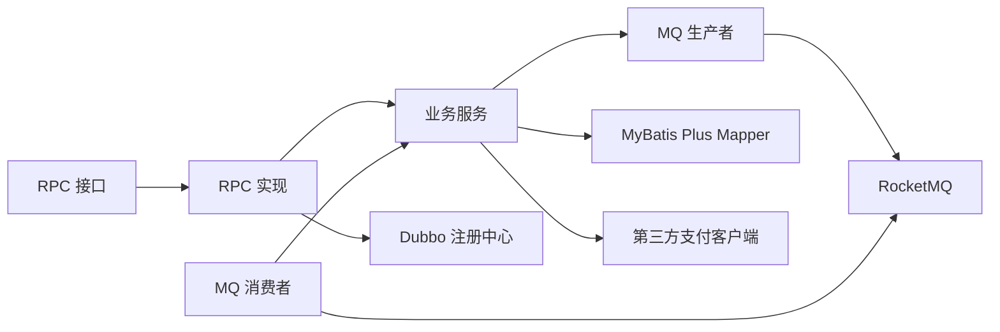

# 支付消息处理场景

<cite>
**本文引用的文件**
- [application.yaml](file://pay-service-project/pay-service-app/src/main/resources/application.yaml)
- [PayTransactionRpc.java](file://pay-service-project/pay-service-api/src/main/java/cn/iocoder/mall/payservice/rpc/transaction/PayTransactionRpc.java)
- [PayTransactionRpcImpl.java](file://pay-service-project/pay-service-app/src/main/java/cn/iocoder/mall/payservice/rpc/transaction/PayTransactionRpcImpl.java)
- [PayTransactionService.java](file://pay-service-project/pay-service-app/src/main/java/cn/iocoder/mall/payservice/service/transaction/PayTransactionService.java)
- [PayTransactionServiceImpl.java](file://pay-service-project/pay-service-app/src/main/java/cn/iocoder/mall/payservice/biz/service/PayTransactionServiceImpl.java)
- [PayNotifyConsumer.java](file://pay-service-project/pay-service-app/src/main/java/cn/iocoder/mall/payservice/mq/consumer/PayNotifyConsumer.java)
- [PayRefundConsumer.java](file://pay-service-project/pay-service-app/src/main/java/cn/iocoder/mall/payservice/mq/consumer/PayRefundConsumer.java)
- [PayTransactionProducer.java](file://pay-service-project/pay-service-app/src/main/java/cn/iocoder/mall/payservice/mq/producer/PayTransactionProducer.java)
- [PayNotifyStatusEnum.java](file://pay-service-project/pay-service-api/src/main/java/cn/iocoder/mall/payservice/enums/notify/PayNotifyStatusEnum.java)
- [PayNotifyType.java](file://pay-service-project/pay-service-api/src/main/java/cn/iocoder/mall/payservice/enums/notify/PayNotifyType.java)
- [PayRefundStatus.java](file://pay-service-project/pay-service-api/src/main/java/cn/iocoder/mall/payservice/enums/refund/PayRefundStatus.java)
- [PayTransactionStatusEnum.java](file://pay-service-project/pay-service-api/src/main/java/cn/iocoder/mall/payservice/enums/transaction/PayTransactionStatusEnum.java)
- [PayChannelEnum.java](file://pay-service-project/pay-service-api/src/main/java/cn/iocoder/mall/payservice/enums/PayChannelEnum.java)
- [PayErrorCodeConstants.java](file://pay-service-project/pay-service-api/src/main/java/cn/iocoder/mall/payservice/enums/PayErrorCodeConstants.java)
- [PayTransactionMapper.xml](file://pay-service-project/pay-service-app/src/main/resources/mapper/PayTransactionMapper.xml)
- [PingxxThirdPayClient.java](file://pay-service-project/pay-service-app/src/main/java/cn/iocoder/mall/payservice/client/thirdpay/PingxxThirdPayClient.java)
- [ThirdPayClientFactory.java](file://pay-service-project/pay-service-app/src/main/java/cn/iocoder/mall/payservice/client/thirdpay/ThirdPayClientFactory.java)
- [AbstractThirdPayClient.java](file://pay-service-project/pay-service-app/src/main/java/cn/iocoder/mall/payservice/client/thirdpay/AbstractThirdPayClient.java)
- [PayTransactionClient.java](file://management-web-app/src/main/java/cn/iocoder/mall/managementweb/client/pay/transaction/PayTransactionClient.java)
- [PayTransactionController.java](file://management-web-app/src/main/java/cn/iocoder/mall/managementweb/controller/pay/PayTransactionController.java)
- [PayTransactionService.java](file://management-web-app/src/main/java/cn/iocoder/mall/managementweb/service/pay/transaction/PayTransactionService.java)
</cite>

## 目录
1. [引言](#引言)
2. [项目结构](#项目结构)
3. [核心组件](#核心组件)
4. [架构总览](#架构总览)
5. [详细组件分析](#详细组件分析)
6. [依赖关系分析](#依赖关系分析)
7. [性能考虑](#性能考虑)
8. [故障排查指南](#故障排查指南)
9. [结论](#结论)
10. [附录](#附录)

## 引言
本文件聚焦于支付服务的消息处理场景，系统化梳理支付交易成功通知与退款成功通知两类关键消息的生产者与消费者实现，阐明支付消息从“发起支付”到“最终确认”的完整生命周期，以及在该流程中如何通过幂等性、重复消费防护、事务消息等手段保障可靠性；同时给出主题设计与路由策略建议、性能优化方案（批量处理、异步通知、错误重试）及监控与异常处理最佳实践。

## 项目结构
- 支付服务采用多模块组织：API 定义层、应用层（含RPC实现、MQ消费者/生产者、业务服务、DAO等）、集成测试层。
- 配置层面通过 YAML 文件集中管理 RocketMQ NameServer 地址、Producer Group、Dubbo 协议与扫描路径、MyBatis Plus Mapper 路径等。
- 业务侧围绕“支付交易单”与“支付通知/退款”两条主线展开，分别由 RPC 接口与 MQ 消费者驱动。

图表来源
- [application.yaml:47-52](file://pay-service-project/pay-service-app/src/main/resources/application.yaml#L47-L52)
- [PayTransactionRpcImpl.java](file://pay-service-project/pay-service-app/src/main/java/cn/iocoder/mall/payservice/rpc/transaction/PayTransactionRpcImpl.java)
- [PayTransactionServiceImpl.java](file://pay-service-project/pay-service-app/src/main/java/cn/iocoder/mall/payservice/biz/service/PayTransactionServiceImpl.java)
- [PayNotifyConsumer.java](file://pay-service-project/pay-service-app/src/main/java/cn/iocoder/mall/payservice/mq/consumer/PayNotifyConsumer.java)
- [PayRefundConsumer.java](file://pay-service-project/pay-service-app/src/main/java/cn/iocoder/mall/payservice/mq/consumer/PayRefundConsumer.java)
- [PayTransactionProducer.java](file://pay-service-project/pay-service-app/src/main/java/cn/iocoder/mall/payservice/mq/producer/PayTransactionProducer.java)
- [PayTransactionMapper.xml](file://pay-service-project/pay-service-app/src/main/resources/mapper/PayTransactionMapper.xml)
- [PingxxThirdPayClient.java](file://pay-service-project/pay-service-app/src/main/java/cn/iocoder/mall/payservice/client/thirdpay/PingxxThirdPayClient.java)

章节来源
- [application.yaml:1-65](file://pay-service-project/pay-service-app/src/main/resources/application.yaml#L1-L65)

## 核心组件
- RPC 接口与实现：定义支付交易单的创建、提交、查询、成功更新与分页查询等能力，并由应用层实现提供具体逻辑。
- MQ 生产者与消费者：负责对外部渠道回调（支付通知）与退款结果的接收与处理。
- 第三方支付客户端：封装与 Ping++ 等渠道的交互细节，统一返回格式。
- 数据访问层：基于 MyBatis Plus 的 Mapper XML，支撑交易单状态变更与持久化。
- 枚举与错误码：统一状态、类型、渠道与错误码，确保跨模块一致性。

章节来源
- [PayTransactionRpc.java:10-52](file://pay-service-project/pay-service-api/src/main/java/cn/iocoder/mall/payservice/rpc/transaction/PayTransactionRpc.java#L10-L52)
- [PayTransactionRpcImpl.java](file://pay-service-project/pay-service-app/src/main/java/cn/iocoder/mall/payservice/rpc/transaction/PayTransactionRpcImpl.java)
- [PayTransactionServiceImpl.java](file://pay-service-project/pay-service-app/src/main/java/cn/iocoder/mall/payservice/biz/service/PayTransactionServiceImpl.java)
- [PayNotifyConsumer.java](file://pay-service-project/pay-service-app/src/main/java/cn/iocoder/mall/payservice/mq/consumer/PayNotifyConsumer.java)
- [PayRefundConsumer.java](file://pay-service-project/pay-service-app/src/main/java/cn/iocoder/mall/payservice/mq/consumer/PayRefundConsumer.java)
- [PayTransactionProducer.java](file://pay-service-project/pay-service-app/src/main/java/cn/iocoder/mall/payservice/mq/producer/PayTransactionProducer.java)
- [PayTransactionMapper.xml](file://pay-service-project/pay-service-app/src/main/resources/mapper/PayTransactionMapper.xml)
- [PingxxThirdPayClient.java](file://pay-service-project/pay-service-app/src/main/java/cn/iocoder/mall/payservice/client/thirdpay/PingxxThirdPayClient.java)

## 架构总览
支付消息处理以 RocketMQ 为核心，贯穿“支付发起—渠道回调—内部确认—下游通知”的全链路。RPC 层负责对外提供能力，业务层负责状态机推进与幂等处理，MQ 层负责异步解耦与可靠投递。

图表来源
- [PayTransactionRpc.java:18-26](file://pay-service-project/pay-service-api/src/main/java/cn/iocoder/mall/payservice/rpc/transaction/PayTransactionRpc.java#L18-L26)
- [PayTransactionRpcImpl.java](file://pay-service-project/pay-service-app/src/main/java/cn/iocoder/mall/payservice/rpc/transaction/PayTransactionRpcImpl.java)
- [PayTransactionServiceImpl.java](file://pay-service-project/pay-service-app/src/main/java/cn/iocoder/mall/payservice/biz/service/PayTransactionServiceImpl.java)
- [PayNotifyConsumer.java](file://pay-service-project/pay-service-app/src/main/java/cn/iocoder/mall/payservice/mq/consumer/PayNotifyConsumer.java)
- [application.yaml:47-52](file://pay-service-project/pay-service-app/src/main/resources/application.yaml#L47-L52)

## 详细组件分析

### 支付交易单 RPC 接口与实现
- 接口职责：创建交易单、提交交易单、查询交易单、标记成功、分页查询。
- 实现要点：在提交时触发第三方支付下单，并在收到渠道回调后通过“更新交易成功”接口完成状态落库与后续处理。

图表来源
- [PayTransactionRpc.java:10-52](file://pay-service-project/pay-service-api/src/main/java/cn/iocoder/mall/payservice/rpc/transaction/PayTransactionRpc.java#L10-L52)
- [PayTransactionRpcImpl.java](file://pay-service-project/pay-service-app/src/main/java/cn/iocoder/mall/payservice/rpc/transaction/PayTransactionRpcImpl.java)

章节来源
- [PayTransactionRpc.java:10-52](file://pay-service-project/pay-service-api/src/main/java/cn/iocoder/mall/payservice/rpc/transaction/PayTransactionRpc.java#L10-L52)
- [PayTransactionRpcImpl.java](file://pay-service-project/pay-service-app/src/main/java/cn/iocoder/mall/payservice/rpc/transaction/PayTransactionRpcImpl.java)

### 支付通知消费者（支付成功通知）
- 职责：接收来自第三方渠道的支付成功回调，进行签名校验、幂等判断与状态更新。
- 关键字段：通知类型、通知状态、渠道标识、订单号等。
- 幂等策略：依据订单号或消息唯一键进行去重，避免重复入账。

图表来源
- [PayNotifyConsumer.java](file://pay-service-project/pay-service-app/src/main/java/cn/iocoder/mall/payservice/mq/consumer/PayNotifyConsumer.java)
- [PayNotifyStatusEnum.java](file://pay-service-project/pay-service-api/src/main/java/cn/iocoder/mall/payservice/enums/notify/PayNotifyStatusEnum.java)
- [PayNotifyType.java](file://pay-service-project/pay-service-api/src/main/java/cn/iocoder/mall/payservice/enums/notify/PayNotifyType.java)

章节来源
- [PayNotifyConsumer.java](file://pay-service-project/pay-service-app/src/main/java/cn/iocoder/mall/payservice/mq/consumer/PayNotifyConsumer.java)
- [PayNotifyStatusEnum.java](file://pay-service-project/pay-service-api/src/main/java/cn/iocoder/mall/payservice/enums/notify/PayNotifyStatusEnum.java)
- [PayNotifyType.java](file://pay-service-project/pay-service-api/src/main/java/cn/iocoder/mall/payservice/enums/notify/PayNotifyType.java)

### 退款通知消费者（退款成功通知）
- 职责：接收第三方渠道的退款成功回调，进行签名校验与幂等处理，随后更新退款单状态并联动交易单状态。
- 关键字段：退款单号、退款状态、渠道标识、原交易单号等。

图表来源
- [PayRefundConsumer.java](file://pay-service-project/pay-service-app/src/main/java/cn/iocoder/mall/payservice/mq/consumer/PayRefundConsumer.java)
- [PayRefundStatus.java](file://pay-service-project/pay-service-api/src/main/java/cn/iocoder/mall/payservice/enums/refund/PayRefundStatus.java)

章节来源
- [PayRefundConsumer.java](file://pay-service-project/pay-service-app/src/main/java/cn/iocoder/mall/payservice/mq/consumer/PayRefundConsumer.java)
- [PayRefundStatus.java](file://pay-service-project/pay-service-api/src/main/java/cn/iocoder/mall/payservice/enums/refund/PayRefundStatus.java)

### 第三方支付客户端与渠道适配
- 统一封装：抽象出第三方支付客户端基类，具体渠道（如 Pingxx）实现差异化逻辑。
- 工厂模式：根据支付渠道枚举选择合适的客户端实例，便于扩展与维护。

图表来源
- [AbstractThirdPayClient.java](file://pay-service-project/pay-service-app/src/main/java/cn/iocoder/mall/payservice/client/thirdpay/AbstractThirdPayClient.java)
- [PingxxThirdPayClient.java](file://pay-service-project/pay-service-app/src/main/java/cn/iocoder/mall/payservice/client/thirdpay/PingxxThirdPayClient.java)
- [ThirdPayClientFactory.java](file://pay-service-project/pay-service-app/src/main/java/cn/iocoder/mall/payservice/client/thirdpay/ThirdPayClientFactory.java)

章节来源
- [AbstractThirdPayClient.java](file://pay-service-project/pay-service-app/src/main/java/cn/iocoder/mall/payservice/client/thirdpay/AbstractThirdPayClient.java)
- [PingxxThirdPayClient.java](file://pay-service-project/pay-service-app/src/main/java/cn/iocoder/mall/payservice/client/thirdpay/PingxxThirdPayClient.java)
- [ThirdPayClientFactory.java](file://pay-service-project/pay-service-app/src/main/java/cn/iocoder/mall/payservice/client/thirdpay/ThirdPayClientFactory.java)

### 支付消息生产者（待补充）
- 职责：在业务流程中生成支付通知/退款通知消息，投递至 RocketMQ。
- 建议：消息体包含必要字段（订单号、金额、时间戳、签名源串、渠道标识），并设置重试与死信策略。

章节来源
- [PayTransactionProducer.java](file://pay-service-project/pay-service-app/src/main/java/cn/iocoder/mall/payservice/mq/producer/PayTransactionProducer.java)

### 支付交易单业务服务
- 职责：协调 RPC 调用、第三方支付交互、MQ 消息发送与状态更新。
- 关键流程：提交交易单 -> 发送支付通知消息 -> 接收回调 -> 幂等处理 -> 更新状态 -> 触发后续动作。

章节来源
- [PayTransactionService.java](file://pay-service-project/pay-service-app/src/main/java/cn/iocoder/mall/payservice/service/transaction/PayTransactionService.java)
- [PayTransactionServiceImpl.java](file://pay-service-project/pay-service-app/src/main/java/cn/iocoder/mall/payservice/biz/service/PayTransactionServiceImpl.java)

### 状态与枚举
- 交易单状态：用于标识交易单所处阶段（如未支付、支付中、已支付、已关闭等）。
- 通知状态：用于标识通知处理阶段（如未处理、处理中、已完成、失败等）。
- 退款状态：用于标识退款单所处阶段（如退款中、已退款、退款失败等）。
- 渠道枚举：用于区分不同支付渠道，便于路由与隔离。

章节来源
- [PayTransactionStatusEnum.java](file://pay-service-project/pay-service-api/src/main/java/cn/iocoder/mall/payservice/enums/transaction/PayTransactionStatusEnum.java)
- [PayNotifyStatusEnum.java](file://pay-service-project/pay-service-api/src/main/java/cn/iocoder/mall/payservice/enums/notify/PayNotifyStatusEnum.java)
- [PayRefundStatus.java](file://pay-service-project/pay-service-api/src/main/java/cn/iocoder/mall/payservice/enums/refund/PayRefundStatus.java)
- [PayChannelEnum.java](file://pay-service-project/pay-service-api/src/main/java/cn/iocoder/mall/payservice/enums/PayChannelEnum.java)

## 依赖关系分析
- 外部依赖：RocketMQ NameServer、MySQL、Dubbo 注册中心。
- 内部依赖：RPC 接口与实现、业务服务、MQ 消费者、DAO、第三方支付客户端。
- 配置依赖：application.yaml 中的 RocketMQ Producer Group、NameServer 地址、Dubbo 扫描路径等。

图表来源
- [application.yaml:47-52](file://pay-service-project/pay-service-app/src/main/resources/application.yaml#L47-L52)
- [PayTransactionRpcImpl.java](file://pay-service-project/pay-service-app/src/main/java/cn/iocoder/mall/payservice/rpc/transaction/PayTransactionRpcImpl.java)
- [PayTransactionServiceImpl.java](file://pay-service-project/pay-service-app/src/main/java/cn/iocoder/mall/payservice/biz/service/PayTransactionServiceImpl.java)
- [PayNotifyConsumer.java](file://pay-service-project/pay-service-app/src/main/java/cn/iocoder/mall/payservice/mq/consumer/PayNotifyConsumer.java)
- [PayRefundConsumer.java](file://pay-service-project/pay-service-app/src/main/java/cn/iocoder/mall/payservice/mq/consumer/PayRefundConsumer.java)
- [PayTransactionMapper.xml](file://pay-service-project/pay-service-app/src/main/resources/mapper/PayTransactionMapper.xml)
- [PingxxThirdPayClient.java](file://pay-service-project/pay-service-app/src/main/java/cn/iocoder/mall/payservice/client/thirdpay/PingxxThirdPayClient.java)

章节来源
- [application.yaml:47-52](file://pay-service-project/pay-service-app/src/main/resources/application.yaml#L47-L52)

## 性能考虑
- 批量处理：对同一渠道的多个通知可按订单号聚合，减少数据库写入次数与网络往返。
- 异步通知：在提交支付时立即返回，后续通过 MQ 异步推送通知，降低请求延迟。
- 错误重试：对 MQ 消费失败的消息进行指数退避重试，超过阈值进入死信队列。
- 并发控制：消费者线程池大小与分区数匹配，避免过度并发导致抖动。
- 缓存与去重：利用缓存记录已处理的消息键，结合数据库幂等表实现双重保障。
- 监控与告警：埋点统计消息积压、处理耗时、重试次数、失败率等指标。

## 故障排查指南
- 回调未达：检查 RocketMQ NameServer 地址与 Producer Group 配置是否正确。
- 重复消费：确认幂等键（订单号/退款单号）是否唯一且持久化；核对去重缓存是否生效。
- 签名失败：核对渠道签名算法与参数顺序，确保与第三方约定一致。
- 状态不一致：检查业务服务的状态机推进逻辑与数据库事务边界，避免半更新。
- 错误码定位：参考支付错误码常量类，快速定位问题类型与修复方向。

章节来源
- [application.yaml:47-52](file://pay-service-project/pay-service-app/src/main/resources/application.yaml#L47-L52)
- [PayErrorCodeConstants.java](file://pay-service-project/pay-service-api/src/main/java/cn/iocoder/mall/payservice/enums/PayErrorCodeConstants.java)

## 结论
通过 RPC 与 MQ 的协同、第三方支付客户端的抽象与工厂化、完善的幂等与重试机制，支付服务实现了从“发起支付”到“最终确认”的高可靠消息流转。配合合理的主题设计与路由策略、性能优化与监控告警，可在高并发场景下保持稳定与可观测性。

## 附录
- 管理端对接：管理端通过 RPC 客户端与控制器访问支付交易单相关能力，便于人工干预与查询。

章节来源
- [PayTransactionClient.java](file://management-web-app/src/main/java/cn/iocoder/mall/managementweb/client/pay/transaction/PayTransactionClient.java)
- [PayTransactionController.java](file://management-web-app/src/main/java/cn/iocoder/mall/managementweb/controller/pay/PayTransactionController.java)
- [PayTransactionService.java](file://management-web-app/src/main/java/cn/iocoder/mall/managementweb/service/pay/transaction/PayTransactionService.java)