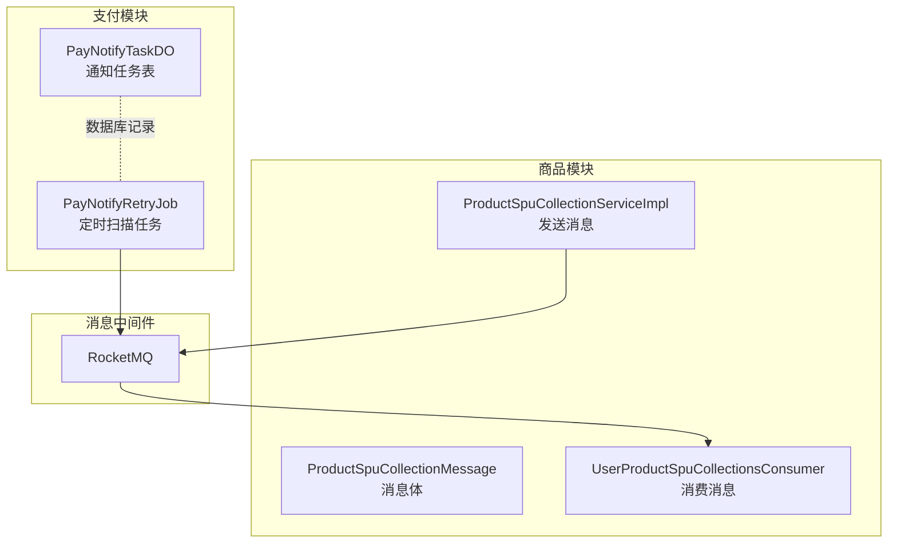
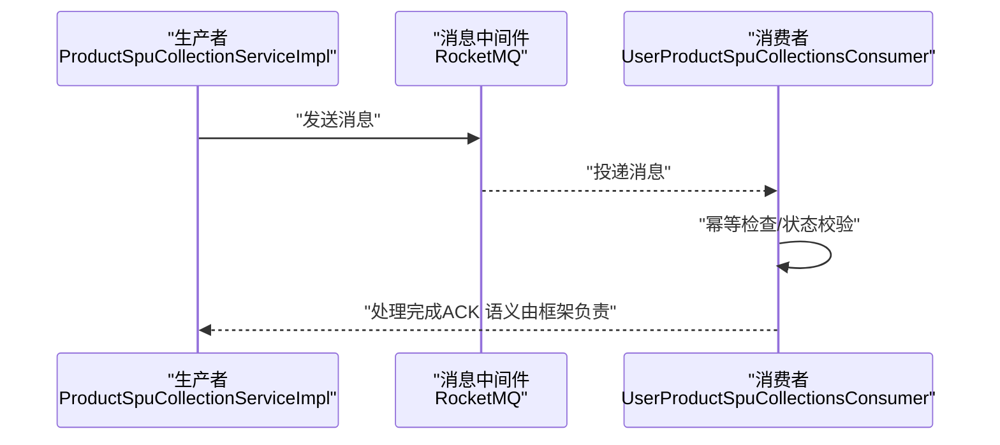
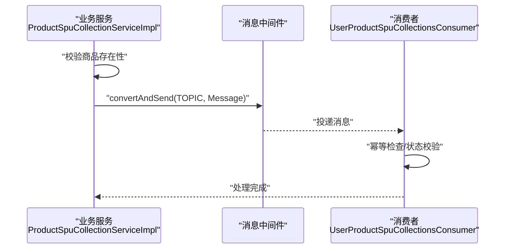
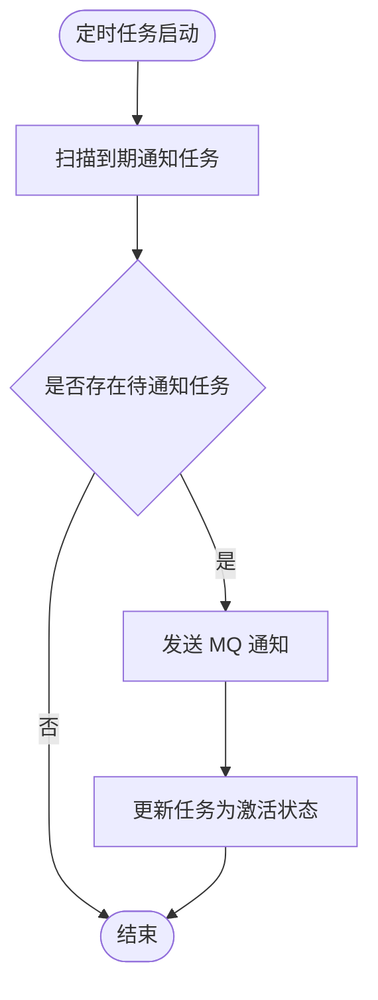
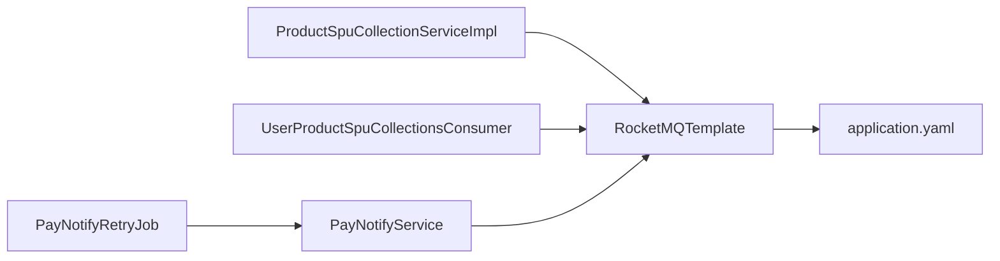

# 消息可靠性保障机制

<cite>
**本文引用的文件**
- [UserProductSpuCollectionsConsumer.java](file://moved/product/moved/product-service-impl/src/main/java/cn/iocoder/mall/product/message/UserProductSpuCollectionsConsumer.java)
- [ProductSpuCollectionServiceImpl.java](file://moved/product/moved/product-service-impl/src/main/java/cn/iocoder/mall/product/service/ProductSpuCollectionServiceImpl.java)
- [ProductSpuCollectionMessage.java](file://moved/product/moved/product-service-api/src/main/java/cn/iocoder/mall/product/api/message/ProductSpuCollectionMessage.java)
- [MQConstants.java（订单 Biz）](file://moved/order/order-biz-api/src/main/java/cn/iocoder/mall/order/biz/enums/order/MQConstants.java)
- [MQConstants.java（订单 API02）](file://moved/order/order-service-api02/src/main/java/cn/iocoder/mall/order/api/constant/MQConstants.java)
- [PayNotifyRetryJob.java](file://pay-service-project/pay-service-app/src/main/java/cn/iocoder/mall/payservice/job/notify/PayNotifyRetryJob.java)
- [PayNotifyTaskDO.java](file://pay-service-project/pay-service-app/src/main/java/cn/iocoder/mall/payservice/dal/mysql/dataobject/notify/PayNotifyTaskDO.java)
- [application.yaml](file://pay-service-project/pay-service-app/src/main/resources/application.yaml)
</cite>

## 目录
1. [引言](#引言)
2. [项目结构](#项目结构)
3. [核心组件](#核心组件)
4. [架构总览](#架构总览)
5. [详细组件分析](#详细组件分析)
6. [依赖关系分析](#依赖关系分析)
7. [性能考量](#性能考量)
8. [故障排查指南](#故障排查指南)
9. [结论](#结论)
10. [附录](#附录)

## 引言
本文件围绕消息可靠性保障机制展开，结合仓库中已实现的 RocketMQ 使用实践，系统梳理 ACK 机制、重试策略、死信队列（概念性说明）、幂等性设计、顺序性保证、超时与异常恢复、监控与告警、测试与验证方法，并给出常见问题的诊断与解决方案。需要特别说明的是：当前代码库中未直接出现“死信队列”和“延迟消息”的显式实现；但通过“基于定时任务扫描+MQ重发”的方式实现了延迟通知能力，从而在业务层面达到与延迟消息相近的效果。

## 项目结构
本项目采用多模块微服务架构，消息相关能力主要分布在以下模块：
- 订单模块：定义 MQ 常量（用于订阅主题）
- 商品模块：生产者发送消息、消费者接收并处理
- 支付模块：通过定时任务扫描待通知任务，再通过 MQ 重发，实现延迟通知

图示来源
- [ProductSpuCollectionServiceImpl.java:34-63](file://moved/product/moved/product-service-impl/src/main/java/cn/iocoder/mall/product/service/ProductSpuCollectionServiceImpl.java#L34-L63)
- [UserProductSpuCollectionsConsumer.java:40-55](file://moved/product/moved/product-service-impl/src/main/java/cn/iocoder/mall/product/message/UserProductSpuCollectionsConsumer.java#L40-L55)
- [PayNotifyRetryJob.java:33-49](file://pay-service-project/pay-service-app/src/main/java/cn/iocoder/mall/payservice/job/notify/PayNotifyRetryJob.java#L33-L49)
- [PayNotifyTaskDO.java:22-94](file://pay-service-project/pay-service-app/src/main/java/cn/iocoder/mall/payservice/dal/mysql/dataobject/notify/PayNotifyTaskDO.java#L22-L94)

章节来源
- [ProductSpuCollectionServiceImpl.java:18-65](file://moved/product/moved/product-service-impl/src/main/java/cn/iocoder/mall/product/service/ProductSpuCollectionServiceImpl.java#L18-L65)
- [UserProductSpuCollectionsConsumer.java:23-126](file://moved/product/moved/product-service-impl/src/main/java/cn/iocoder/mall/product/message/UserProductSpuCollectionsConsumer.java#L23-L126)
- [PayNotifyRetryJob.java:15-52](file://pay-service-project/pay-service-app/src/main/java/cn/iocoder/mall/payservice/job/notify/PayNotifyRetryJob.java#L15-L52)
- [PayNotifyTaskDO.java:17-141](file://pay-service-project/pay-service-app/src/main/java/cn/iocoder/mall/payservice/dal/mysql/dataobject/notify/PayNotifyTaskDO.java#L17-L141)

## 核心组件
- 消息生产者：商品模块在业务完成后，构造消息并调用 RocketMQTemplate 发送
- 消息消费者：商品模块的消费者监听指定 Topic，完成本地幂等处理
- 定时重试任务：支付模块通过扫描数据库中“待通知任务”，在满足时间条件时发送 MQ，实现延迟通知
- MQ 配置：支付模块在配置文件中声明 NameServer 地址与生产者分组

章节来源
- [ProductSpuCollectionServiceImpl.java:34-63](file://moved/product/moved/product-service-impl/src/main/java/cn/iocoder/mall/product/service/ProductSpuCollectionServiceImpl.java#L34-L63)
- [UserProductSpuCollectionsConsumer.java:40-55](file://moved/product/moved/product-service-impl/src/main/java/cn/iocoder/mall/product/message/UserProductSpuCollectionsConsumer.java#L40-L55)
- [PayNotifyRetryJob.java:33-49](file://pay-service-project/pay-service-app/src/main/java/cn/iocoder/mall/payservice/job/notify/PayNotifyRetryJob.java#L33-L49)
- [application.yaml:47-52](file://pay-service-project/pay-service-app/src/main/resources/application.yaml#L47-L52)

## 架构总览
消息从生产者发出，经由 RocketMQ 到达消费者；对于需要延迟通知的场景，支付模块通过定时任务扫描数据库中的通知计划，再通过 MQ 触发最终通知，形成“数据库计划 + MQ 触发”的可靠通知链路。

图示来源
- [ProductSpuCollectionServiceImpl.java:51-63](file://moved/product/moved/product-service-impl/src/main/java/cn/iocoder/mall/product/service/ProductSpuCollectionServiceImpl.java#L51-L63)
- [UserProductSpuCollectionsConsumer.java:40-55](file://moved/product/moved/product-service-impl/src/main/java/cn/iocoder/mall/product/message/UserProductSpuCollectionsConsumer.java#L40-L55)

## 详细组件分析

### 组件一：消息生产与消费（商品收藏）
- 生产侧：在业务完成后构造消息对象并发送，确保消息内容包含足够的上下文信息（如用户 ID、SPU ID、收藏类型等），便于消费者幂等处理
- 消费侧：监听指定 Topic，进行用户存在性校验、收藏/取消收藏的幂等处理（若已存在则更新状态，不存在则新增）

图示来源
- [ProductSpuCollectionServiceImpl.java:34-63](file://moved/product/moved/product-service-impl/src/main/java/cn/iocoder/mall/product/service/ProductSpuCollectionServiceImpl.java#L34-L63)
- [UserProductSpuCollectionsConsumer.java:40-55](file://moved/product/moved/product-service-impl/src/main/java/cn/iocoder/mall/product/message/UserProductSpuCollectionsConsumer.java#L40-L55)

章节来源
- [ProductSpuCollectionServiceImpl.java:18-65](file://moved/product/moved/product-service-impl/src/main/java/cn/iocoder/mall/product/service/ProductSpuCollectionServiceImpl.java#L18-L65)
- [UserProductSpuCollectionsConsumer.java:23-126](file://moved/product/moved/product-service-impl/src/main/java/cn/iocoder/mall/product/message/UserProductSpuCollectionsConsumer.java#L23-L126)
- [ProductSpuCollectionMessage.java](file://moved/product/moved/product-service-api/src/main/java/cn/iocoder/mall/product/api/message/ProductSpuCollectionMessage.java)

### 组件二：延迟通知与重试（支付通知）
- 设计思路：由于 RocketMQ 不支持指定时间的延迟消息，采用“数据库计划 + 定时任务扫描 + MQ 重发”的组合方案
- 关键点：
  - 数据库记录通知计划（含下次通知时间、通知次数、最大次数、是否激活等）
  - 定时任务按时间窗口扫描到期任务，发送 MQ
  - MQ 消费端幂等处理，避免重复通知
  - 通过“激活标记 + 乐观锁字段”避免并发重复执行

图示来源
- [PayNotifyRetryJob.java:33-49](file://pay-service-project/pay-service-app/src/main/java/cn/iocoder/mall/payservice/job/notify/PayNotifyRetryJob.java#L33-L49)
- [PayNotifyTaskDO.java:22-94](file://pay-service-project/pay-service-app/src/main/java/cn/iocoder/mall/payservice/dal/mysql/dataobject/notify/PayNotifyTaskDO.java#L22-L94)

章节来源
- [PayNotifyRetryJob.java:15-52](file://pay-service-project/pay-service-app/src/main/java/cn/iocoder/mall/payservice/job/notify/PayNotifyRetryJob.java#L15-L52)
- [PayNotifyTaskDO.java:17-141](file://pay-service-project/pay-service-app/src/main/java/cn/iocoder/mall/payservice/dal/mysql/dataobject/notify/PayNotifyTaskDO.java#L17-L141)

### 组件三：ACK 与重试策略
- ACK 机制：消费者实现 RocketMQListener 接口，当 onMessage 正常返回时，框架认为消息消费成功并提交偏移量；若抛出异常，框架将根据配置进行重试
- 重试策略：当前代码未显式配置重试参数，建议在生产环境中明确设置最大重试次数、重试间隔、死信队列等，以避免无限重试导致资源浪费
- 补偿机制：对关键业务（如支付通知）采用“数据库计划 + 定时任务 + MQ 重发”的补偿链路，降低因 MQ 不支持精确延迟而带来的风险

章节来源
- [UserProductSpuCollectionsConsumer.java:40-55](file://moved/product/moved/product-service-impl/src/main/java/cn/iocoder/mall/product/message/UserProductSpuCollectionsConsumer.java#L40-L55)
- [application.yaml:47-52](file://pay-service-project/pay-service-app/src/main/resources/application.yaml#L47-L52)

### 组件四：幂等性设计与实现
- 去重标识：消息体中包含业务主键（如用户 ID + SPU ID），消费者据此进行幂等判断
- 状态检查：在执行收藏/取消收藏前，查询当前状态，避免重复写入或错误更新
- 补偿机制：通过定时任务扫描数据库计划，再次发送 MQ 进行补偿，确保最终一致性

章节来源
- [UserProductSpuCollectionsConsumer.java:63-87](file://moved/product/moved/product-service-impl/src/main/java/cn/iocoder/mall/product/message/UserProductSpuCollectionsConsumer.java#L63-L87)
- [UserProductSpuCollectionsConsumer.java:95-110](file://moved/product/moved/product-service-impl/src/main/java/cn/iocoder/mall/product/message/UserProductSpuCollectionsConsumer.java#L95-L110)
- [PayNotifyRetryJob.java:33-49](file://pay-service-project/pay-service-app/src/main/java/cn/iocoder/mall/payservice/job/notify/PayNotifyRetryJob.java#L33-L49)

### 组件五：顺序性保证与乱序处理
- 单分区消息：通过将同一业务主键（如用户 ID）映射到同一队列，可利用 RocketMQ 的分区有序特性实现强顺序
- 有序消息队列：在需要严格顺序的场景，可启用有序消息模式，但需权衡吞吐与延迟
- 乱序处理：若业务允许，可通过多队列并行提升吞吐；对强一致要求的场景，应采用单队列或有序消息

章节来源
- [ProductSpuCollectionMessage.java](file://moved/product/moved/product-service-api/src/main/java/cn/iocoder/mall/product/api/message/ProductSpuCollectionMessage.java)

### 组件六：超时处理与异常恢复
- 超时检测：对长时间未完成的“待通知任务”，通过数据库字段（如最后执行时间、通知次数）进行判定
- 自动重试：定时任务按固定频率扫描并重发 MQ，直至达到最大次数或成功
- 人工干预：对异常任务提供查询与重试接口，必要时进行人工核对与修复

章节来源
- [PayNotifyTaskDO.java:22-94](file://pay-service-project/pay-service-app/src/main/java/cn/iocoder/mall/payservice/dal/mysql/dataobject/notify/PayNotifyTaskDO.java#L22-L94)
- [PayNotifyRetryJob.java:33-49](file://pay-service-project/pay-service-app/src/main/java/cn/iocoder/mall/payservice/job/notify/PayNotifyRetryJob.java#L33-L49)

## 依赖关系分析
- 商品模块生产者依赖 RocketMQTemplate，消费者依赖注解驱动的监听器
- 支付模块定时任务依赖数据库 Mapper 与服务层，通过 MQTemplate 再次发送消息
- MQ 配置集中于 application.yaml，统一管理 NameServer 与生产者分组

图示来源
- [ProductSpuCollectionServiceImpl.java:31-32](file://moved/product/moved/product-service-impl/src/main/java/cn/iocoder/mall/product/service/ProductSpuCollectionServiceImpl.java#L31-L32)
- [UserProductSpuCollectionsConsumer.java:30-31](file://moved/product/moved/product-service-impl/src/main/java/cn/iocoder/mall/product/message/UserProductSpuCollectionsConsumer.java#L30-L31)
- [PayNotifyRetryJob.java:27-31](file://pay-service-project/pay-service-app/src/main/java/cn/iocoder/mall/payservice/job/notify/PayNotifyRetryJob.java#L27-L31)
- [application.yaml:47-52](file://pay-service-project/pay-service-app/src/main/resources/application.yaml#L47-L52)

章节来源
- [ProductSpuCollectionServiceImpl.java:18-65](file://moved/product/moved/product-service-impl/src/main/java/cn/iocoder/mall/product/service/ProductSpuCollectionServiceImpl.java#L18-L65)
- [UserProductSpuCollectionsConsumer.java:23-126](file://moved/product/moved/product-service-impl/src/main/java/cn/iocoder/mall/product/message/UserProductSpuCollectionsConsumer.java#L23-L126)
- [PayNotifyRetryJob.java:15-52](file://pay-service-project/pay-service-app/src/main/java/cn/iocoder/mall/payservice/job/notify/PayNotifyRetryJob.java#L15-L52)
- [application.yaml:47-52](file://pay-service-project/pay-service-app/src/main/resources/application.yaml#L47-L52)

## 性能考量
- 并发与吞吐：合理设置消费者线程数与队列数量，避免单队列成为瓶颈
- 重试与退避：对失败任务采用指数退避或抖动，防止雪崩效应
- 监控与限流：结合 Actuator 暴露的指标，对消息积压、处理耗时进行限流与扩容
- 序列化开销：消息体尽量精简，避免冗余字段

## 故障排查指南
- 消费失败与堆积
  - 现象：消费延迟上升、堆积告警
  - 排查：检查消费者线程池、磁盘空间、网络连通性；确认是否发生异常回滚
- 重复消费与幂等问题
  - 现象：重复收藏/取消收藏
  - 排查：核对幂等键（用户 ID + SPU ID）是否正确；检查状态查询逻辑
- 延迟通知未触发
  - 现象：支付通知未按时到达下游
  - 排查：确认定时任务是否运行、数据库 nextNotifyTime 是否正确、MQ 是否可用
- 配置问题
  - 现象：无法连接 MQ 或发送失败
  - 排查：核对 application.yaml 中 NameServer 与生产者分组配置

章节来源
- [PayNotifyRetryJob.java:33-49](file://pay-service-project/pay-service-app/src/main/java/cn/iocoder/mall/payservice/job/notify/PayNotifyRetryJob.java#L33-L49)
- [application.yaml:47-52](file://pay-service-project/pay-service-app/src/main/resources/application.yaml#L47-L52)

## 结论
本项目在消息可靠性方面，通过“幂等处理 + 定时任务补偿 + MQ 重发”的组合，有效弥补了 RocketMQ 在延迟消息方面的不足；同时，生产者与消费者的职责清晰、配置集中、易于运维。建议在生产环境进一步完善重试策略、死信队列与监控告警体系，以获得更稳健的可靠性保障。

## 附录
- 订单 MQ 常量（用于订阅主题）
  - [MQConstants.java（订单 Biz）:9-15](file://moved/order/order-biz-api/src/main/java/cn/iocoder/mall/order/biz/enums/order/MQConstants.java#L9-L15)
  - [MQConstants.java（订单 API02）:9-15](file://moved/order/order-service-api02/src/main/java/cn/iocoder/mall/order/api/constant/MQConstants.java#L9-L15)