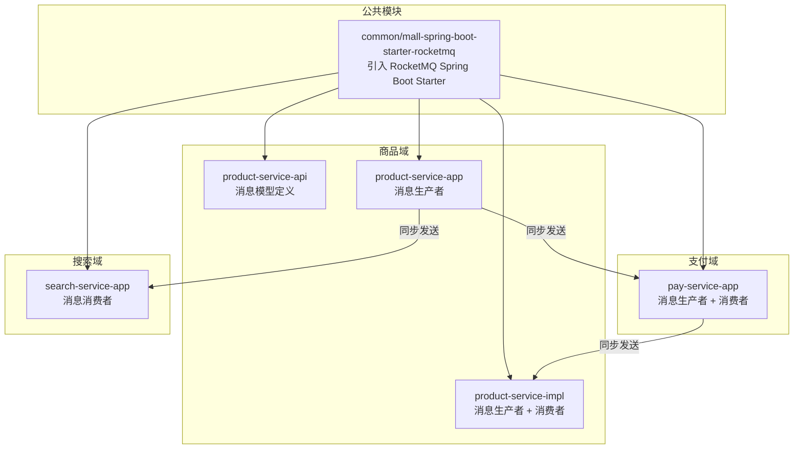
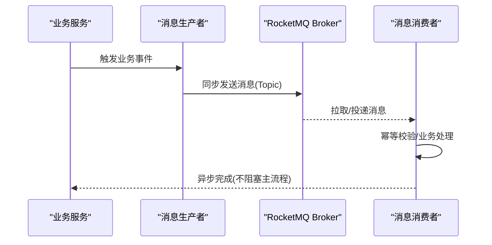
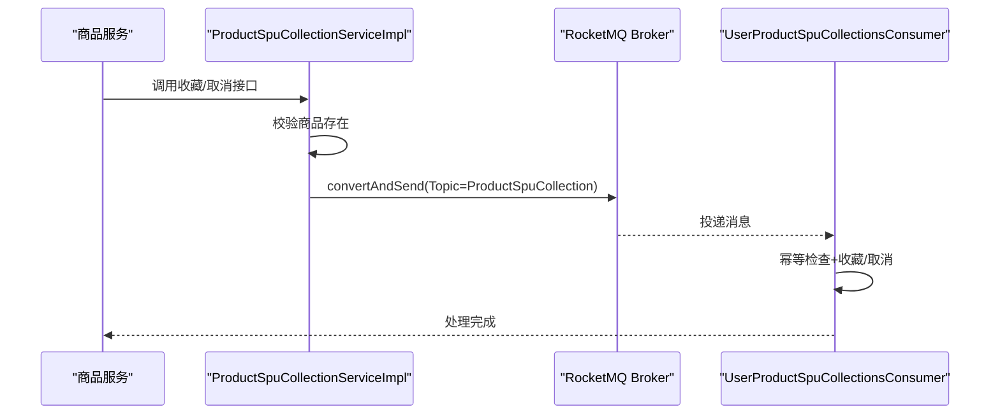
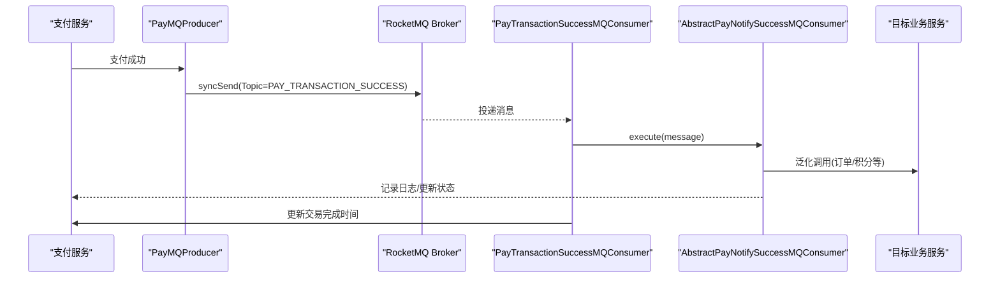
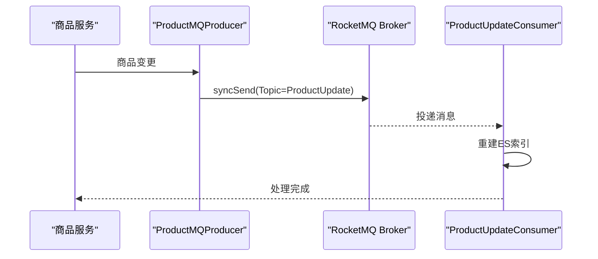
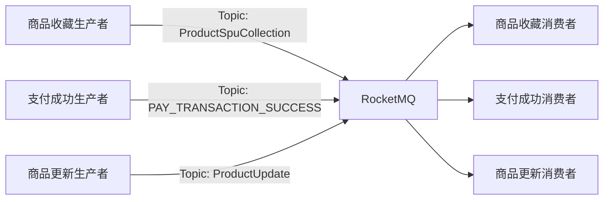

# 消息队列设计

<cite>
**本文引用的文件**
- [common/mall-spring-boot-starter-rocketmq/pom.xml](file://common/mall-spring-boot-starter-rocketmq/pom.xml)
- [moved/product/product-service-api/src/main/java/cn/iocoder/mall/product/api/message/ProductSpuCollectionMessage.java](file://moved/product/product-service-api/src/main/java/cn/iocoder/mall/product/api/message/ProductSpuCollectionMessage.java)
- [moved/product/product-service-impl/src/main/java/cn/iocoder/mall/product/service/ProductSpuCollectionServiceImpl.java](file://moved/product/product-service-impl/src/main/java/cn/iocoder/mall/product/service/ProductSpuCollectionServiceImpl.java)
- [moved/product/product-service-impl/src/main/java/cn/iocoder/mall/product/message/UserProductSpuCollectionsConsumer.java](file://moved/product/product-service-impl/src/main/java/cn/iocoder/mall/product/message/UserProductSpuCollectionsConsumer.java)
- [pay-service-project/pay-service-app/src/main/java/cn/iocoder/mall/payservice/mq/producer/PayMQProducer.java](file://pay-service-project/pay-service-app/src/main/java/cn/iocoder/mall/payservice/mq/producer/PayMQProducer.java)
- [pay-service-project/pay-service-app/src/main/java/cn/iocoder/mall/payservice/mq/consumer/PayTransactionSuccessMQConsumer.java](file://pay-service-project/pay-service-app/src/main/java/cn/iocoder/mall/payservice/mq/consumer/PayTransactionSuccessMQConsumer.java)
- [pay-service-project/pay-service-app/src/main/java/cn/iocoder/mall/payservice/mq/consumer/AbstractPayNotifySuccessMQConsumer.java](file://pay-service-project/pay-service-app/src/main/java/cn/iocoder/mall/payservice/mq/consumer/AbstractPayNotifySuccessMQConsumer.java)
- [pay-service-project/pay-service-app/src/main/java/cn/iocoder/mall/payservice/mq/producer/message/PayTransactionSuccessMessage.java](file://pay-service-project/pay-service-app/src/main/java/cn/iocoder/mall/payservice/mq/producer/message/PayTransactionSuccessMessage.java)
- [product-service-project/product-service-app/src/main/java/cn/iocoder/mall/productservice/mq/producer/ProductMQProducer.java](file://product-service-project/product-service-app/src/main/java/cn/iocoder/mall/productservice/mq/producer/ProductMQProducer.java)
- [product-service-project/product-service-app/src/main/java/cn/iocoder/mall/productservice/mq/producer/message/ProductUpdateMessage.java](file://product-service-project/product-service-app/src/main/java/cn/iocoder/mall/productservice/mq/producer/message/ProductUpdateMessage.java)
- [search-service-project/search-service-app/src/main/java/cn/iocoder/mall/searchservice/mq/consumer/ProductUpdateConsumer.java](file://search-service-project/search-service-app/src/main/java/cn/iocoder/mall/searchservice/mq/consumer/ProductUpdateConsumer.java)
- [search-service-project/search-service-app/src/main/java/cn/iocoder/mall/searchservice/mq/consumer/message/ProductUpdateMessage.java](file://search-service-project/search-service-app/src/main/java/cn/iocoder/mall/searchservice/mq/consumer/message/ProductUpdateMessage.java)
</cite>

## 目录
1. [简介](#简介)
2. [项目结构](#项目结构)
3. [核心组件](#核心组件)
4. [架构总览](#架构总览)
5. [详细组件分析](#详细组件分析)
6. [依赖关系分析](#依赖关系分析)
7. [性能考量](#性能考量)
8. [故障排查指南](#故障排查指南)
9. [结论](#结论)
10. [附录](#附录)

## 简介
本文件面向 Onemall 微服务架构中的消息队列设计，基于 RocketMQ 在各子系统的应用实践，系统性梳理消息生产者与消费者的实现模式、异步处理流程、可靠性保障机制、路由与分区策略、性能优化方案，以及监控与调试方法。重点覆盖以下关键业务场景：
- 订单创建：通过消息触发后续库存锁定、支付回调、物流初始化等异步处理
- 支付通知：支付成功后向下游服务异步通知并重试，确保最终一致
- 商品更新：商品变更后重建搜索索引
- 系统日志：异步写入审计与操作日志，降低主流程阻塞

## 项目结构
Onemall 采用多模块微服务架构，消息队列能力通过公共 Starter 引入，并在各业务模块中以“生产者 + 消费者”的形式落地。

图示来源
- [common/mall-spring-boot-starter-rocketmq/pom.xml:14-19](file://common/mall-spring-boot-starter-rocketmq/pom.xml#L14-L19)
- [moved/product/product-service-api/src/main/java/cn/iocoder/mall/product/api/message/ProductSpuCollectionMessage.java:14-16](file://moved/product/product-service-api/src/main/java/cn/iocoder/mall/product/api/message/ProductSpuCollectionMessage.java#L14-L16)
- [moved/product/product-service-impl/src/main/java/cn/iocoder/mall/product/service/ProductSpuCollectionServiceImpl.java:31-62](file://moved/product/product-service-impl/src/main/java/cn/iocoder/mall/product/service/ProductSpuCollectionServiceImpl.java#L31-L62)
- [moved/product/product-service-impl/src/main/java/cn/iocoder/mall/product/message/UserProductSpuCollectionsConsumer.java:29-31](file://moved/product/product-service-impl/src/main/java/cn/iocoder/mall/product/message/UserProductSpuCollectionsConsumer.java#L29-L31)
- [pay-service-project/pay-service-app/src/main/java/cn/iocoder/mall/payservice/mq/producer/PayMQProducer.java:17-39](file://pay-service-project/pay-service-app/src/main/java/cn/iocoder/mall/payservice/mq/producer/PayMQProducer.java#L17-L39)
- [pay-service-project/pay-service-app/src/main/java/cn/iocoder/mall/payservice/mq/consumer/PayTransactionSuccessMQConsumer.java:17-21](file://pay-service-project/pay-service-app/src/main/java/cn/iocoder/mall/payservice/mq/consumer/PayTransactionSuccessMQConsumer.java#L17-L21)
- [product-service-project/product-service-app/src/main/java/cn/iocoder/mall/productservice/mq/producer/ProductMQProducer.java:15-28](file://product-service-project/product-service-app/src/main/java/cn/iocoder/mall/productservice/mq/producer/ProductMQProducer.java#L15-L28)
- [search-service-project/search-service-app/src/main/java/cn/iocoder/mall/searchservice/mq/consumer/ProductUpdateConsumer.java:14-18](file://search-service-project/search-service-app/src/main/java/cn/iocoder/mall/searchservice/mq/consumer/ProductUpdateConsumer.java#L14-L18)

章节来源
- [common/mall-spring-boot-starter-rocketmq/pom.xml:14-19](file://common/mall-spring-boot-starter-rocketmq/pom.xml#L14-L19)

## 核心组件
- 公共依赖：通过公共 Starter 引入 RocketMQ Spring Boot Starter，统一版本与自动装配。
- 消息模型：各模块在 API 层定义消息体，明确 Topic 常量与字段语义。
- 生产者：在业务逻辑完成后，使用 RocketMQTemplate 同步发送消息，确保消息落盘后再返回。
- 消费者：通过注解声明监听 Topic 与消费者组，实现幂等处理与异常重试。

章节来源
- [moved/product/product-service-api/src/main/java/cn/iocoder/mall/product/api/message/ProductSpuCollectionMessage.java:14-56](file://moved/product/product-service-api/src/main/java/cn/iocoder/mall/product/api/message/ProductSpuCollectionMessage.java#L14-L56)
- [moved/product/product-service-impl/src/main/java/cn/iocoder/mall/product/service/ProductSpuCollectionServiceImpl.java:31-62](file://moved/product/product-service-impl/src/main/java/cn/iocoder/mall/product/service/ProductSpuCollectionServiceImpl.java#L31-L62)
- [moved/product/product-service-impl/src/main/java/cn/iocoder/mall/product/message/UserProductSpuCollectionsConsumer.java:29-31](file://moved/product/product-service-impl/src/main/java/cn/iocoder/mall/product/message/UserProductSpuCollectionsConsumer.java#L29-L31)
- [pay-service-project/pay-service-app/src/main/java/cn/iocoder/mall/payservice/mq/producer/PayMQProducer.java:17-39](file://pay-service-project/pay-service-app/src/main/java/cn/iocoder/mall/payservice/mq/producer/PayMQProducer.java#L17-L39)
- [pay-service-project/pay-service-app/src/main/java/cn/iocoder/mall/payservice/mq/consumer/PayTransactionSuccessMQConsumer.java:17-21](file://pay-service-project/pay-service-app/src/main/java/cn/iocoder/mall/payservice/mq/consumer/PayTransactionSuccessMQConsumer.java#L17-L21)
- [product-service-project/product-service-app/src/main/java/cn/iocoder/mall/productservice/mq/producer/ProductMQProducer.java:15-28](file://product-service-project/product-service-app/src/main/java/cn/iocoder/mall/productservice/mq/producer/ProductMQProducer.java#L15-L28)
- [search-service-project/search-service-app/src/main/java/cn/iocoder/mall/searchservice/mq/consumer/ProductUpdateConsumer.java:14-18](file://search-service-project/search-service-app/src/main/java/cn/iocoder/mall/searchservice/mq/consumer/ProductUpdateConsumer.java#L14-L18)

## 架构总览
下图展示 RocketMQ 在 Onemall 中的关键交互路径：生产者发送消息，消费者异步处理，结合数据库与 RPC 调用实现最终一致性。

图示来源
- [moved/product/product-service-impl/src/main/java/cn/iocoder/mall/product/service/ProductSpuCollectionServiceImpl.java:41-62](file://moved/product/product-service-impl/src/main/java/cn/iocoder/mall/product/service/ProductSpuCollectionServiceImpl.java#L41-L62)
- [pay-service-project/pay-service-app/src/main/java/cn/iocoder/mall/payservice/mq/producer/PayMQProducer.java:20-39](file://pay-service-project/pay-service-app/src/main/java/cn/iocoder/mall/payservice/mq/producer/PayMQProducer.java#L20-L39)
- [search-service-project/search-service-app/src/main/java/cn/iocoder/mall/searchservice/mq/consumer/ProductUpdateConsumer.java:24-28](file://search-service-project/search-service-app/src/main/java/cn/iocoder/mall/searchservice/mq/consumer/ProductUpdateConsumer.java#L24-L28)

## 详细组件分析

### 商品收藏消息（生产者与消费者）
- 生产者：在商品收藏/取消收藏完成后，构造消息并同步发送至 Topic。
- 消费者：根据消息类型执行收藏或取消收藏，同时做幂等判断与二次确认。

图示来源
- [moved/product/product-service-impl/src/main/java/cn/iocoder/mall/product/service/ProductSpuCollectionServiceImpl.java:34-62](file://moved/product/product-service-impl/src/main/java/cn/iocoder/mall/product/service/ProductSpuCollectionServiceImpl.java#L34-L62)
- [moved/product/product-service-impl/src/main/java/cn/iocoder/mall/product/message/UserProductSpuCollectionsConsumer.java:40-55](file://moved/product/product-service-impl/src/main/java/cn/iocoder/mall/product/message/UserProductSpuCollectionsConsumer.java#L40-L55)

章节来源
- [moved/product/product-service-api/src/main/java/cn/iocoder/mall/product/api/message/ProductSpuCollectionMessage.java:14-56](file://moved/product/product-service-api/src/main/java/cn/iocoder/mall/product/api/message/ProductSpuCollectionMessage.java#L14-L56)
- [moved/product/product-service-impl/src/main/java/cn/iocoder/mall/product/service/ProductSpuCollectionServiceImpl.java:34-62](file://moved/product/product-service-impl/src/main/java/cn/iocoder/mall/product/service/ProductSpuCollectionServiceImpl.java#L34-L62)
- [moved/product/product-service-impl/src/main/java/cn/iocoder/mall/product/message/UserProductSpuCollectionsConsumer.java:29-55](file://moved/product/product-service-impl/src/main/java/cn/iocoder/mall/product/message/UserProductSpuCollectionsConsumer.java#L29-L55)

### 支付成功通知（生产者与消费者）
- 生产者：支付成功后，构造支付成功消息并同步发送。
- 消费者：继承抽象类，封装通用通知流程（RPC 调用、状态机推进、日志记录），并在成功后更新交易完成时间。

图示来源
- [pay-service-project/pay-service-app/src/main/java/cn/iocoder/mall/payservice/mq/producer/PayMQProducer.java:20-39](file://pay-service-project/pay-service-app/src/main/java/cn/iocoder/mall/payservice/mq/producer/PayMQProducer.java#L20-L39)
- [pay-service-project/pay-service-app/src/main/java/cn/iocoder/mall/payservice/mq/consumer/PayTransactionSuccessMQConsumer.java:28-51](file://pay-service-project/pay-service-app/src/main/java/cn/iocoder/mall/payservice/mq/consumer/PayTransactionSuccessMQConsumer.java#L28-L51)
- [pay-service-project/pay-service-app/src/main/java/cn/iocoder/mall/payservice/mq/consumer/AbstractPayNotifySuccessMQConsumer.java:32-74](file://pay-service-project/pay-service-app/src/main/java/cn/iocoder/mall/payservice/mq/consumer/AbstractPayNotifySuccessMQConsumer.java#L32-L74)

章节来源
- [pay-service-project/pay-service-app/src/main/java/cn/iocoder/mall/payservice/mq/producer/message/PayTransactionSuccessMessage.java:13-26](file://pay-service-project/pay-service-app/src/main/java/cn/iocoder/mall/payservice/mq/producer/message/PayTransactionSuccessMessage.java#L13-L26)
- [pay-service-project/pay-service-app/src/main/java/cn/iocoder/mall/payservice/mq/producer/PayMQProducer.java:17-39](file://pay-service-project/pay-service-app/src/main/java/cn/iocoder/mall/payservice/mq/producer/PayMQProducer.java#L17-L39)
- [pay-service-project/pay-service-app/src/main/java/cn/iocoder/mall/payservice/mq/consumer/PayTransactionSuccessMQConsumer.java:17-51](file://pay-service-project/pay-service-app/src/main/java/cn/iocoder/mall/payservice/mq/consumer/PayTransactionSuccessMQConsumer.java#L17-L51)
- [pay-service-project/pay-service-app/src/main/java/cn/iocoder/mall/payservice/mq/consumer/AbstractPayNotifySuccessMQConsumer.java:32-83](file://pay-service-project/pay-service-app/src/main/java/cn/iocoder/mall/payservice/mq/consumer/AbstractPayNotifySuccessMQConsumer.java#L32-L83)

### 商品更新（生产者与消费者）
- 生产者：商品变更后，构造商品更新消息并同步发送。
- 消费者：重建商品的搜索索引，保证搜索结果与数据一致。

图示来源
- [product-service-project/product-service-app/src/main/java/cn/iocoder/mall/productservice/mq/producer/ProductMQProducer.java:18-28](file://product-service-project/product-service-app/src/main/java/cn/iocoder/mall/productservice/mq/producer/ProductMQProducer.java#L18-L28)
- [search-service-project/search-service-app/src/main/java/cn/iocoder/mall/searchservice/mq/consumer/ProductUpdateConsumer.java:24-28](file://search-service-project/search-service-app/src/main/java/cn/iocoder/mall/searchservice/mq/consumer/ProductUpdateConsumer.java#L24-L28)

章节来源
- [product-service-project/product-service-app/src/main/java/cn/iocoder/mall/productservice/mq/producer/message/ProductUpdateMessage.java:11-20](file://product-service-project/product-service-app/src/main/java/cn/iocoder/mall/productservice/mq/producer/message/ProductUpdateMessage.java#L11-L20)
- [product-service-project/product-service-app/src/main/java/cn/iocoder/mall/productservice/mq/producer/ProductMQProducer.java:15-28](file://product-service-project/product-service-app/src/main/java/cn/iocoder/mall/productservice/mq/producer/ProductMQProducer.java#L15-L28)
- [search-service-project/search-service-app/src/main/java/cn/iocoder/mall/searchservice/mq/consumer/ProductUpdateConsumer.java:14-28](file://search-service-project/search-service-app/src/main/java/cn/iocoder/mall/searchservice/mq/consumer/ProductUpdateConsumer.java#L14-L28)
- [search-service-project/search-service-app/src/main/java/cn/iocoder/mall/searchservice/mq/consumer/message/ProductUpdateMessage.java:11-20](file://search-service-project/search-service-app/src/main/java/cn/iocoder/mall/searchservice/mq/consumer/message/ProductUpdateMessage.java#L11-L20)

## 依赖关系分析
- 组件耦合：生产者与消费者通过 Topic 解耦；消费者通过 RPC 或本地服务处理业务，避免直接耦合。
- 外部依赖：RocketMQ Spring Boot Starter 提供模板与监听器注解；各模块仅依赖公共 API 消息模型，避免跨模块直接依赖。
- 可能的循环依赖：当前结构以“生产者 -> MQ -> 消费者”单向链路为主，未见明显循环依赖迹象。

图示来源
- [moved/product/product-service-api/src/main/java/cn/iocoder/mall/product/api/message/ProductSpuCollectionMessage.java:14-16](file://moved/product/product-service-api/src/main/java/cn/iocoder/mall/product/api/message/ProductSpuCollectionMessage.java#L14-L16)
- [pay-service-project/pay-service-app/src/main/java/cn/iocoder/mall/payservice/mq/producer/message/PayTransactionSuccessMessage.java:13-15](file://pay-service-project/pay-service-app/src/main/java/cn/iocoder/mall/payservice/mq/producer/message/PayTransactionSuccessMessage.java#L13-L15)
- [product-service-project/product-service-app/src/main/java/cn/iocoder/mall/productservice/mq/producer/message/ProductUpdateMessage.java:11-13](file://product-service-project/product-service-app/src/main/java/cn/iocoder/mall/productservice/mq/producer/message/ProductUpdateMessage.java#L11-L13)

章节来源
- [common/mall-spring-boot-starter-rocketmq/pom.xml:14-19](file://common/mall-spring-boot-starter-rocketmq/pom.xml#L14-L19)
- [moved/product/product-service-api/src/main/java/cn/iocoder/mall/product/api/message/ProductSpuCollectionMessage.java:14-16](file://moved/product/product-service-api/src/main/java/cn/iocoder/mall/product/api/message/ProductSpuCollectionMessage.java#L14-L16)
- [pay-service-project/pay-service-app/src/main/java/cn/iocoder/mall/payservice/mq/producer/message/PayTransactionSuccessMessage.java:13-15](file://pay-service-project/pay-service-app/src/main/java/cn/iocoder/mall/payservice/mq/producer/message/PayTransactionSuccessMessage.java#L13-L15)
- [product-service-project/product-service-app/src/main/java/cn/iocoder/mall/productservice/mq/producer/message/ProductUpdateMessage.java:11-13](file://product-service-project/product-service-app/src/main/java/cn/iocoder/mall/productservice/mq/producer/message/ProductUpdateMessage.java#L11-L13)

## 性能考量
- 批量发送与压缩：当前实现以单条消息同步发送为主，建议在高频场景下评估批量发送与消息压缩策略，减少网络与存储开销。
- 并发控制：消费者组内并发度应与 Topic 分区数匹配，避免过度并发导致资源争用；可通过线程池与限流策略控制处理速率。
- 顺序消息：对于强一致要求的场景（如订单状态变更），可考虑使用顺序消息，但需权衡吞吐与分区粒度。
- 延迟消息：项目中通过定时任务模拟延迟通知，建议结合 RocketMQ 延迟级别或延时队列优化重试节奏。
- 持久化与副本：Broker 端的刷盘与副本策略直接影响可靠性与性能，需结合业务峰值与 SLA 调优。

## 故障排查指南
- 消息发送失败
  - 现象：发送结果非 SEND_OK 或抛出异常
  - 排查：检查 RocketMQ 连接、Topic 创建、NameServer 地址；查看生产者日志与 Broker 错误
  - 参考
    - [pay-service-project/pay-service-app/src/main/java/cn/iocoder/mall/payservice/mq/producer/PayMQProducer.java:20-39](file://pay-service-project/pay-service-app/src/main/java/cn/iocoder/mall/payservice/mq/producer/PayMQProducer.java#L20-L39)
    - [product-service-project/product-service-app/src/main/java/cn/iocoder/mall/productservice/mq/producer/ProductMQProducer.java:18-28](file://product-service-project/product-service-app/src/main/java/cn/iocoder/mall/productservice/mq/producer/ProductMQProducer.java#L18-L28)
- 消息重复消费
  - 现象：同一消息被多次处理
  - 排查：在消费者侧增加幂等键（如消息 ID、业务主键）与去重表；对关键业务采用“先检查后写入”
  - 参考
    - [moved/product/product-service-impl/src/main/java/cn/iocoder/mall/product/message/UserProductSpuCollectionsConsumer.java:40-55](file://moved/product/product-service-impl/src/main/java/cn/iocoder/mall/product/message/UserProductSpuCollectionsConsumer.java#L40-L55)
- 消费者异常与回滚
  - 现象：消费者处理异常导致事务回滚
  - 排查：检查消费者事务边界与 RPC 调用位置；参考抽象消费者对异常的处理与日志记录
  - 参考
    - [pay-service-project/pay-service-app/src/main/java/cn/iocoder/mall/payservice/mq/consumer/AbstractPayNotifySuccessMQConsumer.java:32-74](file://pay-service-project/pay-service-app/src/main/java/cn/iocoder/mall/payservice/mq/consumer/AbstractPayNotifySuccessMQConsumer.java#L32-L74)
- 死信队列与重试上限
  - 现象：消息达到最大重试次数后进入死信队列
  - 排查：调整重试频率数组与最大重试次数；对死信消息进行人工干预与补偿
  - 参考
    - [pay-service-project/pay-service-app/src/main/java/cn/iocoder/mall/payservice/mq/consumer/AbstractPayNotifySuccessMQConsumer.java:76-83](file://pay-service-project/pay-service-app/src/main/java/cn/iocoder/mall/payservice/mq/consumer/AbstractPayNotifySuccessMQConsumer.java#L76-L83)

章节来源
- [pay-service-project/pay-service-app/src/main/java/cn/iocoder/mall/payservice/mq/producer/PayMQProducer.java:20-39](file://pay-service-project/pay-service-app/src/main/java/cn/iocoder/mall/payservice/mq/producer/PayMQProducer.java#L20-L39)
- [product-service-project/product-service-app/src/main/java/cn/iocoder/mall/productservice/mq/producer/ProductMQProducer.java:18-28](file://product-service-project/product-service-app/src/main/java/cn/iocoder/mall/productservice/mq/producer/ProductMQProducer.java#L18-L28)
- [moved/product/product-service-impl/src/main/java/cn/iocoder/mall/product/message/UserProductSpuCollectionsConsumer.java:40-55](file://moved/product/product-service-impl/src/main/java/cn/iocoder/mall/product/message/UserProductSpuCollectionsConsumer.java#L40-L55)
- [pay-service-project/pay-service-app/src/main/java/cn/iocoder/mall/payservice/mq/consumer/AbstractPayNotifySuccessMQConsumer.java:32-83](file://pay-service-project/pay-service-app/src/main/java/cn/iocoder/mall/payservice/mq/consumer/AbstractPayNotifySuccessMQConsumer.java#L32-L83)

## 结论
Onemall 基于 RocketMQ 的消息队列设计遵循“生产者-消费者-Topic”解耦范式，通过同步发送确保消息落盘，借助抽象消费者封装通知流程与重试策略，结合幂等与日志记录实现高可靠异步处理。建议在后续迭代中引入批量发送、压缩、顺序消息与延迟级别等能力，进一步提升吞吐与一致性保障。

## 附录
- 主题与消息模型清单
  - 商品收藏：Topic=ProductSpuCollection
    - 消息体字段：spuId、userId、spuName、spuImage、sellPoint、price、hasCollectionType
    - 参考
      - [moved/product/product-service-api/src/main/java/cn/iocoder/mall/product/api/message/ProductSpuCollectionMessage.java:14-56](file://moved/product/product-service-api/src/main/java/cn/iocoder/mall/product/api/message/ProductSpuCollectionMessage.java#L14-L56)
  - 支付成功：Topic=PAY_TRANSACTION_SUCCESS
    - 消息体字段：transactionId、orderId
    - 参考
      - [pay-service-project/pay-service-app/src/main/java/cn/iocoder/mall/payservice/mq/producer/message/PayTransactionSuccessMessage.java:13-26](file://pay-service-project/pay-service-app/src/main/java/cn/iocoder/mall/payservice/mq/producer/message/PayTransactionSuccessMessage.java#L13-L26)
  - 商品更新：Topic=ProductUpdate
    - 消息体字段：id
    - 参考
      - [product-service-project/product-service-app/src/main/java/cn/iocoder/mall/productservice/mq/producer/message/ProductUpdateMessage.java:11-20](file://product-service-project/product-service-app/src/main/java/cn/iocoder/mall/productservice/mq/producer/message/ProductUpdateMessage.java#L11-L20)
      - [search-service-project/search-service-app/src/main/java/cn/iocoder/mall/searchservice/mq/consumer/message/ProductUpdateMessage.java:11-20](file://search-service-project/search-service-app/src/main/java/cn/iocoder/mall/searchservice/mq/consumer/message/ProductUpdateMessage.java#L11-L20)