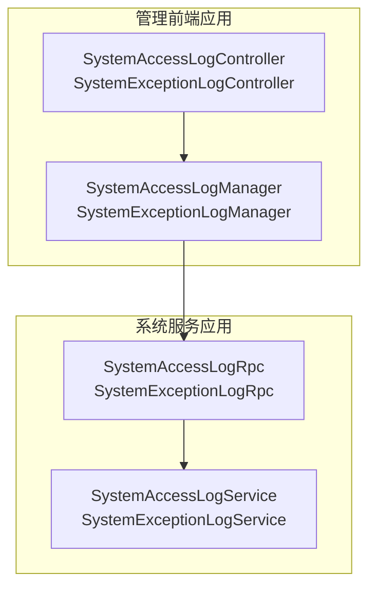
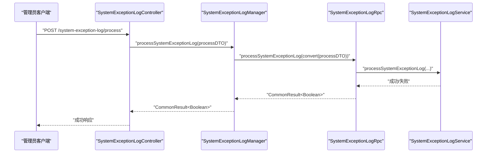
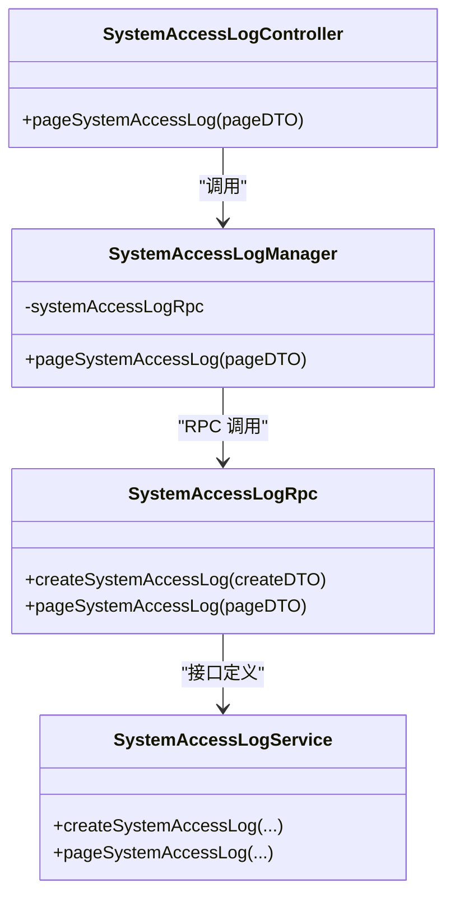
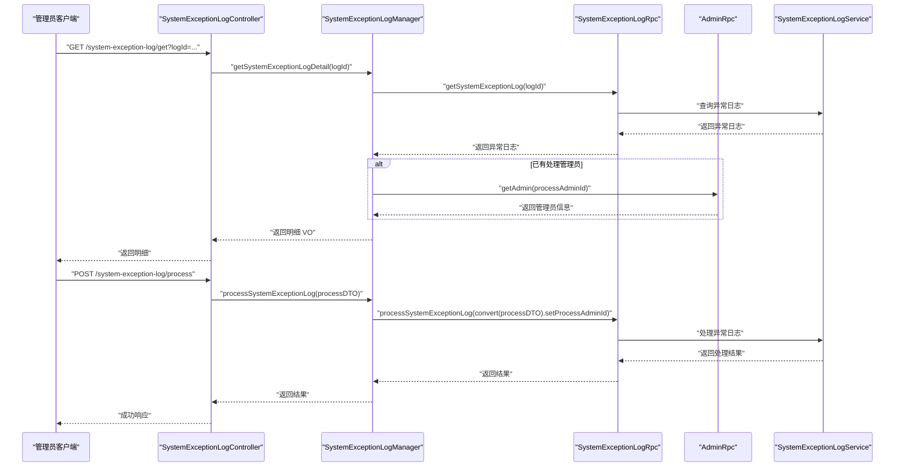
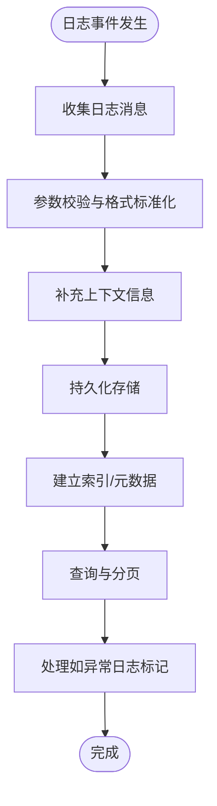
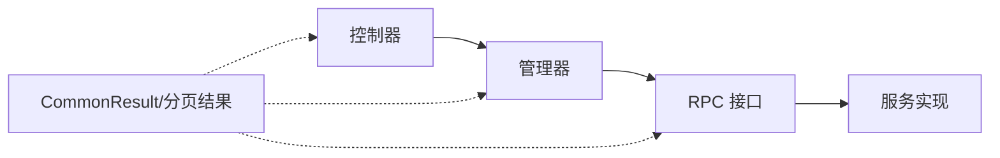

# 系统日志消息场景

<cite>
**本文引用的文件**
- [SystemAccessLogController.java](file://management-web-app/src/main/java/cn/iocoder/mall/managementweb/controller/systemlog/SystemAccessLogController.java)
- [SystemExceptionLogController.java](file://management-web-app/src/main/java/cn/iocoder/mall/managementweb/controller/systemlog/SystemExceptionLogController.java)
- [SystemAccessLogManager.java](file://management-web-app/src/main/java/cn/iocoder/mall/managementweb/manager/systemlog/SystemAccessLogManager.java)
- [SystemExceptionLogManager.java](file://management-web-app/src/main/java/cn/iocoder/mall/managementweb/manager/systemlog/SystemExceptionLogManager.java)
- [SystemAccessLogRpc.java](file://system-service-project/system-service-api/src/main/java/cn/iocoder/mall/systemservice/rpc/systemlog/SystemAccessLogRpc.java)
- [SystemExceptionLogRpc.java](file://system-service-project/system-service-api/src/main/java/cn/iocoder/mall/systemservice/rpc/systemlog/SystemExceptionLogRpc.java)
- [SystemAccessLogService.java](file://system-service-project/system-service-app/src/main/java/cn/iocoder/mall/systemservice/service/systemlog/SystemAccessLogService.java)
- [SystemExceptionLogService.java](file://system-service-project/system-service-app/src/main/java/cn/iocoder/mall/systemservice/service/systemlog/SystemExceptionLogService.java)
- [CommonResult.java](file://common/common-framework/src/main/java/cn/iocoder/common/framework/vo/CommonResult.java)
- [PageResult.java](file://common/common-framework/src/main/java/cn/iocoder/common/framework/vo/PageResult.java)
- [application.yml](file://management-web-app/src/main/resources/application.yml)
- [application.yaml](file://system-service-app/src/main/resources/application.yaml)
</cite>

## 目录
1. [引言](#引言)
2. [项目结构](#项目结构)
3. [核心组件](#核心组件)
4. [架构总览](#架构总览)
5. [详细组件分析](#详细组件分析)
6. [依赖分析](#依赖分析)
7. [性能考虑](#性能考虑)
8. [故障排查指南](#故障排查指南)
9. [结论](#结论)
10. [附录](#附录)

## 引言
本技术文档聚焦于系统日志的消息处理场景，覆盖系统访问日志与异常日志两类关键日志类型。通过对管理前端控制器、管理器层、RPC 接口以及系统服务实现的逐层剖析，阐明日志消息在系统中的采集、传输、存储与查询路径；并结合现有代码结构，给出异步收集、格式标准化、存储优化、可靠性保障（持久化、失败重试、死信队列）、性能优化（批量写入、压缩存储、异步落盘）及监控分析（实时监控、趋势分析、异常检测）的实践建议与落地路径。

## 项目结构
系统日志相关能力由“管理前端应用”与“系统服务应用”协作完成：
- 管理前端应用（management-web-app）：提供日志查询与处理的 Web 控制面，通过 Dubbo RPC 调用系统服务应用。
- 系统服务应用（system-service-app）：承载日志的业务处理、持久化与检索能力，并向上游提供 RPC 接口。

图表来源
- [SystemAccessLogController.java:1-39](file://management-web-app/src/main/java/cn/iocoder/mall/managementweb/controller/systemlog/SystemAccessLogController.java#L1-L39)
- [SystemExceptionLogController.java:1-57](file://management-web-app/src/main/java/cn/iocoder/mall/managementweb/controller/systemlog/SystemExceptionLogController.java#L1-L57)
- [SystemAccessLogManager.java:1-35](file://management-web-app/src/main/java/cn/iocoder/mall/managementweb/manager/systemlog/SystemAccessLogManager.java#L1-L35)
- [SystemExceptionLogManager.java:1-77](file://management-web-app/src/main/java/cn/iocoder/mall/managementweb/manager/systemlog/SystemExceptionLogManager.java#L1-L77)
- [SystemAccessLogRpc.java:1-31](file://system-service-project/system-service-api/src/main/java/cn/iocoder/mall/systemservice/rpc/systemlog/SystemAccessLogRpc.java#L1-L31)
- [SystemExceptionLogRpc.java:1-48](file://system-service-project/system-service-api/src/main/java/cn/iocoder/mall/systemservice/rpc/systemlog/SystemExceptionLogRpc.java#L1-L48)
- [SystemAccessLogService.java](file://system-service-project/system-service-app/src/main/java/cn/iocoder/mall/systemservice/service/systemlog/SystemAccessLogService.java)
- [SystemExceptionLogService.java](file://system-service-project/system-service-app/src/main/java/cn/iocoder/mall/systemservice/service/systemlog/SystemExceptionLogService.java)

章节来源
- [SystemAccessLogController.java:1-39](file://management-web-app/src/main/java/cn/iocoder/mall/managementweb/controller/systemlog/SystemAccessLogController.java#L1-L39)
- [SystemExceptionLogController.java:1-57](file://management-web-app/src/main/java/cn/iocoder/mall/managementweb/controller/systemlog/SystemExceptionLogController.java#L1-L57)
- [SystemAccessLogManager.java:1-35](file://management-web-app/src/main/java/cn/iocoder/mall/managementweb/manager/systemlog/SystemAccessLogManager.java#L1-L35)
- [SystemExceptionLogManager.java:1-77](file://management-web-app/src/main/java/cn/iocoder/mall/managementweb/manager/systemlog/SystemExceptionLogManager.java#L1-L77)
- [SystemAccessLogRpc.java:1-31](file://system-service-project/system-service-api/src/main/java/cn/iocoder/mall/systemservice/rpc/systemlog/SystemAccessLogRpc.java#L1-L31)
- [SystemExceptionLogRpc.java:1-48](file://system-service-project/system-service-api/src/main/java/cn/iocoder/mall/systemservice/rpc/systemlog/SystemExceptionLogRpc.java#L1-L48)

## 核心组件
- 访问日志控制器：提供访问日志分页查询接口，权限控制与请求参数校验。
- 异常日志控制器：提供异常日志明细查询、分页查询与处理接口，支持管理员处理标记。
- 管理器层：封装 RPC 调用，负责参数转换与错误检查，向上返回统一结果模型。
- RPC 接口：定义访问日志与异常日志的创建、查询与处理能力，作为服务边界契约。
- 服务实现：承载日志的持久化、检索与处理逻辑（当前仓库中以接口形式呈现，具体实现位于系统服务应用模块）。

章节来源
- [SystemAccessLogController.java:19-38](file://management-web-app/src/main/java/cn/iocoder/mall/managementweb/controller/systemlog/SystemAccessLogController.java#L19-L38)
- [SystemExceptionLogController.java:21-56](file://management-web-app/src/main/java/cn/iocoder/mall/managementweb/controller/systemlog/SystemExceptionLogController.java#L21-L56)
- [SystemAccessLogManager.java:12-34](file://management-web-app/src/main/java/cn/iocoder/mall/managementweb/manager/systemlog/SystemAccessLogManager.java#L12-L34)
- [SystemExceptionLogManager.java:16-76](file://management-web-app/src/main/java/cn/iocoder/mall/managementweb/manager/systemlog/SystemExceptionLogManager.java#L16-L76)
- [SystemAccessLogRpc.java:9-30](file://system-service-project/system-service-api/src/main/java/cn/iocoder/mall/systemservice/rpc/systemlog/SystemAccessLogRpc.java#L9-L30)
- [SystemExceptionLogRpc.java:10-47](file://system-service-project/system-service-api/src/main/java/cn/iocoder/mall/systemservice/rpc/systemlog/SystemExceptionLogRpc.java#L10-L47)

## 架构总览
下图展示了从管理前端到系统服务的调用链路，以及日志消息在系统内的流转方向。

图表来源
- [SystemExceptionLogController.java:48-54](file://management-web-app/src/main/java/cn/iocoder/mall/managementweb/controller/systemlog/SystemExceptionLogController.java#L48-L54)
- [SystemExceptionLogManager.java:70-74](file://management-web-app/src/main/java/cn/iocoder/mall/managementweb/manager/systemlog/SystemExceptionLogManager.java#L70-L74)
- [SystemExceptionLogRpc.java:39-45](file://system-service-project/system-service-api/src/main/java/cn/iocoder/mall/systemservice/rpc/systemlog/SystemExceptionLogRpc.java#L39-L45)
- [SystemExceptionLogService.java](file://system-service-project/system-service-app/src/main/java/cn/iocoder/mall/systemservice/service/systemlog/SystemExceptionLogService.java)

## 详细组件分析

### 访问日志组件分析
- 控制器职责：接收分页查询请求，进行权限校验与参数校验，调用管理器获取分页结果。
- 管理器职责：将 DTO 转换为 RPC 层对象，调用 RPC 获取分页结果，进行错误检查与 VO 转换。
- RPC 接口：定义访问日志的创建与分页查询方法，作为服务边界。
- 服务实现：负责访问日志的持久化与查询逻辑（接口定义见系统服务应用模块）。

图表来源
- [SystemAccessLogController.java:31-36](file://management-web-app/src/main/java/cn/iocoder/mall/managementweb/controller/systemlog/SystemAccessLogController.java#L31-L36)
- [SystemAccessLogManager.java:27-32](file://management-web-app/src/main/java/cn/iocoder/mall/managementweb/manager/systemlog/SystemAccessLogManager.java#L27-L32)
- [SystemAccessLogRpc.java:14-28](file://system-service-project/system-service-api/src/main/java/cn/iocoder/mall/systemservice/rpc/systemlog/SystemAccessLogRpc.java#L14-L28)
- [SystemAccessLogService.java](file://system-service-project/system-service-app/src/main/java/cn/iocoder/mall/systemservice/service/systemlog/SystemAccessLogService.java)

章节来源
- [SystemAccessLogController.java:31-36](file://management-web-app/src/main/java/cn/iocoder/mall/managementweb/controller/systemlog/SystemAccessLogController.java#L31-L36)
- [SystemAccessLogManager.java:27-32](file://management-web-app/src/main/java/cn/iocoder/mall/managementweb/manager/systemlog/SystemAccessLogManager.java#L27-L32)
- [SystemAccessLogRpc.java:14-28](file://system-service-project/system-service-api/src/main/java/cn/iocoder/mall/systemservice/rpc/systemlog/SystemAccessLogRpc.java#L14-L28)

### 异常日志组件分析
- 控制器职责：提供异常日志明细查询、分页查询与处理接口，均进行权限校验。
- 管理器职责：调用异常日志 RPC 获取明细与分页；处理时设置处理管理员 ID 并调用 RPC 完成处理；同时可调用管理员 RPC 拼接处理人信息。
- RPC 接口：定义异常日志的创建、查询、分页与处理方法。
- 服务实现：负责异常日志的持久化、状态更新与处理记录（接口定义见系统服务应用模块）。

图表来源
- [SystemExceptionLogController.java:33-54](file://management-web-app/src/main/java/cn/iocoder/mall/managementweb/controller/systemlog/SystemExceptionLogController.java#L33-L54)
- [SystemExceptionLogManager.java:33-74](file://management-web-app/src/main/java/cn/iocoder/mall/managementweb/manager/systemlog/SystemExceptionLogManager.java#L33-L74)
- [SystemExceptionLogRpc.java:29-45](file://system-service-project/system-service-api/src/main/java/cn/iocoder/mall/systemservice/rpc/systemlog/SystemExceptionLogRpc.java#L29-L45)
- [SystemExceptionLogService.java](file://system-service-project/system-service-app/src/main/java/cn/iocoder/mall/systemservice/service/systemlog/SystemExceptionLogService.java)

章节来源
- [SystemExceptionLogController.java:33-54](file://management-web-app/src/main/java/cn/iocoder/mall/managementweb/controller/systemlog/SystemExceptionLogController.java#L33-L54)
- [SystemExceptionLogManager.java:33-74](file://management-web-app/src/main/java/cn/iocoder/mall/managementweb/manager/systemlog/SystemExceptionLogManager.java#L33-L74)
- [SystemExceptionLogRpc.java:29-45](file://system-service-project/system-service-api/src/main/java/cn/iocoder/mall/systemservice/rpc/systemlog/SystemExceptionLogRpc.java#L29-L45)

### 日志消息处理流程（概念）
以下流程图展示日志消息从产生到落库、查询与处理的典型路径，便于理解整体处理链路。

（该图为概念性流程示意，不直接映射具体源码文件）

## 依赖分析
- 控制器依赖管理器；管理器依赖 RPC 接口；RPC 接口定义服务边界；服务实现承载具体业务逻辑。
- 统一结果模型：使用通用结果包装类与分页结果模型，确保跨层一致的错误处理与返回格式。
- 配置文件：管理前端与系统服务分别维护各自的配置文件，用于环境与运行参数设置。

图表来源
- [SystemAccessLogController.java:31-36](file://management-web-app/src/main/java/cn/iocoder/mall/managementweb/controller/systemlog/SystemAccessLogController.java#L31-L36)
- [SystemExceptionLogController.java:33-54](file://management-web-app/src/main/java/cn/iocoder/mall/managementweb/controller/systemlog/SystemExceptionLogController.java#L33-L54)
- [SystemAccessLogManager.java:27-32](file://management-web-app/src/main/java/cn/iocoder/mall/managementweb/manager/systemlog/SystemAccessLogManager.java#L27-L32)
- [SystemExceptionLogManager.java:57-74](file://management-web-app/src/main/java/cn/iocoder/mall/managementweb/manager/systemlog/SystemExceptionLogManager.java#L57-L74)
- [CommonResult.java](file://common/common-framework/src/main/java/cn/iocoder/common/framework/vo/CommonResult.java)
- [PageResult.java](file://common/common-framework/src/main/java/cn/iocoder/common/framework/vo/PageResult.java)

章节来源
- [CommonResult.java](file://common/common-framework/src/main/java/cn/iocoder/common/framework/vo/CommonResult.java)
- [PageResult.java](file://common/common-framework/src/main/java/cn/iocoder/common/framework/vo/PageResult.java)
- [application.yml](file://management-web-app/src/main/resources/application.yml)
- [application.yaml](file://system-service-app/src/main/resources/application.yaml)

## 性能考虑
基于现有代码结构，日志消息处理的性能优化建议如下（概念性指导，非仓库既有实现）：
- 批量写入：将高频日志事件合并为批次后写入，减少数据库往返与事务开销。
- 压缩存储：对日志正文或元数据进行压缩，降低存储与网络传输成本。
- 异步落盘：采用异步线程池或消息队列缓冲写入，避免阻塞主业务路径。
- 分页与索引：对查询字段建立合适索引，优化分页查询性能；限制默认分页大小防止资源滥用。
- 缓存策略：对热点查询结果进行短期缓存，降低重复查询压力。
- 资源隔离：为日志写入与查询分别配置独立的数据源或连接池，避免相互影响。

（本节为通用性能建议，不直接分析具体源码文件）

## 故障排查指南
- 错误检查：管理器层统一调用通用结果模型的错误检查方法，确保上游异常被及时暴露。
- 日志追踪：为每个请求生成唯一跟踪 ID，贯穿控制器、管理器、RPC 与服务实现，便于问题定位。
- 降级策略：当下游服务不可用时，可返回空结果或降级提示，避免级联故障。
- 重试与退避：对外部依赖（如 RPC）引入指数退避重试，避免雪崩效应。
- 死信队列：对多次重试仍失败的日志消息进入死信队列，保留以便人工复核与后续补偿。

章节来源
- [SystemAccessLogManager.java:30-31](file://management-web-app/src/main/java/cn/iocoder/mall/managementweb/manager/systemlog/SystemAccessLogManager.java#L30-L31)
- [SystemExceptionLogManager.java:36-37](file://management-web-app/src/main/java/cn/iocoder/mall/managementweb/manager/systemlog/SystemExceptionLogManager.java#L36-L37)
- [SystemExceptionLogManager.java:58-61](file://management-web-app/src/main/java/cn/iocoder/mall/managementweb/manager/systemlog/SystemExceptionLogManager.java#L58-L61)
- [SystemExceptionLogManager.java:71-73](file://management-web-app/src/main/java/cn/iocoder/mall/managementweb/manager/systemlog/SystemExceptionLogManager.java#L71-L73)

## 结论
本项目通过清晰的分层设计与 RPC 接口契约，实现了访问日志与异常日志的查询与处理能力。结合通用结果模型与分页模型，保证了跨层的一致性与可维护性。为进一步提升系统在高并发下的稳定性与性能，建议在现有基础上引入异步收集、批量写入、压缩存储与死信队列等机制，并完善监控与告警体系，以满足生产环境对可靠性与可观测性的更高要求。

## 附录
- 配置文件位置参考：
  - 管理前端应用配置：[application.yml](file://management-web-app/src/main/resources/application.yml)
  - 系统服务应用配置：[application.yaml](file://system-service-app/src/main/resources/application.yaml)