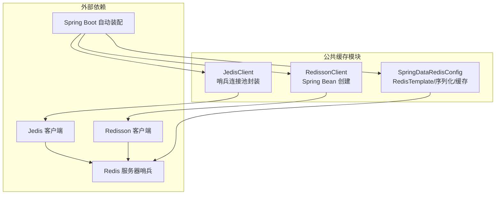
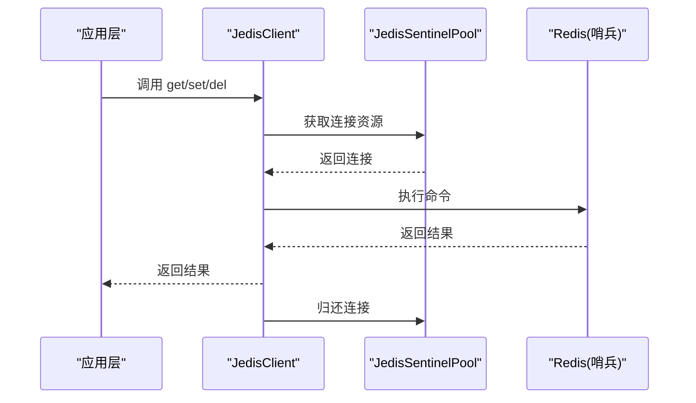
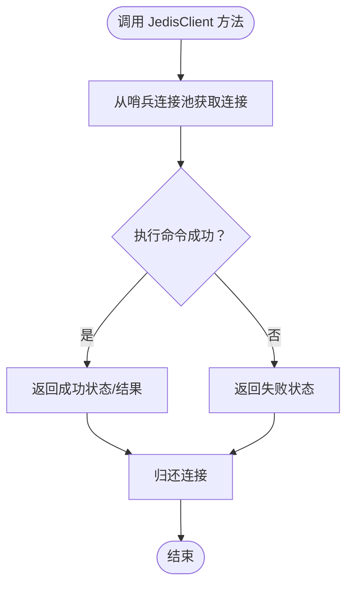
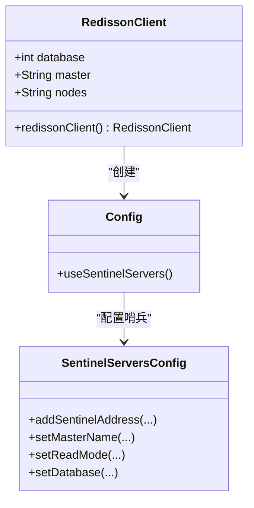
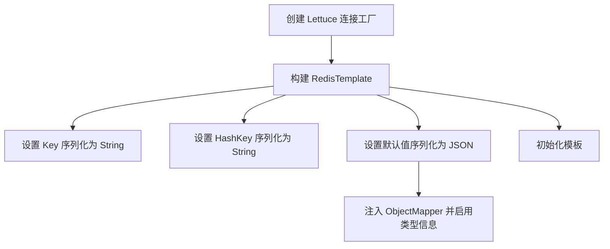
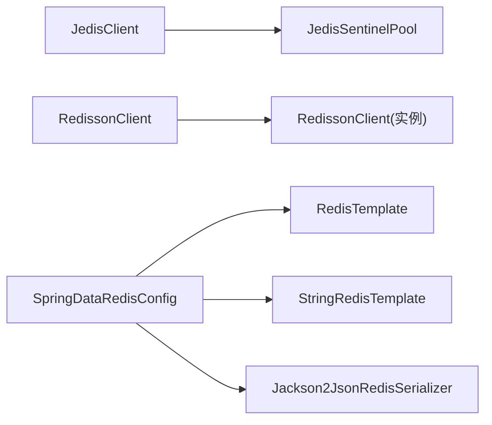

# Redis客户端配置

<cite>
**本文引用的文件**
- [JedisClient.java](file://common/mall-spring-boot-starter-cache/src/main/java/cn/iocoder/mall/cache/config/JedisClient.java)
- [RedissonClient.java](file://common/mall-spring-boot-starter-cache/src/main/java/cn/iocoder/mall/cache/config/RedissonClient.java)
- [SpringDataRedisConfig.java](file://common/mall-spring-boot-starter-cache/src/main/java/cn/iocoder/mall/cache/config/SpringDataRedisConfig.java)
- [redis.properties](file://common/mall-spring-boot-starter-cache/src/main/resources/redis.properties)
- [application-dev.yaml](file://user-service-project/user-service-app/src/main/resources/application-dev.yaml)
- [application.yml（管理后台）](file://management-web-app/src/main/resources/application.yml)
- [application.yml（商城前端）](file://shop-web-app/src/main/resources/application.yml)
</cite>

## 目录
1. [简介](#简介)
2. [项目结构](#项目结构)
3. [核心组件](#核心组件)
4. [架构总览](#架构总览)
5. [详细组件分析](#详细组件分析)
6. [依赖分析](#依赖分析)
7. [性能考虑](#性能考虑)
8. [故障排查指南](#故障排查指南)
9. [结论](#结论)
10. [附录：配置示例与最佳实践](#附录配置示例与最佳实践)

## 简介
本文件面向 Onemall 项目中的 Redis 客户端配置，系统性对比 Jedis 与 Redisson 两类客户端的实现原理、使用场景与配置差异，并结合项目现有代码给出可落地的配置建议与最佳实践。重点覆盖：
- Jedis 客户端的连接池与哨兵集成、超时与序列化策略
- Redisson 客户端的分布式锁、限流器、分布式集合等高级能力
- 两种客户端在性能、功能、易用性上的权衡
- 实际配置示例与运维建议（连接池大小、超时、哨兵节点、数据库索引等）

## 项目结构
Onemall 在公共模块中提供了 Redis 客户端封装与配置：
- Jedis 客户端封装：通过哨兵连接池对外提供 get/set/del 等常用操作
- Redisson 客户端封装：基于 Spring Bean 方式创建 RedissonClient，支持哨兵模式
- Spring Data Redis 配置：提供 RedisTemplate、序列化策略与缓存管理器

图表来源
- [JedisClient.java:1-80](file://common/mall-spring-boot-starter-cache/src/main/java/cn/iocoder/mall/cache/config/JedisClient.java#L1-L80)
- [RedissonClient.java:1-52](file://common/mall-spring-boot-starter-cache/src/main/java/cn/iocoder/mall/cache/config/RedissonClient.java#L1-L52)
- [SpringDataRedisConfig.java:1-166](file://common/mall-spring-boot-starter-cache/src/main/java/cn/iocoder/mall/cache/config/SpringDataRedisConfig.java#L1-L166)

章节来源
- [JedisClient.java:1-80](file://common/mall-spring-boot-starter-cache/src/main/java/cn/iocoder/mall/cache/config/JedisClient.java#L1-L80)
- [RedissonClient.java:1-52](file://common/mall-spring-boot-starter-cache/src/main/java/cn/iocoder/mall/cache/config/RedissonClient.java#L1-L52)
- [SpringDataRedisConfig.java:1-166](file://common/mall-spring-boot-starter-cache/src/main/java/cn/iocoder/mall/cache/config/SpringDataRedisConfig.java#L1-L166)

## 核心组件
- JedisClient：基于 JedisSentinelPool 的轻量级封装，提供 get/set/del 等常用操作；适合对 Redis 的基本读写需求。
- RedissonClient：通过 Spring Bean 创建 RedissonClient，配置哨兵模式与只读从库读取，适合需要分布式能力的场景。
- SpringDataRedisConfig：提供 RedisTemplate、StringRedisTemplate、Jackson 序列化策略以及基于注解的缓存管理器。

章节来源
- [JedisClient.java:19-77](file://common/mall-spring-boot-starter-cache/src/main/java/cn/iocoder/mall/cache/config/JedisClient.java#L19-L77)
- [RedissonClient.java:35-50](file://common/mall-spring-boot-starter-cache/src/main/java/cn/iocoder/mall/cache/config/RedissonClient.java#L35-L50)
- [SpringDataRedisConfig.java:76-112](file://common/mall-spring-boot-starter-cache/src/main/java/cn/iocoder/mall/cache/config/SpringDataRedisConfig.java#L76-L112)

## 架构总览
Jedis 与 Redisson 在 Onemall 中的职责分工：
- Jedis：面向简单读写与高并发短命令场景，连接池由哨兵管理，适合高频小对象读写
- Redisson：面向复杂分布式场景，提供分布式锁、限流器、分布式集合等，适合高并发下的强一致或分布式协调需求
- Spring Data Redis：统一的 RedisTemplate 与序列化策略，便于在 Spring 缓存体系中使用

图表来源
- [JedisClient.java:19-77](file://common/mall-spring-boot-starter-cache/src/main/java/cn/iocoder/mall/cache/config/JedisClient.java#L19-L77)

章节来源
- [JedisClient.java:19-77](file://common/mall-spring-boot-starter-cache/src/main/java/cn/iocoder/mall/cache/config/JedisClient.java#L19-L77)

## 详细组件分析

### Jedis 客户端（JedisClient）
- 连接池与哨兵集成
  - 使用 JedisSentinelPool 作为连接池，自动处理主从切换与故障转移
  - 通过静态方法直接获取连接执行命令，finally 中确保连接归还
- 超时与序列化
  - 代码中未显式设置连接/读写超时参数，建议在连接池初始化阶段配置
  - 默认使用字符串序列化，如需复杂对象请结合 Spring Data Redis 的序列化策略
- 关键方法
  - get(key)：返回字符串值
  - set(key, value)：返回是否成功
  - set(key, value, seconds)：带过期时间的设置
  - del(key)：删除并返回是否删除成功

图表来源
- [JedisClient.java:19-77](file://common/mall-spring-boot-starter-cache/src/main/java/cn/iocoder/mall/cache/config/JedisClient.java#L19-L77)

章节来源
- [JedisClient.java:19-77](file://common/mall-spring-boot-starter-cache/src/main/java/cn/iocoder/mall/cache/config/JedisClient.java#L19-L77)

### Redisson 客户端（RedissonClient）
- 哨兵模式配置
  - 通过 Spring Bean 创建 RedissonClient，使用 useSentinelServers 配置主从哨兵
  - 支持只读从库读取（ReadMode.SLAVE），提升读扩展性
  - 自动补全 redis:// 前缀，兼容多种节点地址格式
- 分布式能力
  - 分布式锁：基于 Redis 的互斥锁，适合分布式并发控制
  - 限流器：基于 Redis 的令牌桶/漏桶算法，适合接口限流
  - 分布式集合：如分布式 Set、Map、Topic 等，满足高并发数据结构需求
- 注意事项
  - 代码中未显式设置连接超时与命令超时，建议在实际部署时补充
  - 与 Spring Cache 集成时，可结合 Spring Data Redis 的序列化策略

图表来源
- [RedissonClient.java:35-50](file://common/mall-spring-boot-starter-cache/src/main/java/cn/iocoder/mall/cache/config/RedissonClient.java#L35-L50)

章节来源
- [RedissonClient.java:22-50](file://common/mall-spring-boot-starter-cache/src/main/java/cn/iocoder/mall/cache/config/RedissonClient.java#L22-L50)

### Spring Data Redis 配置（SpringDataRedisConfig）
- RedisTemplate 与 StringRedisTemplate
  - 提供通用 RedisTemplate 与字符串模板，分别用于对象与字符串场景
  - 默认使用 Jackson2JsonRedisSerializer 作为值序列化策略
- 序列化策略
  - Key/HashKey 使用 StringRedisSerializer
  - Value 使用 Jackson2JsonRedisSerializer，并启用类型信息与忽略未知属性
- 缓存管理器与键生成器
  - 提供 KeyGenerator，基于目标类名、方法名与参数生成缓存键
  - 可按需配置不同缓存的 TTL

图表来源
- [SpringDataRedisConfig.java:89-112](file://common/mall-spring-boot-starter-cache/src/main/java/cn/iocoder/mall/cache/config/SpringDataRedisConfig.java#L89-L112)
- [SpringDataRedisConfig.java:76-87](file://common/mall-spring-boot-starter-cache/src/main/java/cn/iocoder/mall/cache/config/SpringDataRedisConfig.java#L76-L87)

章节来源
- [SpringDataRedisConfig.java:76-112](file://common/mall-spring-boot-starter-cache/src/main/java/cn/iocoder/mall/cache/config/SpringDataRedisConfig.java#L76-L112)
- [SpringDataRedisConfig.java:114-141](file://common/mall-spring-boot-starter-cache/src/main/java/cn/iocoder/mall/cache/config/SpringDataRedisConfig.java#L114-L141)

## 依赖分析
- 组件耦合
  - JedisClient 与 RedissonClient 均依赖 Redis 服务器的哨兵模式
  - SpringDataRedisConfig 依赖 Lettuce 连接工厂与 Jackson 序列化
- 外部依赖
  - Jedis 与 Redisson 客户端版本由 Maven 依赖管理
  - Spring Boot 自动装配负责加载上述配置类与 Bean

图表来源
- [JedisClient.java:17](file://common/mall-spring-boot-starter-cache/src/main/java/cn/iocoder/mall/cache/config/JedisClient.java#L17)
- [RedissonClient.java:36](file://common/mall-spring-boot-starter-cache/src/main/java/cn/iocoder/mall/cache/config/RedissonClient.java#L36)
- [SpringDataRedisConfig.java:90](file://common/mall-spring-boot-starter-cache/src/main/java/cn/iocoder/mall/cache/config/SpringDataRedisConfig.java#L90)

章节来源
- [JedisClient.java:17](file://common/mall-spring-boot-starter-cache/src/main/java/cn/iocoder/mall/cache/config/JedisClient.java#L17)
- [RedissonClient.java:36](file://common/mall-spring-boot-starter-cache/src/main/java/cn/iocoder/mall/cache/config/RedissonClient.java#L36)
- [SpringDataRedisConfig.java:90](file://common/mall-spring-boot-starter-cache/src/main/java/cn/iocoder/mall/cache/config/SpringDataRedisConfig.java#L90)

## 性能考虑
- 连接池与线程模型
  - Jedis 采用阻塞式 I/O，适合高并发短命令；连接池大小应根据 QPS 与平均响应时间估算
  - Redisson 基于 Netty 异步网络模型，适合长连接与复杂分布式操作
- 哨兵与只读从库
  - Redisson 的 ReadMode.SLAVE 可提升读扩展性；但写一致性取决于业务需求
- 序列化开销
  - JSON 序列化带来 CPU 与带宽成本，建议对热点键采用更高效的序列化策略或二进制序列化
- 超时与重试
  - 建议为连接与命令设置合理超时，避免线程池耗尽
  - 对幂等写入可引入重试机制，非幂等写入需谨慎

## 故障排查指南
- 连接问题
  - 检查哨兵主从名称与节点地址是否正确
  - 观察连接池最大空闲、最小空闲与最大等待时间配置是否合理
- 超时与异常
  - 若出现命令超时，适当增大超时阈值或优化命令复杂度
  - 对于序列化异常，检查 Jackson 配置与对象类型信息
- 分布式锁与限流
  - 分布式锁需确保释放与续期策略；限流器需结合业务峰值流量调整令牌桶参数

章节来源
- [redis.properties:1-18](file://common/mall-spring-boot-starter-cache/src/main/resources/redis.properties#L1-L18)
- [SpringDataRedisConfig.java:76-87](file://common/mall-spring-boot-starter-cache/src/main/java/cn/iocoder/mall/cache/config/SpringDataRedisConfig.java#L76-L87)

## 结论
- Jedis 更适合简单、高频的读写场景，配置与使用相对直接，性能稳定
- Redisson 提供丰富的分布式能力，适合需要强一致或分布式协调的复杂场景
- 在 Onemall 中，三者可互补：Jedis 用于高频小对象读写，Redisson 用于分布式能力，Spring Data Redis 用于统一的缓存与序列化

## 附录：配置示例与最佳实践

### 连接池与哨兵配置
- 哨兵主从名称与节点地址
  - 在应用配置文件中设置 spring.redis.sentinel.master 与 spring.redis.sentinel.nodes
- 连接池参数（参考 redis.properties）
  - 最大空闲、最小空闲、最大总连接、最大等待时间、驱逐参数等
  - 建议结合压测结果调整，避免连接不足或过度占用

章节来源
- [redis.properties:13-16](file://common/mall-spring-boot-starter-cache/src/main/resources/redis.properties#L13-L16)
- [application-dev.yaml:12-21](file://user-service-project/user-service-app/src/main/resources/application-dev.yaml#L12-L21)

### 超时与序列化策略
- 超时设置
  - 建议在连接池初始化阶段显式设置连接与读写超时
- 序列化策略
  - 对象存储建议使用 JSON 序列化，并开启类型信息
  - 字符串场景使用 StringRedisSerializer，减少序列化开销

章节来源
- [SpringDataRedisConfig.java:76-112](file://common/mall-spring-boot-starter-cache/src/main/java/cn/iocoder/mall/cache/config/SpringDataRedisConfig.java#L76-L112)

### SSL 加密与安全
- Redis 通信加密
  - 建议在生产环境启用 TLS/SSL 加密，确保传输安全
  - 节点地址前缀可使用 redis:// 或 rediss://（如支持）

### 分布式能力使用建议
- 分布式锁
  - 使用 Redisson 的分布式锁时，注意锁的粒度与释放时机
- 限流器
  - 根据业务峰值流量设置令牌桶容量与填充速率
- 分布式集合
  - 合理选择 Set/Map/List 等结构，关注内存与性能影响

### 典型部署建议
- 读多写少场景优先使用 Redisson 的 SLAVE 读模式
- 高频小对象读写可优先考虑 Jedis，配合合理的连接池参数
- 缓存层统一使用 Spring Data Redis 的序列化策略，保证跨服务一致性