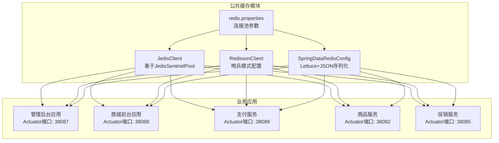
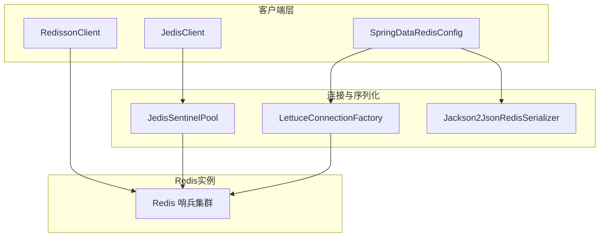
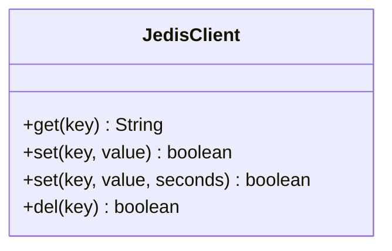
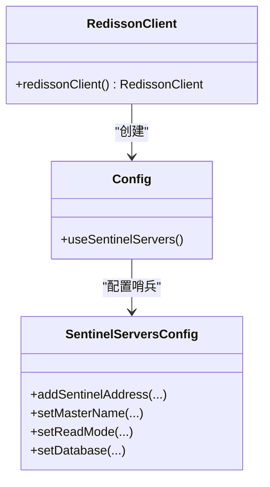
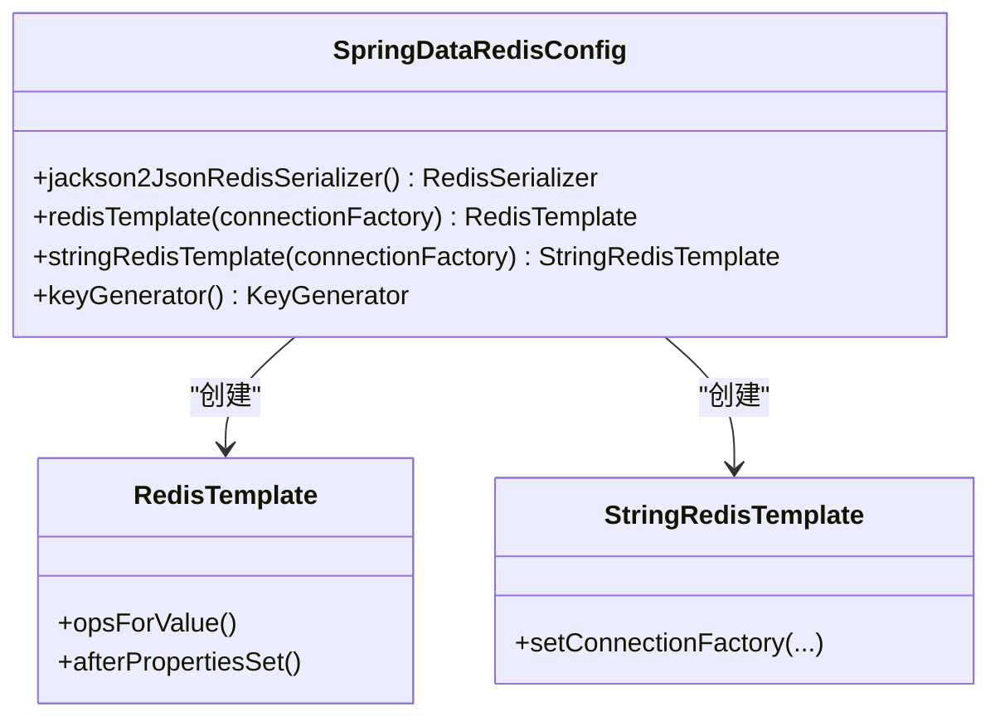
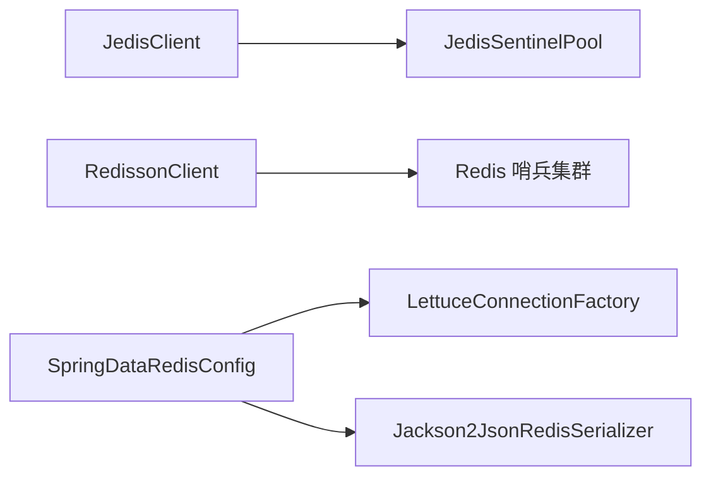

# 缓存性能优化

<cite>
**本文引用的文件**
- [JedisClient.java](file://common/mall-spring-boot-starter-cache/src/main/java/cn/iocoder/mall/cache/config/JedisClient.java)
- [RedissonClient.java](file://common/mall-spring-boot-starter-cache/src/main/java/cn/iocoder/mall/cache/config/RedissonClient.java)
- [SpringDataRedisConfig.java](file://common/mall-spring-boot-starter-cache/src/main/java/cn/iocoder/mall/cache/config/SpringDataRedisConfig.java)
- [redis.properties](file://common/mall-spring-boot-starter-cache/src/main/resources/redis.properties)
- [application.yml（管理后台）](file://management-web-app/src/main/resources/application.yml)
- [application.yml（商城前台）](file://shop-web-app/src/main/resources/application.yml)
- [application.yaml（支付服务）](file://pay-service-project/pay-service-app/src/main/resources/application.yaml)
- [application.yaml（商品服务）](file://product-service-project/product-service-app/src/main/resources/application.yaml)
- [application.yaml（促销服务）](file://promotion-service-project/promotion-service-app/src/main/resources/application.yaml)
</cite>

## 目录
1. [引言](#引言)
2. [项目结构](#项目结构)
3. [核心组件](#核心组件)
4. [架构总览](#架构总览)
5. [详细组件分析](#详细组件分析)
6. [依赖关系分析](#依赖关系分析)
7. [性能考虑](#性能考虑)
8. [故障排查指南](#故障排查指南)
9. [结论](#结论)
10. [附录](#附录)

## 引言
本文件面向Onemall系统的缓存性能优化，聚焦于Redis集群配置与优化策略（主从复制、哨兵模式、集群模式的选择与配置）、内存管理优化（内存碎片整理、对象压缩、内存淘汰策略）、网络性能优化（TCP参数调优、连接复用、批量命令执行）、缓存命中率优化（预加载策略、热点数据识别、智能缓存淘汰），并提供性能监控指标、基准测试方法与实际优化案例建议。本文以仓库中现有的缓存配置与使用为依据，结合通用Redis最佳实践，形成可落地的优化方案。

## 项目结构
Onemall采用多模块微服务架构，缓存能力通过公共starter模块提供，各业务服务按需启用。当前缓存实现涉及以下关键位置：
- 公共缓存starter：提供基于Jedis、Redisson与Spring Data Redis的配置与客户端封装
- 应用层配置：各服务通过application.yml或application.yaml暴露Actuator监控端点，便于性能观测
- 运行环境：通过不同profile与端口区分开发、本地与生产环境

**图示来源**
- [JedisClient.java:1-80](file://common/mall-spring-boot-starter-cache/src/main/java/cn/iocoder/mall/cache/config/JedisClient.java#L1-L80)
- [RedissonClient.java:1-52](file://common/mall-spring-boot-starter-cache/src/main/java/cn/iocoder/mall/cache/config/RedissonClient.java#L1-L52)
- [SpringDataRedisConfig.java:1-166](file://common/mall-spring-boot-starter-cache/src/main/java/cn/iocoder/mall/cache/config/SpringDataRedisConfig.java#L1-L166)
- [redis.properties:1-18](file://common/mall-spring-boot-starter-cache/src/main/resources/redis.properties#L1-L18)
- [application.yml（管理后台）:79-83](file://management-web-app/src/main/resources/application.yml#L79-L83)
- [application.yml（商城前台）:72-76](file://shop-web-app/src/main/resources/application.yml#L72-L76)
- [application.yaml（支付服务）:53-57](file://pay-service-project/pay-service-app/src/main/resources/application.yaml#L53-L57)
- [application.yaml（商品服务）:49-53](file://product-service-project/product-service-app/src/main/resources/application.yaml#L49-L53)
- [application.yaml（促销服务）:53-57](file://promotion-service-project/promotion-service-app/src/main/resources/application.yaml#L53-L57)

**章节来源**
- [JedisClient.java:1-80](file://common/mall-spring-boot-starter-cache/src/main/java/cn/iocoder/mall/cache/config/JedisClient.java#L1-L80)
- [RedissonClient.java:1-52](file://common/mall-spring-boot-starter-cache/src/main/java/cn/iocoder/mall/cache/config/RedissonClient.java#L1-L52)
- [SpringDataRedisConfig.java:1-166](file://common/mall-spring-boot-starter-cache/src/main/java/cn/iocoder/mall/cache/config/SpringDataRedisConfig.java#L1-L166)
- [redis.properties:1-18](file://common/mall-spring-boot-starter-cache/src/main/resources/redis.properties#L1-L18)
- [application.yml（管理后台）:79-83](file://management-web-app/src/main/resources/application.yml#L79-L83)
- [application.yml（商城前台）:72-76](file://shop-web-app/src/main/resources/application.yml#L72-L76)
- [application.yaml（支付服务）:53-57](file://pay-service-project/pay-service-app/src/main/resources/application.yaml#L53-L57)
- [application.yaml（商品服务）:49-53](file://product-service-project/product-service-app/src/main/resources/application.yaml#L49-L53)
- [application.yaml（促销服务）:53-57](file://promotion-service-project/promotion-service-app/src/main/resources/application.yaml#L53-L57)

## 核心组件
- Jedis客户端：基于JedisSentinelPool实现，提供get/set/del等常用操作，适用于对延迟敏感的场景；注意连接获取与释放的正确性。
- Redisson客户端：基于哨兵模式配置，支持读写分离（从节点读取），适合高可用与自动故障转移需求。
- Spring Data Redis配置：使用Lettuce连接工厂与Jackson2 JSON序列化器，提供RedisTemplate与StringRedisTemplate，便于Spring Cache集成与统一序列化策略。
- 连接池参数：通过redis.properties集中管理Jedis连接池的关键参数，如最大空闲、最小空闲、最大连接数、驱逐策略等。

**章节来源**
- [JedisClient.java:19-77](file://common/mall-spring-boot-starter-cache/src/main/java/cn/iocoder/mall/cache/config/JedisClient.java#L19-L77)
- [RedissonClient.java:35-50](file://common/mall-spring-boot-starter-cache/src/main/java/cn/iocoder/mall/cache/config/RedissonClient.java#L35-L50)
- [SpringDataRedisConfig.java:89-112](file://common/mall-spring-boot-starter-cache/src/main/java/cn/iocoder/mall/cache/config/SpringDataRedisConfig.java#L89-L112)
- [redis.properties:1-18](file://common/mall-spring-boot-starter-cache/src/main/resources/redis.properties#L1-L18)

## 架构总览
Onemall在缓存层面采用“多客户端并存”的策略：部分模块直接使用Jedis，部分模块使用Redisson，另有模块通过Spring Data Redis统一管理。整体架构如下：

**图示来源**
- [JedisClient.java:17](file://common/mall-spring-boot-starter-cache/src/main/java/cn/iocoder/mall/cache/config/JedisClient.java#L17)
- [RedissonClient.java:36-49](file://common/mall-spring-boot-starter-cache/src/main/java/cn/iocoder/mall/cache/config/RedissonClient.java#L36-L49)
- [SpringDataRedisConfig.java:22-28](file://common/mall-spring-boot-starter-cache/src/main/java/cn/iocoder/mall/cache/config/SpringDataRedisConfig.java#L22-L28)

## 详细组件分析

### Jedis客户端（JedisClient）
- 设计要点
  - 使用JedisSentinelPool作为连接池，确保在哨兵环境下自动故障转移与高可用。
  - 提供简洁的字符串KV操作接口，适合热点小对象与低延迟场景。
- 性能关注
  - 连接池参数集中在redis.properties，需结合QPS与延迟目标调整最大连接数与等待时间。
  - 注意finally块中关闭连接，避免连接泄漏。
- 优化建议
  - 对频繁访问的小对象可考虑开启压缩存储（需评估CPU与带宽权衡）。
  - 批量命令可通过pipeline减少RTT（当前实现为单条命令，后续可扩展）。

**图示来源**
- [JedisClient.java:19-77](file://common/mall-spring-boot-starter-cache/src/main/java/cn/iocoder/mall/cache/config/JedisClient.java#L19-L77)

**章节来源**
- [JedisClient.java:17-77](file://common/mall-spring-boot-starter-cache/src/main/java/cn/iocoder/mall/cache/config/JedisClient.java#L17-L77)
- [redis.properties:1-18](file://common/mall-spring-boot-starter-cache/src/main/resources/redis.properties#L1-L18)

### Redisson客户端（RedissonClient）
- 设计要点
  - 基于哨兵模式配置，支持从节点读取（ReadMode.SLAVE），提升读扩展能力。
  - 自动处理主从切换与节点发现，降低运维复杂度。
- 性能关注
  - 读写分离策略需结合业务读写比例，避免脏读风险。
  - Sentinel地址列表需保证高可用与网络连通性。
- 优化建议
  - 对只读场景可进一步扩大从节点数量，提升横向扩展能力。
  - 结合业务热点，采用本地缓存+Redisson双层缓存策略。

**图示来源**
- [RedissonClient.java:35-50](file://common/mall-spring-boot-starter-cache/src/main/java/cn/iocoder/mall/cache/config/RedissonClient.java#L35-L50)

**章节来源**
- [RedissonClient.java:20-50](file://common/mall-spring-boot-starter-cache/src/main/java/cn/iocoder/mall/cache/config/RedissonClient.java#L20-L50)

### Spring Data Redis配置（SpringDataRedisConfig）
- 设计要点
  - 使用Lettuce连接工厂，提供RedisTemplate与StringRedisTemplate，统一序列化策略。
  - 默认使用Jackson2JsonRedisSerializer，便于对象持久化与跨语言兼容。
  - 支持KeyGenerator自定义，便于缓存键规范化。
- 性能关注
  - 序列化开销与数据大小密切相关，需结合业务对象体积选择合适序列化方式。
  - Lettuce连接池参数未在该文件显式配置，需在外部统一管理。
- 优化建议
  - 对大对象可考虑压缩存储或二进制序列化（如Kryo）以降低带宽与内存占用。
  - 合理设置TTL与过期策略，避免内存碎片化。

**图示来源**
- [SpringDataRedisConfig.java:76-112](file://common/mall-spring-boot-starter-cache/src/main/java/cn/iocoder/mall/cache/config/SpringDataRedisConfig.java#L76-L112)

**章节来源**
- [SpringDataRedisConfig.java:37-166](file://common/mall-spring-boot-starter-cache/src/main/java/cn/iocoder/mall/cache/config/SpringDataRedisConfig.java#L37-L166)

### 连接池参数（redis.properties）
- 关键参数
  - 最大空闲、最小空闲、最大连接数、最大等待时间、驱逐策略、借还验证等。
- 性能关注
  - 过小会导致排队等待，过大可能引发Redis端压力与GC抖动。
  - 驱逐策略需平衡内存回收与连接复用效率。
- 优化建议
  - 结合峰值QPS与P99延迟目标，动态调整最大连接数与等待时间。
  - 在高并发场景下适当放宽驱逐阈值，减少连接重建频率。

**章节来源**
- [redis.properties:1-18](file://common/mall-spring-boot-starter-cache/src/main/resources/redis.properties#L1-L18)

### 应用监控配置（Actuator）
- 各服务均暴露Actuator端点，便于采集运行时指标（JVM、线程、HTTP、Redis连接池等）。
- 建议在生产环境限制暴露范围，并配合Prometheus/Grafana进行可视化监控。

**章节来源**
- [application.yml（管理后台）:79-83](file://management-web-app/src/main/resources/application.yml#L79-L83)
- [application.yml（商城前台）:72-76](file://shop-web-app/src/main/resources/application.yml#L72-L76)
- [application.yaml（支付服务）:53-57](file://pay-service-project/pay-service-app/src/main/resources/application.yaml#L53-L57)
- [application.yaml（商品服务）:49-53](file://product-service-project/product-service-app/src/main/resources/application.yaml#L49-L53)
- [application.yaml（促销服务）:53-57](file://promotion-service-project/promotion-service-app/src/main/resources/application.yaml#L53-L57)

## 依赖关系分析
- 组件耦合
  - JedisClient与JedisSentinelPool强耦合，需确保哨兵配置正确。
  - RedissonClient与Spring配置解耦，通过@Value注入哨兵信息。
  - SpringDataRedisConfig依赖Lettuce与Jackson2序列化器，统一了模板与序列化策略。
- 外部依赖
  - Redis哨兵集群作为高可用后端。
  - Actuator用于运行时监控与指标采集。

**图示来源**
- [JedisClient.java:17](file://common/mall-spring-boot-starter-cache/src/main/java/cn/iocoder/mall/cache/config/JedisClient.java#L17)
- [RedissonClient.java:36-49](file://common/mall-spring-boot-starter-cache/src/main/java/cn/iocoder/mall/cache/config/RedissonClient.java#L36-L49)
- [SpringDataRedisConfig.java:22-28](file://common/mall-spring-boot-starter-cache/src/main/java/cn/iocoder/mall/cache/config/SpringDataRedisConfig.java#L22-L28)

**章节来源**
- [JedisClient.java:17](file://common/mall-spring-boot-starter-cache/src/main/java/cn/iocoder/mall/cache/config/JedisClient.java#L17)
- [RedissonClient.java:36-49](file://common/mall-spring-boot-starter-cache/src/main/java/cn/iocoder/mall/cache/config/RedissonClient.java#L36-L49)
- [SpringDataRedisConfig.java:22-28](file://common/mall-spring-boot-starter-cache/src/main/java/cn/iocoder/mall/cache/config/SpringDataRedisConfig.java#L22-L28)

## 性能考虑

### Redis集群配置与优化策略
- 主从复制
  - 通过哨兵实现自动故障转移与只读副本扩展，适合读多写少场景。
  - 建议在从节点开启只读，避免写入放大。
- 哨兵模式
  - 已在RedissonClient中体现，建议统一管理master名称与节点列表。
  - 节点数量建议奇数个，提高仲裁稳定性。
- 集群模式
  - 当前代码未体现集群模式配置，若业务需要水平扩展，可引入集群模式并配合哈希槽分片。
  - 集群模式下需关注跨节点事务与批量命令的限制。

**章节来源**
- [RedissonClient.java:35-50](file://common/mall-spring-boot-starter-cache/src/main/java/cn/iocoder/mall/cache/config/RedissonClient.java#L35-L50)

### 内存管理优化
- 内存碎片整理
  - 使用BGREWRITEAOF或UNLINK（Redis 4.0+）清理过期键，减少碎片。
  - 控制对象生命周期，及时过期与清理。
- 对象压缩
  - 对小字符串可启用压缩存储（如zip），平衡CPU与内存。
  - 大对象优先考虑二进制序列化（如Kryo）降低序列化开销。
- 内存淘汰策略
  - 根据业务特征选择合理策略（如allkeys-lru、volatile-ttl等）。
  - 对热数据设置更长TTL，冷数据快速淘汰。

### 网络性能优化
- TCP参数调优
  - 调整内核TCP缓冲区、Nagle与延迟确认，降低RTT。
  - 在高并发场景下启用TCP快速打开（TFO）。
- 连接复用
  - Lettuce与Jedis均支持连接池，需根据QPS与延迟目标调整最大连接数。
  - 在同机房部署时缩短网络距离，减少RTT。
- 批量命令执行
  - 使用pipeline合并请求，减少RTT。
  - 对于写密集场景，可采用mset/mget批量写入。

### 缓存命中率优化
- 预加载策略
  - 对热点商品、促销活动等在业务高峰前预热缓存。
  - 使用异步任务定期刷新即将过期的热点键。
- 热点数据识别
  - 通过慢查询日志与监控指标识别热点键，针对性优化。
  - 对热点键增加副本或本地缓存（如Caffeine）。
- 智能缓存淘汰
  - 结合LRU与TTL策略，对热数据延长存活时间。
  - 对冷数据采用更激进的淘汰策略，释放内存空间。

### 性能监控指标与基准测试
- 监控指标
  - 连接池：活跃连接数、空闲连接数、等待队列长度、连接失败次数。
  - Redis：used_memory、mem_fragmentation_ratio、evicted_keys、expired_keys、keyspace_hits/keyspace_misses。
  - 应用：请求延迟P50/P95/P99、吞吐量、错误率。
- 基准测试
  - 使用redis-benchmark对GET/SET、MGET/MSET、pipeline等场景进行压测。
  - 模拟真实业务流量，逐步提升并发，观察延迟与错误率变化。

### 实际优化案例（建议）
- 案例一：商品详情页缓存
  - 问题：热点商品请求导致Redis压力过大。
  - 方案：引入本地缓存+Redisson双层缓存，热点键延长TTL，使用pipeline批量读取关联数据。
- 案例二：订单查询接口
  - 问题：查询延迟高，连接池紧张。
  - 方案：优化SQL与索引，缓存查询结果，使用连接池参数调优与批量查询减少RTT。

## 故障排查指南
- 连接池耗尽
  - 现象：大量请求等待连接或报错。
  - 排查：检查最大连接数、等待时间与活跃连接数，结合业务峰值调整。
- 哨兵不可用
  - 现象：无法获取主节点或连接失败。
  - 排查：确认哨兵节点可达性与master名称一致性，检查网络与防火墙。
- 序列化异常
  - 现象：读取缓存时报错或数据不一致。
  - 排查：确认序列化器配置与对象版本兼容性，必要时迁移旧数据格式。
- 内存不足
  - 现象：频繁淘汰、碎片率升高。
  - 排查：调整淘汰策略与TTL，优化对象大小与压缩策略。

**章节来源**
- [redis.properties:1-18](file://common/mall-spring-boot-starter-cache/src/main/resources/redis.properties#L1-L18)
- [SpringDataRedisConfig.java:76-112](file://common/mall-spring-boot-starter-cache/src/main/java/cn/iocoder/mall/cache/config/SpringDataRedisConfig.java#L76-L112)

## 结论
Onemall当前的缓存实现以哨兵高可用为核心，结合Jedis、Redisson与Spring Data Redis满足不同场景需求。建议在现有基础上完善连接池参数、序列化策略与监控体系，针对热点数据与批量操作进行专项优化，并通过基准测试持续验证优化效果。对于未来更大规模的扩展，可考虑引入Redis集群模式与更细粒度的缓存治理策略。

## 附录
- 参考配置位置
  - Jedis连接池参数：[redis.properties:1-18](file://common/mall-spring-boot-starter-cache/src/main/resources/redis.properties#L1-L18)
  - Redisson哨兵配置：[RedissonClient.java:35-50](file://common/mall-spring-boot-starter-cache/src/main/java/cn/iocoder/mall/cache/config/RedissonClient.java#L35-L50)
  - Spring Data Redis序列化与模板：[SpringDataRedisConfig.java:76-112](file://common/mall-spring-boot-starter-cache/src/main/java/cn/iocoder/mall/cache/config/SpringDataRedisConfig.java#L76-L112)
  - Actuator监控端点：[application.yml（管理后台）:79-83](file://management-web-app/src/main/resources/application.yml#L79-L83)、[application.yml（商城前台）:72-76](file://shop-web-app/src/main/resources/application.yml#L72-L76)、[application.yaml（支付服务）:53-57](file://pay-service-project/pay-service-app/src/main/resources/application.yaml#L53-L57)、[application.yaml（商品服务）:49-53](file://product-service-project/product-service-app/src/main/resources/application.yaml#L49-L53)、[application.yaml（促销服务）:53-57](file://promotion-service-project/promotion-service-app/src/main/resources/application.yaml#L53-L57)