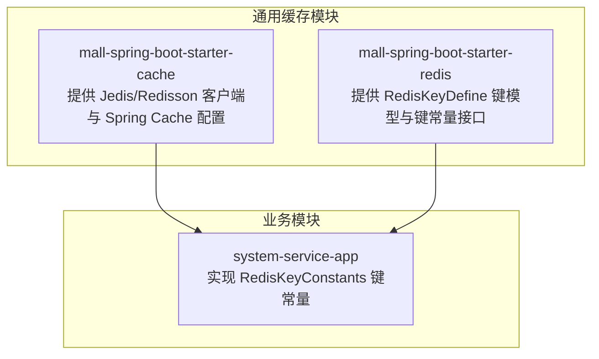
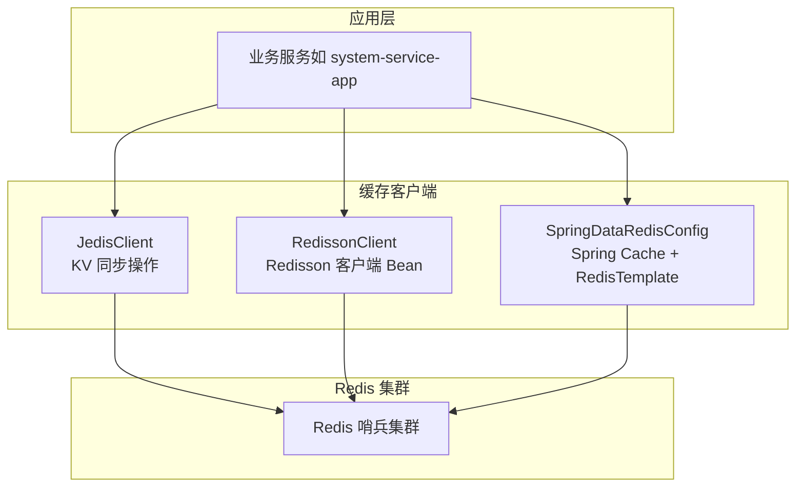
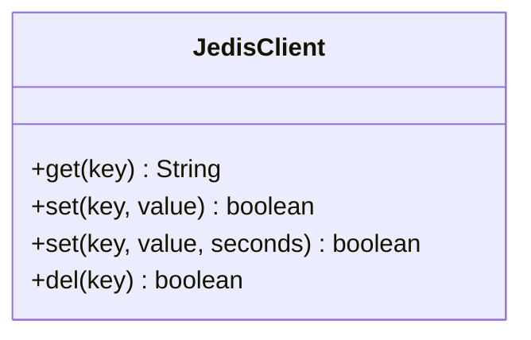
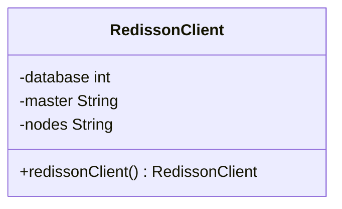
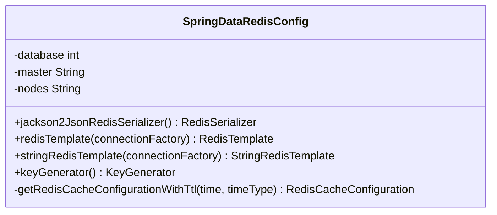
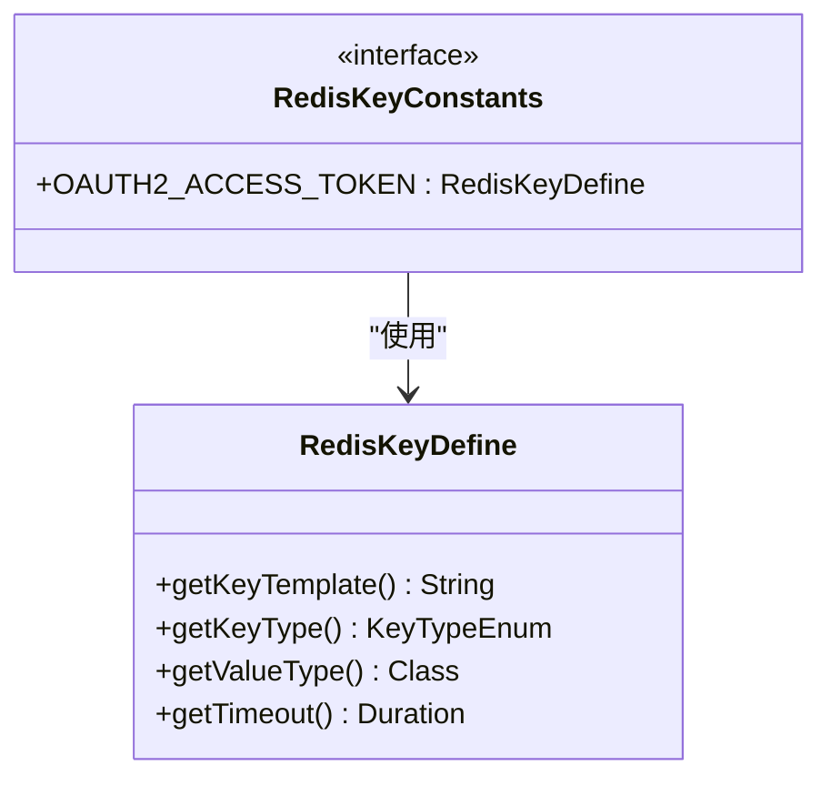
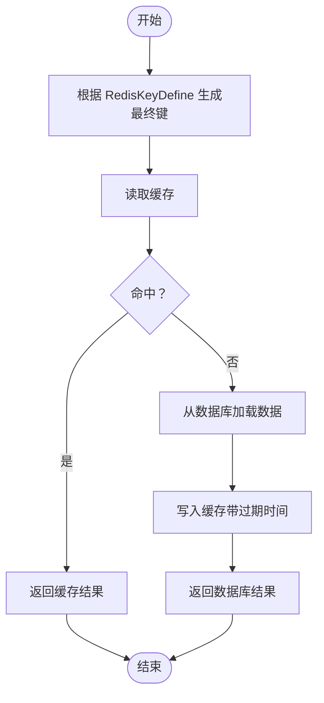
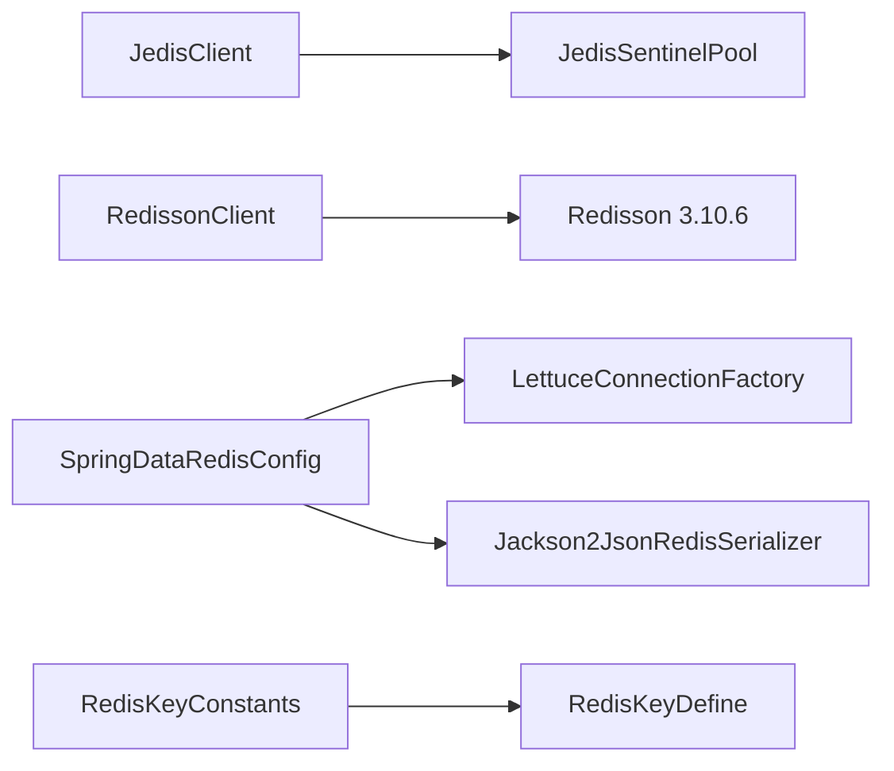

# 缓存架构设计

<cite>
**本文引用的文件**
- [JedisClient.java](file://common/mall-spring-boot-starter-cache/src/main/java/cn/iocoder/mall/cache/config/JedisClient.java)
- [RedissonClient.java](file://common/mall-spring-boot-starter-cache/src/main/java/cn/iocoder/mall/cache/config/RedissonClient.java)
- [SpringDataRedisConfig.java](file://common/mall-spring-boot-starter-cache/src/main/java/cn/iocoder/mall/cache/config/SpringDataRedisConfig.java)
- [RedisKeyDefine.java](file://common/mall-spring-boot-starter-redis/src/main/java/cn/iocoder/mall/redis/core/RedisKeyDefine.java)
- [RedisKeyConstants.java](file://system-service-project/system-service-app/src/main/java/cn/iocoder/mall/systemservice/dal/redis/RedisKeyConstants.java)
- [redis.properties](file://common/mall-spring-boot-starter-cache/src/main/resources/redis.properties)
- [pom.xml（缓存启动器）](file://common/mall-spring-boot-starter-cache/pom.xml)
</cite>

## 目录
1. [引言](#引言)
2. [项目结构](#项目结构)
3. [核心组件](#核心组件)
4. [架构总览](#架构总览)
5. [详细组件分析](#详细组件分析)
6. [依赖分析](#依赖分析)
7. [性能考虑](#性能考虑)
8. [故障排查指南](#故障排查指南)
9. [结论](#结论)
10. [附录：缓存使用示例与最佳实践](#附录缓存使用示例与最佳实践)

## 引言
本文件面向 Onemall 的缓存架构，聚焦于 Redis 缓存系统的整体设计与落地，涵盖以下主题：
- Redis 客户端选型与配置：Jedis 与 Redisson 的使用场景与差异
- 缓存键命名规范：RedisKeyDefine 的设计、命名规则、前缀策略与过期时间设计
- 缓存策略：读写策略、缓存更新机制、缓存穿透与雪崩防护
- 分布式一致性：缓存失效策略、缓存预热、缓存监控
- 性能优化：内存管理、持久化策略、集群配置
- 实战示例与最佳实践

## 项目结构
Onemall 将缓存能力拆分为两个通用模块：
- mall-spring-boot-starter-cache：提供 Spring Boot 自动装配的 Redis 客户端与 Spring Cache 集成
- mall-spring-boot-starter-redis：提供跨服务共享的 RedisKeyDefine 约定与键常量定义接口

图示来源
- [SpringDataRedisConfig.java:37-166](file://common/mall-spring-boot-starter-cache/src/main/java/cn/iocoder/mall/cache/config/SpringDataRedisConfig.java#L37-L166)
- [RedisKeyDefine.java:1-72](file://common/mall-spring-boot-starter-redis/src/main/java/cn/iocoder/mall/redis/core/RedisKeyDefine.java#L1-L72)
- [RedisKeyConstants.java:1-25](file://system-service-project/system-service-app/src/main/java/cn/iocoder/mall/systemservice/dal/redis/RedisKeyConstants.java#L1-L25)

章节来源
- [SpringDataRedisConfig.java:37-166](file://common/mall-spring-boot-starter-cache/src/main/java/cn/iocoder/mall/cache/config/SpringDataRedisConfig.java#L37-L166)
- [RedisKeyDefine.java:1-72](file://common/mall-spring-boot-starter-redis/src/main/java/cn/iocoder/mall/redis/core/RedisKeyDefine.java#L1-L72)
- [RedisKeyConstants.java:1-25](file://system-service-project/system-service-app/src/main/java/cn/iocoder/mall/systemservice/dal/redis/RedisKeyConstants.java#L1-L25)

## 核心组件
- JedisClient：基于 Jedis 与哨兵池的轻量级同步客户端封装，提供 get/set/del 等基础操作，支持带 TTL 的 set
- RedissonClient：基于 Redisson 的哨兵模式客户端 Bean，提供高级数据结构与分布式能力
- SpringDataRedisConfig：Spring Cache 与 RedisTemplate 配置，含 JSON 序列化、KeyGenerator、默认过期时间策略
- RedisKeyDefine：统一的缓存键模型，定义键模板、类型、值类型与过期时间
- RedisKeyConstants：业务侧对 RedisKeyDefine 的具体键常量实现，集中管理键命名与过期策略

章节来源
- [JedisClient.java:1-80](file://common/mall-spring-boot-starter-cache/src/main/java/cn/iocoder/mall/cache/config/JedisClient.java#L1-L80)
- [RedissonClient.java:1-52](file://common/mall-spring-boot-starter-cache/src/main/java/cn/iocoder/mall/cache/config/RedissonClient.java#L1-L52)
- [SpringDataRedisConfig.java:37-166](file://common/mall-spring-boot-starter-cache/src/main/java/cn/iocoder/mall/cache/config/SpringDataRedisConfig.java#L37-L166)
- [RedisKeyDefine.java:1-72](file://common/mall-spring-boot-starter-redis/src/main/java/cn/iocoder/mall/redis/core/RedisKeyDefine.java#L1-L72)
- [RedisKeyConstants.java:1-25](file://system-service-project/system-service-app/src/main/java/cn/iocoder/mall/systemservice/dal/redis/RedisKeyConstants.java#L1-L25)

## 架构总览
Onemall 的缓存架构采用“多客户端并存 + 统一键模型”的设计：
- 多客户端并存：Jedis 用于简单 KV 场景；Redisson 用于需要分布式能力的场景（如分布式锁）
- 统一键模型：通过 RedisKeyDefine 统一管理键模板、类型与过期时间，避免散乱的硬编码键
- Spring Cache 集成：通过 SpringDataRedisConfig 提供统一的缓存管理与序列化策略

图示来源
- [JedisClient.java:1-80](file://common/mall-spring-boot-starter-cache/src/main/java/cn/iocoder/mall/cache/config/JedisClient.java#L1-L80)
- [RedissonClient.java:1-52](file://common/mall-spring-boot-starter-cache/src/main/java/cn/iocoder/mall/cache/config/RedissonClient.java#L1-L52)
- [SpringDataRedisConfig.java:37-166](file://common/mall-spring-boot-starter-cache/src/main/java/cn/iocoder/mall/cache/config/SpringDataRedisConfig.java#L37-L166)

## 详细组件分析

### JedisClient 组件分析
- 设计要点
  - 使用 JedisSentinelPool 获取连接，确保高可用
  - 提供 get/set/del 基础操作，set 支持带 TTL
  - 操作后显式关闭连接，避免资源泄露
- 适用场景
  - 简单 KV 读写、热点数据缓存
  - 不需要复杂数据结构或分布式能力的场景
- 注意事项
  - 返回值需做空值判断与异常兜底
  - TTL 参数单位与业务期望保持一致

图示来源
- [JedisClient.java:1-80](file://common/mall-spring-boot-starter-cache/src/main/java/cn/iocoder/mall/cache/config/JedisClient.java#L1-L80)

章节来源
- [JedisClient.java:1-80](file://common/mall-spring-boot-starter-cache/src/main/java/cn/iocoder/mall/cache/config/JedisClient.java#L1-L80)

### RedissonClient 组件分析
- 设计要点
  - 基于哨兵模式配置，支持主从切换
  - 读取配置项 database、master、nodes，自动补全地址协议
  - 返回 org.redisson.api.RedissonClient Bean，便于注入使用
- 适用场景
  - 需要分布式锁、限流、Pub/Sub 等高级能力
  - 对可用性与一致性要求更高的场景
- 注意事项
  - 与 Jedis 的 API 生态不同，需按 Redisson 文档使用
  - 与 Spring Cache 的集成需单独配置

图示来源
- [RedissonClient.java:1-52](file://common/mall-spring-boot-starter-cache/src/main/java/cn/iocoder/mall/cache/config/RedissonClient.java#L1-L52)

章节来源
- [RedissonClient.java:1-52](file://common/mall-spring-boot-starter-cache/src/main/java/cn/iocoder/mall/cache/config/RedissonClient.java#L1-L52)

### SpringDataRedisConfig 组件分析
- 设计要点
  - 提供 RedisTemplate 与 StringRedisTemplate，统一序列化策略
  - 默认使用 Jackson2JsonRedisSerializer 序列化对象
  - 提供自定义 KeyGenerator，基于类名+方法名+参数生成键
  - 提供 getRedisCacheConfigurationWithTtl 支持按小时/分钟/秒设置过期
- 适用场景
  - Spring Cache 注解驱动的缓存管理
  - 需要统一序列化与过期策略的场景
- 注意事项
  - KeyGenerator 会把所有非空参数拼入键，需谨慎控制参数规模
  - TTL 单位与 getRedisCacheConfigurationWithTtl 的 timeType 需保持一致

图示来源
- [SpringDataRedisConfig.java:37-166](file://common/mall-spring-boot-starter-cache/src/main/java/cn/iocoder/mall/cache/config/SpringDataRedisConfig.java#L37-L166)

章节来源
- [SpringDataRedisConfig.java:37-166](file://common/mall-spring-boot-starter-cache/src/main/java/cn/iocoder/mall/cache/config/SpringDataRedisConfig.java#L37-L166)

### RedisKeyDefine 与 RedisKeyConstants 组件分析
- RedisKeyDefine
  - 定义键模板、类型（STRING/LIST/HASH/SET/ZSET/STREAM/PUBSUB）、值类型、过期时间
  - 提供静态常量 TIMEOUT_FOREVER 表示永不过期
- RedisKeyConstants
  - 在业务模块中实现具体的键常量，统一管理键命名与过期策略
  - 示例：OAuth2 访问令牌键，模板为 oauth2_access_token:%s，过期时间为 2 小时

图示来源
- [RedisKeyDefine.java:1-72](file://common/mall-spring-boot-starter-redis/src/main/java/cn/iocoder/mall/redis/core/RedisKeyDefine.java#L1-L72)
- [RedisKeyConstants.java:1-25](file://system-service-project/system-service-app/src/main/java/cn/iocoder/mall/systemservice/dal/redis/RedisKeyConstants.java#L1-L25)

章节来源
- [RedisKeyDefine.java:1-72](file://common/mall-spring-boot-starter-redis/src/main/java/cn/iocoder/mall/redis/core/RedisKeyDefine.java#L1-L72)
- [RedisKeyConstants.java:1-25](file://system-service-project/system-service-app/src/main/java/cn/iocoder/mall/systemservice/dal/redis/RedisKeyConstants.java#L1-L25)

### 缓存策略流程（读写与更新）
以下流程展示基于 RedisKeyDefine 的典型读写与更新策略：

图示来源
- [RedisKeyDefine.java:1-72](file://common/mall-spring-boot-starter-redis/src/main/java/cn/iocoder/mall/redis/core/RedisKeyDefine.java#L1-L72)
- [SpringDataRedisConfig.java:143-163](file://common/mall-spring-boot-starter-cache/src/main/java/cn/iocoder/mall/cache/config/SpringDataRedisConfig.java#L143-L163)

## 依赖分析
- 组件耦合
  - JedisClient 与 RedissonClient 独立存在，分别面向不同场景
  - SpringDataRedisConfig 依赖 Lettuce 连接工厂与 Jackson 序列化
  - RedisKeyDefine 与 RedisKeyConstants 解耦，前者提供模型，后者提供业务实现
- 外部依赖
  - Redisson 版本：3.10.6
  - Jedis 版本：3.1.0
  - Spring Boot Data Redis

图示来源
- [pom.xml（缓存启动器）:14-31](file://common/mall-spring-boot-starter-cache/pom.xml#L14-L31)
- [SpringDataRedisConfig.java:22-28](file://common/mall-spring-boot-starter-cache/src/main/java/cn/iocoder/mall/cache/config/SpringDataRedisConfig.java#L22-L28)
- [RedissonClient.java:4-10](file://common/mall-spring-boot-starter-cache/src/main/java/cn/iocoder/mall/cache/config/RedissonClient.java#L4-L10)
- [RedisKeyDefine.java:1-72](file://common/mall-spring-boot-starter-redis/src/main/java/cn/iocoder/mall/redis/core/RedisKeyDefine.java#L1-L72)

章节来源
- [pom.xml（缓存启动器）:14-31](file://common/mall-spring-boot-starter-cache/pom.xml#L14-L31)
- [SpringDataRedisConfig.java:22-28](file://common/mall-spring-boot-starter-cache/src/main/java/cn/iocoder/mall/cache/config/SpringDataRedisConfig.java#L22-L28)
- [RedissonClient.java:4-10](file://common/mall-spring-boot-starter-cache/src/main/java/cn/iocoder/mall/cache/config/RedissonClient.java#L4-L10)
- [RedisKeyDefine.java:1-72](file://common/mall-spring-boot-starter-redis/src/main/java/cn/iocoder/mall/redis/core/RedisKeyDefine.java#L1-L72)

## 性能考虑
- 内存管理
  - 合理设置过期时间，避免缓存无限增长
  - 使用 JSON 序列化时注意对象大小，避免大对象频繁序列化
- 连接池与网络
  - Jedis 使用哨兵池，建议结合 maxTotal、maxIdle、minIdle 等参数调优
  - Lettuce 连接池参数可在 application 配置中进一步细化
- 集群与高可用
  - 哨兵模式已启用，确保主从切换时的可用性
  - 可根据流量与延迟指标评估是否引入集群模式
- 缓存键设计
  - 使用 RedisKeyDefine 统一前缀与模板，降低键冲突风险
  - 对热点键设置合理的 TTL，避免缓存雪崩

## 故障排查指南
- 常见问题
  - 连接失败：检查 sentinel.master 与 sentinel.nodes 是否正确配置
  - 序列化异常：确认 Jackson2JsonRedisSerializer 的对象类型与字段映射
  - 键冲突：使用 RedisKeyDefine 统一模板，避免硬编码键
- 排查步骤
  - 检查 redis.properties 中的连接参数
  - 使用 Redis 客户端工具验证键是否存在、TTL 是否正确
  - 关注日志中的异常堆栈，定位具体操作点

章节来源
- [redis.properties:1-18](file://common/mall-spring-boot-starter-cache/src/main/resources/redis.properties#L1-L18)
- [SpringDataRedisConfig.java:76-105](file://common/mall-spring-boot-starter-cache/src/main/java/cn/iocoder/mall/cache/config/SpringDataRedisConfig.java#L76-L105)

## 结论
Onemall 的缓存架构以“多客户端并存 + 统一键模型”为核心，既满足了简单 KV 场景（Jedis），也覆盖了高级能力（Redisson），并通过 RedisKeyDefine 与 Spring Cache 配置实现了统一的键命名与过期策略。配合哨兵高可用与合理的 TTL 设计，能够有效支撑业务的缓存需求。

## 附录：缓存使用示例与最佳实践
- 使用示例（路径参考）
  - 基于 Jedis 的读写示例：[JedisClient.java:19-77](file://common/mall-spring-boot-starter-cache/src/main/java/cn/iocoder/mall/cache/config/JedisClient.java#L19-L77)
  - 基于 Redisson 的客户端 Bean：[RedissonClient.java:35-50](file://common/mall-spring-boot-starter-cache/src/main/java/cn/iocoder/mall/cache/config/RedissonClient.java#L35-L50)
  - Spring Cache 与 RedisTemplate 配置：[SpringDataRedisConfig.java:89-141](file://common/mall-spring-boot-starter-cache/src/main/java/cn/iocoder/mall/cache/config/SpringDataRedisConfig.java#L89-L141)
  - 键模型与业务键常量：[RedisKeyDefine.java:47-69](file://common/mall-spring-boot-starter-redis/src/main/java/cn/iocoder/mall/redis/core/RedisKeyDefine.java#L47-L69)、[RedisKeyConstants.java:22-22](file://system-service-project/system-service-app/src/main/java/cn/iocoder/mall/systemservice/dal/redis/RedisKeyConstants.java#L22-L22)
- 最佳实践
  - 统一使用 RedisKeyDefine 定义键模板与过期时间，避免硬编码
  - 对热点数据设置短 TTL 并开启随机抖动，缓解缓存雪崩
  - 对不存在的数据可缓存空值或短 TTL，防止缓存穿透
  - 使用 Spring Cache 注解时，合理选择 KeyGenerator，避免键过长
  - 定期巡检缓存命中率与 TTL 分布，动态调整过期策略