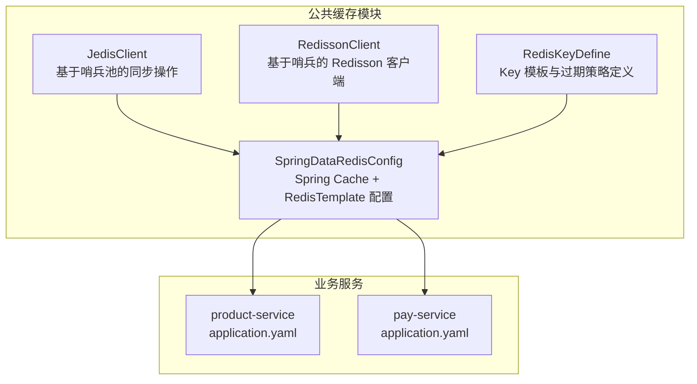
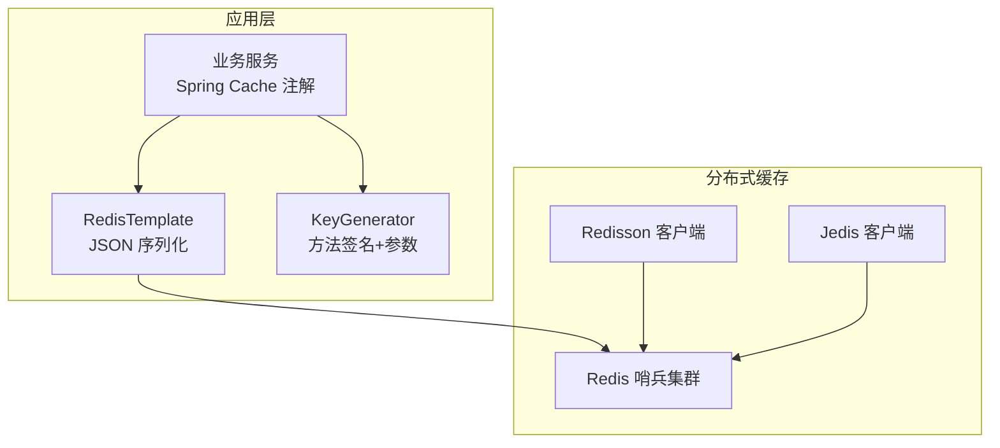
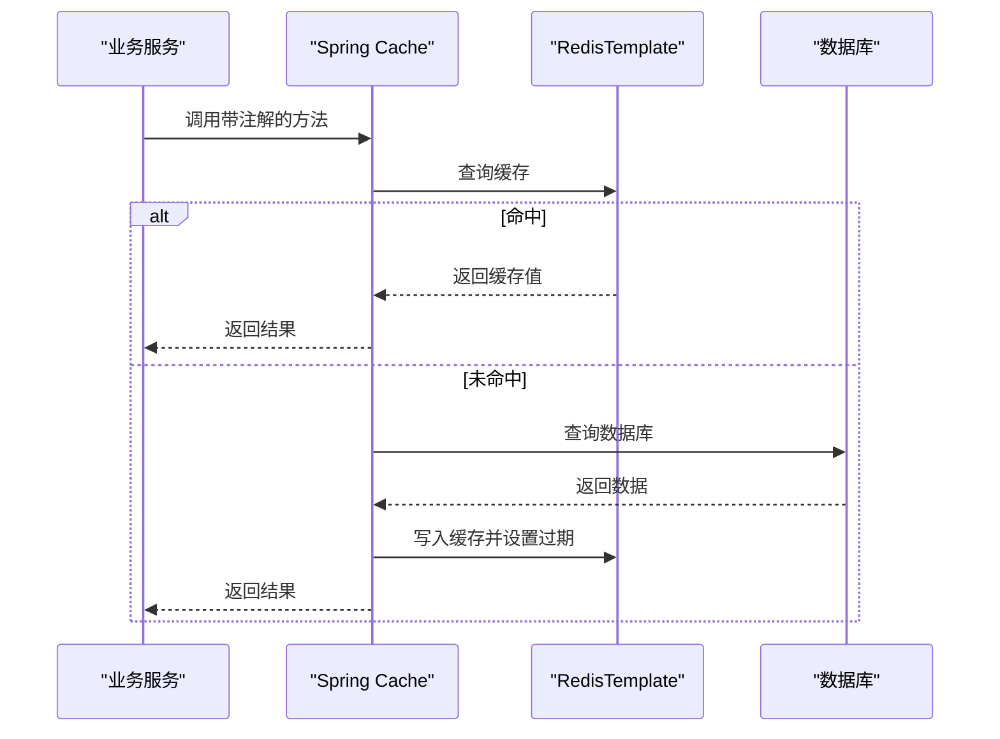
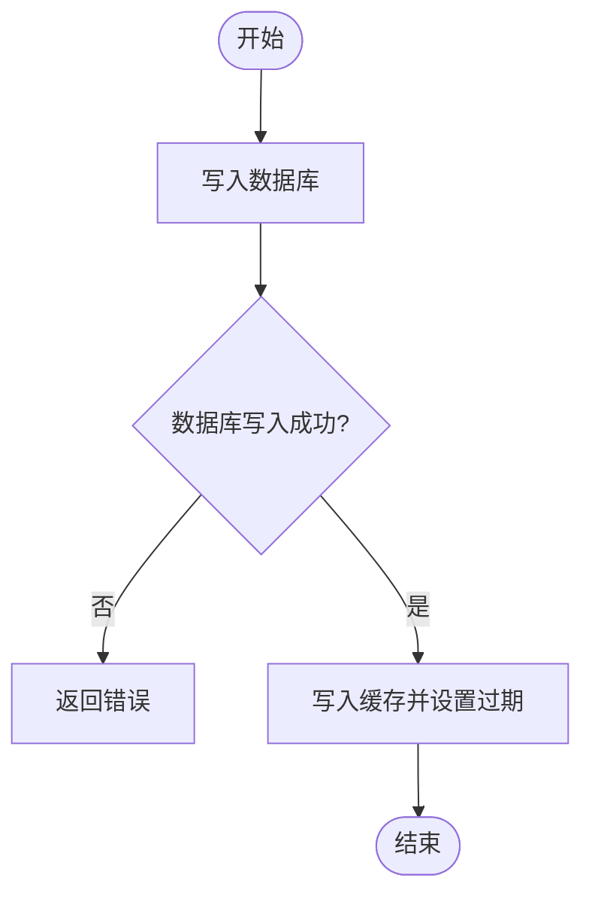
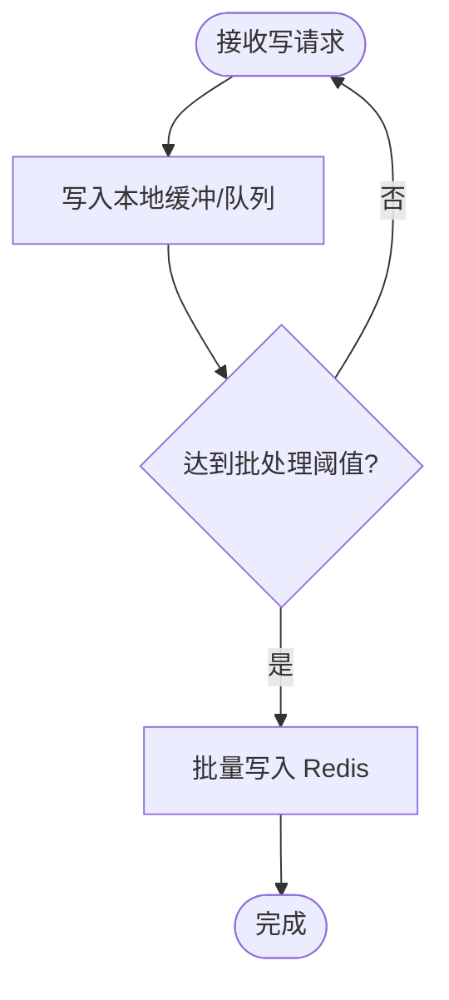
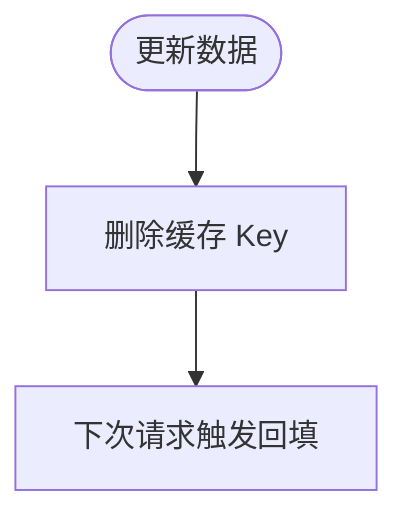
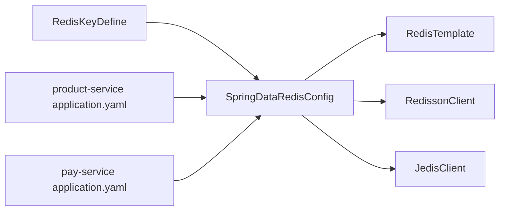

# 缓存策略设计

<cite>
**本文引用的文件**
- [JedisClient.java](file://common/mall-spring-boot-starter-cache/src/main/java/cn/iocoder/mall/cache/config/JedisClient.java)
- [RedissonClient.java](file://common/mall-spring-boot-starter-cache/src/main/java/cn/iocoder/mall/cache/config/RedissonClient.java)
- [SpringDataRedisConfig.java](file://common/mall-spring-boot-starter-cache/src/main/java/cn/iocoder/mall/cache/config/SpringDataRedisConfig.java)
- [RedisKeyDefine.java](file://common/mall-spring-boot-starter-redis/src/main/java/cn/iocoder/mall/redis/core/RedisKeyDefine.java)
- [redis.properties](file://common/mall-spring-boot-starter-cache/src/main/resources/redis.properties)
- [application.yaml（product-service）](file://product-service-project/product-service-app/src/main/resources/application.yaml)
- [application.yaml（pay-service）](file://pay-service-project/pay-service-app/src/main/resources/application.yaml)
</cite>

## 目录
1. [引言](#引言)
2. [项目结构](#项目结构)
3. [核心组件](#核心组件)
4. [架构总览](#架构总览)
5. [详细组件分析](#详细组件分析)
6. [依赖分析](#依赖分析)
7. [性能考虑](#性能考虑)
8. [故障排查指南](#故障排查指南)
9. [结论](#结论)
10. [附录](#附录)

## 引言
本文件面向 Onemall 的缓存策略设计，系统性阐述缓存读写策略（Cache-Aside、Write-Through、Write-Behind）、缓存更新机制（失效、预热、穿透防护、雪崩处理）、分布式一致性（最终一致性与强一致方案）、以及性能优化（内存管理、批量操作、异步更新）。同时结合仓库中的实际组件与配置，给出可落地的实现参考与可视化流程图。

## 项目结构
Onemall 在公共模块中提供了 Redis 客户端封装与 Spring Cache 集成配置，并在各业务服务中通过 YAML 配置启用相关能力。关键位置如下：
- 缓存客户端与配置：common/mall-spring-boot-starter-cache
- Redis Key 定义：common/mall-spring-boot-starter-redis
- 业务服务配置：各服务的 application.yaml 中包含 Redis 与监控等配置

图表来源
- [JedisClient.java:1-80](file://common/mall-spring-boot-starter-cache/src/main/java/cn/iocoder/mall/cache/config/JedisClient.java#L1-L80)
- [RedissonClient.java:1-52](file://common/mall-spring-boot-starter-cache/src/main/java/cn/iocoder/mall/cache/config/RedissonClient.java#L1-L52)
- [SpringDataRedisConfig.java:1-166](file://common/mall-spring-boot-starter-cache/src/main/java/cn/iocoder/mall/cache/config/SpringDataRedisConfig.java#L1-L166)
- [RedisKeyDefine.java:1-72](file://common/mall-spring-boot-starter-redis/src/main/java/cn/iocoder/mall/redis/core/RedisKeyDefine.java#L1-L72)
- [application.yaml（product-service）:1-61](file://product-service-project/product-service-app/src/main/resources/application.yaml#L1-L61)
- [application.yaml（pay-service）:1-65](file://pay-service-project/pay-service-app/src/main/resources/application.yaml#L1-L65)

章节来源
- [JedisClient.java:1-80](file://common/mall-spring-boot-starter-cache/src/main/java/cn/iocoder/mall/cache/config/JedisClient.java#L1-L80)
- [RedissonClient.java:1-52](file://common/mall-spring-boot-starter-cache/src/main/java/cn/iocoder/mall/cache/config/RedissonClient.java#L1-L52)
- [SpringDataRedisConfig.java:1-166](file://common/mall-spring-boot-starter-cache/src/main/java/cn/iocoder/mall/cache/config/SpringDataRedisConfig.java#L1-L166)
- [RedisKeyDefine.java:1-72](file://common/mall-spring-boot-starter-redis/src/main/java/cn/iocoder/mall/redis/core/RedisKeyDefine.java#L1-L72)
- [application.yaml（product-service）:1-61](file://product-service-project/product-service-app/src/main/resources/application.yaml#L1-L61)
- [application.yaml（pay-service）:1-65](file://pay-service-project/pay-service-app/src/main/resources/application.yaml#L1-L65)

## 核心组件
- JedisClient：基于 JedisSentinelPool 的同步读写封装，提供 get/set/del 基础操作，支持 TTL 设置。
- RedissonClient：基于 Redisson 的哨兵模式客户端，配置只读从节点读取，便于高可用与读扩展。
- SpringDataRedisConfig：集成 Spring Cache，提供 RedisTemplate、StringRedisTemplate、Jackson 序列化器、KeyGenerator、全局缓存配置等。
- RedisKeyDefine：统一定义 Redis Key 模板、类型、过期时间，支撑缓存命名规范与生命周期管理。

章节来源
- [JedisClient.java:1-80](file://common/mall-spring-boot-starter-cache/src/main/java/cn/iocoder/mall/cache/config/JedisClient.java#L1-L80)
- [RedissonClient.java:1-52](file://common/mall-spring-boot-starter-cache/src/main/java/cn/iocoder/mall/cache/config/RedissonClient.java#L1-L52)
- [SpringDataRedisConfig.java:1-166](file://common/mall-spring-boot-starter-cache/src/main/java/cn/iocoder/mall/cache/config/SpringDataRedisConfig.java#L1-L166)
- [RedisKeyDefine.java:1-72](file://common/mall-spring-boot-starter-redis/src/main/java/cn/iocoder/mall/redis/core/RedisKeyDefine.java#L1-L72)

## 架构总览
Onemall 的缓存层采用“应用内缓存 + 分布式缓存”的组合策略：
- 应用内缓存：Spring Cache 注解驱动，结合 RedisTemplate 实现方法级缓存。
- 分布式缓存：Jedis/Redisson 客户端直连 Redis 哨兵集群，用于热点数据与跨实例共享。
- Key 规范：通过 RedisKeyDefine 统一模板与过期策略，降低维护成本。

图表来源
- [SpringDataRedisConfig.java:37-166](file://common/mall-spring-boot-starter-cache/src/main/java/cn/iocoder/mall/cache/config/SpringDataRedisConfig.java#L37-L166)
- [RedissonClient.java:35-50](file://common/mall-spring-boot-starter-cache/src/main/java/cn/iocoder/mall/cache/config/RedissonClient.java#L35-L50)
- [JedisClient.java:19-77](file://common/mall-spring-boot-starter-cache/src/main/java/cn/iocoder/mall/cache/config/JedisClient.java#L19-L77)

## 详细组件分析

### Cache-Aside 模式
Cache-Aside 是最常用的缓存读写策略，遵循“先查缓存，未命中再查数据库”的原则。在 Onemall 中，可通过以下路径实现：
- 使用 Spring Cache 注解（如 @Cacheable/@CacheEvict）标注方法，由 SpringDataRedisConfig 驱动 RedisTemplate 执行读写。
- 对于热点数据或强一致需求，也可直接使用 JedisClient/RedissonClient 进行精确控制。

图表来源
- [SpringDataRedisConfig.java:114-141](file://common/mall-spring-boot-starter-cache/src/main/java/cn/iocoder/mall/cache/config/SpringDataRedisConfig.java#L114-L141)
- [JedisClient.java:19-31](file://common/mall-spring-boot-starter-cache/src/main/java/cn/iocoder/mall/cache/config/JedisClient.java#L19-L31)

章节来源
- [SpringDataRedisConfig.java:114-141](file://common/mall-spring-boot-starter-cache/src/main/java/cn/iocoder/mall/cache/config/SpringDataRedisConfig.java#L114-L141)
- [JedisClient.java:19-31](file://common/mall-spring-boot-starter-cache/src/main/java/cn/iocoder/mall/cache/config/JedisClient.java#L19-L31)

### Write-Through 模式
Write-Through 要求每次写入都必须同时更新缓存与存储，确保缓存与数据库一致。在 Onemall 中可按以下方式实现：
- 使用 RedissonClient/JedisClient 在写入数据库成功后，立即写入缓存并设置 TTL。
- 对于批量写入，建议使用事务或流水线（pipeline）提升吞吐。

图表来源
- [RedissonClient.java:35-50](file://common/mall-spring-boot-starter-cache/src/main/java/cn/iocoder/mall/cache/config/RedissonClient.java#L35-L50)
- [JedisClient.java:33-62](file://common/mall-spring-boot-starter-cache/src/main/java/cn/iocoder/mall/cache/config/JedisClient.java#L33-L62)

章节来源
- [RedissonClient.java:35-50](file://common/mall-spring-boot-starter-cache/src/main/java/cn/iocoder/mall/cache/config/RedissonClient.java#L35-L50)
- [JedisClient.java:33-62](file://common/mall-spring-boot-starter-cache/src/main/java/cn/iocoder/mall/cache/config/JedisClient.java#L33-L62)

### Write-Behind 模式
Write-Behind 将写入延迟到后台批处理，以牺牲实时性换取高吞吐。在 Onemall 中可结合 RocketMQ 或定时任务实现：
- 写入本地队列或内存缓冲，周期性批量写入 Redis。
- 使用 Redisson/Jedis 的 pipeline 批量写入，减少网络往返。

图表来源
- [RedissonClient.java:35-50](file://common/mall-spring-boot-starter-cache/src/main/java/cn/iocoder/mall/cache/config/RedissonClient.java#L35-L50)
- [JedisClient.java:33-62](file://common/mall-spring-boot-starter-cache/src/main/java/cn/iocoder/mall/cache/config/JedisClient.java#L33-L62)

章节来源
- [RedissonClient.java:35-50](file://common/mall-spring-boot-starter-cache/src/main/java/cn/iocoder/mall/cache/config/RedissonClient.java#L35-L50)
- [JedisClient.java:33-62](file://common/mall-spring-boot-starter-cache/src/main/java/cn/iocoder/mall/cache/config/JedisClient.java#L33-L62)

### 缓存更新机制

#### 缓存失效策略
- 基于 TTL 的自动过期：通过 SpringDataRedisConfig 的全局缓存配置或 RedisKeyDefine 的模板过期时间控制。
- 主动失效：对热点数据更新后，使用 JedisClient/RedissonClient 删除旧 Key，确保后续读取走数据库回填。

图表来源
- [SpringDataRedisConfig.java:143-163](file://common/mall-spring-boot-starter-cache/src/main/java/cn/iocoder/mall/cache/config/SpringDataRedisConfig.java#L143-L163)
- [RedisKeyDefine.java:48-69](file://common/mall-spring-boot-starter-redis/src/main/java/cn/iocoder/mall/redis/core/RedisKeyDefine.java#L48-L69)
- [JedisClient.java:64-77](file://common/mall-spring-boot-starter-cache/src/main/java/cn/iocoder/mall/cache/config/JedisClient.java#L64-L77)

章节来源
- [SpringDataRedisConfig.java:143-163](file://common/mall-spring-boot-starter-cache/src/main/java/cn/iocoder/mall/cache/config/SpringDataRedisConfig.java#L143-L163)
- [RedisKeyDefine.java:48-69](file://common/mall-spring-boot-starter-redis/src/main/java/cn/iocoder/mall/redis/core/RedisKeyDefine.java#L48-L69)
- [JedisClient.java:64-77](file://common/mall-spring-boot-starter-cache/src/main/java/cn/iocoder/mall/cache/config/JedisClient.java#L64-L77)

#### 缓存预热
- 启动阶段或低峰期批量加载热点 Key 到缓存，避免首次访问抖动。
- 可使用 Redisson/Jedis 的批量写入接口，结合 RedisKeyDefine 的模板生成 Key。

章节来源
- [RedissonClient.java:35-50](file://common/mall-spring-boot-starter-cache/src/main/java/cn/iocoder/mall/cache/config/RedissonClient.java#L35-L50)
- [JedisClient.java:33-62](file://common/mall-spring-boot-starter-cache/src/main/java/cn/iocoder/mall/cache/config/JedisClient.java#L33-L62)
- [RedisKeyDefine.java:48-69](file://common/mall-spring-boot-starter-redis/src/main/java/cn/iocoder/mall/redis/core/RedisKeyDefine.java#L48-L69)

#### 缓存穿透防护
- 对空值也进行短 TTL 缓存，防止恶意或异常高频查询打穿数据库。
- 使用唯一标识（如用户 ID + 请求参数）作为 Key 的一部分，避免 Key 泛化导致的穿透。

章节来源
- [SpringDataRedisConfig.java:114-141](file://common/mall-spring-boot-starter-cache/src/main/java/cn/iocoder/mall/cache/config/SpringDataRedisConfig.java#L114-L141)

#### 缓存雪崩处理
- 为热点 Key 设置随机 TTL，避免同一时刻大面积过期。
- 降级策略：在缓存不可用时允许直连数据库，但需记录熔断指标。

章节来源
- [SpringDataRedisConfig.java:143-163](file://common/mall-spring-boot-starter-cache/src/main/java/cn/iocoder/mall/cache/config/SpringDataRedisConfig.java#L143-L163)
- [redis.properties:1-18](file://common/mall-spring-boot-starter-cache/src/main/resources/redis.properties#L1-L18)

### 分布式一致性保证

#### 最终一致性
- 通过消息队列（如 RocketMQ）异步更新缓存，先写数据库，再投递消息，消费者负责删除或更新缓存 Key。
- 适用于对一致性窗口容忍度较高的场景。

章节来源
- [application.yaml（product-service）:43-52](file://product-service-project/product-service-app/src/main/resources/application.yaml#L43-L52)
- [application.yaml（pay-service）:47-51](file://pay-service-project/pay-service-app/src/main/resources/application.yaml#L47-L51)

#### 强一致性
- 使用 Redisson/Jedis 的事务（multi/exec）或 Lua 原子脚本，保证读写一致性。
- 对于跨服务更新，采用分布式锁（Redisson 提供的分布式锁）保障并发安全。

章节来源
- [RedissonClient.java:35-50](file://common/mall-spring-boot-starter-cache/src/main/java/cn/iocoder/mall/cache/config/RedissonClient.java#L35-L50)
- [JedisClient.java:19-31](file://common/mall-spring-boot-starter-cache/src/main/java/cn/iocoder/mall/cache/config/JedisClient.java#L19-L31)

### 性能优化策略

#### 内存管理
- 合理设置连接池参数（最大空闲、最小空闲、最大连接数、空闲回收周期），避免频繁创建销毁连接。
- 使用 Lettuce 连接工厂替代 Jedis，具备更好的线程安全与性能表现。

章节来源
- [redis.properties:1-18](file://common/mall-spring-boot-starter-cache/src/main/resources/redis.properties#L1-L18)
- [SpringDataRedisConfig.java:89-112](file://common/mall-spring-boot-starter-cache/src/main/java/cn/iocoder/mall/cache/config/SpringDataRedisConfig.java#L89-L112)

#### 批量操作
- 使用 pipeline 批量写入，减少 RTT。
- 使用 mset/mget 批量读写，降低网络开销。

章节来源
- [JedisClient.java:33-62](file://common/mall-spring-boot-starter-cache/src/main/java/cn/iocoder/mall/cache/config/JedisClient.java#L33-L62)
- [RedissonClient.java:35-50](file://common/mall-spring-boot-starter-cache/src/main/java/cn/iocoder/mall/cache/config/RedissonClient.java#L35-L50)

#### 异步更新
- 对非关键路径的缓存更新采用异步执行，避免阻塞主流程。
- 结合线程池与限流策略，防止突发流量压垮缓存层。

章节来源
- [SpringDataRedisConfig.java:114-141](file://common/mall-spring-boot-starter-cache/src/main/java/cn/iocoder/mall/cache/config/SpringDataRedisConfig.java#L114-L141)

### 具体实现示例与路径
- 方法级缓存读取：使用 Spring Cache 注解配合 RedisTemplate，KeyGenerator 基于方法签名与参数生成。
- 直接缓存读写：通过 JedisClient/RedissonClient 进行 get/set/del 操作，支持 TTL。
- Key 规范化：通过 RedisKeyDefine 统一 Key 模板与过期时间，便于集中治理。

章节来源
- [SpringDataRedisConfig.java:114-141](file://common/mall-spring-boot-starter-cache/src/main/java/cn/iocoder/mall/cache/config/SpringDataRedisConfig.java#L114-L141)
- [JedisClient.java:19-77](file://common/mall-spring-boot-starter-cache/src/main/java/cn/iocoder/mall/cache/config/JedisClient.java#L19-L77)
- [RedissonClient.java:35-50](file://common/mall-spring-boot-starter-cache/src/main/java/cn/iocoder/mall/cache/config/RedissonClient.java#L35-L50)
- [RedisKeyDefine.java:48-69](file://common/mall-spring-boot-starter-redis/src/main/java/cn/iocoder/mall/redis/core/RedisKeyDefine.java#L48-L69)

## 依赖分析
- SpringDataRedisConfig 依赖 Redisson/Jedis 客户端与 Lettuce 连接工厂，提供 RedisTemplate/StringRedisTemplate 与序列化器。
- RedisKeyDefine 为缓存 Key 提供统一模板与过期策略，贯穿缓存层。
- 业务服务通过 application.yaml 引入监控与 RocketMQ 配置，便于缓存更新与可观测性。

图表来源
- [SpringDataRedisConfig.java:89-112](file://common/mall-spring-boot-starter-cache/src/main/java/cn/iocoder/mall/cache/config/SpringDataRedisConfig.java#L89-L112)
- [RedissonClient.java:35-50](file://common/mall-spring-boot-starter-cache/src/main/java/cn/iocoder/mall/cache/config/RedissonClient.java#L35-L50)
- [JedisClient.java:19-31](file://common/mall-spring-boot-starter-cache/src/main/java/cn/iocoder/mall/cache/config/JedisClient.java#L19-L31)
- [RedisKeyDefine.java:48-69](file://common/mall-spring-boot-starter-redis/src/main/java/cn/iocoder/mall/redis/core/RedisKeyDefine.java#L48-L69)
- [application.yaml（product-service）:43-52](file://product-service-project/product-service-app/src/main/resources/application.yaml#L43-L52)
- [application.yaml（pay-service）:47-51](file://pay-service-project/pay-service-app/src/main/resources/application.yaml#L47-L51)

章节来源
- [SpringDataRedisConfig.java:89-112](file://common/mall-spring-boot-starter-cache/src/main/java/cn/iocoder/mall/cache/config/SpringDataRedisConfig.java#L89-L112)
- [RedissonClient.java:35-50](file://common/mall-spring-boot-starter-cache/src/main/java/cn/iocoder/mall/cache/config/RedissonClient.java#L35-L50)
- [JedisClient.java:19-31](file://common/mall-spring-boot-starter-cache/src/main/java/cn/iocoder/mall/cache/config/JedisClient.java#L19-L31)
- [RedisKeyDefine.java:48-69](file://common/mall-spring-boot-starter-redis/src/main/java/cn/iocoder/mall/redis/core/RedisKeyDefine.java#L48-L69)
- [application.yaml（product-service）:43-52](file://product-service-project/product-service-app/src/main/resources/application.yaml#L43-L52)
- [application.yaml（pay-service）:47-51](file://pay-service-project/pay-service-app/src/main/resources/application.yaml#L47-L51)

## 性能考虑
- 连接池参数：根据 QPS 与 RTT 调整最大连接数、空闲回收与等待时间，避免阻塞与抖动。
- 序列化：使用 JSON 序列化器时开启类型信息与忽略未知字段，平衡兼容性与体积。
- Key 设计：避免过长 Key，合理拆分业务域与维度，结合随机 TTL 防止雪崩。
- 批处理：热点写入使用 pipeline；批量预热使用 mset；读多写少场景优先只读从节点。

## 故障排查指南
- 连接失败：检查哨兵地址与 master 名称是否正确，确认网络连通性。
- 缓存未命中：确认 KeyGenerator 是否包含必要参数，检查 TTL 是否过短。
- 写入不生效：确认数据库写入成功后再写缓存；对于批量写入，检查 pipeline 是否提交。
- 雪崩现象：检查热点 Key 是否设置随机 TTL；评估限流与熔断策略。

章节来源
- [redis.properties:13-18](file://common/mall-spring-boot-starter-cache/src/main/resources/redis.properties#L13-L18)
- [SpringDataRedisConfig.java:114-141](file://common/mall-spring-boot-starter-cache/src/main/java/cn/iocoder/mall/cache/config/SpringDataRedisConfig.java#L114-L141)
- [JedisClient.java:19-31](file://common/mall-spring-boot-starter-cache/src/main/java/cn/iocoder/mall/cache/config/JedisClient.java#L19-L31)

## 结论
Onemall 的缓存策略以 Spring Cache 为核心，结合 Jedis/Redisson 客户端与统一的 Key 定义，形成“方法级缓存 + 分布式缓存 + 规范化 Key”的完整体系。通过 Cache-Aside、Write-Through、Write-Behind 的灵活组合，以及失效、预热、穿透与雪崩的综合治理，可在保证性能的同时兼顾一致性与稳定性。建议在高并发场景下进一步引入异步更新与批量优化，并完善监控与告警体系。

## 附录
- 配置参考：哨兵、数据库编号、连接池参数等均在 redis.properties 与各服务 application.yaml 中体现。
- 监控参考：Actuator 暴露端点已在 application.yaml 中配置，可用于缓存层健康检查与指标采集。

章节来源
- [redis.properties:1-18](file://common/mall-spring-boot-starter-cache/src/main/resources/redis.properties#L1-L18)
- [application.yaml（product-service）:54-57](file://product-service-project/product-service-app/src/main/resources/application.yaml#L54-L57)
- [application.yaml（pay-service）:54-57](file://pay-service-project/pay-service-app/src/main/resources/application.yaml#L54-L57)