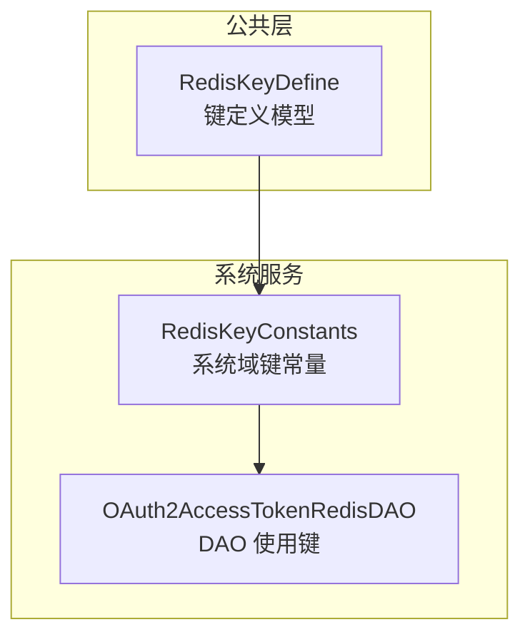
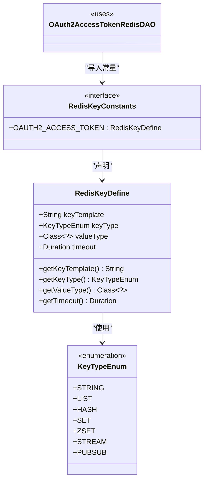
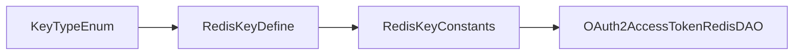

# 缓存键命名规范

<cite>
**本文引用的文件**   
- [RedisKeyDefine.java](file://common/mall-spring-boot-starter-redis/src/main/java/cn/iocoder/mall/redis/core/RedisKeyDefine.java)
- [RedisKeyConstants.java](file://system-service-project/system-service-app/src/main/java/cn/iocoder/mall/systemservice/dal/redis/RedisKeyConstants.java)
- [OAuth2AccessTokenRedisDAO.java](file://system-service-project/system-service-app/src/main/java/cn/iocoder/mall/systemservice/dal/redis/dao/OAuth2AccessTokenRedisDAO.java)
</cite>

## 目录
1. [引言](#引言)
2. [项目结构](#项目结构)
3. [核心组件](#核心组件)
4. [架构总览](#架构总览)
5. [详细组件分析](#详细组件分析)
6. [依赖分析](#依赖分析)
7. [性能考虑](#性能考虑)
8. [故障排查指南](#故障排查指南)
9. [结论](#结论)
10. [附录](#附录)

## 引言
本文件系统性阐述 Onemall 项目的缓存键命名规范与实现机制，重点围绕 RedisKeyDefine 类的设计理念与 KeyTypeEnum 枚举的数据类型支持，详解键模板设计、前缀策略、命名空间隔离、版本控制建议、生命周期管理（过期时间、清理策略、监控告警）以及面向用户、商品、订单等业务场景的最佳实践。文档同时提供可直接落地的键命名示例与代码实现指导路径，帮助团队在多服务、多模块场景下统一规范、降低维护成本。

## 项目结构
Onemall 将“缓存键定义”抽象为通用能力，位于公共模块中；各业务模块通过常量接口集中声明各自缓存键，并在 DAO 层或服务层按需使用。关键位置如下：
- 公共核心：RedisKeyDefine 抽象了键模板、类型、值类型、过期时间等元信息
- 业务常量：RedisKeyConstants 集中声明各业务域的缓存键
- 使用方：DAO 或服务通过导入常量并结合模板生成最终键名

图表来源
- [RedisKeyDefine.java:1-72](file://common/mall-spring-boot-starter-redis/src/main/java/cn/iocoder/mall/redis/core/RedisKeyDefine.java#L1-L72)
- [RedisKeyConstants.java:1-25](file://system-service-project/system-service-app/src/main/java/cn/iocoder/mall/systemservice/dal/redis/RedisKeyConstants.java#L1-L25)
- [OAuth2AccessTokenRedisDAO.java](file://system-service-project/system-service-app/src/main/java/cn/iocoder/mall/systemservice/dal/redis/dao/OAuth2AccessTokenRedisDAO.java)

章节来源
- [RedisKeyDefine.java:1-72](file://common/mall-spring-boot-starter-redis/src/main/java/cn/iocoder/mall/redis/core/RedisKeyDefine.java#L1-L72)
- [RedisKeyConstants.java:1-25](file://system-service-project/system-service-app/src/main/java/cn/iocoder/mall/systemservice/dal/redis/RedisKeyConstants.java#L1-L25)

## 核心组件
- RedisKeyDefine：统一描述缓存键的模板、类型、值类型、过期时间等元信息，便于集中管理与跨模块复用。
- KeyTypeEnum：覆盖常用 Redis 数据类型，支撑字符串、列表、哈希、集合、有序集、流、发布订阅等键语义。
- RedisKeyConstants：业务域键常量接口，集中声明各业务键，明确模板参数与过期策略。
- 使用方（如 DAO）：从常量接口导入键定义，结合模板生成最终键名并执行读写操作。

章节来源
- [RedisKeyDefine.java:10-20](file://common/mall-spring-boot-starter-redis/src/main/java/cn/iocoder/mall/redis/core/RedisKeyDefine.java#L10-L20)
- [RedisKeyConstants.java:15-24](file://system-service-project/system-service-app/src/main/java/cn/iocoder/mall/systemservice/dal/redis/RedisKeyConstants.java#L15-L24)

## 架构总览
下面的类图展示了 RedisKeyDefine 与其关键字段之间的关系，以及业务常量如何引用该定义模型：

图表来源
- [RedisKeyDefine.java:8-71](file://common/mall-spring-boot-starter-redis/src/main/java/cn/iocoder/mall/redis/core/RedisKeyDefine.java#L8-L71)
- [RedisKeyConstants.java:15-24](file://system-service-project/system-service-app/src/main/java/cn/iocoder/mall/systemservice/dal/redis/RedisKeyConstants.java#L15-L24)
- [OAuth2AccessTokenRedisDAO.java](file://system-service-project/system-service-app/src/main/java/cn/iocoder/mall/systemservice/dal/redis/dao/OAuth2AccessTokenRedisDAO.java)

## 详细组件分析

### RedisKeyDefine 设计与实现
- 键模板（keyTemplate）：采用格式化字符串形式，通过占位符承载动态参数，便于在运行时拼接具体键名。
- 键类型（keyType）：通过 KeyTypeEnum 明确 Redis 数据类型，确保上层调用与底层存储语义一致。
- 值类型（valueType）：用于标注缓存值的 Java 类型，便于序列化/反序列化与类型校验。
- 过期时间（timeout）：支持固定时长与“永久不过期”两种策略；其中“永久不过期”以空值表示，便于统一处理。
- 永久不过期常量（TIMEOUT_FOREVER）：提供统一的“永不过期”标记，避免魔法值散落各处。

章节来源
- [RedisKeyDefine.java:22-25](file://common/mall-spring-boot-starter-redis/src/main/java/cn/iocoder/mall/redis/core/RedisKeyDefine.java#L22-L25)
- [RedisKeyDefine.java:28-53](file://common/mall-spring-boot-starter-redis/src/main/java/cn/iocoder/mall/redis/core/RedisKeyDefine.java#L28-L53)
- [RedisKeyDefine.java:55-69](file://common/mall-spring-boot-starter-redis/src/main/java/cn/iocoder/mall/redis/core/RedisKeyDefine.java#L55-L69)

### KeyTypeEnum 支持的数据类型
- 字符串（STRING）
- 列表（LIST）
- 哈希（HASH）
- 集合（SET）
- 有序集（ZSET）
- 流（STREAM）
- 发布订阅（PUBSUB）

这些类型覆盖了 Onemall 常见的缓存使用场景，便于在定义键时明确其语义与操作方式。

章节来源
- [RedisKeyDefine.java:10-20](file://common/mall-spring-boot-starter-redis/src/main/java/cn/iocoder/mall/redis/core/RedisKeyDefine.java#L10-L20)

### 业务键常量：系统域示例
系统域通过 RedisKeyConstants 统一声明缓存键，例如：
- OAuth2 访问令牌键：采用字符串类型，值类型为 OAuth2 访问令牌 DO，过期时间为 2 小时。

该模式体现了“模板 + 类型 + 过期时间”的统一管理，便于后续扩展与治理。

章节来源
- [RedisKeyConstants.java:17-22](file://system-service-project/system-service-app/src/main/java/cn/iocoder/mall/systemservice/dal/redis/RedisKeyConstants.java#L17-L22)

### 使用方：DAO 中的键使用
DAO 通过导入 RedisKeyConstants 中的键定义，结合模板生成最终键名并执行读写。该流程保证了键名的一致性与可追溯性。

章节来源
- [OAuth2AccessTokenRedisDAO.java](file://system-service-project/system-service-app/src/main/java/cn/iocoder/mall/systemservice/dal/redis/dao/OAuth2AccessTokenRedisDAO.java)

### 命名规则与模板设计
- 前缀策略：键模板以领域/模块前缀开头，如“oauth2_access_token:”，清晰标识业务域与对象类型。
- 参数占位：模板使用占位符承载动态参数（如 ID），在运行时通过格式化拼接为完整键名。
- 命名空间隔离：通过前缀区分不同模块与实体，避免键冲突；建议在不同环境（开发/测试/生产）增加环境前缀或后缀以进一步隔离。
- 版本控制：当键结构需要演进时，可在前缀中引入版本号（如 v1_、v2_），并在迁移期间双写兼容，逐步切换。

章节来源
- [RedisKeyConstants.java:22-22](file://system-service-project/system-service-app/src/main/java/cn/iocoder/mall/systemservice/dal/redis/RedisKeyConstants.java#L22-L22)

### 生命周期管理
- 过期时间设置：根据业务特性选择合适的 TTL，如短期令牌（2 小时）、静态配置（较长或永久）、临时验证码（短 TTL）。对于“永久不过期”，仅适用于极少数稳定不变且体量可控的数据。
- 清理策略：对易变数据采用 TTL 自动淘汰；对历史数据可定期归档或删除；对热点数据可配合 LRU 策略与内存上限控制。
- 监控告警：对键数量、命中率、TTL 分布、内存占用进行监控；对异常过期、频繁 miss、键冲突等情况设置告警阈值。

章节来源
- [RedisKeyDefine.java:22-25](file://common/mall-spring-boot-starter-redis/src/main/java/cn/iocoder/mall/redis/core/RedisKeyDefine.java#L22-L25)
- [RedisKeyConstants.java:22-22](file://system-service-project/system-service-app/src/main/java/cn/iocoder/mall/systemservice/dal/redis/RedisKeyConstants.java#L22-L22)

### 不同业务场景下的键命名最佳实践
- 用户相关
  - 登录态：前缀“user_session:<userId>”，类型 STRING，TTL 与登录策略一致
  - 用户信息：前缀“user_info:<userId>”，类型 STRING 或 HASH，TTL 中长期
  - 登录限制：前缀“user_login_limit:<userId>:window”，类型 ZSET，基于时间窗口限流
- 商品相关
  - SPU/SKU 基础信息：前缀“product_spu:<spuId>”、前缀“product_sku:<skuId>”，类型 STRING/HASH，TTL 中长期
  - 商品分类树：前缀“product_category_tree”，类型 HASH，TTL 较长
  - 规格键值：前缀“product_attr_key:<key>”，类型 STRING，TTL 较长
- 订单相关
  - 订单详情：前缀“order_info:<orderId>”，类型 STRING/HASH，TTL 与订单生命周期一致
  - 订单状态变更：前缀“order_status:<orderId>”，类型 HASH，记录状态流转
  - 退款/售后：前缀“order_aftersale:<orderId>”，类型 HASH，TTL 与售后周期一致

说明：以上为示例性命名建议，具体实现应结合业务数据结构与访问模式确定键类型与过期策略。

### 实际键命名示例与实现指导
- 示例键模板
  - “oauth2_access_token:%s”
  - “user_session:%d”
  - “product_spu:%d”
  - “order_info:%s”
- 实现指导
  - 在业务模块内新增 RedisKeyConstants 接口，集中声明键定义
  - 在 DAO 或服务中导入对应键定义，使用模板与参数生成最终键名
  - 对于需要分布式锁的场景，键定义的值类型可指向 Lock 类型（注释已给出说明）

章节来源
- [RedisKeyConstants.java:17-22](file://system-service-project/system-service-app/src/main/java/cn/iocoder/mall/systemservice/dal/redis/RedisKeyConstants.java#L17-L22)
- [RedisKeyDefine.java:36-46](file://common/mall-spring-boot-starter-redis/src/main/java/cn/iocoder/mall/redis/core/RedisKeyDefine.java#L36-L46)

## 依赖分析
- RedisKeyDefine 与 KeyTypeEnum：前者依赖后者以表达键的底层数据类型语义
- RedisKeyConstants：依赖 RedisKeyDefine 提供的定义模型，集中声明各业务键
- OAuth2AccessTokenRedisDAO：依赖 RedisKeyConstants 获取键定义，用于实际的缓存读写

图表来源
- [RedisKeyDefine.java:10-20](file://common/mall-spring-boot-starter-redis/src/main/java/cn/iocoder/mall/redis/core/RedisKeyDefine.java#L10-L20)
- [RedisKeyConstants.java:15-24](file://system-service-project/system-service-app/src/main/java/cn/iocoder/mall/systemservice/dal/redis/RedisKeyConstants.java#L15-L24)
- [OAuth2AccessTokenRedisDAO.java](file://system-service-project/system-service-app/src/main/java/cn/iocoder/mall/systemservice/dal/redis/dao/OAuth2AccessTokenRedisDAO.java)

章节来源
- [RedisKeyDefine.java:10-20](file://common/mall-spring-boot-starter-redis/src/main/java/cn/iocoder/mall/redis/core/RedisKeyDefine.java#L10-L20)
- [RedisKeyConstants.java:15-24](file://system-service-project/system-service-app/src/main/java/cn/iocoder/mall/systemservice/dal/redis/RedisKeyConstants.java#L15-L24)
- [OAuth2AccessTokenRedisDAO.java](file://system-service-project/system-service-app/src/main/java/cn/iocoder/mall/systemservice/dal/redis/dao/OAuth2AccessTokenRedisDAO.java)

## 性能考虑
- 键设计简洁：前缀尽量短而明确，减少键长度带来的网络与内存开销
- 类型匹配：根据访问模式选择合适的数据类型，避免不必要的转换
- 过期策略：热点数据设置合理 TTL，防止过期风暴；冷数据采用更短 TTL
- 命名空间隔离：通过前缀与版本控制避免键冲突，提升运维效率
- 监控与告警：建立键数量、命中率、TTL 分布等指标，及时发现异常

## 故障排查指南
- 键冲突：检查前缀是否唯一，必要时引入版本号或环境后缀
- 类型不匹配：核对 KeyTypeEnum 与实际操作是否一致，避免误用导致异常
- 过期异常：确认 timeout 设置是否符合预期；对“永久不过期”场景注意容量与更新策略
- 使用方问题：检查 DAO 是否正确导入 RedisKeyConstants 并正确拼接模板参数

章节来源
- [RedisKeyDefine.java:22-25](file://common/mall-spring-boot-starter-redis/src/main/java/cn/iocoder/mall/redis/core/RedisKeyDefine.java#L22-L25)
- [RedisKeyConstants.java:17-22](file://system-service-project/system-service-app/src/main/java/cn/iocoder/mall/systemservice/dal/redis/RedisKeyConstants.java#L17-L22)

## 结论
通过 RedisKeyDefine 与 KeyTypeEnum 的抽象，Onemall 在公共层提供了统一的缓存键定义模型；通过 RedisKeyConstants 的集中管理，业务域实现了键命名的规范化与可维护性。结合前缀策略、命名空间隔离、版本控制与生命周期管理，团队可以在多服务、多模块场景下高效构建稳定可靠的缓存体系。建议在新业务接入时遵循本文规范，逐步完善监控与告警体系，持续优化键设计与过期策略。

## 附录
- 关键实现路径参考
  - 键定义模型：[RedisKeyDefine.java:8-71](file://common/mall-spring-boot-starter-redis/src/main/java/cn/iocoder/mall/redis/core/RedisKeyDefine.java#L8-L71)
  - 业务键常量示例：[RedisKeyConstants.java:15-24](file://system-service-project/system-service-app/src/main/java/cn/iocoder/mall/systemservice/dal/redis/RedisKeyConstants.java#L15-L24)
  - 使用方示例：[OAuth2AccessTokenRedisDAO.java](file://system-service-project/system-service-app/src/main/java/cn/iocoder/mall/systemservice/dal/redis/dao/OAuth2AccessTokenRedisDAO.java)