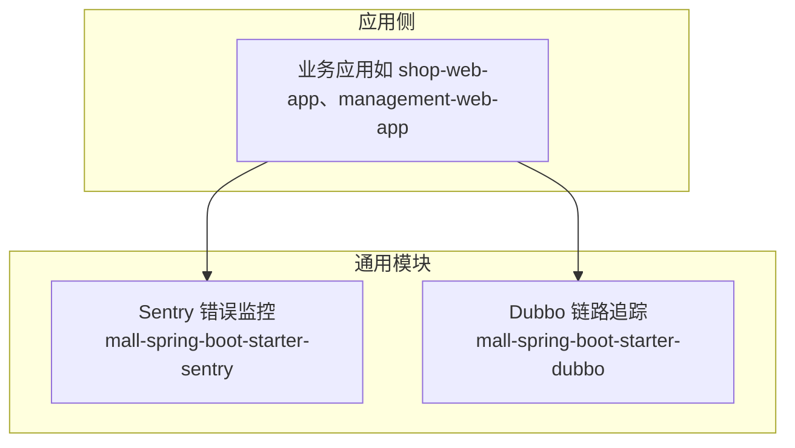
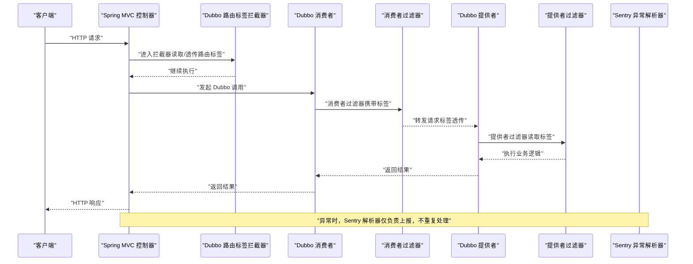
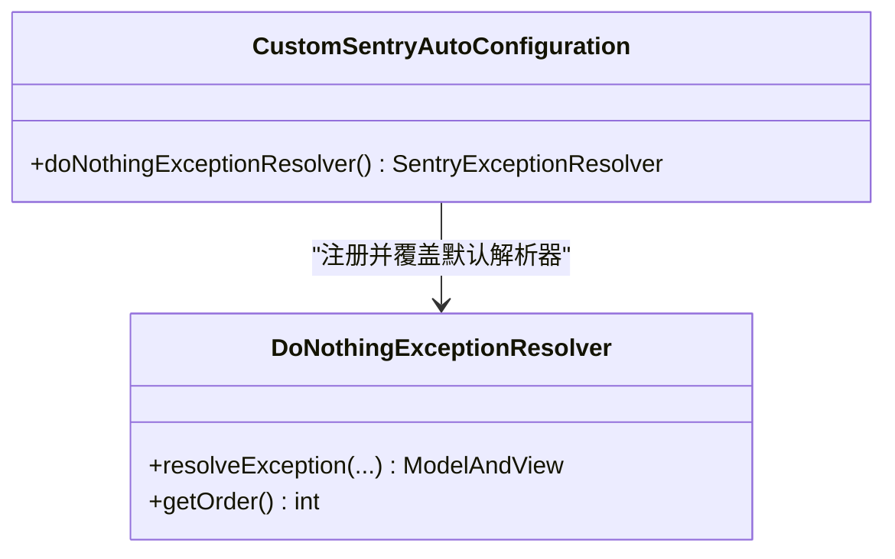
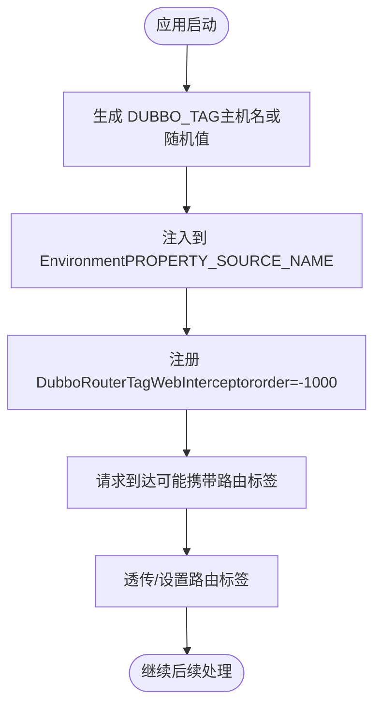
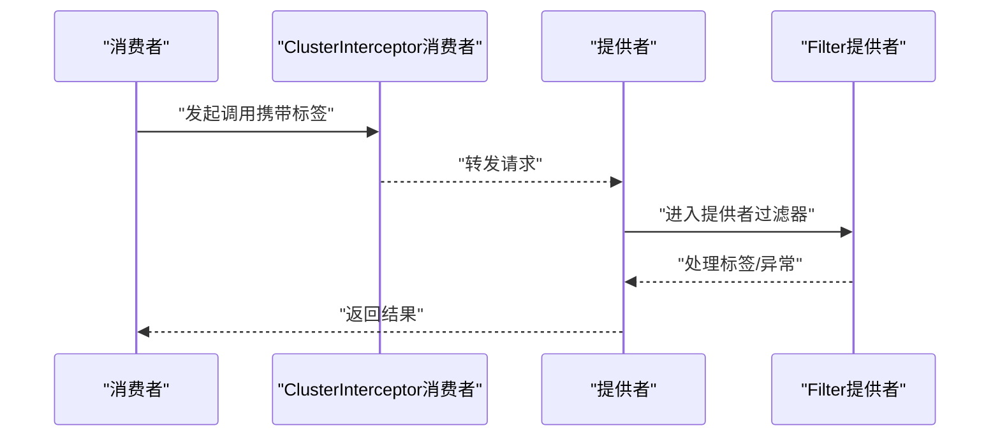
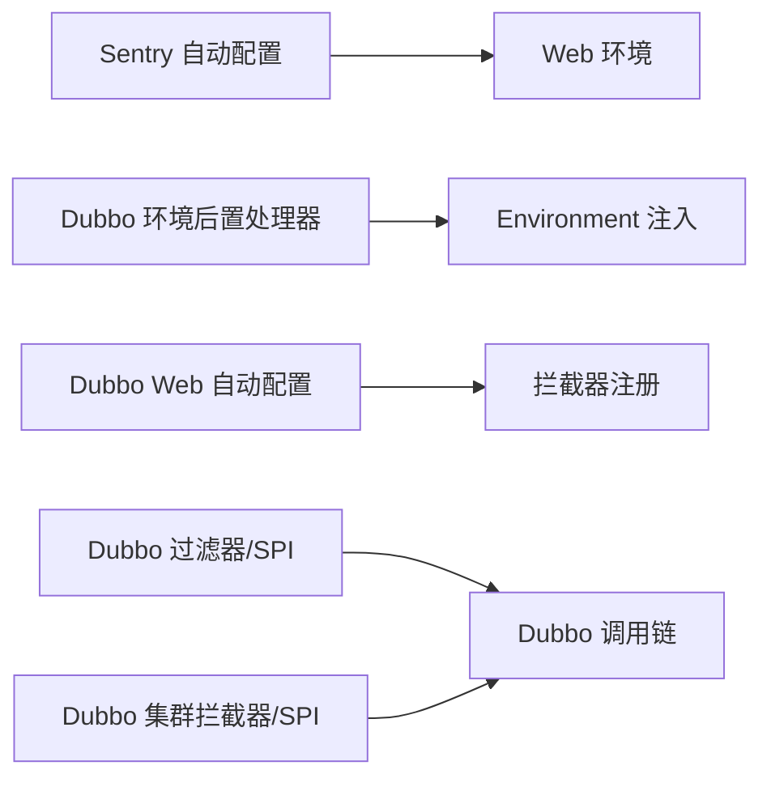

# 分布式链路追踪

<cite>
**本文引用的文件**   
- [CustomSentryAutoConfiguration.java](file://common/mall-spring-boot-starter-sentry/src/main/java/cn/iocoder/mall/sentry/config/CustomSentryAutoConfiguration.java)
- [DoNothingExceptionResolver.java](file://common/mall-spring-boot-starter-sentry/src/main/java/cn/iocoder/mall/sentry/resolver/DoNothingExceptionResolver.java)
- [DubboEnvironmentPostProcessor.java](file://common/mall-spring-boot-starter-dubbo/src/main/java/cn/iocoder/mall/dubbo/config/DubboEnvironmentPostProcessor.java)
- [DubboWebAutoConfiguration.java](file://common/mall-spring-boot-starter-dubbo/src/main/java/cn/iocoder/mall/dubbo/config/DubboWebAutoConfiguration.java)
- [spring.factories（Dubbo）](file://common/mall-spring-boot-starter-dubbo/src/main/resources/META-INF/spring.factories)
- [com.alibaba.dubbo.rpc.Filter](file://common/mall-spring-boot-starter-dubbo/src/main/resources/META-INF/dubbo/com.alibaba.dubbo.rpc.Filter)
- [org.apache.dubbo.rpc.cluster.interceptor.ClusterInterceptor](file://common/mall-spring-boot-starter-dubbo/src/main/resources/META-INF/dubbo/org.apache.dubbo.rpc.cluster.interceptor.ClusterInterceptor)
</cite>

## 目录
1. [简介](#简介)
2. [项目结构](#项目结构)
3. [核心组件](#核心组件)
4. [架构总览](#架构总览)
5. [详细组件分析](#详细组件分析)
6. [依赖分析](#依赖分析)
7. [性能考虑](#性能考虑)
8. [故障排查指南](#故障排查指南)
9. [结论](#结论)
10. [附录](#附录)

## 简介
本技术文档面向 Onemall 分布式链路追踪系统，聚焦以下目标：
- 基于 Sentry 的错误监控集成与全局异常处理策略，避免日志 appender 与全局异常解析器重复上报。
- 基于 Dubbo 的链路追踪：过滤器与集群拦截器配置、路由标签传递、消费者与提供者之间的链路关联。
- 基于 Spring MVC 的请求追踪：拦截器配置、请求参数记录、响应时间统计等能力的启用方式。

文档提供可落地的配置示例与代码片段路径，帮助在不同组件中快速启用链路追踪功能，并给出常见问题排查与性能优化建议。

## 项目结构
围绕链路追踪的关键模块分布于通用 starter 中：
- 错误监控（Sentry）：位于 mall-spring-boot-starter-sentry，提供自动装配与异常解析器覆盖。
- Dubbo 链路追踪：位于 mall-spring-boot-starter-dubbo，提供环境后置处理器、Web 拦截器以及 Dubbo 过滤器与集群拦截器的 SPI 注册。

**图表来源**
- [spring.factories（Dubbo）:1-6](file://common/mall-spring-boot-starter-dubbo/src/main/resources/META-INF/spring.factories#L1-L6)

**章节来源**
- [spring.factories（Dubbo）:1-6](file://common/mall-spring-boot-starter-dubbo/src/main/resources/META-INF/spring.factories#L1-L6)

## 核心组件
- Sentry 自动配置与异常解析器覆盖：通过条件化装配与 Bean 定义，避免与默认 Sentry Starter 的异常解析器冲突，解决重复上报问题。
- Dubbo 环境后置处理器：自动生成并注入 DUBBO_TAG 属性，用于提供者侧路由标签。
- Dubbo Web 自动配置：注册基于 Dubbo 路由标签的 Web 拦截器，实现请求头中的路由标签透传。
- Dubbo 过滤器与集群拦截器：提供消费者侧与提供者侧的链路标签传递与路由控制。

**章节来源**
- [CustomSentryAutoConfiguration.java:1-40](file://common/mall-spring-boot-starter-sentry/src/main/java/cn/iocoder/mall/sentry/config/CustomSentryAutoConfiguration.java#L1-L40)
- [DoNothingExceptionResolver.java:1-32](file://common/mall-spring-boot-starter-sentry/src/main/java/cn/iocoder/mall/sentry/resolver/DoNothingExceptionResolver.java#L1-L32)
- [DubboEnvironmentPostProcessor.java:1-67](file://common/mall-spring-boot-starter-dubbo/src/main/java/cn/iocoder/mall/dubbo/config/DubboEnvironmentPostProcessor.java#L1-L67)
- [DubboWebAutoConfiguration.java:1-32](file://common/mall-spring-boot-starter-dubbo/src/main/java/cn/iocoder/mall/dubbo/config/DubboWebAutoConfiguration.java#L1-L32)
- [com.alibaba.dubbo.rpc.Filter:1-3](file://common/mall-spring-boot-starter-dubbo/src/main/resources/META-INF/dubbo/com.alibaba.dubbo.rpc.Filter#L1-L3)
- [org.apache.dubbo.rpc.cluster.interceptor.ClusterInterceptor:1-2](file://common/mall-spring-boot-starter-dubbo/src/main/resources/META-INF/dubbo/org.apache.dubbo.rpc.cluster.interceptor.ClusterInterceptor#L1-L2)

## 架构总览
下图展示了链路追踪在应用中的关键交互：Sentry 异常解析器覆盖、Dubbo 环境标签生成、Web 拦截器透传、Dubbo 过滤器与集群拦截器在消费者/提供者间传递标签。

**图表来源**
- [DubboWebAutoConfiguration.java:1-32](file://common/mall-spring-boot-starter-dubbo/src/main/java/cn/iocoder/mall/dubbo/config/DubboWebAutoConfiguration.java#L1-L32)
- [com.alibaba.dubbo.rpc.Filter:1-3](file://common/mall-spring-boot-starter-dubbo/src/main/resources/META-INF/dubbo/com.alibaba.dubbo.rpc.Filter#L1-L3)
- [org.apache.dubbo.rpc.cluster.interceptor.ClusterInterceptor:1-2](file://common/mall-spring-boot-starter-dubbo/src/main/resources/META-INF/dubbo/org.apache.dubbo.rpc.cluster.interceptor.ClusterInterceptor#L1-L2)
- [CustomSentryAutoConfiguration.java:1-40](file://common/mall-spring-boot-starter-sentry/src/main/java/cn/iocoder/mall/sentry/config/CustomSentryAutoConfiguration.java#L1-L40)

## 详细组件分析

### Sentry 错误监控与全局异常处理
- 目标：避免使用日志 appender 与全局异常解析器同时上报导致的重复上报。
- 实现要点：
  - 条件化装配：仅当 Web 应用且 sentry.enabled=true 时生效。
  - Bean 覆盖：在存在 SentryAutoConfiguration 且缺失 SentryExceptionResolver 时，注册 DoNothingExceptionResolver，使其不实际处理异常，交由后续解析器处理。
  - 顺序控制：设置较低优先级，确保其他异常解析器有机会处理。

**图表来源**
- [CustomSentryAutoConfiguration.java:1-40](file://common/mall-spring-boot-starter-sentry/src/main/java/cn/iocoder/mall/sentry/config/CustomSentryAutoConfiguration.java#L1-L40)
- [DoNothingExceptionResolver.java:1-32](file://common/mall-spring-boot-starter-sentry/src/main/java/cn/iocoder/mall/sentry/resolver/DoNothingExceptionResolver.java#L1-L32)

**章节来源**
- [CustomSentryAutoConfiguration.java:1-40](file://common/mall-spring-boot-starter-sentry/src/main/java/cn/iocoder/mall/sentry/config/CustomSentryAutoConfiguration.java#L1-L40)
- [DoNothingExceptionResolver.java:1-32](file://common/mall-spring-boot-starter-sentry/src/main/java/cn/iocoder/mall/sentry/resolver/DoNothingExceptionResolver.java#L1-L32)

### Dubbo 链路追踪：环境标签与 Web 拦截器
- 环境标签生成：启动时根据主机名生成 DUBBO_TAG 并注入到 Environment，作为提供者侧路由标签的基础。
- Web 拦截器：注册 DubboRouterTagWebInterceptor，设置极低 order，确保在认证等拦截器之前处理，从请求头读取/写入路由标签，实现标签透传。

**图表来源**
- [DubboEnvironmentPostProcessor.java:1-67](file://common/mall-spring-boot-starter-dubbo/src/main/java/cn/iocoder/mall/dubbo/config/DubboEnvironmentPostProcessor.java#L1-L67)
- [DubboWebAutoConfiguration.java:1-32](file://common/mall-spring-boot-starter-dubbo/src/main/java/cn/iocoder/mall/dubbo/config/DubboWebAutoConfiguration.java#L1-L32)

**章节来源**
- [DubboEnvironmentPostProcessor.java:1-67](file://common/mall-spring-boot-starter-dubbo/src/main/java/cn/iocoder/mall/dubbo/config/DubboEnvironmentPostProcessor.java#L1-L67)
- [DubboWebAutoConfiguration.java:1-32](file://common/mall-spring-boot-starter-dubbo/src/main/java/cn/iocoder/mall/dubbo/config/DubboWebAutoConfiguration.java#L1-L32)

### Dubbo 链路追踪：过滤器与集群拦截器
- 过滤器（提供者侧）：通过 SPI 注册 DubboProviderExceptionFilter 与 DubboProviderRouterTagFilter，用于异常捕获与路由标签透传。
- 集群拦截器（消费者侧）：通过 SPI 注册 DubboConsumerRouterTagClusterInterceptor，用于在消费者端携带标签参与路由决策。

**图表来源**
- [com.alibaba.dubbo.rpc.Filter:1-3](file://common/mall-spring-boot-starter-dubbo/src/main/resources/META-INF/dubbo/com.alibaba.dubbo.rpc.Filter#L1-L3)
- [org.apache.dubbo.rpc.cluster.interceptor.ClusterInterceptor:1-2](file://common/mall-spring-boot-starter-dubbo/src/main/resources/META-INF/dubbo/org.apache.dubbo.rpc.cluster.interceptor.ClusterInterceptor#L1-L2)

**章节来源**
- [com.alibaba.dubbo.rpc.Filter:1-3](file://common/mall-spring-boot-starter-dubbo/src/main/resources/META-INF/dubbo/com.alibaba.dubbo.rpc.Filter#L1-L3)
- [org.apache.dubbo.rpc.cluster.interceptor.ClusterInterceptor:1-2](file://common/mall-spring-boot-starter-dubbo/src/main/resources/META-INF/dubbo/org.apache.dubbo.rpc.cluster.interceptor.ClusterInterceptor#L1-L2)

### Spring MVC 控制器层请求追踪（启用方式）
- 启用方式：通过 DubboWebAutoConfiguration 注册 DubboRouterTagWebInterceptor，即可在 Web 层实现请求头路由标签的读取与透传，从而支撑链路追踪。
- 扩展点：可在拦截器中记录请求参数、统计响应时间等，以满足请求追踪需求。

**章节来源**
- [DubboWebAutoConfiguration.java:1-32](file://common/mall-spring-boot-starter-dubbo/src/main/java/cn/iocoder/mall/dubbo/config/DubboWebAutoConfiguration.java#L1-L32)

## 依赖分析
- 组件耦合：
  - Sentry 自动配置对 Web 环境与 sentry.enabled 属性敏感，避免在非 Web 或禁用场景下引入。
  - Dubbo 环境后置处理器与 Web 自动配置相互独立但共同作用于 Dubbo 标签的生成与透传。
- 外部依赖：
  - Dubbo 过滤器与集群拦截器通过 META-INF/spring.factories 与 META-INF/dubbo/* 注册，遵循 Spring Boot 与 Dubbo SPI 规范。

**图表来源**
- [spring.factories（Dubbo）:1-6](file://common/mall-spring-boot-starter-dubbo/src/main/resources/META-INF/spring.factories#L1-L6)
- [com.alibaba.dubbo.rpc.Filter:1-3](file://common/mall-spring-boot-starter-dubbo/src/main/resources/META-INF/dubbo/com.alibaba.dubbo.rpc.Filter#L1-L3)
- [org.apache.dubbo.rpc.cluster.interceptor.ClusterInterceptor:1-2](file://common/mall-spring-boot-starter-dubbo/src/main/resources/META-INF/dubbo/org.apache.dubbo.rpc.cluster.interceptor.ClusterInterceptor#L1-L2)

**章节来源**
- [spring.factories（Dubbo）:1-6](file://common/mall-spring-boot-starter-dubbo/src/main/resources/META-INF/spring.factories#L1-L6)

## 性能考虑
- 过滤器与拦截器顺序：将 Dubbo 路由标签拦截器设置为较低 order，确保其在认证等前置逻辑前执行，减少无效处理。
- 异常解析器优先级：DoNothingExceptionResolver 使用最小优先级，避免阻塞后续异常处理链路。
- 标签生成策略：DUBBO_TAG 采用主机名生成，若不可用则回退为随机值，保证唯一性与可用性。

[本节为通用性能建议，无需特定文件引用]

## 故障排查指南
- Sentry 重复上报：
  - 现象：同一异常被多次上报。
  - 排查：确认是否同时启用了日志 appender 与全局异常解析器；检查 sentry.enabled 是否开启；验证 DoNothingExceptionResolver 是否成功注册。
  - 参考：
    - [CustomSentryAutoConfiguration.java:1-40](file://common/mall-spring-boot-starter-sentry/src/main/java/cn/iocoder/mall/sentry/config/CustomSentryAutoConfiguration.java#L1-L40)
    - [DoNothingExceptionResolver.java:1-32](file://common/mall-spring-boot-starter-sentry/src/main/java/cn/iocoder/mall/sentry/resolver/DoNothingExceptionResolver.java#L1-L32)
- Dubbo 路由标签未生效：
  - 现象：请求未按预期路由至指定提供者。
  - 排查：确认 DUBBO_TAG 是否正确注入到 Environment；检查 Web 拦截器是否注册成功；核对请求头中路由标签是否透传。
  - 参考：
    - [DubboEnvironmentPostProcessor.java:1-67](file://common/mall-spring-boot-starter-dubbo/src/main/java/cn/iocoder/mall/dubbo/config/DubboEnvironmentPostProcessor.java#L1-L67)
    - [DubboWebAutoConfiguration.java:1-32](file://common/mall-spring-boot-starter-dubbo/src/main/java/cn/iocoder/mall/dubbo/config/DubboWebAutoConfiguration.java#L1-L32)
- Dubbo 过滤器/拦截器未加载：
  - 现象：链路标签未在消费者/提供者侧传递。
  - 排查：确认 META-INF/dubbo/* 与 spring.factories 是否存在；检查 Dubbo 版本兼容性（com.alibaba.dubbo 与 org.apache.dubbo）。
  - 参考：
    - [com.alibaba.dubbo.rpc.Filter:1-3](file://common/mall-spring-boot-starter-dubbo/src/main/resources/META-INF/dubbo/com.alibaba.dubbo.rpc.Filter#L1-L3)
    - [org.apache.dubbo.rpc.cluster.interceptor.ClusterInterceptor:1-2](file://common/mall-spring-boot-starter-dubbo/src/main/resources/META-INF/dubbo/org.apache.dubbo.rpc.cluster.interceptor.ClusterInterceptor#L1-L2)
    - [spring.factories（Dubbo）:1-6](file://common/mall-spring-boot-starter-dubbo/src/main/resources/META-INF/spring.factories#L1-L6)

**章节来源**
- [CustomSentryAutoConfiguration.java:1-40](file://common/mall-spring-boot-starter-sentry/src/main/java/cn/iocoder/mall/sentry/config/CustomSentryAutoConfiguration.java#L1-L40)
- [DoNothingExceptionResolver.java:1-32](file://common/mall-spring-boot-starter-sentry/src/main/java/cn/iocoder/mall/sentry/resolver/DoNothingExceptionResolver.java#L1-L32)
- [DubboEnvironmentPostProcessor.java:1-67](file://common/mall-spring-boot-starter-dubbo/src/main/java/cn/iocoder/mall/dubbo/config/DubboEnvironmentPostProcessor.java#L1-L67)
- [DubboWebAutoConfiguration.java:1-32](file://common/mall-spring-boot-starter-dubbo/src/main/java/cn/iocoder/mall/dubbo/config/DubboWebAutoConfiguration.java#L1-L32)
- [com.alibaba.dubbo.rpc.Filter:1-3](file://common/mall-spring-boot-starter-dubbo/src/main/resources/META-INF/dubbo/com.alibaba.dubbo.rpc.Filter#L1-L3)
- [org.apache.dubbo.rpc.cluster.interceptor.ClusterInterceptor:1-2](file://common/mall-spring-boot-starter-dubbo/src/main/resources/META-INF/dubbo/org.apache.dubbo.rpc.cluster.interceptor.ClusterInterceptor#L1-L2)
- [spring.factories（Dubbo）:1-6](file://common/mall-spring-boot-starter-dubbo/src/main/resources/META-INF/spring.factories#L1-L6)

## 结论
通过 Sentry 的异常解析器覆盖与 Dubbo 的环境标签生成、Web 拦截器、过滤器与集群拦截器，Onemall 已形成一套可复用的分布式链路追踪能力。在应用侧只需引入对应 starter，即可快速启用异常监控与 Dubbo 调用链路的标签透传与路由控制。建议结合业务场景扩展请求参数记录与响应时间统计，进一步完善请求级追踪。

[本节为总结性内容，无需特定文件引用]

## 附录
- 配置示例（路径参考）：
  - 开启 Sentry：在应用配置中设置 sentry.enabled=true。
    - 参考：[CustomSentryAutoConfiguration.java:1-40](file://common/mall-spring-boot-starter-sentry/src/main/java/cn/iocoder/mall/sentry/config/CustomSentryAutoConfiguration.java#L1-L40)
  - 启用 Dubbo Web 拦截器：引入 mall-spring-boot-starter-dubbo 后自动生效。
    - 参考：[DubboWebAutoConfiguration.java:1-32](file://common/mall-spring-boot-starter-dubbo/src/main/java/cn/iocoder/mall/dubbo/config/DubboWebAutoConfiguration.java#L1-L32)
  - 生成 DUBBO_TAG：启动时自动注入。
    - 参考：[DubboEnvironmentPostProcessor.java:1-67](file://common/mall-spring-boot-starter-dubbo/src/main/java/cn/iocoder/mall/dubbo/config/DubboEnvironmentPostProcessor.java#L1-L67)
  - 注册 Dubbo 过滤器与集群拦截器：通过 META-INF/spring.factories 与 META-INF/dubbo/*。
    - 参考：
      - [spring.factories（Dubbo）:1-6](file://common/mall-spring-boot-starter-dubbo/src/main/resources/META-INF/spring.factories#L1-L6)
      - [com.alibaba.dubbo.rpc.Filter:1-3](file://common/mall-spring-boot-starter-dubbo/src/main/resources/META-INF/dubbo/com.alibaba.dubbo.rpc.Filter#L1-L3)
      - [org.apache.dubbo.rpc.cluster.interceptor.ClusterInterceptor:1-2](file://common/mall-spring-boot-starter-dubbo/src/main/resources/META-INF/dubbo/org.apache.dubbo.rpc.cluster.interceptor.ClusterInterceptor#L1-L2)