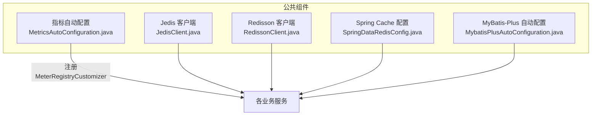
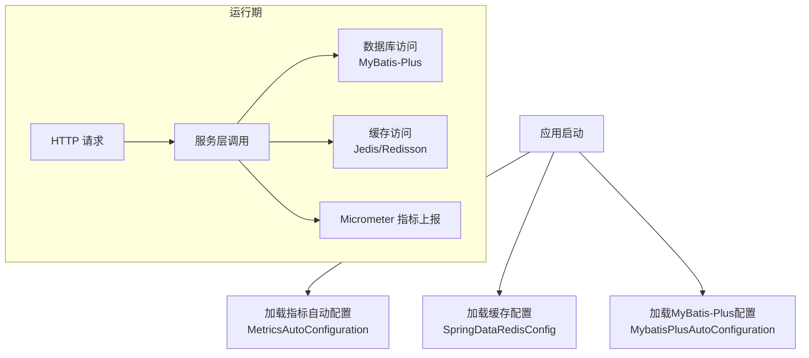
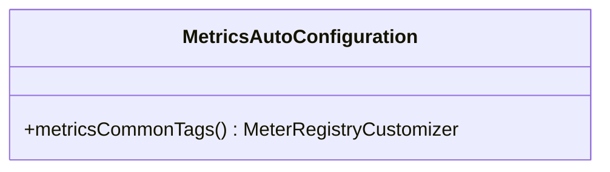
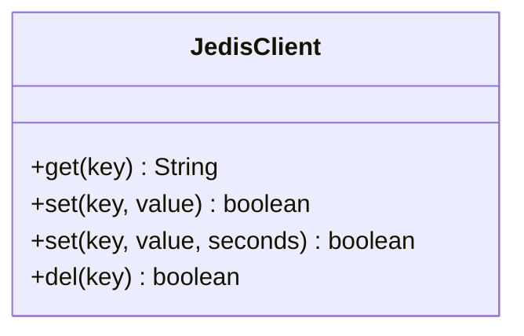
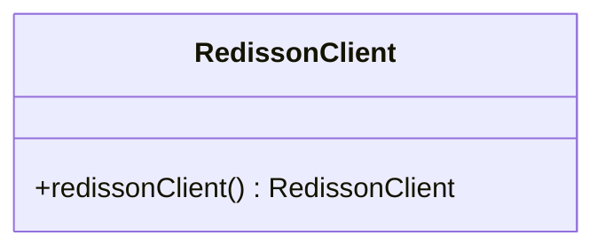
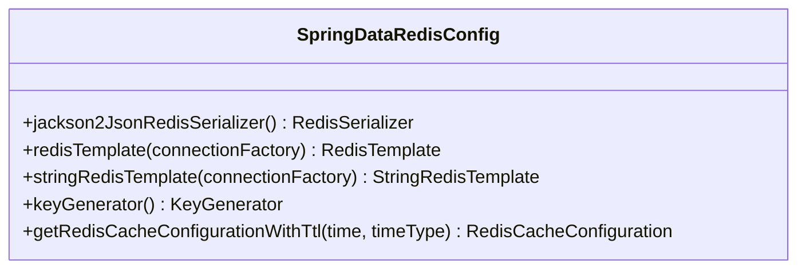
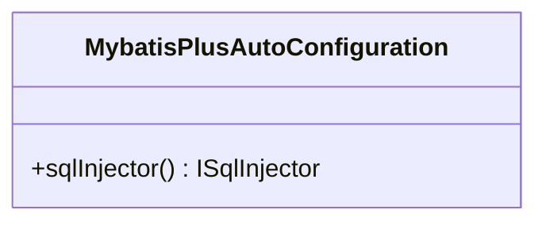
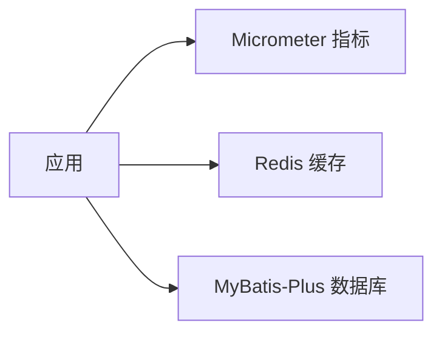

# 性能监控与优化

<cite>
**本文引用的文件**
- [MetricsAutoConfiguration.java](file://common/mall-spring-boot/src/main/java/cn/iocoder/mall/spring/boot/metrics/MetricsAutoConfiguration.java)
- [JedisClient.java](file://common/mall-spring-boot-starter-cache/src/main/java/cn/iocoder/mall/cache/config/JedisClient.java)
- [RedissonClient.java](file://common/mall-spring-boot-starter-cache/src/main/java/cn/iocoder/mall/cache/config/RedissonClient.java)
- [SpringDataRedisConfig.java](file://common/mall-spring-boot-starter-cache/src/main/java/cn/iocoder/mall/cache/config/SpringDataRedisConfig.java)
- [MybatisPlusAutoConfiguration.java](file://common/mall-spring-boot-starter-mybatis/src/main/java/cn/iocoder/mall/mybatis/config/MybatisPlusAutoConfiguration.java)
</cite>

## 目录
1. [引言](#引言)
2. [项目结构](#项目结构)
3. [核心组件](#核心组件)
4. [架构总览](#架构总览)
5. [详细组件分析](#详细组件分析)
6. [依赖分析](#依赖分析)
7. [性能考虑](#性能考虑)
8. [故障排查指南](#故障排查指南)
9. [结论](#结论)
10. [附录](#附录)

## 引言
本文件面向Onemall的性能监控与优化体系，聚焦于应用性能指标采集（接口响应时间分布、数据库查询性能、缓存命中率、线程池使用情况）、性能瓶颈识别方法（慢查询分析、内存泄漏检测、并发问题排查）、优化策略（数据库优化、缓存策略优化、代码性能优化、资源配置优化）、性能测试方法与工具（压力测试、负载测试、容量规划）、性能监控仪表板配置以及性能问题诊断流程与案例。文档以仓库现有实现为基础，结合通用最佳实践，帮助研发与运维团队建立系统化的性能治理能力。

## 项目结构
Onemall采用多模块微服务架构，性能相关能力主要分布在以下位置：
- 指标采集与标签：通过公共starter中的自动配置暴露Micrometer指标，并统一添加应用名标签。
- 缓存层：同时支持Jedis与Redisson两种客户端，提供基于哨兵的高可用连接；Spring Cache集成提供统一的缓存抽象。
- ORM层：MyBatis-Plus自动装配，便于扩展SQL注入器等能力，为后续慢SQL治理提供基础。

图表来源
- [MetricsAutoConfiguration.java:11-24](file://common/mall-spring-boot/src/main/java/cn/iocoder/mall/spring/boot/metrics/MetricsAutoConfiguration.java#L11-L24)
- [JedisClient.java:14-79](file://common/mall-spring-boot-starter-cache/src/main/java/cn/iocoder/mall/cache/config/JedisClient.java#L14-L79)
- [RedissonClient.java:19-50](file://common/mall-spring-boot-starter-cache/src/main/java/cn/iocoder/mall/cache/config/RedissonClient.java#L19-L50)
- [SpringDataRedisConfig.java:37-165](file://common/mall-spring-boot-starter-cache/src/main/java/cn/iocoder/mall/cache/config/SpringDataRedisConfig.java#L37-L165)
- [MybatisPlusAutoConfiguration.java:12-23](file://common/mall-spring-boot-starter-mybatis/src/main/java/cn/iocoder/mall/mybatis/config/MybatisPlusAutoConfiguration.java#L12-L23)

章节来源
- [MetricsAutoConfiguration.java:11-24](file://common/mall-spring-boot/src/main/java/cn/iocoder/mall/spring/boot/metrics/MetricsAutoConfiguration.java#L11-L24)
- [SpringDataRedisConfig.java:37-165](file://common/mall-spring-boot-starter-cache/src/main/java/cn/iocoder/mall/cache/config/SpringDataRedisConfig.java#L37-L165)
- [MybatisPlusAutoConfiguration.java:12-23](file://common/mall-spring-boot-starter-mybatis/src/main/java/cn/iocoder/mall/mybatis/config/MybatisPlusAutoConfiguration.java#L12-L23)

## 核心组件
- 指标与标签
  - 通过条件化配置启用Micrometer指标，并在MeterRegistry上设置commonTags，统一打上应用名标签，便于跨服务聚合与对比。
- 缓存层
  - JedisClient：基于哨兵池的同步阻塞式访问，提供get/set/del等常用操作封装。
  - RedissonClient：基于哨兵的Redisson客户端，支持读从模式，适合高可用场景。
  - SpringDataRedisConfig：开启@EnableCaching，提供RedisTemplate、StringRedisTemplate、Jackson序列化器、自定义KeyGenerator及缓存TTL配置。
- ORM层
  - MyBatis-Plus自动装配：注册自定义ISqlInjector扩展点，为后续SQL治理与慢查询治理提供扩展入口。

章节来源
- [MetricsAutoConfiguration.java:16-22](file://common/mall-spring-boot/src/main/java/cn/iocoder/mall/spring/boot/metrics/MetricsAutoConfiguration.java#L16-L22)
- [JedisClient.java:19-76](file://common/mall-spring-boot-starter-cache/src/main/java/cn/iocoder/mall/cache/config/JedisClient.java#L19-L76)
- [RedissonClient.java:35-49](file://common/mall-spring-boot-starter-cache/src/main/java/cn/iocoder/mall/cache/config/RedissonClient.java#L35-L49)
- [SpringDataRedisConfig.java:114-163](file://common/mall-spring-boot-starter-cache/src/main/java/cn/iocoder/mall/cache/config/SpringDataRedisConfig.java#L114-L163)
- [MybatisPlusAutoConfiguration.java:18-22](file://common/mall-spring-boot-starter-mybatis/src/main/java/cn/iocoder/mall/mybatis/config/MybatisPlusAutoConfiguration.java#L18-L22)

## 架构总览
下图展示了性能监控与优化的关键交互路径：应用启动时加载指标配置与缓存配置；业务请求通过控制器进入服务层，期间可触发数据库访问与缓存读写；所有指标通过MeterRegistry统一上报。

图表来源
- [MetricsAutoConfiguration.java:11-24](file://common/mall-spring-boot/src/main/java/cn/iocoder/mall/spring/boot/metrics/MetricsAutoConfiguration.java#L11-L24)
- [SpringDataRedisConfig.java:37-165](file://common/mall-spring-boot-starter-cache/src/main/java/cn/iocoder/mall/cache/config/SpringDataRedisConfig.java#L37-L165)
- [MybatisPlusAutoConfiguration.java:12-23](file://common/mall-spring-boot-starter-mybatis/src/main/java/cn/iocoder/mall/mybatis/config/MybatisPlusAutoConfiguration.java#L12-L23)

## 详细组件分析

### 指标与标签组件
- 设计要点
  - 条件化启用：仅当存在MeterRegistryCustomizer类且management.metrics.enable为true时生效。
  - 统一标签：将spring.application.name作为commonTag，便于跨实例聚合。
- 性能意义
  - 为后续Prometheus/Grafana等监控平台提供标准化指标维度，支撑SLA与告警。

图表来源
- [MetricsAutoConfiguration.java:11-24](file://common/mall-spring-boot/src/main/java/cn/iocoder/mall/spring/boot/metrics/MetricsAutoConfiguration.java#L11-L24)

章节来源
- [MetricsAutoConfiguration.java:16-22](file://common/mall-spring-boot/src/main/java/cn/iocoder/mall/spring/boot/metrics/MetricsAutoConfiguration.java#L16-L22)

### 缓存组件（Jedis）
- 设计要点
  - 使用JedisSentinelPool获取资源，finally中确保jedis.close()释放连接。
  - 提供get/set/del等基础操作，set支持带过期时间。
- 性能意义
  - 同步阻塞模型简单可靠，适合对延迟敏感但并发量可控的场景；需关注连接池大小与超时配置。

图表来源
- [JedisClient.java:14-79](file://common/mall-spring-boot-starter-cache/src/main/java/cn/iocoder/mall/cache/config/JedisClient.java#L14-L79)

章节来源
- [JedisClient.java:19-76](file://common/mall-spring-boot-starter-cache/src/main/java/cn/iocoder/mall/cache/config/JedisClient.java#L19-L76)

### 缓存组件（Redisson）
- 设计要点
  - 基于哨兵模式，支持读从（SLAVE）提升读性能。
  - 自动处理节点地址格式，兼容是否包含协议前缀。
- 性能意义
  - 分布式锁、限流等高级特性适合高并发场景；读从模式降低主库压力。

图表来源
- [RedissonClient.java:19-50](file://common/mall-spring-boot-starter-cache/src/main/java/cn/iocoder/mall/cache/config/RedissonClient.java#L19-L50)

章节来源
- [RedissonClient.java:35-49](file://common/mall-spring-boot-starter-cache/src/main/java/cn/iocoder/mall/cache/config/RedissonClient.java#L35-L49)

### 缓存组件（Spring Cache 集成）
- 设计要点
  - 开启@EnableCaching，提供RedisTemplate与StringRedisTemplate。
  - JSON序列化器与Jackson配置，保证对象序列化一致性。
  - 自定义KeyGenerator，按目标类+方法+参数拼接键，便于定位与清理。
  - 支持按TTL配置缓存过期策略。
- 性能意义
  - 统一缓存抽象，简化业务代码；合理的序列化与TTL策略直接影响命中率与内存占用。

图表来源
- [SpringDataRedisConfig.java:37-165](file://common/mall-spring-boot-starter-cache/src/main/java/cn/iocoder/mall/cache/config/SpringDataRedisConfig.java#L37-L165)

章节来源
- [SpringDataRedisConfig.java:76-104](file://common/mall-spring-boot-starter-cache/src/main/java/cn/iocoder/mall/cache/config/SpringDataRedisConfig.java#L76-L104)
- [SpringDataRedisConfig.java:114-140](file://common/mall-spring-boot-starter-cache/src/main/java/cn/iocoder/mall/cache/config/SpringDataRedisConfig.java#L114-L140)
- [SpringDataRedisConfig.java:143-163](file://common/mall-spring-boot-starter-cache/src/main/java/cn/iocoder/mall/cache/config/SpringDataRedisConfig.java#L143-L163)

### ORM组件（MyBatis-Plus）
- 设计要点
  - 注册自定义ISqlInjector扩展点，便于后续注入慢SQL治理所需的拦截或校验逻辑。
- 性能意义
  - 为数据库层面的性能治理提供扩展点，配合日志与指标可实现慢查询识别与优化闭环。

图表来源
- [MybatisPlusAutoConfiguration.java:12-23](file://common/mall-spring-boot-starter-mybatis/src/main/java/cn/iocoder/mall/mybatis/config/MybatisPlusAutoConfiguration.java#L12-L23)

章节来源
- [MybatisPlusAutoConfiguration.java:18-22](file://common/mall-spring-boot-starter-mybatis/src/main/java/cn/iocoder/mall/mybatis/config/MybatisPlusAutoConfiguration.java#L18-L22)

## 依赖分析
- 组件耦合
  - 指标配置与应用启动强绑定，无外部框架依赖，低耦合。
  - 缓存配置依赖Spring Cache与Redis连接工厂，耦合度中等。
  - ORM配置依赖MyBatis-Plus，扩展性强。
- 外部依赖
  - Micrometer用于指标采集；Redis客户端（Jedis/Redisson/Lettuce）用于缓存；MyBatis-Plus用于数据访问。

图表来源
- [MetricsAutoConfiguration.java:11-24](file://common/mall-spring-boot/src/main/java/cn/iocoder/mall/spring/boot/metrics/MetricsAutoConfiguration.java#L11-L24)
- [SpringDataRedisConfig.java:37-165](file://common/mall-spring-boot-starter-cache/src/main/java/cn/iocoder/mall/cache/config/SpringDataRedisConfig.java#L37-L165)
- [MybatisPlusAutoConfiguration.java:12-23](file://common/mall-spring-boot-starter-mybatis/src/main/java/cn/iocoder/mall/mybatis/config/MybatisPlusAutoConfiguration.java#L12-L23)

## 性能考虑
- 指标采集
  - 建议启用HTTP、DB、缓存、线程池等维度指标，统一commonTags便于跨实例聚合。
- 缓存策略
  - 选择合适的序列化器与TTL；对热点数据设置合理过期；避免大Key与过期风暴。
  - 在读多写少场景优先使用Redisson读从模式。
- 数据库优化
  - 利用MyBatis-Plus扩展点接入慢SQL治理；结合数据库日志与指标识别慢查询。
- 资源配置
  - 连接池大小、超时时间、线程池队列长度应结合压测结果动态调整。
- 监控仪表板
  - 基于Prometheus/Grafana，围绕P95/P99响应时间、错误率、缓存命中率、数据库QPS与慢查询数构建看板。

[本节为通用指导，无需列出章节来源]

## 故障排查指南
- 指标不可见
  - 检查management.metrics.enable开关与commonTags是否正确设置。
- 缓存异常
  - 关注Jedis/Redisson连接池耗尽、序列化失败、Key冲突等问题。
- 数据库慢查询
  - 结合ORM扩展点与数据库日志定位；优化索引与SQL结构。
- 并发问题
  - 通过线程池指标与GC日志分析死锁、饥饿与内存溢出风险。

章节来源
- [MetricsAutoConfiguration.java:13-22](file://common/mall-spring-boot/src/main/java/cn/iocoder/mall/spring/boot/metrics/MetricsAutoConfiguration.java#L13-L22)
- [JedisClient.java:20-30](file://common/mall-spring-boot-starter-cache/src/main/java/cn/iocoder/mall/cache/config/JedisClient.java#L20-L30)
- [SpringDataRedisConfig.java:76-104](file://common/mall-spring-boot-starter-cache/src/main/java/cn/iocoder/mall/cache/config/SpringDataRedisConfig.java#L76-L104)

## 结论
Onemall已具备完善的性能监控与缓存基础设施：统一的指标标签、灵活的缓存客户端选择、Spring Cache抽象与ORM扩展点。建议在此基础上完善压测与容量规划流程，持续优化缓存策略与数据库访问路径，并通过监控仪表板实现性能可观测性闭环。

[本节为总结，无需列出章节来源]

## 附录
- 性能测试方法与工具
  - 压力测试：Locust/JMeter，验证P95/P99与错误率阈值。
  - 负载测试：逐步加压，观察系统拐点与恢复能力。
  - 容量规划：结合峰值QPS、缓存命中率与数据库TPS，评估资源扩容策略。
- 监控仪表板建议
  - 关键指标：接口P95/P99、错误率、缓存命中率、数据库QPS/慢查询数、线程池队列长度、GC停顿时间。
  - 可视化：Grafana面板，结合Prometheus数据源与告警规则。

[本节为通用指导，无需列出章节来源]