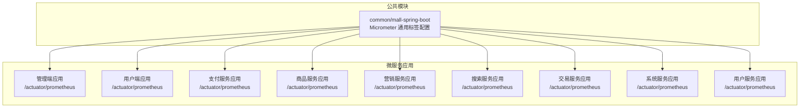
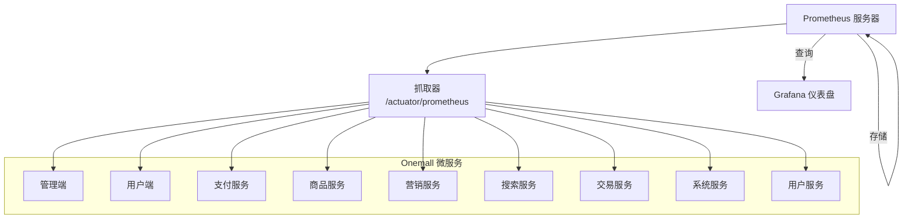
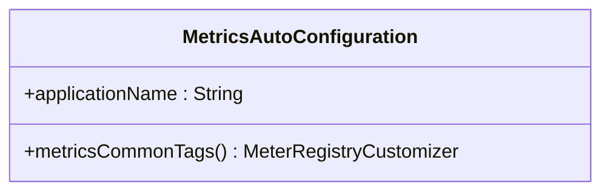
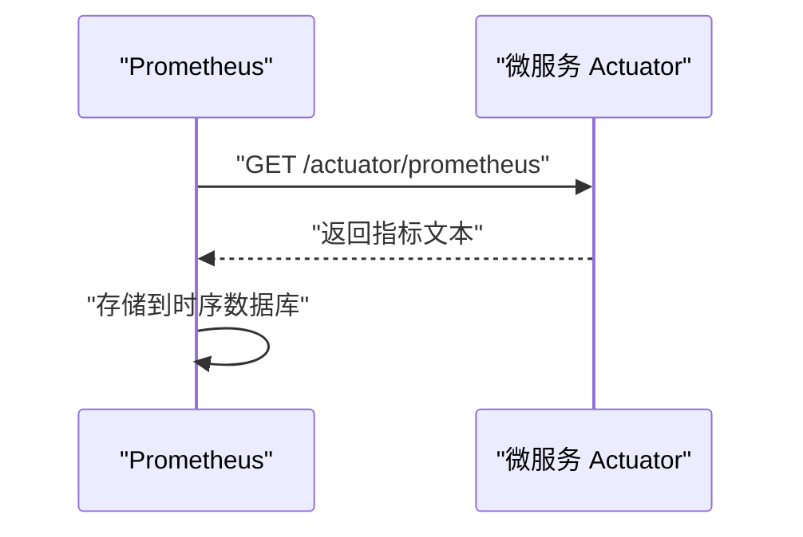
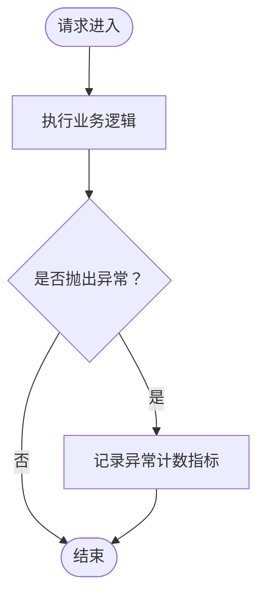
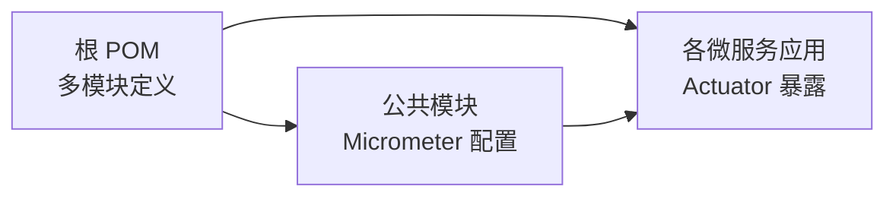

# 指标监控与告警

<cite>
**本文引用的文件**
- [MetricsAutoConfiguration.java](file://common/mall-spring-boot/src/main/java/cn/iocoder/mall/spring/boot/metrics/MetricsAutoConfiguration.java)
- [pom.xml](file://pom.xml)
- [GlobalExceptionHandler.java](file://common/mall-spring-boot-starter-web/src/main/java/cn/iocoder/mall/web/core/handler/GlobalExceptionHandler.java)
- [application.yml（管理端）](file://management-web-app/src/main/resources/application.yml)
- [application.yml（用户端）](file://shop-web-app/src/main/resources/application.yml)
- [application.yaml（支付服务）](file://pay-service-project/pay-service-app/src/main/resources/application.yaml)
- [application.yaml（商品服务）](file://product-service-project/product-service-app/src/main/resources/application.yaml)
- [application.yaml（营销服务）](file://promotion-service-project/promotion-service-app/src/main/resources/application.yaml)
- [application.yaml（搜索服务）](file://search-service-project/search-service-app/src/main/resources/application.yaml)
- [application.yaml（交易服务）](file://trade-service-project/trade-service-app/src/main/resources/application.yaml)
- [application.yaml（系统服务）](file://system-service-project/system-service-app/src/main/resources/application.yaml)
- [application.yaml（用户服务）](file://user-service-project/user-service-app/src/main/resources/application.yaml)
</cite>

## 目录
1. [简介](#简介)
2. [项目结构](#项目结构)
3. [核心组件](#核心组件)
4. [架构总览](#架构总览)
5. [详细组件分析](#详细组件分析)
6. [依赖分析](#依赖分析)
7. [性能考虑](#性能考虑)
8. [故障排查指南](#故障排查指南)
9. [结论](#结论)
10. [附录](#附录)

## 简介
本文件面向 Onemall 的指标监控与告警体系，聚焦于 Prometheus 指标采集与暴露、Micrometer 配置、常见业务指标建议、Grafana 可视化与告警规则落地思路。当前代码库已内置 Micrometer 通用标签配置能力，并在 Web 层具备异常计数的指标埋点思路；结合各微服务的 Actuator 暴露端点，可快速搭建 Prometheus 数据源与 Grafana 仪表盘。

## 项目结构
Onemall 采用多模块 Maven 结构，核心监控相关能力集中在公共模块与各微服务应用中：
- 公共模块：提供 Micrometer 通用标签配置，确保所有指标统一打上应用名标签，便于聚合与筛选。
- 各微服务应用：通过 Actuator 暴露 /actuator/prometheus 端点，供 Prometheus 抓取。
- Web 层：全局异常处理器预留了异常计数指标的注释与思路，可作为扩展点。

**图表来源**
- [MetricsAutoConfiguration.java:19-22](file://common/mall-spring-boot/src/main/java/cn/iocoder/mall/spring/boot/metrics/MetricsAutoConfiguration.java#L19-L22)
- [application.yml（管理端）](file://management-web-app/src/main/resources/application.yml)
- [application.yml（用户端）](file://shop-web-app/src/main/resources/application.yml)
- [application.yaml（支付服务）](file://pay-service-project/pay-service-app/src/main/resources/application.yaml)
- [application.yaml（商品服务）](file://product-service-project/product-service-app/src/main/resources/application.yaml)
- [application.yaml（营销服务）](file://promotion-service-project/promotion-service-app/src/main/resources/application.yaml)
- [application.yaml（搜索服务）](file://search-service-project/search-service-app/src/main/resources/application.yaml)
- [application.yaml（交易服务）](file://trade-service-project/trade-service-app/src/main/resources/application.yaml)
- [application.yaml（系统服务）](file://system-service-project/system-service-app/src/main/resources/application.yaml)
- [application.yaml（用户服务）](file://user-service-project/user-service-app/src/main/resources/application.yaml)

**章节来源**
- [pom.xml:16-28](file://pom.xml#L16-L28)

## 核心组件
- Micrometer 通用标签配置：在公共模块中通过自动配置为所有指标添加通用标签，如 application=应用名，便于跨服务聚合与筛选。
- Actuator 指标暴露：各微服务应用默认启用 Actuator 并暴露 /actuator/prometheus 端点，供 Prometheus 抓取。
- Web 层异常计数：全局异常处理器预留异常计数指标的注释与思路，可作为扩展点。

**章节来源**
- [MetricsAutoConfiguration.java:16-22](file://common/mall-spring-boot/src/main/java/cn/iocoder/mall/spring/boot/metrics/MetricsAutoConfiguration.java#L16-L22)
- [GlobalExceptionHandler.java:47-50](file://common/mall-spring-boot-starter-web/src/main/java/cn/iocoder/mall/web/core/handler/GlobalExceptionHandler.java#L47-L50)

## 架构总览
下图展示了 Prometheus 从各微服务抓取指标、存储并由 Grafana 可视化的整体流程。

**图表来源**
- [application.yml（管理端）](file://management-web-app/src/main/resources/application.yml)
- [application.yml（用户端）](file://shop-web-app/src/main/resources/application.yml)
- [application.yaml（支付服务）](file://pay-service-project/pay-service-app/src/main/resources/application.yaml)
- [application.yaml（商品服务）](file://product-service-project/product-service-app/src/main/resources/application.yaml)
- [application.yaml（营销服务）](file://promotion-service-project/promotion-service-app/src/main/resources/application.yaml)
- [application.yaml（搜索服务）](file://search-service-project/search-service-app/src/main/resources/application.yaml)
- [application.yaml（交易服务）](file://trade-service-project/trade-service-app/src/main/resources/application.yaml)
- [application.yaml（系统服务）](file://system-service-project/system-service-app/src/main/resources/application.yaml)
- [application.yaml（用户服务）](file://user-service-project/user-service-app/src/main/resources/application.yaml)

## 详细组件分析

### Micrometer 通用标签配置
- 能力概述：通过自动配置向 MeterRegistry 注入 commonTags，统一打上 application 应用名标签，便于跨服务聚合。
- 关键点：条件装配基于 management.metrics.enable 开关，默认开启；应用名来源于 spring.application.name。
- 建议：在生产环境可通过配置禁用或调整开关，避免指标过多导致资源压力。

**图表来源**
- [MetricsAutoConfiguration.java:16-22](file://common/mall-spring-boot/src/main/java/cn/iocoder/mall/spring/boot/metrics/MetricsAutoConfiguration.java#L16-L22)

**章节来源**
- [MetricsAutoConfiguration.java:12-22](file://common/mall-spring-boot/src/main/java/cn/iocoder/mall/spring/boot/metrics/MetricsAutoConfiguration.java#L12-L22)

### Actuator 指标暴露与抓取
- 能力概述：各微服务应用默认启用 Actuator，Prometheus 可通过 /actuator/prometheus 抓取指标。
- 关键点：Prometheus 需要配置对应 job 与 scrape_interval，确保能正确抓取各服务端点。
- 建议：为不同服务配置独立 job，便于按服务维度查看与告警。

**图表来源**
- [application.yml（管理端）](file://management-web-app/src/main/resources/application.yml)
- [application.yml（用户端）](file://shop-web-app/src/main/resources/application.yml)
- [application.yaml（支付服务）](file://pay-service-project/pay-service-app/src/main/resources/application.yaml)
- [application.yaml（商品服务）](file://product-service-project/product-service-app/src/main/resources/application.yaml)
- [application.yaml（营销服务）](file://promotion-service-project/promotion-service-app/src/main/resources/application.yaml)
- [application.yaml（搜索服务）](file://search-service-project/search-service-app/src/main/resources/application.yaml)
- [application.yaml（交易服务）](file://trade-service-project/trade-service-app/src/main/resources/application.yaml)
- [application.yaml（系统服务）](file://system-service-project/system-service-app/src/main/resources/application.yaml)
- [application.yaml（用户服务）](file://user-service-project/user-service-app/src/main/resources/application.yaml)

**章节来源**
- [application.yml（管理端）](file://management-web-app/src/main/resources/application.yml)
- [application.yml（用户端）](file://shop-web-app/src/main/resources/application.yml)
- [application.yaml（支付服务）](file://pay-service-project/pay-service-app/src/main/resources/application.yaml)
- [application.yaml（商品服务）](file://product-service-project/product-service-app/src/main/resources/application.yaml)
- [application.yaml（营销服务）](file://promotion-service-project/promotion-service-app/src/main/resources/application.yaml)
- [application.yaml（搜索服务）](file://search-service-project/search-service-app/src/main/resources/application.yaml)
- [application.yaml（交易服务）](file://trade-service-project/trade-service-app/src/main/resources/application.yaml)
- [application.yaml（系统服务）](file://system-service-project/system-service-app/src/main/resources/application.yaml)
- [application.yaml（用户服务）](file://user-service-project/user-service-app/src/main/resources/application.yaml)

### Web 层异常计数指标（扩展点）
- 能力概述：全局异常处理器预留了异常计数指标的注释与思路，可用于记录异常总量。
- 建议：结合 Micrometer 的 Counter 或 LongTaskTimer，按异常类型、控制器路径等维度打标，便于定位热点问题。

**图表来源**
- [GlobalExceptionHandler.java:47-50](file://common/mall-spring-boot-starter-web/src/main/java/cn/iocoder/mall/web/core/handler/GlobalExceptionHandler.java#L47-L50)

**章节来源**
- [GlobalExceptionHandler.java:47-50](file://common/mall-spring-boot-starter-web/src/main/java/cn/iocoder/mall/web/core/handler/GlobalExceptionHandler.java#L47-L50)

## 依赖分析
- 项目根 POM 定义了多模块结构，监控相关能力通过公共模块与各微服务应用共同实现。
- Micrometer 通用标签配置位于公共模块，被所有应用共享，确保指标命名与标签一致性。

**图表来源**
- [pom.xml:16-28](file://pom.xml#L16-L28)
- [MetricsAutoConfiguration.java:12-22](file://common/mall-spring-boot/src/main/java/cn/iocoder/mall/spring/boot/metrics/MetricsAutoConfiguration.java#L12-L22)

**章节来源**
- [pom.xml:16-28](file://pom.xml#L16-L28)

## 性能考虑
- 指标数量控制：通过 management.metrics.enable 控制是否启用指标，避免在高负载场景下带来额外开销。
- 标签基数管理：commonTags 中的标签值应保持稳定且数量有限，避免过多唯一标签导致存储膨胀。
- 抓取频率：合理设置 scrape_interval，避免过于频繁的抓取造成服务压力。

## 故障排查指南
- 指标无法抓取
  - 检查各应用是否启用了 Actuator 与 /actuator/prometheus 端点。
  - 确认 Prometheus 的 job 配置与目标地址正确。
- 指标缺失或不完整
  - 检查 management.metrics.enable 是否被显式关闭。
  - 确认 application.yml/yaml 中 Actuator 暴露端点的配置。
- 标签不一致
  - 确认 spring.application.name 设置正确，以便 Micrometer 通用标签生效。

**章节来源**
- [MetricsAutoConfiguration.java:12-22](file://common/mall-spring-boot/src/main/java/cn/iocoder/mall/spring/boot/metrics/MetricsAutoConfiguration.java#L12-L22)
- [application.yml（管理端）](file://management-web-app/src/main/resources/application.yml)
- [application.yml（用户端）](file://shop-web-app/src/main/resources/application.yml)
- [application.yaml（支付服务）](file://pay-service-project/pay-service-app/src/main/resources/application.yaml)
- [application.yaml（商品服务）](file://product-service-project/product-service-app/src/main/resources/application.yaml)
- [application.yaml（营销服务）](file://promotion-service-project/promotion-service-app/src/main/resources/application.yaml)
- [application.yaml（搜索服务）](file://search-service-project/search-service-app/src/main/resources/application.yaml)
- [application.yaml（交易服务）](file://trade-service-project/trade-service-app/src/main/resources/application.yaml)
- [application.yaml（系统服务）](file://system-service-project/system-service-app/src/main/resources/application.yaml)
- [application.yaml（用户服务）](file://user-service-project/user-service-app/src/main/resources/application.yaml)

## 结论
Onemall 已具备完善的指标监控基础：公共模块提供 Micrometer 通用标签，各微服务通过 Actuator 暴露指标，Prometheus 可直接抓取。建议在此基础上补充业务关键指标（如接口响应时间、错误率、吞吐量、并发数等），并结合 Grafana 构建可视化面板与告警规则，形成闭环的可观测性体系。

## 附录
- Prometheus 抓取配置要点
  - 在 Prometheus 配置中为每个微服务添加独立 job，指定 scrape_interval 与目标地址。
  - 确保网络连通性与认证策略（如有）正确。
- Grafana 可视化建议
  - 使用 application 通用标签进行服务维度筛选。
  - 常见面板：JVM 内存、GC 时间、HTTP 请求速率与错误率、线程池活跃度等。
- 告警规则建议
  - 错误率阈值告警：如 5 分钟内错误率超过阈值。
  - 响应时间分位数：如 P95/P99 超过阈值。
  - 并发与队列：线程池饱和、队列积压等。
  - 资源类：CPU、内存、磁盘、连接池可用率等。