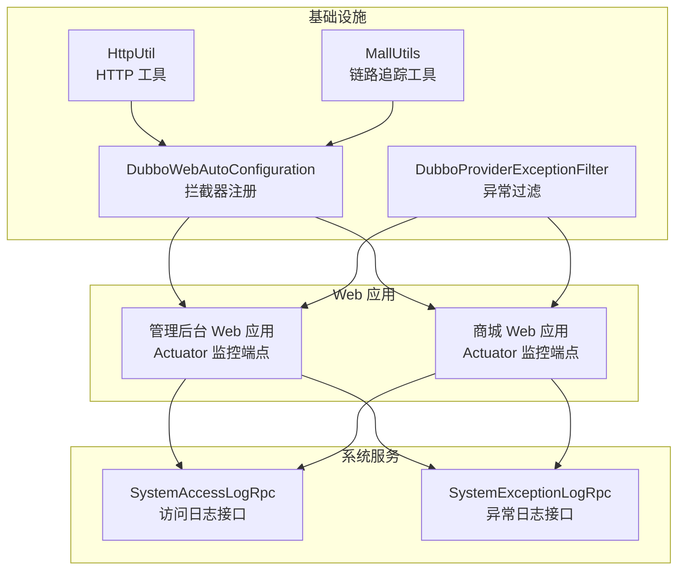
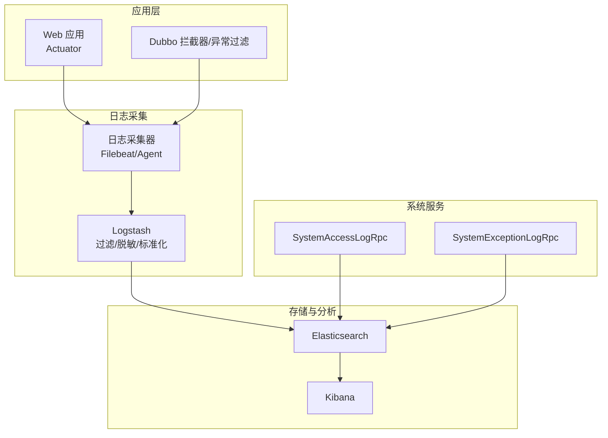
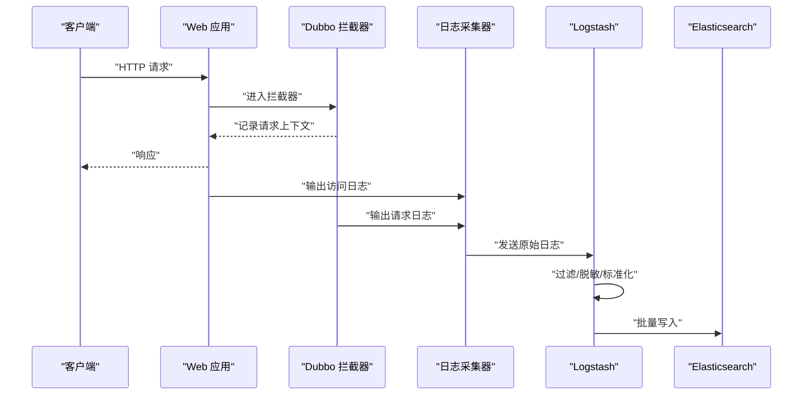
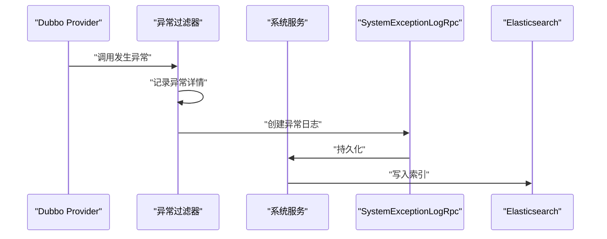
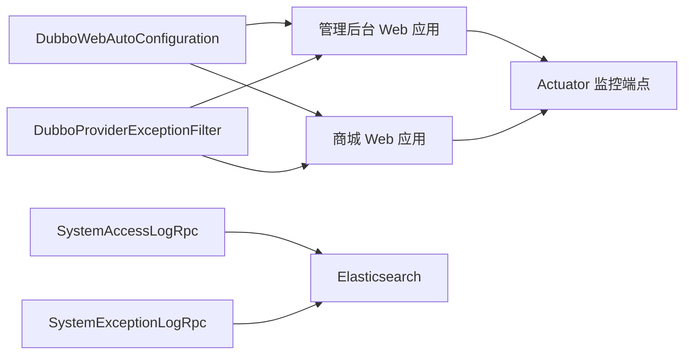

# 日志收集与分析

<cite>
**本文引用的文件**
- [application.yml](file://management-web-app/src/main/resources/application.yml)
- [application-dev.yml](file://management-web-app/src/main/resources/application-dev.yml)
- [application.yml](file://shop-web-app/src/main/resources/application.yml)
- [application-dev.yml](file://shop-web-app/src/main/resources/application-dev.yml)
- [SystemAccessLogRpc.java](file://system-service-project/system-service-api/src/main/java/cn/iocoder/mall/systemservice/rpc/systemlog/SystemAccessLogRpc.java)
- [SystemExceptionLogRpc.java](file://system-service-project/system-service-api/src/main/java/cn/iocoder/mall/systemservice/rpc/systemlog/SystemExceptionLogRpc.java)
- [DubboWebAutoConfiguration.java](file://common/mall-spring-boot-starter-dubbo/src/main/java/cn/iocoder/mall/dubbo/config/DubboWebAutoConfiguration.java)
- [DubboProviderExceptionFilter.java](file://common/mall-spring-boot-starter-dubbo/src/main/java/cn/iocoder/mall/dubbo/core/filter/DubboProviderExceptionFilter.java)
- [HttpUtil.java](file://common/common-framework/src/main/java/cn/iocoder/common/framework/util/HttpUtil.java)
- [MallUtils.java](file://common/common-framework/src/main/java/cn/iocoder/common/framework/util/MallUtils.java)
</cite>

## 目录
1. [简介](#简介)
2. [项目结构](#项目结构)
3. [核心组件](#核心组件)
4. [架构总览](#架构总览)
5. [详细组件分析](#详细组件分析)
6. [依赖关系分析](#依赖关系分析)
7. [性能考虑](#性能考虑)
8. [故障排查指南](#故障排查指南)
9. [结论](#结论)
10. [附录](#附录)

## 简介
本实施文档面向 Onemall 日志收集与分析系统，围绕 ELK Stack（Elasticsearch、Logstash、Kibana）在本项目中的集成与落地展开，目标是：
- 明确日志采集器设置、日志格式标准化与日志存储策略
- 规范应用日志结构化输出，统一日志格式、字段定义与日志级别管理
- 完善访问日志与异常日志的处理流程：采集、过滤、脱敏、批量上传
- 构建 Kibana 仪表板：日志查询语法、可视化图表与实时监控面板
- 总结日志分析最佳实践：日志聚合策略、性能优化与存储成本控制
- 提供常见日志分析场景与故障排查方法

本项目已具备访问日志与异常日志的 RPC 接口能力，并在 Web 应用中启用 Actuator 监控端点，便于后续接入 ELK 进行集中采集与分析。

## 项目结构
Onemall 采用多模块微服务架构，日志相关的关键位置如下：
- Web 应用层：管理后台与商城前端应用，分别提供独立的配置文件与 Actuator 监控端点
- 系统服务层：提供系统访问日志与异常日志的 RPC 接口，用于日志上报与查询
- Dubbo 基础设施：拦截器与异常过滤器，记录请求与异常信息，便于统一日志化
- 工具类：HTTP 工具与通用工具，辅助日志上下文与链路追踪

**图示来源**
- [application.yml:79-83](file://management-web-app/src/main/resources/application.yml#L79-L83)
- [application.yml:72-76](file://shop-web-app/src/main/resources/application.yml#L72-L76)
- [SystemAccessLogRpc.java:1-31](file://system-service-project/system-service-api/src/main/java/cn/iocoder/mall/systemservice/rpc/systemlog/SystemAccessLogRpc.java#L1-L31)
- [SystemExceptionLogRpc.java:1-48](file://system-service-project/system-service-api/src/main/java/cn/iocoder/mall/systemservice/rpc/systemlog/SystemExceptionLogRpc.java#L1-L48)
- [DubboWebAutoConfiguration.java:15-26](file://common/mall-spring-boot-starter-dubbo/src/main/java/cn/iocoder/mall/dubbo/config/DubboWebAutoConfiguration.java#L15-L26)
- [DubboProviderExceptionFilter.java:23-98](file://common/mall-spring-boot-starter-dubbo/src/main/java/cn/iocoder/mall/dubbo/core/filter/DubboProviderExceptionFilter.java#L23-L98)
- [HttpUtil.java:14-292](file://common/common-framework/src/main/java/cn/iocoder/common/framework/util/HttpUtil.java#L14-L292)
- [MallUtils.java:11-11](file://common/common-framework/src/main/java/cn/iocoder/common/framework/util/MallUtils.java#L11-L11)

**章节来源**
- [application.yml:1-83](file://management-web-app/src/main/resources/application.yml#L1-L83)
- [application.yml:1-76](file://shop-web-app/src/main/resources/application.yml#L1-L76)
- [application-dev.yml:1-19](file://management-web-app/src/main/resources/application-dev.yml#L1-L19)
- [application-dev.yml:1-16](file://shop-web-app/src/main/resources/application-dev.yml#L1-L16)

## 核心组件
- Web 应用配置与 Actuator 监控
  - 管理后台与商城 Web 应用均启用 Actuator 监控端点，便于集中采集健康检查、指标与日志元数据
- 系统日志 RPC 接口
  - SystemAccessLogRpc：提供访问日志创建与分页查询能力
  - SystemExceptionLogRpc：提供异常日志创建、查询、分页与处理能力
- Dubbo 基础设施
  - DubboWebAutoConfiguration：注册拦截器，记录请求上下文
  - DubboProviderExceptionFilter：捕获并记录异常，便于统一异常日志化
- 工具类支撑
  - HttpUtil：HTTP 请求解析与编码处理，辅助日志上下文
  - MallUtils：链路追踪编号生成与关联，便于跨日志串联

**章节来源**
- [SystemAccessLogRpc.java:1-31](file://system-service-project/system-service-api/src/main/java/cn/iocoder/mall/systemservice/rpc/systemlog/SystemAccessLogRpc.java#L1-L31)
- [SystemExceptionLogRpc.java:1-48](file://system-service-project/system-service-api/src/main/java/cn/iocoder/mall/systemservice/rpc/systemlog/SystemExceptionLogRpc.java#L1-L48)
- [DubboWebAutoConfiguration.java:15-26](file://common/mall-spring-boot-starter-dubbo/src/main/java/cn/iocoder/mall/dubbo/config/DubboWebAutoConfiguration.java#L15-L26)
- [DubboProviderExceptionFilter.java:23-98](file://common/mall-spring-boot-starter-dubbo/src/main/java/cn/iocoder/mall/dubbo/core/filter/DubboProviderExceptionFilter.java#L23-L98)
- [HttpUtil.java:14-292](file://common/common-framework/src/main/java/cn/iocoder/common/framework/util/HttpUtil.java#L14-L292)
- [MallUtils.java:11-11](file://common/common-framework/src/main/java/cn/iocoder/common/framework/util/MallUtils.java#L11-L11)

## 架构总览
下图展示 Onemall 日志体系与 ELK 的集成思路：Web 应用通过 Actuator 与日志采集器对接；Dubbo 层拦截请求与异常，统一纳入日志；系统服务提供日志 RPC 接口，支持访问与异常日志的入库与查询；最终由 Kibana 进行可视化与实时监控。

**图示来源**
- [application.yml:79-83](file://management-web-app/src/main/resources/application.yml#L79-L83)
- [application.yml:72-76](file://shop-web-app/src/main/resources/application.yml#L72-L76)
- [SystemAccessLogRpc.java:1-31](file://system-service-project/system-service-api/src/main/java/cn/iocoder/mall/systemservice/rpc/systemlog/SystemAccessLogRpc.java#L1-L31)
- [SystemExceptionLogRpc.java:1-48](file://system-service-project/system-service-api/src/main/java/cn/iocoder/mall/systemservice/rpc/systemlog/SystemExceptionLogRpc.java#L1-L48)

## 详细组件分析

### 访问日志处理流程
访问日志由 Web 应用与 Dubbo 拦截器共同产生，建议通过以下步骤接入 ELK：
- 采集：使用 Filebeat 或统一 Agent 收集 Web 应用日志与 Dubbo 请求日志
- 过滤：在 Logstash 中按时间戳、日志级别、线程名等字段进行规范化
- 脱敏：对敏感字段（如手机号、身份证号、密码）进行脱敏处理
- 上报：将标准化后的日志批量写入 Elasticsearch
- 查询：在 Kibana 中建立索引模式，编写查询语句进行检索与聚合

**图示来源**
- [DubboWebAutoConfiguration.java:15-26](file://common/mall-spring-boot-starter-dubbo/src/main/java/cn/iocoder/mall/dubbo/config/DubboWebAutoConfiguration.java#L15-L26)
- [application.yml:79-83](file://management-web-app/src/main/resources/application.yml#L79-L83)
- [application.yml:72-76](file://shop-web-app/src/main/resources/application.yml#L72-L76)

**章节来源**
- [DubboWebAutoConfiguration.java:15-26](file://common/mall-spring-boot-starter-dubbo/src/main/java/cn/iocoder/mall/dubbo/config/DubboWebAutoConfiguration.java#L15-L26)
- [application.yml:79-83](file://management-web-app/src/main/resources/application.yml#L79-L83)
- [application.yml:72-76](file://shop-web-app/src/main/resources/application.yml#L72-L76)

### 异常日志处理流程
异常日志由 Dubbo Provider 异常过滤器捕获并记录，随后可通过 RPC 接口上报至系统服务，再由 ELK 进行采集与分析：
- 捕获：DubboProviderExceptionFilter 捕获未声明异常与校验异常
- 上报：调用 SystemExceptionLogRpc 创建异常日志
- 存储：Elasticsearch 存储异常日志，Kibana 可视化
- 处理：管理员可在系统中对异常日志进行“完成/忽略”处理

**图示来源**
- [DubboProviderExceptionFilter.java:23-98](file://common/mall-spring-boot-starter-dubbo/src/main/java/cn/iocoder/mall/dubbo/core/filter/DubboProviderExceptionFilter.java#L23-L98)
- [SystemExceptionLogRpc.java:1-48](file://system-service-project/system-service-api/src/main/java/cn/iocoder/mall/systemservice/rpc/systemlog/SystemExceptionLogRpc.java#L1-L48)

**章节来源**
- [DubboProviderExceptionFilter.java:23-98](file://common/mall-spring-boot-starter-dubbo/src/main/java/cn/iocoder/mall/dubbo/core/filter/DubboProviderExceptionFilter.java#L23-L98)
- [SystemExceptionLogRpc.java:1-48](file://system-service-project/system-service-api/src/main/java/cn/iocoder/mall/systemservice/rpc/systemlog/SystemExceptionLogRpc.java#L1-L48)

### 日志格式标准化与字段定义
建议统一日志字段如下（可根据实际需要扩展）：
- 通用字段
  - 时间戳：日志产生时间
  - 服务名：应用名称（来自配置）
  - 实例标识：容器/主机/进程标识
  - 线程名：线程序列
  - 日志级别：INFO/WARN/ERROR
  - 链路追踪 ID：用于跨服务串联
- 访问日志字段
  - 方法：HTTP 方法
  - 路径：请求路径
  - 用户 ID：登录用户标识
  - IP：客户端 IP
  - User-Agent：浏览器标识
  - 响应时间：耗时
  - 状态码：HTTP 状态码
  - 请求体摘要：可选
  - 响应体摘要：可选
- 异常日志字段
  - 异常类型：异常类名
  - 异常消息：异常信息摘要
  - 异常堆栈：可选（需脱敏）
  - 服务接口：RPC 接口名
  - 方法名：调用方法名
  - 参数摘要：可选（需脱敏）

**章节来源**
- [MallUtils.java:11-11](file://common/common-framework/src/main/java/cn/iocoder/common/framework/util/MallUtils.java#L11-L11)
- [HttpUtil.java:14-292](file://common/common-framework/src/main/java/cn/iocoder/common/framework/util/HttpUtil.java#L14-L292)

### 日志采集器设置与存储策略
- 采集器设置
  - 使用 Filebeat 或统一 Agent 收集 Web 应用日志与 Dubbo 请求日志
  - 配置多路径采集，覆盖应用日志目录与 Dubbo 日志目录
  - 启用日志轮转，避免单文件过大
- 日志格式标准化
  - 在 Logstash 中使用正则或 JSON 解析器提取字段
  - 统一时间戳字段与日志级别字段
- 存储策略
  - 按天/周索引命名，设置生命周期策略（如 30/60/90 天滚动删除）
  - 对超大字段（如完整堆栈）进行裁剪或禁用高亮
  - 对高频字段建立合适的映射类型，减少存储开销

[本节为通用实践说明，无需列出具体文件来源]

### Kibana 仪表板构建
- 索引模式
  - 建立访问日志与异常日志的索引模式，选择时间字段
- 查询语法
  - 使用 KQL 编写常用查询，如按服务名、状态码、异常类型筛选
- 可视化图表
  - 访问趋势（按小时/分钟）
  - 异常分布（按异常类型/接口）
  - 响应时间分布（百分位数）
- 实时监控面板
  - 结合 Watcher 或告警规则，对异常量突增、错误率上升进行告警

[本节为通用实践说明，无需列出具体文件来源]

## 依赖关系分析
- Web 应用依赖 Actuator 暴露监控端点，便于集中采集
- Dubbo 拦截器与异常过滤器为日志采集提供基础数据源
- 系统服务的 RPC 接口为访问与异常日志提供入库与查询能力
- 工具类（HTTP 工具、链路追踪工具）为日志上下文与串联提供支撑

**图示来源**
- [application.yml:79-83](file://management-web-app/src/main/resources/application.yml#L79-L83)
- [application.yml:72-76](file://shop-web-app/src/main/resources/application.yml#L72-L76)
- [SystemAccessLogRpc.java:1-31](file://system-service-project/system-service-api/src/main/java/cn/iocoder/mall/systemservice/rpc/systemlog/SystemAccessLogRpc.java#L1-L31)
- [SystemExceptionLogRpc.java:1-48](file://system-service-project/system-service-api/src/main/java/cn/iocoder/mall/systemservice/rpc/systemlog/SystemExceptionLogRpc.java#L1-L48)

**章节来源**
- [application.yml:79-83](file://management-web-app/src/main/resources/application.yml#L79-L83)
- [application.yml:72-76](file://shop-web-app/src/main/resources/application.yml#L72-L76)
- [DubboWebAutoConfiguration.java:15-26](file://common/mall-spring-boot-starter-dubbo/src/main/java/cn/iocoder/mall/dubbo/config/DubboWebAutoConfiguration.java#L15-L26)
- [DubboProviderExceptionFilter.java:23-98](file://common/mall-spring-boot-starter-dubbo/src/main/java/cn/iocoder/mall/dubbo/core/filter/DubboProviderExceptionFilter.java#L23-L98)
- [SystemAccessLogRpc.java:1-31](file://system-service-project/system-service-api/src/main/java/cn/iocoder/mall/systemservice/rpc/systemlog/SystemAccessLogRpc.java#L1-L31)
- [SystemExceptionLogRpc.java:1-48](file://system-service-project/system-service-api/src/main/java/cn/iocoder/mall/systemservice/rpc/systemlog/SystemExceptionLogRpc.java#L1-L48)

## 性能考虑
- 采集性能
  - 合理设置采集器的批量大小与刷新间隔，避免频繁 IO
  - 对超大日志内容进行裁剪或禁用高亮
- 存储性能
  - 使用日期索引模板，避免单索引过大
  - 对低频字段使用 keyword 类型，高频聚合字段使用合适的映射
- 查询性能
  - 建立常用字段的聚合索引，减少聚合计算压力
  - 控制时间范围，避免全量扫描

[本节为通用实践说明，无需列出具体文件来源]

## 故障排查指南
- 访问日志缺失
  - 检查 Web 应用是否正确输出日志到标准输出/文件
  - 确认采集器路径配置是否覆盖日志目录
- 异常日志未入库
  - 检查 DubboProviderExceptionFilter 是否生效
  - 核对 SystemExceptionLogRpc 的可用性与网络连通性
- 日志字段不规范
  - 在 Logstash 中增加解析规则，确保时间戳与级别字段正确提取
- 性能问题
  - 检查 Elasticsearch 索引段合并与磁盘空间
  - 优化查询条件与聚合字段

**章节来源**
- [DubboProviderExceptionFilter.java:23-98](file://common/mall-spring-boot-starter-dubbo/src/main/java/cn/iocoder/mall/dubbo/core/filter/DubboProviderExceptionFilter.java#L23-L98)
- [SystemExceptionLogRpc.java:1-48](file://system-service-project/system-service-api/src/main/java/cn/iocoder/mall/systemservice/rpc/systemlog/SystemExceptionLogRpc.java#L1-L48)

## 结论
Onemall 已具备访问与异常日志的基础能力，结合 Actuator 监控端点与 Dubbo 拦截器/异常过滤器，可高效接入 ELK 进行集中采集与分析。通过统一的日志格式、标准化的字段定义与合理的存储策略，能够满足日常运维与故障排查需求，并为 Kibana 仪表板提供稳定的数据支撑。

[本节为总结性内容，无需列出具体文件来源]

## 附录
- 常见日志分析场景
  - 访问量峰值与错误率趋势分析
  - 异常类型分布与热点接口定位
  - 响应时间与慢查询分析
  - 用户行为与流量画像
- 最佳实践清单
  - 统一日志格式与字段
  - 启用脱敏与裁剪策略
  - 合理的索引生命周期与副本策略
  - 建立告警与自动化运维流程

[本节为通用实践说明，无需列出具体文件来源]