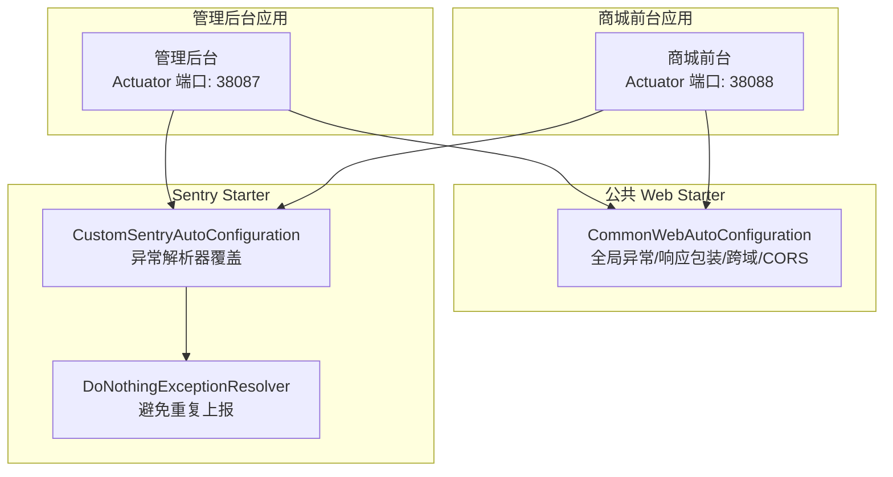
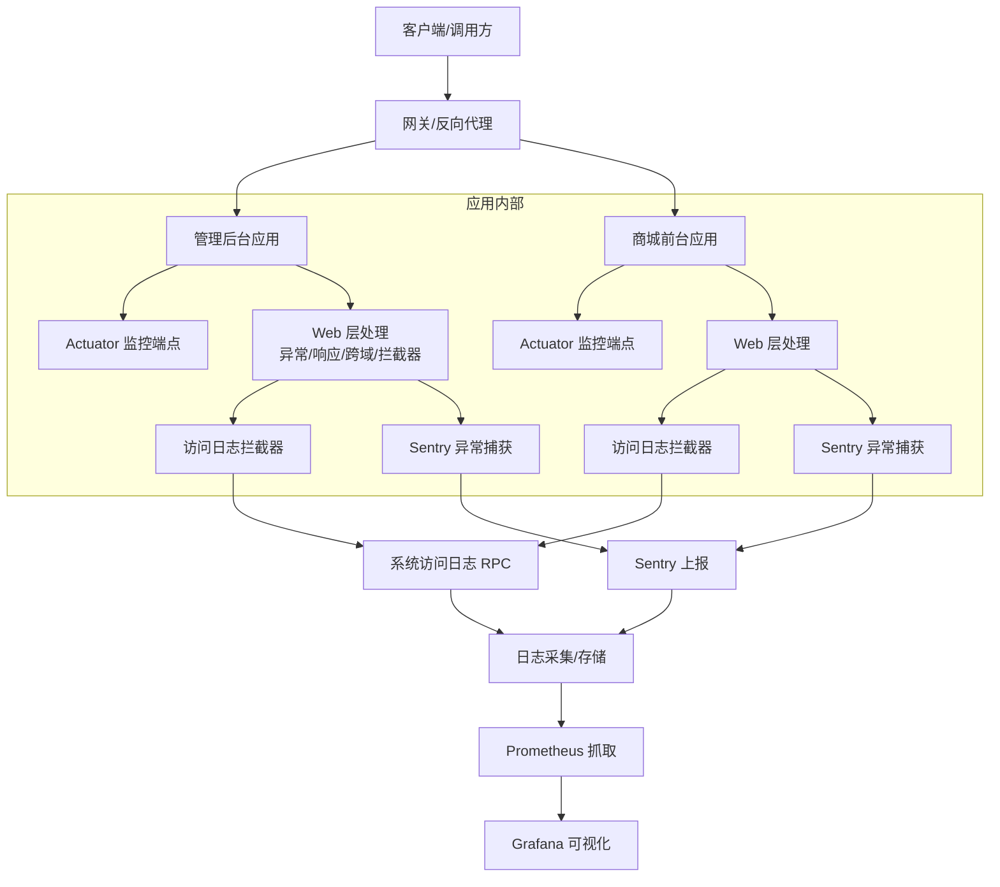
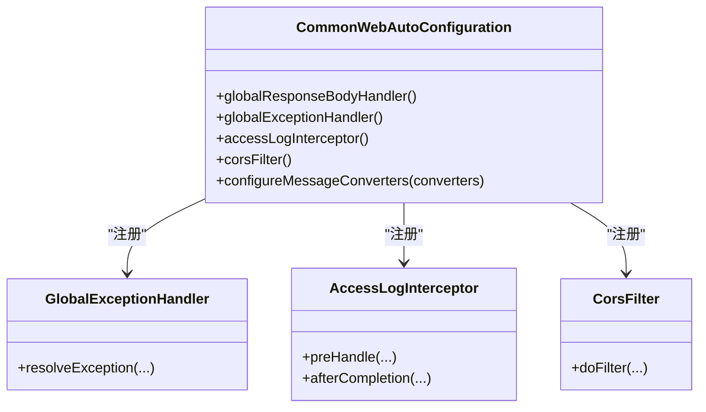
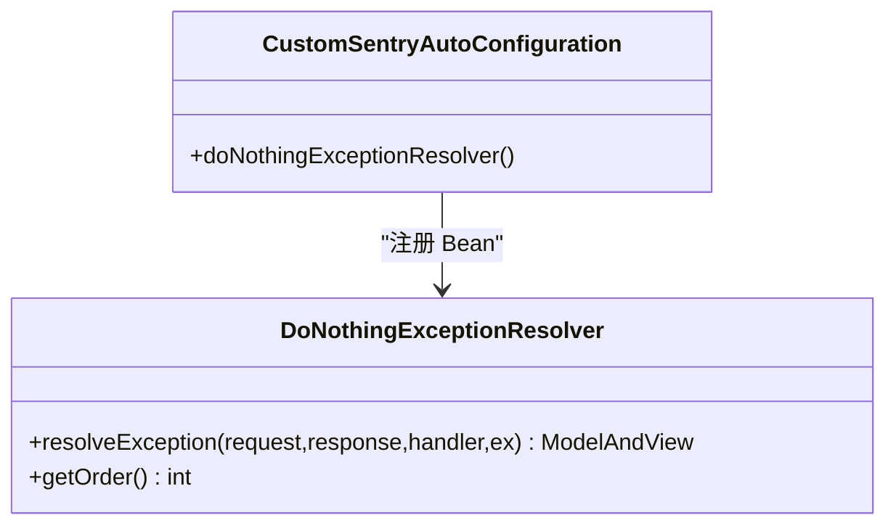
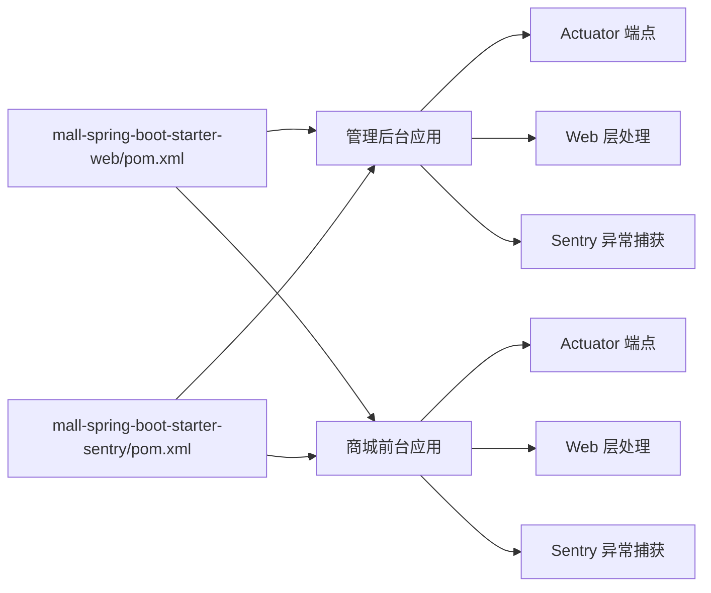

# 监控与可观测性

<cite>
**本文档引用的文件**
- [application.yml（管理后台）](file://management-web-app/src/main/resources/application.yml)
- [application.yml（商城前台）](file://shop-web-app/src/main/resources/application.yml)
- [CommonWebAutoConfiguration.java](file://common/mall-spring-boot-starter-web/src/main/java/cn/iocoder/mall/web/config/CommonWebAutoConfiguration.java)
- [CustomSentryAutoConfiguration.java](file://common/mall-spring-boot-starter-sentry/src/main/java/cn/iocoder/mall/sentry/config/CustomSentryAutoConfiguration.java)
- [DoNothingExceptionResolver.java](file://common/mall-spring-boot-starter-sentry/src/main/java/cn/iocoder/mall/sentry/resolver/DoNothingExceptionResolver.java)
- [mall-spring-boot-starter-sentry/pom.xml](file://common/mall-spring-boot-starter-sentry/pom.xml)
- [mall-spring-boot-starter-web/pom.xml](file://common/mall-spring-boot-starter-web/pom.xml)
</cite>

## 目录
1. [简介](#简介)
2. [项目结构](#项目结构)
3. [核心组件](#核心组件)
4. [架构总览](#架构总览)
5. [详细组件分析](#详细组件分析)
6. [依赖关系分析](#依赖关系分析)
7. [性能考量](#性能考量)
8. [故障排查指南](#故障排查指南)
9. [结论](#结论)
10. [附录](#附录)

## 简介
本文件面向 Onemall 的监控与可观测性体系，聚焦以下能力：
- 应用层监控：基于 Spring Boot Actuator 的健康检查与运行指标
- 错误监控：基于 Sentry 的异常捕获与错误上报
- 日志与链路：结合系统访问日志拦截器与系统异常日志 RPC 能力，实现统一的日志采集与问题定位
- 可视化与告警：建议通过 Prometheus/Grafana 实现指标可视化与告警；Sentry 用于错误事件可视化与告警联动

说明：当前仓库未包含 SkyWalking 探针配置、Prometheus/Grafana 集成与 ELK Stack 的具体实现文件。本文在“概念性概述”部分给出通用实践建议，但不展示与代码直接对应的图表或来源标注。

## 项目结构
- 管理后台与商城前台均通过独立的 Spring Boot 应用暴露 Actuator 监控端点，便于统一采集与可视化
- Web 层通过公共 Starter 注入全局异常处理、跨域过滤器与访问日志拦截器
- Sentry Starter 以自动配置方式接入，提供异常捕获与上报能力，并通过自定义异常解析器避免重复上报

**图表来源**
- [application.yml（管理后台）:79-83](file://management-web-app/src/main/resources/application.yml#L79-L83)
- [application.yml（商城前台）:72-76](file://shop-web-app/src/main/resources/application.yml#L72-L76)
- [CommonWebAutoConfiguration.java:28-97](file://common/mall-spring-boot-starter-web/src/main/java/cn/iocoder/mall/web/config/CommonWebAutoConfiguration.java#L28-L97)
- [CustomSentryAutoConfiguration.java:14-40](file://common/mall-spring-boot-starter-sentry/src/main/java/cn/iocoder/mall/sentry/config/CustomSentryAutoConfiguration.java#L14-L40)
- [DoNothingExceptionResolver.java:9-32](file://common/mall-spring-boot-starter-sentry/src/main/java/cn/iocoder/mall/sentry/resolver/DoNothingExceptionResolver.java#L9-L32)

**章节来源**
- [application.yml（管理后台）:1-83](file://management-web-app/src/main/resources/application.yml#L1-L83)
- [application.yml（商城前台）:1-76](file://shop-web-app/src/main/resources/application.yml#L1-L76)
- [CommonWebAutoConfiguration.java:1-97](file://common/mall-spring-boot-starter-web/src/main/java/cn/iocoder/mall/web/config/CommonWebAutoConfiguration.java#L1-L97)
- [CustomSentryAutoConfiguration.java:1-40](file://common/mall-spring-boot-starter-sentry/src/main/java/cn/iocoder/mall/sentry/config/CustomSentryAutoConfiguration.java#L1-L40)
- [DoNothingExceptionResolver.java:1-32](file://common/mall-spring-boot-starter-sentry/src/main/java/cn/iocoder/mall/sentry/resolver/DoNothingExceptionResolver.java#L1-L32)

## 核心组件
- Actuator 监控端点
  - 管理后台与商城前台分别在独立端口暴露所有监控端点，便于安全地对外部系统采集
  - 端口与暴露范围在各自 application.yml 中配置
- Web 层全局处理
  - 全局异常处理器与统一响应包装，确保错误与返回格式一致
  - 访问日志拦截器按需启用，结合系统异常日志 RPC 进行统一采集
- Sentry 错误监控
  - 通过自动配置引入 Sentry Starter，并提供自定义异常解析器以避免重复上报
  - 当 sentry.enabled=true 且 Web 应用存在时生效

**章节来源**
- [application.yml（管理后台）:79-83](file://management-web-app/src/main/resources/application.yml#L79-L83)
- [application.yml（商城前台）:72-76](file://shop-web-app/src/main/resources/application.yml#L72-L76)
- [CommonWebAutoConfiguration.java:34-46](file://common/mall-spring-boot-starter-web/src/main/java/cn/iocoder/mall/web/config/CommonWebAutoConfiguration.java#L34-L46)
- [CustomSentryAutoConfiguration.java:20-37](file://common/mall-spring-boot-starter-sentry/src/main/java/cn/iocoder/mall/sentry/config/CustomSentryAutoConfiguration.java#L20-L37)
- [DoNothingExceptionResolver.java:15-32](file://common/mall-spring-boot-starter-sentry/src/main/java/cn/iocoder/mall/sentry/resolver/DoNothingExceptionResolver.java#L15-L32)

## 架构总览
下图展示了 Onemall 在监控与可观测性方面的整体交互：应用通过 Actuator 暴露指标，Web 层统一处理异常与访问日志，Sentry 负责错误捕获与上报，系统日志通过 RPC 统一采集。

[此图为概念性架构示意，不对应具体源码文件，故无图表来源]

## 详细组件分析

### Actuator 监控端点
- 管理后台与商城前台分别在独立端口暴露所有 Actuator 端点，便于集中采集与安全隔离
- 建议在生产环境限制 Actuator 端点的访问范围并开启认证

**章节来源**
- [application.yml（管理后台）:79-83](file://management-web-app/src/main/resources/application.yml#L79-L83)
- [application.yml（商城前台）:72-76](file://shop-web-app/src/main/resources/application.yml#L72-L76)

### Web 层全局处理与访问日志
- 全局异常处理器与统一响应包装，保证错误与返回格式一致
- 访问日志拦截器按条件注入，当系统日志 RPC 存在时启用
- 跨域过滤器与消息转换器配置，提升兼容性与可维护性

**图表来源**
- [CommonWebAutoConfiguration.java:28-97](file://common/mall-spring-boot-starter-web/src/main/java/cn/iocoder/mall/web/config/CommonWebAutoConfiguration.java#L28-L97)

**章节来源**
- [CommonWebAutoConfiguration.java:1-97](file://common/mall-spring-boot-starter-web/src/main/java/cn/iocoder/mall/web/config/CommonWebAutoConfiguration.java#L1-L97)

### Sentry 异常捕获与上报
- 自动配置仅在 Web 应用且 sentry.enabled=true 时生效
- 通过自定义异常解析器覆盖默认行为，避免日志 appender 与全局异常解析器重复上报
- Sentry Starter 依赖已声明于模块 POM

**图表来源**
- [CustomSentryAutoConfiguration.java:20-37](file://common/mall-spring-boot-starter-sentry/src/main/java/cn/iocoder/mall/sentry/config/CustomSentryAutoConfiguration.java#L20-L37)
- [DoNothingExceptionResolver.java:15-32](file://common/mall-spring-boot-starter-sentry/src/main/java/cn/iocoder/mall/sentry/resolver/DoNothingExceptionResolver.java#L15-L32)

**章节来源**
- [CustomSentryAutoConfiguration.java:1-40](file://common/mall-spring-boot-starter-sentry/src/main/java/cn/iocoder/mall/sentry/config/CustomSentryAutoConfiguration.java#L1-L40)
- [DoNothingExceptionResolver.java:1-32](file://common/mall-spring-boot-starter-sentry/src/main/java/cn/iocoder/mall/sentry/resolver/DoNothingExceptionResolver.java#L1-L32)
- [mall-spring-boot-starter-sentry/pom.xml:14-23](file://common/mall-spring-boot-starter-sentry/pom.xml#L14-L23)

### 概念性概述：SkyWalking 链路追踪、Prometheus/Grafana、ELK
- SkyWalking 集成（概念）
  - 在应用启动参数中加入探针配置，启用自动探针与链路采集
  - 关注服务端点、RPC 调用链、数据库与缓存操作的链路信息
- Prometheus 指标采集（概念）
  - 通过 Actuator 暴露 Micrometer 指标，Prometheus 定时抓取
  - 关键指标：接口响应时间、错误率、吞吐量、JVM 与线程池状态
- Grafana 可视化（概念）
  - 基于 Prometheus 数据源构建仪表板，设置阈值告警
- ELK Stack（概念）
  - 使用 Logstash/Fluentd 收集应用日志，Elasticsearch 存储，Kibana 可视化
  - 结合系统访问日志 RPC 与 Sentry 错误事件，形成统一观测闭环

[本节为通用实践说明，不对应具体源码文件，故无章节来源与图表来源]

## 依赖关系分析
- Web 应用依赖公共 Web Starter，获得全局异常处理、访问日志拦截器与跨域支持
- Sentry Starter 提供异常捕获能力，自动配置在满足条件时生效
- Actuator 端点由各应用独立暴露，便于集中采集

**图表来源**
- [mall-spring-boot-starter-web/pom.xml:30-34](file://common/mall-spring-boot-starter-web/pom.xml#L30-L34)
- [mall-spring-boot-starter-sentry/pom.xml:14-23](file://common/mall-spring-boot-starter-sentry/pom.xml#L14-L23)
- [application.yml（管理后台）:79-83](file://management-web-app/src/main/resources/application.yml#L79-L83)
- [application.yml（商城前台）:72-76](file://shop-web-app/src/main/resources/application.yml#L72-L76)

**章节来源**
- [mall-spring-boot-starter-web/pom.xml:1-51](file://common/mall-spring-boot-starter-web/pom.xml#L1-L51)
- [mall-spring-boot-starter-sentry/pom.xml:1-25](file://common/mall-spring-boot-starter-sentry/pom.xml#L1-L25)

## 性能考量
- Actuator 端点暴露范围应最小化，仅在受控网络内开放
- Sentry 上报频率与采样策略需结合业务流量评估，避免对生产造成额外压力
- 访问日志拦截器与系统日志 RPC 的调用需关注延迟与失败重试策略
- Web 层消息转换器与跨域配置应保持简洁，减少序列化与过滤开销

[本节为通用指导，不涉及具体源码分析，故无章节来源]

## 故障排查指南
- Actuator 无法访问
  - 检查 application.yml 中 management.server.port 与 endpoints 暴露配置
  - 确认防火墙与网关策略允许访问对应端口
- 异常未被捕获或重复上报
  - 检查 sentry.enabled 配置与 Web 应用类型
  - 确认自定义异常解析器是否生效，避免与默认 Sentry 解析器冲突
- 访问日志缺失
  - 检查系统日志 RPC 是否可用，拦截器是否成功注册
  - 确认拦截器注册逻辑与条件注解是否满足

**章节来源**
- [application.yml（管理后台）:79-83](file://management-web-app/src/main/resources/application.yml#L79-L83)
- [application.yml（商城前台）:72-76](file://shop-web-app/src/main/resources/application.yml#L72-L76)
- [CustomSentryAutoConfiguration.java:20-23](file://common/mall-spring-boot-starter-sentry/src/main/java/cn/iocoder/mall/sentry/config/CustomSentryAutoConfiguration.java#L20-L23)
- [CommonWebAutoConfiguration.java:50-65](file://common/mall-spring-boot-starter-web/src/main/java/cn/iocoder/mall/web/config/CommonWebAutoConfiguration.java#L50-L65)

## 结论
Onemall 的监控与可观测性以 Actuator、Web 层统一处理与 Sentry 为核心，具备良好的扩展性与可维护性。建议在现有基础上补充 Prometheus/Grafana 指标采集与可视化、ELK 日志聚合以及 SkyWalking 链路追踪能力，形成完整的可观测性闭环。

[本节为总结性内容，不涉及具体源码分析，故无章节来源]

## 附录
- 建议的监控指标清单（概念）
  - 接口级：请求总量、错误率、平均/分位响应时间、并发数
  - 系统级：CPU、内存、GC、线程池、连接池、磁盘与网络
  - 业务级：订单量、支付成功率、库存变更速率等
- 建议的告警规则（概念）
  - 错误率超过阈值、P95 响应时间超限、下游依赖可用性下降、资源使用率持续高位

[本节为通用实践说明，不对应具体源码文件，故无章节来源与图表来源]