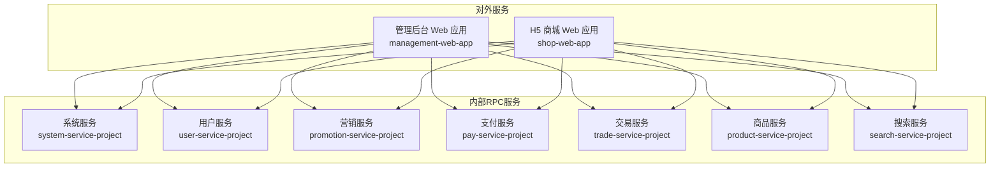
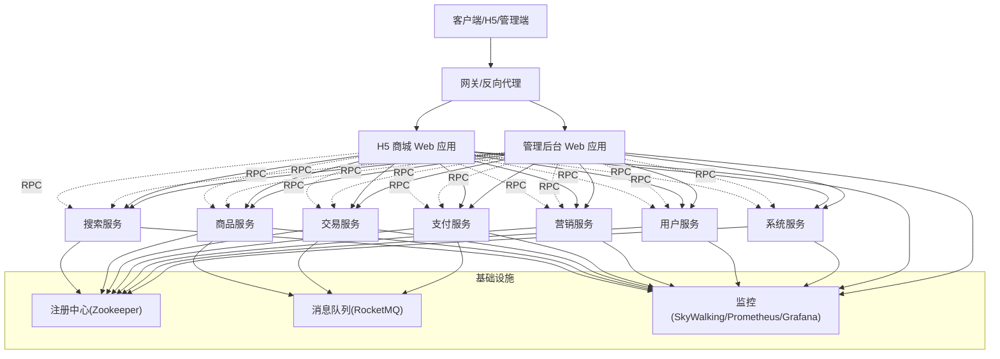
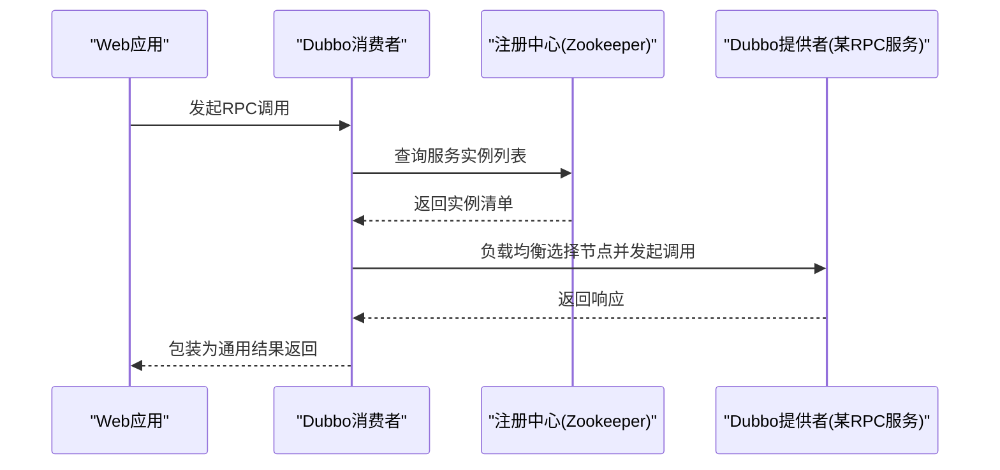
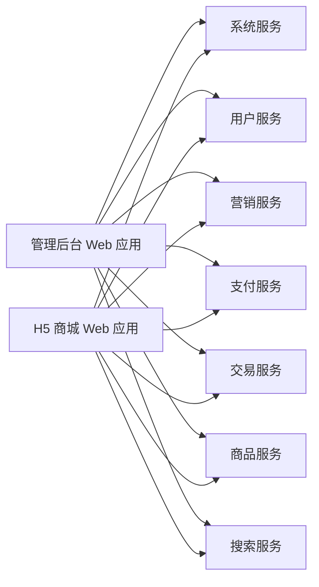

# 系统架构

<cite>
**本文引用的文件**
- [README.md](file://README.md)
- [pom.xml](file://pom.xml)
- [DubboEnvironmentPostProcessor.java](file://common/mall-spring-boot-starter-dubbo/src/main/java/cn/iocoder/mall/dubbo/config/DubboEnvironmentPostProcessor.java)
- [application.yml（管理后台）](file://management-web-app/src/main/resources/application.yml)
- [application.yml（H5商城）](file://shop-web-app/src/main/resources/application.yml)
- [application.yaml（支付服务）](file://pay-service-project/pay-service-app/src/main/resources/application.yaml)
- [application.yaml（商品服务）](file://product-service-project/product-service-app/src/main/resources/application.yaml)
- [application.yaml（系统服务）](file://system-service-project/system-service-app/src/main/resources/application.yaml)
- [UserRpc.java](file://user-service-project/user-service-api/src/main/java/cn/iocoder/mall/userservice/rpc/user/UserRpc.java)
- [AdminRpc.java](file://system-service-project/system-service-api/src/main/java/cn/iocoder/mall/systemservice/rpc/admin/AdminRpc.java)
- [PayTransactionRpc.java](file://pay-service-project/pay-service-api/src/main/java/cn/iocoder/mall/payservice/rpc/transaction/PayTransactionRpc.java)
- [TradeOrderRpc.java](file://trade-service-project/trade-service-api/src/main/java/cn/iocoder/mall/tradeservice/rpc/order/TradeOrderRpc.java)
- [ProductSpuRpc.java](file://product-service-project/product-service-api/src/main/java/cn/iocoder/mall/productservice/rpc/spu/ProductSpuRpc.java)
</cite>

## 目录
1. [引言](#引言)
2. [项目结构](#项目结构)
3. [核心组件](#核心组件)
4. [架构总览](#架构总览)
5. [详细组件分析](#详细组件分析)
6. [依赖关系分析](#依赖关系分析)
7. [性能考量](#性能考量)
8. [故障排查指南](#故障排查指南)
9. [结论](#结论)
10. [附录](#附录)

## 引言
本架构文档面向Onemall微服务电商系统，围绕基于Spring Cloud Alibaba的微服务设计，系统化阐述服务拆分原则、服务间通信机制、数据一致性策略、DDD业务域边界、微服务治理（注册发现、负载均衡、熔断降级、网关路由）、数据架构（数据库、缓存、消息队列）、监控体系（SkyWalking、Prometheus、Grafana），以及高可用、容灾与性能优化方案。文档同时提供架构图与组件交互流程图，帮助开发者快速理解整体设计。

## 项目结构
Onemall采用多模块聚合工程组织，顶层通过父POM统一管理模块与插件。系统由两类对外服务与多个内部RPC服务组成：
- 对外HTTP服务：管理后台Web应用与H5商城Web应用，分别提供管理端与用户端的REST API。
- 内部RPC服务：系统、用户、营销、支付、交易、商品、搜索等服务，均采用Dubbo作为RPC框架，通过Spring Cloud Alibaba进行注册与发现。

**图表来源**
- [pom.xml:16-28](file://pom.xml#L16-L28)
- [README.md:109-126](file://README.md#L109-L126)

**章节来源**
- [pom.xml:16-28](file://pom.xml#L16-L28)
- [README.md:107-126](file://README.md#L107-L126)

## 核心组件
- 外部Web应用
  - 管理后台Web应用：提供管理端API，绑定端口与上下文路径，启用Actuator监控端点，消费者声明订阅系统、用户、营销、支付、交易、商品等RPC服务。
  - H5商城Web应用：提供用户侧购物流程API，绑定端口与上下文路径，启用Actuator监控端点，消费者声明订阅系统、用户、商品、搜索、价格、营销、交易、支付、地址等RPC服务。
- RPC服务
  - 系统服务：提供管理员、权限、数据字典、日志、错误码等能力，作为多模块依赖的基础能力。
  - 用户服务：提供用户、地址、短信验证码等能力。
  - 商品服务：提供SPU、SKU、属性等商品域能力。
  - 支付服务：提供支付交易单创建、提交、查询、成功更新等能力。
  - 交易服务：提供订单创建、查询、分页、支付成功回调等能力。
  - 营销服务：提供活动、优惠券、推荐等营销域能力。
  - 搜索服务：提供商品搜索RPC能力。
- RPC通信与治理
  - 采用Dubbo作为RPC框架，通过Spring Cloud Alibaba实现注册与发现。
  - 通过EnvironmentPostProcessor动态注入DUBBO_TAG，便于本地开发环境下的路由与灰度。
- 监控与可观测性
  - SkyWalking：分布式追踪。
  - Prometheus + Grafana：指标采集与可视化。
  - Actuator：各服务独立端口暴露监控端点。

**章节来源**
- [application.yml（管理后台）:1-83](file://management-web-app/src/main/resources/application.yml#L1-L83)
- [application.yml（H5商城）:1-76](file://shop-web-app/src/main/resources/application.yml#L1-L76)
- [application.yaml（支付服务）:1-65](file://pay-service-project/pay-service-app/src/main/resources/application.yaml#L1-L65)
- [application.yaml（商品服务）:1-61](file://product-service-project/product-service-app/src/main/resources/application.yaml#L1-L61)
- [application.yaml（系统服务）:1-79](file://system-service-project/system-service-app/src/main/resources/application.yaml#L1-L79)
- [DubboEnvironmentPostProcessor.java:1-67](file://common/mall-spring-boot-starter-dubbo/src/main/java/cn/iocoder/mall/dubbo/config/DubboEnvironmentPostProcessor.java#L1-L67)

## 架构总览
系统采用“双Web入口 + 多RPC服务”的分层架构。Web应用负责请求接入与业务编排，RPC服务负责领域能力封装与数据持久化。服务间通过Dubbo进行RPC调用，结合注册中心完成服务发现与负载均衡。消息队列用于异步解耦与削峰填谷，监控体系贯穿全链路。

**图表来源**
- [README.md:141-167](file://README.md#L141-L167)
- [application.yml（管理后台）:19-71](file://management-web-app/src/main/resources/application.yml#L19-L71)
- [application.yml（H5商城）:19-63](file://shop-web-app/src/main/resources/application.yml#L19-L63)
- [application.yaml（支付服务）:47-51](file://pay-service-project/pay-service-app/src/main/resources/application.yaml#L47-L51)
- [application.yaml（商品服务）:43-47](file://product-service-project/product-service-app/src/main/resources/application.yaml#L43-L47)

## 详细组件分析

### 服务拆分与DDD业务域
- 业务域划分
  - 用户域：用户、地址、短信验证码等，由用户服务承载。
  - 商品域：SPU、SKU、属性、品牌、分类等，由商品服务承载。
  - 营销域：活动、优惠券、推荐等，由营销服务承载。
  - 交易域：订单、售后、物流等，由交易服务承载。
  - 支付域：支付交易单、退款等，由支付服务承载。
  - 系统域：管理员、权限、数据字典、日志、错误码等，由系统服务承载。
  - 搜索域：商品搜索，由搜索服务承载。
- 领域边界
  - 各服务边界清晰，围绕限界上下文划分，避免跨域耦合。
  - 通过RPC接口暴露能力，Web应用仅负责编排与展示。

**章节来源**
- [UserRpc.java:12-54](file://user-service-project/user-service-api/src/main/java/cn/iocoder/mall/userservice/rpc/user/UserRpc.java#L12-L54)
- [ProductSpuRpc.java:13-65](file://product-service-project/product-service-api/src/main/java/cn/iocoder/mall/productservice/rpc/spu/ProductSpuRpc.java#L13-L65)
- [PayTransactionRpc.java:10-52](file://pay-service-project/pay-service-api/src/main/java/cn/iocoder/mall/payservice/rpc/transaction/PayTransactionRpc.java#L10-L52)
- [TradeOrderRpc.java:14-54](file://trade-service-project/trade-service-api/src/main/java/cn/iocoder/mall/tradeservice/rpc/order/TradeOrderRpc.java#L14-L54)
- [AdminRpc.java:14-26](file://system-service-project/system-service-api/src/main/java/cn/iocoder/mall/systemservice/rpc/admin/AdminRpc.java#L14-L26)

### 服务注册与发现、负载均衡
- 注册中心：Zookeeper作为注册中心，服务通过Dubbo协议发布与订阅。
- 负载均衡：Dubbo内置多种负载均衡策略，结合消费者配置可灵活选择。
- 环境标签：通过EnvironmentPostProcessor动态注入DUBBO_TAG，便于本地开发环境下的路由与灰度。

**图表来源**
- [DubboEnvironmentPostProcessor.java:33-45](file://common/mall-spring-boot-starter-dubbo/src/main/java/cn/iocoder/mall/dubbo/config/DubboEnvironmentPostProcessor.java#L33-L45)
- [application.yml（管理后台）:22-23](file://management-web-app/src/main/resources/application.yml#L22-L23)
- [application.yml（H5商城）:22-23](file://shop-web-app/src/main/resources/application.yml#L22-L23)

**章节来源**
- [DubboEnvironmentPostProcessor.java:1-67](file://common/mall-spring-boot-starter-dubbo/src/main/java/cn/iocoder/mall/dubbo/config/DubboEnvironmentPostProcessor.java#L1-L67)
- [application.yml（管理后台）:19-71](file://management-web-app/src/main/resources/application.yml#L19-L71)
- [application.yml（H5商城）:19-63](file://shop-web-app/src/main/resources/application.yml#L19-L63)

### 熔断降级与网关路由
- 熔断降级：结合Sentinel或Hystrix（按技术栈规划）对下游依赖进行熔断与降级，保证雪崩效应控制。
- 网关路由：结合Soul或Gateway进行统一路由、鉴权、限流与协议转换，对外暴露统一入口。

（本节为概念性说明，未直接分析具体源码文件）

### 数据一致性策略
- 本地事务：单服务内使用本地事务保证数据一致性。
- 最终一致性：跨服务通过消息队列异步解耦，结合幂等设计与补偿机制，达成最终一致。
- 分布式事务：Seata用于处理跨服务的分布式事务场景，降低一致性成本。

（本节为概念性说明，未直接分析具体源码文件）

### 数据架构设计
- 数据库：MySQL作为主存储，MyBatis-Plus提供ORM增强能力。
- 缓存：Redis/Redisson作为缓存与分布式锁候选，按压测与性能评估逐步引入。
- 消息队列：RocketMQ用于异步解耦与削峰填谷，如支付回调、订单状态变更等。

**章节来源**
- [README.md:141-167](file://README.md#L141-L167)
- [application.yaml（支付服务）:47-51](file://pay-service-project/pay-service-app/src/main/resources/application.yaml#L47-L51)
- [application.yaml（商品服务）:43-47](file://product-service-project/product-service-app/src/main/resources/application.yaml#L43-L47)

### 监控体系集成与配置
- SkyWalking：分布式追踪，定位链路瓶颈与异常。
- Prometheus + Grafana：指标采集与可视化，展示系统健康度与性能趋势。
- Actuator：各服务独立端口暴露监控端点，便于统一采集。

**章节来源**
- [README.md:185-199](file://README.md#L185-L199)
- [application.yml（管理后台）:79-83](file://management-web-app/src/main/resources/application.yml#L79-L83)
- [application.yml（H5商城）:72-76](file://shop-web-app/src/main/resources/application.yml#L72-L76)
- [application.yaml（支付服务）:53-57](file://pay-service-project/pay-service-app/src/main/resources/application.yaml#L53-L57)
- [application.yaml（商品服务）:49-53](file://product-service-project/product-service-app/src/main/resources/application.yaml#L49-L53)
- [application.yaml（系统服务）:62-66](file://system-service-project/system-service-app/src/main/resources/application.yaml#L62-L66)

## 依赖关系分析
- Web应用依赖RPC接口：管理后台与H5商城分别声明订阅系统、用户、营销、支付、交易、商品、搜索等RPC服务。
- RPC服务之间无循环依赖：通过接口契约隔离，避免耦合。
- 基础设施依赖：注册中心、消息队列、监控平台为所有服务共享。

**图表来源**
- [application.yml（管理后台）:22-71](file://management-web-app/src/main/resources/application.yml#L22-L71)
- [application.yml（H5商城）:22-63](file://shop-web-app/src/main/resources/application.yml#L22-L63)

**章节来源**
- [application.yml（管理后台）:19-71](file://management-web-app/src/main/resources/application.yml#L19-L71)
- [application.yml（H5商城）:19-63](file://shop-web-app/src/main/resources/application.yml#L19-L63)

## 性能考量
- 服务拆分粒度：按业务域拆分，减少单体膨胀，提升并发与扩展性。
- RPC调用优化：合理设置超时、重试与熔断阈值，避免级联故障。
- 缓存策略：热点数据引入缓存，结合失效与预热策略，降低数据库压力。
- 消息队列：异步化高频操作，削峰填谷，提升吞吐。
- 监控与告警：建立完善的指标体系与告警机制，及时发现性能瓶颈。

（本节为通用指导，未直接分析具体源码文件）

## 故障排查指南
- Dubbo标签与路由
  - 若本地开发出现路由异常，检查DUBBO_TAG是否正确注入，确保消费者与提供者标签匹配。
- RPC调用失败
  - 检查注册中心连通性与服务实例健康状态。
  - 核对消费者与提供者版本号、分组配置是否一致。
- 监控与可观测性
  - 通过Actuator端点确认服务健康状态。
  - 结合SkyWalking链路与Prometheus指标定位问题根因。

**章节来源**
- [DubboEnvironmentPostProcessor.java:33-45](file://common/mall-spring-boot-starter-dubbo/src/main/java/cn/iocoder/mall/dubbo/config/DubboEnvironmentPostProcessor.java#L33-L45)
- [application.yml（管理后台）:79-83](file://management-web-app/src/main/resources/application.yml#L79-L83)
- [application.yml（H5商城）:72-76](file://shop-web-app/src/main/resources/application.yml#L72-L76)

## 结论
Onemall以Spring Cloud Alibaba为核心，构建了清晰的业务域边界与服务拆分，通过Dubbo实现高效稳定的RPC通信，并结合消息队列与监控体系，形成完整的微服务体系。未来可进一步引入Sentinel、Soul、Apollo等组件，持续完善治理与运维能力。

## 附录
- 快速启动与演示：参考项目README中的搭建与演示说明，获取中间件管理平台地址与账号信息。

**章节来源**
- [README.md:99-102](file://README.md#L99-L102)
- [README.md:60-96](file://README.md#L60-L96)