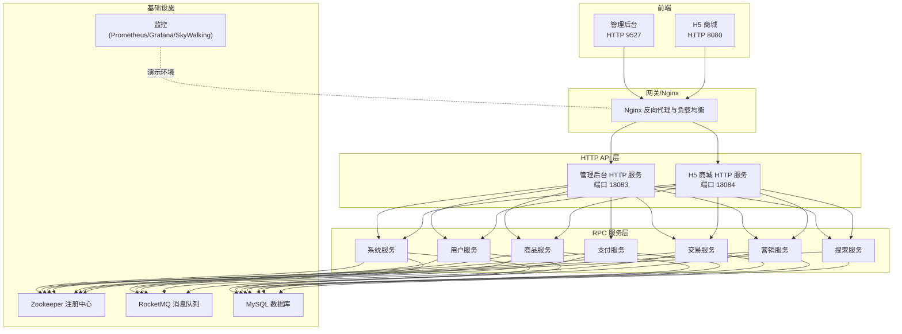
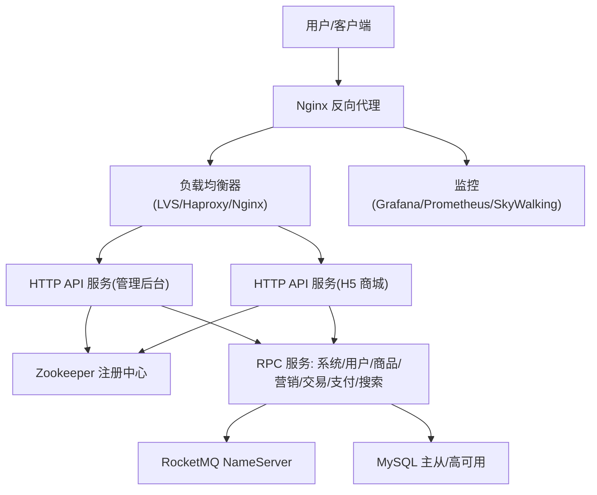
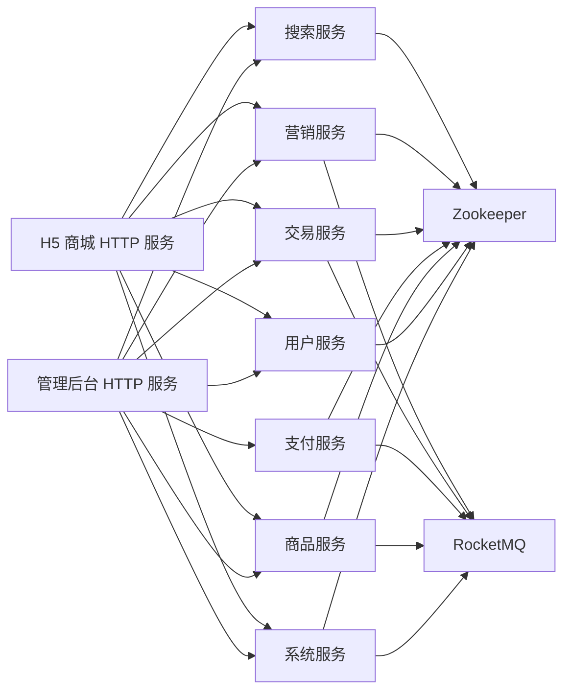

# 部署拓扑与高可用

<cite>
**本文引用的文件**
- [README.md](file://README.md)
- [quick-start.md](file://docs/setup/quick-start.md)
- [application.yml（管理后台）](file://management-web-app/src/main/resources/application.yml)
- [application.yml（H5 商城）](file://shop-web-app/src/main/resources/application.yml)
- [application.yaml（支付服务）](file://pay-service-project/pay-service-app/src/main/resources/application.yaml)
- [application.yaml（商品服务）](file://product-service-project/product-service-app/src/main/resources/application.yaml)
- [application.yaml（系统服务）](file://system-service-project/system-service-app/src/main/resources/application.yaml)
- [application.yaml（营销服务）](file://promotion-service-project/promotion-service-app/src/main/resources/application.yaml)
- [application.yaml（交易服务）](file://trade-service-project/trade-service-app/src/main/resources/application.yaml)
</cite>

## 目录
1. [引言](#引言)
2. [项目结构](#项目结构)
3. [核心组件](#核心组件)
4. [架构总览](#架构总览)
5. [详细组件分析](#详细组件分析)
6. [依赖关系分析](#依赖关系分析)
7. [性能考量](#性能考量)
8. [故障排查指南](#故障排查指南)
9. [结论](#结论)
10. [附录](#附录)

## 引言
本文件面向 Onemall 生产环境部署，围绕“Nginx 反向代理与负载均衡、服务集群、容器化与 Kubernetes 编排、高可用设计、蓝绿与灰度发布、部署脚本与配置示例、性能调优与容量规划”等方面，结合仓库现有配置与技术栈，给出可落地的部署实践建议。由于仓库未提供 Dockerfile/Kubernetes YAML 等编排文件，本文在“容器化与 Kubernetes 部署”章节提供通用模板与最佳实践，便于团队按需落地。

## 项目结构
Onemall 采用前后端分离与微服务架构：
- 前端：管理后台与 H5 商城分别独立运行
- 后端：HTTP API 层（management-web-app、shop-web-app）与 RPC 服务层（system-service、user-service、promotion-service、pay-service、trade-service、product-service、search-service）
- 注册中心：Zookeeper（通过 Dubbo Cloud Alibaba 配置）
- 消息队列：RocketMQ
- 数据库：MySQL（各服务独立配置）
- 监控：Prometheus + Grafana + SkyWalking（演示环境）

图表来源
- [README.md: 109-126:109-126](file://README.md#L109-L126)
- [application.yml（管理后台）: 1-83:1-83](file://management-web-app/src/main/resources/application.yml#L1-L83)
- [application.yml（H5 商城）: 1-76:1-76](file://shop-web-app/src/main/resources/application.yml#L1-L76)
- [application.yaml（系统服务）: 1-79:1-79](file://system-service-project/system-service-app/src/main/resources/application.yaml#L1-L79)
- [application.yaml（商品服务）: 1-61:1-61](file://product-service-project/product-service-app/src/main/resources/application.yaml#L1-L61)
- [application.yaml（支付服务）: 1-65:1-65](file://pay-service-project/pay-service-app/src/main/resources/application.yaml#L1-L65)
- [application.yaml（营销服务）: 1-65:1-65](file://promotion-service-project/promotion-service-app/src/main/resources/application.yaml#L1-L65)
- [application.yaml（交易服务）: 1-76:1-76](file://trade-service-project/trade-service-app/src/main/resources/application.yaml#L1-L76)

章节来源
- [README.md: 109-126:109-126](file://README.md#L109-L126)
- [quick-start.md: 150-167:150-167](file://docs/setup/quick-start.md#L150-L167)

## 核心组件
- 管理后台 HTTP 服务：端口 18083，上下文路径 /management-api/，订阅 system-service 等 RPC 服务
- H5 商城 HTTP 服务：端口 18084，上下文路径 /shop-api/，订阅 user-service、system-service 等 RPC 服务
- RPC 服务：系统、用户、商品、支付、交易、营销、搜索服务，均通过 Dubbo 协议与 Zookeeper 注册中心交互
- RocketMQ：各服务通过 name-server 发送/消费消息
- Actuator：各服务独立暴露监控端口（如 38080~38089），避免与 Web 端口冲突
- MySQL：各服务独立配置数据源

章节来源
- [application.yml（管理后台）: 1-83:1-83](file://management-web-app/src/main/resources/application.yml#L1-L83)
- [application.yml（H5 商城）: 1-76:1-76](file://shop-web-app/src/main/resources/application.yml#L1-L76)
- [application.yaml（系统服务）: 1-79:1-79](file://system-service-project/system-service-app/src/main/resources/application.yaml#L1-L79)
- [application.yaml（商品服务）: 1-61:1-61](file://product-service-project/product-service-app/src/main/resources/application.yaml#L1-L61)
- [application.yaml（支付服务）: 1-65:1-65](file://pay-service-project/pay-service-app/src/main/resources/application.yaml#L1-L65)
- [application.yaml（营销服务）: 1-65:1-65](file://promotion-service-project/promotion-service-app/src/main/resources/application.yaml#L1-L65)
- [application.yaml（交易服务）: 1-76:1-76](file://trade-service-project/trade-service-app/src/main/resources/application.yaml#L1-L76)

## 架构总览
生产环境推荐采用“Nginx + 负载均衡 + 多实例服务集群 + 注册中心 + 消息队列 + 数据库”的拓扑。Nginx 作为统一入口，负责静态资源、HTTPS 终止、健康检查与转发；后端服务以多副本形式部署，通过 Zookeeper 进行服务发现与路由；RocketMQ 承担异步解耦；MySQL 通过主从/高可用方案保障数据可靠性。

图表来源
- [README.md: 200-206:200-206](file://README.md#L200-L206)
- [application.yml（管理后台）: 19-71:19-71](file://management-web-app/src/main/resources/application.yml#L19-L71)
- [application.yml（H5 商城）: 19-63:19-63](file://shop-web-app/src/main/resources/application.yml#L19-L63)
- [application.yaml（系统服务）: 22-66:22-66](file://system-service-project/system-service-app/src/main/resources/application.yaml#L22-L66)
- [application.yaml（商品服务）: 21-53:21-53](file://product-service-project/product-service-app/src/main/resources/application.yaml#L21-L53)
- [application.yaml（支付服务）: 21-57:21-57](file://pay-service-project/pay-service-app/src/main/resources/application.yaml#L21-L57)
- [application.yaml（营销服务）: 21-57:21-57](file://promotion-service-project/promotion-service-app/src/main/resources/application.yaml#L21-L57)
- [application.yaml（交易服务）: 21-63:21-63](file://trade-service-project/trade-service-app/src/main/resources/application.yaml#L21-L63)

## 详细组件分析

### Nginx 反向代理与负载均衡
- 入口与路由
  - 管理后台：/management-api/ → 管理后台 HTTP 服务
  - H5 商城：/shop-api/ → H5 商城 HTTP 服务
- 负载均衡策略
  - 建议使用轮询或最少连接，配合健康检查
- 安全与性能
  - HTTPS 终止与证书管理
  - 静态资源缓存与压缩
  - 请求限流与防护（WAF/限速）
- 健康检查
  - 基于各服务 Actuator 端口探测存活状态

章节来源
- [application.yml（管理后台）: 2-6:2-6](file://management-web-app/src/main/resources/application.yml#L2-L6)
- [application.yml（H5 商城）: 2-6:2-6](file://shop-web-app/src/main/resources/application.yml#L2-L6)
- [application.yaml（系统服务）: 63-66:63-66](file://system-service-project/system-service-app/src/main/resources/application.yaml#L63-L66)
- [application.yaml（商品服务）: 50-53:50-53](file://product-service-project/product-service-app/src/main/resources/application.yaml#L50-L53)
- [application.yaml（支付服务）: 54-57:54-57](file://pay-service-project/pay-service-app/src/main/resources/application.yaml#L54-L57)
- [application.yaml（营销服务）: 54-57:54-57](file://promotion-service-project/promotion-service-app/src/main/resources/application.yaml#L54-L57)
- [application.yaml（交易服务）: 60-63:60-63](file://trade-service-project/trade-service-app/src/main/resources/application.yaml#L60-L63)

### 服务集群与注册中心
- 注册中心：Zookeeper（Dubbo Cloud Alibaba 配置）
- 服务发现：各 HTTP 服务通过 Dubbo 消费 RPC 服务，RPC 服务通过 Dubbo 提供者协议暴露
- 健康检查：Nginx 结合 Actuator 端口进行探活
- 多副本：建议每类服务至少 2-3 副本，跨可用区部署

章节来源
- [application.yml（管理后台）: 19-71:19-71](file://management-web-app/src/main/resources/application.yml#L19-L71)
- [application.yml（H5 商城）: 19-63:19-63](file://shop-web-app/src/main/resources/application.yml#L19-L63)
- [application.yaml（系统服务）: 22-66:22-66](file://system-service-project/system-service-app/src/main/resources/application.yaml#L22-L66)

### 消息队列与异步处理
- RocketMQ：各服务通过 name-server 发送/消费消息，生产组名使用服务名
- 建议：为关键流程（订单、支付回调、库存扣减）设置死信队列与重试策略

章节来源
- [application.yaml（支付服务）: 47-52:47-52](file://pay-service-project/pay-service-app/src/main/resources/application.yaml#L47-L52)
- [application.yaml（商品服务）: 43-47:43-47](file://product-service-project/product-service-app/src/main/resources/application.yaml#L43-L47)
- [application.yaml（营销服务）: 47-51:47-51](file://promotion-service-project/promotion-service-app/src/main/resources/application.yaml#L47-L51)
- [application.yaml（交易服务）: 53-57:53-57](file://trade-service-project/trade-service-app/src/main/resources/application.yaml#L53-L57)

### 数据库与高可用
- MySQL：各服务独立配置数据源，建议采用主从复制与只读副本
- 建议：开启 binlog、慢查询日志与备份策略；读写分离与连接池参数调优

章节来源
- [quick-start.md: 36-48:36-48](file://docs/setup/quick-start.md#L36-L48)
- [application.yaml（系统服务）: 10-21:10-21](file://system-service-project/system-service-app/src/main/resources/application.yaml#L10-L21)
- [application.yaml（商品服务）: 9-20:9-20](file://product-service-project/product-service-app/src/main/resources/application.yaml#L9-L20)
- [application.yaml（支付服务）: 1-L19:1-19](file://pay-service-project/pay-service-app/src/main/resources/application.yaml#L1-L19)
- [application.yaml（营销服务）: 9-20:9-20](file://promotion-service-project/promotion-service-app/src/main/resources/application.yaml#L9-L20)
- [application.yaml（交易服务）: 9-20:9-20](file://trade-service-project/trade-service-app/src/main/resources/application.yaml#L9-L20)

### 监控与可观测性
- Prometheus + Grafana：采集指标，展示服务健康与性能
- SkyWalking：链路追踪与调用关系可视化
- 建议：为各服务配置独立监控端口与指标导出

章节来源
- [README.md: 185-199:185-199](file://README.md#L185-L199)
- [application.yml（管理后台）: 80-83:80-83](file://management-web-app/src/main/resources/application.yml#L80-L83)
- [application.yml（H5 商城）: 72-76:72-76](file://shop-web-app/src/main/resources/application.yml#L72-L76)
- [application.yaml（系统服务）: 63-66:63-66](file://system-service-project/system-service-app/src/main/resources/application.yaml#L63-L66)

## 依赖关系分析
- HTTP API 服务依赖 Zookeeper 进行服务发现
- HTTP API 服务消费 RPC 服务提供的接口
- RPC 服务依赖 MySQL 存储与 RocketMQ 异步处理
- Nginx 作为统一入口，负责路由与负载均衡

图表来源
- [application.yml（管理后台）: 19-71:19-71](file://management-web-app/src/main/resources/application.yml#L19-L71)
- [application.yml（H5 商城）: 19-63:19-63](file://shop-web-app/src/main/resources/application.yml#L19-L63)
- [application.yaml（系统服务）: 22-66:22-66](file://system-service-project/system-service-app/src/main/resources/application.yaml#L22-L66)

## 性能考量
- 网络与接入
  - Nginx 使用 keepalive 与合理的超时参数
  - 启用 Gzip/HTTP2/TLS 优化传输
- 应用层
  - 连接池大小与超时阈值按 QPS 与 RT 调整
  - RPC 调用超时与重试策略合理配置
- 存储
  - MySQL 主从延迟监控与只读副本分流
  - 索引与慢查询优化
- 缓存
  - Redis 缓存热点数据（待上线模块）
- 监控
  - 指标细分到服务、接口、SQL、RPC 方法
  - 告警阈值分级与通知渠道

## 故障排查指南
- 服务不可达
  - 检查 Nginx 路由与后端健康检查
  - 查看 Zookeeper 是否连通与服务是否注册
- RPC 调用失败
  - 核对 Dubbo 版本与消费者/提供者配置
  - 关注 Actuator 端口与 JVM 指标
- 消息积压
  - RocketMQ 消费速率与队列数评估
  - 死信队列与重试策略
- 数据异常
  - MySQL 主从同步状态与一致性校验
  - 事务与幂等设计

章节来源
- [application.yml（管理后台）: 19-71:19-71](file://management-web-app/src/main/resources/application.yml#L19-L71)
- [application.yml（H5 商城）: 19-63:19-63](file://shop-web-app/src/main/resources/application.yml#L19-L63)
- [application.yaml（系统服务）: 22-66:22-66](file://system-service-project/system-service-app/src/main/resources/application.yaml#L22-L66)

## 结论
Onemall 的生产部署应以“Nginx + 负载均衡 + 多副本服务集群 + 注册中心 + 消息队列 + 高可用数据库”为核心，结合监控与告警实现可观测性闭环。容器化与 Kubernetes 编排可进一步提升弹性与运维效率，建议按本文模板与最佳实践逐步落地。

## 附录

### A. 生产环境部署拓扑建议
- 边界安全：Nginx 作为 WAF/防火墙前置，启用 HTTPS 与证书管理
- 服务网格：可选引入服务网格（Istio/Sidecar）增强治理
- 多活与灾备：跨可用区部署，数据库主从/异地容灾
- CI/CD：Jenkins 或 GitOps 工具链自动化部署

### B. Docker 容器化部署策略（模板）
- 镜像构建
  - 基于官方 JDK 镜像，打包 Spring Boot 可执行 jar
  - 多阶段构建减少镜像体积
- 容器编排
  - 为 HTTP API 与 RPC 服务分别定义 Deployment
  - 使用 ConfigMap/Secret 管理环境变量与敏感信息
  - 为 Actuator 独立暴露端口，避免与 Web 冲突
- 资源限制
  - CPU/内存 requests/limits 按历史峰值与安全系数设定
  - JVM 参数与 GC 调优结合容器资源限制

### C. Kubernetes 集群部署方案（模板）
- Deployment
  - 为管理后台、H5 商城、各 RPC 服务分别创建 Deployment
  - 设置副本数与滚动更新策略
- Service
  - ClusterIP 暴露内部服务，供 HTTP API 服务消费
- Ingress
  - Nginx Ingress 控制器，配置 TLS 与路由规则
- ConfigMap/Secret
  - 数据库连接、注册中心地址、RocketMQ 地址、Actuator 端口等
- HPA/VPA
  - 基于 CPU/内存或自定义指标自动扩缩容

### D. 高可用设计
- 多活部署
  - 跨可用区部署，流量按权重或区域路由
- 故障转移
  - Nginx + 负载均衡健康检查与自动摘除
  - 注册中心与数据库主从切换演练
- 数据备份
  - 定期全量与增量备份，恢复演练常态化

### E. 蓝绿与灰度发布
- 蓝绿发布
  - 两套完全相同的环境，切换流量实现零停机
- 灰度发布
  - 基于 Ingress 规则或服务网格实现流量切分
  - 结合监控与告警，快速回滚

### F. 部署脚本与配置示例（要点）
- 环境变量
  - 数据库连接串、注册中心地址、RocketMQ NameServer、Actuator 端口
- 数据库连接
  - 为每个服务配置独立的数据源与连接池参数
- 服务注册
  - Dubbo Cloud Alibaba 的注册中心地址与订阅服务列表
- Actuator
  - 独立端口暴露，仅限内网访问或鉴权

章节来源
- [README.md: 200-206:200-206](file://README.md#L200-L206)
- [quick-start.md: 36-48:36-48](file://docs/setup/quick-start.md#L36-L48)
- [application.yml（管理后台）: 19-83:19-83](file://management-web-app/src/main/resources/application.yml#L19-L83)
- [application.yml（H5 商城）: 19-76:19-76](file://shop-web-app/src/main/resources/application.yml#L19-L76)
- [application.yaml（系统服务）: 22-79:22-79](file://system-service-project/system-service-app/src/main/resources/application.yaml#L22-L79)
- [application.yaml（商品服务）: 21-61:21-61](file://product-service-project/product-service-app/src/main/resources/application.yaml#L21-L61)
- [application.yaml（支付服务）: 21-65:21-65](file://pay-service-project/pay-service-app/src/main/resources/application.yaml#L21-L65)
- [application.yaml（营销服务）: 21-65:21-65](file://promotion-service-project/promotion-service-app/src/main/resources/application.yaml#L21-L65)
- [application.yaml（交易服务）: 21-76:21-76](file://trade-service-project/trade-service-app/src/main/resources/application.yaml#L21-L76)