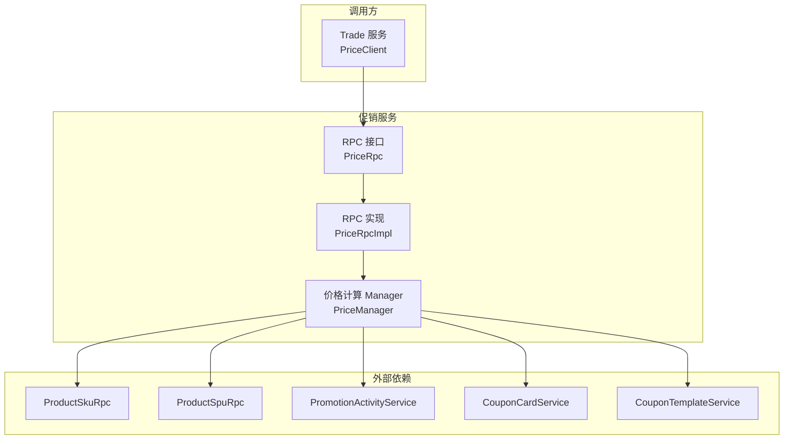
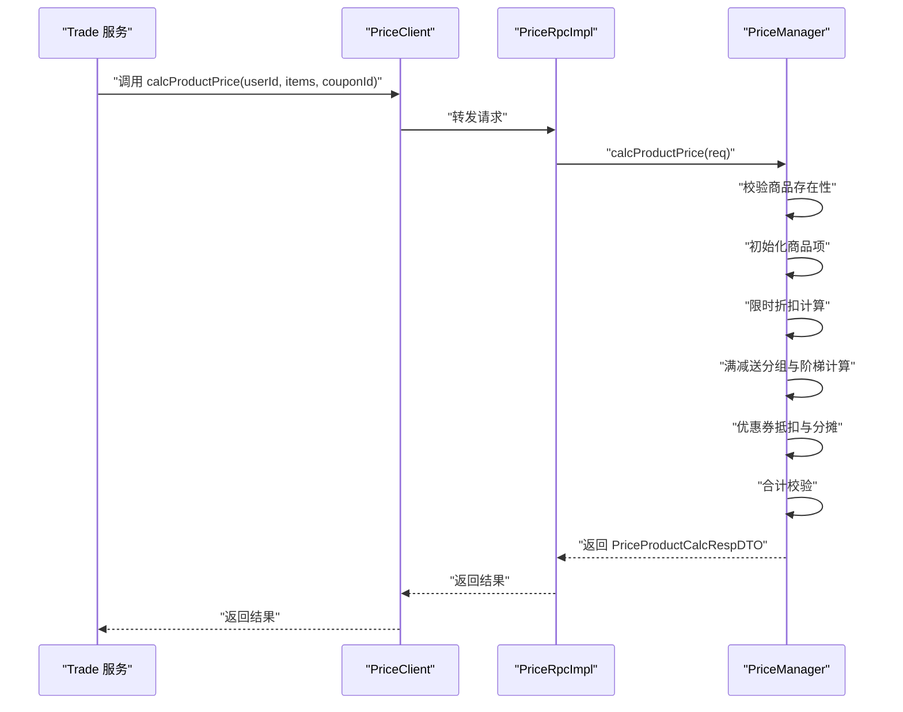
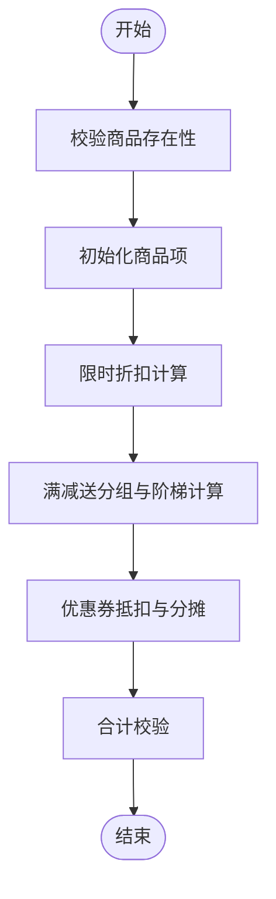
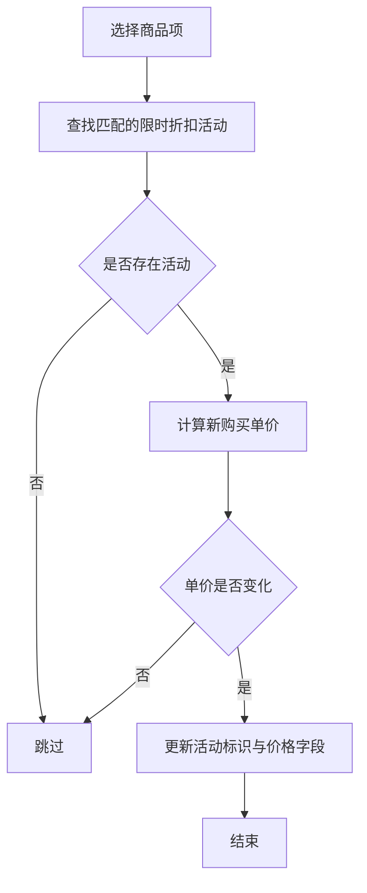
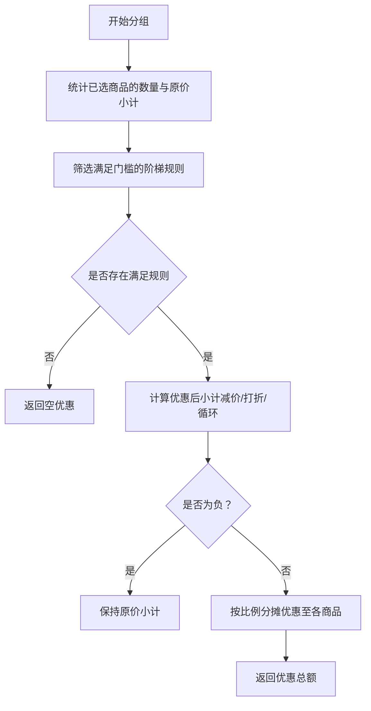
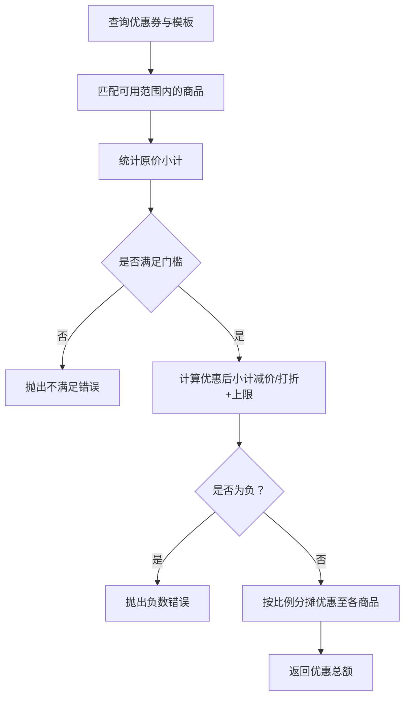
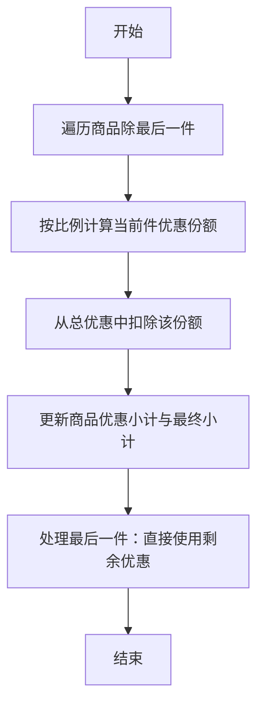
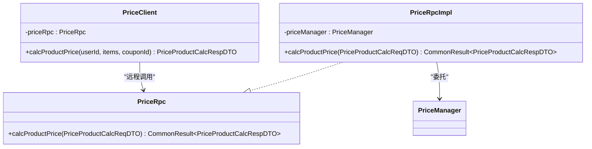
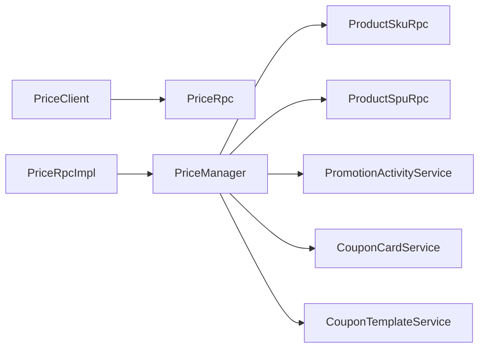

# 价格计算引擎

<cite>
**本文引用的文件**
- [PriceRpc.java](file://promotion-service-project/promotion-service-api/src/main/java/cn/iocoder/mall/promotion/api/rpc/price/PriceRpc.java)
- [PriceProductCalcReqDTO.java](file://promotion-service-project/promotion-service-api/src/main/java/cn/iocoder/mall/promotion/api/rpc/price/dto/PriceProductCalcReqDTO.java)
- [PriceProductCalcRespDTO.java](file://promotion-service-project/promotion-service-api/src/main/java/cn/iocoder/mall/promotion/api/rpc/price/dto/PriceProductCalcRespDTO.java)
- [PriceManager.java](file://promotion-service-project/promotion-service-app/src/main/java/cn/iocoder/mall/promotionservice/manager/price/PriceManager.java)
- [PriceRpcImpl.java](file://promotion-service-project/promotion-service-app/src/main/java/cn/iocoder/mall/promotionservice/rpc/price/PriceRpcImpl.java)
- [PreferentialTypeEnum.java](file://promotion-service-project/promotion-service-api/src/main/java/cn/iocoder/mall/promotion/api/enums/PreferentialTypeEnum.java)
- [MeetTypeEnum.java](file://promotion-service-project/promotion-service-api/src/main/java/cn/iocoder/mall/promotion/api/enums/MeetTypeEnum.java)
- [RangeTypeEnum.java](file://promotion-service-project/promotion-service-api/src/main/java/cn/iocoder/mall/promotion/api/enums/RangeTypeEnum.java)
- [PriceManagerTest.java](file://promotion-service-project/promotion-service-app/src/test/java/cn/iocoder/mall/promotionservice/manager/price/PriceManagerTest.java)
- [PriceClient.java](file://trade-service-project/trade-service-app/src/main/java/cn/iocoder/mall/tradeservice/client/promotion/PriceClient.java)
</cite>

## 目录
1. [引言](#引言)
2. [项目结构](#项目结构)
3. [核心组件](#核心组件)
4. [架构总览](#架构总览)
5. [详细组件分析](#详细组件分析)
6. [依赖分析](#依赖分析)
7. [性能考虑](#性能考虑)
8. [故障排查指南](#故障排查指南)
9. [结论](#结论)
10. [附录](#附录)

## 引言
本文件面向“价格计算引擎”的技术文档，系统性阐述价格计算的核心算法与业务规则，覆盖以下主题：
- 核心算法：限时折扣、满减送（含阶梯）、优惠券抵扣与分摊
- 优惠叠加与优先级：同类型与跨类型叠加策略、优惠上限设置
- 价格计算优先级：活动优先、优惠券优先、会员等级影响（如适用）
- 边界情况：负数处理、精度控制、四舍五入规则
- 性能优化：缓存策略、批量计算、异步处理
- 完整流程图与伪代码路径
- 测试用例与验证方法

## 项目结构
价格计算引擎位于“promotion-service”模块，采用 RPC 接口 + Manager 实现 + Dubbo 暴露的分层设计：
- API 层：定义价格计算 RPC 接口与请求/响应 DTO
- 应用层：实现价格计算逻辑（PriceManager），并暴露 RPC 实现（PriceRpcImpl）
- 调用方：Trade 服务通过 PriceClient 进行远程调用
- 枚举层：优惠类型、匹配类型、可用范围类型等

图表来源
- [PriceClient.java:1-35](file://trade-service-project/trade-service-app/src/main/java/cn/iocoder/mall/tradeservice/client/promotion/PriceClient.java#L1-L35)
- [PriceRpc.java:1-15](file://promotion-service-project/promotion-service-api/src/main/java/cn/iocoder/mall/promotion/api/rpc/price/PriceRpc.java#L1-L15)
- [PriceRpcImpl.java:1-25](file://promotion-service-project/promotion-service-app/src/main/java/cn/iocoder/mall/promotionservice/rpc/price/PriceRpcImpl.java#L1-L25)
- [PriceManager.java:1-379](file://promotion-service-project/promotion-service-app/src/main/java/cn/iocoder/mall/promotionservice/manager/price/PriceManager.java#L1-L379)

章节来源
- [PriceRpc.java:1-15](file://promotion-service-project/promotion-service-api/src/main/java/cn/iocoder/mall/promotion/api/rpc/price/PriceRpc.java#L1-L15)
- [PriceRpcImpl.java:1-25](file://promotion-service-project/promotion-service-app/src/main/java/cn/iocoder/mall/promotionservice/rpc/price/PriceRpcImpl.java#L1-L25)
- [PriceManager.java:1-379](file://promotion-service-project/promotion-service-app/src/main/java/cn/iocoder/mall/promotionservice/manager/price/PriceManager.java#L1-L379)
- [PriceClient.java:1-35](file://trade-service-project/trade-service-app/src/main/java/cn/iocoder/mall/tradeservice/client/promotion/PriceClient.java#L1-L35)

## 核心组件
- RPC 接口与 DTO
  - 接口：提供 calcProductPrice 方法，输入为 PriceProductCalcReqDTO，输出为 PriceProductCalcRespDTO
  - 请求 DTO：包含用户编号、优惠券编号、商品 SKU 列表（含 SKU 编号、数量、是否选中）
  - 响应 DTO：包含商品分组、优惠券优惠、费用合计、邮费等
- 价格计算 Manager
  - 校验商品存在性
  - 初始化商品项（原始单价、购买单价、最终单价、购买小计、优惠小计、最终小计）
  - 限时折扣计算
  - 满减送（阶梯）分组与计算
  - 优惠券抵扣与按比例分摊
  - 合计校验与返回
- 枚举体系
  - 优惠类型：减价、打折
  - 匹配类型：金额、数量
  - 可用范围：全店、部分商品、排除部分商品、部分分类、排除部分分类

章节来源
- [PriceRpc.java:10-14](file://promotion-service-project/promotion-service-api/src/main/java/cn/iocoder/mall/promotion/api/rpc/price/PriceRpc.java#L10-L14)
- [PriceProductCalcReqDTO.java:15-67](file://promotion-service-project/promotion-service-api/src/main/java/cn/iocoder/mall/promotion/api/rpc/price/dto/PriceProductCalcReqDTO.java#L15-L67)
- [PriceProductCalcRespDTO.java:15-201](file://promotion-service-project/promotion-service-api/src/main/java/cn/iocoder/mall/promotion/api/rpc/price/dto/PriceProductCalcRespDTO.java#L15-L201)
- [PreferentialTypeEnum.java:10-46](file://promotion-service-project/promotion-service-api/src/main/java/cn/iocoder/mall/promotion/api/enums/PreferentialTypeEnum.java#L10-L46)
- [MeetTypeEnum.java:6-33](file://promotion-service-project/promotion-service-api/src/main/java/cn/iocoder/mall/promotion/api/enums/MeetTypeEnum.java#L6-L33)
- [RangeTypeEnum.java:10-49](file://promotion-service-project/promotion-service-api/src/main/java/cn/iocoder/mall/promotion/api/enums/RangeTypeEnum.java#L10-L49)

## 架构总览
价格计算引擎遵循“请求进入 → 校验与初始化 → 活动计算 → 优惠券计算 → 合计与校验 → 返回结果”的主流程。

图表来源
- [PriceClient.java:26-32](file://trade-service-project/trade-service-app/src/main/java/cn/iocoder/mall/tradeservice/client/promotion/PriceClient.java#L26-L32)
- [PriceRpcImpl.java:19-22](file://promotion-service-project/promotion-service-app/src/main/java/cn/iocoder/mall/promotionservice/rpc/price/PriceRpcImpl.java#L19-L22)
- [PriceManager.java:49-93](file://promotion-service-project/promotion-service-app/src/main/java/cn/iocoder/mall/promotionservice/manager/price/PriceManager.java#L49-L93)

## 详细组件分析

### 组件一：价格计算主流程（PriceManager.calcProductPrice）
- 输入校验：校验商品存在性、必填字段
- 初始化：根据 SKU 价格与购买数量，填充原始单价、购买单价、最终单价、购买小计、优惠小计、最终小计
- 限时折扣：按活动筛选匹配商品，计算新购买单价与小计
- 满减送：按活动分组商品，基于金额/数量门槛与阶梯规则计算优惠，并按比例分摊至各商品
- 优惠券：按可用范围匹配商品，支持减价与打折两种类型，支持折扣上限
- 合计校验：确保“购买总价 - 优惠总价 = 最终总价”
- 输出：返回分组明细、优惠券优惠、费用合计

图表来源
- [PriceManager.java:49-93](file://promotion-service-project/promotion-service-app/src/main/java/cn/iocoder/mall/promotionservice/manager/price/PriceManager.java#L49-L93)

章节来源
- [PriceManager.java:49-93](file://promotion-service-project/promotion-service-app/src/main/java/cn/iocoder/mall/promotionservice/manager/price/PriceManager.java#L49-L93)

### 组件二：限时折扣（TIME_LIMITED_DISCOUNT）
- 规则：针对特定 SPU 的限时折扣，支持“减价”和“打折”两种优惠类型
- 边界：若计算后单价为负，视为无效，保持原价
- 结果：更新购买单价、购买小计、最终单价、最终小计

图表来源
- [PriceManager.java:124-147](file://promotion-service-project/promotion-service-app/src/main/java/cn/iocoder/mall/promotionservice/manager/price/PriceManager.java#L124-L147)
- [PriceManager.java:157-178](file://promotion-service-project/promotion-service-app/src/main/java/cn/iocoder/mall/promotionservice/manager/price/PriceManager.java#L157-L178)

章节来源
- [PriceManager.java:124-178](file://promotion-service-project/promotion-service-app/src/main/java/cn/iocoder/mall/promotionservice/manager/price/PriceManager.java#L124-L178)

### 组件三：满减送（FULL_PRIVILEGE）与阶梯价格
- 分组：按活动将匹配商品归入同一分组
- 阈值：支持按“金额门槛”或“数量门槛”，多级阶梯取最有利一条
- 优惠类型：支持“减价”和“打折”
- 循环模式：当开启循环时，按门槛倍数累计优惠
- 分摊：将分组内优惠按商品最终小计比例分摊至各商品

图表来源
- [PriceManager.java:180-220](file://promotion-service-project/promotion-service-app/src/main/java/cn/iocoder/mall/promotionservice/manager/price/PriceManager.java#L180-L220)
- [PriceManager.java:234-290](file://promotion-service-project/promotion-service-app/src/main/java/cn/iocoder/mall/promotionservice/manager/price/PriceManager.java#L234-L290)

章节来源
- [PriceManager.java:180-290](file://promotion-service-project/promotion-service-app/src/main/java/cn/iocoder/mall/promotionservice/manager/price/PriceManager.java#L180-L290)

### 组件四：优惠券抵扣与分摊（modifyPriceByCouponCard）
- 可用范围匹配：支持全店、部分商品、排除部分商品、部分分类、排除部分分类
- 抵扣规则：支持“减价”和“打折”，打折可设置折扣上限
- 分摊策略：按商品最终小计比例分摊，最后一件补足差额
- 边界处理：计算后价格不得为负；不产生优惠时抛错

图表来源
- [PriceManager.java:292-359](file://promotion-service-project/promotion-service-app/src/main/java/cn/iocoder/mall/promotionservice/manager/price/PriceManager.java#L292-L359)

章节来源
- [PriceManager.java:292-359](file://promotion-service-project/promotion-service-app/src/main/java/cn/iocoder/mall/promotionservice/manager/price/PriceManager.java#L292-L359)

### 组件五：价格分摊算法（splitDiscountPriceToItems）
- 按比例分摊：每件商品按“商品最终小计 ÷ 分组最终小计”计算优惠份额
- 最后一件补差：避免因浮点导致的总和偏差
- 校验：每件商品分摊金额必须为正

图表来源
- [PriceManager.java:361-376](file://promotion-service-project/promotion-service-app/src/main/java/cn/iocoder/mall/promotionservice/manager/price/PriceManager.java#L361-L376)

章节来源
- [PriceManager.java:361-376](file://promotion-service-project/promotion-service-app/src/main/java/cn/iocoder/mall/promotionservice/manager/price/PriceManager.java#L361-L376)

### 组件六：RPC 与客户端集成
- PriceRpc：定义价格计算 RPC 接口
- PriceRpcImpl：实现 RPC，委托给 PriceManager
- PriceClient：Trade 服务侧的客户端封装，负责 Dubbo 调用与错误检查

图表来源
- [PriceRpc.java:10-14](file://promotion-service-project/promotion-service-api/src/main/java/cn/iocoder/mall/promotion/api/rpc/price/PriceRpc.java#L10-L14)
- [PriceRpcImpl.java:13-24](file://promotion-service-project/promotion-service-app/src/main/java/cn/iocoder/mall/promotionservice/rpc/price/PriceRpcImpl.java#L13-L24)
- [PriceClient.java:12-34](file://trade-service-project/trade-service-app/src/main/java/cn/iocoder/mall/tradeservice/client/promotion/PriceClient.java#L12-L34)

章节来源
- [PriceRpc.java:10-14](file://promotion-service-project/promotion-service-api/src/main/java/cn/iocoder/mall/promotion/api/rpc/price/PriceRpc.java#L10-L14)
- [PriceRpcImpl.java:13-24](file://promotion-service-project/promotion-service-app/src/main/java/cn/iocoder/mall/promotionservice/rpc/price/PriceRpcImpl.java#L13-L24)
- [PriceClient.java:12-34](file://trade-service-project/trade-service-app/src/main/java/cn/iocoder/mall/tradeservice/client/promotion/PriceClient.java#L12-L34)

## 依赖分析
- 内部依赖
  - PriceRpcImpl 依赖 PriceManager
  - PriceClient 依赖 PriceRpc
- 外部依赖
  - ProductSkuRpc、ProductSpuRpc：获取 SKU/SPU 基础信息
  - PromotionActivityService：获取活动信息
  - CouponCardService、CouponTemplateService：获取优惠券与模板信息
- 枚举依赖
  - PreferentialTypeEnum：优惠类型
  - MeetTypeEnum：门槛匹配类型（金额/数量）
  - RangeTypeEnum：可用范围类型

图表来源
- [PriceClient.java:15-16](file://trade-service-project/trade-service-app/src/main/java/cn/iocoder/mall/tradeservice/client/promotion/PriceClient.java#L15-L16)
- [PriceRpcImpl.java:17](file://promotion-service-project/promotion-service-app/src/main/java/cn/iocoder/mall/promotionservice/rpc/price/PriceRpcImpl.java#L17)
- [PriceManager.java:37-47](file://promotion-service-project/promotion-service-app/src/main/java/cn/iocoder/mall/promotionservice/manager/price/PriceManager.java#L37-L47)

章节来源
- [PriceManager.java:37-47](file://promotion-service-project/promotion-service-app/src/main/java/cn/iocoder/mall/promotionservice/manager/price/PriceManager.java#L37-L47)

## 性能考虑
- 缓存策略
  - SKU/SPU 基础价格与分类信息：在调用前进行批量查询并缓存，避免重复 RPC
  - 活动与优惠券：对热点活动与模板进行本地缓存，降低查询开销
- 批量计算
  - 一次性拉取所有 SKU 信息，减少多次 RPC
  - 分组聚合后再统一计算，减少重复遍历
- 异步处理
  - 对非关键路径（如日志、通知）采用异步，不影响价格计算主链路
- 并发与一致性
  - 使用只读查询与幂等设计，避免并发写导致的计算偏差
- 精度与四舍五入
  - 采用整数分计价，避免浮点误差；分摊时最后一件补差，确保总和一致

## 故障排查指南
- 常见错误与定位
  - 商品不存在：检查 SKU 列表与 RPC 返回数量是否一致
  - 优惠券不满足门槛：确认可用范围与订单原价是否满足
  - 优惠后价格为负：检查优惠类型与阈值设置
  - 优惠为零：确认活动是否生效、商品是否被选中
- 校验与断言
  - 合计校验：购买总价 - 优惠总价 ≡ 最终总价
  - 分摊校验：每件商品优惠必须为正，且总和等于分组优惠
- 日志与监控
  - 记录关键步骤（初始化、活动匹配、分组、分摊、合计）
  - 对异常场景（不满足门槛、负数、零优惠）打点告警

章节来源
- [PriceManager.java:49-93](file://promotion-service-project/promotion-service-app/src/main/java/cn/iocoder/mall/promotionservice/manager/price/PriceManager.java#L49-L93)
- [PriceManager.java:361-376](file://promotion-service-project/promotion-service-app/src/main/java/cn/iocoder/mall/promotionservice/manager/price/PriceManager.java#L361-L376)

## 结论
价格计算引擎以清晰的分层与职责划分实现了“限时折扣 + 满减送 + 优惠券”的复合价格体系。通过严格的校验、比例分摊与合计校验，确保价格计算的准确性与一致性。建议在生产环境中结合缓存、批量与异步策略进一步提升性能，并完善边界与异常场景的测试覆盖。

## 附录

### 优惠叠加与优先级策略
- 同类型叠加
  - 限时折扣：按活动生效顺序，逐项应用
  - 满减送：按阶梯规则取最优，循环模式按门槛倍数累计
  - 优惠券：按可用范围匹配后统一抵扣，支持折扣上限
- 跨类型叠加
  - 优先顺序建议：限时折扣 → 满减送 → 优惠券
  - 优惠券抵扣基于“满减送后”的最终小计进行
- 优惠上限
  - 优惠券支持折扣上限，防止过度让利
- 会员等级影响
  - 当前实现未体现会员等级对价格的影响，可在“可用范围”或“门槛”维度扩展

### 边界情况处理
- 负数处理：限时折扣与优惠券计算均避免产生负价
- 精度控制：采用整数分计价，分摊时最后一件补差
- 四舍五入规则：通过比例计算与补差，确保总和一致

### 测试用例与验证方法
- 单元测试
  - 使用 PriceManagerTest 调用 calcProductPrice，构造不同场景（满足/不满足门槛、不同优惠类型、不同数量）
- 集成测试
  - 通过 PriceClient 调用 RPC，验证端到端流程
- 场景覆盖
  - 仅限时折扣、仅满减送、仅优惠券、三者叠加
  - 不同匹配类型（金额/数量）、不同可用范围（全店/部分商品/分类）
  - 边界值：门槛临界、零优惠、负数保护

章节来源
- [PriceManagerTest.java:20-28](file://promotion-service-project/promotion-service-app/src/test/java/cn/iocoder/mall/promotionservice/manager/price/PriceManagerTest.java#L20-L28)