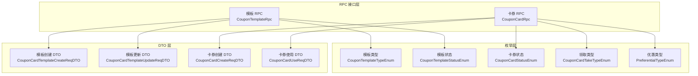
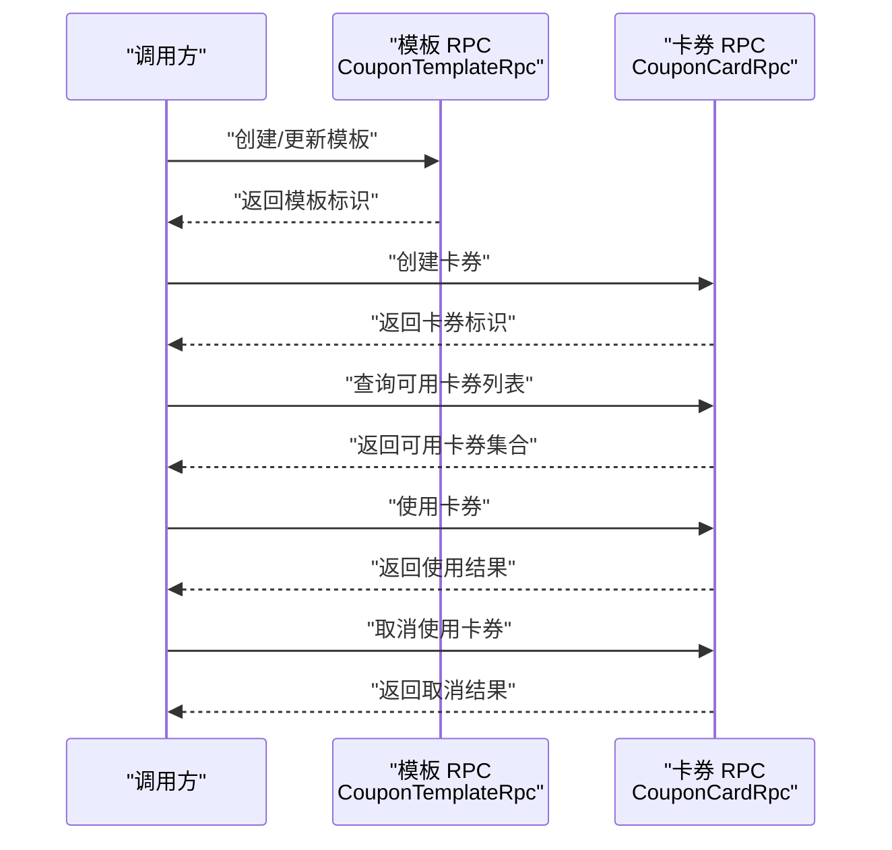
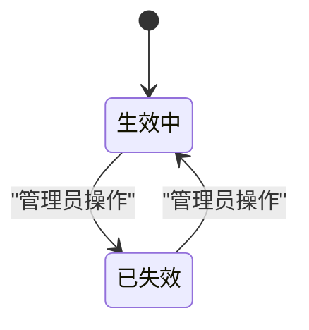
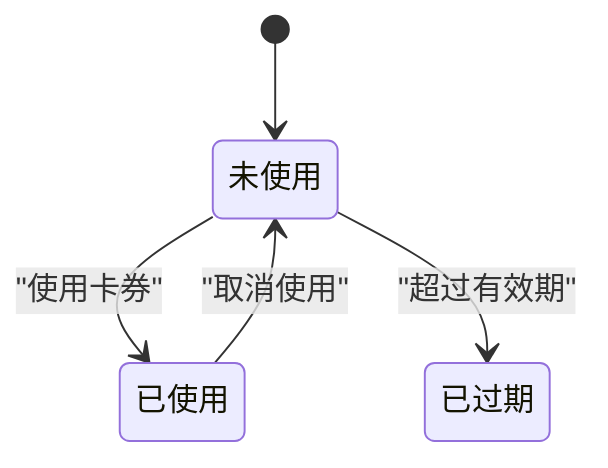
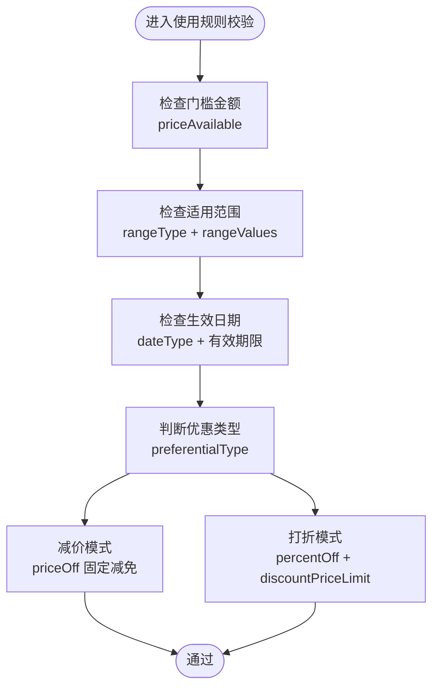
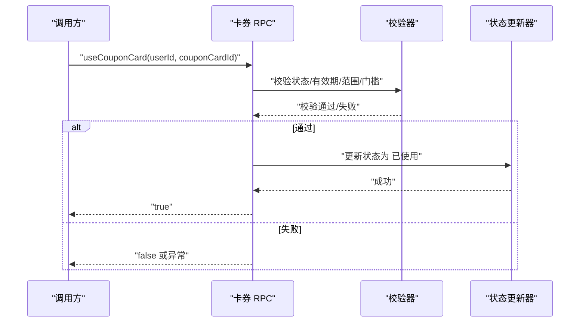
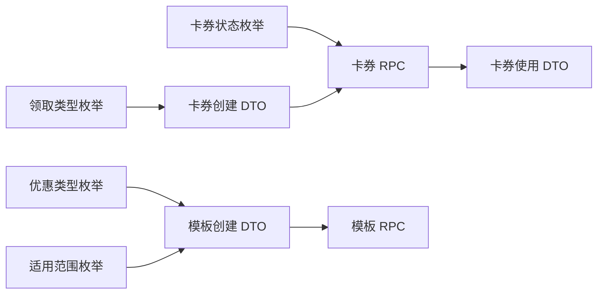

# 优惠券业务规则

<cite>
**本文引用的文件**
- [CouponTemplateTypeEnum.java](file://promotion-service-project/promotion-service-api/src/main/java/cn/iocoder/mall/promotion/api/enums/coupon/template/CouponTemplateTypeEnum.java)
- [CouponTemplateStatusEnum.java](file://promotion-service-project/promotion-service-api/src/main/java/cn/iocoder/mall/promotion/api/enums/coupon/template/CouponTemplateStatusEnum.java)
- [CouponCardStatusEnum.java](file://promotion-service-project/promotion-service-api/src/main/java/cn/iocoder/mall/promotion/api/enums/coupon/card/CouponCardStatusEnum.java)
- [CouponCardTakeTypeEnum.java](file://promotion-service-project/promotion-service-api/src/main/java/cn/iocoder/mall/promotion/api/enums/coupon/card/CouponCardTakeTypeEnum.java)
- [PreferentialTypeEnum.java](file://promotion-service-project/promotion-service-api/src/main/java/cn/iocoder/mall/promotion/api/enums/PreferentialTypeEnum.java)
- [CouponTemplateRpc.java](file://promotion-service-project/promotion-service-api/src/main/java/cn/iocoder/mall/promotion/api/rpc/coupon/CouponTemplateRpc.java)
- [CouponCardRpc.java](file://promotion-service-project/promotion-service-api/src/main/java/cn/iocoder/mall/promotion/api/rpc/coupon/CouponCardRpc.java)
- [CouponCardTemplateCreateReqDTO.java](file://promotion-service-project/promotion-service-api/src/main/java/cn/iocoder/mall/promotion/api/rpc/coupon/dto/template/CouponCardTemplateCreateReqDTO.java)
- [CouponCardTemplateUpdateReqDTO.java](file://promotion-service-project/promotion-service-api/src/main/java/cn/iocoder/mall/promotion/api/rpc/coupon/dto/template/CouponCardTemplateUpdateReqDTO.java)
- [CouponCardCreateReqDTO.java](file://promotion-service-project/promotion-service-api/src/main/java/cn/iocoder/mall/promotion/api/rpc/coupon/dto/card/CouponCardCreateReqDTO.java)
- [CouponCardUseReqDTO.java](file://promotion-service-project/promotion-service-api/src/main/java/cn/iocoder/mall/promotion/api/rpc/coupon/dto/card/CouponCardUseReqDTO.java)
</cite>

## 目录
1. [简介](#简介)
2. [项目结构](#项目结构)
3. [核心组件](#核心组件)
4. [架构总览](#架构总览)
5. [详细组件分析](#详细组件分析)
6. [依赖关系分析](#依赖关系分析)
7. [性能考量](#性能考量)
8. [故障排查指南](#故障排查指南)
9. [结论](#结论)
10. [附录](#附录)

## 简介
本技术文档围绕优惠券业务规则系统进行系统化梳理，重点覆盖以下方面：
- 优惠券模板类型枚举：明确模板类型定义及其业务语义边界
- 优惠券状态管理：模板状态与卡券状态的含义、取值与转换条件
- 领取类型控制：免费领取、限量领取等策略的实现机制
- 使用规则配置：门槛金额、适用范围、生效日期、优惠类型与参数
- 叠加规则：与其他优惠券、促销活动的组合使用策略
- 扩展性与灵活性设计：如何在不破坏现有契约的前提下演进规则

## 项目结构
优惠券相关能力主要分布在 promotion-service-api 模块，通过 RPC 接口对外暴露，供上层业务系统调用。核心文件组织如下：
- 枚举层：模板类型、模板状态、卡券状态、领取类型、优惠类型
- RPC 接口层：模板与卡券的增删改查、状态变更、可用列表查询、使用与取消使用
- DTO 层：模板创建/更新请求参数、卡券创建/使用请求参数

图表来源
- [CouponTemplateTypeEnum.java:1-39](file://promotion-service-project/promotion-service-api/src/main/java/cn/iocoder/mall/promotion/api/enums/coupon/template/CouponTemplateTypeEnum.java#L1-L39)
- [CouponTemplateStatusEnum.java:1-46](file://promotion-service-project/promotion-service-api/src/main/java/cn/iocoder/mall/promotion/api/enums/coupon/template/CouponTemplateStatusEnum.java#L1-L46)
- [CouponCardStatusEnum.java:1-46](file://promotion-service-project/promotion-service-api/src/main/java/cn/iocoder/mall/promotion/api/enums/coupon/card/CouponCardStatusEnum.java#L1-L46)
- [CouponCardTakeTypeEnum.java:1-45](file://promotion-service-project/promotion-service-api/src/main/java/cn/iocoder/mall/promotion/api/enums/coupon/card/CouponCardTakeTypeEnum.java#L1-L45)
- [PreferentialTypeEnum.java:1-47](file://promotion-service-project/promotion-service-api/src/main/java/cn/iocoder/mall/promotion/api/enums/PreferentialTypeEnum.java#L1-L47)
- [CouponTemplateRpc.java:1-58](file://promotion-service-project/promotion-service-api/src/main/java/cn/iocoder/mall/promotion/api/rpc/coupon/CouponTemplateRpc.java#L1-L58)
- [CouponCardRpc.java:1-55](file://promotion-service-project/promotion-service-api/src/main/java/cn/iocoder/mall/promotion/api/rpc/coupon/CouponCardRpc.java#L1-L55)
- [CouponCardTemplateCreateReqDTO.java:1-144](file://promotion-service-project/promotion-service-api/src/main/java/cn/iocoder/mall/promotion/api/rpc/coupon/dto/template/CouponCardTemplateCreateReqDTO.java#L1-L144)
- [CouponCardTemplateUpdateReqDTO.java:1-143](file://promotion-service-project/promotion-service-api/src/main/java/cn/iocoder/mall/promotion/api/rpc/coupon/dto/template/CouponCardTemplateUpdateReqDTO.java#L1-L143)
- [CouponCardCreateReqDTO.java:1-28](file://promotion-service-project/promotion-service-api/src/main/java/cn/iocoder/mall/promotion/api/rpc/coupon/dto/card/CouponCardCreateReqDTO.java#L1-L28)
- [CouponCardUseReqDTO.java:1-28](file://promotion-service-project/promotion-service-api/src/main/java/cn/iocoder/mall/promotion/api/rpc/coupon/dto/card/CouponCardUseReqDTO.java#L1-L28)

章节来源
- [CouponTemplateRpc.java:1-58](file://promotion-service-project/promotion-service-api/src/main/java/cn/iocoder/mall/promotion/api/rpc/coupon/CouponTemplateRpc.java#L1-L58)
- [CouponCardRpc.java:1-55](file://promotion-service-project/promotion-service-api/src/main/java/cn/iocoder/mall/promotion/api/rpc/coupon/CouponCardRpc.java#L1-L55)

## 核心组件
本节从“业务含义 + 规则约束 + 实现边界”三个维度，对关键枚举与接口进行解读。

- 模板类型枚举
  - 定义了模板的类别，如“优惠券”“折扣卷”等，用于区分模板的业务形态与后续处理分支
  - 该枚举作为模板创建/更新请求 DTO 的输入项之一，确保模板类型在创建阶段即被明确
  - 业务含义：模板类型决定后续优惠计算、适用范围、有效期等规则的侧重点

- 模板状态枚举
  - 定义模板的生命周期状态，如“生效中”“已失效”
  - 通过 RPC 接口提供状态更新能力，保证模板状态变更的统一入口与可审计性
  - 业务含义：模板状态直接影响前端展示与后端核销流程的准入条件

- 卡券状态枚举
  - 定义卡券实例的生命周期状态，如“未使用”“已使用”“已过期”
  - 通过 RPC 接口提供分页查询、可用列表查询、使用与取消使用等能力
  - 业务含义：卡券状态是核销决策的关键依据，直接决定是否允许使用

- 领取类型枚举
  - 定义卡券的领取方式，如“用户主动领取”“后台发放”
  - 作为卡券创建请求 DTO 的输入项之一，用于记录卡券来源与控制策略
  - 业务含义：影响库存消耗、配额校验、风控策略等

- 优惠类型枚举
  - 定义优惠计算方式，如“减价”“打折”
  - 作为模板创建/更新请求 DTO 的输入项之一，用于确定优惠计算公式
  - 业务含义：决定价格计算模型（固定减免或按比例折扣）

章节来源
- [CouponTemplateTypeEnum.java:1-39](file://promotion-service-project/promotion-service-api/src/main/java/cn/iocoder/mall/promotion/api/enums/coupon/template/CouponTemplateTypeEnum.java#L1-L39)
- [CouponTemplateStatusEnum.java:1-46](file://promotion-service-project/promotion-service-api/src/main/java/cn/iocoder/mall/promotion/api/enums/coupon/template/CouponTemplateStatusEnum.java#L1-L46)
- [CouponCardStatusEnum.java:1-46](file://promotion-service-project/promotion-service-api/src/main/java/cn/iocoder/mall/promotion/api/enums/coupon/card/CouponCardStatusEnum.java#L1-L46)
- [CouponCardTakeTypeEnum.java:1-45](file://promotion-service-project/promotion-service-api/src/main/java/cn/iocoder/mall/promotion/api/enums/coupon/card/CouponCardTakeTypeEnum.java#L1-L45)
- [PreferentialTypeEnum.java:1-47](file://promotion-service-project/promotion-service-api/src/main/java/cn/iocoder/mall/promotion/api/enums/PreferentialTypeEnum.java#L1-L47)

## 架构总览
优惠券业务采用“RPC 接口 + DTO 参数 + 枚举约束”的分层设计，模板与卡券分别由独立接口承载，确保职责清晰、边界明确。

图表来源
- [CouponTemplateRpc.java:1-58](file://promotion-service-project/promotion-service-api/src/main/java/cn/iocoder/mall/promotion/api/rpc/coupon/CouponTemplateRpc.java#L1-L58)
- [CouponCardRpc.java:1-55](file://promotion-service-project/promotion-service-api/src/main/java/cn/iocoder/mall/promotion/api/rpc/coupon/CouponCardRpc.java#L1-L55)

## 详细组件分析

### 模板类型与状态管理
- 模板类型
  - 用途：区分模板业务形态（如“优惠券”“折扣卷”），用于后续规则分支与 UI 展示
  - 输入约束：模板创建/更新请求 DTO 中以枚举值形式传入
  - 影响范围：模板层面的规则侧重点（如折扣上限、适用范围等）

- 模板状态
  - 状态集合：生效中、已失效
  - 管理方式：通过 RPC 提供状态更新接口，确保状态变更受控
  - 业务含义：模板状态决定卡券是否可被领取、是否参与可用列表筛选

图表来源
- [CouponTemplateStatusEnum.java:10-15](file://promotion-service-project/promotion-service-api/src/main/java/cn/iocoder/mall/promotion/api/enums/coupon/template/CouponTemplateStatusEnum.java#L10-L15)

章节来源
- [CouponTemplateTypeEnum.java:8-12](file://promotion-service-project/promotion-service-api/src/main/java/cn/iocoder/mall/promotion/api/enums/coupon/template/CouponTemplateTypeEnum.java#L8-L12)
- [CouponTemplateStatusEnum.java:10-15](file://promotion-service-project/promotion-service-api/src/main/java/cn/iocoder/mall/promotion/api/enums/coupon/template/CouponTemplateStatusEnum.java#L10-L15)
- [CouponTemplateRpc.java:30-36](file://promotion-service-project/promotion-service-api/src/main/java/cn/iocoder/mall/promotion/api/rpc/coupon/CouponTemplateRpc.java#L30-L36)

### 卡券状态与领取类型
- 卡券状态
  - 状态集合：未使用、已使用、已过期
  - 管理方式：通过 RPC 提供分页查询、可用列表查询、使用与取消使用接口
  - 业务含义：卡券状态是核销决策的核心依据，决定是否允许使用

- 领取类型
  - 类型集合：用户主动领取、后台发放
  - 管理方式：卡券创建请求 DTO 中携带领取类型字段
  - 业务含义：影响库存消耗策略、配额校验策略与风控策略

图表来源
- [CouponCardStatusEnum.java:10-15](file://promotion-service-project/promotion-service-api/src/main/java/cn/iocoder/mall/promotion/api/enums/coupon/card/CouponCardStatusEnum.java#L10-L15)
- [CouponCardTakeTypeEnum.java:10-14](file://promotion-service-project/promotion-service-api/src/main/java/cn/iocoder/mall/promotion/api/enums/coupon/card/CouponCardTakeTypeEnum.java#L10-L14)

章节来源
- [CouponCardStatusEnum.java:10-15](file://promotion-service-project/promotion-service-api/src/main/java/cn/iocoder/mall/promotion/api/enums/coupon/card/CouponCardStatusEnum.java#L10-L15)
- [CouponCardTakeTypeEnum.java:10-14](file://promotion-service-project/promotion-service-api/src/main/java/cn/iocoder/mall/promotion/api/enums/coupon/card/CouponCardTakeTypeEnum.java#L10-L14)
- [CouponCardRpc.java:14-53](file://promotion-service-project/promotion-service-api/src/main/java/cn/iocoder/mall/promotion/api/rpc/coupon/CouponCardRpc.java#L14-L53)

### 使用规则配置
模板使用规则通过创建/更新 DTO 进行集中配置，涵盖门槛金额、适用范围、生效日期、优惠类型与参数等关键要素。

- 门槛金额
  - 字段：priceAvailable（单位：分）
  - 约束：非负整数，0 表示不限制
  - 业务含义：订单金额需达到门槛才可使用

- 适用范围
  - 字段：rangeType、rangeValues
  - 约束：rangeType 必须为预设枚举值之一（全部、部分商品可用/不可用、部分分类可用/不可用）
  - 业务含义：限定卡券可作用的商品或分类集合

- 生效日期
  - 字段：dateType、validStartTime、validEndTime、fixedStartTerm、fixedEndTerm
  - 约束：dateType 为固定日期或领取日期两种模式之一
  - 业务含义：决定卡券的有效起止时间或相对有效期

- 优惠类型与参数
  - 字段：preferentialType、priceOff、percentOff、discountPriceLimit
  - 约束：preferentialType 为“减价”或“打折”，percentOff 最大为 100，discountPriceLimit 仅在打折场景生效
  - 业务含义：决定最终优惠金额的计算方式与上限

图表来源
- [CouponCardTemplateCreateReqDTO.java:54-141](file://promotion-service-project/promotion-service-api/src/main/java/cn/iocoder/mall/promotion/api/rpc/coupon/dto/template/CouponCardTemplateCreateReqDTO.java#L54-L141)
- [CouponCardTemplateUpdateReqDTO.java:53-140](file://promotion-service-project/promotion-service-api/src/main/java/cn/iocoder/mall/promotion/api/rpc/coupon/dto/template/CouponCardTemplateUpdateReqDTO.java#L53-L140)
- [PreferentialTypeEnum.java:10-14](file://promotion-service-project/promotion-service-api/src/main/java/cn/iocoder/mall/promotion/api/enums/PreferentialTypeEnum.java#L10-L14)

章节来源
- [CouponCardTemplateCreateReqDTO.java:54-141](file://promotion-service-project/promotion-service-api/src/main/java/cn/iocoder/mall/promotion/api/rpc/coupon/dto/template/CouponCardTemplateCreateReqDTO.java#L54-L141)
- [CouponCardTemplateUpdateReqDTO.java:53-140](file://promotion-service-project/promotion-service-api/src/main/java/cn/iocoder/mall/promotion/api/rpc/coupon/dto/template/CouponCardTemplateUpdateReqDTO.java#L53-L140)
- [PreferentialTypeEnum.java:10-14](file://promotion-service-project/promotion-service-api/src/main/java/cn/iocoder/mall/promotion/api/enums/PreferentialTypeEnum.java#L10-L14)

### 领取类型控制
- 领取类型枚举
  - 用户主动领取：用户自行领取，通常受配额与总量限制
  - 后台发放：由运营后台直接发放，可能不受用户主动领取配额限制
- 控制要点
  - 在卡券创建请求 DTO 中明确领取类型
  - 结合模板的每人限领个数与发放总量进行发放控制
  - 对“后台发放”场景可设置更宽松的风控策略

章节来源
- [CouponCardTakeTypeEnum.java:10-14](file://promotion-service-project/promotion-service-api/src/main/java/cn/iocoder/mall/promotion/api/enums/coupon/card/CouponCardTakeTypeEnum.java#L10-L14)
- [CouponCardCreateReqDTO.java:14-27](file://promotion-service-project/promotion-service-api/src/main/java/cn/iocoder/mall/promotion/api/rpc/coupon/dto/card/CouponCardCreateReqDTO.java#L14-L27)

### 卡券使用与取消使用流程
- 使用流程
  - 调用卡券 RPC 的使用接口，传入用户编号与卡券编号
  - 后端进行状态校验、有效期校验、适用范围校验与门槛金额校验
  - 校验通过后执行使用动作并返回结果

- 取消使用流程
  - 调用卡券 RPC 的取消使用接口，传入用户编号与卡券编号
  - 后端将卡券状态回退至“未使用”，并恢复相关计数或锁定资源

图表来源
- [CouponCardUseReqDTO.java:14-27](file://promotion-service-project/promotion-service-api/src/main/java/cn/iocoder/mall/promotion/api/rpc/coupon/dto/card/CouponCardUseReqDTO.java#L14-L27)
- [CouponCardRpc.java:31-36](file://promotion-service-project/promotion-service-api/src/main/java/cn/iocoder/mall/promotion/api/rpc/coupon/CouponCardRpc.java#L31-L36)

章节来源
- [CouponCardRpc.java:31-36](file://promotion-service-project/promotion-service-api/src/main/java/cn/iocoder/mall/promotion/api/rpc/coupon/CouponCardRpc.java#L31-L36)
- [CouponCardUseReqDTO.java:14-27](file://promotion-service-project/promotion-service-api/src/main/java/cn/iocoder/mall/promotion/api/rpc/coupon/dto/card/CouponCardUseReqDTO.java#L14-L27)

### 叠加规则与组合策略
- 与其它优惠券的叠加
  - 建议在下单结算时统一聚合所有可用优惠，优先选择对用户最有利的组合
  - 对于“打折”与“减价”可采用“先折后减”或“先减后折”的策略，具体以业务为准
  - 对“折扣上限”进行强制控制，避免单张券带来的过度让利

- 与促销活动的组合
  - 促销活动通常具有更高的优先级或更严格的适用范围
  - 建议在结算引擎中引入“互斥/兼容”规则，避免重复叠加导致的亏损

- 实施建议
  - 将叠加规则抽象为策略配置，支持动态开关与阈值调整
  - 在模板创建时明确叠加策略标记，便于前端与结算引擎识别

章节来源
- [CouponCardTemplateCreateReqDTO.java:111-141](file://promotion-service-project/promotion-service-api/src/main/java/cn/iocoder/mall/promotion/api/rpc/coupon/dto/template/CouponCardTemplateCreateReqDTO.java#L111-L141)
- [PreferentialTypeEnum.java:10-14](file://promotion-service-project/promotion-service-api/src/main/java/cn/iocoder/mall/promotion/api/enums/PreferentialTypeEnum.java#L10-L14)

## 依赖关系分析
- 枚举依赖
  - 模板创建/更新 DTO 依赖优惠类型枚举与适用范围枚举
  - 卡券 RPC 依赖卡券状态枚举与领取类型枚举
- 接口依赖
  - 模板 RPC 与卡券 RPC 作为上层调用方的唯一入口，承担参数校验与业务编排职责
- 数据流
  - 上层系统通过 RPC 接口提交 DTO，后端根据枚举与规则进行校验与执行

图表来源
- [PreferentialTypeEnum.java:10-14](file://promotion-service-project/promotion-service-api/src/main/java/cn/iocoder/mall/promotion/api/enums/PreferentialTypeEnum.java#L10-L14)
- [CouponCardTemplateCreateReqDTO.java:54-141](file://promotion-service-project/promotion-service-api/src/main/java/cn/iocoder/mall/promotion/api/rpc/coupon/dto/template/CouponCardTemplateCreateReqDTO.java#L54-L141)
- [CouponCardCreateReqDTO.java:14-27](file://promotion-service-project/promotion-service-api/src/main/java/cn/iocoder/mall/promotion/api/rpc/coupon/dto/card/CouponCardCreateReqDTO.java#L14-L27)
- [CouponCardRpc.java:1-55](file://promotion-service-project/promotion-service-api/src/main/java/cn/iocoder/mall/promotion/api/rpc/coupon/CouponCardRpc.java#L1-L55)

章节来源
- [CouponCardRpc.java:1-55](file://promotion-service-project/promotion-service-api/src/main/java/cn/iocoder/mall/promotion/api/rpc/coupon/CouponCardRpc.java#L1-L55)
- [CouponTemplateRpc.java:1-58](file://promotion-service-project/promotion-service-api/src/main/java/cn/iocoder/mall/promotion/api/rpc/coupon/CouponTemplateRpc.java#L1-L58)

## 性能考量
- 缓存策略
  - 对常用模板与卡券状态进行缓存，减少数据库访问压力
- 分页与过滤
  - 卡券分页查询与可用列表查询应结合索引与过滤条件，避免全表扫描
- 并发控制
  - 领取与使用场景需做好并发控制，防止超卖与重复使用
- 计算复杂度
  - 优惠计算应在服务端完成，避免前端复杂逻辑导致的误差与性能问题

## 故障排查指南
- 常见问题
  - 卡券无法使用：检查卡券状态、有效期、适用范围与门槛金额
  - 领取失败：检查模板状态、每人限领个数与发放总量
  - 叠加异常：确认叠加策略与互斥规则配置
- 排查步骤
  - 核对模板状态与卡券状态
  - 核对生效日期与适用范围
  - 核对优惠类型与参数配置
  - 核对叠加策略与促销活动冲突情况

章节来源
- [CouponCardStatusEnum.java:10-15](file://promotion-service-project/promotion-service-api/src/main/java/cn/iocoder/mall/promotion/api/enums/coupon/card/CouponCardStatusEnum.java#L10-L15)
- [CouponTemplateStatusEnum.java:10-15](file://promotion-service-project/promotion-service-api/src/main/java/cn/iocoder/mall/promotion/api/enums/coupon/template/CouponTemplateStatusEnum.java#L10-L15)
- [CouponCardRpc.java:14-53](file://promotion-service-project/promotion-service-api/src/main/java/cn/iocoder/mall/promotion/api/rpc/coupon/CouponCardRpc.java#L14-L53)

## 结论
本系统通过“枚举 + DTO + RPC”的分层设计，实现了对优惠券模板类型、状态管理、领取控制、使用规则与叠加策略的完整覆盖。建议在实际落地时：
- 明确模板类型与状态的业务边界，确保创建/更新流程严格遵循枚举约束
- 将适用范围、生效日期、优惠类型与参数作为配置中心，支持动态调整
- 在结算引擎中统一聚合与校验叠加规则，保障用户体验与利润空间

## 附录
- 术语
  - 模板：优惠券规则的抽象定义
  - 卡券：模板的具体实例，具备状态与有效期
- 最佳实践
  - 在模板创建阶段明确优惠类型与参数，避免后续频繁修改
  - 对领取类型与叠加策略进行清晰标注，便于前端与结算引擎识别
  - 建立完善的日志与监控体系，及时发现并处理异常