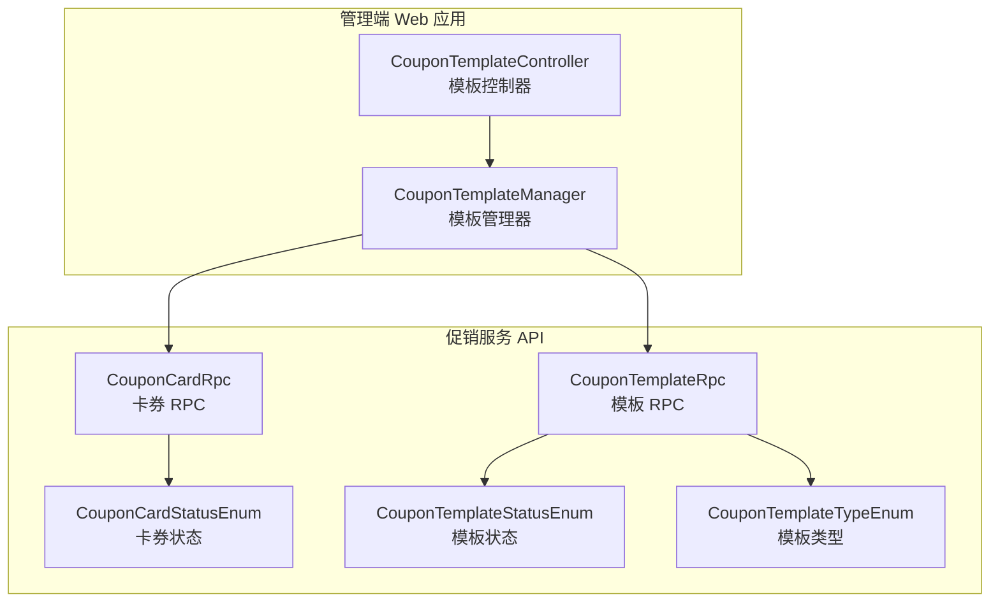
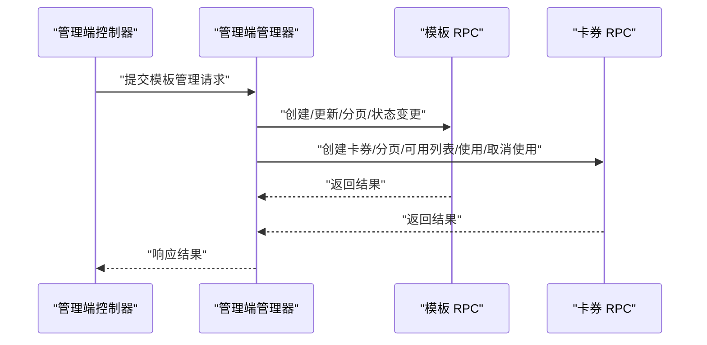
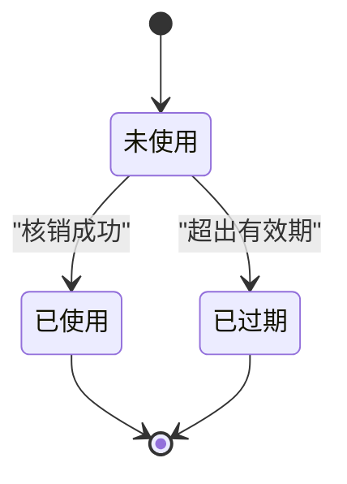
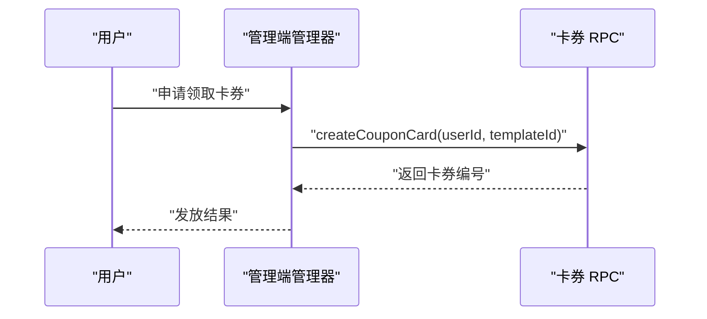
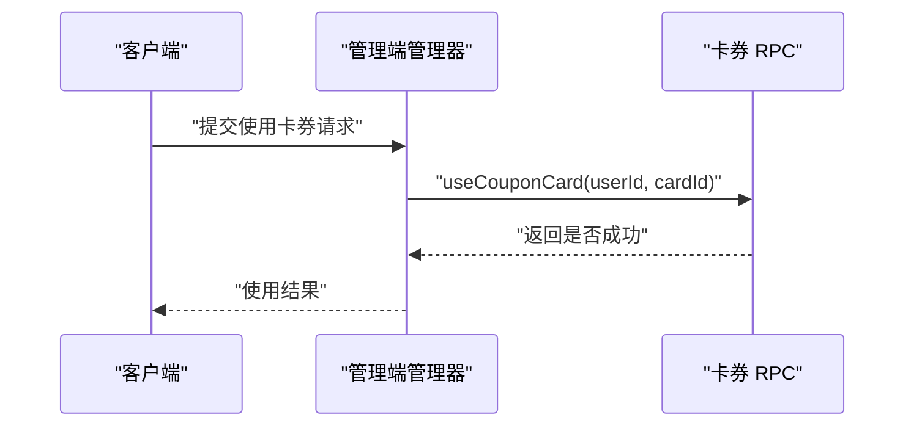
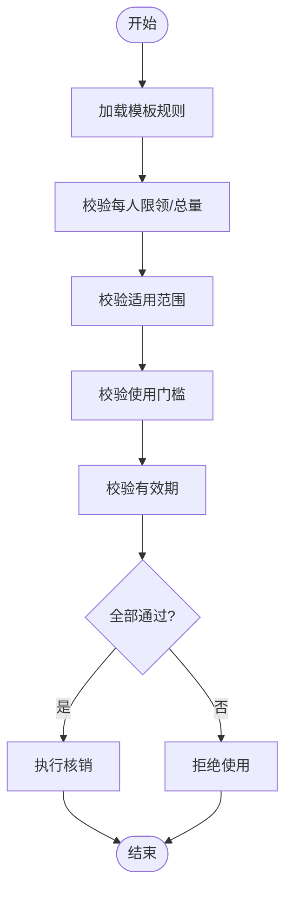
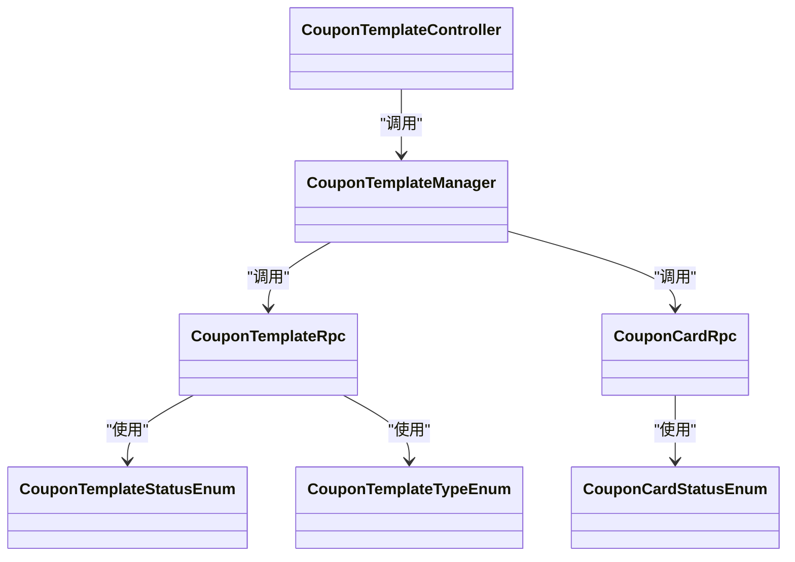

# 优惠券卡券管理

<cite>
**本文引用的文件**
- [CouponCardRpc.java](file://promotion-service-project/promotion-service-api/src/main/java/cn/iocoder/mall/promotion/api/rpc/coupon/CouponCardRpc.java)
- [CouponTemplateRpc.java](file://promotion-service-project/promotion-service-api/src/main/java/cn/iocoder/mall/promotion/api/rpc/coupon/CouponTemplateRpc.java)
- [CouponCardStatusEnum.java](file://promotion-service-project/promotion-service-api/src/main/java/cn/iocoder/mall/promotion/api/enums/coupon/card/CouponCardStatusEnum.java)
- [CouponTemplateStatusEnum.java](file://promotion-service-project/promotion-service-api/src/main/java/cn/iocoder/mall/promotion/api/enums/coupon/template/CouponTemplateStatusEnum.java)
- [CouponTemplateTypeEnum.java](file://promotion-service-project/promotion-service-api/src/main/java/cn/iocoder/mall/promotion/api/enums/coupon/template/CouponTemplateTypeEnum.java)
- [CouponCardCreateReqDTO.java](file://promotion-service-project/promotion-service-api/src/main/java/cn/iocoder/mall/promotion/api/rpc/coupon/dto/card/CouponCardCreateReqDTO.java)
- [CouponCardUseReqDTO.java](file://promotion-service-project/promotion-service-api/src/main/java/cn/iocoder/mall/promotion/api/rpc/coupon/dto/card/CouponCardUseReqDTO.java)
- [CouponCardAvailableListReqDTO.java](file://promotion-service-project/promotion-service-api/src/main/java/cn/iocoder/mall/promotion/api/rpc/coupon/dto/card/CouponCardAvailableListReqDTO.java)
- [CouponCardTemplateCreateReqDTO.java](file://promotion-service-project/promotion-service-api/src/main/java/cn/iocoder/mall/promotion/api/rpc/coupon/dto/template/CouponCardTemplateCreateReqDTO.java)
- [CouponCardTemplateUpdateReqDTO.java](file://promotion-service-project/promotion-service-api/src/main/java/cn/iocoder/mall/promotion/api/rpc/coupon/dto/template/CouponCardTemplateUpdateReqDTO.java)
- [CouponTemplateController.java](file://management-web-app/src/main/java/cn/iocoder/mall/managementweb/controller/promotion/coupon/CouponTemplateController.java)
- [CouponTemplateManager.java](file://management-web-app/src/main/java/cn/iocoder/mall/managementweb/manager/promotion/coupon/CouponTemplateManager.java)
- [CouponTemplateCardCreateReqVO.java](file://management-web-app/src/main/java/cn/iocoder/mall/managementweb/controller/promotion/coupon/vo/template/CouponTemplateCardCreateReqVO.java)
- [CouponTemplateCardUpdateReqVO.java](file://management-web-app/src/main/java/cn/iocoder/mall/managementweb/controller/promotion/coupon/vo/template/CouponTemplateCardUpdateReqVO.java)
- [CouponTemplatePageReqVO.java](file://management-web-app/src/main/java/cn/iocoder/mall/managementweb/controller/promotion/coupon/vo/template/CouponTemplatePageReqVO.java)
- [CouponTemplateRespVO.java](file://management-web-app/src/main/java/cn/iocoder/mall/managementweb/controller/promotion/coupon/vo/template/CouponTemplateRespVO.java)
</cite>

## 目录
1. [简介](#简介)
2. [项目结构](#项目结构)
3. [核心组件](#核心组件)
4. [架构总览](#架构总览)
5. [详细组件分析](#详细组件分析)
6. [依赖关系分析](#依赖关系分析)
7. [性能考量](#性能考量)
8. [故障排查指南](#故障排查指南)
9. [结论](#结论)
10. [附录](#附录)

## 简介
本技术文档围绕优惠券卡券管理功能展开，系统性梳理从卡券生成、发放、使用到过期的全生命周期业务逻辑，覆盖模板配置、发放策略（用户主动领取、系统批量发放、限时限量）、核销验证与使用限制、状态跟踪与适用范围校验，并给出完整的业务流程图与状态机设计。同时，结合现有接口与数据模型，提出防刷与异常处理策略建议。

## 项目结构
优惠券能力位于“促销服务”模块，通过 RPC 接口对外暴露，管理端 Web 应用提供模板管理与运营操作入口。核心文件分布如下：
- 接口层（RPC）：定义卡券与模板的增删改查、分页、可用列表、使用/取消使用等能力
- 枚举层：定义卡券状态、模板状态、模板类型等
- DTO 层：封装创建、使用、可用列表查询等请求参数
- 管理端控制器与管理器：提供模板管理的 HTTP 控制器与业务管理器

图表来源
- [CouponTemplateController.java:1-200](file://management-web-app/src/main/java/cn/iocoder/mall/managementweb/controller/promotion/coupon/CouponTemplateController.java#L1-L200)
- [CouponTemplateManager.java:1-200](file://management-web-app/src/main/java/cn/iocoder/mall/managementweb/manager/promotion/coupon/CouponTemplateManager.java#L1-L200)
- [CouponCardRpc.java:1-55](file://promotion-service-project/promotion-service-api/src/main/java/cn/iocoder/mall/promotion/api/rpc/coupon/CouponCardRpc.java#L1-L55)
- [CouponTemplateRpc.java:1-58](file://promotion-service-project/promotion-service-api/src/main/java/cn/iocoder/mall/promotion/api/rpc/coupon/CouponTemplateRpc.java#L1-L58)
- [CouponCardStatusEnum.java:1-46](file://promotion-service-project/promotion-service-api/src/main/java/cn/iocoder/mall/promotion/api/enums/coupon/card/CouponCardStatusEnum.java#L1-L46)
- [CouponTemplateStatusEnum.java:1-46](file://promotion-service-project/promotion-service-api/src/main/java/cn/iocoder/mall/promotion/api/enums/coupon/template/CouponTemplateStatusEnum.java#L1-L46)
- [CouponTemplateTypeEnum.java:1-39](file://promotion-service-project/promotion-service-api/src/main/java/cn/iocoder/mall/promotion/api/enums/coupon/template/CouponTemplateTypeEnum.java#L1-L39)

章节来源
- [CouponCardRpc.java:1-55](file://promotion-service-project/promotion-service-api/src/main/java/cn/iocoder/mall/promotion/api/rpc/coupon/CouponCardRpc.java#L1-L55)
- [CouponTemplateRpc.java:1-58](file://promotion-service-project/promotion-service-api/src/main/java/cn/iocoder/mall/promotion/api/rpc/coupon/CouponTemplateRpc.java#L1-L58)
- [CouponTemplateController.java:1-200](file://management-web-app/src/main/java/cn/iocoder/mall/managementweb/controller/promotion/coupon/CouponTemplateController.java#L1-L200)
- [CouponTemplateManager.java:1-200](file://management-web-app/src/main/java/cn/iocoder/mall/managementweb/manager/promotion/coupon/CouponTemplateManager.java#L1-L200)

## 核心组件
- 卡券 RPC 接口：提供卡券分页、创建、使用、取消使用、可用列表查询等能力
- 模板 RPC 接口：提供模板详情、分页、状态更新、创建、更新等能力
- 卡券状态枚举：未使用、已使用、已过期
- 模板状态枚举：生效中、已失效
- 模板类型枚举：优惠券、折扣卷
- DTO：卡券创建、使用、可用列表查询；模板创建、更新

章节来源
- [CouponCardRpc.java:12-54](file://promotion-service-project/promotion-service-api/src/main/java/cn/iocoder/mall/promotion/api/rpc/coupon/CouponCardRpc.java#L12-L54)
- [CouponTemplateRpc.java:10-57](file://promotion-service-project/promotion-service-api/src/main/java/cn/iocoder/mall/promotion/api/rpc/coupon/CouponTemplateRpc.java#L10-L57)
- [CouponCardStatusEnum.java:10-45](file://promotion-service-project/promotion-service-api/src/main/java/cn/iocoder/mall/promotion/api/enums/coupon/card/CouponCardStatusEnum.java#L10-L45)
- [CouponTemplateStatusEnum.java:10-45](file://promotion-service-project/promotion-service-api/src/main/java/cn/iocoder/mall/promotion/api/enums/coupon/template/CouponTemplateStatusEnum.java#L10-L45)
- [CouponTemplateTypeEnum.java:8-38](file://promotion-service-project/promotion-service-api/src/main/java/cn/iocoder/mall/promotion/api/enums/coupon/template/CouponTemplateTypeEnum.java#L8-L38)
- [CouponCardCreateReqDTO.java:14-27](file://promotion-service-project/promotion-service-api/src/main/java/cn/iocoder/mall/promotion/api/rpc/coupon/dto/card/CouponCardCreateReqDTO.java#L14-L27)
- [CouponCardUseReqDTO.java:14-27](file://promotion-service-project/promotion-service-api/src/main/java/cn/iocoder/mall/promotion/api/rpc/coupon/dto/card/CouponCardUseReqDTO.java#L14-L27)
- [CouponCardAvailableListReqDTO.java:17-68](file://promotion-service-project/promotion-service-api/src/main/java/cn/iocoder/mall/promotion/api/rpc/coupon/dto/card/CouponCardAvailableListReqDTO.java#L17-L68)
- [CouponCardTemplateCreateReqDTO.java:23-143](file://promotion-service-project/promotion-service-api/src/main/java/cn/iocoder/mall/promotion/api/rpc/coupon/dto/template/CouponCardTemplateCreateReqDTO.java#L23-L143)
- [CouponCardTemplateUpdateReqDTO.java:19-142](file://promotion-service-project/promotion-service-api/src/main/java/cn/iocoder/mall/promotion/api/rpc/coupon/dto/template/CouponCardTemplateUpdateReqDTO.java#L19-L142)

## 架构总览
下图展示管理端与促销服务之间的交互关系，以及卡券与模板的 RPC 能力边界。

图表来源
- [CouponTemplateController.java:1-200](file://management-web-app/src/main/java/cn/iocoder/mall/managementweb/controller/promotion/coupon/CouponTemplateController.java#L1-L200)
- [CouponTemplateManager.java:1-200](file://management-web-app/src/main/java/cn/iocoder/mall/managementweb/manager/promotion/coupon/CouponTemplateManager.java#L1-L200)
- [CouponTemplateRpc.java:10-57](file://promotion-service-project/promotion-service-api/src/main/java/cn/iocoder/mall/promotion/api/rpc/coupon/CouponTemplateRpc.java#L10-L57)
- [CouponCardRpc.java:12-54](file://promotion-service-project/promotion-service-api/src/main/java/cn/iocoder/mall/promotion/api/rpc/coupon/CouponCardRpc.java#L12-L54)

## 详细组件分析

### 卡券生命周期与状态机
- 生命周期阶段：生成（创建卡券）、发放（用户领取/系统派发）、使用（核销验证/叠加规则）、过期（有效期到期）
- 状态流转：
  - 未使用 → 已使用（满足使用条件且核销成功）
  - 未使用 → 已过期（超过有效期）
  - 已使用/已过期 → 不可再用
- 状态枚举：未使用、已使用、已过期

图表来源
- [CouponCardStatusEnum.java:10-15](file://promotion-service-project/promotion-service-api/src/main/java/cn/iocoder/mall/promotion/api/enums/coupon/card/CouponCardStatusEnum.java#L10-L15)

章节来源
- [CouponCardStatusEnum.java:10-45](file://promotion-service-project/promotion-service-api/src/main/java/cn/iocoder/mall/promotion/api/enums/coupon/card/CouponCardStatusEnum.java#L10-L45)

### 模板与发放策略
- 模板类型：优惠券、折扣卷
- 模板状态：生效中、已失效
- 发放策略要点（基于模板 DTO 字段）：
  - 每人限领个数、发放总量：控制限量
  - 生效日期类型（固定日期/领取日期+N天）、固定起止时间、领取日期起止天数：控制有效期
  - 使用门槛金额、可用范围类型与范围值：控制使用条件
  - 优惠类型（代金/折扣）、优惠金额/折扣比例/折扣上限：控制使用效果

章节来源
- [CouponTemplateTypeEnum.java:8-38](file://promotion-service-project/promotion-service-api/src/main/java/cn/iocoder/mall/promotion/api/enums/coupon/template/CouponTemplateTypeEnum.java#L8-L38)
- [CouponTemplateStatusEnum.java:10-45](file://promotion-service-project/promotion-service-api/src/main/java/cn/iocoder/mall/promotion/api/enums/coupon/template/CouponTemplateStatusEnum.java#L10-L45)
- [CouponCardTemplateCreateReqDTO.java:23-143](file://promotion-service-project/promotion-service-api/src/main/java/cn/iocoder/mall/promotion/api/rpc/coupon/dto/template/CouponCardTemplateCreateReqDTO.java#L23-L143)
- [CouponCardTemplateUpdateReqDTO.java:19-142](file://promotion-service-project/promotion-service-api/src/main/java/cn/iocoder/mall/promotion/api/rpc/coupon/dto/template/CouponCardTemplateUpdateReqDTO.java#L19-L142)

### 卡券发放机制
- 用户主动领取：调用卡券创建 RPC，传入用户编号与模板编号
- 系统批量发放：通过模板 RPC 的创建/更新接口下发卡券
- 限时限量：由模板 DTO 中的配额、总量、有效期字段约束

图表来源
- [CouponCardRpc.java:28-28](file://promotion-service-project/promotion-service-api/src/main/java/cn/iocoder/mall/promotion/api/rpc/coupon/CouponCardRpc.java#L28-L28)
- [CouponCardCreateReqDTO.java:14-27](file://promotion-service-project/promotion-service-api/src/main/java/cn/iocoder/mall/promotion/api/rpc/coupon/dto/card/CouponCardCreateReqDTO.java#L14-L27)

章节来源
- [CouponCardRpc.java:12-54](file://promotion-service-project/promotion-service-api/src/main/java/cn/iocoder/mall/promotion/api/rpc/coupon/CouponCardRpc.java#L12-L54)
- [CouponCardCreateReqDTO.java:14-27](file://promotion-service-project/promotion-service-api/src/main/java/cn/iocoder/mall/promotion/api/rpc/coupon/dto/card/CouponCardCreateReqDTO.java#L14-L27)

### 卡券使用流程与核销验证
- 使用前校验：用户与卡券匹配、卡券状态为未使用、未过期、满足使用门槛与适用范围
- 核销流程：调用使用 RPC，传入用户编号与卡券编号
- 取消使用：支持撤销已使用卡券（如退款场景）

图表来源
- [CouponCardRpc.java:36-36](file://promotion-service-project/promotion-service-api/src/main/java/cn/iocoder/mall/promotion/api/rpc/coupon/CouponCardRpc.java#L36-L36)
- [CouponCardUseReqDTO.java:14-27](file://promotion-service-project/promotion-service-api/src/main/java/cn/iocoder/mall/promotion/api/rpc/coupon/dto/card/CouponCardUseReqDTO.java#L14-L27)

章节来源
- [CouponCardRpc.java:12-54](file://promotion-service-project/promotion-service-api/src/main/java/cn/iocoder/mall/promotion/api/rpc/coupon/CouponCardRpc.java#L12-L54)
- [CouponCardUseReqDTO.java:14-27](file://promotion-service-project/promotion-service-api/src/main/java/cn/iocoder/mall/promotion/api/rpc/coupon/dto/card/CouponCardUseReqDTO.java#L14-L27)

### 适用范围验证与叠加规则
- 适用范围：支持全部可用、部分商品可用/不可用、部分分类可用/不可用
- 范围值：以逗号分隔的商品/分类编号
- 使用门槛：满多少金额可用（单位分）
- 叠加规则：当前接口未暴露多券叠加判定，需在业务侧统一策略（如仅允许单券使用）

图表来源
- [CouponCardAvailableListReqDTO.java:17-68](file://promotion-service-project/promotion-service-api/src/main/java/cn/iocoder/mall/promotion/api/rpc/coupon/dto/card/CouponCardAvailableListReqDTO.java#L17-L68)
- [CouponCardTemplateCreateReqDTO.java:54-109](file://promotion-service-project/promotion-service-api/src/main/java/cn/iocoder/mall/promotion/api/rpc/coupon/dto/template/CouponCardTemplateCreateReqDTO.java#L54-L109)

章节来源
- [CouponCardAvailableListReqDTO.java:17-68](file://promotion-service-project/promotion-service-api/src/main/java/cn/iocoder/mall/promotion/api/rpc/coupon/dto/card/CouponCardAvailableListReqDTO.java#L17-L68)
- [CouponCardTemplateCreateReqDTO.java:54-109](file://promotion-service-project/promotion-service-api/src/main/java/cn/iocoder/mall/promotion/api/rpc/coupon/dto/template/CouponCardTemplateCreateReqDTO.java#L54-L109)

### 状态跟踪与实时更新
- 卡券状态：未使用、已使用、已过期
- 模板状态：生效中、已失效
- 实时更新：核销成功后状态变更为已使用；系统定时任务或事件驱动触发过期状态更新

章节来源
- [CouponCardStatusEnum.java:10-15](file://promotion-service-project/promotion-service-api/src/main/java/cn/iocoder/mall/promotion/api/enums/coupon/card/CouponCardStatusEnum.java#L10-L15)
- [CouponTemplateStatusEnum.java:10-14](file://promotion-service-project/promotion-service-api/src/main/java/cn/iocoder/mall/promotion/api/enums/coupon/template/CouponTemplateStatusEnum.java#L10-L14)

### 管理端模板管理
- 控制器：提供模板的分页、创建、更新、状态变更等 HTTP 接口
- 管理器：编排模板 RPC 调用，处理业务逻辑与参数转换
- VO/DTO：模板创建/更新请求 VO 与响应 VO，便于前端展示与校验

章节来源
- [CouponTemplateController.java:1-200](file://management-web-app/src/main/java/cn/iocoder/mall/managementweb/controller/promotion/coupon/CouponTemplateController.java#L1-L200)
- [CouponTemplateManager.java:1-200](file://management-web-app/src/main/java/cn/iocoder/mall/managementweb/manager/promotion/coupon/CouponTemplateManager.java#L1-L200)
- [CouponTemplateCardCreateReqVO.java:1-200](file://management-web-app/src/main/java/cn/iocoder/mall/managementweb/controller/promotion/coupon/vo/template/CouponTemplateCardCreateReqVO.java#L1-L200)
- [CouponTemplateCardUpdateReqVO.java:1-200](file://management-web-app/src/main/java/cn/iocoder/mall/managementweb/controller/promotion/coupon/vo/template/CouponTemplateCardUpdateReqVO.java#L1-L200)
- [CouponTemplatePageReqVO.java:1-200](file://management-web-app/src/main/java/cn/iocoder/mall/managementweb/controller/promotion/coupon/vo/template/CouponTemplatePageReqVO.java#L1-L200)
- [CouponTemplateRespVO.java:1-200](file://management-web-app/src/main/java/cn/iocoder/mall/managementweb/controller/promotion/coupon/vo/template/CouponTemplateRespVO.java#L1-L200)

## 依赖关系分析
- 管理端控制器依赖管理器
- 管理器依赖模板 RPC 与卡券 RPC
- RPC 接口依赖枚举与 DTO
- DTO 依赖范围类型、日期类型等枚举

图表来源
- [CouponTemplateController.java:1-200](file://management-web-app/src/main/java/cn/iocoder/mall/managementweb/controller/promotion/coupon/CouponTemplateController.java#L1-L200)
- [CouponTemplateManager.java:1-200](file://management-web-app/src/main/java/cn/iocoder/mall/managementweb/manager/promotion/coupon/CouponTemplateManager.java#L1-L200)
- [CouponTemplateRpc.java:10-57](file://promotion-service-project/promotion-service-api/src/main/java/cn/iocoder/mall/promotion/api/rpc/coupon/CouponTemplateRpc.java#L10-L57)
- [CouponCardRpc.java:12-54](file://promotion-service-project/promotion-service-api/src/main/java/cn/iocoder/mall/promotion/api/rpc/coupon/CouponCardRpc.java#L12-L54)
- [CouponCardStatusEnum.java:10-45](file://promotion-service-project/promotion-service-api/src/main/java/cn/iocoder/mall/promotion/api/enums/coupon/card/CouponCardStatusEnum.java#L10-L45)
- [CouponTemplateStatusEnum.java:10-45](file://promotion-service-project/promotion-service-api/src/main/java/cn/iocoder/mall/promotion/api/enums/coupon/template/CouponTemplateStatusEnum.java#L10-L45)
- [CouponTemplateTypeEnum.java:8-38](file://promotion-service-project/promotion-service-api/src/main/java/cn/iocoder/mall/promotion/api/enums/coupon/template/CouponTemplateTypeEnum.java#L8-L38)

章节来源
- [CouponTemplateController.java:1-200](file://management-web-app/src/main/java/cn/iocoder/mall/managementweb/controller/promotion/coupon/CouponTemplateController.java#L1-L200)
- [CouponTemplateManager.java:1-200](file://management-web-app/src/main/java/cn/iocoder/mall/managementweb/manager/promotion/coupon/CouponTemplateManager.java#L1-L200)
- [CouponTemplateRpc.java:10-57](file://promotion-service-project/promotion-service-api/src/main/java/cn/iocoder/mall/promotion/api/rpc/coupon/CouponTemplateRpc.java#L10-L57)
- [CouponCardRpc.java:12-54](file://promotion-service-project/promotion-service-api/src/main/java/cn/iocoder/mall/promotion/api/rpc/coupon/CouponCardRpc.java#L12-L54)

## 性能考量
- 批量发放与核销：建议采用异步队列/消息中间件降低同步阻塞
- 适用范围校验：对大范围商品/分类匹配建议使用索引与缓存优化
- 分页查询：合理设置分页大小与排序字段，避免全表扫描
- 状态更新：过期任务建议分布式定时任务或事件驱动，避免集中压力

## 故障排查指南
- 参数校验失败：检查 DTO 字段必填与取值范围（如数量最小为 1、折扣上限最小为 1 等）
- 使用失败：确认卡券状态为未使用、未过期、满足门槛与适用范围
- 发放失败：检查模板状态为生效中、配额与总量未超限
- RPC 调用异常：查看模板/卡券 RPC 返回的错误码与提示

章节来源
- [CouponCardAvailableListReqDTO.java:55-64](file://promotion-service-project/promotion-service-api/src/main/java/cn/iocoder/mall/promotion/api/rpc/coupon/dto/card/CouponCardAvailableListReqDTO.java#L55-L64)
- [CouponCardTemplateCreateReqDTO.java:124-139](file://promotion-service-project/promotion-service-api/src/main/java/cn/iocoder/mall/promotion/api/rpc/coupon/dto/template/CouponCardTemplateCreateReqDTO.java#L124-L139)

## 结论
本方案以 RPC 接口为核心，结合模板与卡券的枚举与 DTO，构建了完整的卡券生命周期管理能力。通过明确的发放策略、核销验证与适用范围控制，配合状态机与管理端模板管理，能够支撑从运营到使用的全流程。建议在生产环境中完善防刷与异常处理策略，并持续优化适用范围匹配与状态更新的性能。

## 附录
- 关键接口路径参考
  - [卡券 RPC 接口:12-54](file://promotion-service-project/promotion-service-api/src/main/java/cn/iocoder/mall/promotion/api/rpc/coupon/CouponCardRpc.java#L12-L54)
  - [模板 RPC 接口:10-57](file://promotion-service-project/promotion-service-api/src/main/java/cn/iocoder/mall/promotion/api/rpc/coupon/CouponTemplateRpc.java#L10-L57)
- 关键枚举与 DTO
  - [卡券状态枚举:10-45](file://promotion-service-project/promotion-service-api/src/main/java/cn/iocoder/mall/promotion/api/enums/coupon/card/CouponCardStatusEnum.java#L10-L45)
  - [模板状态枚举:10-45](file://promotion-service-project/promotion-service-api/src/main/java/cn/iocoder/mall/promotion/api/enums/coupon/template/CouponTemplateStatusEnum.java#L10-L45)
  - [模板类型枚举:8-38](file://promotion-service-project/promotion-service-api/src/main/java/cn/iocoder/mall/promotion/api/enums/coupon/template/CouponTemplateTypeEnum.java#L8-L38)
  - [卡券创建 DTO:14-27](file://promotion-service-project/promotion-service-api/src/main/java/cn/iocoder/mall/promotion/api/rpc/coupon/dto/card/CouponCardCreateReqDTO.java#L14-L27)
  - [卡券使用 DTO:14-27](file://promotion-service-project/promotion-service-api/src/main/java/cn/iocoder/mall/promotion/api/rpc/coupon/dto/card/CouponCardUseReqDTO.java#L14-L27)
  - [可用列表 DTO:17-68](file://promotion-service-project/promotion-service-api/src/main/java/cn/iocoder/mall/promotion/api/rpc/coupon/dto/card/CouponCardAvailableListReqDTO.java#L17-L68)
  - [模板创建 DTO:23-143](file://promotion-service-project/promotion-service-api/src/main/java/cn/iocoder/mall/promotion/api/rpc/coupon/dto/template/CouponCardTemplateCreateReqDTO.java#L23-L143)
  - [模板更新 DTO:19-142](file://promotion-service-project/promotion-service-api/src/main/java/cn/iocoder/mall/promotion/api/rpc/coupon/dto/template/CouponCardTemplateUpdateReqDTO.java#L19-L142)
- 管理端模板管理
  - [模板控制器:1-200](file://management-web-app/src/main/java/cn/iocoder/mall/managementweb/controller/promotion/coupon/CouponTemplateController.java#L1-L200)
  - [模板管理器:1-200](file://management-web-app/src/main/java/cn/iocoder/mall/managementweb/manager/promotion/coupon/CouponTemplateManager.java#L1-L200)
  - [模板创建 VO:1-200](file://management-web-app/src/main/java/cn/iocoder/mall/managementweb/controller/promotion/coupon/vo/template/CouponTemplateCardCreateReqVO.java#L1-L200)
  - [模板更新 VO:1-200](file://management-web-app/src/main/java/cn/iocoder/mall/managementweb/controller/promotion/coupon/vo/template/CouponTemplateCardUpdateReqVO.java#L1-L200)
  - [模板分页 VO:1-200](file://management-web-app/src/main/java/cn/iocoder/mall/managementweb/controller/promotion/coupon/vo/template/CouponTemplatePageReqVO.java#L1-L200)
  - [模板响应 VO:1-200](file://management-web-app/src/main/java/cn/iocoder/mall/managementweb/controller/promotion/coupon/vo/template/CouponTemplateRespVO.java#L1-L200)