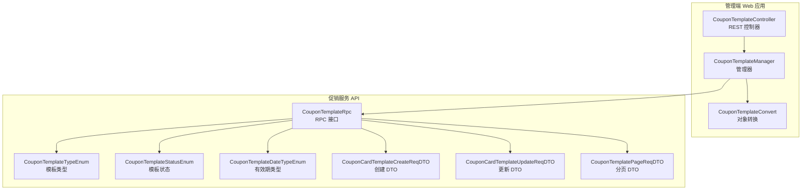
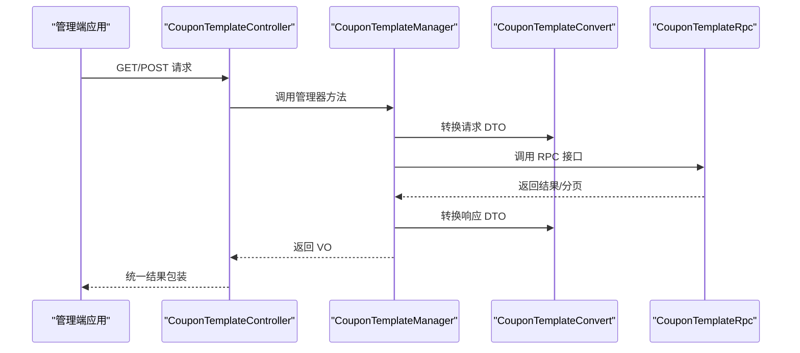
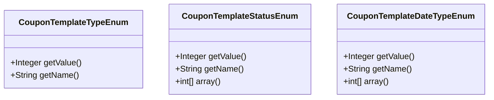
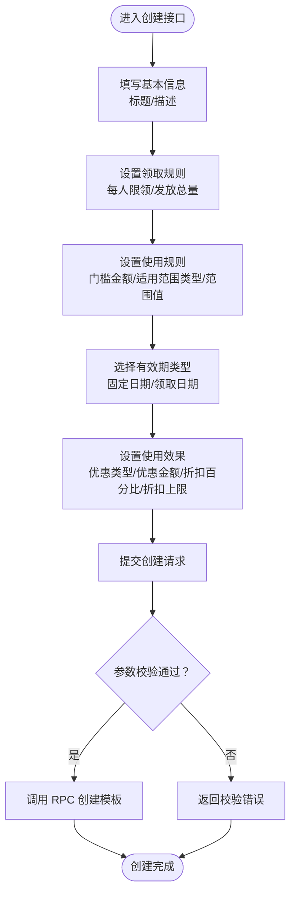
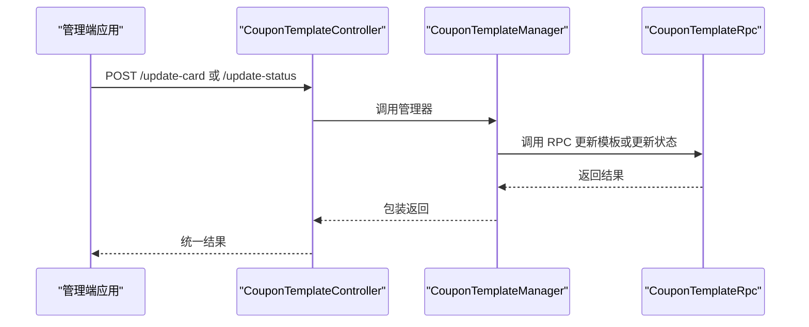
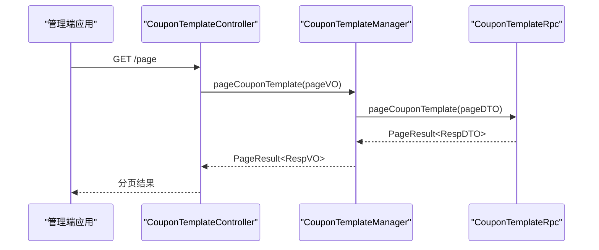
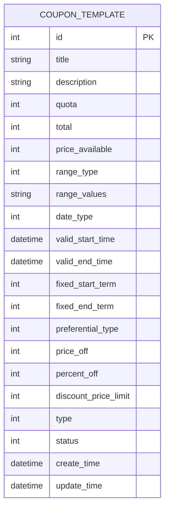
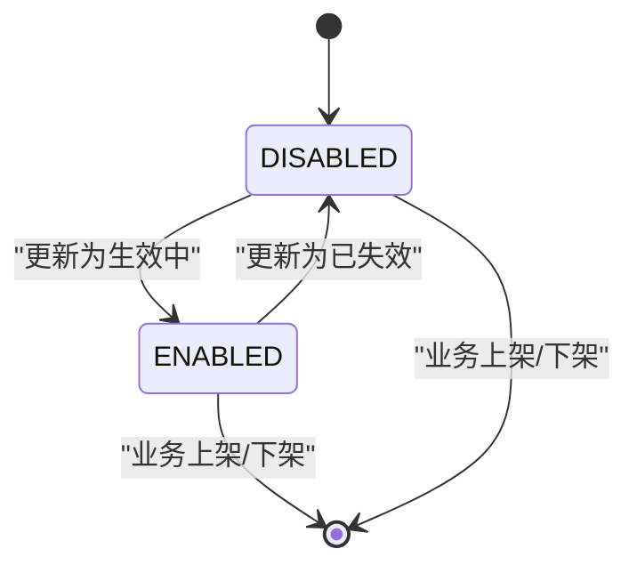
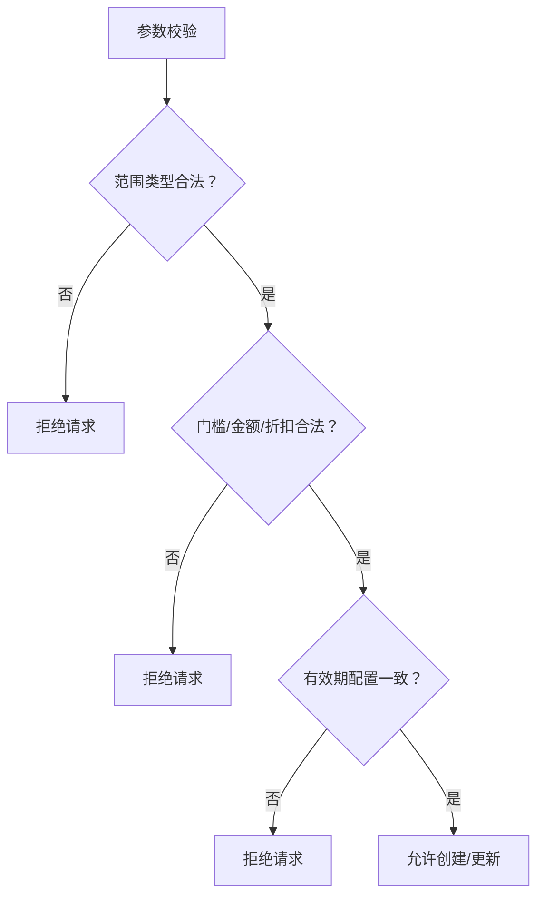
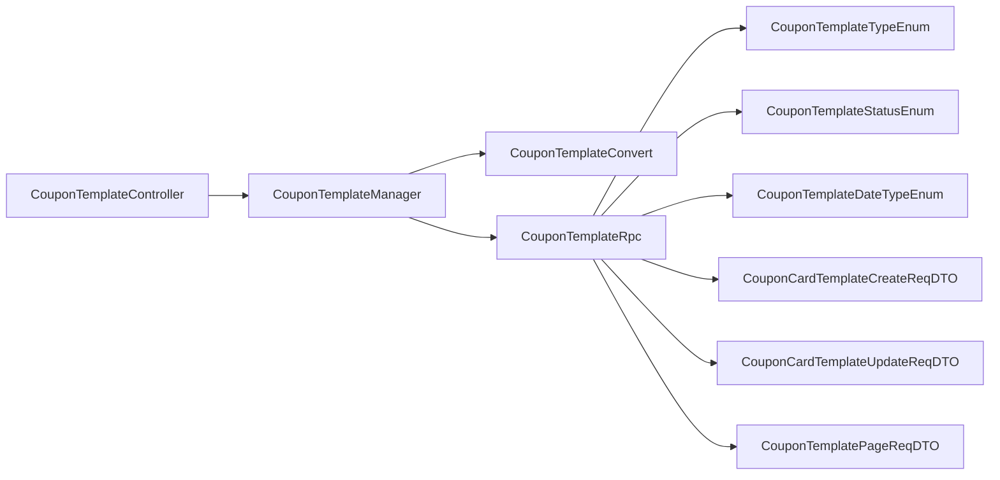

# 优惠券模板管理

<cite>
**本文引用的文件**
- [CouponTemplateController.java](file://management-web-app/src/main/java/cn/iocoder/mall/managementweb/controller/promotion/coupon/CouponTemplateController.java)
- [CouponTemplateManager.java](file://management-web-app/src/main/java/cn/iocoder/mall/managementweb/manager/promotion/coupon/CouponTemplateManager.java)
- [CouponTemplateConvert.java](file://management-web-app/src/main/java/cn/iocoder/mall/managementweb/convert/promotion/CouponTemplateConvert.java)
- [CouponTemplateRpc.java](file://promotion-service-project/promotion-service-api/src/main/java/cn/iocoder/mall/promotion/api/rpc/coupon/CouponTemplateRpc.java)
- [CouponCardTemplateCreateReqDTO.java](file://promotion-service-project/promotion-service-api/src/main/java/cn/iocoder/mall/promotion/api/rpc/coupon/dto/template/CouponCardTemplateCreateReqDTO.java)
- [CouponCardTemplateUpdateReqDTO.java](file://promotion-service-project/promotion-service-api/src/main/java/cn/iocoder/mall/promotion/api/rpc/coupon/dto/template/CouponCardTemplateUpdateReqDTO.java)
- [CouponTemplatePageReqDTO.java](file://promotion-service-project/promotion-service-api/src/main/java/cn/iocoder/mall/promotion/api/rpc/coupon/dto/template/CouponTemplatePageReqDTO.java)
- [CouponTemplateTypeEnum.java](file://promotion-service-project/promotion-service-api/src/main/java/cn/iocoder/mall/promotion/api/enums/coupon/template/CouponTemplateTypeEnum.java)
- [CouponTemplateStatusEnum.java](file://promotion-service-project/promotion-service-api/src/main/java/cn/iocoder/mall/promotion/api/enums/coupon/template/CouponTemplateStatusEnum.java)
- [CouponTemplateDateTypeEnum.java](file://promotion-service-project/promotion-service-api/src/main/java/cn/iocoder/mall/promotion/api/enums/coupon/template/CouponTemplateDateTypeEnum.java)
</cite>

## 目录
1. [引言](#引言)
2. [项目结构](#项目结构)
3. [核心组件](#核心组件)
4. [架构总览](#架构总览)
5. [详细组件分析](#详细组件分析)
6. [依赖分析](#依赖分析)
7. [性能考虑](#性能考虑)
8. [故障排查指南](#故障排查指南)
9. [结论](#结论)
10. [附录](#附录)

## 引言
本技术文档围绕“优惠券模板管理”功能展开，系统化梳理模板类型、业务规则、创建与编辑流程、分页查询、状态管理以及风控与合规策略。文档面向开发与产品人员，既提供高层架构视图，也给出关键代码路径与数据模型映射，帮助快速理解与落地实施。

## 项目结构
优惠券模板管理采用前后端分离与 RPC 分层架构：
- 管理端 Web 应用负责对外接口与权限校验，调用促销服务的 RPC 接口。
- 促销服务 API 定义 RPC 接口与 DTO/枚举，规范模板类型、状态、有效期类型等。
- 管理端通过 Manager 层封装 RPC 调用，完成请求转换与错误处理。

**图表来源**
- [CouponTemplateController.java:23-71](file://management-web-app/src/main/java/cn/iocoder/mall/managementweb/controller/promotion/coupon/CouponTemplateController.java#L23-L71)
- [CouponTemplateManager.java:17-54](file://management-web-app/src/main/java/cn/iocoder/mall/managementweb/manager/promotion/coupon/CouponTemplateManager.java#L17-L54)
- [CouponTemplateConvert.java:15-28](file://management-web-app/src/main/java/cn/iocoder/mall/managementweb/convert/promotion/CouponTemplateConvert.java#L15-L28)
- [CouponTemplateRpc.java:10-57](file://promotion-service-project/promotion-service-api/src/main/java/cn/iocoder/mall/promotion/api/rpc/coupon/CouponTemplateRpc.java#L10-L57)
- [CouponTemplateTypeEnum.java:8-38](file://promotion-service-project/promotion-service-api/src/main/java/cn/iocoder/mall/promotion/api/enums/coupon/template/CouponTemplateTypeEnum.java#L8-L38)
- [CouponTemplateStatusEnum.java:10-45](file://promotion-service-project/promotion-service-api/src/main/java/cn/iocoder/mall/promotion/api/enums/coupon/template/CouponTemplateStatusEnum.java#L10-L45)
- [CouponTemplateDateTypeEnum.java:10-46](file://promotion-service-project/promotion-service-api/src/main/java/cn/iocoder/mall/promotion/api/enums/coupon/template/CouponTemplateDateTypeEnum.java#L10-L46)
- [CouponCardTemplateCreateReqDTO.java:23-143](file://promotion-service-project/promotion-service-api/src/main/java/cn/iocoder/mall/promotion/api/rpc/coupon/dto/template/CouponCardTemplateCreateReqDTO.java#L23-L143)
- [CouponCardTemplateUpdateReqDTO.java:19-142](file://promotion-service-project/promotion-service-api/src/main/java/cn/iocoder/mall/promotion/api/rpc/coupon/dto/template/CouponCardTemplateUpdateReqDTO.java#L19-L142)
- [CouponTemplatePageReqDTO.java:14-33](file://promotion-service-project/promotion-service-api/src/main/java/cn/iocoder/mall/promotion/api/rpc/coupon/dto/template/CouponTemplatePageReqDTO.java#L14-L33)

**章节来源**
- [CouponTemplateController.java:23-71](file://management-web-app/src/main/java/cn/iocoder/mall/managementweb/controller/promotion/coupon/CouponTemplateController.java#L23-L71)
- [CouponTemplateManager.java:17-54](file://management-web-app/src/main/java/cn/iocoder/mall/managementweb/manager/promotion/coupon/CouponTemplateManager.java#L17-L54)
- [CouponTemplateConvert.java:15-28](file://management-web-app/src/main/java/cn/iocoder/mall/managementweb/convert/promotion/CouponTemplateConvert.java#L15-L28)
- [CouponTemplateRpc.java:10-57](file://promotion-service-project/promotion-service-api/src/main/java/cn/iocoder/mall/promotion/api/rpc/coupon/CouponTemplateRpc.java#L10-L57)

## 核心组件
- 控制器层：提供分页查询、状态更新、创建与更新模板的 REST 接口，统一返回包装结构。
- 管理器层：封装 RPC 调用，进行请求/响应转换与错误处理。
- 转换层：使用 MapStruct 将 VO/DTO 与 RPC DTO 进行双向转换。
- RPC 接口层：定义模板查询、分页、状态更新、创建与更新等能力。
- 枚举与 DTO：定义模板类型、状态、有效期类型及创建/更新/分页所需字段。

**章节来源**
- [CouponTemplateController.java:34-71](file://management-web-app/src/main/java/cn/iocoder/mall/managementweb/controller/promotion/coupon/CouponTemplateController.java#L34-L71)
- [CouponTemplateManager.java:26-52](file://management-web-app/src/main/java/cn/iocoder/mall/managementweb/manager/promotion/coupon/CouponTemplateManager.java#L26-L52)
- [CouponTemplateConvert.java:20-26](file://management-web-app/src/main/java/cn/iocoder/mall/managementweb/convert/promotion/CouponTemplateConvert.java#L20-L26)
- [CouponTemplateRpc.java:14-52](file://promotion-service-project/promotion-service-api/src/main/java/cn/iocoder/mall/promotion/api/rpc/coupon/CouponTemplateRpc.java#L14-L52)

## 架构总览
下图展示从管理端发起请求到促销服务执行模板管理的完整链路：

**图表来源**
- [CouponTemplateController.java:34-71](file://management-web-app/src/main/java/cn/iocoder/mall/managementweb/controller/promotion/coupon/CouponTemplateController.java#L34-L71)
- [CouponTemplateManager.java:26-52](file://management-web-app/src/main/java/cn/iocoder/mall/managementweb/manager/promotion/coupon/CouponTemplateManager.java#L26-L52)
- [CouponTemplateConvert.java:20-26](file://management-web-app/src/main/java/cn/iocoder/mall/managementweb/convert/promotion/CouponTemplateConvert.java#L20-L26)
- [CouponTemplateRpc.java:14-52](file://promotion-service-project/promotion-service-api/src/main/java/cn/iocoder/mall/promotion/api/rpc/coupon/CouponTemplateRpc.java#L14-L52)

## 详细组件分析

### 模板类型与状态
- 模板类型：当前支持“优惠券”、“折扣卷”两类，用于区分模板形态。
- 模板状态：支持“生效中”、“已失效”，用于控制模板是否可被领取与使用。
- 有效期类型：支持“固定日期”和“领取日期”两种有效期计算方式。

**图表来源**
- [CouponTemplateTypeEnum.java:8-38](file://promotion-service-project/promotion-service-api/src/main/java/cn/iocoder/mall/promotion/api/enums/coupon/template/CouponTemplateTypeEnum.java#L8-L38)
- [CouponTemplateStatusEnum.java:10-45](file://promotion-service-project/promotion-service-api/src/main/java/cn/iocoder/mall/promotion/api/enums/coupon/template/CouponTemplateStatusEnum.java#L10-L45)
- [CouponTemplateDateTypeEnum.java:10-46](file://promotion-service-project/promotion-service-api/src/main/java/cn/iocoder/mall/promotion/api/enums/coupon/template/CouponTemplateDateTypeEnum.java#L10-L46)

**章节来源**
- [CouponTemplateTypeEnum.java:8-38](file://promotion-service-project/promotion-service-api/src/main/java/cn/iocoder/mall/promotion/api/enums/coupon/template/CouponTemplateTypeEnum.java#L8-L38)
- [CouponTemplateStatusEnum.java:10-45](file://promotion-service-project/promotion-service-api/src/main/java/cn/iocoder/mall/promotion/api/enums/coupon/template/CouponTemplateStatusEnum.java#L10-L45)
- [CouponTemplateDateTypeEnum.java:10-46](file://promotion-service-project/promotion-service-api/src/main/java/cn/iocoder/mall/promotion/api/enums/coupon/template/CouponTemplateDateTypeEnum.java#L10-L46)

### 模板创建流程
创建流程涵盖基本信息、领取规则、使用规则、适用范围、有效期管理与使用效果等关键参数。以下流程图基于创建 DTO 字段约束与业务含义抽象而来：

**图表来源**
- [CouponCardTemplateCreateReqDTO.java:23-143](file://promotion-service-project/promotion-service-api/src/main/java/cn/iocoder/mall/promotion/api/rpc/coupon/dto/template/CouponCardTemplateCreateReqDTO.java#L23-L143)

**章节来源**
- [CouponCardTemplateCreateReqDTO.java:23-143](file://promotion-service-project/promotion-service-api/src/main/java/cn/iocoder/mall/promotion/api/rpc/coupon/dto/template/CouponCardTemplateCreateReqDTO.java#L23-L143)

### 模板编辑与状态变更
- 编辑接口支持对模板标题、描述、领取规则与适用范围等字段进行更新。
- 状态变更接口支持将模板置为“生效中/已失效”。

**图表来源**
- [CouponTemplateController.java:41-69](file://management-web-app/src/main/java/cn/iocoder/mall/managementweb/controller/promotion/coupon/CouponTemplateController.java#L41-L69)
- [CouponTemplateManager.java:33-52](file://management-web-app/src/main/java/cn/iocoder/mall/managementweb/manager/promotion/coupon/CouponTemplateManager.java#L33-L52)
- [CouponTemplateRpc.java:30-52](file://promotion-service-project/promotion-service-api/src/main/java/cn/iocoder/mall/promotion/api/rpc/coupon/CouponTemplateRpc.java#L30-L52)

**章节来源**
- [CouponTemplateController.java:41-69](file://management-web-app/src/main/java/cn/iocoder/mall/managementweb/controller/promotion/coupon/CouponTemplateController.java#L41-L69)
- [CouponTemplateManager.java:33-52](file://management-web-app/src/main/java/cn/iocoder/mall/managementweb/manager/promotion/coupon/CouponTemplateManager.java#L33-L52)
- [CouponTemplateRpc.java:30-52](file://promotion-service-project/promotion-service-api/src/main/java/cn/iocoder/mall/promotion/api/rpc/coupon/CouponTemplateRpc.java#L30-L52)

### 模板分页查询
分页查询支持按类型、标题、状态、优惠类型等条件筛选，结合通用分页参数实现高效检索。

**图表来源**
- [CouponTemplateController.java:34-39](file://management-web-app/src/main/java/cn/iocoder/mall/managementweb/controller/promotion/coupon/CouponTemplateController.java#L34-L39)
- [CouponTemplateManager.java:26-31](file://management-web-app/src/main/java/cn/iocoder/mall/managementweb/manager/promotion/coupon/CouponTemplateManager.java#L26-L31)
- [CouponTemplateRpc.java:22-28](file://promotion-service-project/promotion-service-api/src/main/java/cn/iocoder/mall/promotion/api/rpc/coupon/CouponTemplateRpc.java#L22-L28)
- [CouponTemplatePageReqDTO.java:14-33](file://promotion-service-project/promotion-service-api/src/main/java/cn/iocoder/mall/promotion/api/rpc/coupon/dto/template/CouponTemplatePageReqDTO.java#L14-L33)

**章节来源**
- [CouponTemplateController.java:34-39](file://management-web-app/src/main/java/cn/iocoder/mall/managementweb/controller/promotion/coupon/CouponTemplateController.java#L34-L39)
- [CouponTemplateManager.java:26-31](file://management-web-app/src/main/java/cn/iocoder/mall/managementweb/manager/promotion/coupon/CouponTemplateManager.java#L26-L31)
- [CouponTemplateRpc.java:22-28](file://promotion-service-project/promotion-service-api/src/main/java/cn/iocoder/mall/promotion/api/rpc/coupon/CouponTemplateRpc.java#L22-L28)
- [CouponTemplatePageReqDTO.java:14-33](file://promotion-service-project/promotion-service-api/src/main/java/cn/iocoder/mall/promotion/api/rpc/coupon/dto/template/CouponTemplatePageReqDTO.java#L14-L33)

### 数据模型设计
模板核心字段与业务含义如下：
- 基本信息：标题、使用说明
- 领取规则：每人限领数量、发放总量
- 使用规则：使用门槛金额、适用范围类型与范围值
- 有效期：有效期类型（固定日期/领取日期）、固定起止时间、领取日期起止天数
- 使用效果：优惠类型（代金卷/折扣卷）、优惠金额、折扣百分比、折扣上限

**图表来源**
- [CouponCardTemplateCreateReqDTO.java:23-143](file://promotion-service-project/promotion-service-api/src/main/java/cn/iocoder/mall/promotion/api/rpc/coupon/dto/template/CouponCardTemplateCreateReqDTO.java#L23-L143)
- [CouponCardTemplateUpdateReqDTO.java:19-142](file://promotion-service-project/promotion-service-api/src/main/java/cn/iocoder/mall/promotion/api/rpc/coupon/dto/template/CouponCardTemplateUpdateReqDTO.java#L19-L142)
- [CouponTemplateTypeEnum.java:8-38](file://promotion-service-project/promotion-service-api/src/main/java/cn/iocoder/mall/promotion/api/enums/coupon/template/CouponTemplateTypeEnum.java#L8-L38)
- [CouponTemplateStatusEnum.java:10-45](file://promotion-service-project/promotion-service-api/src/main/java/cn/iocoder/mall/promotion/api/enums/coupon/template/CouponTemplateStatusEnum.java#L10-L45)
- [CouponTemplateDateTypeEnum.java:10-46](file://promotion-service-project/promotion-service-api/src/main/java/cn/iocoder/mall/promotion/api/enums/coupon/template/CouponTemplateDateTypeEnum.java#L10-L46)

**章节来源**
- [CouponCardTemplateCreateReqDTO.java:23-143](file://promotion-service-project/promotion-service-api/src/main/java/cn/iocoder/mall/promotion/api/rpc/coupon/dto/template/CouponCardTemplateCreateReqDTO.java#L23-L143)
- [CouponCardTemplateUpdateReqDTO.java:19-142](file://promotion-service-project/promotion-service-api/src/main/java/cn/iocoder/mall/promotion/api/rpc/coupon/dto/template/CouponCardTemplateUpdateReqDTO.java#L19-L142)
- [CouponTemplateTypeEnum.java:8-38](file://promotion-service-project/promotion-service-api/src/main/java/cn/iocoder/mall/promotion/api/enums/coupon/template/CouponTemplateTypeEnum.java#L8-L38)
- [CouponTemplateStatusEnum.java:10-45](file://promotion-service-project/promotion-service-api/src/main/java/cn/iocoder/mall/promotion/api/enums/coupon/template/CouponTemplateStatusEnum.java#L10-L45)
- [CouponTemplateDateTypeEnum.java:10-46](file://promotion-service-project/promotion-service-api/src/main/java/cn/iocoder/mall/promotion/api/enums/coupon/template/CouponTemplateDateTypeEnum.java#L10-L46)

### 模板状态管理机制
- 启用：将模板状态设为“生效中”
- 停用：将模板状态设为“已失效”
- 删除：当前接口未暴露删除模板的 RPC 方法，建议在业务侧通过状态禁用来替代物理删除，确保审计与历史记录完整

**图表来源**
- [CouponTemplateStatusEnum.java:10-45](file://promotion-service-project/promotion-service-api/src/main/java/cn/iocoder/mall/promotion/api/enums/coupon/template/CouponTemplateStatusEnum.java#L10-L45)
- [CouponTemplateRpc.java:30-35](file://promotion-service-project/promotion-service-api/src/main/java/cn/iocoder/mall/promotion/api/rpc/coupon/CouponTemplateRpc.java#L30-L35)

**章节来源**
- [CouponTemplateStatusEnum.java:10-45](file://promotion-service-project/promotion-service-api/src/main/java/cn/iocoder/mall/promotion/api/enums/coupon/template/CouponTemplateStatusEnum.java#L10-L45)
- [CouponTemplateRpc.java:30-35](file://promotion-service-project/promotion-service-api/src/main/java/cn/iocoder/mall/promotion/api/rpc/coupon/CouponTemplateRpc.java#L30-L35)

### 风控策略与合规性检查
- 参数校验：创建/更新 DTO 对必填项、数值边界、字符串长度进行严格校验，避免非法数据入库。
- 范围与门槛：适用范围类型与范围值需配合枚举校验，门槛金额与折扣上限需满足业务阈值。
- 有效期一致性：固定日期与领取日期模式下，起止时间与起止天数需满足单调递增与最小值约束。
- 权限控制：控制器方法标注权限注解，防止越权访问。

**图表来源**
- [CouponCardTemplateCreateReqDTO.java:23-143](file://promotion-service-project/promotion-service-api/src/main/java/cn/iocoder/mall/promotion/api/rpc/coupon/dto/template/CouponCardTemplateCreateReqDTO.java#L23-L143)
- [CouponCardTemplateUpdateReqDTO.java:19-142](file://promotion-service-project/promotion-service-api/src/main/java/cn/iocoder/mall/promotion/api/rpc/coupon/dto/template/CouponCardTemplateUpdateReqDTO.java#L19-L142)
- [CouponTemplateController.java:56-69](file://management-web-app/src/main/java/cn/iocoder/mall/managementweb/controller/promotion/coupon/CouponTemplateController.java#L56-L69)

**章节来源**
- [CouponCardTemplateCreateReqDTO.java:23-143](file://promotion-service-project/promotion-service-api/src/main/java/cn/iocoder/mall/promotion/api/rpc/coupon/dto/template/CouponCardTemplateCreateReqDTO.java#L23-L143)
- [CouponCardTemplateUpdateReqDTO.java:19-142](file://promotion-service-project/promotion-service-api/src/main/java/cn/iocoder/mall/promotion/api/rpc/coupon/dto/template/CouponCardTemplateUpdateReqDTO.java#L19-L142)
- [CouponTemplateController.java:56-69](file://management-web-app/src/main/java/cn/iocoder/mall/managementweb/controller/promotion/coupon/CouponTemplateController.java#L56-L69)

## 依赖分析
- 控制器依赖管理器；管理器依赖 RPC 接口与转换器；转换器负责 VO/DTO 互转。
- RPC 接口依赖枚举与 DTO；枚举提供类型与状态约束。
- 分页查询通过 PageParam 扩展，支持多维筛选。

**图表来源**
- [CouponTemplateController.java:23-71](file://management-web-app/src/main/java/cn/iocoder/mall/managementweb/controller/promotion/coupon/CouponTemplateController.java#L23-L71)
- [CouponTemplateManager.java:17-54](file://management-web-app/src/main/java/cn/iocoder/mall/managementweb/manager/promotion/coupon/CouponTemplateManager.java#L17-L54)
- [CouponTemplateConvert.java:15-28](file://management-web-app/src/main/java/cn/iocoder/mall/managementweb/convert/promotion/CouponTemplateConvert.java#L15-L28)
- [CouponTemplateRpc.java:10-57](file://promotion-service-project/promotion-service-api/src/main/java/cn/iocoder/mall/promotion/api/rpc/coupon/CouponTemplateRpc.java#L10-L57)
- [CouponTemplateTypeEnum.java:8-38](file://promotion-service-project/promotion-service-api/src/main/java/cn/iocoder/mall/promotion/api/enums/coupon/template/CouponTemplateTypeEnum.java#L8-L38)
- [CouponTemplateStatusEnum.java:10-45](file://promotion-service-project/promotion-service-api/src/main/java/cn/iocoder/mall/promotion/api/enums/coupon/template/CouponTemplateStatusEnum.java#L10-L45)
- [CouponTemplateDateTypeEnum.java:10-46](file://promotion-service-project/promotion-service-api/src/main/java/cn/iocoder/mall/promotion/api/enums/coupon/template/CouponTemplateDateTypeEnum.java#L10-L46)
- [CouponCardTemplateCreateReqDTO.java:23-143](file://promotion-service-project/promotion-service-api/src/main/java/cn/iocoder/mall/promotion/api/rpc/coupon/dto/template/CouponCardTemplateCreateReqDTO.java#L23-L143)
- [CouponCardTemplateUpdateReqDTO.java:19-142](file://promotion-service-project/promotion-service-api/src/main/java/cn/iocoder/mall/promotion/api/rpc/coupon/dto/template/CouponCardTemplateUpdateReqDTO.java#L19-L142)
- [CouponTemplatePageReqDTO.java:14-33](file://promotion-service-project/promotion-service-api/src/main/java/cn/iocoder/mall/promotion/api/rpc/coupon/dto/template/CouponTemplatePageReqDTO.java#L14-L33)

**章节来源**
- [CouponTemplateController.java:23-71](file://management-web-app/src/main/java/cn/iocoder/mall/managementweb/controller/promotion/coupon/CouponTemplateController.java#L23-L71)
- [CouponTemplateManager.java:17-54](file://management-web-app/src/main/java/cn/iocoder/mall/managementweb/manager/promotion/coupon/CouponTemplateManager.java#L17-L54)
- [CouponTemplateConvert.java:15-28](file://management-web-app/src/main/java/cn/iocoder/mall/managementweb/convert/promotion/CouponTemplateConvert.java#L15-L28)
- [CouponTemplateRpc.java:10-57](file://promotion-service-project/promotion-service-api/src/main/java/cn/iocoder/mall/promotion/api/rpc/coupon/CouponTemplateRpc.java#L10-L57)

## 性能考虑
- 分页查询：合理设置分页大小与排序字段，避免一次性加载过多数据。
- RPC 调用：批量操作建议合并请求，减少网络往返。
- 缓存策略：对常用枚举与静态配置进行缓存，降低重复解析成本。
- 参数校验前置：在网关或控制器层尽早拦截非法请求，减少无效 RPC 调用。

## 故障排查指南
- 接口返回失败：检查管理器层的错误检查与异常抛出逻辑，定位具体 RPC 错误码。
- 参数校验失败：核对创建/更新 DTO 的校验注解与业务阈值，修正请求体。
- 权限不足：确认控制器方法上的权限注解与用户角色授权是否匹配。

**章节来源**
- [CouponTemplateManager.java:27-36](file://management-web-app/src/main/java/cn/iocoder/mall/managementweb/manager/promotion/coupon/CouponTemplateManager.java#L27-L36)
- [CouponCardTemplateCreateReqDTO.java:23-143](file://promotion-service-project/promotion-service-api/src/main/java/cn/iocoder/mall/promotion/api/rpc/coupon/dto/template/CouponCardTemplateCreateReqDTO.java#L23-L143)
- [CouponTemplateController.java:56-69](file://management-web-app/src/main/java/cn/iocoder/mall/managementweb/controller/promotion/coupon/CouponTemplateController.java#L56-L69)

## 结论
本功能通过清晰的分层与严格的 DTO 校验，实现了优惠券模板的创建、编辑、分页查询与状态管理。结合风控与合规策略，可在保证数据正确性的同时提升运营效率。后续可扩展删除与版本化能力，完善审计与回滚机制。

## 附录
- 关键接口路径参考
  - 分页查询：GET /promotion/coupon-template/page
  - 更新状态：POST /promotion/coupon-template/update-status
  - 创建模板：POST /promotion/coupon-template/create-card
  - 更新模板：POST /promotion/coupon-template/update-card