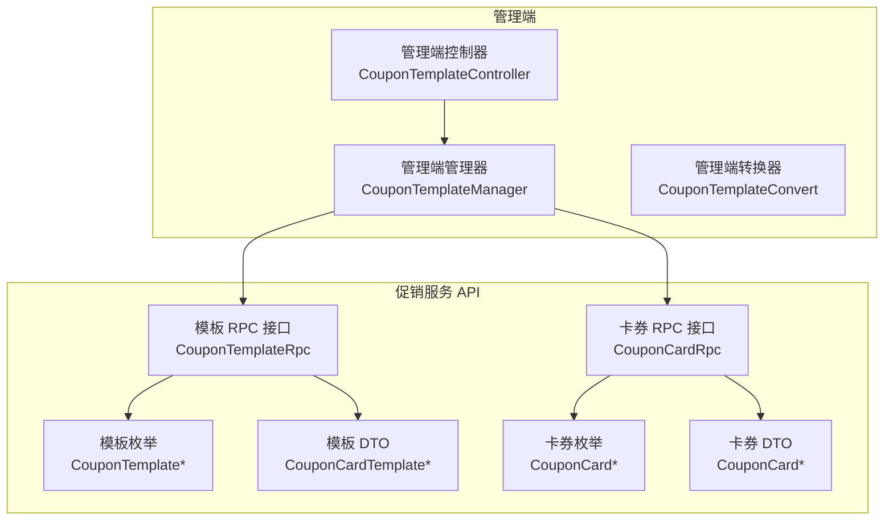
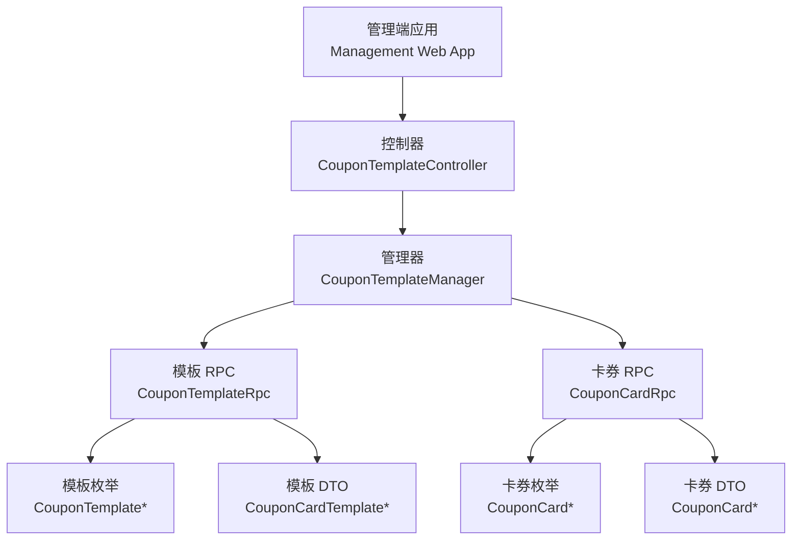
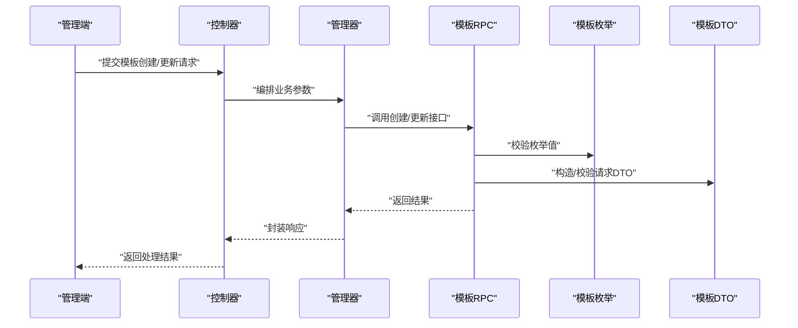
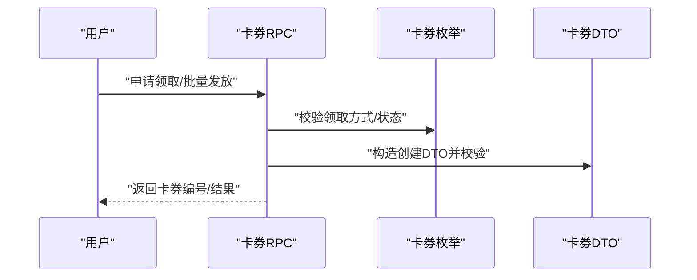
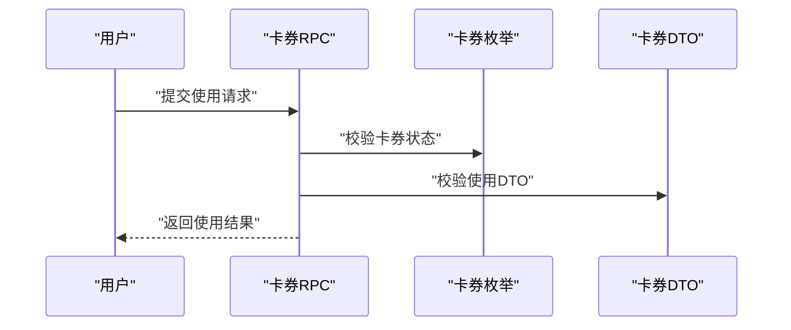
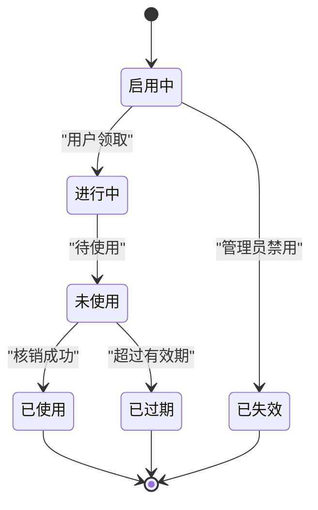
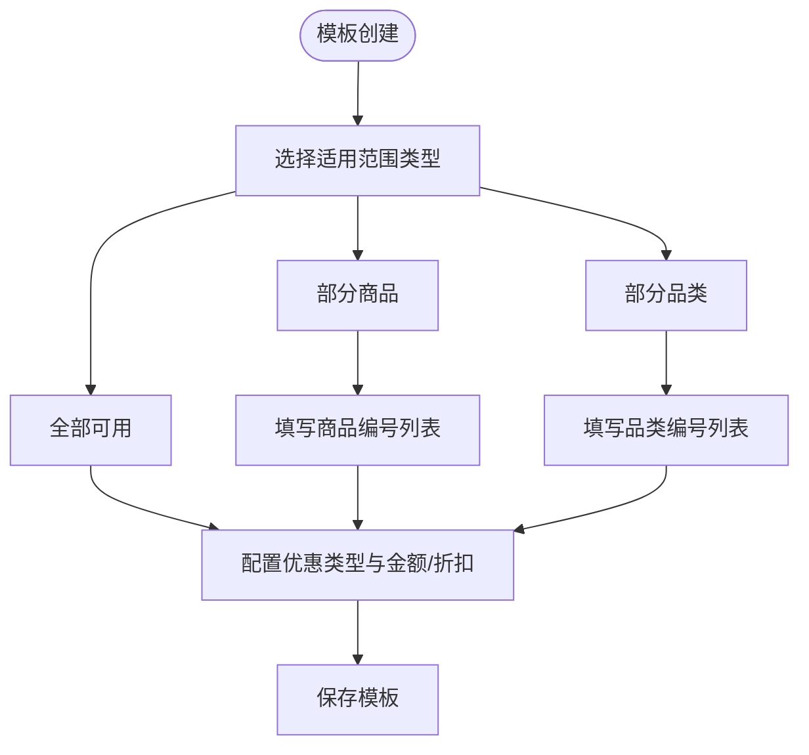
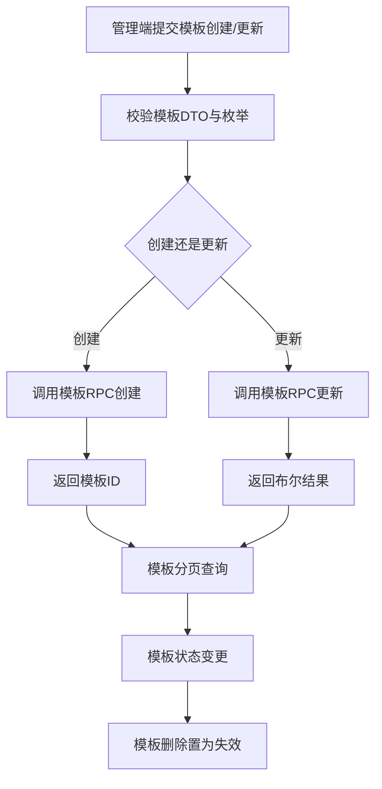
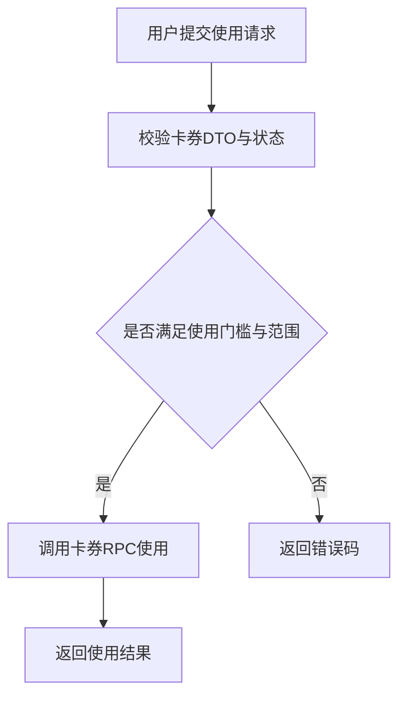
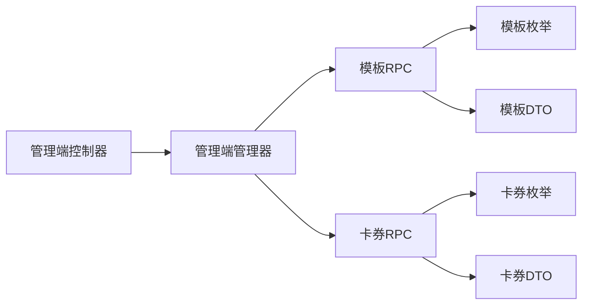

# 优惠券系统

<cite>
**本文引用的文件**
- [CouponTemplateRpc.java](file://promotion-service-project/promotion-service-api/src/main/java/cn/iocoder/mall/promotion/api/rpc/coupon/CouponTemplateRpc.java)
- [CouponCardRpc.java](file://promotion-service-project/promotion-service-api/src/main/java/cn/iocoder/mall/promotion/api/rpc/coupon/CouponCardRpc.java)
- [CouponTemplateStatusEnum.java](file://promotion-service-project/promotion-service-api/src/main/java/cn/iocoder/mall/promotion/api/enums/coupon/template/CouponTemplateStatusEnum.java)
- [CouponCardStatusEnum.java](file://promotion-service-project/promotion-service-api/src/main/java/cn/iocoder/mall/promotion/api/enums/coupon/card/CouponCardStatusEnum.java)
- [CouponCardTakeTypeEnum.java](file://promotion-service-project/promotion-service-api/src/main/java/cn/iocoder/mall/promotion/api/enums/coupon/card/CouponCardTakeTypeEnum.java)
- [CouponTemplateTypeEnum.java](file://promotion-service-project/promotion-service-api/src/main/java/cn/iocoder/mall/promotion/api/enums/coupon/template/CouponTemplateTypeEnum.java)
- [CouponTemplateDateTypeEnum.java](file://promotion-service-project/promotion-service-api/src/main/java/cn/iocoder/mall/promotion/api/enums/coupon/template/CouponTemplateDateTypeEnum.java)
- [CouponCardTemplateCreateReqDTO.java](file://promotion-service-project/promotion-service-api/src/main/java/cn/iocoder/mall/promotion/api/rpc/coupon/dto/template/CouponCardTemplateCreateReqDTO.java)
- [CouponCardCreateReqDTO.java](file://promotion-service-project/promotion-service-api/src/main/java/cn/iocoder/mall/promotion/api/rpc/coupon/dto/card/CouponCardCreateReqDTO.java)
- [CouponCardUseReqDTO.java](file://promotion-service-project/promotion-service-api/src/main/java/cn/iocoder/mall/promotion/api/rpc/coupon/dto/card/CouponCardUseReqDTO.java)
- [CouponCardCancelUseReqDTO.java](file://promotion-service-project/promotion-service-api/src/main/java/cn/iocoder/mall/promotion/api/rpc/coupon/dto/card/CouponCardCancelUseReqDTO.java)
- [CouponCardAvailableListReqDTO.java](file://promotion-service-project/promotion-service-api/src/main/java/cn/iocoder/mall/promotion/api/rpc/coupon/dto/card/CouponCardAvailableListReqDTO.java)
- [CouponCardAvailableRespDTO.java](file://promotion-service-project/promotion-service-api/src/main/java/cn/iocoder/mall/promotion/api/rpc/coupon/dto/card/CouponCardAvailableRespDTO.java)
- [CouponCardRespDTO.java](file://promotion-service-project/promotion-service-api/src/main/java/cn/iocoder/mall/promotion/api/rpc/coupon/dto/card/CouponCardRespDTO.java)
- [CouponTemplateRespDTO.java](file://promotion-service-project/promotion-service-api/src/main/java/cn/iocoder/mall/promotion/api/rpc/coupon/dto/template/CouponTemplateRespDTO.java)
- [CouponCardPageReqDTO.java](file://promotion-service-project/promotion-service-api/src/main/java/cn/iocoder/mall/promotion/api/rpc/coupon/dto/card/CouponCardPageReqDTO.java)
- [CouponCardTemplateUpdateStatusReqDTO.java](file://promotion-service-project/promotion-service-api/src/main/java/cn/iocoder/mall/promotion/api/rpc/coupon/dto/template/CouponCardTemplateUpdateStatusReqDTO.java)
- [CouponCardTemplateUpdateReqDTO.java](file://promotion-service-project/promotion-service-api/src/main/java/cn/iocoder/mall/promotion/api/rpc/coupon/dto/template/CouponCardTemplateUpdateReqDTO.java)
- [CouponCardTemplatePageReqDTO.java](file://promotion-service-project/promotion-service-api/src/main/java/cn/iocoder/mall/promotion/api/rpc/coupon/dto/template/CouponCardTemplatePageReqDTO.java)
- [CouponCardPageReqDTO.java](file://promotion-service-project/promotion-service-api/src/main/java/cn/iocoder/mall/promotion/api/rpc/coupon/dto/card/CouponCardPageReqDTO.java)
- [PromotionErrorCodeConstants.java](file://promotion-service-project/promotion-service-api/src/main/java/cn/iocoder/mall/promotion/api/PromotionErrorCodeConstants.java)
- [RangeTypeEnum.java](file://promotion-service-project/promotion-service-api/src/main/java/cn/iocoder/mall/promotion/api/RangeTypeEnum.java)
- [PreferentialTypeEnum.java](file://promotion-service-project/promotion-service-api/src/main/java/cn/iocoder/mall/promotion/api/PreferentialTypeEnum.java)
- [CouponTemplateController.java](file://management-web-app/src/main/java/cn/iocoder/mall/managementweb/controller/promotion/coupon/CouponTemplateController.java)
- [CouponTemplateManager.java](file://management-web-app/src/main/java/cn/iocoder/mall/managementweb/manager/promotion/coupon/CouponTemplateManager.java)
- [CouponTemplateCardCreateReqVO.java](file://management-web-app/src/main/java/cn/iocoder/mall/managementweb/controller/promotion/coupon/vo/template/CouponTemplateCardCreateReqVO.java)
- [CouponTemplateCardUpdateReqVO.java](file://management-web-app/src/main/java/cn/iocoder/mall/managementweb/controller/promotion/coupon/vo/template/CouponTemplateCardUpdateReqVO.java)
- [CouponTemplatePageReqVO.java](file://management-web-app/src/main/java/cn/iocoder/mall/managementweb/controller/promotion/coupon/vo/template/CouponTemplatePageReqVO.java)
- [CouponTemplateRespVO.java](file://management-web-app/src/main/java/cn/iocoder/mall/managementweb/controller/promotion/coupon/vo/template/CouponTemplateRespVO.java)
- [CouponTemplateConvert.java](file://management-web-app/src/main/java/cn/iocoder/mall/managementweb/convert/promotion/CouponTemplateConvert.java)
</cite>

## 目录
1. [简介](#简介)
2. [项目结构](#项目结构)
3. [核心组件](#核心组件)
4. [架构总览](#架构总览)
5. [详细组件分析](#详细组件分析)
6. [依赖关系分析](#依赖关系分析)
7. [性能考量](#性能考量)
8. [故障排查指南](#故障排查指南)
9. [结论](#结论)
10. [附录](#附录)

## 简介
本技术文档围绕优惠券系统展开，聚焦以下能力：
- 优惠券模板管理：创建、编辑、删除、状态管理
- 优惠券卡券发放：用户领取、后台批量发放、限时发放策略
- 优惠券使用流程：核销验证、使用限制、有效期管理
- 优惠券状态管理：未使用、已使用、已过期等状态流转
- 适用范围配置：商品范围、品类范围、品牌范围等限制
- 业务流程与状态转换图
- 风控与防刷策略建议

## 项目结构
优惠券相关代码主要分布在两个模块：
- promotion-service-api：定义 RPC 接口、枚举、DTO
- management-web-app：管理端控制器与管理器，负责模板 CRUD 与分页查询

**图表来源**
- [CouponTemplateController.java:1-200](file://management-web-app/src/main/java/cn/iocoder/mall/managementweb/controller/promotion/coupon/CouponTemplateController.java#L1-L200)
- [CouponTemplateManager.java:1-200](file://management-web-app/src/main/java/cn/iocoder/mall/managementweb/manager/promotion/coupon/CouponTemplateManager.java#L1-L200)
- [CouponTemplateRpc.java:1-58](file://promotion-service-project/promotion-service-api/src/main/java/cn/iocoder/mall/promotion/api/rpc/coupon/CouponTemplateRpc.java#L1-L58)
- [CouponCardRpc.java:1-55](file://promotion-service-project/promotion-service-api/src/main/java/cn/iocoder/mall/promotion/api/rpc/coupon/CouponCardRpc.java#L1-L55)

**章节来源**
- [CouponTemplateController.java:1-200](file://management-web-app/src/main/java/cn/iocoder/mall/managementweb/controller/promotion/coupon/CouponTemplateController.java#L1-L200)
- [CouponTemplateManager.java:1-200](file://management-web-app/src/main/java/cn/iocoder/mall/managementweb/manager/promotion/coupon/CouponTemplateManager.java#L1-L200)
- [CouponTemplateRpc.java:1-58](file://promotion-service-project/promotion-service-api/src/main/java/cn/iocoder/mall/promotion/api/rpc/coupon/CouponTemplateRpc.java#L1-L58)
- [CouponCardRpc.java:1-55](file://promotion-service-project/promotion-service-api/src/main/java/cn/iocoder/mall/promotion/api/rpc/coupon/CouponCardRpc.java#L1-L55)

## 核心组件
- 模板 RPC 接口：提供模板的创建、更新、分页、状态变更等能力
- 卡券 RPC 接口：提供卡券的创建、分页、使用、取消使用、可用列表等能力
- 枚举体系：模板状态、卡券状态、领取方式、模板类型、日期类型等
- DTO：模板创建/更新/分页、卡券创建/使用/分页、可用列表等请求与响应对象
- 管理端控制器与管理器：封装模板管理的 HTTP 控制层与业务编排

**章节来源**
- [CouponTemplateRpc.java:1-58](file://promotion-service-project/promotion-service-api/src/main/java/cn/iocoder/mall/promotion/api/rpc/coupon/CouponTemplateRpc.java#L1-L58)
- [CouponCardRpc.java:1-55](file://promotion-service-project/promotion-service-api/src/main/java/cn/iocoder/mall/promotion/api/rpc/coupon/CouponCardRpc.java#L1-L55)
- [CouponTemplateStatusEnum.java:1-46](file://promotion-service-project/promotion-service-api/src/main/java/cn/iocoder/mall/promotion/api/enums/coupon/template/CouponTemplateStatusEnum.java#L1-L46)
- [CouponCardStatusEnum.java:1-46](file://promotion-service-project/promotion-service-api/src/main/java/cn/iocoder/mall/promotion/api/enums/coupon/card/CouponCardStatusEnum.java#L1-L46)
- [CouponCardTakeTypeEnum.java:1-45](file://promotion-service-project/promotion-service-api/src/main/java/cn/iocoder/mall/promotion/api/enums/coupon/card/CouponCardTakeTypeEnum.java#L1-L45)
- [CouponTemplateTypeEnum.java:1-39](file://promotion-service-project/promotion-service-api/src/main/java/cn/iocoder/mall/promotion/api/enums/coupon/template/CouponTemplateTypeEnum.java#L1-L39)
- [CouponTemplateDateTypeEnum.java:1-47](file://promotion-service-project/promotion-service-api/src/main/java/cn/iocoder/mall/promotion/api/enums/coupon/template/CouponTemplateDateTypeEnum.java#L1-L47)
- [CouponCardTemplateCreateReqDTO.java:1-144](file://promotion-service-project/promotion-service-api/src/main/java/cn/iocoder/mall/promotion/api/rpc/coupon/dto/template/CouponCardTemplateCreateReqDTO.java#L1-L144)
- [CouponCardCreateReqDTO.java:1-28](file://promotion-service-project/promotion-service-api/src/main/java/cn/iocoder/mall/promotion/api/rpc/coupon/dto/card/CouponCardCreateReqDTO.java#L1-L28)
- [CouponCardUseReqDTO.java:1-28](file://promotion-service-project/promotion-service-api/src/main/java/cn/iocoder/mall/promotion/api/rpc/coupon/dto/card/CouponCardUseReqDTO.java#L1-L28)

## 架构总览
下图展示管理端与促销服务 API 的交互关系，以及优惠券模板与卡券的核心接口。

**图表来源**
- [CouponTemplateController.java:1-200](file://management-web-app/src/main/java/cn/iocoder/mall/managementweb/controller/promotion/coupon/CouponTemplateController.java#L1-L200)
- [CouponTemplateManager.java:1-200](file://management-web-app/src/main/java/cn/iocoder/mall/managementweb/manager/promotion/coupon/CouponTemplateManager.java#L1-L200)
- [CouponTemplateRpc.java:1-58](file://promotion-service-project/promotion-service-api/src/main/java/cn/iocoder/mall/promotion/api/rpc/coupon/CouponTemplateRpc.java#L1-L58)
- [CouponCardRpc.java:1-55](file://promotion-service-project/promotion-service-api/src/main/java/cn/iocoder/mall/promotion/api/rpc/coupon/CouponCardRpc.java#L1-L55)

## 详细组件分析

### 模板管理（创建、编辑、删除、状态）
- 创建模板：通过模板 RPC 的创建方法传入模板创建 DTO，包含标题、描述、领取配额、发放总量、使用门槛、适用范围、生效日期类型及优惠效果等字段
- 编辑模板：通过模板 RPC 的更新方法传入模板更新 DTO，支持对模板基本信息与规则进行修改
- 删除模板：通过模板 RPC 的状态更新方法将模板置为失效
- 分页查询：通过模板 RPC 的分页方法传入模板分页 DTO，返回模板分页结果

**图表来源**
- [CouponTemplateController.java:1-200](file://management-web-app/src/main/java/cn/iocoder/mall/managementweb/controller/promotion/coupon/CouponTemplateController.java#L1-L200)
- [CouponTemplateManager.java:1-200](file://management-web-app/src/main/java/cn/iocoder/mall/managementweb/manager/promotion/coupon/CouponTemplateManager.java#L1-L200)
- [CouponTemplateRpc.java:1-58](file://promotion-service-project/promotion-service-api/src/main/java/cn/iocoder/mall/promotion/api/rpc/coupon/CouponTemplateRpc.java#L1-L58)
- [CouponCardTemplateCreateReqDTO.java:1-144](file://promotion-service-project/promotion-service-api/src/main/java/cn/iocoder/mall/promotion/api/rpc/coupon/dto/template/CouponCardTemplateCreateReqDTO.java#L1-L144)

**章节来源**
- [CouponTemplateRpc.java:1-58](file://promotion-service-project/promotion-service-api/src/main/java/cn/iocoder/mall/promotion/api/rpc/coupon/CouponTemplateRpc.java#L1-L58)
- [CouponCardTemplateCreateReqDTO.java:1-144](file://promotion-service-project/promotion-service-api/src/main/java/cn/iocoder/mall/promotion/api/rpc/coupon/dto/template/CouponCardTemplateCreateReqDTO.java#L1-L144)
- [CouponTemplateTypeEnum.java:1-39](file://promotion-service-project/promotion-service-api/src/main/java/cn/iocoder/mall/promotion/api/enums/coupon/template/CouponTemplateTypeEnum.java#L1-L39)
- [CouponTemplateDateTypeEnum.java:1-47](file://promotion-service-project/promotion-service-api/src/main/java/cn/iocoder/mall/promotion/api/enums/coupon/template/CouponTemplateDateTypeEnum.java#L1-L47)
- [RangeTypeEnum.java:1-200](file://promotion-service-project/promotion-service-api/src/main/java/cn/iocoder/mall/promotion/api/RangeTypeEnum.java#L1-L200)
- [PreferentialTypeEnum.java:1-200](file://promotion-service-project/promotion-service-api/src/main/java/cn/iocoder/mall/promotion/api/PreferentialTypeEnum.java#L1-L200)

### 卡券发放机制（用户领取、批量发放、限时发放）
- 用户领取：通过卡券 RPC 的创建方法，传入用户编号与模板编号，生成唯一卡券
- 后台批量发放：通过卡券 RPC 的创建方法，按用户列表或活动场景批量创建卡券
- 限时发放策略：模板生效日期类型支持“固定日期”和“领取日期”，结合固定开始/结束天数控制有效期窗口

**图表来源**
- [CouponCardRpc.java:1-55](file://promotion-service-project/promotion-service-api/src/main/java/cn/iocoder/mall/promotion/api/rpc/coupon/CouponCardRpc.java#L1-L55)
- [CouponCardCreateReqDTO.java:1-28](file://promotion-service-project/promotion-service-api/src/main/java/cn/iocoder/mall/promotion/api/rpc/coupon/dto/card/CouponCardCreateReqDTO.java#L1-L28)
- [CouponCardTakeTypeEnum.java:1-45](file://promotion-service-project/promotion-service-api/src/main/java/cn/iocoder/mall/promotion/api/enums/coupon/card/CouponCardTakeTypeEnum.java#L1-L45)

**章节来源**
- [CouponCardRpc.java:1-55](file://promotion-service-project/promotion-service-api/src/main/java/cn/iocoder/mall/promotion/api/rpc/coupon/CouponCardRpc.java#L1-L55)
- [CouponCardCreateReqDTO.java:1-28](file://promotion-service-project/promotion-service-api/src/main/java/cn/iocoder/mall/promotion/api/rpc/coupon/dto/card/CouponCardCreateReqDTO.java#L1-L28)
- [CouponTemplateDateTypeEnum.java:1-47](file://promotion-service-project/promotion-service-api/src/main/java/cn/iocoder/mall/promotion/api/enums/coupon/template/CouponTemplateDateTypeEnum.java#L1-L47)

### 使用流程（核销验证、使用限制、有效期管理）
- 核销验证：通过卡券 RPC 的使用方法传入用户编号与卡券编号，完成使用校验与落库
- 使用限制：模板创建 DTO 中包含使用门槛金额、适用范围类型与范围值、优惠类型与金额/折扣等字段
- 有效期管理：模板创建 DTO 支持固定日期与领取日期两种有效期模式，结合开始/结束天数控制

**图表来源**
- [CouponCardRpc.java:1-55](file://promotion-service-project/promotion-service-api/src/main/java/cn/iocoder/mall/promotion/api/rpc/coupon/CouponCardRpc.java#L1-L55)
- [CouponCardUseReqDTO.java:1-28](file://promotion-service-project/promotion-service-api/src/main/java/cn/iocoder/mall/promotion/api/rpc/coupon/dto/card/CouponCardUseReqDTO.java#L1-L28)
- [CouponCardStatusEnum.java:1-46](file://promotion-service-project/promotion-service-api/src/main/java/cn/iocoder/mall/promotion/api/enums/coupon/card/CouponCardStatusEnum.java#L1-L46)

**章节来源**
- [CouponCardUseReqDTO.java:1-28](file://promotion-service-project/promotion-service-api/src/main/java/cn/iocoder/mall/promotion/api/rpc/coupon/dto/card/CouponCardUseReqDTO.java#L1-L28)
- [CouponCardCancelUseReqDTO.java:1-200](file://promotion-service-project/promotion-service-api/src/main/java/cn/iocoder/mall/promotion/api/rpc/coupon/dto/card/CouponCardCancelUseReqDTO.java#L1-L200)
- [CouponCardAvailableListReqDTO.java:1-200](file://promotion-service-project/promotion-service-api/src/main/java/cn/iocoder/mall/promotion/api/rpc/coupon/dto/card/CouponCardAvailableListReqDTO.java#L1-L200)
- [CouponCardAvailableRespDTO.java:1-200](file://promotion-service-project/promotion-service-api/src/main/java/cn/iocoder/mall/promotion/api/rpc/coupon/dto/card/CouponCardAvailableRespDTO.java#L1-L200)

### 状态管理（未使用、已使用、已过期）
- 模板状态：启用中、已失效
- 卡券状态：未使用、已使用、已过期

**图表来源**
- [CouponTemplateStatusEnum.java:1-46](file://promotion-service-project/promotion-service-api/src/main/java/cn/iocoder/mall/promotion/api/enums/coupon/template/CouponTemplateStatusEnum.java#L1-L46)
- [CouponCardStatusEnum.java:1-46](file://promotion-service-project/promotion-service-api/src/main/java/cn/iocoder/mall/promotion/api/enums/coupon/card/CouponCardStatusEnum.java#L1-L46)

**章节来源**
- [CouponTemplateStatusEnum.java:1-46](file://promotion-service-project/promotion-service-api/src/main/java/cn/iocoder/mall/promotion/api/enums/coupon/template/CouponTemplateStatusEnum.java#L1-L46)
- [CouponCardStatusEnum.java:1-46](file://promotion-service-project/promotion-service-api/src/main/java/cn/iocoder/mall/promotion/api/enums/coupon/card/CouponCardStatusEnum.java#L1-L46)

### 适用范围配置（商品/品类/品牌）
- 适用范围类型：全部可用、部分商品可用/不可用、部分品类可用/不可用
- 范围值：以逗号分隔的商品/品类编号字符串
- 优惠类型：代金券、折扣券；折扣券支持折扣上限

**图表来源**
- [CouponCardTemplateCreateReqDTO.java:1-144](file://promotion-service-project/promotion-service-api/src/main/java/cn/iocoder/mall/promotion/api/rpc/coupon/dto/template/CouponCardTemplateCreateReqDTO.java#L1-L144)
- [RangeTypeEnum.java:1-200](file://promotion-service-project/promotion-service-api/src/main/java/cn/iocoder/mall/promotion/api/RangeTypeEnum.java#L1-L200)
- [PreferentialTypeEnum.java:1-200](file://promotion-service-project/promotion-service-api/src/main/java/cn/iocoder/mall/promotion/api/PreferentialTypeEnum.java#L1-L200)

**章节来源**
- [CouponCardTemplateCreateReqDTO.java:1-144](file://promotion-service-project/promotion-service-api/src/main/java/cn/iocoder/mall/promotion/api/rpc/coupon/dto/template/CouponCardTemplateCreateReqDTO.java#L1-L144)
- [RangeTypeEnum.java:1-200](file://promotion-service-project/promotion-service-api/src/main/java/cn/iocoder/mall/promotion/api/RangeTypeEnum.java#L1-L200)
- [PreferentialTypeEnum.java:1-200](file://promotion-service-project/promotion-service-api/src/main/java/cn/iocoder/mall/promotion/api/PreferentialTypeEnum.java#L1-L200)

### 业务流程图（模板管理）

**图表来源**
- [CouponTemplateRpc.java:1-58](file://promotion-service-project/promotion-service-api/src/main/java/cn/iocoder/mall/promotion/api/rpc/coupon/CouponTemplateRpc.java#L1-L58)
- [CouponCardTemplateCreateReqDTO.java:1-144](file://promotion-service-project/promotion-service-api/src/main/java/cn/iocoder/mall/promotion/api/rpc/coupon/dto/template/CouponCardTemplateCreateReqDTO.java#L1-L144)

**章节来源**
- [CouponTemplateRpc.java:1-58](file://promotion-service-project/promotion-service-api/src/main/java/cn/iocoder/mall/promotion/api/rpc/coupon/CouponTemplateRpc.java#L1-L58)
- [CouponCardTemplatePageReqDTO.java:1-200](file://promotion-service-project/promotion-service-api/src/main/java/cn/iocoder/mall/promotion/api/rpc/coupon/dto/template/CouponCardTemplatePageReqDTO.java#L1-L200)
- [CouponCardTemplateUpdateStatusReqDTO.java:1-200](file://promotion-service-project/promotion-service-api/src/main/java/cn/iocoder/mall/promotion/api/rpc/coupon/dto/template/CouponCardTemplateUpdateStatusReqDTO.java#L1-L200)

### 业务流程图（卡券使用）

**图表来源**
- [CouponCardRpc.java:1-55](file://promotion-service-project/promotion-service-api/src/main/java/cn/iocoder/mall/promotion/api/rpc/coupon/CouponCardRpc.java#L1-L55)
- [CouponCardUseReqDTO.java:1-28](file://promotion-service-project/promotion-service-api/src/main/java/cn/iocoder/mall/promotion/api/rpc/coupon/dto/card/CouponCardUseReqDTO.java#L1-L28)
- [PromotionErrorCodeConstants.java:1-200](file://promotion-service-project/promotion-service-api/src/main/java/cn/iocoder/mall/promotion/api/PromotionErrorCodeConstants.java#L1-L200)

**章节来源**
- [CouponCardRpc.java:1-55](file://promotion-service-project/promotion-service-api/src/main/java/cn/iocoder/mall/promotion/api/rpc/coupon/CouponCardRpc.java#L1-L55)
- [CouponCardUseReqDTO.java:1-28](file://promotion-service-project/promotion-service-api/src/main/java/cn/iocoder/mall/promotion/api/rpc/coupon/dto/card/CouponCardUseReqDTO.java#L1-L28)
- [PromotionErrorCodeConstants.java:1-200](file://promotion-service-project/promotion-service-api/src/main/java/cn/iocoder/mall/promotion/api/PromotionErrorCodeConstants.java#L1-L200)

## 依赖关系分析
- 控制器依赖管理器，管理器依赖模板与卡券 RPC 接口
- RPC 接口依赖枚举与 DTO，用于参数校验与业务约束
- 管理端 VO/DTO 与 API 层 DTO 通过转换器映射

**图表来源**
- [CouponTemplateController.java:1-200](file://management-web-app/src/main/java/cn/iocoder/mall/managementweb/controller/promotion/coupon/CouponTemplateController.java#L1-L200)
- [CouponTemplateManager.java:1-200](file://management-web-app/src/main/java/cn/iocoder/mall/managementweb/manager/promotion/coupon/CouponTemplateManager.java#L1-L200)
- [CouponTemplateRpc.java:1-58](file://promotion-service-project/promotion-service-api/src/main/java/cn/iocoder/mall/promotion/api/rpc/coupon/CouponTemplateRpc.java#L1-L58)
- [CouponCardRpc.java:1-55](file://promotion-service-project/promotion-service-api/src/main/java/cn/iocoder/mall/promotion/api/rpc/coupon/CouponCardRpc.java#L1-L55)

**章节来源**
- [CouponTemplateController.java:1-200](file://management-web-app/src/main/java/cn/iocoder/mall/managementweb/controller/promotion/coupon/CouponTemplateController.java#L1-L200)
- [CouponTemplateManager.java:1-200](file://management-web-app/src/main/java/cn/iocoder/mall/managementweb/manager/promotion/coupon/CouponTemplateManager.java#L1-L200)
- [CouponTemplateConvert.java:1-200](file://management-web-app/src/main/java/cn/iocoder/mall/managementweb/convert/promotion/CouponTemplateConvert.java#L1-L200)

## 性能考量
- 分页查询：模板与卡券均提供分页接口，建议在管理端与前端分页加载，避免一次性拉取大量数据
- 适用范围匹配：适用范围类型为“部分商品/品类”时，建议在数据库侧建立索引或缓存常用范围集合，减少匹配开销
- 有效期计算：固定日期与领取日期两种模式需在服务端统一计算，避免重复计算导致的性能损耗
- 并发控制：批量发放与领取应采用幂等设计与分布式锁，防止超发与重复领取

## 故障排查指南
- 错误码常量：促销模块提供统一错误码常量，便于定位业务异常
- 参数校验：模板与卡券 DTO 均包含严格的参数校验注解，若出现参数错误，优先检查 DTO 字段与枚举值
- 状态校验：使用卡券前需确保卡券状态为“未使用”，否则会返回相应错误
- 适用范围：若提示不在可用范围内，检查适用范围类型与范围值配置

**章节来源**
- [PromotionErrorCodeConstants.java:1-200](file://promotion-service-project/promotion-service-api/src/main/java/cn/iocoder/mall/promotion/api/PromotionErrorCodeConstants.java#L1-L200)
- [CouponCardTemplateCreateReqDTO.java:1-144](file://promotion-service-project/promotion-service-api/src/main/java/cn/iocoder/mall/promotion/api/rpc/coupon/dto/template/CouponCardTemplateCreateReqDTO.java#L1-L144)
- [CouponCardUseReqDTO.java:1-28](file://promotion-service-project/promotion-service-api/src/main/java/cn/iocoder/mall/promotion/api/rpc/coupon/dto/card/CouponCardUseReqDTO.java#L1-L28)
- [CouponCardStatusEnum.java:1-46](file://promotion-service-project/promotion-service-api/src/main/java/cn/iocoder/mall/promotion/api/enums/coupon/card/CouponCardStatusEnum.java#L1-L46)

## 结论
本优惠券系统通过清晰的 RPC 接口与枚举/DTO 设计，实现了模板管理、卡券发放、使用核销与状态流转的完整闭环。配合适用范围与有效期策略，能够满足多样化的营销场景。建议在生产环境中完善风控与防刷策略，并持续优化适用范围匹配与并发控制，以提升系统稳定性与用户体验。

## 附录
- 管理端模板 VO/DTO 映射：管理端 VO 与 API DTO 通过转换器进行映射，便于前后端解耦
- 模板分页与状态更新：管理端提供分页查询与状态更新接口，便于运营人员高效管理

**章节来源**
- [CouponTemplatePageReqVO.java:1-200](file://management-web-app/src/main/java/cn/iocoder/mall/managementweb/controller/promotion/coupon/vo/template/CouponTemplatePageReqVO.java#L1-L200)
- [CouponTemplateRespVO.java:1-200](file://management-web-app/src/main/java/cn/iocoder/mall/managementweb/controller/promotion/coupon/vo/template/CouponTemplateRespVO.java#L1-L200)
- [CouponTemplateCardCreateReqVO.java:1-200](file://management-web-app/src/main/java/cn/iocoder/mall/managementweb/controller/promotion/coupon/vo/template/CouponTemplateCardCreateReqVO.java#L1-L200)
- [CouponTemplateCardUpdateReqVO.java:1-200](file://management-web-app/src/main/java/cn/iocoder/mall/managementweb/controller/promotion/coupon/vo/template/CouponTemplateCardUpdateReqVO.java#L1-L200)
- [CouponTemplateConvert.java:1-200](file://management-web-app/src/main/java/cn/iocoder/mall/managementweb/convert/promotion/CouponTemplateConvert.java#L1-L200)