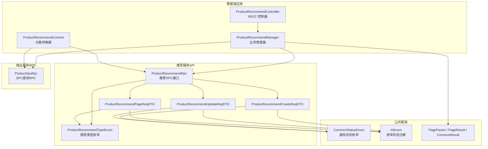
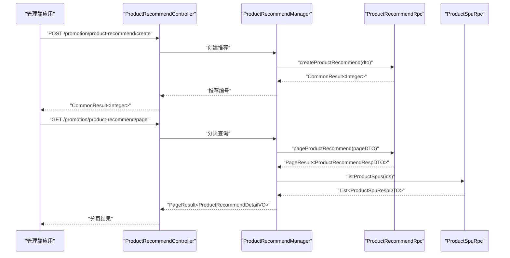
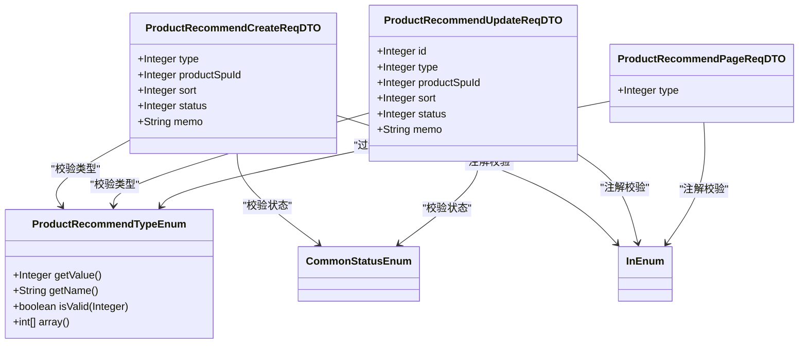
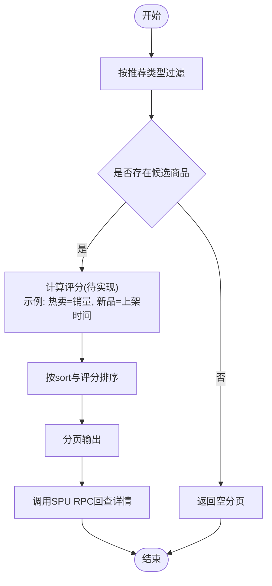
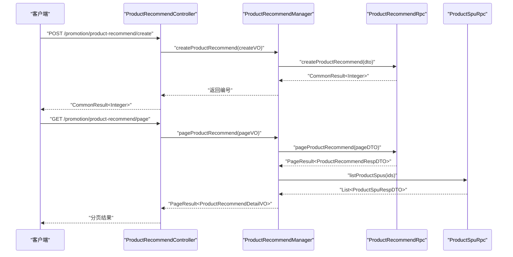
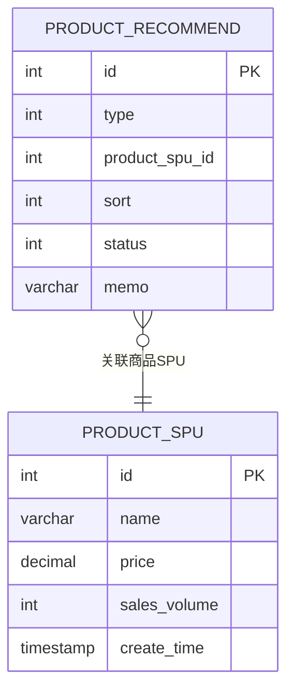
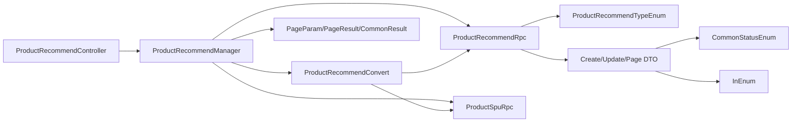

# 商品推荐系统

<cite>
**本文引用的文件**
- [ProductRecommendTypeEnum.java](file://promotion-service-project/promotion-service-api/src/main/java/cn/iocoder/mall/promotion/api/enums/recommend/ProductRecommendTypeEnum.java)
- [ProductRecommendRpc.java](file://promotion-service-project/promotion-service-api/src/main/java/cn/iocoder/mall/promotion/api/rpc/recommend/ProductRecommendRpc.java)
- [ProductRecommendCreateReqDTO.java](file://promotion-service-project/promotion-service-api/src/main/java/cn/iocoder/mall/promotion/api/rpc/recommend/dto/ProductRecommendCreateReqDTO.java)
- [ProductRecommendUpdateReqDTO.java](file://promotion-service-project/promotion-service-api/src/main/java/cn/iocoder/mall/promotion/api/rpc/recommend/dto/ProductRecommendUpdateReqDTO.java)
- [ProductRecommendPageReqDTO.java](file://promotion-service-project/promotion-service-api/src/main/java/cn/iocoder/mall/promotion/api/rpc/recommend/dto/ProductRecommendPageReqDTO.java)
- [ProductRecommendController.java](file://management-web-app/src/main/java/cn/iocoder/mall/managementweb/controller/promotion/recommend/ProductRecommendController.java)
- [ProductRecommendManager.java](file://management-web-app/src/main/java/cn/iocoder/mall/managementweb/manager/promotion/recommend/ProductRecommendManager.java)
- [ProductRecommendConvert.java](file://management-web-app/src/main/java/cn/iocoder/mall/managementweb/convert/promotion/ProductRecommendConvert.java)
- [ProductSpuRpc.java](file://product-service-project/product-service-api/src/main/java/cn/iocoder/mall/productservice/rpc/spu/ProductSpuRpc.java)
- [CommonStatusEnum.java](file://common/common-framework/src/main/java/cn/iocoder/common/framework/enums/CommonStatusEnum.java)
- [InEnum.java](file://common/common-framework/src/main/java/cn/iocoder/common/framework/validator/InEnum.java)
- [PageParam.java](file://common/common-framework/src/main/java/cn/iocoder/common/framework/vo/PageParam.java)
- [PageResult.java](file://common/common-framework/src/main/java/cn/iocoder/common/framework/vo/PageResult.java)
- [CommonResult.java](file://common/common-framework/src/main/java/cn/iocoder/common/framework/vo/CommonResult.java)
- [DubboReference.java](file://common/mall-spring-boot-starter-dubbo/src/main/java/cn/iocoder/mall/dubbo/core/filter/DubboReference.java)
</cite>

## 目录
1. [引言](#引言)
2. [项目结构](#项目结构)
3. [核心组件](#核心组件)
4. [架构总览](#架构总览)
5. [详细组件分析](#详细组件分析)
6. [依赖关系分析](#依赖关系分析)
7. [性能考虑](#性能考虑)
8. [故障排查指南](#故障排查指南)
9. [结论](#结论)
10. [附录](#附录)

## 引言
本技术文档围绕商品推荐系统展开，聚焦于推荐算法策略（协同过滤、内容推荐、热门推荐、个性化推荐）、数据模型（用户画像、商品特征、行为日志）、推荐规则配置机制（推荐类型、权重、过滤条件）、推荐结果生成流程（候选筛选、评分计算、排序输出）、性能优化（缓存、预计算、增量更新）、效果评估与A/B测试方案，以及监控告警与异常处理机制。当前仓库中已实现推荐类型的枚举定义、RPC接口与管理端控制器/管理器/转换层，但未包含具体的推荐算法实现与实时行为日志处理逻辑。本文在不虚构现有实现的前提下，基于现有代码结构进行系统化梳理，并给出可落地的扩展建议。

## 项目结构
推荐系统相关模块主要分布在以下位置：
- 推荐服务API：定义推荐类型枚举、RPC接口与请求/响应DTO
- 管理端应用：提供推荐管理的Web控制器、管理器与对象转换层
- 公共框架：提供通用枚举、校验注解、分页与返回封装等基础设施
- 商品服务RPC：提供SPU详情查询能力，用于推荐结果拼装

图表来源
- [ProductRecommendController.java:1-61](file://management-web-app/src/main/java/cn/iocoder/mall/managementweb/controller/promotion/recommend/ProductRecommendController.java#L1-L61)
- [ProductRecommendManager.java:1-92](file://management-web-app/src/main/java/cn/iocoder/mall/managementweb/manager/promotion/recommend/ProductRecommendManager.java#L1-L92)
- [ProductRecommendConvert.java:1-32](file://management-web-app/src/main/java/cn/iocoder/mall/managementweb/convert/promotion/ProductRecommendConvert.java#L1-L32)
- [ProductRecommendRpc.java:1-53](file://promotion-service-project/promotion-service-api/src/main/java/cn/iocoder/mall/promotion/api/rpc/recommend/ProductRecommendRpc.java#L1-L53)
- [ProductRecommendTypeEnum.java:1-54](file://promotion-service-project/promotion-service-api/src/main/java/cn/iocoder/mall/promotion/api/enums/recommend/ProductRecommendTypeEnum.java#L1-L54)
- [ProductRecommendCreateReqDTO.java:1-49](file://promotion-service-project/promotion-service-api/src/main/java/cn/iocoder/mall/promotion/api/rpc/recommend/dto/ProductRecommendCreateReqDTO.java#L1-L49)
- [ProductRecommendUpdateReqDTO.java:1-54](file://promotion-service-project/promotion-service-api/src/main/java/cn/iocoder/mall/promotion/api/rpc/recommend/dto/ProductRecommendUpdateReqDTO.java#L1-L54)
- [ProductRecommendPageReqDTO.java:1-25](file://promotion-service-project/promotion-service-api/src/main/java/cn/iocoder/mall/promotion/api/rpc/recommend/dto/ProductRecommendPageReqDTO.java#L1-L25)
- [CommonStatusEnum.java](file://common/common-framework/src/main/java/cn/iocoder/common/framework/enums/CommonStatusEnum.java)
- [InEnum.java](file://common/common-framework/src/main/java/cn/iocoder/common/framework/validator/InEnum.java)
- [PageParam.java](file://common/common-framework/src/main/java/cn/iocoder/common/framework/vo/PageParam.java)
- [PageResult.java](file://common/common-framework/src/main/java/cn/iocoder/common/framework/vo/PageResult.java)
- [CommonResult.java](file://common/common-framework/src/main/java/cn/iocoder/common/framework/vo/CommonResult.java)
- [ProductSpuRpc.java](file://product-service-project/product-service-api/src/main/java/cn/iocoder/mall/productservice/rpc/spu/ProductSpuRpc.java)

章节来源
- [ProductRecommendController.java:1-61](file://management-web-app/src/main/java/cn/iocoder/mall/managementweb/controller/promotion/recommend/ProductRecommendController.java#L1-L61)
- [ProductRecommendManager.java:1-92](file://management-web-app/src/main/java/cn/iocoder/mall/managementweb/manager/promotion/recommend/ProductRecommendManager.java#L1-L92)
- [ProductRecommendConvert.java:1-32](file://management-web-app/src/main/java/cn/iocoder/mall/managementweb/convert/promotion/ProductRecommendConvert.java#L1-L32)
- [ProductRecommendRpc.java:1-53](file://promotion-service-project/promotion-service-api/src/main/java/cn/iocoder/mall/promotion/api/rpc/recommend/ProductRecommendRpc.java#L1-L53)
- [ProductRecommendTypeEnum.java:1-54](file://promotion-service-project/promotion-service-api/src/main/java/cn/iocoder/mall/promotion/api/enums/recommend/ProductRecommendTypeEnum.java#L1-L54)
- [ProductRecommendCreateReqDTO.java:1-49](file://promotion-service-project/promotion-service-api/src/main/java/cn/iocoder/mall/promotion/api/rpc/recommend/dto/ProductRecommendCreateReqDTO.java#L1-L49)
- [ProductRecommendUpdateReqDTO.java:1-54](file://promotion-service-project/promotion-service-api/src/main/java/cn/iocoder/mall/promotion/api/rpc/recommend/dto/ProductRecommendUpdateReqDTO.java#L1-L54)
- [ProductRecommendPageReqDTO.java:1-25](file://promotion-service-project/promotion-service-api/src/main/java/cn/iocoder/mall/promotion/api/rpc/recommend/dto/ProductRecommendPageReqDTO.java#L1-L25)
- [CommonStatusEnum.java](file://common/common-framework/src/main/java/cn/iocoder/common/framework/enums/CommonStatusEnum.java)
- [InEnum.java](file://common/common-framework/src/main/java/cn/iocoder/common/framework/validator/InEnum.java)
- [PageParam.java](file://common/common-framework/src/main/java/cn/iocoder/common/framework/vo/PageParam.java)
- [PageResult.java](file://common/common-framework/src/main/java/cn/iocoder/common/framework/vo/PageResult.java)
- [CommonResult.java](file://common/common-framework/src/main/java/cn/iocoder/common/framework/vo/CommonResult.java)
- [ProductSpuRpc.java](file://product-service-project/product-service-api/src/main/java/cn/iocoder/mall/productservice/rpc/spu/ProductSpuRpc.java)

## 核心组件
- 推荐类型枚举：定义“热卖推荐”“新品推荐”等类型，供创建/更新/分页查询时进行校验与过滤
- RPC接口：定义创建、更新、删除、列表与分页查询等能力，作为服务间通信契约
- DTO：封装创建、更新、分页请求的数据结构，含必填字段与范围校验
- 管理端控制器：对外暴露REST接口，完成入参校验与调用管理器
- 管理器：编排RPC调用与商品SPU信息拼装，负责错误检查与结果转换
- 转换器：使用MapStruct进行VO/DTO与RPC层对象之间的映射
- 商品SPU RPC：用于将推荐结果中的SPU ID回查为SPU详情，丰富展示信息

章节来源
- [ProductRecommendTypeEnum.java:10-51](file://promotion-service-project/promotion-service-api/src/main/java/cn/iocoder/mall/promotion/api/enums/recommend/ProductRecommendTypeEnum.java#L10-L51)
- [ProductRecommendRpc.java:12-51](file://promotion-service-project/promotion-service-api/src/main/java/cn/iocoder/mall/promotion/api/rpc/recommend/ProductRecommendRpc.java#L12-L51)
- [ProductRecommendCreateReqDTO.java:18-46](file://promotion-service-project/promotion-service-api/src/main/java/cn/iocoder/mall/promotion/api/rpc/recommend/dto/ProductRecommendCreateReqDTO.java#L18-L46)
- [ProductRecommendUpdateReqDTO.java:18-51](file://promotion-service-project/promotion-service-api/src/main/java/cn/iocoder/mall/promotion/api/rpc/recommend/dto/ProductRecommendUpdateReqDTO.java#L18-L51)
- [ProductRecommendPageReqDTO.java:16-23](file://promotion-service-project/promotion-service-api/src/main/java/cn/iocoder/mall/promotion/api/rpc/recommend/dto/ProductRecommendPageReqDTO.java#L16-L23)
- [ProductRecommendController.java:24-58](file://management-web-app/src/main/java/cn/iocoder/mall/managementweb/controller/promotion/recommend/ProductRecommendController.java#L24-L58)
- [ProductRecommendManager.java:25-89](file://management-web-app/src/main/java/cn/iocoder/mall/managementweb/manager/promotion/recommend/ProductRecommendManager.java#L25-L89)
- [ProductRecommendConvert.java:16-31](file://management-web-app/src/main/java/cn/iocoder/mall/managementweb/convert/promotion/ProductRecommendConvert.java#L16-L31)
- [ProductSpuRpc.java](file://product-service-project/product-service-api/src/main/java/cn/iocoder/mall/productservice/rpc/spu/ProductSpuRpc.java)

## 架构总览
推荐系统采用“管理端应用 + 推荐服务API + 商品服务RPC”的分层架构。管理端通过Dubbo远程调用推荐服务RPC接口，再由推荐服务内部协调存储与计算；同时，管理端在返回分页结果时，会额外调用商品SPU RPC以拼装SPU详情，提升前端展示体验。

图表来源
- [ProductRecommendController.java:33-58](file://management-web-app/src/main/java/cn/iocoder/mall/managementweb/controller/promotion/recommend/ProductRecommendController.java#L33-L58)
- [ProductRecommendManager.java:40-89](file://management-web-app/src/main/java/cn/iocoder/mall/managementweb/manager/promotion/recommend/ProductRecommendManager.java#L40-L89)
- [ProductRecommendRpc.java:20-50](file://promotion-service-project/promotion-service-api/src/main/java/cn/iocoder/mall/promotion/api/rpc/recommend/ProductRecommendRpc.java#L20-L50)
- [ProductSpuRpc.java](file://product-service-project/product-service-api/src/main/java/cn/iocoder/mall/productservice/rpc/spu/ProductSpuRpc.java)

## 详细组件分析

### 组件一：推荐类型与规则配置
- 推荐类型：通过枚举限定“热卖推荐”“新品推荐”，并提供isValid方法与数组值，便于批量校验与过滤
- 规则配置要点：
  - 推荐类型：InEnum校验，确保仅允许枚举内值
  - 商品编号：非空校验
  - 排序：非空校验，用于结果排序
  - 状态：使用通用状态枚举，保证状态一致性
  - 备注：长度限制，避免冗余信息

图表来源
- [ProductRecommendTypeEnum.java:10-51](file://promotion-service-project/promotion-service-api/src/main/java/cn/iocoder/mall/promotion/api/enums/recommend/ProductRecommendTypeEnum.java#L10-L51)
- [ProductRecommendCreateReqDTO.java:18-46](file://promotion-service-project/promotion-service-api/src/main/java/cn/iocoder/mall/promotion/api/rpc/recommend/dto/ProductRecommendCreateReqDTO.java#L18-L46)
- [ProductRecommendUpdateReqDTO.java:18-51](file://promotion-service-project/promotion-service-api/src/main/java/cn/iocoder/mall/promotion/api/rpc/recommend/dto/ProductRecommendUpdateReqDTO.java#L18-L51)
- [ProductRecommendPageReqDTO.java:16-23](file://promotion-service-project/promotion-service-api/src/main/java/cn/iocoder/mall/promotion/api/rpc/recommend/dto/ProductRecommendPageReqDTO.java#L16-L23)
- [CommonStatusEnum.java](file://common/common-framework/src/main/java/cn/iocoder/common/framework/enums/CommonStatusEnum.java)
- [InEnum.java](file://common/common-framework/src/main/java/cn/iocoder/common/framework/validator/InEnum.java)

章节来源
- [ProductRecommendTypeEnum.java:10-51](file://promotion-service-project/promotion-service-api/src/main/java/cn/iocoder/mall/promotion/api/enums/recommend/ProductRecommendTypeEnum.java#L10-L51)
- [ProductRecommendCreateReqDTO.java:18-46](file://promotion-service-project/promotion-service-api/src/main/java/cn/iocoder/mall/promotion/api/rpc/recommend/dto/ProductRecommendCreateReqDTO.java#L18-L46)
- [ProductRecommendUpdateReqDTO.java:18-51](file://promotion-service-project/promotion-service-api/src/main/java/cn/iocoder/mall/promotion/api/rpc/recommend/dto/ProductRecommendUpdateReqDTO.java#L18-L51)
- [ProductRecommendPageReqDTO.java:16-23](file://promotion-service-project/promotion-service-api/src/main/java/cn/iocoder/mall/promotion/api/rpc/recommend/dto/ProductRecommendPageReqDTO.java#L16-L23)
- [CommonStatusEnum.java](file://common/common-framework/src/main/java/cn/iocoder/common/framework/enums/CommonStatusEnum.java)
- [InEnum.java](file://common/common-framework/src/main/java/cn/iocoder/common/framework/validator/InEnum.java)

### 组件二：推荐结果生成流程
- 候选商品筛选：根据推荐类型进行过滤
- 评分计算：当前仓库未提供具体评分实现，可在推荐服务内部按“热卖推荐”按销量、“新品推荐”按上架时间等策略打分
- 排序输出：依据sort字段与评分综合排序，返回分页结果
- 结果拼装：管理端在获取推荐分页后，调用SPU RPC回查SPU详情，丰富展示字段

图表来源
- [ProductRecommendPageReqDTO.java:16-23](file://promotion-service-project/promotion-service-api/src/main/java/cn/iocoder/mall/promotion/api/rpc/recommend/dto/ProductRecommendPageReqDTO.java#L16-L23)
- [ProductRecommendManager.java:74-89](file://management-web-app/src/main/java/cn/iocoder/mall/managementweb/manager/promotion/recommend/ProductRecommendManager.java#L74-L89)

章节来源
- [ProductRecommendPageReqDTO.java:16-23](file://promotion-service-project/promotion-service-api/src/main/java/cn/iocoder/mall/promotion/api/rpc/recommend/dto/ProductRecommendPageReqDTO.java#L16-L23)
- [ProductRecommendManager.java:74-89](file://management-web-app/src/main/java/cn/iocoder/mall/managementweb/manager/promotion/recommend/ProductRecommendManager.java#L74-L89)

### 组件三：管理端控制器与管理器
- 控制器：提供创建、更新、删除、分页查询接口，统一返回CommonResult
- 管理器：编排RPC调用，对返回结果进行错误检查；在分页场景下，额外调用SPU RPC进行详情拼装

图表来源
- [ProductRecommendController.java:33-58](file://management-web-app/src/main/java/cn/iocoder/mall/managementweb/controller/promotion/recommend/ProductRecommendController.java#L33-L58)
- [ProductRecommendManager.java:40-89](file://management-web-app/src/main/java/cn/iocoder/mall/managementweb/manager/promotion/recommend/ProductRecommendManager.java#L40-L89)
- [ProductRecommendRpc.java:20-50](file://promotion-service-project/promotion-service-api/src/main/java/cn/iocoder/mall/promotion/api/rpc/recommend/ProductRecommendRpc.java#L20-L50)
- [ProductSpuRpc.java](file://product-service-project/product-service-api/src/main/java/cn/iocoder/mall/productservice/rpc/spu/ProductSpuRpc.java)

章节来源
- [ProductRecommendController.java:24-58](file://management-web-app/src/main/java/cn/iocoder/mall/managementweb/controller/promotion/recommend/ProductRecommendController.java#L24-L58)
- [ProductRecommendManager.java:25-89](file://management-web-app/src/main/java/cn/iocoder/mall/managementweb/manager/promotion/recommend/ProductRecommendManager.java#L25-L89)

### 组件四：数据模型与实体关系
- 推荐记录：包含推荐类型、商品SPU编号、排序、状态、备注等字段
- 商品SPU：用于丰富推荐结果的展示信息
- 分页与返回：统一使用PageParam/PageResult/CommonResult进行分页与返回封装

图表来源
- [ProductRecommendCreateReqDTO.java:18-46](file://promotion-service-project/promotion-service-api/src/main/java/cn/iocoder/mall/promotion/api/rpc/recommend/dto/ProductRecommendCreateReqDTO.java#L18-L46)
- [ProductRecommendUpdateReqDTO.java:18-51](file://promotion-service-project/promotion-service-api/src/main/java/cn/iocoder/mall/promotion/api/rpc/recommend/dto/ProductRecommendUpdateReqDTO.java#L18-L51)
- [ProductRecommendPageReqDTO.java:16-23](file://promotion-service-project/promotion-service-api/src/main/java/cn/iocoder/mall/promotion/api/rpc/recommend/dto/ProductRecommendPageReqDTO.java#L16-L23)

章节来源
- [ProductRecommendCreateReqDTO.java:18-46](file://promotion-service-project/promotion-service-api/src/main/java/cn/iocoder/mall/promotion/api/rpc/recommend/dto/ProductRecommendCreateReqDTO.java#L18-L46)
- [ProductRecommendUpdateReqDTO.java:18-51](file://promotion-service-project/promotion-service-api/src/main/java/cn/iocoder/mall/promotion/api/rpc/recommend/dto/ProductRecommendUpdateReqDTO.java#L18-L51)
- [ProductRecommendPageReqDTO.java:16-23](file://promotion-service-project/promotion-service-api/src/main/java/cn/iocoder/mall/promotion/api/rpc/recommend/dto/ProductRecommendPageReqDTO.java#L16-L23)

## 依赖关系分析
- 控制器依赖管理器；管理器依赖推荐RPC与商品SPU RPC；转换器负责对象映射；DTO依赖枚举与校验注解；返回封装依赖公共框架
- 管理器通过DubboReference进行RPC注入，版本号从配置占位符加载

图表来源
- [ProductRecommendController.java:24-58](file://management-web-app/src/main/java/cn/iocoder/mall/managementweb/controller/promotion/recommend/ProductRecommendController.java#L24-L58)
- [ProductRecommendManager.java:25-89](file://management-web-app/src/main/java/cn/iocoder/mall/managementweb/manager/promotion/recommend/ProductRecommendManager.java#L25-L89)
- [ProductRecommendConvert.java:16-31](file://management-web-app/src/main/java/cn/iocoder/mall/managementweb/convert/promotion/ProductRecommendConvert.java#L16-L31)
- [ProductRecommendRpc.java:12-51](file://promotion-service-project/promotion-service-api/src/main/java/cn/iocoder/mall/promotion/api/rpc/recommend/ProductRecommendRpc.java#L12-L51)
- [ProductRecommendTypeEnum.java:10-51](file://promotion-service-project/promotion-service-api/src/main/java/cn/iocoder/mall/promotion/api/enums/recommend/ProductRecommendTypeEnum.java#L10-L51)
- [ProductRecommendCreateReqDTO.java:18-46](file://promotion-service-project/promotion-service-api/src/main/java/cn/iocoder/mall/promotion/api/rpc/recommend/dto/ProductRecommendCreateReqDTO.java#L18-L46)
- [ProductRecommendUpdateReqDTO.java:18-51](file://promotion-service-project/promotion-service-api/src/main/java/cn/iocoder/mall/promotion/api/rpc/recommend/dto/ProductRecommendUpdateReqDTO.java#L18-L51)
- [ProductRecommendPageReqDTO.java:16-23](file://promotion-service-project/promotion-service-api/src/main/java/cn/iocoder/mall/promotion/api/rpc/recommend/dto/ProductRecommendPageReqDTO.java#L16-L23)
- [CommonStatusEnum.java](file://common/common-framework/src/main/java/cn/iocoder/common/framework/enums/CommonStatusEnum.java)
- [InEnum.java](file://common/common-framework/src/main/java/cn/iocoder/common/framework/validator/InEnum.java)
- [PageParam.java](file://common/common-framework/src/main/java/cn/iocoder/common/framework/vo/PageParam.java)
- [PageResult.java](file://common/common-framework/src/main/java/cn/iocoder/common/framework/vo/PageResult.java)
- [CommonResult.java](file://common/common-framework/src/main/java/cn/iocoder/common/framework/vo/CommonResult.java)

章节来源
- [ProductRecommendController.java:24-58](file://management-web-app/src/main/java/cn/iocoder/mall/managementweb/controller/promotion/recommend/ProductRecommendController.java#L24-L58)
- [ProductRecommendManager.java:25-89](file://management-web-app/src/main/java/cn/iocoder/mall/managementweb/manager/promotion/recommend/ProductRecommendManager.java#L25-L89)
- [ProductRecommendConvert.java:16-31](file://management-web-app/src/main/java/cn/iocoder/mall/managementweb/convert/promotion/ProductRecommendConvert.java#L16-L31)
- [ProductRecommendRpc.java:12-51](file://promotion-service-project/promotion-service-api/src/main/java/cn/iocoder/mall/promotion/api/rpc/recommend/ProductRecommendRpc.java#L12-L51)
- [ProductRecommendTypeEnum.java:10-51](file://promotion-service-project/promotion-service-api/src/main/java/cn/iocoder/mall/promotion/api/enums/recommend/ProductRecommendTypeEnum.java#L10-L51)
- [ProductRecommendCreateReqDTO.java:18-46](file://promotion-service-project/promotion-service-api/src/main/java/cn/iocoder/mall/promotion/api/rpc/recommend/dto/ProductRecommendCreateReqDTO.java#L18-L46)
- [ProductRecommendUpdateReqDTO.java:18-51](file://promotion-service-project/promotion-service-api/src/main/java/cn/iocoder/mall/promotion/api/rpc/recommend/dto/ProductRecommendUpdateReqDTO.java#L18-L51)
- [ProductRecommendPageReqDTO.java:16-23](file://promotion-service-project/promotion-service-api/src/main/java/cn/iocoder/mall/promotion/api/rpc/recommend/dto/ProductRecommendPageReqDTO.java#L16-L23)
- [CommonStatusEnum.java](file://common/common-framework/src/main/java/cn/iocoder/common/framework/enums/CommonStatusEnum.java)
- [InEnum.java](file://common/common-framework/src/main/java/cn/iocoder/common/framework/validator/InEnum.java)
- [PageParam.java](file://common/common-framework/src/main/java/cn/iocoder/common/framework/vo/PageParam.java)
- [PageResult.java](file://common/common-framework/src/main/java/cn/iocoder/common/framework/vo/PageResult.java)
- [CommonResult.java](file://common/common-framework/src/main/java/cn/iocoder/common/framework/vo/CommonResult.java)

## 性能考虑
- 缓存策略
  - 推荐分页结果缓存：对热门类型或固定时间段内的分页结果进行缓存，降低RPC与数据库压力
  - SPU详情缓存：对SPU详情进行独立缓存，减少重复查询
- 预计算
  - 将“热卖推荐”按销量预聚合，定期刷新；“新品推荐”按上架时间窗口预筛选
- 增量更新
  - 使用消息队列监听销量变化、SPU上下架事件，触发缓存与索引的增量更新
- 并发与限流
  - 对RPC调用增加超时与重试策略，结合限流与熔断保护下游服务
- 数据库优化
  - 为推荐类型、排序、状态建立复合索引，优化分页查询性能

## 故障排查指南
- 错误码与异常
  - 使用公共框架的错误码与异常体系，确保统一的错误返回格式
- RPC调用链路
  - 管理器对RPC返回进行checkError检查，定位失败原因
- 日志与追踪
  - 记录关键请求参数、RPC耗时与异常堆栈，配合分布式追踪进行问题定位
- 健康检查
  - 定期检查推荐服务与SPU服务的可用性，异常时自动告警

章节来源
- [CommonResult.java](file://common/common-framework/src/main/java/cn/iocoder/common/framework/vo/CommonResult.java)
- [ProductRecommendManager.java:41-66](file://management-web-app/src/main/java/cn/iocoder/mall/managementweb/manager/promotion/recommend/ProductRecommendManager.java#L41-L66)

## 结论
当前仓库实现了推荐系统的基础数据结构、RPC接口与管理端控制层，具备良好的扩展性。推荐算法与实时行为日志处理尚未实现，建议在推荐服务内部引入评分与召回策略，并通过缓存、预计算与增量更新提升性能。同时完善监控告警与A/B测试方案，持续优化推荐效果。

## 附录
- 推荐算法策略建议
  - 协同过滤：基于用户行为矩阵，计算相似度并生成偏好
  - 内容推荐：基于商品属性与标签的向量相似度
  - 热门推荐：按销量/浏览次数/收藏数等指标排序
  - 个性化推荐：融合协同过滤与内容推荐，按用户画像加权
- A/B测试方案
  - 将流量按比例分流至不同策略，对比点击率、转化率、GMV等指标
  - 使用统计显著性检验验证差异是否显著