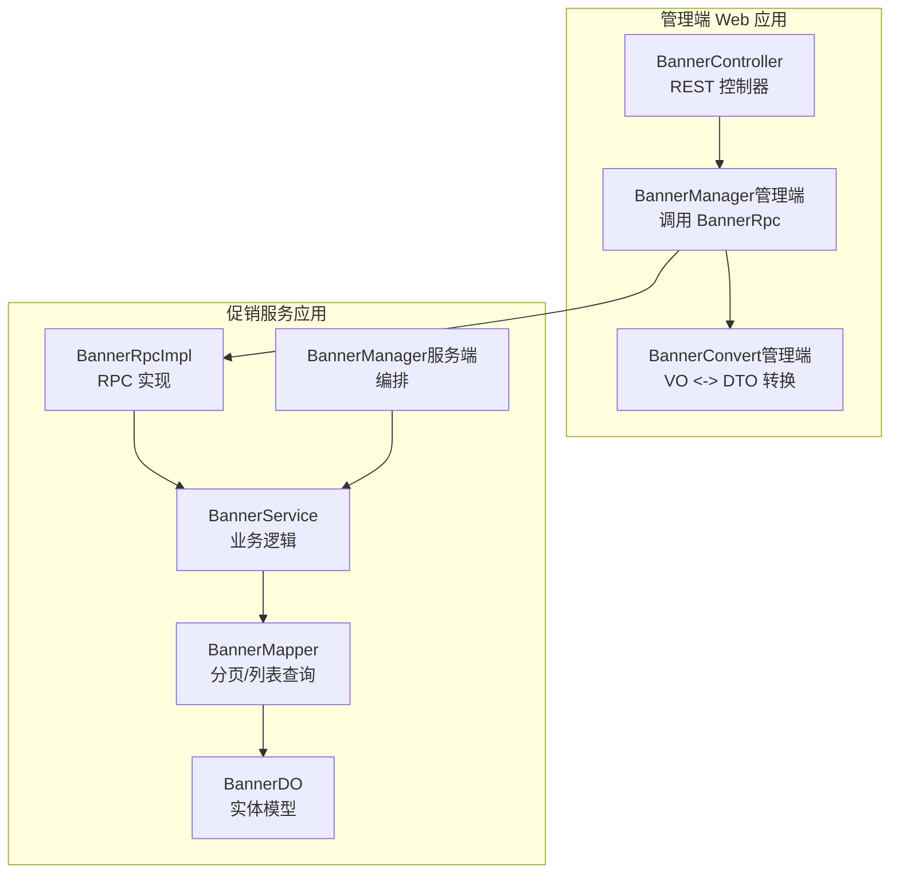
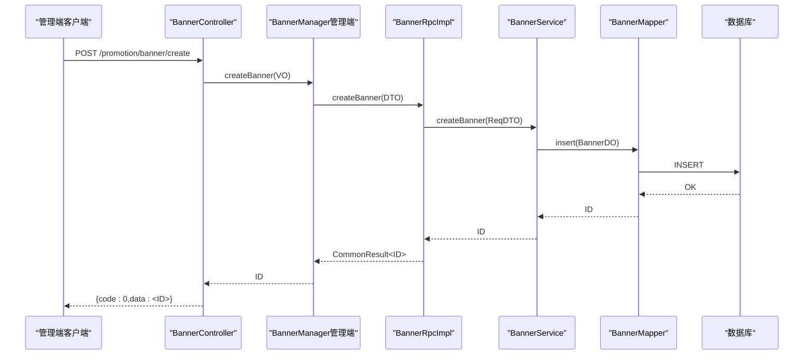
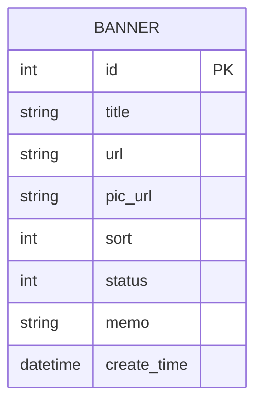
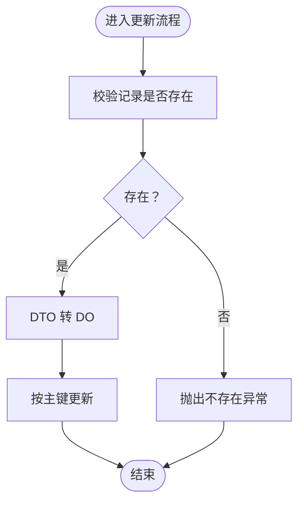
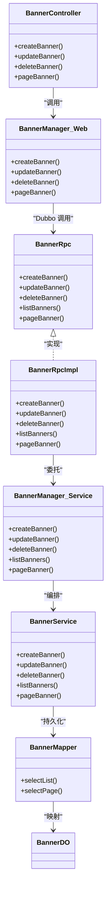

# 横幅广告管理

<cite>
**本文引用的文件**
- [BannerRpc.java](file://promotion-service-project/promotion-service-api/src/main/java/cn/iocoder/mall/promotion/api/rpc/banner/BannerRpc.java)
- [BannerCreateReqDTO.java](file://promotion-service-project/promotion-service-api/src/main/java/cn/iocoder/mall/promotion/api/rpc/banner/dto/BannerCreateReqDTO.java)
- [BannerUpdateReqDTO.java](file://promotion-service-project/promotion-service-api/src/main/java/cn/iocoder/mall/promotion/api/rpc/banner/dto/BannerUpdateReqDTO.java)
- [BannerRespDTO.java](file://promotion-service-project/promotion-service-api/src/main/java/cn/iocoder/mall/promotion/api/rpc/banner/dto/BannerRespDTO.java)
- [BannerService.java](file://promotion-service-project/promotion-service-app/src/main/java/cn/iocoder/mall/promotionservice/service/banner/BannerService.java)
- [BannerManager.java](file://promotion-service-project/promotion-service-app/src/main/java/cn/iocoder/mall/promotionservice/manager/banner/BannerManager.java)
- [BannerRpcImpl.java](file://promotion-service-project/promotion-service-app/src/main/java/cn/iocoder/mall/promotionservice/rpc/banner/BannerRpcImpl.java)
- [BannerMapper.java](file://promotion-service-project/promotion-service-app/src/main/java/cn/iocoder/mall/promotionservice/dal/mysql/mapper/banner/BannerMapper.java)
- [BannerDO.java](file://promotion-service-project/promotion-service-app/src/main/java/cn/iocoder/mall/promotionservice/dal/mysql/dataobject/banner/BannerDO.java)
- [BannerController.java](file://management-web-app/src/main/java/cn/iocoder/mall/managementweb/controller/promotion/brand/BannerController.java)
- [BannerManager.java（管理端）](file://management-web-app/src/main/java/cn/iocoder/mall/managementweb/manager/promotion/brand/BannerManager.java)
- [BannerConvert.java（管理端）](file://management-web-app/src/main/java/cn/iocoder/mall/managementweb/convert/promotion/BannerConvert.java)
- [BannerConvert.java（服务端）](file://promotion-service-project/promotion-service-app/src/main/java/cn/iocoder/mall/promotionservice/convert/banner/BannerConvert.java)
</cite>

## 目录
1. [简介](#简介)
2. [项目结构](#项目结构)
3. [核心组件](#核心组件)
4. [架构总览](#架构总览)
5. [详细组件分析](#详细组件分析)
6. [依赖关系分析](#依赖关系分析)
7. [性能考量](#性能考量)
8. [故障排查指南](#故障排查指南)
9. [结论](#结论)
10. [附录：配置示例与最佳实践](#附录配置示例与最佳实践)

## 简介
本技术文档围绕“横幅广告管理”能力进行系统化梳理，覆盖广告位创建、图片上传、链接配置、展示顺序、投放策略（时间/区域/人群）、展示逻辑（轮播、点击统计、曝光监测）、审核流程（内容/合规/风控）、统计分析（点击率、转化率、ROI）以及安全防护与防刷机制。当前代码库已实现管理端的横幅广告增删改查与分页能力，并通过 RPC 层暴露接口；展示侧与效果追踪（点击、曝光、转化）尚未在现有代码中直接体现，需结合业务扩展实现。

## 项目结构
横幅广告相关模块采用“管理端 Web 应用 + 促销服务应用”的分层设计：
- 管理端 Web 应用负责权限校验、参数校验与调用促销服务 RPC；
- 促销服务应用负责业务处理、数据持久化与 RPC 实现；
- API 定义位于 API 工程，作为服务间契约。

图表来源
- [BannerController.java:25-66](file://management-web-app/src/main/java/cn/iocoder/mall/managementweb/controller/promotion/brand/BannerController.java#L25-L66)
- [BannerManager.java（管理端）:18-69](file://management-web-app/src/main/java/cn/iocoder/mall/managementweb/manager/promotion/brand/BannerManager.java#L18-L69)
- [BannerConvert.java（管理端）:15-29](file://management-web-app/src/main/java/cn/iocoder/mall/managementweb/convert/promotion/BannerConvert.java#L15-L29)
- [BannerRpcImpl.java:15-49](file://promotion-service-project/promotion-service-app/src/main/java/cn/iocoder/mall/promotionservice/rpc/banner/BannerRpcImpl.java#L15-L49)
- [BannerService.java:20-93](file://promotion-service-project/promotion-service-app/src/main/java/cn/iocoder/mall/promotionservice/service/banner/BannerService.java#L20-L93)
- [BannerManager.java（服务端）:12-43](file://promotion-service-project/promotion-service-app/src/main/java/cn/iocoder/mall/promotionservice/manager/banner/BannerManager.java#L12-L43)
- [BannerMapper.java:14-27](file://promotion-service-project/promotion-service-app/src/main/java/cn/iocoder/mall/promotionservice/dal/mysql/mapper/banner/BannerMapper.java#L14-L27)
- [BannerDO.java:9-52](file://promotion-service-project/promotion-service-app/src/main/java/cn/iocoder/mall/promotionservice/dal/mysql/dataobject/banner/BannerDO.java#L9-L52)

章节来源
- [BannerController.java:25-66](file://management-web-app/src/main/java/cn/iocoder/mall/managementweb/controller/promotion/brand/BannerController.java#L25-L66)
- [BannerManager.java（管理端）:18-69](file://management-web-app/src/main/java/cn/iocoder/mall/managementweb/manager/promotion/brand/BannerManager.java#L18-L69)
- [BannerRpcImpl.java:15-49](file://promotion-service-project/promotion-service-app/src/main/java/cn/iocoder/mall/promotionservice/rpc/banner/BannerRpcImpl.java#L15-L49)
- [BannerService.java:20-93](file://promotion-service-project/promotion-service-app/src/main/java/cn/iocoder/mall/promotionservice/service/banner/BannerService.java#L20-L93)
- [BannerMapper.java:14-27](file://promotion-service-project/promotion-service-app/src/main/java/cn/iocoder/mall/promotionservice/dal/mysql/mapper/banner/BannerMapper.java#L14-L27)
- [BannerDO.java:9-52](file://promotion-service-project/promotion-service-app/src/main/java/cn/iocoder/mall/promotionservice/dal/mysql/dataobject/banner/BannerDO.java#L9-L52)

## 核心组件
- 管理端控制器：提供创建、更新、删除、分页查询等接口，配合权限注解进行访问控制。
- 管理端管理器：封装 RPC 调用，统一错误处理与数据转换。
- RPC 接口与实现：定义横幅广告的远程方法并提供具体实现。
- 服务层：执行业务逻辑（新增/更新/删除/分页/列表），并进行参数校验与异常抛出。
- 数据访问层：基于 MyBatis-Plus 提供分页与列表查询能力。
- 数据对象：映射数据库表结构，承载字段与注释说明。

章节来源
- [BannerController.java:25-66](file://management-web-app/src/main/java/cn/iocoder/mall/managementweb/controller/promotion/brand/BannerController.java#L25-L66)
- [BannerManager.java（管理端）:18-69](file://management-web-app/src/main/java/cn/iocoder/mall/managementweb/manager/promotion/brand/BannerManager.java#L18-L69)
- [BannerRpc.java:12-52](file://promotion-service-project/promotion-service-api/src/main/java/cn/iocoder/mall/promotion/api/rpc/banner/BannerRpc.java#L12-L52)
- [BannerRpcImpl.java:15-49](file://promotion-service-project/promotion-service-app/src/main/java/cn/iocoder/mall/promotionservice/rpc/banner/BannerRpcImpl.java#L15-L49)
- [BannerService.java:20-93](file://promotion-service-project/promotion-service-app/src/main/java/cn/iocoder/mall/promotionservice/service/banner/BannerService.java#L20-L93)
- [BannerMapper.java:14-27](file://promotion-service-project/promotion-service-app/src/main/java/cn/iocoder/mall/promotionservice/dal/mysql/mapper/banner/BannerMapper.java#L14-L27)
- [BannerDO.java:9-52](file://promotion-service-project/promotion-service-app/src/main/java/cn/iocoder/mall/promotionservice/dal/mysql/dataobject/banner/BannerDO.java#L9-L52)

## 架构总览
下图展示了从管理端发起请求到服务端落库的关键链路，以及各层之间的职责划分。

图表来源
- [BannerController.java:34-39](file://management-web-app/src/main/java/cn/iocoder/mall/managementweb/controller/promotion/brand/BannerController.java#L34-L39)
- [BannerManager.java（管理端）:30-34](file://management-web-app/src/main/java/cn/iocoder/mall/managementweb/manager/promotion/brand/BannerManager.java#L30-L34)
- [BannerRpcImpl.java:22-24](file://promotion-service-project/promotion-service-app/src/main/java/cn/iocoder/mall/promotionservice/rpc/banner/BannerRpcImpl.java#L22-L24)
- [BannerService.java:55-61](file://promotion-service-project/promotion-service-app/src/main/java/cn/iocoder/mall/promotionservice/service/banner/BannerService.java#L55-L61)
- [BannerMapper.java:14-27](file://promotion-service-project/promotion-service-app/src/main/java/cn/iocoder/mall/promotionservice/dal/mysql/mapper/banner/BannerMapper.java#L14-L27)

## 详细组件分析

### 数据模型与字段说明
横幅广告的数据模型包含标题、跳转链接、图片链接、排序、状态、备注及创建时间等字段，满足基础展示与管理需求。

图表来源
- [BannerDO.java:16-48](file://promotion-service-project/promotion-service-app/src/main/java/cn/iocoder/mall/promotionservice/dal/mysql/dataobject/banner/BannerDO.java#L16-L48)

章节来源
- [BannerDO.java:16-48](file://promotion-service-project/promotion-service-app/src/main/java/cn/iocoder/mall/promotionservice/dal/mysql/dataobject/banner/BannerDO.java#L16-L48)

### 参数校验与请求 DTO
- 创建与更新 DTO 对标题、链接、图片链接、排序、状态、备注等字段进行非空与格式校验，确保输入质量。
- 响应 DTO 用于跨进程传输，包含必要字段与创建时间。

章节来源
- [BannerCreateReqDTO.java:19-58](file://promotion-service-project/promotion-service-api/src/main/java/cn/iocoder/mall/promotion/api/rpc/banner/dto/BannerCreateReqDTO.java#L19-L58)
- [BannerUpdateReqDTO.java:19-63](file://promotion-service-project/promotion-service-api/src/main/java/cn/iocoder/mall/promotion/api/rpc/banner/dto/BannerUpdateReqDTO.java#L19-L63)
- [BannerRespDTO.java:14-49](file://promotion-service-project/promotion-service-api/src/main/java/cn/iocoder/mall/promotion/api/rpc/banner/dto/BannerRespDTO.java#L14-L49)

### 管理端控制器与权限控制
- 提供创建、更新、删除、分页查询接口，并使用权限注解限制访问。
- 统一返回 CommonResult 包装，便于前端消费。

章节来源
- [BannerController.java:25-66](file://management-web-app/src/main/java/cn/iocoder/mall/managementweb/controller/promotion/brand/BannerController.java#L25-L66)

### 管理端管理器与 RPC 调用
- 将 VO 转换为 DTO 后调用 RPC 接口，统一处理错误码并返回数据。
- 支持分页查询结果的 VO <-> DTO 转换。

章节来源
- [BannerManager.java（管理端）:18-69](file://management-web-app/src/main/java/cn/iocoder/mall/managementweb/manager/promotion/brand/BannerManager.java#L18-L69)
- [BannerConvert.java（管理端）:15-29](file://management-web-app/src/main/java/cn/iocoder/mall/managementweb/convert/promotion/BannerConvert.java#L15-L29)

### RPC 接口与实现
- 定义创建、更新、删除、列表、分页等 RPC 方法。
- 实现类将请求转发至服务层，返回通用结果包装。

章节来源
- [BannerRpc.java:12-52](file://promotion-service-project/promotion-service-api/src/main/java/cn/iocoder/mall/promotion/api/rpc/banner/BannerRpc.java#L12-L52)
- [BannerRpcImpl.java:15-49](file://promotion-service-project/promotion-service-app/src/main/java/cn/iocoder/mall/promotionservice/rpc/banner/BannerRpcImpl.java#L15-L49)

### 服务层与业务逻辑
- 列表与分页查询：根据状态与标题模糊匹配进行筛选。
- 新增：插入数据库并返回主键。
- 更新：先校验是否存在，再更新。
- 删除：先校验是否存在，再删除。

图表来源
- [BannerService.java:68-76](file://promotion-service-project/promotion-service-app/src/main/java/cn/iocoder/mall/promotionservice/service/banner/BannerService.java#L68-L76)

章节来源
- [BannerService.java:20-93](file://promotion-service-project/promotion-service-app/src/main/java/cn/iocoder/mall/promotionservice/service/banner/BannerService.java#L20-L93)
- [BannerMapper.java:14-27](file://promotion-service-project/promotion-service-app/src/main/java/cn/iocoder/mall/promotionservice/dal/mysql/mapper/banner/BannerMapper.java#L14-L27)

### 数据访问层与查询策略
- 列表查询：按状态过滤。
- 分页查询：按标题模糊匹配与分页参数组合查询。

章节来源
- [BannerMapper.java:17-24](file://promotion-service-project/promotion-service-app/src/main/java/cn/iocoder/mall/promotionservice/dal/mysql/mapper/banner/BannerMapper.java#L17-L24)

### 类关系图

图表来源
- [BannerController.java:25-66](file://management-web-app/src/main/java/cn/iocoder/mall/managementweb/controller/promotion/brand/BannerController.java#L25-L66)
- [BannerManager.java（管理端）:18-69](file://management-web-app/src/main/java/cn/iocoder/mall/managementweb/manager/promotion/brand/BannerManager.java#L18-L69)
- [BannerRpc.java:12-52](file://promotion-service-project/promotion-service-api/src/main/java/cn/iocoder/mall/promotion/api/rpc/banner/BannerRpc.java#L12-L52)
- [BannerRpcImpl.java:15-49](file://promotion-service-project/promotion-service-app/src/main/java/cn/iocoder/mall/promotionservice/rpc/banner/BannerRpcImpl.java#L15-L49)
- [BannerManager.java（服务端）:12-43](file://promotion-service-project/promotion-service-app/src/main/java/cn/iocoder/mall/promotionservice/manager/banner/BannerManager.java#L12-L43)
- [BannerService.java:20-93](file://promotion-service-project/promotion-service-app/src/main/java/cn/iocoder/mall/promotionservice/service/banner/BannerService.java#L20-L93)
- [BannerMapper.java:14-27](file://promotion-service-project/promotion-service-app/src/main/java/cn/iocoder/mall/promotionservice/dal/mysql/mapper/banner/BannerMapper.java#L14-L27)
- [BannerDO.java:16-48](file://promotion-service-project/promotion-service-app/src/main/java/cn/iocoder/mall/promotionservice/dal/mysql/dataobject/banner/BannerDO.java#L16-L48)

## 依赖关系分析
- 管理端依赖促销服务 API 的 RPC 接口与 DTO，通过 Dubbo 进行远程调用。
- 服务端通过 Mapper 访问数据库，使用 MyBatis-Plus 的分页与条件构造器。
- 转换器贯穿 VO/DTO/DO 的映射，保证数据一致性与可维护性。

图表来源
- [BannerManager.java（管理端）:21-22](file://management-web-app/src/main/java/cn/iocoder/mall/managementweb/manager/promotion/brand/BannerManager.java#L21-L22)
- [BannerRpcImpl.java:19-19](file://promotion-service-project/promotion-service-app/src/main/java/cn/iocoder/mall/promotionservice/rpc/banner/BannerRpcImpl.java#L19-L19)
- [BannerService.java:24-25](file://promotion-service-project/promotion-service-app/src/main/java/cn/iocoder/mall/promotionservice/service/banner/BannerService.java#L24-L25)
- [BannerMapper.java:14-27](file://promotion-service-project/promotion-service-app/src/main/java/cn/iocoder/mall/promotionservice/dal/mysql/mapper/banner/BannerMapper.java#L14-L27)

章节来源
- [BannerManager.java（管理端）:18-69](file://management-web-app/src/main/java/cn/iocoder/mall/managementweb/manager/promotion/brand/BannerManager.java#L18-L69)
- [BannerRpcImpl.java:15-49](file://promotion-service-project/promotion-service-app/src/main/java/cn/iocoder/mall/promotionservice/rpc/banner/BannerRpcImpl.java#L15-L49)
- [BannerService.java:20-93](file://promotion-service-project/promotion-service-app/src/main/java/cn/iocoder/mall/promotionservice/service/banner/BannerService.java#L20-L93)
- [BannerMapper.java:14-27](file://promotion-service-project/promotion-service-app/src/main/java/cn/iocoder/mall/promotionservice/dal/mysql/mapper/banner/BannerMapper.java#L14-L27)

## 性能考量
- 分页查询：通过 MyBatis-Plus 分页插件与条件构造器减少全量扫描，提升大表查询效率。
- 列表查询：按状态过滤，避免无谓的全表检索。
- DTO/DO 映射：使用 MapStruct 减少手动转换开销，提高序列化/反序列化效率。
- RPC 调用：合理设置超时与重试策略，避免阻塞管理端线程池。

## 故障排查指南
- 参数校验失败：检查标题、链接、图片链接长度与格式是否符合要求。
- 记录不存在：更新/删除前会校验是否存在，若失败请确认主键是否正确。
- RPC 调用异常：检查 Dubbo 服务注册与发现、版本号配置与网络连通性。
- 权限不足：确认管理端用户是否具备相应权限点。

章节来源
- [BannerCreateReqDTO.java:24-32](file://promotion-service-project/promotion-service-api/src/main/java/cn/iocoder/mall/promotion/api/rpc/banner/dto/BannerCreateReqDTO.java#L24-L32)
- [BannerUpdateReqDTO.java:35-38](file://promotion-service-project/promotion-service-api/src/main/java/cn/iocoder/mall/promotion/api/rpc/banner/dto/BannerUpdateReqDTO.java#L35-L38)
- [BannerService.java:70-72](file://promotion-service-project/promotion-service-app/src/main/java/cn/iocoder/mall/promotionservice/service/banner/BannerService.java#L70-L72)

## 结论
当前代码库已完整实现横幅广告的管理端 CRUD 与分页能力，具备清晰的分层架构与良好的扩展性。展示侧与效果追踪（点击、曝光、转化）尚未在现有代码中体现，后续可在服务端引入计数与埋点机制，并在管理端补充统计报表与风控策略。

## 附录：配置示例与最佳实践

### 配置示例
- 创建横幅广告
  - 请求路径：POST /promotion/banner/create
  - 必填字段：标题、跳转链接、图片链接、排序、状态
  - 参考路径：[BannerController.java:34-39](file://management-web-app/src/main/java/cn/iocoder/mall/managementweb/controller/promotion/brand/BannerController.java#L34-L39)，[BannerCreateReqDTO.java:19-58](file://promotion-service-project/promotion-service-api/src/main/java/cn/iocoder/mall/promotion/api/rpc/banner/dto/BannerCreateReqDTO.java#L19-L58)
- 更新横幅广告
  - 请求路径：POST /promotion/banner/update
  - 必填字段：编号、标题、跳转链接、图片链接、排序、状态
  - 参考路径：[BannerController.java:41-47](file://management-web-app/src/main/java/cn/iocoder/mall/managementweb/controller/promotion/brand/BannerController.java#L41-L47)，[BannerUpdateReqDTO.java:19-63](file://promotion-service-project/promotion-service-api/src/main/java/cn/iocoder/mall/promotion/api/rpc/banner/dto/BannerUpdateReqDTO.java#L19-L63)
- 删除横幅广告
  - 请求路径：POST /promotion/banner/delete?bannerId=ID
  - 参考路径：[BannerController.java:49-56](file://management-web-app/src/main/java/cn/iocoder/mall/managementweb/controller/promotion/brand/BannerController.java#L49-L56)
- 获取横幅广告分页
  - 请求路径：GET /promotion/banner/page
  - 参考路径：[BannerController.java:58-63](file://management-web-app/src/main/java/cn/iocoder/mall/managementweb/controller/promotion/brand/BannerController.java#L58-L63)

### 投放策略（建议）
- 投放时间：在服务层增加生效/失效时间字段，查询时按时间范围过滤。
- 投放区域：新增区域维度字段或关联表，支持按区域/城市/门店等筛选。
- 目标用户：新增用户标签/等级/性别等维度，结合用户画像进行定向。

### 展示逻辑（建议）
- 轮播机制：在查询时按 sort 升序排列，支持多图轮播。
- 点击统计：在展示侧埋点上报点击事件，服务端记录点击次数与去重规则。
- 曝光监测：在曝光可见时上报曝光事件，结合去重与时间窗口统计有效曝光。

### 审核流程（建议）
- 内容审核：接入第三方内容安全服务，对图片与文案进行检测。
- 合规检查：校验跳转链接域名白名单、图片尺寸与格式规范。
- 风险控制：对高风险行业/敏感词进行拦截，设置人工复审阈值。

### 统计分析（建议）
- 点击率（CTR）= 点击次数 / 曝光次数
- 转化率（CVR）= 成功转化订单数 / 点击次数
- ROI = 总收益 / 广告投入
- 指标采集：按日/小时聚合，保留近 90 天数据以支持趋势分析。

### 安全防护与防刷（建议）
- 图片上传：限制文件类型与大小，存储于独立 OSS 并生成带签名访问链接。
- 链接校验：仅允许白名单域名跳转，对短链进行解析与二次校验。
- 防刷策略：对同一 IP/设备/账号的高频请求进行限流与验证码校验。
- 日志审计：记录所有变更与异常行为，支持回溯与取证。