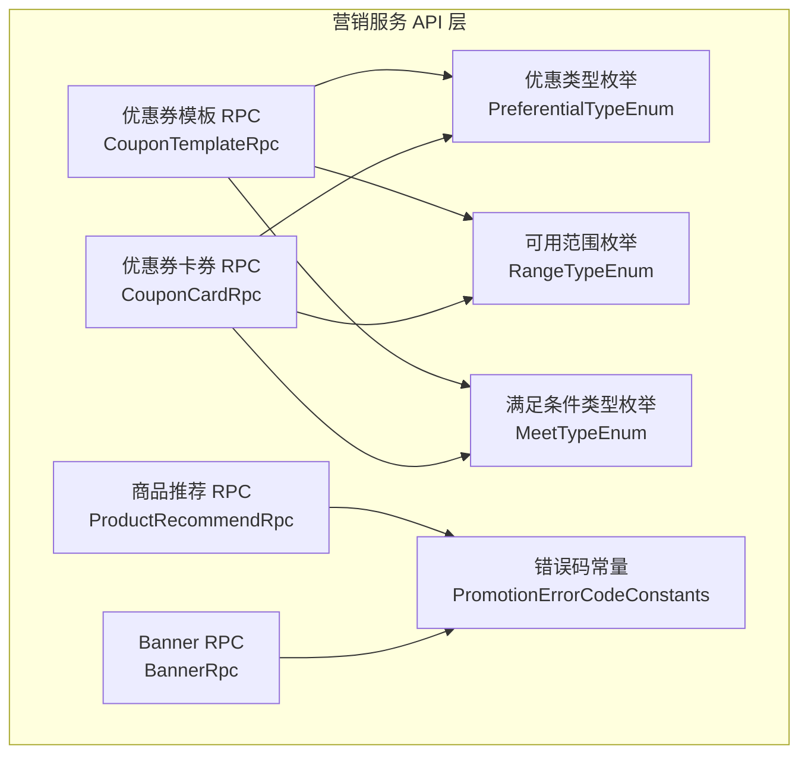
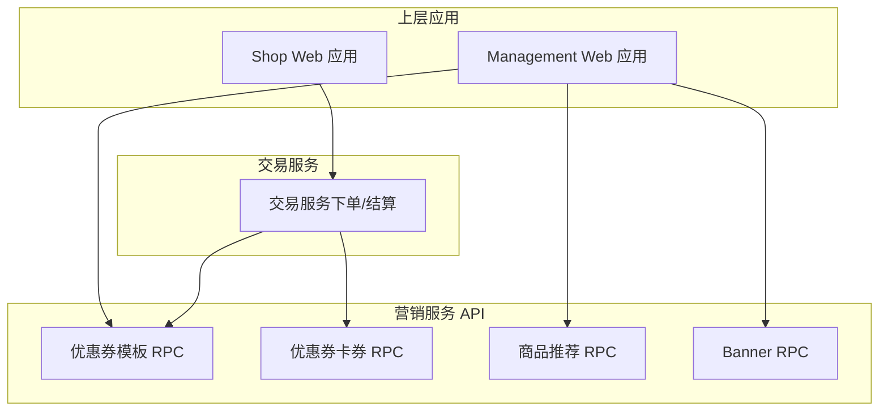
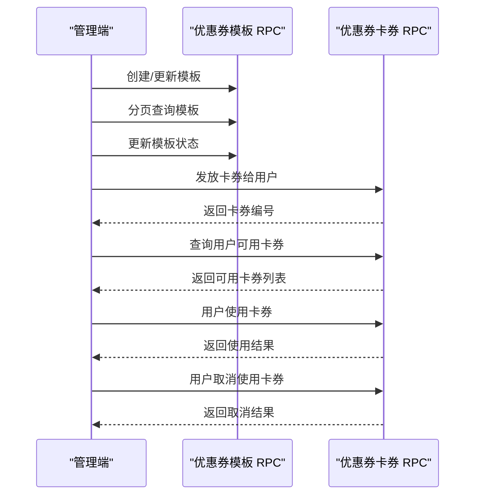
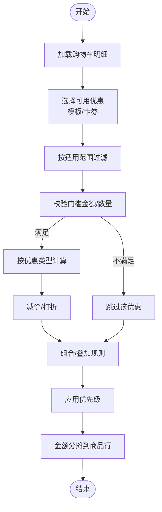
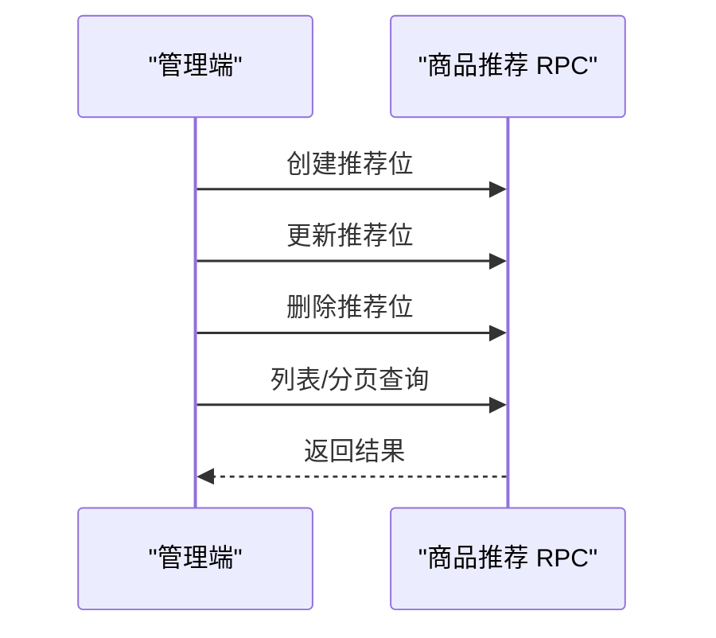
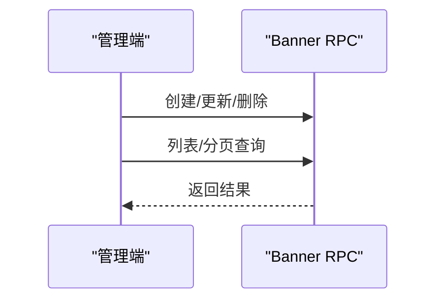
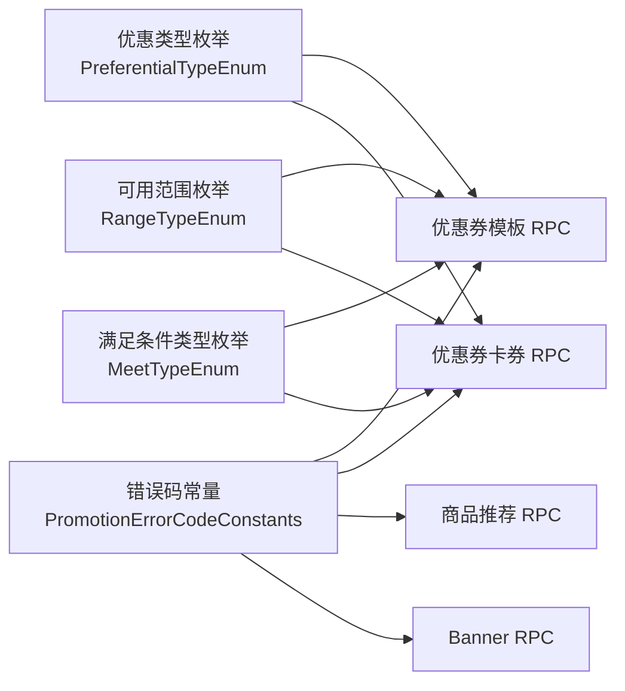

# 营销服务模块

<cite>
**本文引用的文件**
- [PromotionErrorCodeConstants.java](file://promotion-service-project/promotion-service-api/src/main/java/cn/iocoder/mall/promotion/api/enums/PromotionErrorCodeConstants.java)
- [PreferentialTypeEnum.java](file://promotion-service-project/promotion-service-api/src/main/java/cn/iocoder/mall/promotion/api/enums/PreferentialTypeEnum.java)
- [RangeTypeEnum.java](file://promotion-service-project/promotion-service-api/src/main/java/cn/iocoder/mall/promotion/api/enums/RangeTypeEnum.java)
- [MeetTypeEnum.java](file://promotion-service-project/promotion-service-api/src/main/java/cn/iocoder/mall/promotion/api/enums/MeetTypeEnum.java)
- [CouponTemplateRpc.java](file://promotion-service-project/promotion-service-api/src/main/java/cn/iocoder/mall/promotion/api/rpc/coupon/CouponTemplateRpc.java)
- [CouponCardRpc.java](file://promotion-service-project/promotion-service-api/src/main/java/cn/iocoder/mall/promotion/api/rpc/coupon/CouponCardRpc.java)
- [ProductRecommendRpc.java](file://promotion-service-project/promotion-service-api/src/main/java/cn/iocoder/mall/promotion/api/rpc/recommend/ProductRecommendRpc.java)
- [BannerRpc.java](file://promotion-service-project/promotion-service-api/src/main/java/cn/iocoder/mall/promotion/api/rpc/banner/BannerRpc.java)
</cite>

## 目录
1. [简介](#简介)
2. [项目结构](#项目结构)
3. [核心组件](#核心组件)
4. [架构总览](#架构总览)
5. [详细组件分析](#详细组件分析)
6. [依赖关系分析](#依赖关系分析)
7. [性能考虑](#性能考虑)
8. [故障排查指南](#故障排查指南)
9. [结论](#结论)
10. [附录](#附录)

## 简介
本技术文档面向营销服务模块，聚焦于优惠券系统、价格计算引擎设计、商品推荐系统以及营销活动管理机制，并说明与交易系统的集成方式。文档以仓库中现有的营销服务API定义为依据，结合枚举与RPC接口，给出可落地的实现方案、流程图与最佳实践建议，帮助开发者快速理解并扩展营销能力。

## 项目结构
营销服务模块位于 promotion-service-project 中，采用API与应用分离的架构：API层提供领域枚举与RPC接口定义；应用层负责具体业务实现与集成。在本仓库中，已明确暴露以下与营销相关的关键接口与枚举：
- 优惠券模板与卡券 RPC 接口
- 商品推荐 RPC 接口
- Banner 管理 RPC 接口
- 优惠类型、可用范围、满足条件类型等枚举

图表来源
- [PreferentialTypeEnum.java:1-47](file://promotion-service-project/promotion-service-api/src/main/java/cn/iocoder/mall/promotion/api/enums/PreferentialTypeEnum.java#L1-L47)
- [RangeTypeEnum.java:1-50](file://promotion-service-project/promotion-service-api/src/main/java/cn/iocoder/mall/promotion/api/enums/RangeTypeEnum.java#L1-L50)
- [MeetTypeEnum.java:1-34](file://promotion-service-project/promotion-service-api/src/main/java/cn/iocoder/mall/promotion/api/enums/MeetTypeEnum.java#L1-L34)
- [PromotionErrorCodeConstants.java:1-41](file://promotion-service-project/promotion-service-api/src/main/java/cn/iocoder/mall/promotion/api/enums/PromotionErrorCodeConstants.java#L1-L41)
- [CouponTemplateRpc.java:1-58](file://promotion-service-project/promotion-service-api/src/main/java/cn/iocoder/mall/promotion/api/rpc/coupon/CouponTemplateRpc.java#L1-L58)
- [CouponCardRpc.java:1-55](file://promotion-service-project/promotion-service-api/src/main/java/cn/iocoder/mall/promotion/api/rpc/coupon/CouponCardRpc.java#L1-L55)
- [ProductRecommendRpc.java:1-53](file://promotion-service-project/promotion-service-api/src/main/java/cn/iocoder/mall/promotion/api/rpc/recommend/ProductRecommendRpc.java#L1-L53)
- [BannerRpc.java:1-53](file://promotion-service-project/promotion-service-api/src/main/java/cn/iocoder/mall/promotion/api/rpc/banner/BannerRpc.java#L1-L53)

章节来源
- [PromotionErrorCodeConstants.java:1-41](file://promotion-service-project/promotion-service-api/src/main/java/cn/iocoder/mall/promotion/api/enums/PromotionErrorCodeConstants.java#L1-L41)
- [PreferentialTypeEnum.java:1-47](file://promotion-service-project/promotion-service-api/src/main/java/cn/iocoder/mall/promotion/api/enums/PreferentialTypeEnum.java#L1-L47)
- [RangeTypeEnum.java:1-50](file://promotion-service-project/promotion-service-api/src/main/java/cn/iocoder/mall/promotion/api/enums/RangeTypeEnum.java#L1-L50)
- [MeetTypeEnum.java:1-34](file://promotion-service-project/promotion-service-api/src/main/java/cn/iocoder/mall/promotion/api/enums/MeetTypeEnum.java#L1-L34)
- [CouponTemplateRpc.java:1-58](file://promotion-service-project/promotion-service-api/src/main/java/cn/iocoder/mall/promotion/api/rpc/coupon/CouponTemplateRpc.java#L1-L58)
- [CouponCardRpc.java:1-55](file://promotion-service-project/promotion-service-api/src/main/java/cn/iocoder/mall/promotion/api/rpc/coupon/CouponCardRpc.java#L1-L55)
- [ProductRecommendRpc.java:1-53](file://promotion-service-project/promotion-service-api/src/main/java/cn/iocoder/mall/promotion/api/rpc/recommend/ProductRecommendRpc.java#L1-L53)
- [BannerRpc.java:1-53](file://promotion-service-project/promotion-service-api/src/main/java/cn/iocoder/mall/promotion/api/rpc/banner/BannerRpc.java#L1-L53)

## 核心组件
- 优惠类型枚举：定义“减价”和“打折”两种优惠类型，用于价格计算引擎的策略选择。
- 可用范围枚举：覆盖全店可用、部分商品/分类可用/不可用等场景，支撑优惠券与活动的适用范围判断。
- 满足条件类型枚举：支持按“金额门槛”或“数量门槛”触发优惠。
- 错误码常量：统一定义营销模块的错误码段，便于异常处理与前端提示。
- 优惠券模板 RPC：提供模板创建、更新、分页查询、状态变更等能力。
- 优惠券卡券 RPC：提供卡券分页、发放、使用、取消使用、可用列表查询等能力。
- 商品推荐 RPC：提供推荐位的创建、更新、删除、分页与列表查询。
- Banner RPC：提供横幅广告的增删改查与分页查询。

章节来源
- [PreferentialTypeEnum.java:10-47](file://promotion-service-project/promotion-service-api/src/main/java/cn/iocoder/mall/promotion/api/enums/PreferentialTypeEnum.java#L10-L47)
- [RangeTypeEnum.java:10-50](file://promotion-service-project/promotion-service-api/src/main/java/cn/iocoder/mall/promotion/api/enums/RangeTypeEnum.java#L10-L50)
- [MeetTypeEnum.java:6-34](file://promotion-service-project/promotion-service-api/src/main/java/cn/iocoder/mall/promotion/api/enums/MeetTypeEnum.java#L6-L34)
- [PromotionErrorCodeConstants.java:10-41](file://promotion-service-project/promotion-service-api/src/main/java/cn/iocoder/mall/promotion/api/enums/PromotionErrorCodeConstants.java#L10-L41)
- [CouponTemplateRpc.java:10-58](file://promotion-service-project/promotion-service-api/src/main/java/cn/iocoder/mall/promotion/api/rpc/coupon/CouponTemplateRpc.java#L10-L58)
- [CouponCardRpc.java:12-55](file://promotion-service-project/promotion-service-api/src/main/java/cn/iocoder/mall/promotion/api/rpc/coupon/CouponCardRpc.java#L12-L55)
- [ProductRecommendRpc.java:12-53](file://promotion-service-project/promotion-service-api/src/main/java/cn/iocoder/mall/promotion/api/rpc/recommend/ProductRecommendRpc.java#L12-L53)
- [BannerRpc.java:12-53](file://promotion-service-project/promotion-service-api/src/main/java/cn/iocoder/mall/promotion/api/rpc/banner/BannerRpc.java#L12-L53)

## 架构总览
营销服务通过RPC接口向上层应用提供能力，配合交易系统在下单结算阶段进行优惠计算与应用。整体交互示意如下：

图表来源
- [CouponTemplateRpc.java:10-58](file://promotion-service-project/promotion-service-api/src/main/java/cn/iocoder/mall/promotion/api/rpc/coupon/CouponTemplateRpc.java#L10-L58)
- [CouponCardRpc.java:12-55](file://promotion-service-project/promotion-service-api/src/main/java/cn/iocoder/mall/promotion/api/rpc/coupon/CouponCardRpc.java#L12-L55)
- [ProductRecommendRpc.java:12-53](file://promotion-service-project/promotion-service-api/src/main/java/cn/iocoder/mall/promotion/api/rpc/recommend/ProductRecommendRpc.java#L12-L53)
- [BannerRpc.java:12-53](file://promotion-service-project/promotion-service-api/src/main/java/cn/iocoder/mall/promotion/api/rpc/banner/BannerRpc.java#L12-L53)

## 详细组件分析

### 优惠券系统
优惠券系统由“模板”和“卡券”两层组成，模板定义优惠规则与适用范围，卡券是用户持有的具体优惠实体。核心流程包括：模板创建与维护、卡券发放、卡券使用与取消使用、可用卡券查询。

图表来源
- [CouponTemplateRpc.java:14-52](file://promotion-service-project/promotion-service-api/src/main/java/cn/iocoder/mall/promotion/api/rpc/coupon/CouponTemplateRpc.java#L14-L52)
- [CouponCardRpc.java:14-52](file://promotion-service-project/promotion-service-api/src/main/java/cn/iocoder/mall/promotion/api/rpc/coupon/CouponCardRpc.java#L14-L52)

章节来源
- [CouponTemplateRpc.java:10-58](file://promotion-service-project/promotion-service-api/src/main/java/cn/iocoder/mall/promotion/api/rpc/coupon/CouponTemplateRpc.java#L10-L58)
- [CouponCardRpc.java:12-55](file://promotion-service-project/promotion-service-api/src/main/java/cn/iocoder/mall/promotion/api/rpc/coupon/CouponCardRpc.java#L12-L55)

### 价格计算引擎设计（概念性）
价格计算引擎需支持多种优惠类型与组合规则，典型场景包括：
- 满减活动：达到门槛金额后减免固定金额
- 折扣活动：按比例打折
- 组合优惠：多张券叠加或互斥
- 适用范围：仅对部分商品/分类生效
- 优先级：按规则设定优惠应用顺序

说明
- 该图为概念流程，具体实现需结合交易服务在下单/结算阶段调用营销服务完成优惠计算与应用。

### 商品推荐系统
商品推荐提供推荐位的增删改查与分页查询，支持热门与个性化推荐的配置化管理。

图表来源
- [ProductRecommendRpc.java:14-50](file://promotion-service-project/promotion-service-api/src/main/java/cn/iocoder/mall/promotion/api/rpc/recommend/ProductRecommendRpc.java#L14-L50)

章节来源
- [ProductRecommendRpc.java:12-53](file://promotion-service-project/promotion-service-api/src/main/java/cn/iocoder/mall/promotion/api/rpc/recommend/ProductRecommendRpc.java#L12-L53)

### Banner 管理
Banner 提供横幅广告的管理能力，支持列表与分页查询，便于运营侧进行内容配置。

图表来源
- [BannerRpc.java:14-50](file://promotion-service-project/promotion-service-api/src/main/java/cn/iocoder/mall/promotion/api/rpc/banner/BannerRpc.java#L14-L50)

章节来源
- [BannerRpc.java:12-53](file://promotion-service-project/promotion-service-api/src/main/java/cn/iocoder/mall/promotion/api/rpc/banner/BannerRpc.java#L12-L53)

## 依赖关系分析
营销服务的RPC接口依赖于若干枚举来表达业务语义，错误码常量为异常处理提供统一入口。

图表来源
- [PromotionErrorCodeConstants.java:10-41](file://promotion-service-project/promotion-service-api/src/main/java/cn/iocoder/mall/promotion/api/enums/PromotionErrorCodeConstants.java#L10-L41)
- [PreferentialTypeEnum.java:10-47](file://promotion-service-project/promotion-service-api/src/main/java/cn/iocoder/mall/promotion/api/enums/PreferentialTypeEnum.java#L10-L47)
- [RangeTypeEnum.java:10-50](file://promotion-service-project/promotion-service-api/src/main/java/cn/iocoder/mall/promotion/api/enums/RangeTypeEnum.java#L10-L50)
- [MeetTypeEnum.java:6-34](file://promotion-service-project/promotion-service-api/src/main/java/cn/iocoder/mall/promotion/api/enums/MeetTypeEnum.java#L6-L34)
- [CouponTemplateRpc.java:10-58](file://promotion-service-project/promotion-service-api/src/main/java/cn/iocoder/mall/promotion/api/rpc/coupon/CouponTemplateRpc.java#L10-L58)
- [CouponCardRpc.java:12-55](file://promotion-service-project/promotion-service-api/src/main/java/cn/iocoder/mall/promotion/api/rpc/coupon/CouponCardRpc.java#L12-L55)
- [ProductRecommendRpc.java:12-53](file://promotion-service-project/promotion-service-api/src/main/java/cn/iocoder/mall/promotion/api/rpc/recommend/ProductRecommendRpc.java#L12-L53)
- [BannerRpc.java:12-53](file://promotion-service-project/promotion-service-api/src/main/java/cn/iocoder/mall/promotion/api/rpc/banner/BannerRpc.java#L12-L53)

章节来源
- [PromotionErrorCodeConstants.java:10-41](file://promotion-service-project/promotion-service-api/src/main/java/cn/iocoder/mall/promotion/api/enums/PromotionErrorCodeConstants.java#L10-L41)
- [PreferentialTypeEnum.java:10-47](file://promotion-service-project/promotion-service-api/src/main/java/cn/iocoder/mall/promotion/api/enums/PreferentialTypeEnum.java#L10-L47)
- [RangeTypeEnum.java:10-50](file://promotion-service-project/promotion-service-api/src/main/java/cn/iocoder/mall/promotion/api/enums/RangeTypeEnum.java#L10-L50)
- [MeetTypeEnum.java:6-34](file://promotion-service-project/promotion-service-api/src/main/java/cn/iocoder/mall/promotion/api/enums/MeetTypeEnum.java#L6-L34)
- [CouponTemplateRpc.java:10-58](file://promotion-service-project/promotion-service-api/src/main/java/cn/iocoder/mall/promotion/api/rpc/coupon/CouponTemplateRpc.java#L10-L58)
- [CouponCardRpc.java:12-55](file://promotion-service-project/promotion-service-api/src/main/java/cn/iocoder/mall/promotion/api/rpc/coupon/CouponCardRpc.java#L12-L55)
- [ProductRecommendRpc.java:12-53](file://promotion-service-project/promotion-service-api/src/main/java/cn/iocoder/mall/promotion/api/rpc/recommend/ProductRecommendRpc.java#L12-L53)
- [BannerRpc.java:12-53](file://promotion-service-project/promotion-service-api/src/main/java/cn/iocoder/mall/promotion/api/rpc/banner/BannerRpc.java#L12-L53)

## 性能考虑
- 优惠券模板与卡券分页查询应结合索引与缓存，避免大表全量扫描。
- 价格计算应在交易服务的结算阶段进行，尽量减少重复计算，必要时引入幂等与缓存。
- 商品推荐与Banner列表查询建议使用缓存与CDN加速，降低数据库压力。
- RPC调用链路应设置合理的超时与重试策略，保障高并发下的稳定性。

## 故障排查指南
- 优惠券模板不存在/状态异常：检查模板创建与状态更新流程，核对错误码与日志。
- 卡券不属于当前用户/不可用：确认用户身份与卡券状态流转，确保使用前的可用性校验。
- 门槛不满足：核对满足条件类型（金额/数量）与阈值配置。
- 适用范围不匹配：确认商品/分类与模板/卡券的适用范围设置。

章节来源
- [PromotionErrorCodeConstants.java:13-39](file://promotion-service-project/promotion-service-api/src/main/java/cn/iocoder/mall/promotion/api/enums/PromotionErrorCodeConstants.java#L13-L39)

## 结论
营销服务模块以清晰的RPC接口与领域枚举为基础，覆盖了优惠券、商品推荐与Banner管理等核心能力。结合交易服务在下单结算阶段的优惠计算与应用，可实现灵活的促销策略与良好的用户体验。后续可在应用层完善价格计算引擎与营销效果统计分析，持续优化性能与可运维性。

## 附录
- 营销规则配置示例（概念性）
  - 优惠类型：减价/打折
  - 门槛类型：金额/数量
  - 适用范围：全店/部分商品/部分分类
  - 生效时间：起止时间配置
  - 状态控制：启用/停用
- 价格计算流程图（见“价格计算引擎设计”章节）