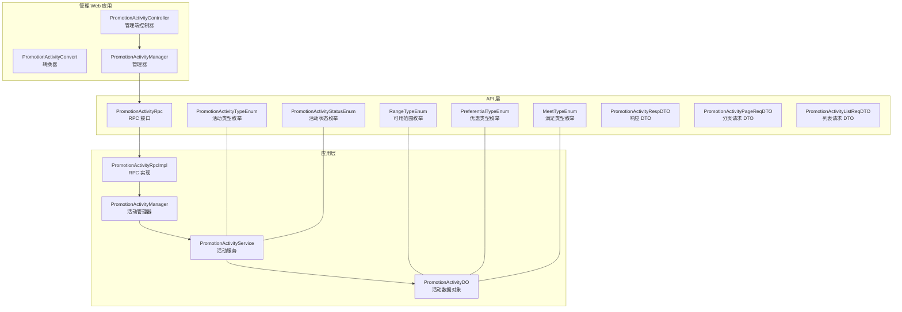
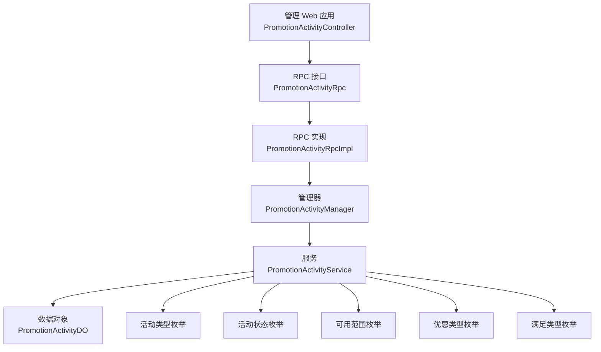
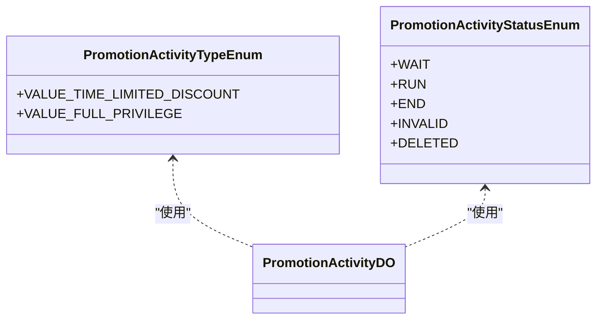
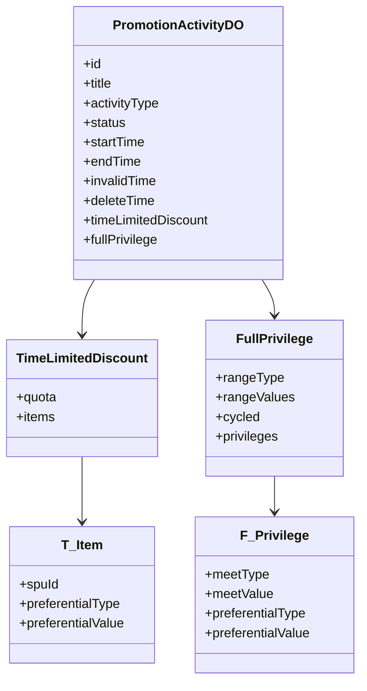
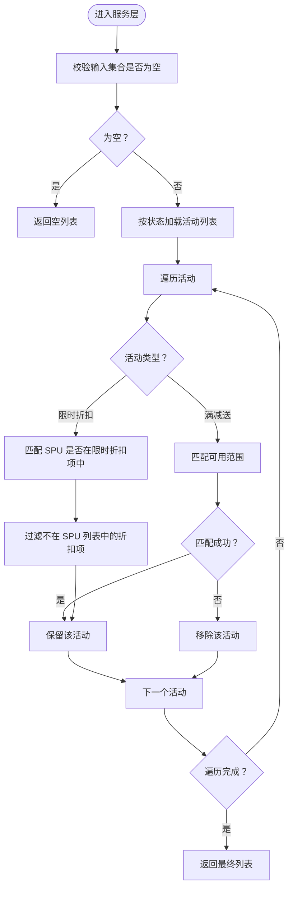
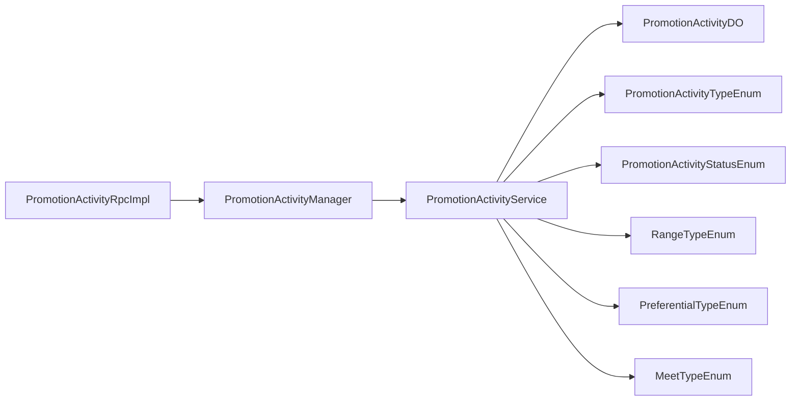

# 营销活动管理

<cite>
**本文引用的文件**
- [PreferentialTypeEnum.java](file://promotion-service-project/promotion-service-api/src/main/java/cn/iocoder/mall/promotion/api/enums/PreferentialTypeEnum.java)
- [MeetTypeEnum.java](file://promotion-service-project/promotion-service-api/src/main/java/cn/iocoder/mall/promotion/api/enums/MeetTypeEnum.java)
- [RangeTypeEnum.java](file://promotion-service-project/promotion-service-api/src/main/java/cn/iocoder/mall/promotion/api/enums/RangeTypeEnum.java)
- [PromotionActivityTypeEnum.java](file://promotion-service-project/promotion-service-api/src/main/java/cn/iocoder/mall/promotion/api/enums/activity/PromotionActivityTypeEnum.java)
- [PromotionActivityStatusEnum.java](file://promotion-service-project/promotion-service-api/src/main/java/cn/iocoder/mall/promotion/api/enums/activity/PromotionActivityStatusEnum.java)
- [PromotionActivityDO.java](file://promotion-service-project/promotion-service-app/src/main/java/cn/iocoder/mall/promotionservice/dal/mysql/dataobject/activity/PromotionActivityDO.java)
- [PromotionActivityService.java](file://promotion-service-project/promotion-service-app/src/main/java/cn/iocoder/mall/promotionservice/service/activity/PromotionActivityService.java)
- [PromotionActivityManager.java](file://promotion-service-project/promotion-service-app/src/main/java/cn/iocoder/mall/promotionservice/manager/activity/PromotionActivityManager.java)
- [PromotionActivityRpcImpl.java](file://promotion-service-project/promotion-service-app/src/main/java/cn/iocoder/mall/promotionservice/rpc/activity/PromotionActivityRpcImpl.java)
- [PromotionActivityRpc.java](file://promotion-service-project/promotion-service-api/src/main/java/cn/iocoder/mall/promotion/api/rpc/activity/PromotionActivityRpc.java)
- [PromotionActivityPageReqDTO.java](file://promotion-service-project/promotion-service-api/src/main/java/cn/iocoder/mall/promotion/api/rpc/activity/dto/PromotionActivityPageReqDTO.java)
- [PromotionActivityListReqDTO.java](file://promotion-service-project/promotion-service-api/src/main/java/cn/iocoder/mall/promotion/api/rpc/activity/dto/PromotionActivityListReqDTO.java)
- [PromotionActivityRespDTO.java](file://promotion-service-project/promotion-service-api/src/main/java/cn/iocoder/mall/promotion/api/rpc/activity/dto/PromotionActivityRespDTO.java)
- [PromotionActivityController.java](file://management-web-app/src/main/java/cn/iocoder/mall/managementweb/controller/promotion/activity/PromotionActivityController.java)
- [PromotionActivityPageReqVO.java](file://management-web-app/src/main/java/cn/iocoder/mall/managementweb/controller/promotion/activity/vo/PromotionActivityPageReqVO.java)
- [PromotionActivityConvert.java](file://management-web-app/src/main/java/cn/iocoder/mall/managementweb/convert/promotion/PromotionActivityConvert.java)
- [PromotionActivityManager.java](file://management-web-app/src/main/java/cn/iocoder/mall/managementweb/manager/promotion/activity/PromotionActivityManager.java)
</cite>

## 目录
1. [简介](#简介)
2. [项目结构](#项目结构)
3. [核心组件](#核心组件)
4. [架构总览](#架构总览)
5. [详细组件分析](#详细组件分析)
6. [依赖分析](#依赖分析)
7. [性能考虑](#性能考虑)
8. [故障排查指南](#故障排查指南)
9. [结论](#结论)
10. [附录](#附录)

## 简介
本技术文档围绕营销活动管理功能展开，系统支持多种活动形态与生命周期管理，并提供活动配置参数、生效机制、数据统计与异常处理等能力。当前仓库中已实现的活动类型包括“限时折扣”和“满减送”，并通过统一的活动类型与状态枚举进行扩展。活动的创建、审核、发布、暂停、结束等状态流转在 API 层面通过状态枚举定义；活动的配置参数涵盖时间窗口、参与条件、优惠规则、可用范围与库存限制等；生效机制通过服务层对活动与商品的匹配逻辑实现；数据统计方面，系统提供分页查询与列表查询接口，便于后续接入指标采集。

## 项目结构
营销活动相关代码主要分布在以下模块：
- API 层：定义活动类型、状态、范围、优惠类型等枚举，以及 RPC 接口与 DTO。
- 应用层：实现活动的业务逻辑、RPC 实现与数据对象模型。
- 管理 Web 应用：提供管理端控制器、转换器与管理器，对接活动 RPC。

图表来源
- [PromotionActivityTypeEnum.java:1-35](file://promotion-service-project/promotion-service-api/src/main/java/cn/iocoder/mall/promotion/api/enums/activity/PromotionActivityTypeEnum.java#L1-L35)
- [PromotionActivityStatusEnum.java:1-42](file://promotion-service-project/promotion-service-api/src/main/java/cn/iocoder/mall/promotion/api/enums/activity/PromotionActivityStatusEnum.java#L1-L42)
- [RangeTypeEnum.java:1-50](file://promotion-service-project/promotion-service-api/src/main/java/cn/iocoder/mall/promotion/api/enums/RangeTypeEnum.java#L1-L50)
- [PreferentialTypeEnum.java:1-47](file://promotion-service-project/promotion-service-api/src/main/java/cn/iocoder/mall/promotion/api/enums/PreferentialTypeEnum.java#L1-L47)
- [MeetTypeEnum.java:1-34](file://promotion-service-project/promotion-service-api/src/main/java/cn/iocoder/mall/promotion/api/enums/MeetTypeEnum.java#L1-L34)
- [PromotionActivityRpc.java](file://promotion-service-project/promotion-service-api/src/main/java/cn/iocoder/mall/promotion/api/rpc/activity/PromotionActivityRpc.java)
- [PromotionActivityRespDTO.java](file://promotion-service-project/promotion-service-api/src/main/java/cn/iocoder/mall/promotion/api/rpc/activity/dto/PromotionActivityRespDTO.java)
- [PromotionActivityPageReqDTO.java](file://promotion-service-project/promotion-service-api/src/main/java/cn/iocoder/mall/promotion/api/rpc/activity/dto/PromotionActivityPageReqDTO.java)
- [PromotionActivityListReqDTO.java](file://promotion-service-project/promotion-service-api/src/main/java/cn/iocoder/mall/promotion/api/rpc/activity/dto/PromotionActivityListReqDTO.java)
- [PromotionActivityDO.java:1-198](file://promotion-service-project/promotion-service-app/src/main/java/cn/iocoder/mall/promotionservice/dal/mysql/dataobject/activity/PromotionActivityDO.java#L1-L198)
- [PromotionActivityService.java:1-99](file://promotion-service-project/promotion-service-app/src/main/java/cn/iocoder/mall/promotionservice/service/activity/PromotionActivityService.java#L1-L99)
- [PromotionActivityManager.java:1-33](file://promotion-service-project/promotion-service-app/src/main/java/cn/iocoder/mall/promotionservice/manager/activity/PromotionActivityManager.java#L1-L33)
- [PromotionActivityRpcImpl.java:1-34](file://promotion-service-project/promotion-service-app/src/main/java/cn/iocoder/mall/promotionservice/rpc/activity/PromotionActivityRpcImpl.java#L1-L34)
- [PromotionActivityController.java](file://management-web-app/src/main/java/cn/iocoder/mall/managementweb/controller/promotion/activity/PromotionActivityController.java)
- [PromotionActivityConvert.java](file://management-web-app/src/main/java/cn/iocoder/mall/managementweb/convert/promotion/PromotionActivityConvert.java)
- [PromotionActivityManager.java](file://management-web-app/src/main/java/cn/iocoder/mall/managementweb/manager/promotion/activity/PromotionActivityManager.java)

章节来源
- [PromotionActivityTypeEnum.java:1-35](file://promotion-service-project/promotion-service-api/src/main/java/cn/iocoder/mall/promotion/api/enums/activity/PromotionActivityTypeEnum.java#L1-L35)
- [PromotionActivityStatusEnum.java:1-42](file://promotion-service-project/promotion-service-api/src/main/java/cn/iocoder/mall/promotion/api/enums/activity/PromotionActivityStatusEnum.java#L1-L42)
- [RangeTypeEnum.java:1-50](file://promotion-service-project/promotion-service-api/src/main/java/cn/iocoder/mall/promotion/api/enums/RangeTypeEnum.java#L1-L50)
- [PreferentialTypeEnum.java:1-47](file://promotion-service-project/promotion-service-api/src/main/java/cn/iocoder/mall/promotion/api/enums/PreferentialTypeEnum.java#L1-L47)
- [MeetTypeEnum.java:1-34](file://promotion-service-project/promotion-service-api/src/main/java/cn/iocoder/mall/promotion/api/enums/MeetTypeEnum.java#L1-L34)
- [PromotionActivityDO.java:1-198](file://promotion-service-project/promotion-service-app/src/main/java/cn/iocoder/mall/promotionservice/dal/mysql/dataobject/activity/PromotionActivityDO.java#L1-L198)
- [PromotionActivityService.java:1-99](file://promotion-service-project/promotion-service-app/src/main/java/cn/iocoder/mall/promotionservice/service/activity/PromotionActivityService.java#L1-L99)
- [PromotionActivityManager.java:1-33](file://promotion-service-project/promotion-service-app/src/main/java/cn/iocoder/mall/promotionservice/manager/activity/PromotionActivityManager.java#L1-L33)
- [PromotionActivityRpcImpl.java:1-34](file://promotion-service-project/promotion-service-app/src/main/java/cn/iocoder/mall/promotionservice/rpc/activity/PromotionActivityRpcImpl.java#L1-L34)
- [PromotionActivityRpc.java](file://promotion-service-project/promotion-service-api/src/main/java/cn/iocoder/mall/promotion/api/rpc/activity/PromotionActivityRpc.java)
- [PromotionActivityPageReqDTO.java](file://promotion-service-project/promotion-service-api/src/main/java/cn/iocoder/mall/promotion/api/rpc/activity/dto/PromotionActivityPageReqDTO.java)
- [PromotionActivityListReqDTO.java](file://promotion-service-project/promotion-service-api/src/main/java/cn/iocoder/mall/promotion/api/rpc/activity/dto/PromotionActivityListReqDTO.java)
- [PromotionActivityRespDTO.java](file://promotion-service-project/promotion-service-api/src/main/java/cn/iocoder/mall/promotion/api/rpc/activity/dto/PromotionActivityRespDTO.java)
- [PromotionActivityController.java](file://management-web-app/src/main/java/cn/iocoder/mall/managementweb/controller/promotion/activity/PromotionActivityController.java)
- [PromotionActivityPageReqVO.java](file://management-web-app/src/main/java/cn/iocoder/mall/managementweb/controller/promotion/activity/vo/PromotionActivityPageReqVO.java)
- [PromotionActivityConvert.java](file://management-web-app/src/main/java/cn/iocoder/mall/managementweb/convert/promotion/PromotionActivityConvert.java)
- [PromotionActivityManager.java](file://management-web-app/src/main/java/cn/iocoder/mall/managementweb/manager/promotion/activity/PromotionActivityManager.java)

## 核心组件
- 活动类型与状态
  - 活动类型：限时折扣、满减送。
  - 活动状态：未开始、进行中、已结束、已撤销、已删除。
- 优惠与满足类型
  - 优惠类型：减价、打折。
  - 满足类型：金额、数量。
- 可用范围
  - 所有可用、部分商品可用/不可用、部分分类可用/不可用。
- 数据对象
  - 活动主表包含活动基础信息、时间窗口、失效与删除时间，以及两类活动的规则对象：限时折扣与满减送。
- 服务与 RPC
  - 服务层负责活动列表、分页与按商品匹配的逻辑。
  - RPC 层提供分页与列表查询能力，供上层调用。
- 管理端集成
  - 管理 Web 应用提供控制器、转换器与管理器，对接 RPC 并输出管理端视图对象。

章节来源
- [PromotionActivityTypeEnum.java:1-35](file://promotion-service-project/promotion-service-api/src/main/java/cn/iocoder/mall/promotion/api/enums/activity/PromotionActivityTypeEnum.java#L1-L35)
- [PromotionActivityStatusEnum.java:1-42](file://promotion-service-project/promotion-service-api/src/main/java/cn/iocoder/mall/promotion/api/enums/activity/PromotionActivityStatusEnum.java#L1-L42)
- [PreferentialTypeEnum.java:1-47](file://promotion-service-project/promotion-service-api/src/main/java/cn/iocoder/mall/promotion/api/enums/PreferentialTypeEnum.java#L1-L47)
- [MeetTypeEnum.java:1-34](file://promotion-service-project/promotion-service-api/src/main/java/cn/iocoder/mall/promotion/api/enums/MeetTypeEnum.java#L1-L34)
- [RangeTypeEnum.java:1-50](file://promotion-service-project/promotion-service-api/src/main/java/cn/iocoder/mall/promotion/api/enums/RangeTypeEnum.java#L1-L50)
- [PromotionActivityDO.java:1-198](file://promotion-service-project/promotion-service-app/src/main/java/cn/iocoder/mall/promotionservice/dal/mysql/dataobject/activity/PromotionActivityDO.java#L1-L198)
- [PromotionActivityService.java:1-99](file://promotion-service-project/promotion-service-app/src/main/java/cn/iocoder/mall/promotionservice/service/activity/PromotionActivityService.java#L1-L99)
- [PromotionActivityRpcImpl.java:1-34](file://promotion-service-project/promotion-service-app/src/main/java/cn/iocoder/mall/promotionservice/rpc/activity/PromotionActivityRpcImpl.java#L1-L34)

## 架构总览
营销活动管理采用分层架构：API 定义领域模型与 RPC 接口，应用层实现业务逻辑与数据持久化，管理 Web 应用提供管理端入口。RPC 作为服务边界，屏蔽内部实现细节，便于横向扩展与多端复用。

图表来源
- [PromotionActivityController.java](file://management-web-app/src/main/java/cn/iocoder/mall/managementweb/controller/promotion/activity/PromotionActivityController.java)
- [PromotionActivityRpc.java](file://promotion-service-project/promotion-service-api/src/main/java/cn/iocoder/mall/promotion/api/rpc/activity/PromotionActivityRpc.java)
- [PromotionActivityRpcImpl.java:1-34](file://promotion-service-project/promotion-service-app/src/main/java/cn/iocoder/mall/promotionservice/rpc/activity/PromotionActivityRpcImpl.java#L1-L34)
- [PromotionActivityManager.java:1-33](file://promotion-service-project/promotion-service-app/src/main/java/cn/iocoder/mall/promotionservice/manager/activity/PromotionActivityManager.java#L1-L33)
- [PromotionActivityService.java:1-99](file://promotion-service-project/promotion-service-app/src/main/java/cn/iocoder/mall/promotionservice/service/activity/PromotionActivityService.java#L1-L99)
- [PromotionActivityDO.java:1-198](file://promotion-service-project/promotion-service-app/src/main/java/cn/iocoder/mall/promotionservice/dal/mysql/dataobject/activity/PromotionActivityDO.java#L1-L198)
- [PromotionActivityTypeEnum.java:1-35](file://promotion-service-project/promotion-service-api/src/main/java/cn/iocoder/mall/promotion/api/enums/activity/PromotionActivityTypeEnum.java#L1-L35)
- [PromotionActivityStatusEnum.java:1-42](file://promotion-service-project/promotion-service-api/src/main/java/cn/iocoder/mall/promotion/api/enums/activity/PromotionActivityStatusEnum.java#L1-L42)
- [RangeTypeEnum.java:1-50](file://promotion-service-project/promotion-service-api/src/main/java/cn/iocoder/mall/promotion/api/enums/RangeTypeEnum.java#L1-L50)
- [PreferentialTypeEnum.java:1-47](file://promotion-service-project/promotion-service-api/src/main/java/cn/iocoder/mall/promotion/api/enums/PreferentialTypeEnum.java#L1-L47)
- [MeetTypeEnum.java:1-34](file://promotion-service-project/promotion-service-api/src/main/java/cn/iocoder/mall/promotion/api/enums/MeetTypeEnum.java#L1-L34)

## 详细组件分析

### 活动类型与状态
- 活动类型
  - 限时折扣：针对特定 SPU 的限时折扣配置，支持每人每种限购数量。
  - 满减送：基于满足金额或数量触发的优惠，支持“所有可用”和“部分商品可用/不可用”的范围控制。
- 活动状态
  - 未开始、进行中、已结束、已撤销、已删除。状态之间存在单向转换约束，确保生命周期合规。

图表来源
- [PromotionActivityTypeEnum.java:1-35](file://promotion-service-project/promotion-service-api/src/main/java/cn/iocoder/mall/promotion/api/enums/activity/PromotionActivityTypeEnum.java#L1-L35)
- [PromotionActivityStatusEnum.java:1-42](file://promotion-service-project/promotion-service-api/src/main/java/cn/iocoder/mall/promotion/api/enums/activity/PromotionActivityStatusEnum.java#L1-L42)
- [PromotionActivityDO.java:1-198](file://promotion-service-project/promotion-service-app/src/main/java/cn/iocoder/mall/promotionservice/dal/mysql/dataobject/activity/PromotionActivityDO.java#L1-L198)

章节来源
- [PromotionActivityTypeEnum.java:1-35](file://promotion-service-project/promotion-service-api/src/main/java/cn/iocoder/mall/promotion/api/enums/activity/PromotionActivityTypeEnum.java#L1-L35)
- [PromotionActivityStatusEnum.java:1-42](file://promotion-service-project/promotion-service-api/src/main/java/cn/iocoder/mall/promotion/api/enums/activity/PromotionActivityStatusEnum.java#L1-L42)
- [PromotionActivityDO.java:1-198](file://promotion-service-project/promotion-service-app/src/main/java/cn/iocoder/mall/promotionservice/dal/mysql/dataobject/activity/PromotionActivityDO.java#L1-L198)

### 数据模型与配置参数
- 基础字段
  - 活动标题、活动类型、活动状态、开始/结束/失效/删除时间。
- 限时折扣配置
  - 每人每种限购数量（quota）。
  - 折扣明细：SPU 编号、优惠类型（减价/打折）、优惠值。
- 满减送配置
  - 可用范围：全部可用、部分商品可用/不可用。
  - 优惠明细：满足类型（金额/数量）、满足值、优惠类型（减价/打折）、优惠值。
- 其他
  - 循环标记（cycled）用于策略是否循环执行（当前模型中保留字段）。

图表来源
- [PromotionActivityDO.java:1-198](file://promotion-service-project/promotion-service-app/src/main/java/cn/iocoder/mall/promotionservice/dal/mysql/dataobject/activity/PromotionActivityDO.java#L1-L198)

章节来源
- [PromotionActivityDO.java:1-198](file://promotion-service-project/promotion-service-app/src/main/java/cn/iocoder/mall/promotionservice/dal/mysql/dataobject/activity/PromotionActivityDO.java#L1-L198)

### 生命周期管理
- 状态定义与约束
  - 未开始、进行中、已结束可转为已撤销；已撤销仅能转为已删除。
- 时间窗口
  - 通过 startTime、endTime 控制活动生效时段；invalidTime、deleteTime 提供失效与删除标记。
- 管理端集成
  - 管理 Web 应用通过控制器与管理器对接 RPC，实现活动的创建、编辑、审核、发布、暂停与结束等操作（具体流程由管理端实现负责）。

章节来源
- [PromotionActivityStatusEnum.java:1-42](file://promotion-service-project/promotion-service-api/src/main/java/cn/iocoder/mall/promotion/api/enums/activity/PromotionActivityStatusEnum.java#L1-L42)
- [PromotionActivityDO.java:1-198](file://promotion-service-project/promotion-service-app/src/main/java/cn/iocoder/mall/promotionservice/dal/mysql/dataobject/activity/PromotionActivityDO.java#L1-L198)
- [PromotionActivityController.java](file://management-web-app/src/main/java/cn/iocoder/mall/managementweb/controller/promotion/activity/PromotionActivityController.java)
- [PromotionActivityManager.java](file://management-web-app/src/main/java/cn/iocoder/mall/managementweb/manager/promotion/activity/PromotionActivityManager.java)

### 生效机制与冲突处理
- 商品匹配
  - 限时折扣：按 SPU 进行精确匹配，若传入 SPU 集合，会过滤掉不在集合内的折扣项。
  - 满减送：当范围为“所有可用”直接匹配；当为“部分商品可用”时，检查商品是否在指定列表内。
- 冲突与并发
  - 通过服务层的匹配与过滤逻辑保证活动与商品的正确关联；并发控制建议在上层交易链路中结合分布式锁与幂等设计实现（本仓库未直接提供并发控制实现）。

图表来源
- [PromotionActivityService.java:1-99](file://promotion-service-project/promotion-service-app/src/main/java/cn/iocoder/mall/promotionservice/service/activity/PromotionActivityService.java#L1-L99)

章节来源
- [PromotionActivityService.java:1-99](file://promotion-service-project/promotion-service-app/src/main/java/cn/iocoder/mall/promotionservice/service/activity/PromotionActivityService.java#L1-L99)

### 数据统计与指标监控
- 分页与列表查询
  - 提供分页查询与列表查询接口，便于前端展示与导出。
- 指标采集
  - 可基于分页结果统计参与人数、使用率、转化率等指标（具体实现需在业务侧扩展）。

章节来源
- [PromotionActivityRpcImpl.java:1-34](file://promotion-service-project/promotion-service-app/src/main/java/cn/iocoder/mall/promotionservice/rpc/activity/PromotionActivityRpcImpl.java#L1-L34)
- [PromotionActivityPageReqDTO.java](file://promotion-service-project/promotion-service-api/src/main/java/cn/iocoder/mall/promotion/api/rpc/activity/dto/PromotionActivityPageReqDTO.java)
- [PromotionActivityListReqDTO.java](file://promotion-service-project/promotion-service-api/src/main/java/cn/iocoder/mall/promotion/api/rpc/activity/dto/PromotionActivityListReqDTO.java)
- [PromotionActivityRespDTO.java](file://promotion-service-project/promotion-service-api/src/main/java/cn/iocoder/mall/promotion/api/rpc/activity/dto/PromotionActivityRespDTO.java)

### 管理端集成与最佳实践
- 管理端控制器
  - 通过管理器调用 RPC 接口，实现活动的分页与列表查询。
- 转换与 VO
  - 使用转换器将 DO/DTO 转换为管理端 VO，便于前端渲染。
- 最佳实践
  - 在创建活动时明确设置活动类型与状态，合理配置时间窗口与可用范围。
  - 对于限时折扣，建议设置合理的限购数量以避免超卖。
  - 对于满减送，建议明确满足类型与满足值，确保规则清晰易懂。
  - 使用状态机控制活动生命周期，避免非法状态转换。

章节来源
- [PromotionActivityController.java](file://management-web-app/src/main/java/cn/iocoder/mall/managementweb/controller/promotion/activity/PromotionActivityController.java)
- [PromotionActivityConvert.java](file://management-web-app/src/main/java/cn/iocoder/mall/managementweb/convert/promotion/PromotionActivityConvert.java)
- [PromotionActivityManager.java](file://management-web-app/src/main/java/cn/iocoder/mall/managementweb/manager/promotion/activity/PromotionActivityManager.java)

## 依赖分析
- 组件耦合
  - 服务层依赖数据对象与枚举，RPC 实现依赖管理器，管理器依赖服务层，形成清晰的单向依赖。
- 外部依赖
  - 使用 MyBatis-Plus 类型处理器进行 JSON 字段序列化，简化复杂配置的存储与读取。
- 潜在风险
  - 若新增活动类型，需同步更新类型枚举与服务层匹配逻辑，避免运行期异常。

图表来源
- [PromotionActivityRpcImpl.java:1-34](file://promotion-service-project/promotion-service-app/src/main/java/cn/iocoder/mall/promotionservice/rpc/activity/PromotionActivityRpcImpl.java#L1-L34)
- [PromotionActivityManager.java:1-33](file://promotion-service-project/promotion-service-app/src/main/java/cn/iocoder/mall/promotionservice/manager/activity/PromotionActivityManager.java#L1-L33)
- [PromotionActivityService.java:1-99](file://promotion-service-project/promotion-service-app/src/main/java/cn/iocoder/mall/promotionservice/service/activity/PromotionActivityService.java#L1-L99)
- [PromotionActivityDO.java:1-198](file://promotion-service-project/promotion-service-app/src/main/java/cn/iocoder/mall/promotionservice/dal/mysql/dataobject/activity/PromotionActivityDO.java#L1-L198)
- [PromotionActivityTypeEnum.java:1-35](file://promotion-service-project/promotion-service-api/src/main/java/cn/iocoder/mall/promotion/api/enums/activity/PromotionActivityTypeEnum.java#L1-L35)
- [PromotionActivityStatusEnum.java:1-42](file://promotion-service-project/promotion-service-api/src/main/java/cn/iocoder/mall/promotion/api/enums/activity/PromotionActivityStatusEnum.java#L1-L42)
- [RangeTypeEnum.java:1-50](file://promotion-service-project/promotion-service-api/src/main/java/cn/iocoder/mall/promotion/api/enums/RangeTypeEnum.java#L1-L50)
- [PreferentialTypeEnum.java:1-47](file://promotion-service-project/promotion-service-api/src/main/java/cn/iocoder/mall/promotion/api/enums/PreferentialTypeEnum.java#L1-L47)
- [MeetTypeEnum.java:1-34](file://promotion-service-project/promotion-service-api/src/main/java/cn/iocoder/mall/promotion/api/enums/MeetTypeEnum.java#L1-L34)

## 性能考虑
- 查询优化
  - 利用分页查询减少一次性加载大量活动带来的内存压力。
- 匹配效率
  - 在服务层对活动与商品的匹配采用流式过滤与早期退出，降低无效计算。
- 存储与序列化
  - 使用 JSON 类型处理器存储复杂配置，提升灵活性但需注意序列化开销与字段变更兼容性。

## 故障排查指南
- 常见问题
  - 活动未生效：检查活动状态与时间窗口，确认未处于“未开始/已结束/已撤销/已删除”状态。
  - 商品未匹配：核对限时折扣中的 SPU 列表与满减送的可用范围配置。
  - 配置异常：检查 JSON 字段序列化是否正确，避免因字段缺失导致解析失败。
- 回滚建议
  - 对于状态变更与配置修改，建议在上层交易链路中引入幂等与事务控制，必要时提供状态回退策略（本仓库未直接提供回滚实现，需业务侧补充）。

章节来源
- [PromotionActivityStatusEnum.java:1-42](file://promotion-service-project/promotion-service-api/src/main/java/cn/iocoder/mall/promotion/api/enums/activity/PromotionActivityStatusEnum.java#L1-L42)
- [PromotionActivityService.java:1-99](file://promotion-service-project/promotion-service-app/src/main/java/cn/iocoder/mall/promotionservice/service/activity/PromotionActivityService.java#L1-L99)

## 结论
本营销活动管理系统以清晰的分层架构实现了活动类型、状态、配置与生效机制的核心能力。当前已覆盖限时折扣与满减送两大场景，并通过 RPC 与管理端集成提供良好的扩展性。建议在后续版本中完善并发控制、异常回滚与指标采集能力，以支撑更复杂的业务场景。

## 附录
- 活动配置示例（路径参考）
  - 限时折扣配置：[PromotionActivityDO.java:78-117](file://promotion-service-project/promotion-service-app/src/main/java/cn/iocoder/mall/promotionservice/dal/mysql/dataobject/activity/PromotionActivityDO.java#L78-L117)
  - 满减送配置：[PromotionActivityDO.java:120-195](file://promotion-service-project/promotion-service-app/src/main/java/cn/iocoder/mall/promotionservice/dal/mysql/dataobject/activity/PromotionActivityDO.java#L120-L195)
- 管理端调用示例（路径参考）
  - 分页查询：[PromotionActivityRpcImpl.java:23-26](file://promotion-service-project/promotion-service-app/src/main/java/cn/iocoder/mall/promotionservice/rpc/activity/PromotionActivityRpcImpl.java#L23-L26)
  - 列表查询：[PromotionActivityRpcImpl.java:28-31](file://promotion-service-project/promotion-service-app/src/main/java/cn/iocoder/mall/promotionservice/rpc/activity/PromotionActivityRpcImpl.java#L28-L31)
  - 控制器对接：[PromotionActivityController.java](file://management-web-app/src/main/java/cn/iocoder/mall/managementweb/controller/promotion/activity/PromotionActivityController.java)