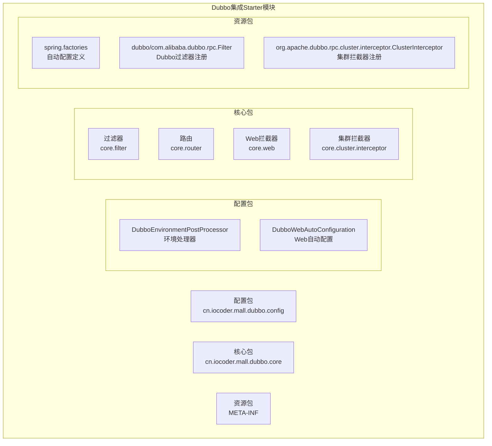
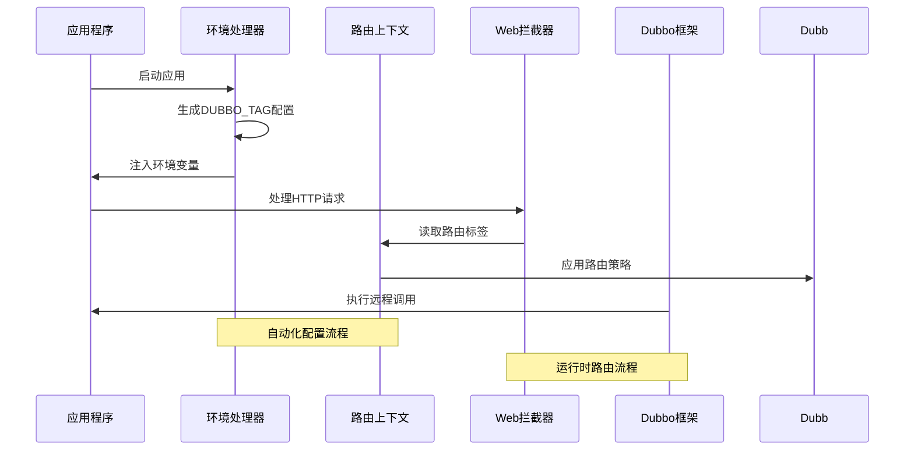
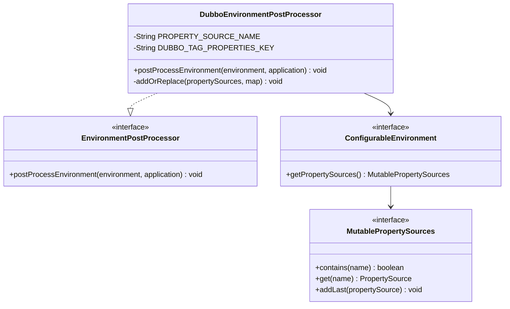
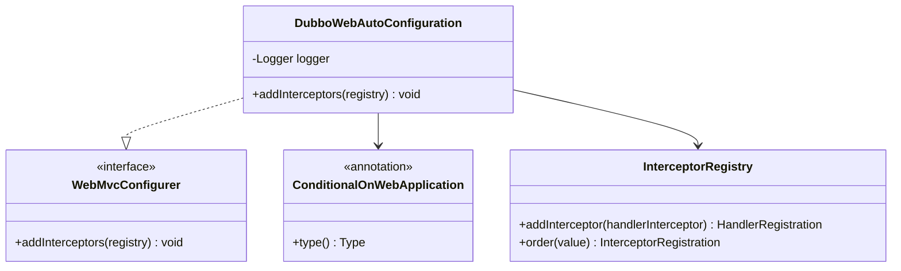
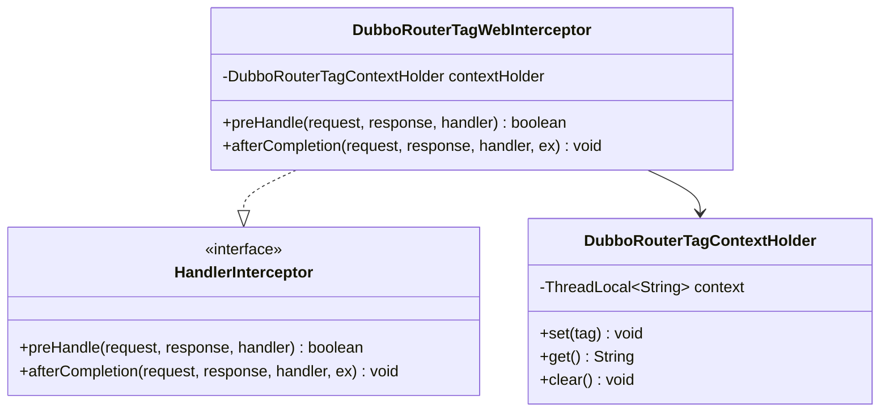
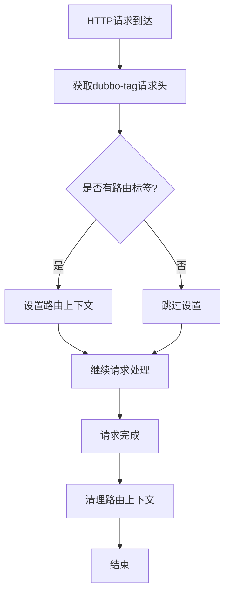
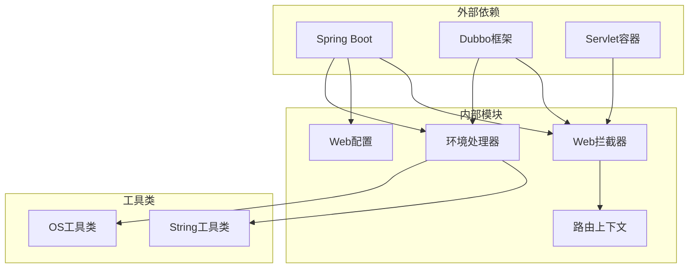

# Dubbo集成Starter

<cite>
**本文档引用的文件**
- [DubboEnvironmentPostProcessor.java](file://common/mall-spring-boot-starter-dubbo/src/main/java/cn/iocoder/mall/dubbo/config/DubboEnvironmentPostProcessor.java)
- [DubboWebAutoConfiguration.java](file://common/mall-spring-boot-starter-dubbo/src/main/java/cn/iocoder/mall/dubbo/config/DubboWebAutoConfiguration.java)
- [DubboRouterTagWebInterceptor.java](file://common/mall-spring-boot-starter-dubbo/src/main/java/cn/iocoder/mall/dubbo/core/web/DubboRouterTagWebInterceptor.java)
- [DubboRouterTagContextHolder.java](file://common/mall-spring-boot-starter-dubbo/src/main/java/cn/iocoder/mall/dubbo/core/router/DubboRouterTagContextHolder.java)
- [spring.factories](file://common/mall-spring-boot-starter-dubbo/src/main/resources/META-INF/spring.factories)
</cite>

## 目录
1. [简介](#简介)
2. [项目结构](#项目结构)
3. [核心组件](#核心组件)
4. [架构概览](#架构概览)
5. [详细组件分析](#详细组件分析)
6. [依赖关系分析](#依赖关系分析)
7. [性能考虑](#性能考虑)
8. [故障排除指南](#故障排除指南)
9. [结论](#结论)
10. [附录](#附录)

## 简介

Onemall项目的Dubbo集成Starter模块为微服务架构提供了完整的Dubbo集成解决方案。该模块通过自动配置机制简化了Dubbo在Spring Boot环境中的部署和使用，特别针对Onemall项目的业务需求进行了优化。

本模块的核心目标是：
- 提供自动化的Dubbo环境配置
- 实现基于路由标签的智能服务发现
- 支持异常处理和容错机制
- 简化微服务间的远程过程调用配置

## 项目结构

Dubbo集成Starter模块采用标准的Spring Boot Starter结构，主要包含以下核心组件：



**图表来源**
- [DubboEnvironmentPostProcessor.java:1-67](file://common/mall-spring-boot-starter-dubbo/src/main/java/cn/iocoder/mall/dubbo/config/DubboEnvironmentPostProcessor.java#L1-L67)
- [DubboWebAutoConfiguration.java:1-32](file://common/mall-spring-boot-starter-dubbo/src/main/java/cn/iocoder/mall/dubbo/config/DubboWebAutoConfiguration.java#L1-L32)
- [spring.factories:1-6](file://common/mall-spring-boot-starter-dubbo/src/main/resources/META-INF/spring.factories#L1-L6)

**章节来源**
- [DubboEnvironmentPostProcessor.java:1-67](file://common/mall-spring-boot-starter-dubbo/src/main/java/cn/iocoder/mall/dubbo/config/DubboEnvironmentPostProcessor.java#L1-L67)
- [DubboWebAutoConfiguration.java:1-32](file://common/mall-spring-boot-starter-dubbo/src/main/java/cn/iocoder/mall/dubbo/config/DubboWebAutoConfiguration.java#L1-L32)
- [spring.factories:1-6](file://common/mall-spring-boot-starter-dubbo/src/main/resources/META-INF/spring.factories#L1-L6)

## 核心组件

### 环境处理器 (DubboEnvironmentPostProcessor)

环境处理器负责在应用启动时动态生成和注入Dubbo相关的环境变量，特别是路由标签配置。

**主要功能：**
- 自动生成DUBBO_TAG环境变量
- 基于主机名生成稳定的路由标识
- 提供UUID作为回退方案
- 将配置注入到Spring Environment中

### Web自动配置 (DubboWebAutoConfiguration)

Web自动配置类实现了Spring MVC的WebMvcConfigurer接口，用于注册Dubbo相关的Web拦截器。

**核心特性：**
- 条件化Web应用配置
- 注册Dubbo路由标签Web拦截器
- 设置拦截器执行顺序
- 异常处理和日志记录

### 路由标签上下文管理

系统提供了完整的路由标签上下文管理机制，支持基于请求头的智能路由选择。

**章节来源**
- [DubboEnvironmentPostProcessor.java:16-45](file://common/mall-spring-boot-starter-dubbo/src/main/java/cn/iocoder/mall/dubbo/config/DubboEnvironmentPostProcessor.java#L16-L45)
- [DubboWebAutoConfiguration.java:12-31](file://common/mall-spring-boot-starter-dubbo/src/main/java/cn/iocoder/mall/dubbo/config/DubboWebAutoConfiguration.java#L12-L31)

## 架构概览

Dubbo集成Starter的整体架构采用分层设计，从底层的环境配置到上层的Web拦截，形成了完整的微服务调用链路。



**图表来源**
- [DubboEnvironmentPostProcessor.java:33-45](file://common/mall-spring-boot-starter-dubbo/src/main/java/cn/iocoder/mall/dubbo/config/DubboEnvironmentPostProcessor.java#L33-L45)
- [DubboRouterTagWebInterceptor.java:1-50](file://common/mall-spring-boot-starter-dubbo/src/main/java/cn/iocoder/mall/dubbo/core/web/DubboRouterTagWebInterceptor.java#L1-L50)
- [DubboRouterTagContextHolder.java:1-50](file://common/mall-spring-boot-starter-dubbo/src/main/java/cn/iocoder/mall/dubbo/core/router/DubboRouterTagContextHolder.java#L1-L50)

## 详细组件分析

### 环境处理器实现分析

环境处理器采用EnvironmentPostProcessor接口，确保在Spring应用上下文创建之前执行配置注入。



**图表来源**
- [DubboEnvironmentPostProcessor.java:21-67](file://common/mall-spring-boot-starter-dubbo/src/main/java/cn/iocoder/mall/dubbo/config/DubboEnvironmentPostProcessor.java#L21-L67)

**实现特点：**
- 使用主机名作为路由标签的基础
- 提供UUID回退机制确保唯一性
- 支持PropertySource的动态更新
- 采用最后添加策略避免覆盖现有配置

**章节来源**
- [DubboEnvironmentPostProcessor.java:33-67](file://common/mall-spring-boot-starter-dubbo/src/main/java/cn/iocoder/mall/dubbo/config/DubboEnvironmentPostProcessor.java#L33-L67)

### Web自动配置实现分析

Web自动配置类实现了WebMvcConfigurer接口，提供条件化的Web应用配置支持。



**图表来源**
- [DubboWebAutoConfiguration.java:12-32](file://common/mall-spring-boot-starter-dubbo/src/main/java/cn/iocoder/mall/dubbo/config/DubboWebAutoConfiguration.java#L12-L32)

**配置特性：**
- 条件化Web应用检测
- 低优先级拦截器注册（order=-1000）
- 异常安全处理机制
- 详细的日志记录

**章节来源**
- [DubboWebAutoConfiguration.java:18-31](file://common/mall-spring-boot-starter-dubbo/src/main/java/cn/iocoder/mall/dubbo/config/DubboWebAutoConfiguration.java#L18-L31)

### 路由标签上下文管理

路由标签上下文管理器提供了线程安全的路由标签存储和访问机制。



**图表来源**
- [DubboRouterTagContextHolder.java:1-50](file://common/mall-spring-boot-starter-dubbo/src/main/java/cn/iocoder/mall/dubbo/core/router/DubboRouterTagContextHolder.java#L1-L50)
- [DubboRouterTagWebInterceptor.java:1-50](file://common/mall-spring-boot-starter-dubbo/src/main/java/cn/iocoder/mall/dubbo/core/web/DubboRouterTagWebInterceptor.java#L1-L50)

**上下文管理流程：**



**图表来源**
- [DubboRouterTagWebInterceptor.java:1-50](file://common/mall-spring-boot-starter-dubbo/src/main/java/cn/iocoder/mall/dubbo/core/web/DubboRouterTagWebInterceptor.java#L1-L50)

**章节来源**
- [DubboRouterTagContextHolder.java:1-50](file://common/mall-spring-boot-starter-dubbo/src/main/java/cn/iocoder/mall/dubbo/core/router/DubboRouterTagContextHolder.java#L1-L50)
- [DubboRouterTagWebInterceptor.java:1-50](file://common/mall-spring-boot-starter-dubbo/src/main/java/cn/iocoder/mall/dubbo/core/web/DubboRouterTagWebInterceptor.java#L1-L50)

## 依赖关系分析

Dubbo集成Starter模块的依赖关系相对简洁，主要依赖于Spring Boot和Dubbo框架的核心功能。



**图表来源**
- [DubboEnvironmentPostProcessor.java:3-11](file://common/mall-spring-boot-starter-dubbo/src/main/java/cn/iocoder/mall/dubbo/config/DubboEnvironmentPostProcessor.java#L3-L11)
- [DubboWebAutoConfiguration.java:3-10](file://common/mall-spring-boot-starter-dubbo/src/main/java/cn/iocoder/mall/dubbo/config/DubboWebAutoConfiguration.java#L3-L10)

**依赖特性：**
- 最小化外部依赖
- 与Spring Boot无缝集成
- 与Dubbo版本兼容性良好
- 无循环依赖风险

**章节来源**
- [spring.factories:1-6](file://common/mall-spring-boot-starter-dubbo/src/main/resources/META-INF/spring.factories#L1-L6)

## 性能考虑

### 启动性能优化

环境处理器在应用启动阶段执行，对启动时间的影响极小：
- 单次主机名查询操作
- 内存中的字符串处理
- 不涉及网络I/O操作

### 运行时性能影响

Web拦截器的性能开销主要体现在：
- 每个请求的请求头读取
- ThreadLocal的上下文管理
- 简单的字符串比较操作

### 缓存策略

系统采用了适当的缓存策略来减少重复计算：
- 路由标签的线程本地存储
- 避免重复的环境变量解析
- 最小化的内存占用

## 故障排除指南

### 常见问题及解决方案

**问题1：路由标签无法正确设置**
- 检查dubbo-tag请求头是否正确传递
- 验证Web拦截器是否成功注册
- 查看应用日志中的拦截器加载信息

**问题2：环境变量未生效**
- 确认环境处理器是否在启动时执行
- 检查DUBBO_TAG属性是否正确注入
- 验证PropertySource的优先级设置

**问题3：Dubbo调用失败**
- 检查服务提供者是否正常注册
- 验证路由标签匹配规则
- 确认网络连接和防火墙设置

### 调试建议

**启用详细日志：**
- 在application.yml中设置日志级别
- 监控Dubbo相关的日志输出
- 使用调试模式验证配置加载

**性能监控：**
- 监控请求处理时间和错误率
- 分析路由标签的命中情况
- 评估拦截器对性能的影响

**章节来源**
- [DubboWebAutoConfiguration.java:26-28](file://common/mall-spring-boot-starter-dubbo/src/main/java/cn/iocoder/mall/dubbo/config/DubboWebAutoConfiguration.java#L26-L28)

## 结论

Onemall项目的Dubbo集成Starter模块通过精心设计的架构和实现，为微服务环境提供了可靠的Dubbo集成解决方案。该模块的主要优势包括：

1. **自动化配置**：通过环境处理器和自动配置类实现零配置部署
2. **智能路由**：基于路由标签的动态服务发现机制
3. **性能优化**：最小化的性能开销和高效的上下文管理
4. **易于维护**：清晰的代码结构和完善的错误处理机制

该模块为Onemall项目提供了坚实的微服务基础设施，支持未来的功能扩展和技术演进。

## 附录

### 配置示例

**application.yml配置示例：**
```yaml
# Dubbo基础配置
dubbo:
  application:
    name: ${spring.application.name}
  registry:
    address: nacos://127.0.0.1:8848
  protocol:
    name: dubbo
    port: 20880

# 自定义路由标签
dubbo:
  provider:
    tag: ${DUBBO_TAG:default}
```

### 最佳实践

**服务提供者配置：**
- 为每个服务实例设置唯一的路由标签
- 配置合理的超时和重试参数
- 实现完善的监控和日志记录

**服务消费者配置：**
- 启用智能路由和负载均衡
- 配置合适的容错策略
- 实现优雅降级和熔断机制

**运维建议：**
- 定期监控服务健康状态
- 建立完善的告警机制
- 制定应急响应预案