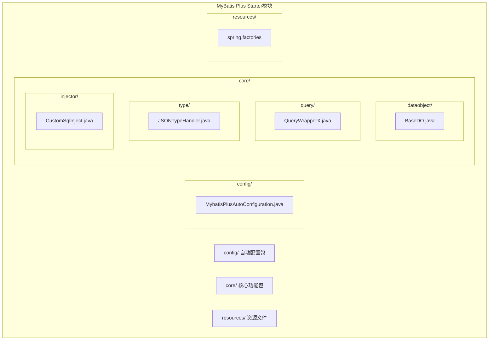
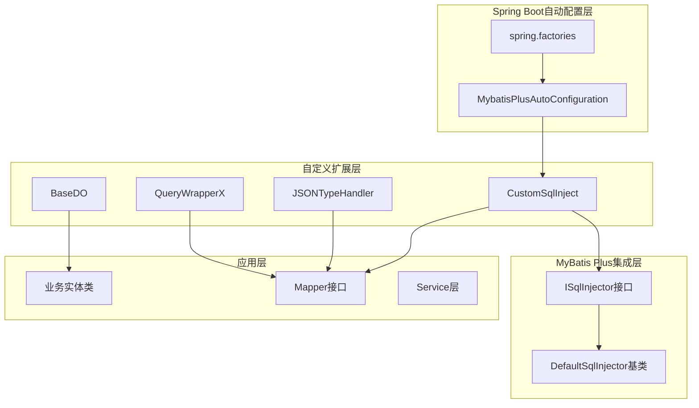
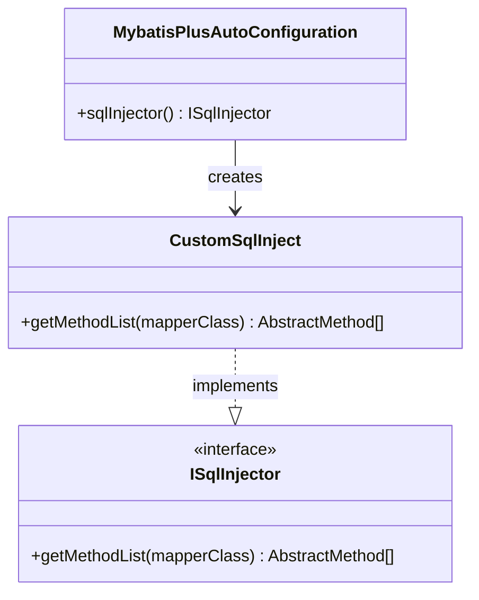
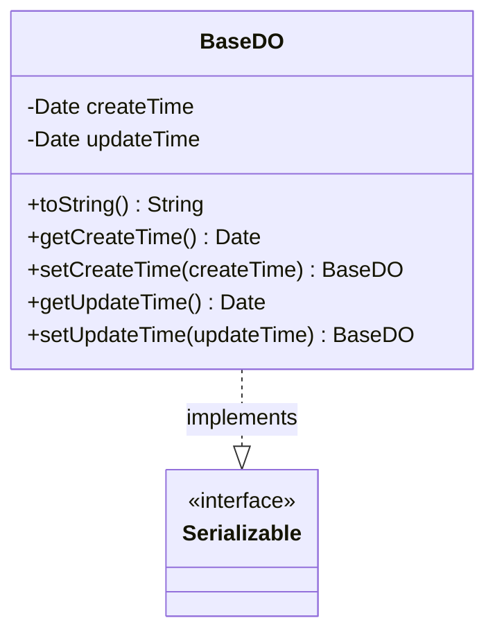
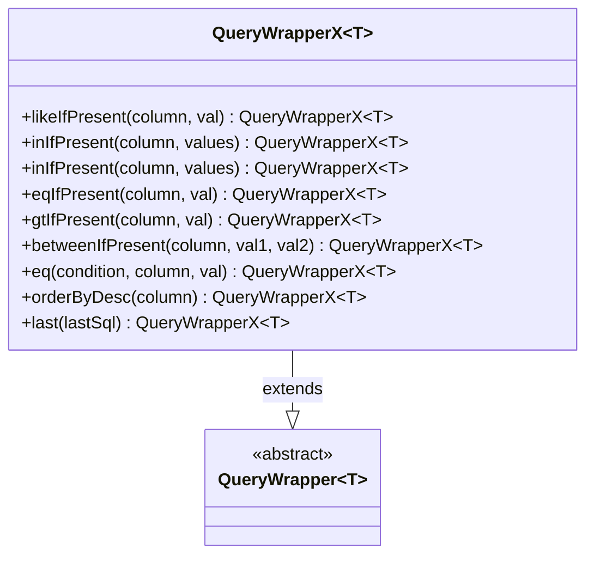
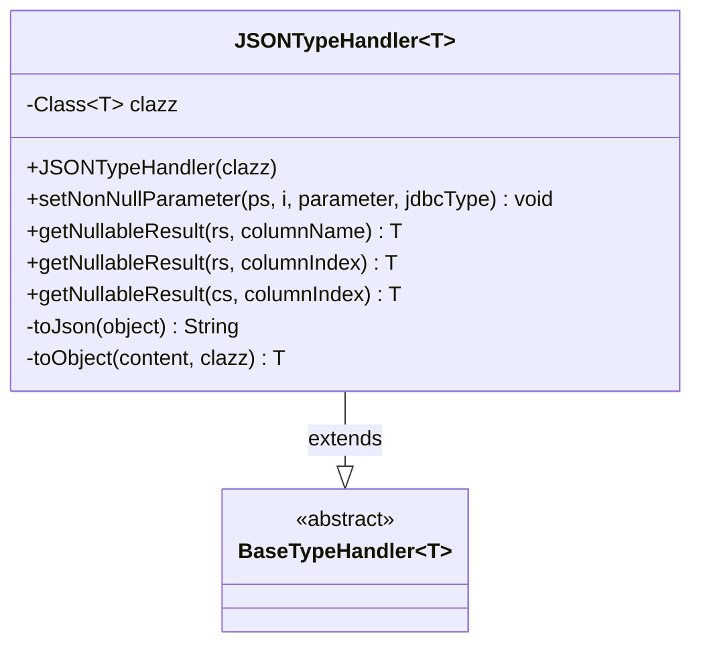
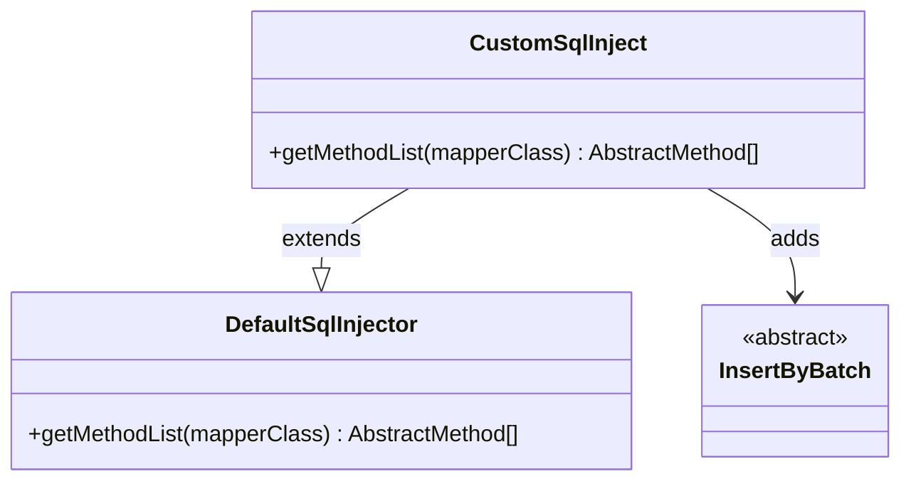
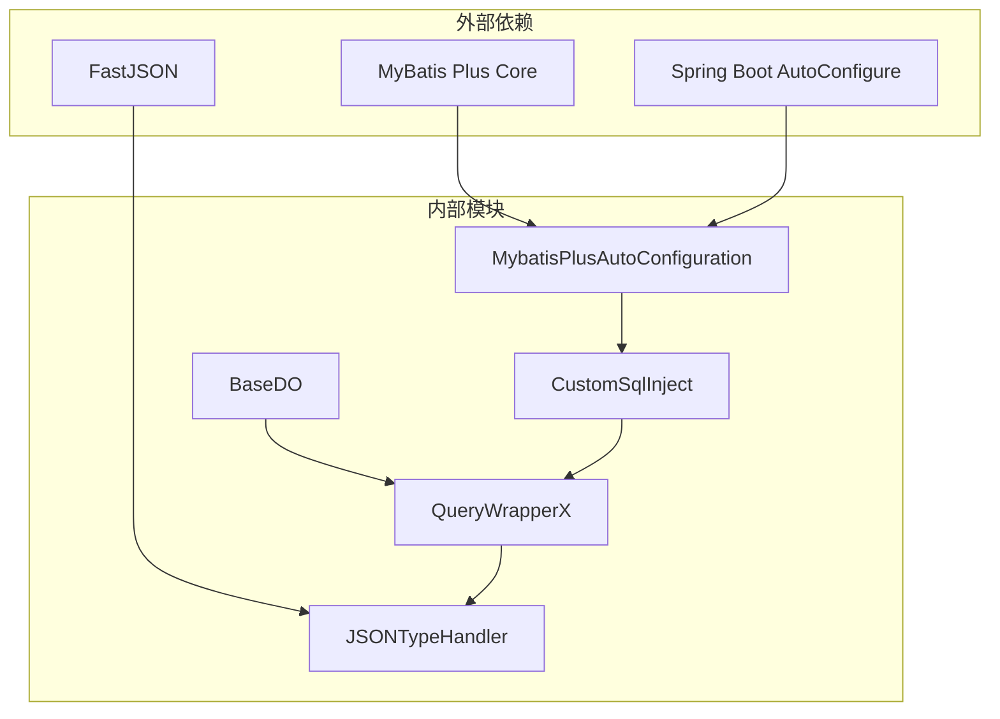

# MyBatis Plus自动配置Starter

<cite>
**本文档引用的文件**
- [MybatisPlusAutoConfiguration.java](file://common/mall-spring-boot-starter-mybatis/src/main/java/cn/iocoder/mall/mybatis/config/MybatisPlusAutoConfiguration.java)
- [spring.factories](file://common/mall-spring-boot-starter-mybatis/src/main/resources/META-INF/spring.factories)
- [BaseDO.java](file://common/mall-spring-boot-starter-mybatis/src/main/java/cn/iocoder/mall/mybatis/core/dataobject/BaseDO.java)
- [QueryWrapperX.java](file://common/mall-spring-boot-starter-mybatis/src/main/java/cn/iocoder/mall/mybatis/core/query/QueryWrapperX.java)
- [JSONTypeHandler.java](file://common/mall-spring-boot-starter-mybatis/src/main/java/cn/iocoder/mall/mybatis/core/type/JSONTypeHandler.java)
- [CustomSqlInject.java](file://common/mall-spring-boot-starter-mybatis/src/main/java/cn/iocoder/mall/mybatis/core/injector/CustomSqlInject.java)
</cite>

## 目录
1. [简介](#简介)
2. [项目结构](#项目结构)
3. [核心组件](#核心组件)
4. [架构概览](#架构概览)
5. [详细组件分析](#详细组件分析)
6. [依赖关系分析](#依赖关系分析)
7. [性能考虑](#性能考虑)
8. [故障排除指南](#故障排除指南)
9. [结论](#结论)

## 简介

Onemall项目的MyBatis Plus自动配置Starter模块是一个专门为Onemall框架设计的数据访问层基础设施。该模块基于Spring Boot自动配置机制，提供了MyBatis Plus的完整集成方案，包括自定义SQL注入器、基础实体类、查询包装器扩展和JSON类型处理器等核心组件。

本模块的主要目标是简化MyBatis Plus在Onemall项目中的使用，提供开箱即用的数据持久化解决方案，同时保持高度的可扩展性和易用性。

## 项目结构

MyBatis Plus自动配置Starter模块采用标准的Maven多模块结构，主要包含以下核心目录：

**图表来源**
- [MybatisPlusAutoConfiguration.java:1-24](file://common/mall-spring-boot-starter-mybatis/src/main/java/cn/iocoder/mall/mybatis/config/MybatisPlusAutoConfiguration.java#L1-L24)
- [BaseDO.java:1-46](file://common/mall-spring-boot-starter-mybatis/src/main/java/cn/iocoder/mall/mybatis/core/dataobject/BaseDO.java#L1-L46)
- [QueryWrapperX.java:1-94](file://common/mall-spring-boot-starter-mybatis/src/main/java/cn/iocoder/mall/mybatis/core/query/QueryWrapperX.java#L1-L94)

**章节来源**
- [MybatisPlusAutoConfiguration.java:1-24](file://common/mall-spring-boot-starter-mybatis/src/main/java/cn/iocoder/mall/mybatis/config/MybatisPlusAutoConfiguration.java#L1-L24)
- [spring.factories:1-2](file://common/mall-spring-boot-starter-mybatis/src/main/resources/META-INF/spring.factories#L1-L2)

## 核心组件

MyBatis Plus自动配置Starter模块包含以下核心组件：

### 自动配置类
- **MybatisPlusAutoConfiguration**: 主要的自动配置类，负责注册自定义的SQL注入器
- **ConditionalOnMissingBean**: 确保当用户自定义了ISqlInjector时不会被覆盖

### 基础实体类
- **BaseDO**: 所有实体类的基础类，提供统一的时间戳字段
- 包含创建时间和最后更新时间字段

### 查询包装器扩展
- **QueryWrapperX**: 基于MyBatis Plus QueryWrapper的扩展类
- 提供条件性查询方法（如likeIfPresent、inIfPresent等）
- 支持链式调用和更灵活的查询构建

### 类型处理器
- **JSONTypeHandler**: 自定义JSON类型处理器
- 支持任意Java对象与JSON字符串之间的转换
- 基于FastJSON库实现序列化和反序列化

### SQL注入器
- **CustomSqlInject**: 自定义SQL注入器
- 扩展默认的SQL注入器，添加批量插入方法
- 继承DefaultSqlInjector并重写方法列表

**章节来源**
- [BaseDO.java:1-46](file://common/mall-spring-boot-starter-mybatis/src/main/java/cn/iocoder/mall/mybatis/core/dataobject/BaseDO.java#L1-L46)
- [QueryWrapperX.java:1-94](file://common/mall-spring-boot-starter-mybatis/src/main/java/cn/iocoder/mall/mybatis/core/query/QueryWrapperX.java#L1-L94)
- [JSONTypeHandler.java:1-71](file://common/mall-spring-boot-starter-mybatis/src/main/java/cn/iocoder/mall/mybatis/core/type/JSONTypeHandler.java#L1-L71)
- [CustomSqlInject.java:1-24](file://common/mall-spring-boot-starter-mybatis/src/main/java/cn/iocoder/mall/mybatis/core/injector/CustomSqlInject.java#L1-L24)

## 架构概览

MyBatis Plus自动配置Starter模块的整体架构采用分层设计，确保各组件之间的松耦合和高内聚：

**图表来源**
- [MybatisPlusAutoConfiguration.java:18-22](file://common/mall-spring-boot-starter-mybatis/src/main/java/cn/iocoder/mall/mybatis/config/MybatisPlusAutoConfiguration.java#L18-L22)
- [CustomSqlInject.java:14-21](file://common/mall-spring-boot-starter-mybatis/src/main/java/cn/iocoder/mall/mybatis/core/injector/CustomSqlInject.java#L14-L21)

该架构设计遵循以下原则：
- **开闭原则**: 对扩展开放，对修改关闭
- **依赖倒置**: 高层模块不依赖低层模块
- **单一职责**: 每个组件都有明确的职责边界

## 详细组件分析

### 自动配置机制

MyBatis Plus自动配置类实现了Spring Boot的自动配置机制，通过条件注解确保配置的灵活性：

**图表来源**
- [MybatisPlusAutoConfiguration.java:18-22](file://common/mall-spring-boot-starter-mybatis/src/main/java/cn/iocoder/mall/mybatis/config/MybatisPlusAutoConfiguration.java#L18-L22)
- [CustomSqlInject.java:14-21](file://common/mall-spring-boot-starter-mybatis/src/main/java/cn/iocoder/mall/mybatis/core/injector/CustomSqlInject.java#L14-L21)

**章节来源**
- [MybatisPlusAutoConfiguration.java:12-23](file://common/mall-spring-boot-starter-mybatis/src/main/java/cn/iocoder/mall/mybatis/config/MybatisPlusAutoConfiguration.java#L12-L23)

### BaseDO基础实体类设计理念

BaseDO作为所有实体类的基础类，采用了简单而实用的设计理念：

**图表来源**
- [BaseDO.java:9-45](file://common/mall-spring-boot-starter-mybatis/src/main/java/cn/iocoder/mall/mybatis/core/dataobject/BaseDO.java#L9-L45)

BaseDO的设计特点：
- **统一性**: 所有实体共享相同的创建和更新时间字段
- **可序列化**: 实现Serializable接口，支持网络传输和缓存
- **简洁性**: 字段数量最少化，避免不必要的复杂性

**章节来源**
- [BaseDO.java:1-46](file://common/mall-spring-boot-starter-mybatis/src/main/java/cn/iocoder/mall/mybatis/core/dataobject/BaseDO.java#L1-L46)

### QueryWrapperX查询包装器使用方法

QueryWrapperX是对MyBatis Plus QueryWrapper的增强扩展，提供了条件性查询方法：

**图表来源**
- [QueryWrapperX.java:17-93](file://common/mall-spring-boot-starter-mybatis/src/main/java/cn/iocoder/mall/mybatis/core/query/QueryWrapperX.java#L17-L93)

QueryWrapperX的核心特性：
- **条件性查询**: 提供IfPresent后缀的方法，自动处理空值情况
- **链式调用**: 所有方法都返回QueryWrapperX实例，支持流畅的API调用
- **智能判断**: 使用StringUtils.hasText()和CollectionUtils.isEmpty()等工具方法

**章节来源**
- [QueryWrapperX.java:10-94](file://common/mall-spring-boot-starter-mybatis/src/main/java/cn/iocoder/mall/mybatis/core/query/QueryWrapperX.java#L10-L94)

### JSONTypeHandler自定义类型处理器实现

JSONTypeHandler实现了MyBatis的BaseTypeHandler接口，提供JSON格式的类型转换：

**图表来源**
- [JSONTypeHandler.java:21-70](file://common/mall-spring-boot-starter-mybatis/src/main/java/cn/iocoder/mall/mybatis/core/type/JSONTypeHandler.java#L21-L70)

JSONTypeHandler的实现要点：
- **泛型支持**: 支持任意Java对象类型的JSON序列化
- **异常处理**: 在序列化和反序列化过程中提供完善的错误处理
- **FastJSON集成**: 基于阿里巴巴FastJSON库实现高效的JSON转换

**章节来源**
- [JSONTypeHandler.java:1-71](file://common/mall-spring-boot-starter-mybatis/src/main/java/cn/iocoder/mall/mybatis/core/type/JSONTypeHandler.java#L1-L71)

### 自定义SQL注入器扩展

CustomSqlInject扩展了MyBatis Plus的默认SQL注入器，添加了批量插入功能：

**图表来源**
- [CustomSqlInject.java:14-23](file://common/mall-spring-boot-starter-mybatis/src/main/java/cn/iocoder/mall/mybatis/core/injector/CustomSqlInject.java#L14-L23)

CustomSqlInject的设计优势：
- **向后兼容**: 保持与默认SQL注入器的完全兼容性
- **功能扩展**: 通过添加InsertByBatch方法提供批量插入能力
- **易于维护**: 代码简洁，逻辑清晰，便于后续扩展

**章节来源**
- [CustomSqlInject.java:1-24](file://common/mall-spring-boot-starter-mybatis/src/main/java/cn/iocoder/mall/mybatis/core/injector/CustomSqlInject.java#L1-L24)

## 依赖关系分析

MyBatis Plus自动配置Starter模块的依赖关系相对简单，主要依赖于MyBatis Plus框架：

**图表来源**
- [spring.factories:1-2](file://common/mall-spring-boot-starter-mybatis/src/main/resources/META-INF/spring.factories#L1-L2)
- [JSONTypeHandler.java:3](file://common/mall-spring-boot-starter-mybatis/src/main/java/cn/iocoder/mall/mybatis/core/type/JSONTypeHandler.java#L3)

依赖关系特点：
- **低耦合**: 内部组件之间依赖关系简单清晰
- **向上依赖**: 外部依赖都是框架级别的，保证了稳定性
- **可替换性**: 通过接口抽象，便于替换底层实现

**章节来源**
- [spring.factories:1-2](file://common/mall-spring-boot-starter-mybatis/src/main/resources/META-INF/spring.factories#L1-L2)

## 性能考虑

在设计和实现过程中，MyBatis Plus自动配置Starter模块充分考虑了性能因素：

### 内存优化
- **轻量级设计**: 所有组件都采用最小必要的字段和方法
- **延迟初始化**: 通过Spring条件注解实现按需加载
- **对象复用**: QueryWrapperX支持链式调用，减少临时对象创建

### 序列化性能
- **FastJSON选择**: 基于阿里巴巴FastJSON库，提供高性能的JSON序列化
- **异常优化**: 在序列化失败时提供清晰的错误信息，便于问题定位
- **空值处理**: 智能处理null值，避免不必要的序列化操作

### 数据库交互优化
- **条件性查询**: QueryWrapperX的IfPresent方法避免生成无效的SQL条件
- **批量操作**: CustomSqlInject提供的批量插入功能减少数据库往返次数
- **类型安全**: JSONTypeHandler确保类型转换的正确性和安全性

## 故障排除指南

### 常见问题及解决方案

**问题1: 自定义SQL注入器未生效**
- **原因**: 用户可能已经定义了自己的ISqlInjector Bean
- **解决方案**: 检查是否存在@Primary注解的自定义注入器，或移除冲突的配置

**问题2: JSON类型转换异常**
- **原因**: FastJSON序列化失败或类型不匹配
- **解决方案**: 检查实体类的getter/setter方法，确保对象可序列化

**问题3: QueryWrapperX查询结果为空**
- **原因**: 条件性查询方法在参数为空时会跳过条件
- **解决方案**: 确认传入参数的有效性，或使用非条件性查询方法

**问题4: BaseDO时间字段异常**
- **原因**: 数据库表缺少对应的时间戳字段
- **解决方案**: 确保数据库表结构包含create_time和update_time字段

**章节来源**
- [MybatisPlusAutoConfiguration.java:4-6](file://common/mall-spring-boot-starter-mybatis/src/main/java/cn/iocoder/mall/mybatis/config/MybatisPlusAutoConfiguration.java#L4-L6)
- [JSONTypeHandler.java:50-68](file://common/mall-spring-boot-starter-mybatis/src/main/java/cn/iocoder/mall/mybatis/core/type/JSONTypeHandler.java#L50-L68)

## 结论

MyBatis Plus自动配置Starter模块为Onemall项目提供了一个完整、稳定且易于使用的数据访问层解决方案。通过精心设计的组件架构和实用的功能扩展，该模块显著提升了开发效率和代码质量。

### 主要优势
- **开箱即用**: 基于Spring Boot自动配置，无需复杂的XML配置
- **功能丰富**: 提供查询包装器扩展、JSON类型处理器等实用功能
- **易于扩展**: 清晰的架构设计便于添加新的功能和特性
- **性能优化**: 在设计阶段充分考虑了性能因素

### 未来发展方向
- **监控集成**: 可以考虑集成MyBatis Plus的SQL执行监控功能
- **缓存支持**: 添加二级缓存支持，提升查询性能
- **分布式事务**: 扩展对分布式事务的支持
- **更多类型处理器**: 添加对其他常用数据类型的处理支持

该模块的成功实施为Onemall项目的整体架构奠定了坚实的数据访问基础，为后续的功能扩展和性能优化提供了良好的平台。