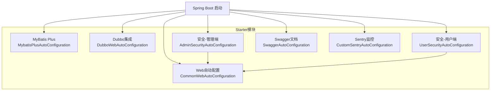
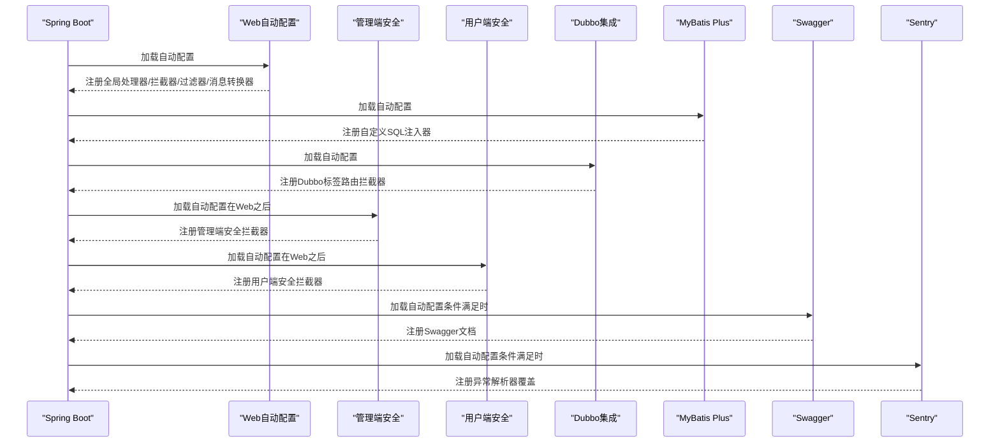
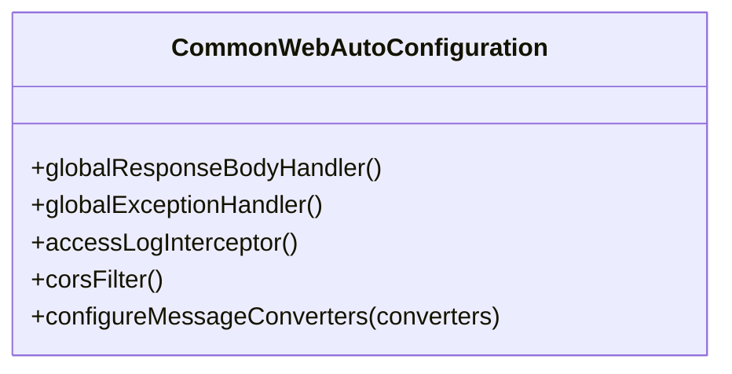
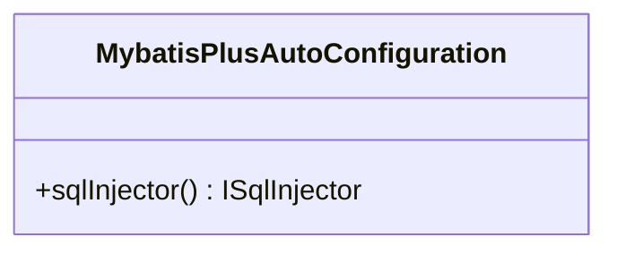
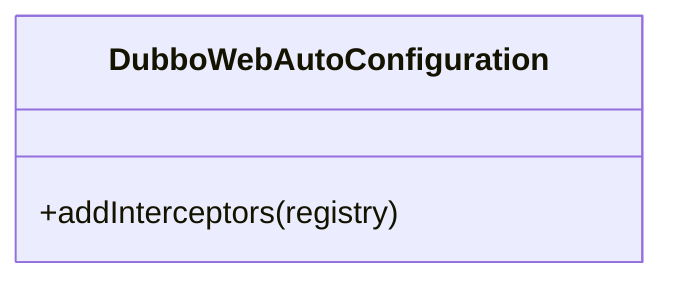
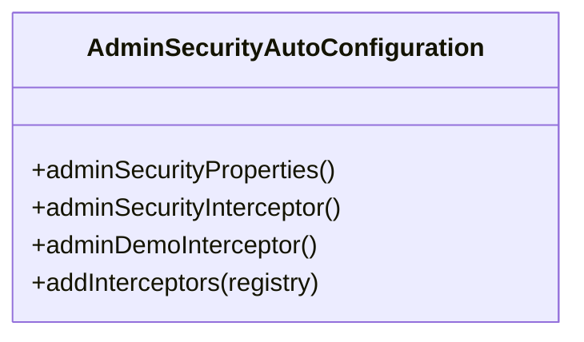
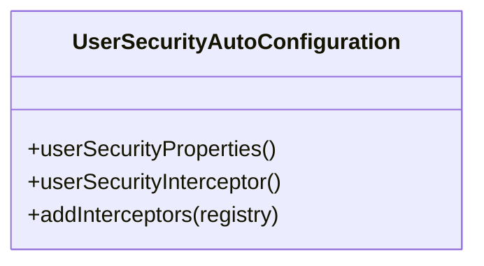
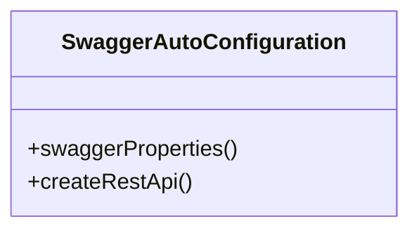
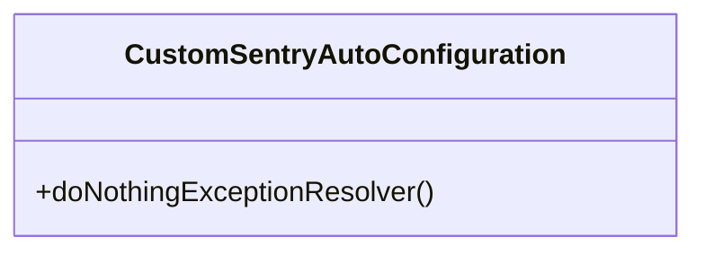
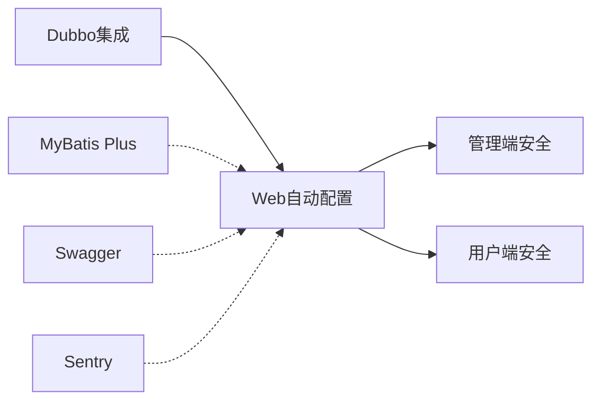

# Spring Boot Starter模块

<cite>
**本文档引用的文件**
- [spring.factories（Web）](file://common/mall-spring-boot-starter-web/src/main/resources/META-INF/spring.factories)
- [CommonWebAutoConfiguration.java](file://common/mall-spring-boot-starter-web/src/main/java/cn/iocoder/mall/web/config/CommonWebAutoConfiguration.java)
- [spring.factories（MyBatis）](file://common/mall-spring-boot-starter-mybatis/src/main/resources/META-INF/spring.factories)
- [MybatisPlusAutoConfiguration.java](file://common/mall-spring-boot-starter-mybatis/src/main/java/cn/iocoder/mall/mybatis/config/MybatisPlusAutoConfiguration.java)
- [spring.factories（Dubbo）](file://common/mall-spring-boot-starter-dubbo/src/main/resources/META-INF/spring.factories)
- [DubboWebAutoConfiguration.java](file://common/mall-spring-boot-starter-dubbo/src/main/java/cn/iocoder/mall/dubbo/config/DubboWebAutoConfiguration.java)
- [spring.factories（安全-管理端）](file://common/mall-spring-boot-starter-security-admin/src/main/resources/META-INF/spring.factories)
- [AdminSecurityAutoConfiguration.java](file://common/mall-spring-boot-starter-security-admin/src/main/java/cn/iocoder/mall/security/admin/config/AdminSecurityAutoConfiguration.java)
- [spring.factories（安全-用户端）](file://common/mall-spring-boot-starter-security-user/src/main/resources/META-INF/spring.factories)
- [UserSecurityAutoConfiguration.java](file://common/mall-spring-boot-starter-security-user/src/main/java/cn/iocoder/mall/security/user/config/UserSecurityAutoConfiguration.java)
- [spring.factories（Swagger）](file://common/mall-spring-boot-starter-swagger/src/main/resources/META-INF/spring.factories)
- [SwaggerAutoConfiguration.java](file://common/mall-spring-boot-starter-swagger/src/main/java/cn/iocoder/mall/swagger/config/SwaggerAutoConfiguration.java)
- [spring.factories（Sentry）](file://common/mall-spring-boot-starter-sentry/src/main/resources/META-INF/spring.factories)
- [CustomSentryAutoConfiguration.java](file://common/mall-spring-boot-starter-sentry/src/main/java/cn/iocoder/mall/sentry/config/CustomSentryAutoConfiguration.java)
</cite>

## 目录
1. [引言](#引言)
2. [项目结构](#项目结构)
3. [核心组件](#核心组件)
4. [架构总览](#架构总览)
5. [详细组件分析](#详细组件分析)
6. [依赖分析](#依赖分析)
7. [性能考量](#性能考量)
8. [故障排查指南](#故障排查指南)
9. [结论](#结论)
10. [附录](#附录)

## 引言
本文件面向Onemall项目的Spring Boot Starter模块，系统性梳理各Starter的设计理念与实现原理，覆盖Web自动配置、MyBatis Plus配置、Dubbo集成、安全认证（管理端/用户端）、Sentry错误监控等模块。文档从自动配置类与核心组件入手，解释如何通过配置文件启用与定制功能，并给出在不同环境下的配置建议与兼容性注意事项，帮助开发者快速构建稳定可靠的微服务应用。

## 项目结构
Onemall将通用能力封装为多个独立的starter模块，每个模块通过META-INF/spring.factories声明自动配置类，Spring Boot在启动时按需加载。核心模块包括：
- Web自动配置：统一响应包装、全局异常处理、跨域过滤、消息转换器（Fastjson）
- MyBatis Plus：自定义SQL注入器扩展
- Dubbo：Web拦截器（标签路由）、环境后处理器
- 安全认证：管理端与用户端拦截器链，基于路径白名单与演示模式
- Swagger：Knife4j增强的Swagger2文档
- Sentry：异常解析器覆盖，避免重复上报

图表来源
- [CommonWebAutoConfiguration.java:30-96](file://common/mall-spring-boot-starter-web/src/main/java/cn/iocoder/mall/web/config/CommonWebAutoConfiguration.java#L30-L96)
- [MybatisPlusAutoConfiguration.java:12-23](file://common/mall-spring-boot-starter-mybatis/src/main/java/cn/iocoder/mall/mybatis/config/MybatisPlusAutoConfiguration.java#L12-L23)
- [DubboWebAutoConfiguration.java:14-31](file://common/mall-spring-boot-starter-dubbo/src/main/java/cn/iocoder/mall/dubbo/config/DubboWebAutoConfiguration.java#L14-L31)
- [AdminSecurityAutoConfiguration.java:21-60](file://common/mall-spring-boot-starter-security-admin/src/main/java/cn/iocoder/mall/security/admin/config/AdminSecurityAutoConfiguration.java#L21-L60)
- [UserSecurityAutoConfiguration.java:20-47](file://common/mall-spring-boot-starter-security-user/src/main/java/cn/iocoder/mall/security/user/config/UserSecurityAutoConfiguration.java#L20-L47)
- [SwaggerAutoConfiguration.java:29-57](file://common/mall-spring-boot-starter-swagger/src/main/java/cn/iocoder/mall/swagger/config/SwaggerAutoConfiguration.java#L29-L57)
- [CustomSentryAutoConfiguration.java:24-39](file://common/mall-spring-boot-starter-sentry/src/main/java/cn/iocoder/mall/sentry/config/CustomSentryAutoConfiguration.java#L24-L39)

章节来源
- [spring.factories（Web）:1-3](file://common/mall-spring-boot-starter-web/src/main/resources/META-INF/spring.factories#L1-L3)
- [spring.factories（MyBatis）:1-2](file://common/mall-spring-boot-starter-mybatis/src/main/resources/META-INF/spring.factories#L1-L2)
- [spring.factories（Dubbo）:1-6](file://common/mall-spring-boot-starter-dubbo/src/main/resources/META-INF/spring.factories#L1-L6)
- [spring.factories（安全-管理端）:1-3](file://common/mall-spring-boot-starter-security-admin/src/main/resources/META-INF/spring.factories#L1-L3)
- [spring.factories（安全-用户端）:1-3](file://common/mall-spring-boot-starter-security-user/src/main/resources/META-INF/spring.factories#L1-L3)
- [spring.factories（Swagger）:1-3](file://common/mall-spring-boot-starter-swagger/src/main/resources/META-INF/spring.factories#L1-L3)
- [spring.factories（Sentry）:1-3](file://common/mall-spring-boot-starter-sentry/src/main/resources/META-INF/spring.factories#L1-L3)

## 核心组件
- Web自动配置：提供全局响应包装、全局异常处理、访问日志拦截、跨域过滤、Fastjson消息转换器注册。
- MyBatis Plus：注册自定义SQL注入器，扩展通用方法。
- Dubbo：注册Web拦截器以支持基于请求头的标签路由，提升调用链路治理能力。
- 安全认证：管理端与用户端分别提供拦截器，支持忽略路径、默认忽略路径与演示模式开关。
- Swagger：基于Knife4j增强的Swagger2文档，支持通过属性控制启用与包扫描范围。
- Sentry：在存在Sentry场景下，提供空实现的异常解析器以避免重复上报。

章节来源
- [CommonWebAutoConfiguration.java:30-96](file://common/mall-spring-boot-starter-web/src/main/java/cn/iocoder/mall/web/config/CommonWebAutoConfiguration.java#L30-L96)
- [MybatisPlusAutoConfiguration.java:12-23](file://common/mall-spring-boot-starter-mybatis/src/main/java/cn/iocoder/mall/mybatis/config/MybatisPlusAutoConfiguration.java#L12-L23)
- [DubboWebAutoConfiguration.java:14-31](file://common/mall-spring-boot-starter-dubbo/src/main/java/cn/iocoder/mall/dubbo/config/DubboWebAutoConfiguration.java#L14-L31)
- [AdminSecurityAutoConfiguration.java:21-60](file://common/mall-spring-boot-starter-security-admin/src/main/java/cn/iocoder/mall/security/admin/config/AdminSecurityAutoConfiguration.java#L21-L60)
- [UserSecurityAutoConfiguration.java:20-47](file://common/mall-spring-boot-starter-security-user/src/main/java/cn/iocoder/mall/security/user/config/UserSecurityAutoConfiguration.java#L20-L47)
- [SwaggerAutoConfiguration.java:29-57](file://common/mall-spring-boot-starter-swagger/src/main/java/cn/iocoder/mall/swagger/config/SwaggerAutoConfiguration.java#L29-L57)
- [CustomSentryAutoConfiguration.java:24-39](file://common/mall-spring-boot-starter-sentry/src/main/java/cn/iocoder/mall/sentry/config/CustomSentryAutoConfiguration.java#L24-L39)

## 架构总览
下图展示了Starter模块在Spring Boot启动过程中的装配关系与依赖顺序：

图表来源
- [CommonWebAutoConfiguration.java:30-96](file://common/mall-spring-boot-starter-web/src/main/java/cn/iocoder/mall/web/config/CommonWebAutoConfiguration.java#L30-L96)
- [AdminSecurityAutoConfiguration.java:18-60](file://common/mall-spring-boot-starter-security-admin/src/main/java/cn/iocoder/mall/security/admin/config/AdminSecurityAutoConfiguration.java#L18-L60)
- [UserSecurityAutoConfiguration.java:17-47](file://common/mall-spring-boot-starter-security-user/src/main/java/cn/iocoder/mall/security/user/config/UserSecurityAutoConfiguration.java#L17-L47)
- [DubboWebAutoConfiguration.java:14-31](file://common/mall-spring-boot-starter-dubbo/src/main/java/cn/iocoder/mall/dubbo/config/DubboWebAutoConfiguration.java#L14-L31)
- [MybatisPlusAutoConfiguration.java:12-23](file://common/mall-spring-boot-starter-mybatis/src/main/java/cn/iocoder/mall/mybatis/config/MybatisPlusAutoConfiguration.java#L12-L23)
- [SwaggerAutoConfiguration.java:29-57](file://common/mall-spring-boot-starter-swagger/src/main/java/cn/iocoder/mall/swagger/config/SwaggerAutoConfiguration.java#L29-L57)
- [CustomSentryAutoConfiguration.java:24-39](file://common/mall-spring-boot-starter-sentry/src/main/java/cn/iocoder/mall/sentry/config/CustomSentryAutoConfiguration.java#L24-L39)

## 详细组件分析

### Web自动配置（统一响应、异常、跨域、消息转换）
- 设计要点
  - 条件化装配：仅在Servlet Web环境下生效
  - 全局响应包装与异常处理：提供统一返回结构与错误码
  - 访问日志拦截：可选依赖系统日志RPC时启用
  - 跨域过滤：注册全局CORS过滤器
  - 消息转换器：优先注册Fastjson，规避特定序列化问题
- 关键点
  - 拦截器注册顺序：通过try-catch容错，避免缺失依赖导致启动失败
  - 消息转换器插入到首位，确保优先于Jackson等转换器
- 使用建议
  - 如需自定义全局响应或异常行为，可通过替换对应Bean的方式进行扩展

图表来源
- [CommonWebAutoConfiguration.java:30-96](file://common/mall-spring-boot-starter-web/src/main/java/cn/iocoder/mall/web/config/CommonWebAutoConfiguration.java#L30-L96)

章节来源
- [CommonWebAutoConfiguration.java:30-96](file://common/mall-spring-boot-starter-web/src/main/java/cn/iocoder/mall/web/config/CommonWebAutoConfiguration.java#L30-L96)
- [spring.factories（Web）:1-3](file://common/mall-spring-boot-starter-web/src/main/resources/META-INF/spring.factories#L1-L3)

### MyBatis Plus自动配置（自定义SQL注入器）
- 设计要点
  - 条件化Bean：当容器中不存在ISqlInjector时，注册自定义注入器
  - 扩展通用方法：为通用Mapper提供更丰富的SQL注入能力
- 使用建议
  - 若已有自定义注入器，可通过排除当前Bean或调整条件避免冲突

图表来源
- [MybatisPlusAutoConfiguration.java:12-23](file://common/mall-spring-boot-starter-mybatis/src/main/java/cn/iocoder/mall/mybatis/config/MybatisPlusAutoConfiguration.java#L12-L23)

章节来源
- [MybatisPlusAutoConfiguration.java:12-23](file://common/mall-spring-boot-starter-mybatis/src/main/java/cn/iocoder/mall/mybatis/config/MybatisPlusAutoConfiguration.java#L12-L23)
- [spring.factories（MyBatis）:1-2](file://common/mall-spring-boot-starter-mybatis/src/main/resources/META-INF/spring.factories#L1-L2)

### Dubbo集成（Web标签路由拦截器）
- 设计要点
  - 条件化装配：仅在Servlet Web环境下生效
  - 拦截器优先级：设置较低order值，确保在认证等拦截器之前执行
  - 日志提示：未获取到拦截器时输出warn日志，便于诊断
- 使用建议
  - 通过请求头携带标签信息，结合Dubbo路由策略实现灰度/隔离流量

图表来源
- [DubboWebAutoConfiguration.java:14-31](file://common/mall-spring-boot-starter-dubbo/src/main/java/cn/iocoder/mall/dubbo/config/DubboWebAutoConfiguration.java#L14-L31)

章节来源
- [DubboWebAutoConfiguration.java:14-31](file://common/mall-spring-boot-starter-dubbo/src/main/java/cn/iocoder/mall/dubbo/config/DubboWebAutoConfiguration.java#L14-L31)
- [spring.factories（Dubbo）:1-6](file://common/mall-spring-boot-starter-dubbo/src/main/resources/META-INF/spring.factories#L1-L6)

### 安全认证（管理端）
- 设计要点
  - 依赖顺序：在Web自动配置之后装配，保证拦截器顺序
  - 属性驱动：支持忽略路径、默认忽略路径、演示模式
  - 可插拔：若已存在同名Bean则跳过注册
- 使用建议
  - 演示模式开启后会额外注册演示拦截器，适合测试环境

图表来源
- [AdminSecurityAutoConfiguration.java:21-60](file://common/mall-spring-boot-starter-security-admin/src/main/java/cn/iocoder/mall/security/admin/config/AdminSecurityAutoConfiguration.java#L21-L60)

章节来源
- [AdminSecurityAutoConfiguration.java:21-60](file://common/mall-spring-boot-starter-security-admin/src/main/java/cn/iocoder/mall/security/admin/config/AdminSecurityAutoConfiguration.java#L21-L60)
- [spring.factories（安全-管理端）:1-3](file://common/mall-spring-boot-starter-security-admin/src/main/resources/META-INF/spring.factories#L1-L3)

### 安全认证（用户端）
- 设计要点
  - 与管理端类似，但无演示拦截器
  - 支持忽略路径与默认忽略路径配置
- 使用建议
  - 将登录、注册等接口加入忽略路径，减少不必要的鉴权开销

图表来源
- [UserSecurityAutoConfiguration.java:20-47](file://common/mall-spring-boot-starter-security-user/src/main/java/cn/iocoder/mall/security/user/config/UserSecurityAutoConfiguration.java#L20-L47)

章节来源
- [UserSecurityAutoConfiguration.java:20-47](file://common/mall-spring-boot-starter-security-user/src/main/java/cn/iocoder/mall/security/user/config/UserSecurityAutoConfiguration.java#L20-L47)
- [spring.factories（安全-用户端）:1-3](file://common/mall-spring-boot-starter-security-user/src/main/resources/META-INF/spring.factories#L1-L3)

### Swagger文档（Knife4j增强）
- 设计要点
  - 条件化启用：通过属性控制是否启用
  - 包扫描：基于属性指定基础包路径
  - 文档元信息：标题、描述、版本由属性提供
- 使用建议
  - 生产环境建议关闭或限制访问，避免敏感信息泄露

图表来源
- [SwaggerAutoConfiguration.java:29-57](file://common/mall-spring-boot-starter-swagger/src/main/java/cn/iocoder/mall/swagger/config/SwaggerAutoConfiguration.java#L29-L57)

章节来源
- [SwaggerAutoConfiguration.java:29-57](file://common/mall-spring-boot-starter-swagger/src/main/java/cn/iocoder/mall/swagger/config/SwaggerAutoConfiguration.java#L29-L57)
- [spring.factories（Swagger）:1-3](file://common/mall-spring-boot-starter-swagger/src/main/resources/META-INF/spring.factories#L1-L3)

### Sentry异常监控
- 设计要点
  - 条件化装配：仅在存在相关类且属性开启时生效
  - Bean覆盖：在存在Sentry自动配置时，注册空实现异常解析器以避免重复上报
- 使用建议
  - 结合全局异常处理与日志采集，统一错误上报策略

图表来源
- [CustomSentryAutoConfiguration.java:24-39](file://common/mall-spring-boot-starter-sentry/src/main/java/cn/iocoder/mall/sentry/config/CustomSentryAutoConfiguration.java#L24-L39)

章节来源
- [CustomSentryAutoConfiguration.java:24-39](file://common/mall-spring-boot-starter-sentry/src/main/java/cn/iocoder/mall/sentry/config/CustomSentryAutoConfiguration.java#L24-L39)
- [spring.factories（Sentry）:1-3](file://common/mall-spring-boot-starter-sentry/src/main/resources/META-INF/spring.factories#L1-L3)

## 依赖分析
- 装配顺序
  - Web自动配置为其他模块提供基础能力（拦截器、过滤器、消息转换器）
  - 安全模块在Web之后装配，确保拦截器顺序合理
  - Swagger与Sentry按条件装配，互不影响
- 模块间耦合
  - Web是公共基础，安全模块依赖其拦截器体系
  - Swagger与Sentry对Web无直接依赖，但均受条件属性控制
- 兼容性
  - 条件注解广泛使用，避免在缺少依赖时启动失败
  - 拦截器注册采用容错处理，增强运行时稳定性

图表来源
- [CommonWebAutoConfiguration.java:30-96](file://common/mall-spring-boot-starter-web/src/main/java/cn/iocoder/mall/web/config/CommonWebAutoConfiguration.java#L30-L96)
- [AdminSecurityAutoConfiguration.java:18-60](file://common/mall-spring-boot-starter-security-admin/src/main/java/cn/iocoder/mall/security/admin/config/AdminSecurityAutoConfiguration.java#L18-L60)
- [UserSecurityAutoConfiguration.java:17-47](file://common/mall-spring-boot-starter-security-user/src/main/java/cn/iocoder/mall/security/user/config/UserSecurityAutoConfiguration.java#L17-L47)
- [DubboWebAutoConfiguration.java:14-31](file://common/mall-spring-boot-starter-dubbo/src/main/java/cn/iocoder/mall/dubbo/config/DubboWebAutoConfiguration.java#L14-L31)
- [MybatisPlusAutoConfiguration.java:12-23](file://common/mall-spring-boot-starter-mybatis/src/main/java/cn/iocoder/mall/mybatis/config/MybatisPlusAutoConfiguration.java#L12-L23)
- [SwaggerAutoConfiguration.java:29-57](file://common/mall-spring-boot-starter-swagger/src/main/java/cn/iocoder/mall/swagger/config/SwaggerAutoConfiguration.java#L29-L57)
- [CustomSentryAutoConfiguration.java:24-39](file://common/mall-spring-boot-starter-sentry/src/main/java/cn/iocoder/mall/sentry/config/CustomSentryAutoConfiguration.java#L24-L39)

## 性能考量
- 消息转换器优先级：将Fastjson置于首位，减少类型转换成本
- 拦截器顺序：通过order参数与AutoConfigureAfter保证关键逻辑先执行，降低后续处理开销
- 条件化装配：按需加载，避免不必要的Bean创建与初始化
- Swagger与Sentry：生产环境建议关闭或严格控制访问，减少额外开销

## 故障排查指南
- 启动失败或拦截器未生效
  - 检查是否处于Servlet Web环境
  - 确认相关依赖是否存在（如系统日志RPC、Sentry Starter等）
  - 查看日志中关于拦截器注册的warn提示
- Swagger未显示或被禁用
  - 检查属性开关与包扫描范围
- Sentry重复上报
  - 确认是否引入了Sentry Starter，该Starter会注册异常解析器；本模块会覆盖为空实现以避免重复上报

章节来源
- [CommonWebAutoConfiguration.java:57-65](file://common/mall-spring-boot-starter-web/src/main/java/cn/iocoder/mall/web/config/CommonWebAutoConfiguration.java#L57-L65)
- [SwaggerAutoConfiguration.java:26-28](file://common/mall-spring-boot-starter-swagger/src/main/java/cn/iocoder/mall/swagger/config/SwaggerAutoConfiguration.java#L26-L28)
- [CustomSentryAutoConfiguration.java:22-39](file://common/mall-spring-boot-starter-sentry/src/main/java/cn/iocoder/mall/sentry/config/CustomSentryAutoConfiguration.java#L22-L39)

## 结论
Onemall的Starter模块通过条件化装配与明确的依赖顺序，实现了Web、ORM、RPC、安全、文档与监控等能力的即插即用。开发者只需在配置文件中按需开启相应功能，并结合业务场景调整拦截器与属性配置，即可快速搭建稳定可靠的微服务应用。

## 附录
- 配置示例（以路径与属性命名方式示意）
  - Web自动配置
    - 全局响应包装：通过替换Bean实现
    - 跨域：通过过滤器注册生效
    - 消息转换器：Fastjson优先
  - MyBatis Plus
    - 自定义注入器：无需额外配置，默认注册
  - Dubbo
    - 标签路由拦截器：自动注册，无需额外配置
  - 安全认证（管理端/用户端）
    - 忽略路径：配置属性数组
    - 默认忽略路径：内置集合
    - 演示模式：布尔开关（管理端）
  - Swagger
    - 开关：属性控制
    - 包扫描：基础包路径
    - 文档元信息：标题/描述/版本
  - Sentry
    - 开关：属性控制
    - 覆盖策略：在存在Sentry Starter时注册空实现异常解析器