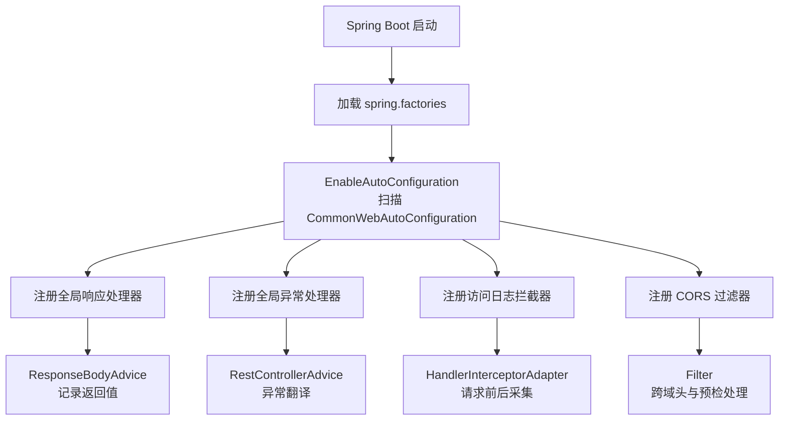
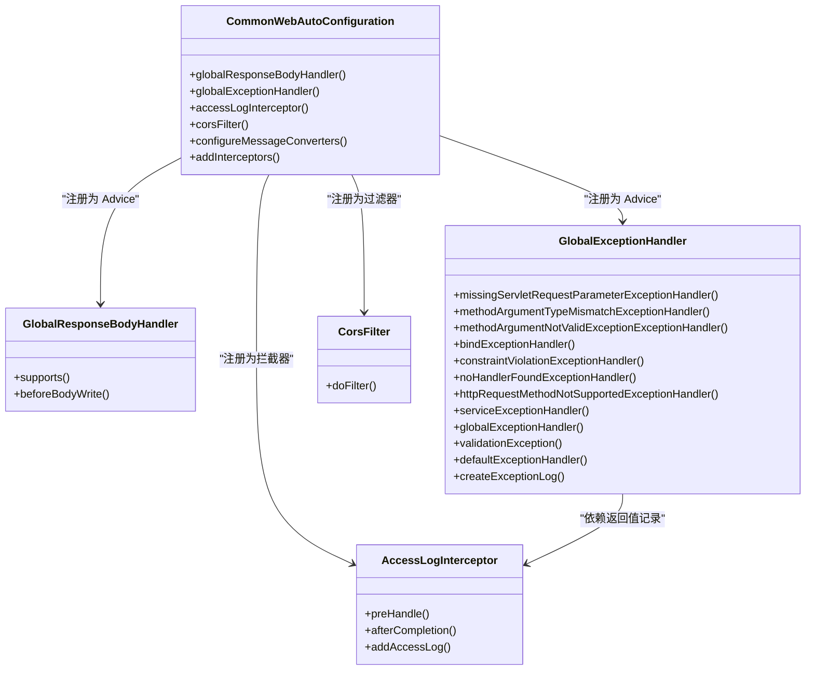
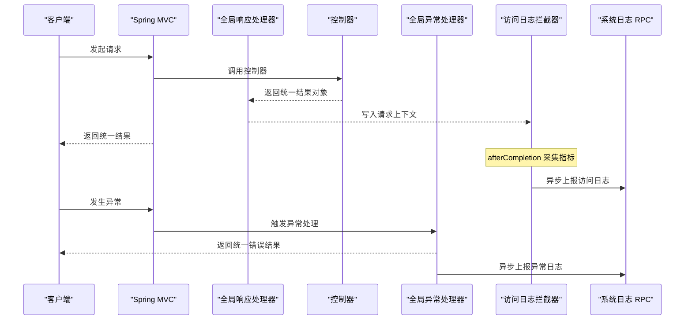

# Web自动配置Starter

<cite>
**本文引用的文件**
- [CommonWebAutoConfiguration.java](file://common/mall-spring-boot-starter-web/src/main/java/cn/iocoder/mall/web/config/CommonWebAutoConfiguration.java)
- [GlobalResponseBodyHandler.java](file://common/mall-spring-boot-starter-web/src/main/java/cn/iocoder/mall/web/core/handler/GlobalResponseBodyHandler.java)
- [GlobalExceptionHandler.java](file://common/mall-spring-boot-starter-web/src/main/java/cn/iocoder/mall/web/core/handler/GlobalExceptionHandler.java)
- [AccessLogInterceptor.java](file://common/mall-spring-boot-starter-web/src/main/java/cn/iocoder/mall/web/core/interceptor/AccessLogInterceptor.java)
- [CorsFilter.java](file://common/mall-spring-boot-starter-web/src/main/java/cn/iocoder/mall/web/core/servlet/CorsFilter.java)
- [spring.factories](file://common/mall-spring-boot-starter-web/src/main/resources/META-INF/spring.factories)
</cite>

## 目录
1. [简介](#简介)
2. [项目结构](#项目结构)
3. [核心组件](#核心组件)
4. [架构总览](#架构总览)
5. [详细组件分析](#详细组件分析)
6. [依赖关系分析](#依赖关系分析)
7. [性能与可用性考量](#性能与可用性考量)
8. [故障排查指南](#故障排查指南)
9. [结论](#结论)
10. [附录：配置与使用指南](#附录配置与使用指南)

## 简介
本文件面向 Onemall 项目的 Web 自动配置 Starter 模块，系统化阐述 CommonWebAutoConfiguration 的自动配置机制，重点解析以下能力：
- 全局响应处理器：统一透传并记录 Controller 返回的统一结果对象
- 全局异常处理器：将各类异常翻译为统一的错误响应，并异步落库
- 访问日志拦截器：在请求完成后收集访问指标并异步上报
- CORS 过滤器：提供跨域支持，兼容预检请求

同时给出配置启用方式、定制要点、最佳实践与排障建议，帮助开发者快速理解并正确使用 Web 层统一处理机制。

## 项目结构
Web 自动配置 Starter 位于 common/mall-spring-boot-starter-web 模块中，采用标准 Spring Boot 自动配置约定：
- 自动配置类：cn.iocoder.mall.web.config.CommonWebAutoConfiguration
- 组件注册：通过 META-INF/spring.factories 暴露 EnableAutoConfiguration
- 核心组件：响应处理器、异常处理器、访问日志拦截器、CORS 过滤器

图表来源
- [spring.factories:1-3](file://common/mall-spring-boot-starter-web/src/main/resources/META-INF/spring.factories#L1-L3)
- [CommonWebAutoConfiguration.java:28-96](file://common/mall-spring-boot-starter-web/src/main/java/cn/iocoder/mall/web/config/CommonWebAutoConfiguration.java#L28-L96)

章节来源
- [spring.factories:1-3](file://common/mall-spring-boot-starter-web/src/main/resources/META-INF/spring.factories#L1-L3)
- [CommonWebAutoConfiguration.java:28-96](file://common/mall-spring-boot-starter-web/src/main/java/cn/iocoder/mall/web/config/CommonWebAutoConfiguration.java#L28-L96)

## 核心组件
- 全局响应处理器（GlobalResponseBodyHandler）
  - 作用：拦截返回类型为统一结果对象的响应，将其写入请求上下文，供访问日志拦截器读取
  - 关键点：仅对特定返回类型生效，避免改变 Controller 数据结构
- 全局异常处理器（GlobalExceptionHandler）
  - 作用：统一捕获并翻译各类异常为统一错误响应；对系统级异常异步落库
  - 关键点：对业务异常与全局异常分别处理；兜底异常处理器确保不漏网
- 访问日志拦截器（AccessLogInterceptor）
  - 作用：在请求完成后采集访问指标（如 URI、参数、耗时、错误码等），异步上报
  - 关键点：依赖全局响应处理器记录的返回值；对非 onemall API 返回做兼容
- CORS 过滤器（CorsFilter）
  - 作用：为跨域场景提供必要响应头；对预检请求快速放行
  - 关键点：简单实现，未来可替换为 Spring 内置 CORS 过滤器

章节来源
- [GlobalResponseBodyHandler.java:13-45](file://common/mall-spring-boot-starter-web/src/main/java/cn/iocoder/mall/web/core/handler/GlobalResponseBodyHandler.java#L13-L45)
- [GlobalExceptionHandler.java:39-252](file://common/mall-spring-boot-starter-web/src/main/java/cn/iocoder/mall/web/core/handler/GlobalExceptionHandler.java#L39-L252)
- [AccessLogInterceptor.java:22-90](file://common/mall-spring-boot-starter-web/src/main/java/cn/iocoder/mall/web/core/interceptor/AccessLogInterceptor.java#L22-L90)
- [CorsFilter.java:8-40](file://common/mall-spring-boot-starter-web/src/main/java/cn/iocoder/mall/web/core/servlet/CorsFilter.java#L8-L40)

## 架构总览
下图展示自动配置类如何装配各组件，并说明它们在请求生命周期中的协作关系：

图表来源
- [CommonWebAutoConfiguration.java:36-96](file://common/mall-spring-boot-starter-web/src/main/java/cn/iocoder/mall/web/config/CommonWebAutoConfiguration.java#L36-L96)
- [GlobalResponseBodyHandler.java:24-45](file://common/mall-spring-boot-starter-web/src/main/java/cn/iocoder/mall/web/core/handler/GlobalResponseBodyHandler.java#L24-L45)
- [GlobalExceptionHandler.java:42-252](file://common/mall-spring-boot-starter-web/src/main/java/cn/iocoder/mall/web/core/handler/GlobalExceptionHandler.java#L42-L252)
- [AccessLogInterceptor.java:25-90](file://common/mall-spring-boot-starter-web/src/main/java/cn/iocoder/mall/web/core/interceptor/AccessLogInterceptor.java#L25-L90)
- [CorsFilter.java:13-40](file://common/mall-spring-boot-starter-web/src/main/java/cn/iocoder/mall/web/core/servlet/CorsFilter.java#L13-L40)

## 详细组件分析

### 自动配置类：CommonWebAutoConfiguration
- 条件装配
  - 仅在 Servlet Web 应用生效
  - 仅当对应组件 Bean 不存在时才注册默认实现
  - 访问日志拦截器按是否存在系统日志 RPC 依赖动态启用
- 组件注册
  - 全局响应处理器：ResponseBodyAdvice
  - 全局异常处理器：RestControllerAdvice
  - 访问日志拦截器：HandlerInterceptor
  - CORS 过滤器：FilterRegistrationBean
- 消息转换器
  - 使用 Fastjson 作为 JSON 转换器，优先级高于 Jackson/XML
  - 配置字符集与序列化特性，避免循环引用与非字符串 Key 导致浏览器报错

章节来源
- [CommonWebAutoConfiguration.java:28-96](file://common/mall-spring-boot-starter-web/src/main/java/cn/iocoder/mall/web/config/CommonWebAutoConfiguration.java#L28-L96)

### 全局响应处理器：GlobalResponseBodyHandler
- 作用范围
  - 仅对返回类型为统一结果对象的控制器生效
  - 将返回值写入请求上下文，供拦截器读取
- 设计原则
  - 不改变 Controller 返回结构，避免侵入式包装
  - 通过 AOP 机制在响应写出前注入日志所需数据

章节来源
- [GlobalResponseBodyHandler.java:13-45](file://common/mall-spring-boot-starter-web/src/main/java/cn/iocoder/mall/web/core/handler/GlobalResponseBodyHandler.java#L13-L45)

### 全局异常处理器：GlobalExceptionHandler
- 异常覆盖
  - 参数缺失、类型不匹配、参数校验失败、地址不存在、方法不被允许
  - 业务异常、全局异常、Dubbo 参数校验异常、兜底异常
- 行为特征
  - 业务异常与全局异常返回统一错误码与消息
  - 系统异常时异步记录异常日志（RPC 调用）
  - 兜底异常统一返回内部错误并记录异常日志
- 兼容性
  - 依赖系统日志 RPC 接口；若未引入对应依赖，需注意类加载风险

章节来源
- [GlobalExceptionHandler.java:39-252](file://common/mall-spring-boot-starter-web/src/main/java/cn/iocoder/mall/web/core/handler/GlobalExceptionHandler.java#L39-L252)

### 访问日志拦截器：AccessLogInterceptor
- 生命周期
  - preHandle：记录请求开始时间
  - afterCompletion：采集访问日志并异步上报
- 数据采集
  - 用户标识、URI、查询串、方法、UA、IP、开始时间、响应时间
  - 错误码与错误信息来自全局响应处理器记录的结果对象
- 异步化
  - 通过异步线程池上报，避免阻塞主请求链路

章节来源
- [AccessLogInterceptor.java:22-90](file://common/mall-spring-boot-starter-web/src/main/java/cn/iocoder/mall/web/core/interceptor/AccessLogInterceptor.java#L22-L90)

### CORS 过滤器：CorsFilter
- 行为
  - 设置通用跨域响应头
  - 对预检请求 OPTIONS 直接返回成功状态
- 适用场景
  - 前后端分离或第三方跨域调用
- 升级建议
  - 未来可替换为 Spring 内置 CORS 过滤器以获得更细粒度的配置

章节来源
- [CorsFilter.java:8-40](file://common/mall-spring-boot-starter-web/src/main/java/cn/iocoder/mall/web/core/servlet/CorsFilter.java#L8-L40)

## 依赖关系分析
- 组件耦合
  - 访问日志拦截器依赖全局响应处理器记录的返回值
  - 全局异常处理器与系统日志 RPC 接口存在运行时依赖
- 条件装配
  - 访问日志拦截器按是否存在系统日志 RPC 依赖决定是否启用
  - 若未引入系统日志依赖，拦截器注册将失败，但不会影响其他组件
- 外部集成
  - 通过 Dubbo 注解引用系统日志 RPC 接口，版本号由配置属性控制

图表来源
- [GlobalResponseBodyHandler.java:36-43](file://common/mall-spring-boot-starter-web/src/main/java/cn/iocoder/mall/web/core/handler/GlobalResponseBodyHandler.java#L36-L43)
- [AccessLogInterceptor.java:42-54](file://common/mall-spring-boot-starter-web/src/main/java/cn/iocoder/mall/web/core/interceptor/AccessLogInterceptor.java#L42-L54)
- [GlobalExceptionHandler.java:162-198](file://common/mall-spring-boot-starter-web/src/main/java/cn/iocoder/mall/web/core/handler/GlobalExceptionHandler.java#L162-L198)

章节来源
- [CommonWebAutoConfiguration.java:57-65](file://common/mall-spring-boot-starter-web/src/main/java/cn/iocoder/mall/web/config/CommonWebAutoConfiguration.java#L57-L65)
- [AccessLogInterceptor.java:42-54](file://common/mall-spring-boot-starter-web/src/main/java/cn/iocoder/mall/web/core/interceptor/AccessLogInterceptor.java#L42-L54)
- [GlobalExceptionHandler.java:162-198](file://common/mall-spring-boot-starter-web/src/main/java/cn/iocoder/mall/web/core/handler/GlobalExceptionHandler.java#L162-L198)

## 性能与可用性考量
- 消息转换器优先级
  - Fastjson 转换器被放置在首位，避免与 Jackson/XML 冲突
- 异步化策略
  - 异常日志与访问日志均采用异步上报，降低对主请求的影响
- 预检请求优化
  - CORS 过滤器对 OPTIONS 预检请求快速放行，减少不必要的链路开销
- 容错与降级
  - 访问日志与异常日志上报失败时记录错误日志，不影响主流程

[本节为通用指导，无需列出具体文件来源]

## 故障排查指南
- 访问日志未记录
  - 检查是否启用了系统日志 RPC 依赖；若未引入，拦截器将无法注册
  - 确认控制器返回的是统一结果对象，以便响应处理器写入上下文
- 异常未统一返回
  - 检查是否引入了系统日志 RPC 依赖，否则全局异常处理器可能无法正常初始化
  - 确认异常类型是否被覆盖，新增异常需在异常处理器中补充处理
- CORS 跨域失败
  - 确认前端是否发送了预检请求；若发送 OPTIONS，过滤器会直接放行
  - 如需更精细的跨域策略，建议迁移到 Spring 内置 CORS 过滤器
- 响应体格式异常
  - 检查消息转换器配置；确保 Fastjson 配置满足浏览器渲染要求

章节来源
- [CommonWebAutoConfiguration.java:50-55](file://common/mall-spring-boot-starter-web/src/main/java/cn/iocoder/mall/web/config/CommonWebAutoConfiguration.java#L50-L55)
- [GlobalExceptionHandler.java:57-59](file://common/mall-spring-boot-starter-web/src/main/java/cn/iocoder/mall/web/core/handler/GlobalExceptionHandler.java#L57-L59)
- [CorsFilter.java:27-33](file://common/mall-spring-boot-starter-web/src/main/java/cn/iocoder/mall/web/core/servlet/CorsFilter.java#L27-L33)

## 结论
Onemall Web 自动配置 Starter 通过 CommonWebAutoConfiguration 实现了“统一响应、统一异常、统一日志、统一跨域”的一体化 Web 层基础设施。其设计遵循 Spring Boot 自动配置约定，具备良好的条件装配与可扩展性。配合统一结果对象与异步上报策略，既保证了对外输出的一致性，也兼顾了系统的稳定性与性能。

[本节为总结性内容，无需列出具体文件来源]

## 附录：配置与使用指南

### 启用方式
- 引入 Starter 依赖后，Spring Boot 将自动扫描并应用自动配置类
- 自动配置类位于 META-INF/spring.factories 中的 EnableAutoConfiguration 列表

章节来源
- [spring.factories:1-3](file://common/mall-spring-boot-starter-web/src/main/resources/META-INF/spring.factories#L1-L3)

### 功能开关与定制
- 全局响应处理器
  - 作用：记录统一结果对象，供访问日志使用
  - 定制：如需自定义响应包装策略，请在控制器侧保持返回统一结果对象
- 全局异常处理器
  - 作用：统一翻译异常并返回统一错误响应
  - 定制：如需扩展异常类型处理，可在异常处理器中新增对应 @ExceptionHandler 方法
- 访问日志拦截器
  - 作用：采集访问指标并异步上报
  - 定制：可通过引入系统日志 RPC 依赖启用；如需关闭，可排除对应 Bean 或禁用拦截器注册
- CORS 过滤器
  - 作用：提供跨域支持
  - 定制：如需更细粒度的跨域策略，建议迁移到 Spring 内置 CORS 过滤器

章节来源
- [CommonWebAutoConfiguration.java:36-76](file://common/mall-spring-boot-starter-web/src/main/java/cn/iocoder/mall/web/config/CommonWebAutoConfiguration.java#L36-L76)
- [AccessLogInterceptor.java:25-34](file://common/mall-spring-boot-starter-web/src/main/java/cn/iocoder/mall/web/core/interceptor/AccessLogInterceptor.java#L25-L34)
- [CorsFilter.java:13-34](file://common/mall-spring-boot-starter-web/src/main/java/cn/iocoder/mall/web/core/servlet/CorsFilter.java#L13-L34)

### 最佳实践
- 控制器返回统一结果对象，确保访问日志拦截器能够正确采集错误码与消息
- 对外暴露的接口尽量使用统一的错误码体系，便于异常处理与日志分析
- 异步上报的日志服务需具备高可用与限流保护，避免在异常高峰时放大影响
- 跨域策略建议收敛到白名单域名与精确的允许方法/头，减少安全风险

[本节为通用指导，无需列出具体文件来源]