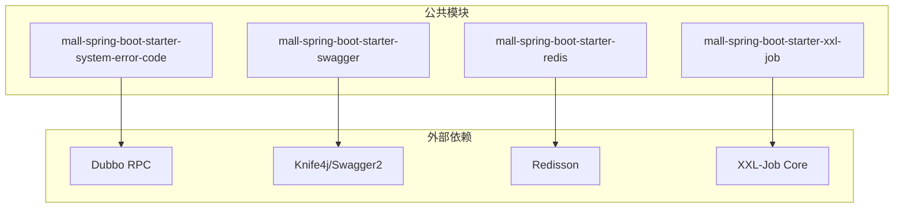
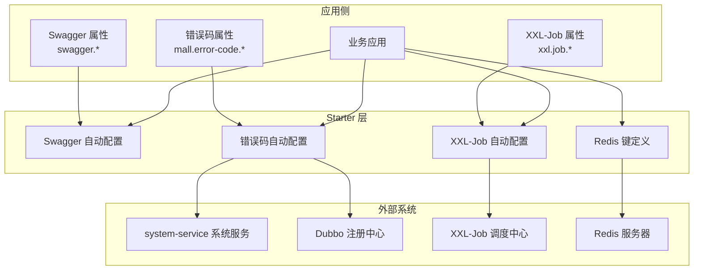
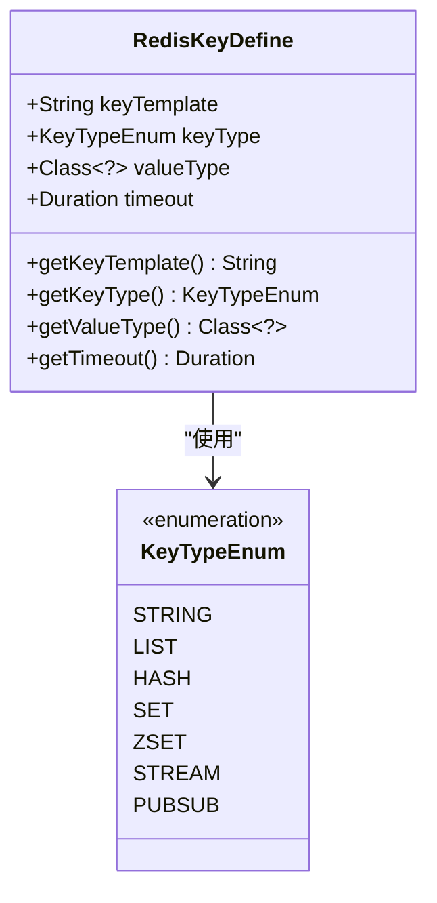
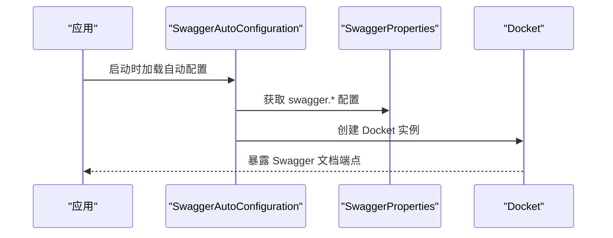
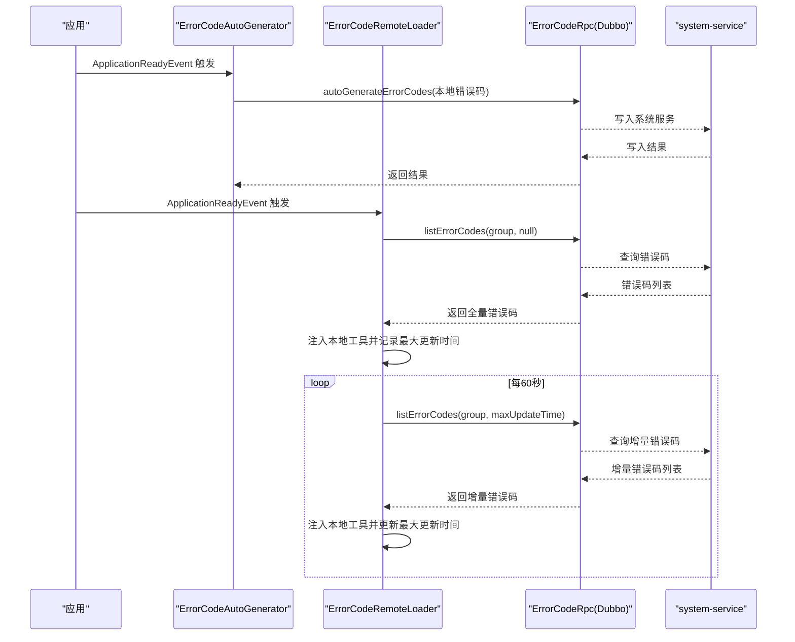
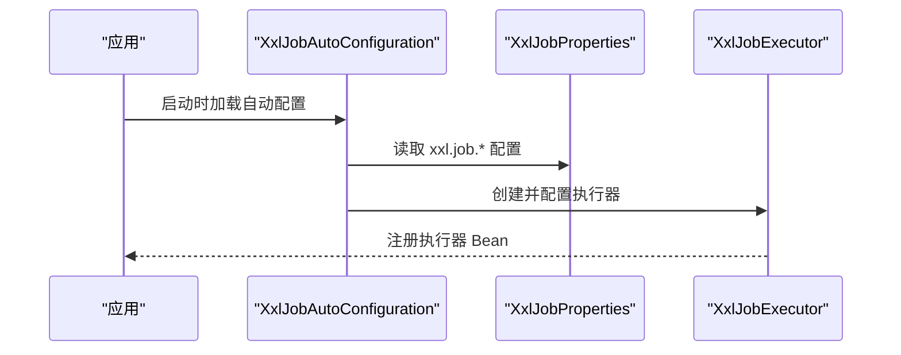
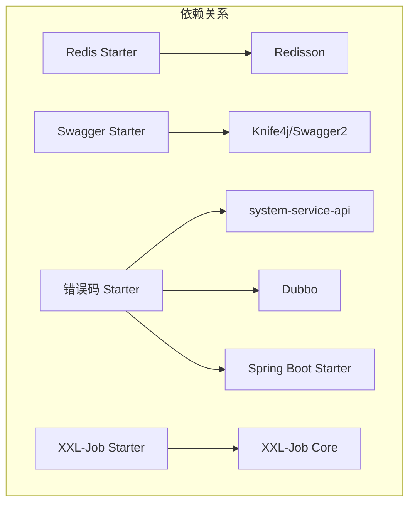

# 其他功能Starter

<cite>
**本文引用的文件**
- [RedisKeyDefine.java](file://common/mall-spring-boot-starter-redis/src/main/java/cn/iocoder/mall/redis/core/RedisKeyDefine.java)
- [SwaggerAutoConfiguration.java](file://common/mall-spring-boot-starter-swagger/src/main/java/cn/iocoder/mall/swagger/config/SwaggerAutoConfiguration.java)
- [SwaggerProperties.java](file://common/mall-spring-boot-starter-swagger/src/main/java/cn/iocoder/mall/swagger/config/SwaggerProperties.java)
- [ErrorCodeAutoConfiguration.java](file://common/mall-spring-boot-starter-system-error-code/src/main/java/cn/iocoder/mall/system/errorcode/config/ErrorCodeAutoConfiguration.java)
- [ErrorCodeProperties.java](file://common/mall-spring-boot-starter-system-error-code/src/main/java/cn/iocoder/mall/system/errorcode/config/ErrorCodeProperties.java)
- [ErrorCodeAutoGenerator.java](file://common/mall-spring-boot-starter-system-error-code/src/main/java/cn/iocoder/mall/system/errorcode/core/ErrorCodeAutoGenerator.java)
- [ErrorCodeRemoteLoader.java](file://common/mall-spring-boot-starter-system-error-code/src/main/java/cn/iocoder/mall/system/errorcode/core/ErrorCodeRemoteLoader.java)
- [XxlJobAutoConfiguration.java](file://common/mall-spring-boot-starter-xxl-job/src/main/java/cn/iocoder/mall/xxljob/config/XxlJobAutoConfiguration.java)
- [XxlJobProperties.java](file://common/mall-spring-boot-starter-xxl-job/src/main/java/cn/iocoder/mall/xxljob/config/XxlJobProperties.java)
- [pom.xml（Redis Starter）](file://common/mall-spring-boot-starter-redis/pom.xml)
- [pom.xml（Swagger Starter）](file://common/mall-spring-boot-starter-swagger/pom.xml)
- [pom.xml（系统错误码 Starter）](file://common/mall-spring-boot-starter-system-error-code/pom.xml)
- [pom.xml（XXL-Job Starter）](file://common/mall-spring-boot-starter-xxl-job/pom.xml)
</cite>

## 目录
1. [简介](#简介)
2. [项目结构](#项目结构)
3. [核心组件](#核心组件)
4. [架构总览](#架构总览)
5. [详细组件分析](#详细组件分析)
6. [依赖分析](#依赖分析)
7. [性能考虑](#性能考虑)
8. [故障排查指南](#故障排查指南)
9. [结论](#结论)
10. [附录](#附录)

## 简介
本章节面向 Onemall 项目的“其他功能 Starter”模块，系统性介绍以下四个辅助能力的自动装配与使用方法：
- Redis 键定义机制：统一定义 Redis Key 模板、类型与过期策略，便于跨模块复用与维护。
- Swagger API 文档生成：基于 Knife4j 的 Swagger2 自动配置，支持按包扫描、开关控制与基础信息配置。
- 系统错误码自动加载：启动时全量加载、定时增量刷新、本地错误码自动写入到系统服务，实现错误码集中治理与动态更新。
- XXL-Job 任务调度：自动装配执行器，支持访问令牌、调度中心地址、执行器网络参数与日志配置。

这些 Starter 以 Spring Boot 自动装配的方式提供开箱即用的能力，降低重复配置成本，并与系统内其他模块（如 Dubbo、系统服务）协同工作，帮助开发者快速构建功能完整、可观测、可运维的微服务应用。

## 项目结构
各 Starter 模块采用标准的 Spring Boot Starter 结构，包含自动配置类、属性类与必要的依赖声明。下图展示四个 Starter 在公共模块中的组织方式与依赖关系概览。

图表来源
- [pom.xml（系统错误码 Starter）:20-44](file://common/mall-spring-boot-starter-system-error-code/pom.xml#L20-L44)
- [pom.xml（Swagger Starter）:14-31](file://common/mall-spring-boot-starter-swagger/pom.xml#L14-L31)
- [pom.xml（Redis Starter）:14-19](file://common/mall-spring-boot-starter-redis/pom.xml#L14-L19)
- [pom.xml（XXL-Job Starter）:14-32](file://common/mall-spring-boot-starter-xxl-job/pom.xml#L14-L32)

章节来源
- [pom.xml（Redis Starter）:1-22](file://common/mall-spring-boot-starter-redis/pom.xml#L1-L22)
- [pom.xml（Swagger Starter）:1-34](file://common/mall-spring-boot-starter-swagger/pom.xml#L1-L34)
- [pom.xml（系统错误码 Starter）:1-47](file://common/mall-spring-boot-starter-system-error-code/pom.xml#L1-L47)
- [pom.xml（XXL-Job Starter）:1-35](file://common/mall-spring-boot-starter-xxl-job/pom.xml#L1-L35)

## 核心组件
- Redis 键定义机制
  - 提供统一的 Key 模板、数据类型枚举与过期时间常量，便于在业务层以强类型方式生成与管理 Redis Key。
- Swagger API 文档生成
  - 基于 Knife4j 的 Swagger2 自动配置，支持开关控制、基础信息配置与包扫描路径。
- 系统错误码自动加载
  - 启动时全量加载、定时增量刷新、本地错误码自动写入，结合系统服务实现错误码集中治理。
- XXL-Job 任务调度
  - 自动装配执行器 Bean，支持访问令牌、调度中心地址、执行器网络参数与日志配置。

章节来源
- [RedisKeyDefine.java:1-72](file://common/mall-spring-boot-starter-redis/src/main/java/cn/iocoder/mall/redis/core/RedisKeyDefine.java#L1-L72)
- [SwaggerAutoConfiguration.java:1-58](file://common/mall-spring-boot-starter-swagger/src/main/java/cn/iocoder/mall/swagger/config/SwaggerAutoConfiguration.java#L1-L58)
- [ErrorCodeAutoConfiguration.java:1-27](file://common/mall-spring-boot-starter-system-error-code/src/main/java/cn/iocoder/mall/system/errorcode/config/ErrorCodeAutoConfiguration.java#L1-L27)
- [XxlJobAutoConfiguration.java:1-57](file://common/mall-spring-boot-starter-xxl-job/src/main/java/cn/iocoder/mall/xxljob/config/XxlJobAutoConfiguration.java#L1-L57)

## 架构总览
下图展示四个 Starter 的运行时交互与外部依赖关系，以及它们与系统服务的协作方式。

图表来源
- [SwaggerAutoConfiguration.java:23-57](file://common/mall-spring-boot-starter-swagger/src/main/java/cn/iocoder/mall/swagger/config/SwaggerAutoConfiguration.java#L23-L57)
- [ErrorCodeAutoConfiguration.java:10-26](file://common/mall-spring-boot-starter-system-error-code/src/main/java/cn/iocoder/mall/system/errorcode/config/ErrorCodeAutoConfiguration.java#L10-L26)
- [XxlJobAutoConfiguration.java:19-54](file://common/mall-spring-boot-starter-xxl-job/src/main/java/cn/iocoder/mall/xxljob/config/XxlJobAutoConfiguration.java#L19-L54)
- [pom.xml（系统错误码 Starter）:20-44](file://common/mall-spring-boot-starter-system-error-code/pom.xml#L20-L44)
- [pom.xml（XXL-Job Starter）:14-32](file://common/mall-spring-boot-starter-xxl-job/pom.xml#L14-L32)

## 详细组件分析

### Redis 键定义机制
- 设计目的
  - 统一 Redis Key 的命名规范与生命周期管理，避免硬编码与分散配置带来的维护成本。
- 关键要素
  - Key 模板：用于拼接具体业务 Key。
  - Key 类型枚举：覆盖常用数据结构类型，便于上层工具选择合适命令。
  - 过期时间：支持永不过期与固定时长两种策略。
- 使用建议
  - 在业务层通过 Key 模板与参数生成最终 Key，结合过期策略提升缓存命中率与资源利用率。
  - 与 Redisson 或 Spring Data Redis 集成时，可据此选择合适的操作接口。

图表来源
- [RedisKeyDefine.java:8-71](file://common/mall-spring-boot-starter-redis/src/main/java/cn/iocoder/mall/redis/core/RedisKeyDefine.java#L8-L71)

章节来源
- [RedisKeyDefine.java:1-72](file://common/mall-spring-boot-starter-redis/src/main/java/cn/iocoder/mall/redis/core/RedisKeyDefine.java#L1-L72)

### Swagger API 文档生成
- 设计目的
  - 快速生成在线 API 文档，提升前后端协作效率与接口可发现性。
- 自动装配要点
  - 条件化启用：仅当存在相关依赖且开关开启时生效。
  - 属性驱动：通过 swagger.* 前缀配置标题、描述、版本与基础包路径。
  - 包扫描：按配置的基础包路径扫描控制器。
- 集成步骤
  - 引入 Starter 依赖后，在配置文件中设置 swagger.* 属性即可自动生成文档页面。

图表来源
- [SwaggerAutoConfiguration.java:31-55](file://common/mall-spring-boot-starter-swagger/src/main/java/cn/iocoder/mall/swagger/config/SwaggerAutoConfiguration.java#L31-L55)
- [SwaggerProperties.java:5-48](file://common/mall-spring-boot-starter-swagger/src/main/java/cn/iocoder/mall/swagger/config/SwaggerProperties.java#L5-L48)

章节来源
- [SwaggerAutoConfiguration.java:1-58](file://common/mall-spring-boot-starter-swagger/src/main/java/cn/iocoder/mall/swagger/config/SwaggerAutoConfiguration.java#L1-L58)
- [SwaggerProperties.java:1-49](file://common/mall-spring-boot-starter-swagger/src/main/java/cn/iocoder/mall/swagger/config/SwaggerProperties.java#L1-L49)

### 系统错误码自动加载
- 设计目的
  - 将业务侧错误码集中到系统服务，支持运行时动态刷新与本地自动写入，实现错误码的统一治理。
- 核心流程
  - 启动时全量加载：应用启动完成后，从系统服务拉取该应用分组下的所有错误码并注入到本地工具类。
  - 定时增量刷新：周期性对比最大更新时间，增量拉取变更的错误码。
  - 本地自动写入：启动时将本地错误码枚举类中的错误码批量写入系统服务，便于后台统一维护。
- 适用场景
  - 多模块共享的错误码体系、需要后台动态调整文案或新增错误码的场景。
- 依赖关系
  - 通过 Dubbo 调用 system-service 的错误码 RPC 接口，依赖注册中心完成服务发现。

图表来源
- [ErrorCodeAutoGenerator.java:44-82](file://common/mall-spring-boot-starter-system-error-code/src/main/java/cn/iocoder/mall/system/errorcode/core/ErrorCodeAutoGenerator.java#L44-L82)
- [ErrorCodeRemoteLoader.java:39-69](file://common/mall-spring-boot-starter-system-error-code/src/main/java/cn/iocoder/mall/system/errorcode/core/ErrorCodeRemoteLoader.java#L39-L69)
- [ErrorCodeAutoConfiguration.java:15-24](file://common/mall-spring-boot-starter-system-error-code/src/main/java/cn/iocoder/mall/system/errorcode/config/ErrorCodeAutoConfiguration.java#L15-L24)

章节来源
- [ErrorCodeAutoConfiguration.java:1-27](file://common/mall-spring-boot-starter-system-error-code/src/main/java/cn/iocoder/mall/system/errorcode/config/ErrorCodeAutoConfiguration.java#L1-L27)
- [ErrorCodeProperties.java:1-40](file://common/mall-spring-boot-starter-system-error-code/src/main/java/cn/iocoder/mall/system/errorcode/config/ErrorCodeProperties.java#L1-L40)
- [ErrorCodeAutoGenerator.java:1-85](file://common/mall-spring-boot-starter-system-error-code/src/main/java/cn/iocoder/mall/system/errorcode/core/ErrorCodeAutoGenerator.java#L1-L85)
- [ErrorCodeRemoteLoader.java:1-72](file://common/mall-spring-boot-starter-system-error-code/src/main/java/cn/iocoder/mall/system/errorcode/core/ErrorCodeRemoteLoader.java#L1-L72)

### XXL-Job 任务调度
- 设计目的
  - 为应用提供轻量级分布式任务调度能力，统一接入 XXL-Job 调度中心。
- 自动装配要点
  - 条件化启用：仅当存在执行器类且开关开启时生效。
  - 属性驱动：通过 xxl.job.* 配置调度中心地址、访问令牌、执行器网络参数与日志路径。
  - 执行器初始化：根据配置创建并注入 XxlJobExecutor Bean。
- 集成步骤
  - 引入 Starter 依赖后，在配置文件中设置 xxl.job.* 属性，即可自动装配执行器。

图表来源
- [XxlJobAutoConfiguration.java:33-54](file://common/mall-spring-boot-starter-xxl-job/src/main/java/cn/iocoder/mall/xxljob/config/XxlJobAutoConfiguration.java#L33-L54)
- [XxlJobProperties.java:8-62](file://common/mall-spring-boot-starter-xxl-job/src/main/java/cn/iocoder/mall/xxljob/config/XxlJobProperties.java#L8-L62)

章节来源
- [XxlJobAutoConfiguration.java:1-57](file://common/mall-spring-boot-starter-xxl-job/src/main/java/cn/iocoder/mall/xxljob/config/XxlJobAutoConfiguration.java#L1-L57)
- [XxlJobProperties.java:1-173](file://common/mall-spring-boot-starter-xxl-job/src/main/java/cn/iocoder/mall/xxljob/config/XxlJobProperties.java#L1-L173)

## 依赖分析
- Redis Starter
  - 依赖 Redisson Spring Boot Starter，提供 Redis 客户端与自动配置能力。
- Swagger Starter
  - 依赖 Knife4j/Springfox Swagger2，提供在线文档生成能力。
- 系统错误码 Starter
  - 依赖 system-service-api、Dubbo 与 Spring Boot Starter，用于远程加载与自动写入错误码。
- XXL-Job Starter
  - 依赖 XXL-Job Core，提供执行器与调度能力。

图表来源
- [pom.xml（Redis Starter）:14-19](file://common/mall-spring-boot-starter-redis/pom.xml#L14-L19)
- [pom.xml（Swagger Starter）:14-31](file://common/mall-spring-boot-starter-swagger/pom.xml#L14-L31)
- [pom.xml（系统错误码 Starter）:20-44](file://common/mall-spring-boot-starter-system-error-code/pom.xml#L20-L44)
- [pom.xml（XXL-Job Starter）:14-32](file://common/mall-spring-boot-starter-xxl-job/pom.xml#L14-L32)

章节来源
- [pom.xml（Redis Starter）:1-22](file://common/mall-spring-boot-starter-redis/pom.xml#L1-L22)
- [pom.xml（Swagger Starter）:1-34](file://common/mall-spring-boot-starter-swagger/pom.xml#L1-L34)
- [pom.xml（系统错误码 Starter）:1-47](file://common/mall-spring-boot-starter-system-error-code/pom.xml#L1-L47)
- [pom.xml（XXL-Job Starter）:1-35](file://common/mall-spring-boot-starter-xxl-job/pom.xml#L1-L35)

## 性能考虑
- Redis 键定义
  - 合理设置过期时间，避免内存泄漏；对热点 Key 建议增加副本或使用集群模式。
- Swagger 文档
  - 生产环境建议关闭或限制访问，避免暴露内部接口细节。
- 错误码加载
  - 增量刷新周期可根据业务变化调整；注意避免频繁拉取导致系统压力。
- XXL-Job
  - 执行器端口与日志路径需合理规划，避免冲突与磁盘占用过高。

## 故障排查指南
- Swagger 无法访问
  - 检查开关配置与基础包路径是否正确；确认 Knife4j 依赖已引入。
- 错误码未生效
  - 确认应用分组与错误码枚举类配置正确；检查系统服务可达性与 Dubbo 版本号。
- XXL-Job 执行器未注册
  - 检查调度中心地址、访问令牌与执行器网络参数；确认执行器 Bean 已被创建。

章节来源
- [SwaggerAutoConfiguration.java:26-28](file://common/mall-spring-boot-starter-swagger/src/main/java/cn/iocoder/mall/swagger/config/SwaggerAutoConfiguration.java#L26-L28)
- [ErrorCodeProperties.java:15-16](file://common/mall-spring-boot-starter-system-error-code/src/main/java/cn/iocoder/mall/system/errorcode/config/ErrorCodeProperties.java#L15-L16)
- [XxlJobAutoConfiguration.java:21-22](file://common/mall-spring-boot-starter-xxl-job/src/main/java/cn/iocoder/mall/xxljob/config/XxlJobAutoConfiguration.java#L21-L22)

## 结论
四个“其他功能 Starter”通过自动装配与属性驱动的方式，为 Onemall 微服务体系提供了标准化的基础设施能力：
- Redis 键定义机制统一了缓存命名与生命周期；
- Swagger 自动生成在线文档，提升协作效率；
- 系统错误码自动加载与写入，实现集中治理与动态更新；
- XXL-Job 执行器自动装配，简化任务调度接入。

这些能力与系统内其他模块（如 Dubbo、系统服务）协同工作，帮助开发者快速构建高可用、可观测、可运维的微服务应用。

## 附录
- 配置示例（路径）
  - Swagger：参考 [SwaggerProperties.java:5-48](file://common/mall-spring-boot-starter-swagger/src/main/java/cn/iocoder/mall/swagger/config/SwaggerProperties.java#L5-L48)
  - 系统错误码：参考 [ErrorCodeProperties.java:8-39](file://common/mall-spring-boot-starter-system-error-code/src/main/java/cn/iocoder/mall/system/errorcode/config/ErrorCodeProperties.java#L8-L39)
  - XXL-Job：参考 [XxlJobProperties.java:8-62](file://common/mall-spring-boot-starter-xxl-job/src/main/java/cn/iocoder/mall/xxljob/config/XxlJobProperties.java#L8-L62)
- 集成清单（依赖）
  - Redis：参考 [pom.xml（Redis Starter）:14-19](file://common/mall-spring-boot-starter-redis/pom.xml#L14-L19)
  - Swagger：参考 [pom.xml（Swagger Starter）:14-31](file://common/mall-spring-boot-starter-swagger/pom.xml#L14-L31)
  - 系统错误码：参考 [pom.xml（系统错误码 Starter）:20-44](file://common/mall-spring-boot-starter-system-error-code/pom.xml#L20-L44)
  - XXL-Job：参考 [pom.xml（XXL-Job Starter）:14-32](file://common/mall-spring-boot-starter-xxl-job/pom.xml#L14-L32)