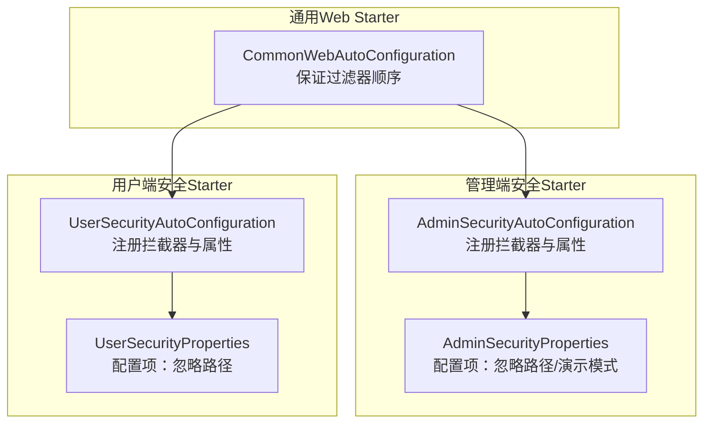
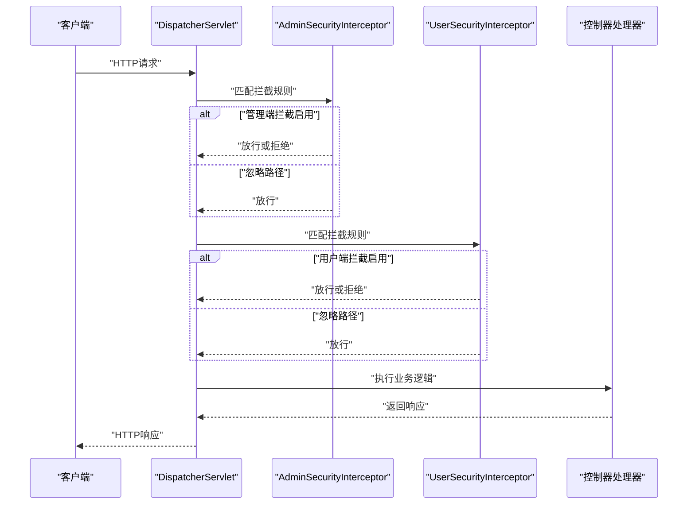
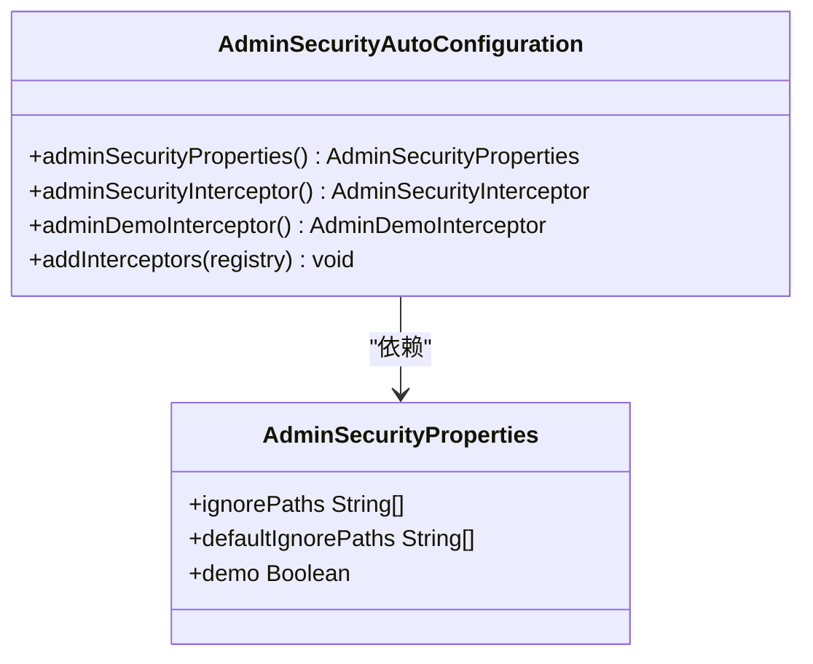
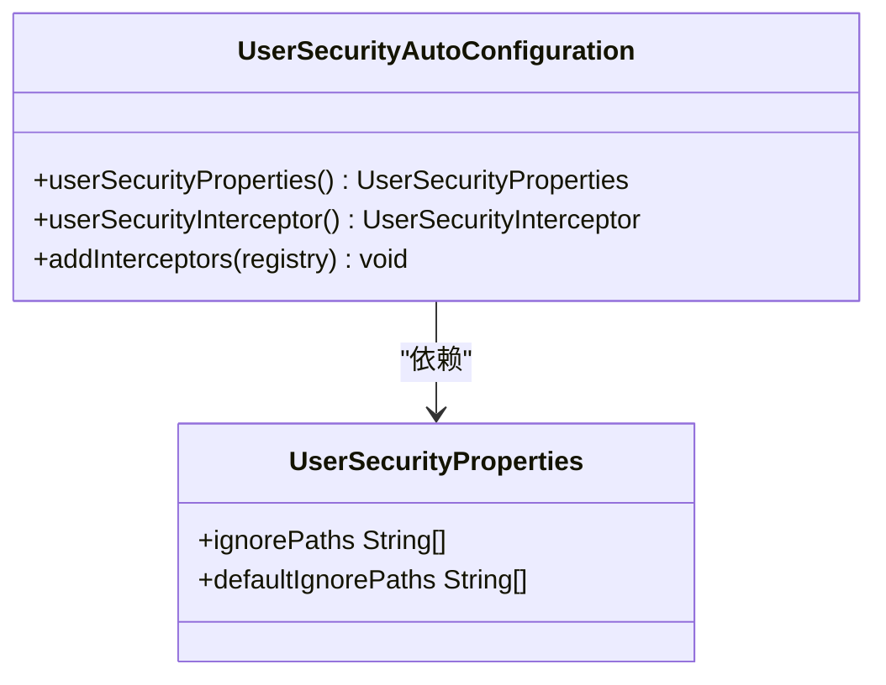
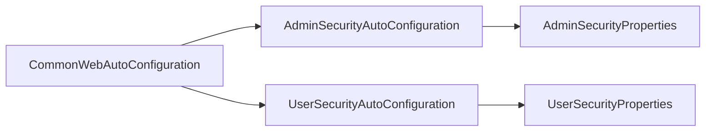

# 安全认证Starter

<cite>
**本文引用的文件**
- [AdminSecurityAutoConfiguration.java](file://common/mall-spring-boot-starter-security-admin/src/main/java/cn/iocoder/mall/security/admin/config/AdminSecurityAutoConfiguration.java)
- [AdminSecurityProperties.java](file://common/mall-spring-boot-starter-security-admin/src/main/java/cn/iocoder/mall/security/admin/config/AdminSecurityProperties.java)
- [UserSecurityAutoConfiguration.java](file://common/mall-spring-boot-starter-security-user/src/main/java/cn/iocoder/mall/security/user/config/UserSecurityAutoConfiguration.java)
- [UserSecurityProperties.java](file://common/mall-spring-boot-starter-security-user/src/main/java/cn/iocoder/mall/security/user/config/UserSecurityProperties.java)
- [CommonWebAutoConfiguration.java](file://common/mall-spring-boot-starter-web/src/main/java/cn/iocoder/mall/web/config/CommonWebAutoConfiguration.java)
- [RequiresAuthenticate.java](file://common/mall-security-annotations/src/main/java/cn/iocoder/security/annotations/RequiresAuthenticate.java)
- [RequiresPermissions.java](file://common/mall-security-annotations/src/main/java/cn/iocoder/security/annotations/RequiresPermissions.java)
- [RequiresNone.java](file://common/mall-security-annotations/src/main/java/cn/iocoder/security/annotations/RequiresNone.java)
</cite>

## 目录
1. [简介](#简介)
2. [项目结构](#项目结构)
3. [核心组件](#核心组件)
4. [架构总览](#架构总览)
5. [详细组件分析](#详细组件分析)
6. [依赖关系分析](#依赖关系分析)
7. [性能考虑](#性能考虑)
8. [故障排查指南](#故障排查指南)
9. [结论](#结论)
10. [附录](#附录)

## 简介
本文件面向Onemall项目的安全认证Starter模块，系统性阐述管理员与用户两大安全模块的自动配置机制，重点解析AdminSecurityAutoConfiguration与UserSecurityAutoConfiguration的实现原理；同时说明如何在微服务架构中通过拦截器与注解实现安全上下文的传递与管理，并提供权限控制配置示例，帮助开发者快速集成与扩展。

## 项目结构
安全认证Starter由两部分组成：
- 管理端安全模块：提供管理员登录态校验、演示模式等能力
- 用户端安全模块：提供普通用户登录态校验能力
两者均基于Spring MVC拦截器实现，配合通用Web自动配置，确保拦截器顺序与生效范围可控。

图表来源
- [AdminSecurityAutoConfiguration.java:17-60](file://common/mall-spring-boot-starter-security-admin/src/main/java/cn/iocoder/mall/security/admin/config/AdminSecurityAutoConfiguration.java#L17-L60)
- [UserSecurityAutoConfiguration.java:16-47](file://common/mall-spring-boot-starter-security-user/src/main/java/cn/iocoder/mall/security/user/config/UserSecurityAutoConfiguration.java#L16-L47)
- [CommonWebAutoConfiguration.java](file://common/mall-spring-boot-starter-web/src/main/java/cn/iocoder/mall/web/config/CommonWebAutoConfiguration.java)

章节来源
- [AdminSecurityAutoConfiguration.java:17-60](file://common/mall-spring-boot-starter-security-admin/src/main/java/cn/iocoder/mall/security/admin/config/AdminSecurityAutoConfiguration.java#L17-L60)
- [UserSecurityAutoConfiguration.java:16-47](file://common/mall-spring-boot-starter-security-user/src/main/java/cn/iocoder/mall/security/user/config/UserSecurityAutoConfiguration.java#L16-L47)
- [CommonWebAutoConfiguration.java](file://common/mall-spring-boot-starter-web/src/main/java/cn/iocoder/mall/web/config/CommonWebAutoConfiguration.java)

## 核心组件
- 管理端安全自动配置类：负责注册拦截器、加载默认忽略路径、支持演示模式开关
- 管理端安全属性类：集中管理配置项，如忽略路径、默认忽略路径、演示模式
- 用户端安全自动配置类：负责注册拦截器、加载默认忽略路径
- 用户端安全属性类：集中管理配置项，如忽略路径、默认忽略路径
- 权限注解：提供基于方法的权限声明能力（认证、无权限要求、指定权限）

章节来源
- [AdminSecurityAutoConfiguration.java:21-58](file://common/mall-spring-boot-starter-security-admin/src/main/java/cn/iocoder/mall/security/admin/config/AdminSecurityAutoConfiguration.java#L21-L58)
- [AdminSecurityProperties.java:5-59](file://common/mall-spring-boot-starter-security-admin/src/main/java/cn/iocoder/mall/security/admin/config/AdminSecurityProperties.java#L5-L59)
- [UserSecurityAutoConfiguration.java:20-45](file://common/mall-spring-boot-starter-security-user/src/main/java/cn/iocoder/mall/security/user/config/UserSecurityAutoConfiguration.java#L20-L45)
- [UserSecurityProperties.java:5-41](file://common/mall-spring-boot-starter-security-user/src/main/java/cn/iocoder/mall/security/user/config/UserSecurityProperties.java#L5-L41)
- [RequiresAuthenticate.java](file://common/mall-security-annotations/src/main/java/cn/iocoder/security/annotations/RequiresAuthenticate.java)
- [RequiresPermissions.java](file://common/mall-security-annotations/src/main/java/cn/iocoder/security/annotations/RequiresPermissions.java)
- [RequiresNone.java](file://common/mall-security-annotations/src/main/java/cn/iocoder/security/annotations/RequiresNone.java)

## 架构总览
下图展示了拦截器链路与配置加载的关键交互：

图表来源
- [AdminSecurityAutoConfiguration.java:43-58](file://common/mall-spring-boot-starter-security-admin/src/main/java/cn/iocoder/mall/security/admin/config/AdminSecurityAutoConfiguration.java#L43-L58)
- [UserSecurityAutoConfiguration.java:37-45](file://common/mall-spring-boot-starter-security-user/src/main/java/cn/iocoder/mall/security/user/config/UserSecurityAutoConfiguration.java#L37-L45)

## 详细组件分析

### 管理端安全自动配置（AdminSecurityAutoConfiguration）
- 自动装配条件
  - 仅在Servlet Web应用生效
  - 在通用Web自动配置之后执行，确保过滤器顺序稳定
  - 启用配置属性绑定，读取mall.security.admin前缀配置
- Bean注册
  - 注册AdminSecurityProperties，提供默认忽略路径与演示模式开关
  - 注册AdminSecurityInterceptor与AdminDemoInterceptor（演示模式开启时）
- 拦截器注册策略
  - 将拦截器排除在自定义忽略路径与默认忽略路径之外
  - 记录拦截器加载日志，便于运维观察

图表来源
- [AdminSecurityAutoConfiguration.java:21-58](file://common/mall-spring-boot-starter-security-admin/src/main/java/cn/iocoder/mall/security/admin/config/AdminSecurityAutoConfiguration.java#L21-L58)
- [AdminSecurityProperties.java:5-59](file://common/mall-spring-boot-starter-security-admin/src/main/java/cn/iocoder/mall/security/admin/config/AdminSecurityProperties.java#L5-L59)

章节来源
- [AdminSecurityAutoConfiguration.java:17-60](file://common/mall-spring-boot-starter-security-admin/src/main/java/cn/iocoder/mall/security/admin/config/AdminSecurityAutoConfiguration.java#L17-L60)
- [AdminSecurityProperties.java:5-59](file://common/mall-spring-boot-starter-security-admin/src/main/java/cn/iocoder/mall/security/admin/config/AdminSecurityProperties.java#L5-L59)

### 用户端安全自动配置（UserSecurityAutoConfiguration）
- 自动装配条件
  - 仅在Servlet Web应用生效
  - 在通用Web自动配置之后执行
  - 启用配置属性绑定，读取mall.security.user前缀配置
- Bean注册
  - 注册UserSecurityProperties，提供默认忽略路径
  - 注册UserSecurityInterceptor
- 拦截器注册策略
  - 将拦截器排除在自定义忽略路径与默认忽略路径之外
  - 记录拦截器加载日志

图表来源
- [UserSecurityAutoConfiguration.java:20-45](file://common/mall-spring-boot-starter-security-user/src/main/java/cn/iocoder/mall/security/user/config/UserSecurityAutoConfiguration.java#L20-L45)
- [UserSecurityProperties.java:5-41](file://common/mall-spring-boot-starter-security-user/src/main/java/cn/iocoder/mall/security/user/config/UserSecurityProperties.java#L5-L41)

章节来源
- [UserSecurityAutoConfiguration.java:16-47](file://common/mall-spring-boot-starter-security-user/src/main/java/cn/iocoder/mall/security/user/config/UserSecurityAutoConfiguration.java#L16-L47)
- [UserSecurityProperties.java:5-41](file://common/mall-spring-boot-starter-security-user/src/main/java/cn/iocoder/mall/security/user/config/UserSecurityProperties.java#L5-L41)

### 配置属性详解
- 管理端配置项
  - 忽略路径：可自定义不拦截的URL模式
  - 默认忽略路径：包含Swagger与Actuator相关路径
  - 演示模式：开启后额外加载演示拦截器
- 用户端配置项
  - 忽略路径：可自定义不拦截的URL模式
  - 默认忽略路径：包含Swagger与Actuator相关路径

章节来源
- [AdminSecurityProperties.java:8-30](file://common/mall-spring-boot-starter-security-admin/src/main/java/cn/iocoder/mall/security/admin/config/AdminSecurityProperties.java#L8-L30)
- [UserSecurityProperties.java:8-21](file://common/mall-spring-boot-starter-security-user/src/main/java/cn/iocoder/mall/security/user/config/UserSecurityProperties.java#L8-L21)

### 权限注解（方法级权限控制）
- RequiresAuthenticate：要求已认证
- RequiresPermissions：要求具备指定权限
- RequiresNone：无需权限（开放访问）
这些注解用于在业务方法上声明权限约束，结合全局拦截器实现统一鉴权。

章节来源
- [RequiresAuthenticate.java](file://common/mall-security-annotations/src/main/java/cn/iocoder/security/annotations/RequiresAuthenticate.java)
- [RequiresPermissions.java](file://common/mall-security-annotations/src/main/java/cn/iocoder/security/annotations/RequiresPermissions.java)
- [RequiresNone.java](file://common/mall-security-annotations/src/main/java/cn/iocoder/security/annotations/RequiresNone.java)

## 依赖关系分析
- 通用Web自动配置先行：确保拦截器链顺序稳定，避免与通用过滤器冲突
- 管理端与用户端分别独立注册拦截器，互不影响
- 属性类提供默认忽略路径，减少重复配置

图表来源
- [AdminSecurityAutoConfiguration.java:18](file://common/mall-spring-boot-starter-security-admin/src/main/java/cn/iocoder/mall/security/admin/config/AdminSecurityAutoConfiguration.java#L18)
- [UserSecurityAutoConfiguration.java:17](file://common/mall-spring-boot-starter-security-user/src/main/java/cn/iocoder/mall/security/user/config/UserSecurityAutoConfiguration.java#L17)
- [CommonWebAutoConfiguration.java](file://common/mall-spring-boot-starter-web/src/main/java/cn/iocoder/mall/web/config/CommonWebAutoConfiguration.java)

章节来源
- [AdminSecurityAutoConfiguration.java:18](file://common/mall-spring-boot-starter-security-admin/src/main/java/cn/iocoder/mall/security/admin/config/AdminSecurityAutoConfiguration.java#L18)
- [UserSecurityAutoConfiguration.java:17](file://common/mall-spring-boot-starter-security-user/src/main/java/cn/iocoder/mall/security/user/config/UserSecurityAutoConfiguration.java#L17)

## 性能考虑
- 拦截器匹配采用路径模式排除策略，避免对静态资源与监控接口产生额外开销
- 演示模式按需启用，仅在需要时加载演示拦截器
- 建议将忽略路径尽量收敛到最小集合，减少不必要的拦截器调用

## 故障排查指南
- 拦截器未生效
  - 检查是否为Servlet Web应用
  - 确认通用Web自动配置已加载
  - 查看拦截器注册日志输出
- 忽略路径不生效
  - 核对配置项是否正确设置
  - 确认路径模式与实际请求一致
- 演示模式未启用
  - 检查演示模式开关配置
  - 确认演示拦截器已注册

章节来源
- [AdminSecurityAutoConfiguration.java:43-58](file://common/mall-spring-boot-starter-security-admin/src/main/java/cn/iocoder/mall/security/admin/config/AdminSecurityAutoConfiguration.java#L43-L58)
- [UserSecurityAutoConfiguration.java:37-45](file://common/mall-spring-boot-starter-security-user/src/main/java/cn/iocoder/mall/security/user/config/UserSecurityAutoConfiguration.java#L37-L45)

## 结论
Onemall的安全认证Starter通过自动配置类与属性类实现了管理端与用户端的解耦与可配置化，结合拦截器与权限注解，提供了灵活且稳定的权限控制能力。在微服务架构中，建议统一接入通用Web自动配置，合理设置忽略路径，并根据环境启用演示模式，以获得最佳的开发与运维体验。

## 附录

### 权限控制配置示例（步骤说明）
- 开启管理端安全拦截
  - 引入管理端安全Starter依赖
  - 在配置文件中设置忽略路径（如Swagger与Actuator相关路径）
  - 如需演示模式，开启演示模式开关
- 开启用户端安全拦截
  - 引入用户端安全Starter依赖
  - 在配置文件中设置忽略路径（如Swagger与Actuator相关路径）
- 方法级权限控制
  - 在业务方法上添加权限注解（如RequiresAuthenticate、RequiresPermissions、RequiresNone）
  - 确保拦截器已注册并生效

章节来源
- [AdminSecurityProperties.java:22-30](file://common/mall-spring-boot-starter-security-admin/src/main/java/cn/iocoder/mall/security/admin/config/AdminSecurityProperties.java#L22-L30)
- [UserSecurityProperties.java:17-21](file://common/mall-spring-boot-starter-security-user/src/main/java/cn/iocoder/mall/security/user/config/UserSecurityProperties.java#L17-L21)
- [RequiresAuthenticate.java](file://common/mall-security-annotations/src/main/java/cn/iocoder/security/annotations/RequiresAuthenticate.java)
- [RequiresPermissions.java](file://common/mall-security-annotations/src/main/java/cn/iocoder/security/annotations/RequiresPermissions.java)
- [RequiresNone.java](file://common/mall-security-annotations/src/main/java/cn/iocoder/security/annotations/RequiresNone.java)