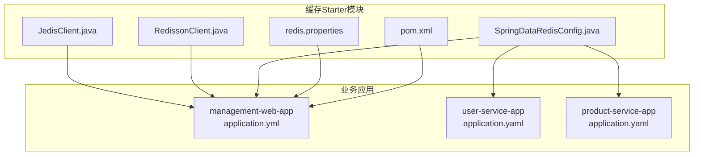
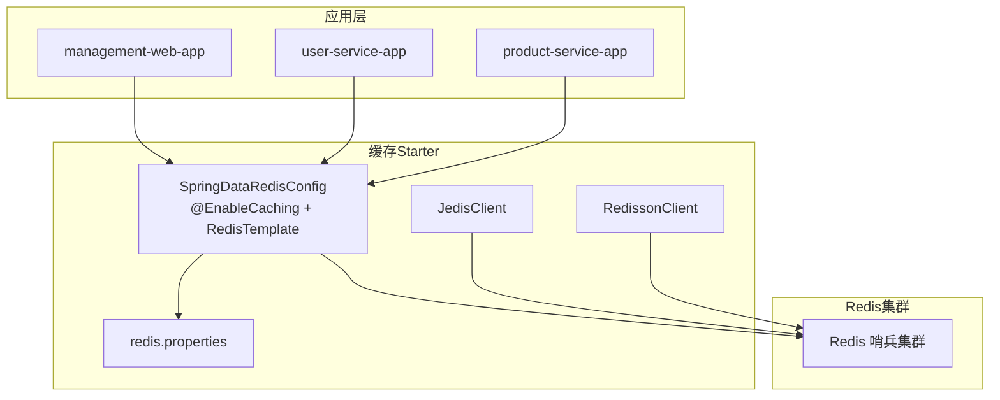
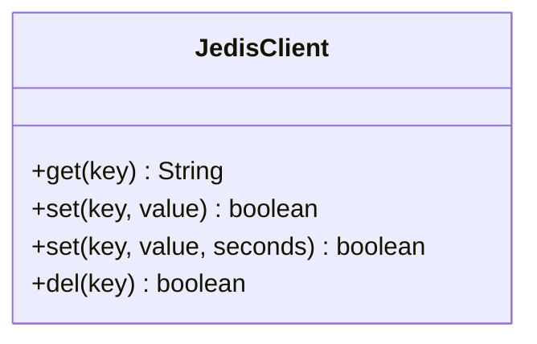
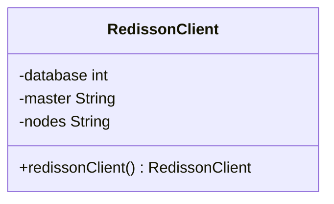
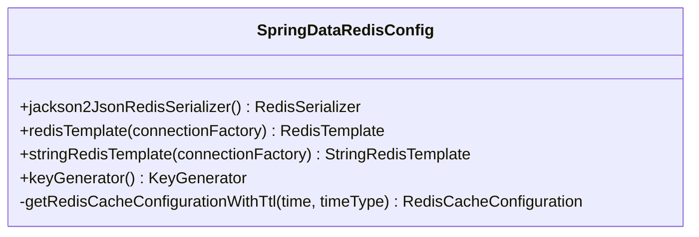
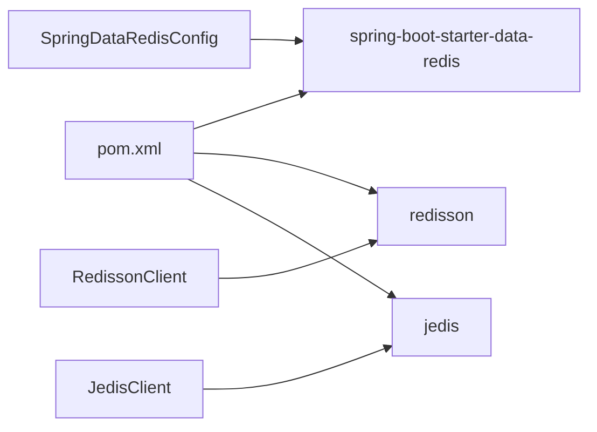

# 缓存集成Starter

<cite>
**本文引用的文件**
- [JedisClient.java](file://common/mall-spring-boot-starter-cache/src/main/java/cn/iocoder/mall/cache/config/JedisClient.java)
- [RedissonClient.java](file://common/mall-spring-boot-starter-cache/src/main/java/cn/iocoder/mall/cache/config/RedissonClient.java)
- [SpringDataRedisConfig.java](file://common/mall-spring-boot-starter-cache/src/main/java/cn/iocoder/mall/cache/config/SpringDataRedisConfig.java)
- [redis.properties](file://common/mall-spring-boot-starter-cache/src/main/resources/redis.properties)
- [pom.xml](file://common/mall-spring-boot-starter-cache/pom.xml)
- [application.yml](file://management-web-app/src/main/resources/application.yml)
- [application.yaml](file://user-service-project/user-service-app/src/main/resources/application.yaml)
- [application.yaml](file://product-service-project/product-service-app/src/main/resources/application.yaml)
</cite>

## 目录
1. [简介](#简介)
2. [项目结构](#项目结构)
3. [核心组件](#核心组件)
4. [架构总览](#架构总览)
5. [详细组件分析](#详细组件分析)
6. [依赖分析](#依赖分析)
7. [性能考虑](#性能考虑)
8. [故障排查指南](#故障排查指南)
9. [结论](#结论)
10. [附录](#附录)

## 简介
本文件面向 Onemall 项目的“缓存集成 Starter”模块，系统性阐述两种 Redis 客户端（JedisClient 与 RedissonClient）的配置与使用方式，以及 SpringDataRedisConfig 的自动配置机制。文档同时覆盖缓存配置项（连接池、序列化策略、键命名规则等），并提供注解式与编程式缓存的使用范式，最后总结在微服务架构中的作用与最佳实践。

## 项目结构
该 Starter 模块位于 common 子模块下，主要包含以下文件：
- JedisClient：基于 Jedis 的哨兵模式封装，提供 get/set/del 等常用操作。
- RedissonClient：基于 Redisson 的哨兵模式客户端 Bean 定义。
- SpringDataRedisConfig：Spring Data Redis 自动配置，提供 RedisTemplate、StringRedisTemplate、KeyGenerator、Jackson 序列化器等。
- redis.properties：连接池与哨兵参数的占位配置。
- pom.xml：依赖声明（Spring Boot Data Redis、Redisson、Jedis）。

图表来源
- [JedisClient.java:1-80](file://common/mall-spring-boot-starter-cache/src/main/java/cn/iocoder/mall/cache/config/JedisClient.java#L1-L80)
- [RedissonClient.java:1-52](file://common/mall-spring-boot-starter-cache/src/main/java/cn/iocoder/mall/cache/config/RedissonClient.java#L1-L52)
- [SpringDataRedisConfig.java:1-166](file://common/mall-spring-boot-starter-cache/src/main/java/cn/iocoder/mall/cache/config/SpringDataRedisConfig.java#L1-L166)
- [redis.properties:1-18](file://common/mall-spring-boot-starter-cache/src/main/resources/redis.properties#L1-L18)
- [pom.xml:1-36](file://common/mall-spring-boot-starter-cache/pom.xml#L1-L36)
- [application.yml:1-83](file://management-web-app/src/main/resources/application.yml#L1-L83)
- [application.yaml:1-53](file://user-service-project/user-service-app/src/main/resources/application.yaml#L1-L53)
- [application.yaml:1-61](file://product-service-project/product-service-app/src/main/resources/application.yaml#L1-L61)

章节来源
- [pom.xml:1-36](file://common/mall-spring-boot-starter-cache/pom.xml#L1-L36)

## 核心组件
- JedisClient：以静态方法提供字符串键值的读写与删除，内部通过 JedisSentinelPool 获取连接，注意异常吞吐与连接关闭处理。
- RedissonClient：定义 RedissonClient Bean，采用哨兵模式，支持只读从节点读取，自动补全地址前缀。
- SpringDataRedisConfig：启用 Spring Cache 注解，提供 RedisTemplate/StringRedisTemplate、Jackson2Json 序列化器、自定义 KeyGenerator（类名+方法名+参数拼接）。

章节来源
- [JedisClient.java:1-80](file://common/mall-spring-boot-starter-cache/src/main/java/cn/iocoder/mall/cache/config/JedisClient.java#L1-L80)
- [RedissonClient.java:1-52](file://common/mall-spring-boot-starter-cache/src/main/java/cn/iocoder/mall/cache/config/RedissonClient.java#L1-L52)
- [SpringDataRedisConfig.java:1-166](file://common/mall-spring-boot-starter-cache/src/main/java/cn/iocoder/mall/cache/config/SpringDataRedisConfig.java#L1-L166)

## 架构总览
Starter 将多种 Redis 客户端能力整合到一个可复用模块中，业务应用只需引入依赖并在配置文件中提供哨兵信息即可使用。

图表来源
- [SpringDataRedisConfig.java:37-39](file://common/mall-spring-boot-starter-cache/src/main/java/cn/iocoder/mall/cache/config/SpringDataRedisConfig.java#L37-L39)
- [JedisClient.java:13-17](file://common/mall-spring-boot-starter-cache/src/main/java/cn/iocoder/mall/cache/config/JedisClient.java#L13-L17)
- [RedissonClient.java:35-50](file://common/mall-spring-boot-starter-cache/src/main/java/cn/iocoder/mall/cache/config/RedissonClient.java#L35-L50)
- [redis.properties:13-17](file://common/mall-spring-boot-starter-cache/src/main/resources/redis.properties#L13-L17)

## 详细组件分析

### JedisClient 组件分析
- 设计要点
  - 使用 JedisSentinelPool 进行连接池管理与高可用。
  - 提供 get/set/del 三个常用方法，均在 finally 中确保连接关闭。
  - set 支持带过期时间的设置。
- 注意事项
  - 方法为静态，依赖注入字段为静态，可能影响测试与替换。
  - 异常被捕获但未记录，不利于问题定位。
  - 返回值与布尔判断逻辑需结合业务期望使用。

图表来源
- [JedisClient.java:13-79](file://common/mall-spring-boot-starter-cache/src/main/java/cn/iocoder/mall/cache/config/JedisClient.java#L13-L79)

章节来源
- [JedisClient.java:1-80](file://common/mall-spring-boot-starter-cache/src/main/java/cn/iocoder/mall/cache/config/JedisClient.java#L1-L80)

### RedissonClient 组件分析
- 设计要点
  - 通过 @Bean 定义 RedissonClient，使用哨兵模式，设置只读从节点读取。
  - 自动补全哨兵节点地址前缀，兼容不同输入格式。
  - 读取 spring.redis.database/sentinel.master/nodes 属性。
- 使用建议
  - 可直接注入 org.redisson.api.RedissonClient 使用高级数据结构与分布式能力。

图表来源
- [RedissonClient.java:19-50](file://common/mall-spring-boot-starter-cache/src/main/java/cn/iocoder/mall/cache/config/RedissonClient.java#L19-L50)

章节来源
- [RedissonClient.java:1-52](file://common/mall-spring-boot-starter-cache/src/main/java/cn/iocoder/mall/cache/config/RedissonClient.java#L1-L52)

### SpringDataRedisConfig 组件分析
- 自动配置机制
  - 启用 @EnableCaching，注册 CacheManager、KeyGenerator、RedisTemplate、StringRedisTemplate。
  - 使用 LettuceConnectionFactory 连接 Redis。
- 序列化策略
  - 默认键与 HashKey 使用 StringRedisSerializer。
  - 默认值使用 Jackson2JsonRedisSerializer，并开启类型信息与忽略未知属性。
- 键命名规则
  - 自定义 KeyGenerator：类全限定名 + "." + 方法名 + "_" + 所有非空参数字符串拼接。
- 缓存 TTL 配置
  - 提供 getRedisCacheConfigurationWithTtl 工具方法，支持毫秒/小时/分钟/秒粒度设置。

图表来源
- [SpringDataRedisConfig.java:76-163](file://common/mall-spring-boot-starter-cache/src/main/java/cn/iocoder/mall/cache/config/SpringDataRedisConfig.java#L76-L163)

章节来源
- [SpringDataRedisConfig.java:37-166](file://common/mall-spring-boot-starter-cache/src/main/java/cn/iocoder/mall/cache/config/SpringDataRedisConfig.java#L37-L166)

### 配置文件与连接池
- redis.properties
  - 提供连接池参数占位（最大空闲、最小空闲、最大连接数、等待时间、驱逐策略等）。
  - 提供哨兵 master、nodes、database 的占位属性。
- 应用侧配置
  - 示例应用的 application.yml/yaml 中未显式配置 redis，Starter 仍可工作，但需在运行环境提供相应属性或在应用中补充。

章节来源
- [redis.properties:1-18](file://common/mall-spring-boot-starter-cache/src/main/resources/redis.properties#L1-L18)
- [application.yml:1-83](file://management-web-app/src/main/resources/application.yml#L1-L83)
- [application.yaml:1-53](file://user-service-project/user-service-app/src/main/resources/application.yaml#L1-L53)
- [application.yaml:1-61](file://product-service-project/product-service-app/src/main/resources/application.yaml#L1-L61)

## 依赖分析
- Starter 依赖
  - spring-boot-starter-data-redis：提供 Spring Cache、RedisTemplate、Lettuce 连接工厂等。
  - redisson：提供 RedissonClient 与高级特性。
  - jedis：提供 Jedis 客户端与哨兵连接池。
- 模块耦合
  - JedisClient 与 RedissonClient 分别面向不同使用场景；SpringDataRedisConfig 提供统一的 Spring Cache 能力。
  - 应用通过引入 Starter 即可获得上述能力，无需重复配置。

图表来源
- [pom.xml:14-31](file://common/mall-spring-boot-starter-cache/pom.xml#L14-L31)
- [SpringDataRedisConfig.java:18-29](file://common/mall-spring-boot-starter-cache/src/main/java/cn/iocoder/mall/cache/config/SpringDataRedisConfig.java#L18-L29)
- [JedisClient.java:6-8](file://common/mall-spring-boot-starter-cache/src/main/java/cn/iocoder/mall/cache/config/JedisClient.java#L6-L8)
- [RedissonClient.java:4-10](file://common/mall-spring-boot-starter-cache/src/main/java/cn/iocoder/mall/cache/config/RedissonClient.java#L4-L10)

章节来源
- [pom.xml:1-36](file://common/mall-spring-boot-starter-cache/pom.xml#L1-L36)

## 性能考虑
- 连接池参数
  - 建议根据 QPS 与实例规模调整最大连接数、空闲阈值与等待时间，避免连接争用与超时。
- 序列化开销
  - Jackson2JsonRedisSerializer 会携带类型信息，适合跨语言/复杂对象，但体积较大；对简单字符串可考虑 StringRedisSerializer。
- 键命名与 TTL
  - 自定义 KeyGenerator 会将参数拼入键，建议控制参数数量与长度，避免键过长。
  - TTL 设置应结合业务访问模式，热点数据可短 TTL，冷数据可长 TTL。
- 读写分离
  - Redisson 哨兵模式支持从节点读取，可提升读性能；写操作仍走主节点。

## 故障排查指南
- 连接失败
  - 检查哨兵 master 与 nodes 是否正确配置，节点地址是否包含协议前缀。
  - 核对 database 索引是否匹配。
- 序列化异常
  - 确认存储对象具备默认构造函数且字段可序列化；必要时自定义序列化策略。
- 键冲突与过期
  - 若使用注解缓存，确认 KeyGenerator 生成的键唯一性；若手动操作，注意键空间规划。
- 日志与监控
  - 关注连接池耗尽、序列化失败、命令超时等日志；结合应用监控指标定位瓶颈。

## 结论
Onemall 的缓存集成 Starter 提供了 Jedis、Redisson 与 Spring Cache 的一体化能力，满足微服务中常见的缓存需求。通过合理的连接池与序列化配置、清晰的键命名与 TTL 策略，可在保证性能的同时提升系统的稳定性与可维护性。

## 附录

### 缓存使用示例（步骤说明）
- 注解式缓存（推荐用于方法级缓存）
  - 在方法上添加缓存注解，配合 @EnableCaching 与 KeyGenerator 生效。
  - 参考路径：[SpringDataRedisConfig.java:37-39](file://common/mall-spring-boot-starter-cache/src/main/java/cn/iocoder/mall/cache/config/SpringDataRedisConfig.java#L37-L39)，[SpringDataRedisConfig.java:114-141](file://common/mall-spring-boot-starter-cache/src/main/java/cn/iocoder/mall/cache/config/SpringDataRedisConfig.java#L114-L141)
- 编程式缓存（适用于灵活控制）
  - 使用 RedisTemplate/StringRedisTemplate 进行读写，或使用 JedisClient/RedissonClient。
  - 参考路径：[SpringDataRedisConfig.java:89-112](file://common/mall-spring-boot-starter-cache/src/main/java/cn/iocoder/mall/cache/config/SpringDataRedisConfig.java#L89-L112)，[JedisClient.java:19-77](file://common/mall-spring-boot-starter-cache/src/main/java/cn/iocoder/mall/cache/config/JedisClient.java#L19-L77)，[RedissonClient.java:35-50](file://common/mall-spring-boot-starter-cache/src/main/java/cn/iocoder/mall/cache/config/RedissonClient.java#L35-L50)

### 微服务架构中的作用与最佳实践
- 作用
  - 降低数据库压力，提升响应速度；支撑分布式锁、限流、布隆过滤器等高级能力。
- 最佳实践
  - 明确缓存边界：热点数据优先、冷数据淘汰。
  - 统一序列化策略与键命名规范，避免跨服务差异。
  - 结合业务场景选择客户端：Spring Cache 优先，需要高级特性时使用 Redisson。