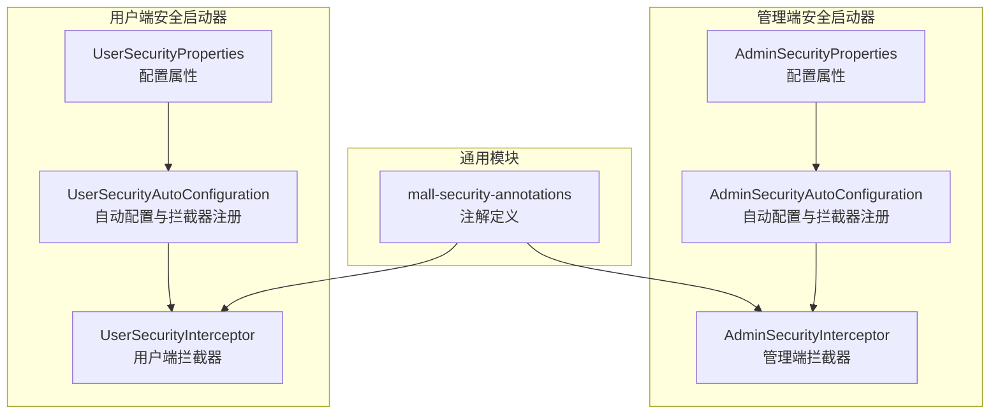
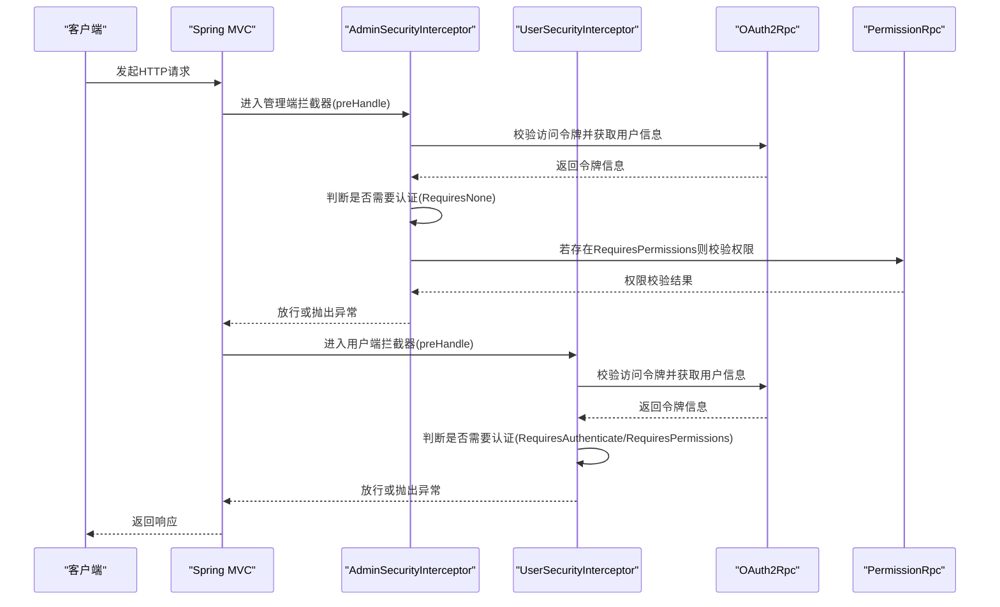
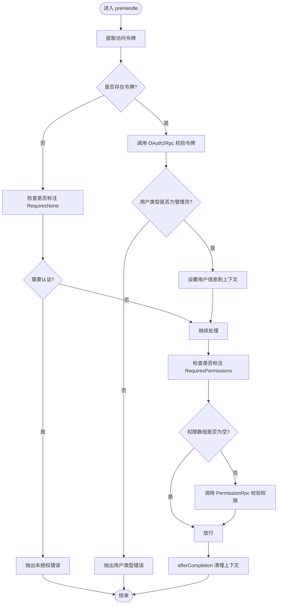
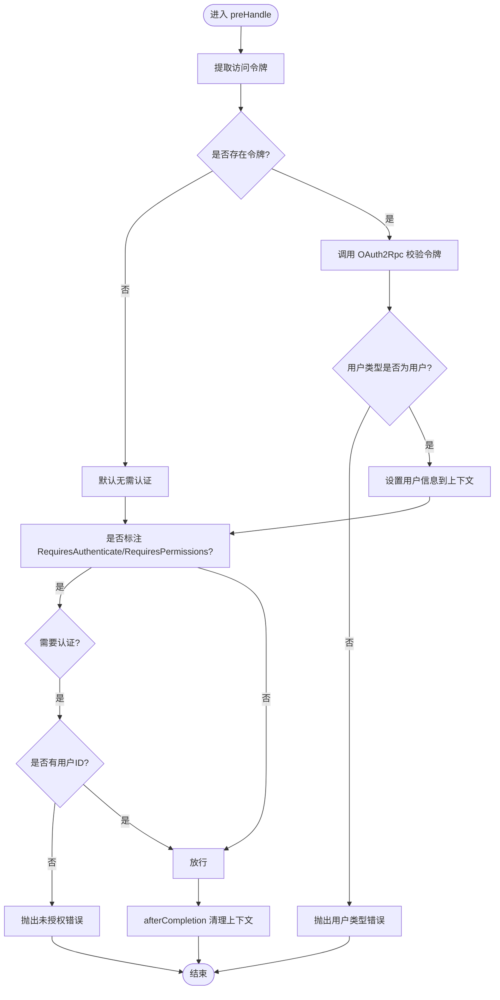
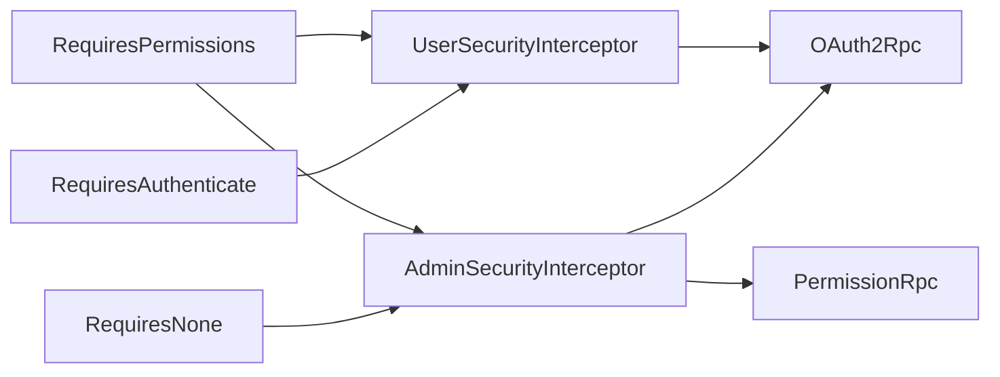

# 安全注解模块

<cite>
**本文引用的文件**
- [RequiresAuthenticate.java](file://common/mall-security-annotations/src/main/java/cn/iocoder/security/annotations/RequiresAuthenticate.java)
- [RequiresNone.java](file://common/mall-security-annotations/src/main/java/cn/iocoder/security/annotations/RequiresNone.java)
- [RequiresPermissions.java](file://common/mall-security-annotations/src/main/java/cn/iocoder/security/annotations/RequiresPermissions.java)
- [AdminSecurityAutoConfiguration.java](file://common/mall-spring-boot-starter-security-admin/src/main/java/cn/iocoder/mall/security/admin/config/AdminSecurityAutoConfiguration.java)
- [UserSecurityAutoConfiguration.java](file://common/mall-spring-boot-starter-security-user/src/main/java/cn/iocoder/mall/security/user/config/UserSecurityAutoConfiguration.java)
- [AdminSecurityInterceptor.java](file://common/mall-spring-boot-starter-security-admin/src/main/java/cn/iocoder/mall/security/admin/core/interceptor/AdminSecurityInterceptor.java)
- [UserSecurityInterceptor.java](file://common/mall-spring-boot-starter-security-user/src/main/java/cn/iocoder/mall/security/user/core/interceptor/UserSecurityInterceptor.java)
- [AdminSecurityProperties.java](file://common/mall-spring-boot-starter-security-admin/src/main/java/cn/iocoder/mall/security/admin/config/AdminSecurityProperties.java)
- [UserSecurityProperties.java](file://common/mall-spring-boot-starter-security-user/src/main/java/cn/iocoder/mall/security/user/config/UserSecurityProperties.java)
</cite>

## 目录
1. [简介](#简介)
2. [项目结构](#项目结构)
3. [核心组件](#核心组件)
4. [架构总览](#架构总览)
5. [详细组件分析](#详细组件分析)
6. [依赖分析](#依赖分析)
7. [性能考量](#性能考量)
8. [故障排查指南](#故障排查指南)
9. [结论](#结论)
10. [附录](#附录)

## 简介
本技术文档聚焦 Onemall 项目中的“安全注解模块”，系统性解析并说明以下三类注解的设计理念与使用场景：
- RequiresAuthenticate：要求用户已认证（已登录）
- RequiresNone：声明接口无需认证
- RequiresPermissions：基于权限标识的授权校验

文档将从注解定义、拦截器执行时机、判断逻辑与权限验证机制入手，结合 Admin 与 User 两条线的拦截器实现，给出在 Controller 层的权限控制示例与最佳实践，并提供常见问题排查建议。

## 项目结构
安全注解模块位于 common 子模块中，配套的 Spring Boot 自动配置与拦截器分别位于 admin 与 user 的安全启动器中。整体结构如下：

图表来源
- [RequiresAuthenticate.java:1-19](file://common/mall-security-annotations/src/main/java/cn/iocoder/security/annotations/RequiresAuthenticate.java#L1-L19)
- [RequiresNone.java:1-13](file://common/mall-security-annotations/src/main/java/cn/iocoder/security/annotations/RequiresNone.java#L1-L13)
- [RequiresPermissions.java:1-25](file://common/mall-security-annotations/src/main/java/cn/iocoder/security/annotations/RequiresPermissions.java#L1-L25)
- [AdminSecurityAutoConfiguration.java:1-61](file://common/mall-spring-boot-starter-security-admin/src/main/java/cn/iocoder/mall/security/admin/config/AdminSecurityAutoConfiguration.java#L1-L61)
- [UserSecurityAutoConfiguration.java:1-48](file://common/mall-spring-boot-starter-security-user/src/main/java/cn/iocoder/mall/security/user/config/UserSecurityAutoConfiguration.java#L1-L48)
- [AdminSecurityInterceptor.java:1-97](file://common/mall-spring-boot-starter-security-admin/src/main/java/cn/iocoder/mall/security/admin/core/interceptor/AdminSecurityInterceptor.java#L1-L97)
- [UserSecurityInterceptor.java:1-78](file://common/mall-spring-boot-starter-security-user/src/main/java/cn/iocoder/mall/security/user/core/interceptor/UserSecurityInterceptor.java#L1-L78)
- [AdminSecurityProperties.java:1-60](file://common/mall-spring-boot-starter-security-admin/src/main/java/cn/iocoder/mall/security/admin/config/AdminSecurityProperties.java#L1-L60)
- [UserSecurityProperties.java:1-42](file://common/mall-spring-boot-starter-security-user/src/main/java/cn/iocoder/mall/security/user/config/UserSecurityProperties.java#L1-L42)

章节来源
- [RequiresAuthenticate.java:1-19](file://common/mall-security-annotations/src/main/java/cn/iocoder/security/annotations/RequiresAuthenticate.java#L1-L19)
- [RequiresNone.java:1-13](file://common/mall-security-annotations/src/main/java/cn/iocoder/security/annotations/RequiresNone.java#L1-L13)
- [RequiresPermissions.java:1-25](file://common/mall-security-annotations/src/main/java/cn/iocoder/security/annotations/RequiresPermissions.java#L1-L25)
- [AdminSecurityAutoConfiguration.java:1-61](file://common/mall-spring-boot-starter-security-admin/src/main/java/cn/iocoder/mall/security/admin/config/AdminSecurityAutoConfiguration.java#L1-L61)
- [UserSecurityAutoConfiguration.java:1-48](file://common/mall-spring-boot-starter-security-user/src/main/java/cn/iocoder/mall/security/user/config/UserSecurityAutoConfiguration.java#L1-L48)

## 核心组件
- 注解定义层
  - RequiresAuthenticate：标注方法要求认证
  - RequiresNone：标注方法无需认证
  - RequiresPermissions：标注方法需要特定权限标识集合
- 拦截器层
  - AdminSecurityInterceptor：管理端拦截器，负责认证与权限校验
  - UserSecurityInterceptor：用户端拦截器，负责认证校验
- 自动配置层
  - AdminSecurityAutoConfiguration：注册拦截器并排除忽略路径
  - UserSecurityAutoConfiguration：注册拦截器并排除忽略路径
- 配置属性层
  - AdminSecurityProperties：管理端忽略路径、演示模式等
  - UserSecurityProperties：用户端忽略路径等

章节来源
- [RequiresAuthenticate.java:1-19](file://common/mall-security-annotations/src/main/java/cn/iocoder/security/annotations/RequiresAuthenticate.java#L1-L19)
- [RequiresNone.java:1-13](file://common/mall-security-annotations/src/main/java/cn/iocoder/security/annotations/RequiresNone.java#L1-L13)
- [RequiresPermissions.java:1-25](file://common/mall-security-annotations/src/main/java/cn/iocoder/security/annotations/RequiresPermissions.java#L1-L25)
- [AdminSecurityInterceptor.java:1-97](file://common/mall-spring-boot-starter-security-admin/src/main/java/cn/iocoder/mall/security/admin/core/interceptor/AdminSecurityInterceptor.java#L1-L97)
- [UserSecurityInterceptor.java:1-78](file://common/mall-spring-boot-starter-security-user/src/main/java/cn/iocoder/mall/security/user/core/interceptor/UserSecurityInterceptor.java#L1-L78)
- [AdminSecurityAutoConfiguration.java:1-61](file://common/mall-spring-boot-starter-security-admin/src/main/java/cn/iocoder/mall/security/admin/config/AdminSecurityAutoConfiguration.java#L1-L61)
- [UserSecurityAutoConfiguration.java:1-48](file://common/mall-spring-boot-starter-security-user/src/main/java/cn/iocoder/mall/security/user/config/UserSecurityAutoConfiguration.java#L1-L48)
- [AdminSecurityProperties.java:1-60](file://common/mall-spring-boot-starter-security-admin/src/main/java/cn/iocoder/mall/security/admin/config/AdminSecurityProperties.java#L1-L60)
- [UserSecurityProperties.java:1-42](file://common/mall-spring-boot-starter-security-user/src/main/java/cn/iocoder/mall/security/user/config/UserSecurityProperties.java#L1-L42)

## 架构总览
下图展示了注解与拦截器在请求生命周期中的交互流程，以及与系统服务的调用关系。

图表来源
- [AdminSecurityInterceptor.java:36-88](file://common/mall-spring-boot-starter-security-admin/src/main/java/cn/iocoder/mall/security/admin/core/interceptor/AdminSecurityInterceptor.java#L36-L88)
- [UserSecurityInterceptor.java:29-69](file://common/mall-spring-boot-starter-security-user/src/main/java/cn/iocoder/mall/security/user/core/interceptor/UserSecurityInterceptor.java#L29-L69)
- [RequiresAuthenticate.java:1-19](file://common/mall-security-annotations/src/main/java/cn/iocoder/security/annotations/RequiresAuthenticate.java#L1-L19)
- [RequiresNone.java:1-13](file://common/mall-security-annotations/src/main/java/cn/iocoder/security/annotations/RequiresNone.java#L1-L13)
- [RequiresPermissions.java:1-25](file://common/mall-security-annotations/src/main/java/cn/iocoder/security/annotations/RequiresPermissions.java#L1-L25)

## 详细组件分析

### RequiresAuthenticate 注解
- 设计理念
  - 明确声明某接口需要“已认证”才能访问
  - 用户端默认无需登录；仅当方法标注该注解或同时标注 RequiresPermissions 时才强制认证
- 执行时机
  - 在用户端拦截器的 preHandle 阶段进行判断
- 判断逻辑
  - 若方法标注 RequiresAuthenticate 或 RequiresPermissions，则视为需要认证
  - 若需要认证且当前无有效用户令牌，则抛出未授权错误
- 典型使用场景
  - 用户中心、订单查询、购物车等需要登录态的接口

章节来源
- [RequiresAuthenticate.java:1-19](file://common/mall-security-annotations/src/main/java/cn/iocoder/security/annotations/RequiresAuthenticate.java#L1-L19)
- [UserSecurityInterceptor.java:60-69](file://common/mall-spring-boot-starter-security-user/src/main/java/cn/iocoder/mall/security/user/core/interceptor/UserSecurityInterceptor.java#L60-L69)

### RequiresNone 注解
- 设计理念
  - 明确声明某接口无需认证即可访问
  - 管理端默认需要认证；若方法标注 RequiresNone，则跳过认证校验
- 执行时机
  - 在管理端拦截器的 preHandle 阶段进行判断
- 判断逻辑
  - 若方法标注 RequiresNone，则即使无令牌也放行
  - 否则若无令牌则抛出未授权错误
- 典型使用场景
  - 管理后台登录页、公开资源等

章节来源
- [RequiresNone.java:1-13](file://common/mall-security-annotations/src/main/java/cn/iocoder/security/annotations/RequiresNone.java#L1-L13)
- [AdminSecurityInterceptor.java:69-74](file://common/mall-spring-boot-starter-security-admin/src/main/java/cn/iocoder/mall/security/admin/core/interceptor/AdminSecurityInterceptor.java#L69-L74)

### RequiresPermissions 注解
- 设计理念
  - 基于权限标识数组进行授权校验
  - 管理端：在认证通过后，对指定权限标识进行校验
  - 用户端：若标注该注解，则视为需要认证
- 执行时机
  - 管理端：在认证校验通过后进行权限校验
  - 用户端：与认证判定合并处理
- 判断逻辑
  - 管理端：若方法标注 RequiresPermissions 且权限数组非空，则调用权限服务进行校验
  - 用户端：标注即视为需要认证
- 典型使用场景
  - 管理后台的新增/删除/修改等敏感操作

章节来源
- [RequiresPermissions.java:1-25](file://common/mall-security-annotations/src/main/java/cn/iocoder/security/annotations/RequiresPermissions.java#L1-L25)
- [AdminSecurityInterceptor.java:76-88](file://common/mall-spring-boot-starter-security-admin/src/main/java/cn/iocoder/mall/security/admin/core/interceptor/AdminSecurityInterceptor.java#L76-L88)
- [UserSecurityInterceptor.java:60-69](file://common/mall-spring-boot-starter-security-user/src/main/java/cn/iocoder/mall/security/user/core/interceptor/UserSecurityInterceptor.java#L60-L69)

### 管理端拦截器（AdminSecurityInterceptor）
- 认证流程
  - 提取 Authorization 令牌
  - 调用 OAuth2Rpc 校验令牌并获取用户类型与用户编号
  - 校验用户类型为管理员
  - 将用户信息写入请求上下文与安全上下文
- 权限流程
  - 若方法标注 RequiresPermissions 且权限数组非空，则调用 PermissionRpc 进行权限校验
- 清理流程
  - 请求完成后清理安全上下文

图表来源
- [AdminSecurityInterceptor.java:36-94](file://common/mall-spring-boot-starter-security-admin/src/main/java/cn/iocoder/mall/security/admin/core/interceptor/AdminSecurityInterceptor.java#L36-L94)

章节来源
- [AdminSecurityInterceptor.java:1-97](file://common/mall-spring-boot-starter-security-admin/src/main/java/cn/iocoder/mall/security/admin/core/interceptor/AdminSecurityInterceptor.java#L1-L97)

### 用户端拦截器（UserSecurityInterceptor）
- 认证流程
  - 提取 Authorization 令牌
  - 调用 OAuth2Rpc 校验令牌并获取用户类型与用户编号
  - 校验用户类型为普通用户
  - 将用户信息写入请求上下文与安全上下文
- 认证判定规则
  - 默认无需认证
  - 方法标注 RequiresAuthenticate 或 RequiresPermissions 时视为需要认证
- 清理流程
  - 请求完成后清理安全上下文

图表来源
- [UserSecurityInterceptor.java:29-75](file://common/mall-spring-boot-starter-security-user/src/main/java/cn/iocoder/mall/security/user/core/interceptor/UserSecurityInterceptor.java#L29-L75)

章节来源
- [UserSecurityInterceptor.java:1-78](file://common/mall-spring-boot-starter-security-user/src/main/java/cn/iocoder/mall/security/user/core/interceptor/UserSecurityInterceptor.java#L1-L78)

### 自动配置与拦截器注册
- 管理端
  - 注册 AdminSecurityInterceptor 与 AdminDemoInterceptor（可选）
  - 支持忽略路径配置，默认排除 Swagger 与 Actuator
- 用户端
  - 注册 UserSecurityInterceptor
  - 支持忽略路径配置，默认排除 Swagger 与 Actuator

章节来源
- [AdminSecurityAutoConfiguration.java:1-61](file://common/mall-spring-boot-starter-security-admin/src/main/java/cn/iocoder/mall/security/admin/config/AdminSecurityAutoConfiguration.java#L1-L61)
- [UserSecurityAutoConfiguration.java:1-48](file://common/mall-spring-boot-starter-security-user/src/main/java/cn/iocoder/mall/security/user/config/UserSecurityAutoConfiguration.java#L1-L48)
- [AdminSecurityProperties.java:1-60](file://common/mall-spring-boot-starter-security-admin/src/main/java/cn/iocoder/mall/security/admin/config/AdminSecurityProperties.java#L1-L60)
- [UserSecurityProperties.java:1-42](file://common/mall-spring-boot-starter-security-user/src/main/java/cn/iocoder/mall/security/user/config/UserSecurityProperties.java#L1-L42)

## 依赖分析
- 注解与拦截器耦合
  - AdminSecurityInterceptor 与 UserSecurityInterceptor 直接依赖注解包中的注解类型
- 外部服务依赖
  - OAuth2Rpc：用于校验访问令牌与获取用户类型/编号
  - PermissionRpc（管理端）：用于权限校验
- 配置依赖
  - AdminSecurityProperties 与 UserSecurityProperties 提供忽略路径与演示模式等配置项

图表来源
- [AdminSecurityInterceptor.java:12-34](file://common/mall-spring-boot-starter-security-admin/src/main/java/cn/iocoder/mall/security/admin/core/interceptor/AdminSecurityInterceptor.java#L12-L34)
- [UserSecurityInterceptor.java:12-27](file://common/mall-spring-boot-starter-security-user/src/main/java/cn/iocoder/mall/security/user/core/interceptor/UserSecurityInterceptor.java#L12-L27)
- [RequiresAuthenticate.java:1-19](file://common/mall-security-annotations/src/main/java/cn/iocoder/security/annotations/RequiresAuthenticate.java#L1-L19)
- [RequiresNone.java:1-13](file://common/mall-security-annotations/src/main/java/cn/iocoder/security/annotations/RequiresNone.java#L1-L13)
- [RequiresPermissions.java:1-25](file://common/mall-security-annotations/src/main/java/cn/iocoder/security/annotations/RequiresPermissions.java#L1-L25)

章节来源
- [AdminSecurityInterceptor.java:1-97](file://common/mall-spring-boot-starter-security-admin/src/main/java/cn/iocoder/mall/security/admin/core/interceptor/AdminSecurityInterceptor.java#L1-L97)
- [UserSecurityInterceptor.java:1-78](file://common/mall-spring-boot-starter-security-user/src/main/java/cn/iocoder/mall/security/user/core/interceptor/UserSecurityInterceptor.java#L1-L78)
- [RequiresAuthenticate.java:1-19](file://common/mall-security-annotations/src/main/java/cn/iocoder/security/annotations/RequiresAuthenticate.java#L1-L19)
- [RequiresNone.java:1-13](file://common/mall-security-annotations/src/main/java/cn/iocoder/security/annotations/RequiresNone.java#L1-L13)
- [RequiresPermissions.java:1-25](file://common/mall-security-annotations/src/main/java/cn/iocoder/security/annotations/RequiresPermissions.java#L1-L25)

## 性能考量
- 拦截器链路开销
  - 每次请求均会进行令牌校验与用户类型校验，建议在网关层统一鉴权以减少重复调用
- 权限校验成本
  - RequiresPermissions 会触发 PermissionRpc 调用，建议对热点接口进行缓存或降级策略
- 上下文设置
  - 在拦截器中设置请求与安全上下文，注意在 afterCompletion 中及时清理，避免内存泄漏

## 故障排查指南
- 未授权错误（401）
  - 管理端：若方法未标注 RequiresNone 且无有效令牌，将抛出未授权错误
  - 用户端：若方法标注 RequiresAuthenticate/RequiresPermissions 且无有效令牌，将抛出未授权错误
- 用户类型错误
  - 令牌对应的用户类型与当前拦截器期望不一致时，将抛出用户类型错误
- 权限不足
  - 管理端：标注 RequiresPermissions 且权限数组非空时，若权限校验失败将抛出错误
- 忽略路径配置
  - 确认 AdminSecurityProperties 与 UserSecurityProperties 的 ignorePaths 与 defaultIgnorePaths 是否覆盖了目标路径

章节来源
- [AdminSecurityInterceptor.java:69-88](file://common/mall-spring-boot-starter-security-admin/src/main/java/cn/iocoder/mall/security/admin/core/interceptor/AdminSecurityInterceptor.java#L69-L88)
- [UserSecurityInterceptor.java:60-69](file://common/mall-spring-boot-starter-security-user/src/main/java/cn/iocoder/mall/security/user/core/interceptor/UserSecurityInterceptor.java#L60-L69)
- [AdminSecurityProperties.java:1-60](file://common/mall-spring-boot-starter-security-admin/src/main/java/cn/iocoder/mall/security/admin/config/AdminSecurityProperties.java#L1-L60)
- [UserSecurityProperties.java:1-42](file://common/mall-spring-boot-starter-security-user/src/main/java/cn/iocoder/mall/security/user/config/UserSecurityProperties.java#L1-L42)

## 结论
Onemall 的安全注解模块通过轻量的注解与拦截器实现了细粒度的权限控制：
- RequiresAuthenticate/RequiresNone 用于控制是否需要认证
- RequiresPermissions 用于基于权限标识的授权校验
- 管理端与用户端分别提供独立的拦截器与自动配置，确保职责清晰、扩展灵活
- 建议在网关层统一鉴权、对热点权限进行缓存，并完善日志与监控，以构建安全可靠的微服务架构

## 附录

### 在 Controller 层的使用示例（步骤说明）
- 管理端示例
  - 新增/删除/修改等敏感接口：标注 RequiresPermissions 并传入所需权限标识数组
  - 登录页等公开接口：标注 RequiresNone，避免强制认证
- 用户端示例
  - 用户中心、订单查询等接口：标注 RequiresAuthenticate 或直接标注 RequiresPermissions
  - 公开展示接口：无需标注注解（默认无需认证）

章节来源
- [RequiresPermissions.java:1-25](file://common/mall-security-annotations/src/main/java/cn/iocoder/security/annotations/RequiresPermissions.java#L1-L25)
- [RequiresAuthenticate.java:1-19](file://common/mall-security-annotations/src/main/java/cn/iocoder/security/annotations/RequiresAuthenticate.java#L1-L19)
- [RequiresNone.java:1-13](file://common/mall-security-annotations/src/main/java/cn/iocoder/security/annotations/RequiresNone.java#L1-L13)
- [AdminSecurityInterceptor.java:76-88](file://common/mall-spring-boot-starter-security-admin/src/main/java/cn/iocoder/mall/security/admin/core/interceptor/AdminSecurityInterceptor.java#L76-L88)
- [UserSecurityInterceptor.java:60-69](file://common/mall-spring-boot-starter-security-user/src/main/java/cn/iocoder/mall/security/user/core/interceptor/UserSecurityInterceptor.java#L60-L69)

### 与 Spring Security 的集成方式
- 当前实现采用基于拦截器的注解式权限控制，未直接依赖 Spring Security 的注解驱动
- 如需与 Spring Security 深度集成，可在现有拦截器基础上引入 Spring Security 的 Filter 链，或替换为基于 @PreAuthorize/@PostAuthorize 的注解方式
- 建议保持注解语义不变，仅调整底层实现与拦截器注册方式

### 扩展自定义权限注解
- 新增注解
  - 参照 RequiresPermissions 的设计，定义新的注解类型与属性
- 拦截器适配
  - 在 AdminSecurityInterceptor 与 UserSecurityInterceptor 中增加对该注解的识别与处理逻辑
- 服务对接
  - 若新注解涉及外部服务校验，需在拦截器中调用对应 RPC 接口并处理返回结果

章节来源
- [RequiresPermissions.java:1-25](file://common/mall-security-annotations/src/main/java/cn/iocoder/security/annotations/RequiresPermissions.java#L1-L25)
- [AdminSecurityInterceptor.java:76-88](file://common/mall-spring-boot-starter-security-admin/src/main/java/cn/iocoder/mall/security/admin/core/interceptor/AdminSecurityInterceptor.java#L76-L88)
- [UserSecurityInterceptor.java:60-69](file://common/mall-spring-boot-starter-security-user/src/main/java/cn/iocoder/mall/security/user/core/interceptor/UserSecurityInterceptor.java#L60-L69)