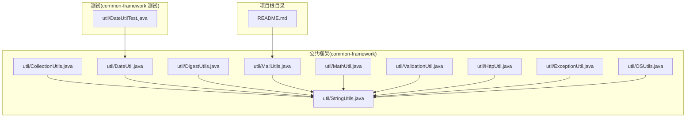
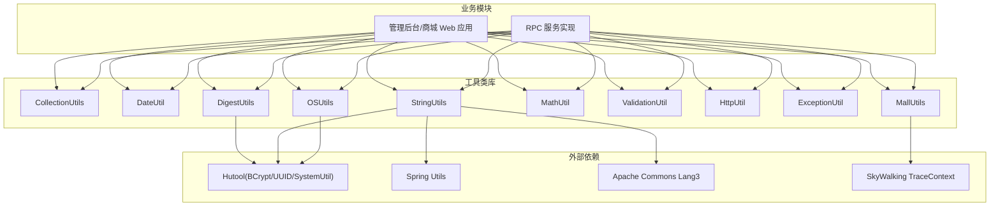
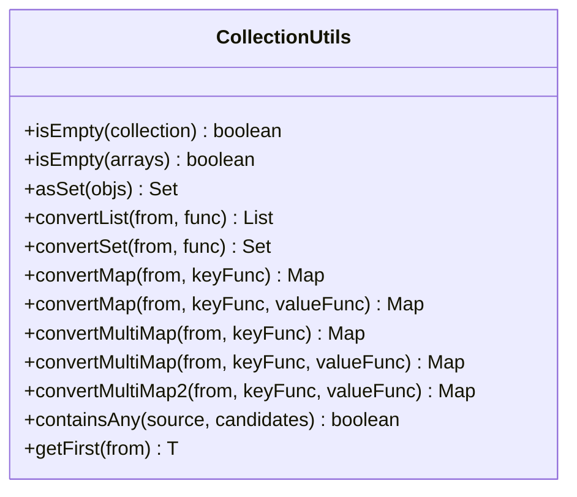
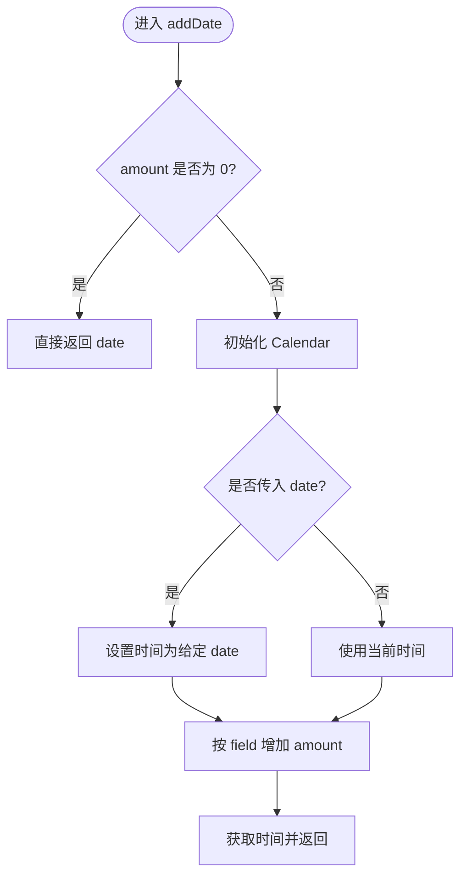
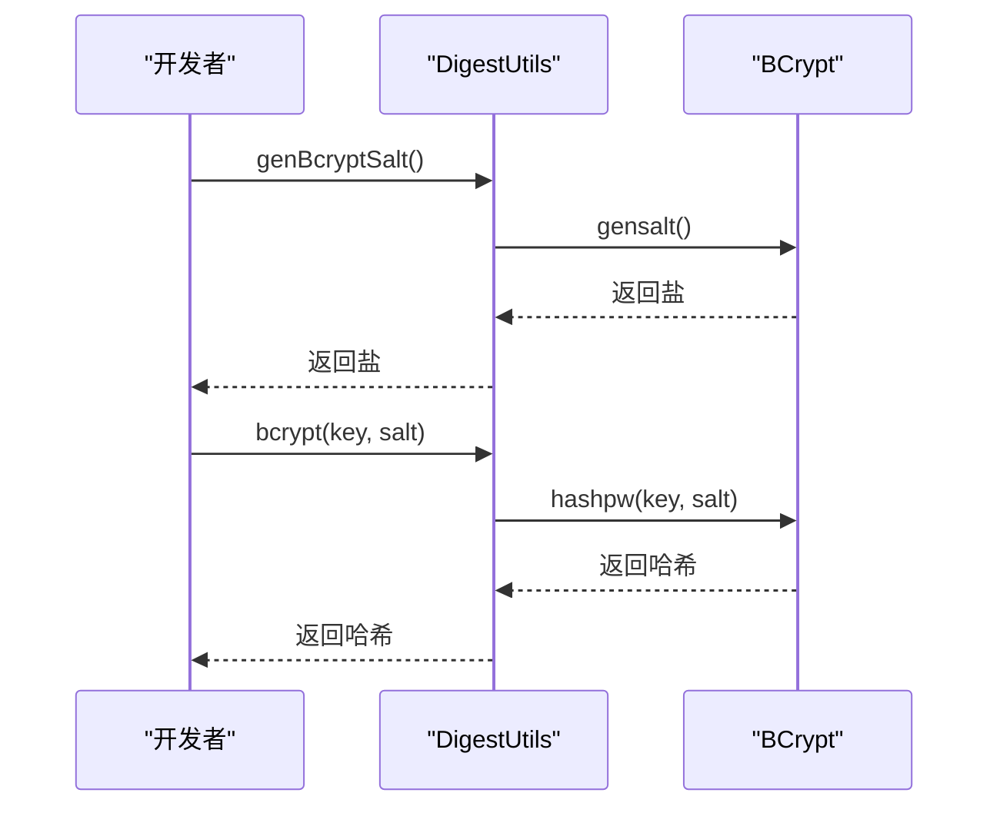
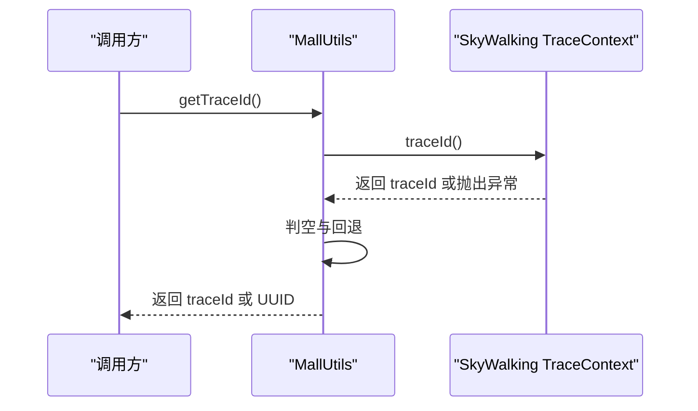
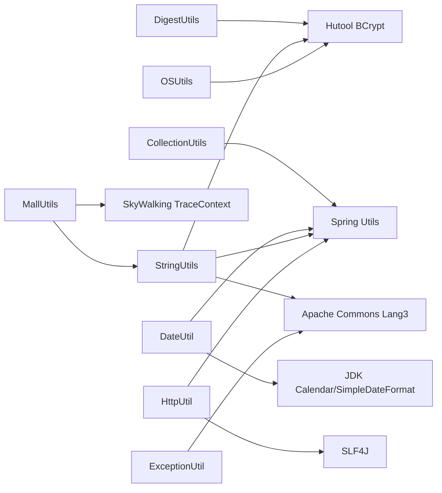

# 工具类库

<cite>
**本文引用的文件**
- [CollectionUtils.java](file://common/common-framework/src/main/java/cn/iocoder/common/framework/util/CollectionUtils.java)
- [DateUtil.java](file://common/common-framework/src/main/java/cn/iocoder/common/framework/util/DateUtil.java)
- [DigestUtils.java](file://common/common-framework/src/main/java/cn/iocoder/common/framework/util/DigestUtils.java)
- [MallUtils.java](file://common/common-framework/src/main/java/cn/iocoder/common/framework/util/MallUtils.java)
- [StringUtils.java](file://common/common-framework/src/main/java/cn/iocoder/common/framework/util/StringUtils.java)
- [MathUtil.java](file://common/common-framework/src/main/java/cn/iocoder/common/framework/util/MathUtil.java)
- [ValidationUtil.java](file://common/common-framework/src/main/java/cn/iocoder/common/framework/util/ValidationUtil.java)
- [HttpUtil.java](file://common/common-framework/src/main/java/cn/iocoder/common/framework/util/HttpUtil.java)
- [ExceptionUtil.java](file://common/common-framework/src/main/java/cn/iocoder/common/framework/util/ExceptionUtil.java)
- [OSUtils.java](file://common/common-framework/src/main/java/cn/iocoder/common/framework/util/OSUtils.java)
- [DateUtilTest.java](file://common/common-framework/src/test/java/cn/iocoder/common/framework/util/DateUtilTest.java)
- [README.md](file://README.md)
</cite>

## 目录
1. [简介](#简介)
2. [项目结构](#项目结构)
3. [核心组件](#核心组件)
4. [架构总览](#架构总览)
5. [详细组件分析](#详细组件分析)
6. [依赖关系分析](#依赖关系分析)
7. [性能考量](#性能考量)
8. [故障排查指南](#故障排查指南)
9. [结论](#结论)
10. [附录](#附录)

## 简介
本文件面向 Onemall 项目的工具类库，重点覆盖以下工具类：
- 集合操作工具：CollectionUtils
- 日期处理工具：DateUtil
- 加密工具：DigestUtils
- 业务工具：MallUtils
- 字符串与数学工具：StringUtils、MathUtil
- 校验工具：ValidationUtil
- HTTP 工具：HttpUtil
- 异常工具：ExceptionUtil
- 操作系统工具：OSUtils

文档将从系统架构、组件关系、数据流、处理逻辑、集成点、错误处理与性能特性等方面进行深入解析，并提供丰富的使用场景与最佳实践建议，帮助开发者在电商场景中高效选择与使用合适的工具类。

## 项目结构
Onemall 采用多模块微服务架构，工具类集中位于公共框架模块 common/common-framework 中，便于各业务模块复用。工具类库位于 util 包下，按功能域划分，职责清晰、边界明确。

图表来源
- [CollectionUtils.java:1-61](file://common/common-framework/src/main/java/cn/iocoder/common/framework/util/CollectionUtils.java#L1-L61)
- [DateUtil.java:1-147](file://common/common-framework/src/main/java/cn/iocoder/common/framework/util/DateUtil.java#L1-L147)
- [DigestUtils.java:1-27](file://common/common-framework/src/main/java/cn/iocoder/common/framework/util/DigestUtils.java#L1-L27)
- [MallUtils.java:1-31](file://common/common-framework/src/main/java/cn/iocoder/common/framework/util/MallUtils.java#L1-L31)
- [StringUtils.java:1-40](file://common/common-framework/src/main/java/cn/iocoder/common/framework/util/StringUtils.java#L1-L40)
- [MathUtil.java:1-34](file://common/common-framework/src/main/java/cn/iocoder/common/framework/util/MathUtil.java#L1-L34)
- [ValidationUtil.java:1-30](file://common/common-framework/src/main/java/cn/iocoder/common/framework/util/ValidationUtil.java#L1-L30)
- [HttpUtil.java:1-320](file://common/common-framework/src/main/java/cn/iocoder/common/framework/util/HttpUtil.java#L1-L320)
- [ExceptionUtil.java:1-20](file://common/common-framework/src/main/java/cn/iocoder/common/framework/util/ExceptionUtil.java#L1-L20)
- [OSUtils.java:1-15](file://common/common-framework/src/main/java/cn/iocoder/common/framework/util/OSUtils.java#L1-L15)
- [DateUtilTest.java:1-62](file://common/common-framework/src/test/java/cn/iocoder/common/framework/util/DateUtilTest.java#L1-L62)
- [README.md:1-213](file://README.md#L1-L213)

章节来源
- [README.md:107-139](file://README.md#L107-L139)

## 核心组件
本节概述工具类库中各工具类的定位与职责：
- CollectionUtils：提供集合判空、集合转换、映射构建、多值映射、元素获取等通用集合操作。
- DateUtil：提供日期加减、格式化、当日起止时间计算、时间区间判断、最大值比较等日期处理。
- DigestUtils：提供 BCrypt 密码加盐与哈希生成，用于安全存储用户密码。
- MallUtils：提供链路追踪编号获取，优先使用 SkyWalking 的 traceId，否则回退到 UUID。
- StringUtils：提供文本判空、集合拼接、字符串分割、子串截取、UUID 生成等字符串处理。
- MathUtil：提供随机数生成，支持闭区间[min, max]。
- ValidationUtil：提供手机号与 URL 校验等基础校验逻辑。
- HttpUtil：提供 Authorization 提取、IP 获取、UA 获取、请求路径与查询串拼接、URI 规范化等 HTTP 相关工具。
- ExceptionUtil：提供异常消息、根因消息、堆栈信息提取。
- OSUtils：提供主机名获取。

章节来源
- [CollectionUtils.java:1-61](file://common/common-framework/src/main/java/cn/iocoder/common/framework/util/CollectionUtils.java#L1-L61)
- [DateUtil.java:1-147](file://common/common-framework/src/main/java/cn/iocoder/common/framework/util/DateUtil.java#L1-L147)
- [DigestUtils.java:1-27](file://common/common-framework/src/main/java/cn/iocoder/common/framework/util/DigestUtils.java#L1-L27)
- [MallUtils.java:1-31](file://common/common-framework/src/main/java/cn/iocoder/common/framework/util/MallUtils.java#L1-L31)
- [StringUtils.java:1-40](file://common/common-framework/src/main/java/cn/iocoder/common/framework/util/StringUtils.java#L1-L40)
- [MathUtil.java:1-34](file://common/common-framework/src/main/java/cn/iocoder/common/framework/util/MathUtil.java#L1-L34)
- [ValidationUtil.java:1-30](file://common/common-framework/src/main/java/cn/iocoder/common/framework/util/ValidationUtil.java#L1-L30)
- [HttpUtil.java:1-320](file://common/common-framework/src/main/java/cn/iocoder/common/framework/util/HttpUtil.java#L1-L320)
- [ExceptionUtil.java:1-20](file://common/common-framework/src/main/java/cn/iocoder/common/framework/util/ExceptionUtil.java#L1-L20)
- [OSUtils.java:1-15](file://common/common-framework/src/main/java/cn/iocoder/common/framework/util/OSUtils.java#L1-L15)

## 架构总览
工具类库在系统中的作用是“基础设施层”，向上支撑各业务模块的通用需求，向下依赖第三方库（如 Hutool、Apache Commons、Spring 工具）。其交互关系如下：

图表来源
- [DigestUtils.java:1-27](file://common/common-framework/src/main/java/cn/iocoder/common/framework/util/DigestUtils.java#L1-L27)
- [MallUtils.java:1-31](file://common/common-framework/src/main/java/cn/iocoder/common/framework/util/MallUtils.java#L1-L31)
- [StringUtils.java:1-40](file://common/common-framework/src/main/java/cn/iocoder/common/framework/util/StringUtils.java#L1-L40)
- [OSUtils.java:1-15](file://common/common-framework/src/main/java/cn/iocoder/common/framework/util/OSUtils.java#L1-L15)

## 详细组件分析

### CollectionUtils 集合操作工具
- 功能概览
  - 判空：支持 Collection 与数组判空。
  - 构造：快速将可变参数转为 Set。
  - 转换：支持 List/集合到 List/Set 的映射转换。
  - 映射：支持单键映射与键值映射；支持多值映射（List/Set）。
  - 检索：基于 Spring 工具的包含关系判断；获取首元素。
- 关键方法与签名要点
  - isEmpty(Collection)、isEmpty(Object[])：判空。
  - asSet(T...)：构造 Set。
  - convertList(List<T>, Function<T, U>)：映射为 List。
  - convertSet(List<T>, Function<T, U>)：映射为 Set。
  - convertMap(List<T>, Function<T, K>)：单键映射。
  - convertMap(List<T>, Function<T, K>, Function<T, V>)：键值映射。
  - convertMultiMap(...) / convertMultiMap2(...)：多值映射（List/Set）。
  - containsAny(...)：包含关系判断。
  - getFirst(List<T>)：获取首元素或 null。
- 使用场景
  - DTO/BO 转换、主键收集、分组统计、去重与聚合。
- 性能与注意
  - Stream 转换在大数据量时需关注内存与 GC；必要时可考虑批量处理或惰性流。
  - 多值映射默认使用 groupingBy + mapping，注意键重复与空值处理。

图表来源
- [CollectionUtils.java:1-61](file://common/common-framework/src/main/java/cn/iocoder/common/framework/util/CollectionUtils.java#L1-L61)

章节来源
- [CollectionUtils.java:1-61](file://common/common-framework/src/main/java/cn/iocoder/common/framework/util/CollectionUtils.java#L1-L61)

### DateUtil 日期处理工具
- 功能概览
  - 日期加减：支持相对偏移（field/amount）。
  - 格式化：按模式格式化日期，空值返回空串。
  - 当日起止：获取某日开始与结束时间。
  - 时间区间：判断当前时间是否在给定区间内。
  - 最大值：比较两个日期取较大者。
- 关键方法与签名要点
  - addDate(field, amount) / addDate(date, field, amount)：日期加减。
  - format(date, pattern)：格式化。
  - getDayBegin()/getDayBegin(date)、getDayEnd()/getDayEnd(date)：当日起止。
  - isBetween(beginTime, endTime)：区间判断。
  - setCalender(calendar, hour, minute, second, milliSecond)：设置时分秒毫秒。
  - max(a, b)：日期最大值。
- 使用场景
  - 订单有效期计算、报表统计周期、活动时间窗口校验。
- 性能与注意
  - SimpleDateFormat 非线程安全，当前实现每次新建实例；建议在高频场景下引入缓存策略或使用 ThreadLocal/SimpleDateFormat 的线程安全替代方案。
  - getDayBegin/getDayEnd 会构造 Calendar 并设置时间，频繁调用时可考虑复用 Calendar 或使用现代时间 API。

图表来源
- [DateUtil.java:18-40](file://common/common-framework/src/main/java/cn/iocoder/common/framework/util/DateUtil.java#L18-L40)

章节来源
- [DateUtil.java:1-147](file://common/common-framework/src/main/java/cn/iocoder/common/framework/util/DateUtil.java#L1-L147)
- [DateUtilTest.java:1-62](file://common/common-framework/src/test/java/cn/iocoder/common/framework/util/DateUtilTest.java#L1-L62)

### DigestUtils 加密工具
- 功能概览
  - 生成 BCrypt 盐：genBcryptSalt()。
  - BCrypt 哈希：bcrypt(key, salt)。
- 关键方法与签名要点
  - genBcryptSalt()：返回盐字符串。
  - bcrypt(key, salt)：返回哈希结果。
- 使用场景
  - 用户密码安全存储、令牌签名校验。
- 性能与注意
  - BCrypt 成本因子影响性能，需根据硬件与安全需求权衡；生产环境建议配置成本因子并在启动时固定。
  - 盐应随机生成并与哈希结果一同存储，避免明文存储。

图表来源
- [DigestUtils.java:1-27](file://common/common-framework/src/main/java/cn/iocoder/common/framework/util/DigestUtils.java#L1-L27)

章节来源
- [DigestUtils.java:1-27](file://common/common-framework/src/main/java/cn/iocoder/common/framework/util/DigestUtils.java#L1-L27)

### MallUtils 业务工具
- 功能概览
  - 获取链路追踪编号：优先使用 SkyWalking 的 traceId，若不可用则回退到 UUID。
- 关键方法与签名要点
  - getTraceId()：返回 traceId 或 UUID 字符串。
- 使用场景
  - 日志关联、错误追踪、跨服务链路定位。
- 性能与注意
  - try-catch 回退避免异常传播；多次调用会产生新 UUID，注意调用频率与性能开销。

图表来源
- [MallUtils.java:1-31](file://common/common-framework/src/main/java/cn/iocoder/common/framework/util/MallUtils.java#L1-L31)

章节来源
- [MallUtils.java:1-31](file://common/common-framework/src/main/java/cn/iocoder/common/framework/util/MallUtils.java#L1-L31)
- [README.md:189-191](file://README.md#L189-L191)

### StringUtils 字符串工具
- 功能概览
  - 文本判空：hasText。
  - 集合拼接：join。
  - 字符串分割：split、splitToInt。
  - 子串截取：substring。
  - UUID 生成：uuid。
- 关键方法与签名要点
  - hasText(str)：判空。
  - join(coll, delim)：集合拼接。
  - split(toSplit, delim)：返回 List<String>。
  - splitToInt(toSplit, delim)：返回 List<Integer>。
  - substring(str, start)：截取。
  - uuid(isSimple)：生成 UUID。
- 使用场景
  - 参数拼接、ID 列表处理、日志输出、唯一标识生成。
- 性能与注意
  - splitToInt 需要遍历并装箱，大数据量时建议直接使用原生数组或流式处理。

章节来源
- [StringUtils.java:1-40](file://common/common-framework/src/main/java/cn/iocoder/common/framework/util/StringUtils.java#L1-L40)

### MathUtil 数学工具
- 功能概览
  - 随机数生成：random(min, max)，支持闭区间[min, max]。
- 关键方法与签名要点
  - random(min, max)：返回随机整数。
- 使用场景
  - 活动抽奖、验证码生成、测试数据构造。
- 性能与注意
  - 静态 Random 实例减少对象创建；注意并发安全（如多线程高并发场景可考虑 ThreadLocalRandom）。

章节来源
- [MathUtil.java:1-34](file://common/common-framework/src/main/java/cn/iocoder/common/framework/util/MathUtil.java#L1-L34)

### ValidationUtil 校验工具
- 功能概览
  - 手机号校验：isMobile。
  - URL 校验：isURL。
- 关键方法与签名要点
  - isMobile(mobile)：长度与格式基础校验。
  - isURL(url)：正则匹配。
- 使用场景
  - 输入参数校验、数据清洗。
- 性能与注意
  - 正则编译仅一次，后续复用；建议在类加载时预编译 Pattern。

章节来源
- [ValidationUtil.java:1-30](file://common/common-framework/src/main/java/cn/iocoder/common/framework/util/ValidationUtil.java#L1-L30)

### HttpUtil HTTP 工具
- 功能概览
  - Authorization 提取：obtainAuthorization。
  - IP 获取：支持 X-Forwarded-For、X-Real-IP。
  - UA 获取：getUserAgent。
  - 查询串拼接：buildQueryString。
  - 请求路径与 URI 规范化：getPathWithinApplication、getRequestUri、normalize、getContextPath、decodeRequestString。
- 关键方法与签名要点
  - obtainAuthorization(request)：返回 Bearer Token。
  - getIp(request)：返回真实 IP。
  - getUserAgent(request)：返回 UA。
  - buildQueryString(request)：拼接查询串。
  - getPathWithinApplication(request)、getRequestUri(request)、normalize(path)、getContextPath(request)、decodeRequestString(request, source)。
- 使用场景
  - 安全鉴权、访问统计、日志采集、请求路由。
- 性能与注意
  - normalize 与 decode 过程涉及多次字符串替换，建议在高频场景下缓存结果或限制调用频次。

章节来源
- [HttpUtil.java:1-320](file://common/common-framework/src/main/java/cn/iocoder/common/framework/util/HttpUtil.java#L1-L320)

### ExceptionUtil 异常工具
- 功能概览
  - 获取异常消息：getMessage。
  - 获取根因消息：getRootCauseMessage。
  - 获取堆栈信息：getStackTrace。
- 关键方法与签名要点
  - getMessage(th)、getRootCauseMessage(th)、getStackTrace(th)。
- 使用场景
  - 错误日志记录、异常上报、诊断信息输出。
- 性能与注意
  - 堆栈信息生成成本较高，建议仅在错误分支或调试阶段使用。

章节来源
- [ExceptionUtil.java:1-20](file://common/common-framework/src/main/java/cn/iocoder/common/framework/util/ExceptionUtil.java#L1-L20)

### OSUtils 操作系统工具
- 功能概览
  - 获取主机名：getHostName。
- 关键方法与签名要点
  - getHostName()：返回主机名。
- 使用场景
  - 日志标识、运维监控、环境区分。
- 性能与注意
  - 依赖系统信息获取，通常开销较小。

章节来源
- [OSUtils.java:1-15](file://common/common-framework/src/main/java/cn/iocoder/common/framework/util/OSUtils.java#L1-L15)

## 依赖关系分析
- 内部依赖
  - CollectionUtils 依赖 Spring 工具进行包含关系判断；依赖 Java Stream 进行转换与分组。
  - DateUtil 依赖 Spring 断言与 JDK Calendar/SimpleDateFormat。
  - DigestUtils 依赖 Hutool 的 BCrypt。
  - MallUtils 依赖 SkyWalking 的 TraceContext 与 StringUtils。
  - StringUtils 依赖 Spring 工具与 Hutool UUID、Apache Commons Lang3。
  - HttpUtil 依赖 Servlet API、Spring 工具、SLF4J。
  - ExceptionUtil 依赖 Apache Commons Lang3。
  - OSUtils 依赖 Hutool SystemUtil。
- 外部依赖
  - Hutool：BCrypt、UUID、SystemUtil。
  - Spring：Utils、Servlet API、SLF4J。
  - Apache Commons：Lang3、Lang3 ExceptionUtils。
  - SkyWalking：TraceContext。

图表来源
- [CollectionUtils.java:1-61](file://common/common-framework/src/main/java/cn/iocoder/common/framework/util/CollectionUtils.java#L1-L61)
- [DateUtil.java:1-147](file://common/common-framework/src/main/java/cn/iocoder/common/framework/util/DateUtil.java#L1-L147)
- [DigestUtils.java:1-27](file://common/common-framework/src/main/java/cn/iocoder/common/framework/util/DigestUtils.java#L1-L27)
- [MallUtils.java:1-31](file://common/common-framework/src/main/java/cn/iocoder/common/framework/util/MallUtils.java#L1-L31)
- [StringUtils.java:1-40](file://common/common-framework/src/main/java/cn/iocoder/common/framework/util/StringUtils.java#L1-L40)
- [HttpUtil.java:1-320](file://common/common-framework/src/main/java/cn/iocoder/common/framework/util/HttpUtil.java#L1-L320)
- [ExceptionUtil.java:1-20](file://common/common-framework/src/main/java/cn/iocoder/common/framework/util/ExceptionUtil.java#L1-L20)
- [OSUtils.java:1-15](file://common/common-framework/src/main/java/cn/iocoder/common/framework/util/OSUtils.java#L1-L15)

## 性能考量
- 线程安全
  - SimpleDateFormat 非线程安全，建议在高频场景下使用 ThreadLocal 或替换为现代时间 API。
  - Random 静态实例可减少对象创建，但需注意并发安全；高并发场景建议使用 ThreadLocalRandom。
- I/O 与字符串处理
  - HttpUtil 的 normalize/decode 过程涉及多次字符串替换，建议在高频场景下缓存结果或限制调用频次。
  - StringUtils.splitToInt 需要遍历与装箱，大数据量时建议直接使用原生数组或流式处理。
- 加密与哈希
  - BCrypt 成本因子影响性能，需根据硬件与安全需求权衡；建议在启动时固定成本因子。
- 链路追踪
  - MallUtils 的 getTraceId 在回退到 UUID 时会产生新 ID，注意调用频率与性能开销。

## 故障排查指南
- 日期格式化为空
  - 现象：format(null, pattern) 返回空串。
  - 排查：确认输入 date 是否为 null；检查 pattern 是否正确。
- 日期区间判断异常
  - 现象：isBetween(beginTime, endTime) 判定不符合预期。
  - 排查：确认 beginTime 与 endTime 非空；检查当前时间与两者的关系。
- IP 获取异常
  - 现象：getIp(request) 返回非真实 IP。
  - 排查：确认请求头 X-Forwarded-For/X-Real-IP 是否存在且有效；检查代理链顺序。
- 链路追踪编号缺失
  - 现象：getTraceId() 返回 UUID。
  - 排查：确认 SkyWalking 是否接入；检查 TraceContext 是否可用。
- 异常信息输出
  - 现象：日志中缺少根因信息。
  - 排查：使用 ExceptionUtil.getRootCauseMessage 获取根因；确保异常栈完整。

章节来源
- [DateUtilTest.java:1-62](file://common/common-framework/src/test/java/cn/iocoder/common/framework/util/DateUtilTest.java#L1-L62)
- [HttpUtil.java:1-320](file://common/common-framework/src/main/java/cn/iocoder/common/framework/util/HttpUtil.java#L1-L320)
- [MallUtils.java:1-31](file://common/common-framework/src/main/java/cn/iocoder/common/framework/util/MallUtils.java#L1-L31)
- [ExceptionUtil.java:1-20](file://common/common-framework/src/main/java/cn/iocoder/common/framework/util/ExceptionUtil.java#L1-L20)

## 结论
Onemall 的工具类库以“基础设施”为核心，围绕集合、日期、加密、HTTP、异常、操作系统等维度提供了高内聚、低耦合的工具能力。通过合理选择与组合这些工具类，可以在电商场景中高效完成常见业务逻辑处理。同时，针对线程安全、I/O 与字符串处理、加密成本、链路追踪等关键性能点，建议在生产环境中进行针对性优化与监控。

## 附录
- 常见使用场景速查
  - 集合转换：DTO/BO 转换、主键收集、分组统计。
  - 日期处理：订单有效期、报表周期、活动窗口。
  - 加密：密码存储、令牌签名校验。
  - HTTP：鉴权、IP/UA 获取、请求路径规范化。
  - 异常：错误日志、根因定位。
  - 链路追踪：日志关联、跨服务定位。
  - 字符串与随机：参数拼接、唯一标识、测试数据。